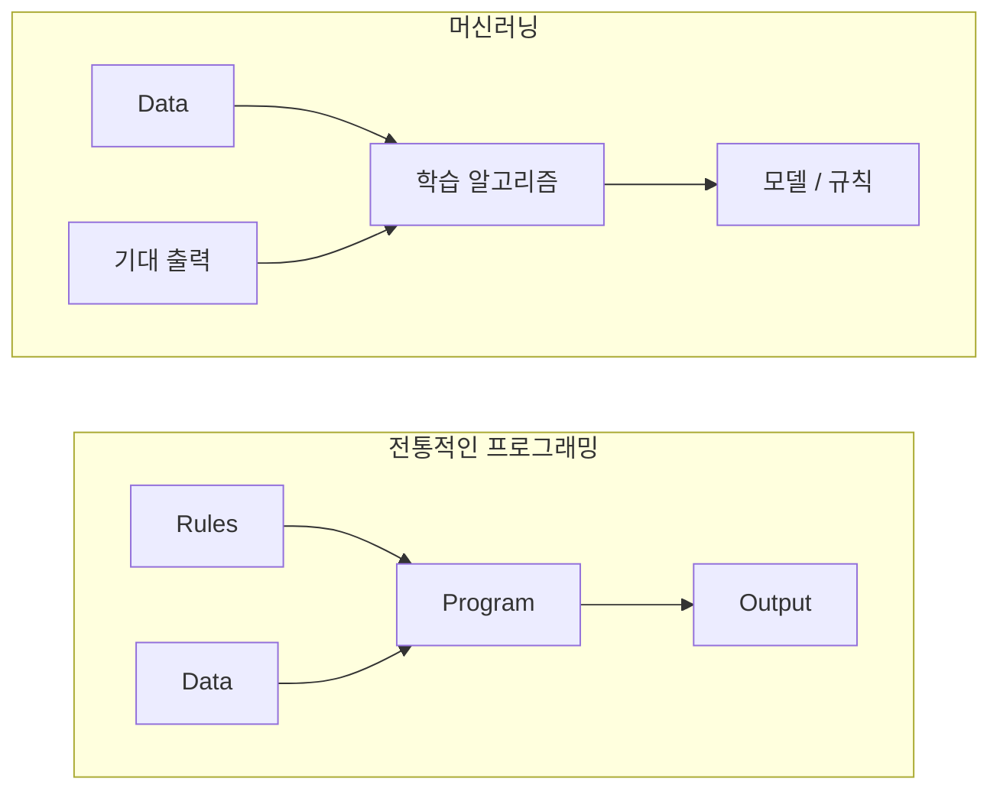
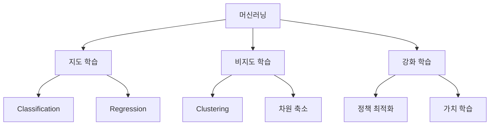
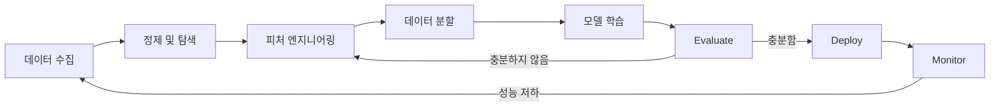
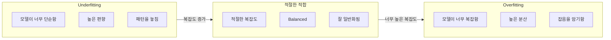
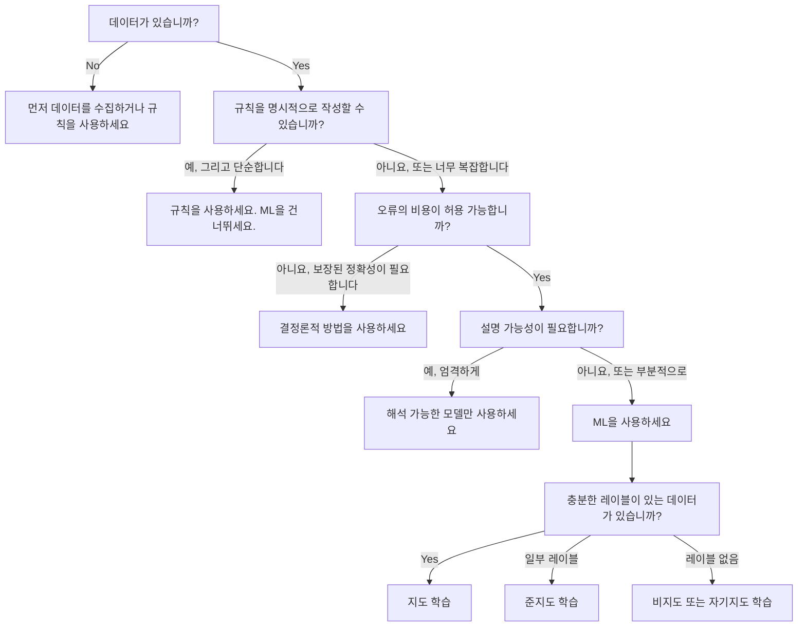

# 머신러닝이란 무엇인가

> 머신러닝은 수동으로 규칙을 작성하는 대신, 컴퓨터가 데이터에서 패턴을 찾도록 가르치는 것입니다.

**유형:** Learn
**언어:** Python
**선수 요건:** 1단계 (수학 기초)
**시간:** 약 45분

## 학습 목표

- 지도 학습, 비지도 학습, 강화 학습의 차이를 설명하고, 주어진 문제에 어떤 유형이 적용되는지 식별해 보세요
- 가장 가까운 중심점 분류기(nearest centroid classifier)를 처음부터 구현하고, 랜덤 기준선(random baseline)과 비교하여 평가해 보세요
- 분류(classification)와 회귀(regression) 작업의 차이를 구분하고, 각 작업에 적합한 손실 함수(loss function)를 선택해 보세요
- 주어진 비즈니스 문제가 머신러닝에 적합한지, 아니면 결정론적 규칙(deterministic rules)으로 더 잘 해결되는지 평가해 보세요

## 문제점

스팸 필터를 구축하고 싶다고 가정해 보세요. 전통적인 접근 방식은 앉아서 수백 개의 규칙을 작성하는 것입니다. "이메일에 'FREE MONEY'가 포함되면 스팸으로 표시하세요. 느낌표가 3개 이상 있으면 스팸으로 표시하세요." 규칙 작성에 몇 주를 보내게 됩니다. 그런데 스팸 발송자들이 표현을 바꾸면 규칙이 깨집니다. 더 많은 규칙을 작성해야 합니다. 이 순환은 끝나지 않습니다.

머신러닝은 이 방식을 뒤집습니다. 규칙을 작성하는 대신, 컴퓨터에 수천 개의 라벨이 붙은 이메일("스팸" 또는 "스팸 아님")을 주고, 컴퓨터가 스스로 규칙을 찾게 합니다. 컴퓨터는 당신이 상상하지 못했던 패턴을 찾아냅니다. 스팸 발송자들이 전술을 바꾸면, 코드를 다시 작성하는 대신 새로운 데이터로 재학습(retrain)합니다.

"규칙을 프로그래밍하는 것"에서 "데이터로부터 학습하는 것"으로의 전환이 머신러닝의 핵심입니다. 모든 추천 엔진, 음성 비서, 자율 주행 자동차, 언어 모델이 이 방식으로 작동합니다.

## 개념

### 규칙이 아닌 데이터로부터 학습하기

전통적인 프로그래밍과 머신러닝은 문제를 정반대의 방향으로 해결합니다.



전통적인 프로그래밍: 당신이 규칙을 작성합니다. 프로그램이 데이터를 적용하여 출력을 생성합니다.

머신러닝: 데이터와 기대 출력값을 제공합니다. 알고리즘이 규칙을 발견합니다.

학습 과정에서 생성되는 "모델"은 규칙 그 자체이며, 숫자(가중치, 매개변수)로 인코딩됩니다. 학습된 예시로부터 일반화하여 본 적 없는 데이터에 대한 예측을 수행합니다.

### 머신러닝의 세 가지 유형



**지도 학습**: 입력-출력 쌍이 있습니다. 모델은 입력을 출력에 매핑하는 방법을 학습합니다.
- "고양이 또는 개로 라벨링된 사진 10,000장이 있습니다. 이들을 구분하는 방법을 학습하세요."
- "주택의 특징과 가격이 있습니다. 가격을 예측하는 방법을 학습하세요."

**비지도 학습**: 입력만 있습니다. 라벨이 없습니다. 모델은 스스로 구조를 찾습니다.
- "고객 구매 이력 10,000건이 있습니다. 자연스러운 그룹을 찾아보세요."
- "1,000차원 데이터 포인트가 있습니다. 구조를 유지하면서 2차원으로 축소하세요."

**강화 학습**: 에이전트(Agent)가 환경에서 행동을 취하고 보상 또는 벌점을 받습니다. 총 보상을 극대화하는 전략(정책)을 학습합니다.
- "이 게임을 하세요. 승리하면 +1, 패배하면 -1입니다. 전략을 찾아보세요."
- "이 로봇 팔을 제어하세요. 물건을 집으면 +1, 낭비된 시간 초당 -0.01입니다."

실제로 구축하는 대부분의 작업은 지도 학습을 사용합니다. 비지도 학습은 전처리와 탐색에 자주 사용됩니다. 강화 학습은 게임 AI, 로봇공학, 언어 모델의 RLHF (인간 피드백 기반 강화 학습)(RLHF (Reinforcement Learning from Human Feedback))를 구동합니다.

### 세 가지 주요 유형을 넘어

위 세 가지 범주는 명확하지만, 실제 머신러닝에서는 경계가 모호한 경우가 많습니다.

**반지도 학습**은 소량의 라벨링된 데이터와 대량의 비라벨링된 데이터를 사용합니다. 라벨링된 의료 이미지 100장과 비라벨링된 이미지 100,000장이 있을 수 있습니다. 기법으로는 다음이 포함됩니다:

- **라벨 전파:** 유사한 데이터 포인트를 연결하는 그래프를 구축합니다. 라벨은 그래프를 통해 라벨링된 노드에서 비라벨링된 이웃 노드로 전파됩니다.
- **유사 레이블링(Pseudo-labeling):** 레이블이 지정된 데이터로 모델을 학습하고, 이를 사용하여 레이블이 없는 데이터에 대한 레이블을 예측한 후 모든 데이터로 다시 학습합니다. 모델이 자신의 학습 데이터를 부트스트랩합니다.
- **일관성 정규화(Consistency regularization):** 모델은 입력과 그 입력을 약간 변형한 버전 대해 동일한 예측을 해야 합니다. 이는 레이블이 없어도 작동합니다.

**자기 지도 학습(Self-supervised learning)**은 데이터 자체로부터 지도 신호를 생성합니다. 인간의 레이블이 전혀 필요하지 않습니다. 모델은 데이터의 구조로부터 자체적인 예측 작업을 생성합니다.

- **마스킹된 언어 모델링(Masked language modeling, BERT):** 문장에서 단어의 15%를 숨기고, 모델이 누락된 단어를 예측하도록 학습합니다. "레이블"은 원본 텍스트에서 나옵니다.
- **대조 학습(Contrastive learning, SimCLR):** 이미지를 가져와 두 개의 증강된 버전을 만듭니다. 모델이 같은 이미지에서 왔음을 인식하면서도 다른 이미지의 증강 버전과 구별하도록 학습합니다.
- **다음 토큰 예측(Next-token prediction, GPT):** 이전 모든 단어를 고려하여 다음 단어를 예측합니다. 모든 텍스트 문서가 학습 예제가 됩니다.

이것들은 세 가지 주요 범주와 분리된 범주가 아닙니다. 지도 학습과 비지도 학습의 아이디어를 결합하는 전략입니다. 자기 지도 학습은 기술적으로 지도 학습입니다(모델이 무언가를 예측함), 하지만 레이블은 인간이 아닌 자동으로 생성됩니다.

### 분류 vs 회귀

이것은 두 가지 주요 지도 학습 작업입니다.

| 측면 | 분류 | 회귀 |
|--------|---------------|------------|
| 출력 | 이산 범주 | 연속 숫자 |
| 예시 | "이 이메일은 스팸인가요?" | "집의 가격은 얼마일까요?" |
| 출력 공간 | {cat, dog, bird} | 임의의 실수 |
| 손실 함수 | 교차 엔트로피, 정확도 | 평균 제곱 오차, MAE |
| 결정 | 클래스 간의 경계 | 데이터에 맞는 곡선 |

분류는 "어떤 범주?"에 답하고, 회귀는 "얼마?"에 답합니다.

일부 문제는 두 가지 방식으로 프레이밍할 수 있습니다. 주식의 상승/하락을 예측하는 것은 분류입니다. 정확한 가격을 예측하는 것은 회귀입니다.

### ML 워크플로우

모든 머신러닝 프로젝트는 알고리즘에 관계없이 동일한 파이프라인을 따릅니다.



**데이터 수집**: 원시 데이터를 수집합니다. 데이터가 많을수록 거의 항상 더 좋지만, 양보다 질이 더 중요합니다.

**정제 및 탐색**: 결측 값을 처리하고, 중복을 제거하며, 분포를 시각화하고, 이상치를 발견합니다. 이 단계는 전체 프로젝트 시간의 60-80%를 차지하는 경우가 많습니다.

**피처 엔지니어링**: 원시 데이터를 모델이 사용할 수 있는 피처로 변환합니다. 날짜를 요일로 변환하고, 수치 열을 정규화하며, 범주형 변수를 인코딩합니다. 좋은 피처는 화려한 알고리즘보다 더 중요합니다.

**데이터 분할**: 학습, 검증 및 테스트 세트로 나눕니다. 모델은 학습 데이터로 학습하고, 하이퍼파라미터는 검증 데이터로 조정하며, 최종 성능은 테스트 데이터로 보고합니다.

**모델 학습**: 학습 데이터를 알고리즘에 입력합니다. 알고리즘은 손실 함수를 최소화하기 위해 내부 매개변수를 조정합니다.

**평가**: 검증/테스트 데이터에서 성능을 측정합니다. 성능이 허용되지 않으면, 돌아가서 다른 피처, 알고리즘 또는 하이퍼파라미터를 시도해 보세요.

**배포**: 모델이 새로운 데이터에 대해 예측을 수행하는 프로덕션 환경에 모델을 배치합니다.

**모니터링**: 시간에 따른 성능을 추적합니다. 데이터 분포가 변하고(데이터 드리프트), 모델은 저하됩니다. 성능이 떨어지면 재학습합니다.

### 학습, 검증 및 테스트 분할

초보자가 가장 자주 잘못 이해하는 개념입니다. 학습 중에 모델이 한 번도 본 적 없는 데이터로 모델을 평가해야 합니다. 그렇지 않으면 학습이 아니라 암기를 측정하는 것입니다.


| 분할 | 목적 | 사용 시점 | 일반적인 크기 |
|-------|---------|-----------|-------------|
| 학습 | 모델이 이 데이터에서 학습합니다 | 학습 중 | 60-80% |
| 검증 | 하이퍼파라미터 튜닝, 모델 비교 | 각 학습 실행 후 | 10-20% |
| 테스트 | 최종 편향 없는 성능 추정 | 마지막에 한 번만 | 10-20% |

테스트 세트는 신성합니다. 테스트 세트는 정확히 한 번만 확인합니다. 테스트 성능에 따라 모델을 계속 조정하면 사실상 테스트 세트에 대해 학습하는 것이 되며, 보고된 수치들은 의미가 없습니다.

소규모 데이터셋의 경우 k-폴드 교차 검증(k-fold cross-validation)을 사용하세요. 데이터를 k개의 부분으로 나누고, k-1개 부분으로 학습하며, 나머지 부분으로 검증한 후, 이를 반복하고 결과를 평균 내세요.

### 과적합(Overfitting) vs 과소 적합(Underfitting)



**과소 적합(Underfitting)**: 모델이 너무 단순하여 데이터의 패턴을 포착하지 못합니다. 곡선 관계를 직선으로 맞추려는 것과 같습니다. 학습 오차가 높습니다. 테스트 오차도 높습니다.

**과적합(Overfitting)**: 모델이 너무 복잡하여 잡음을 포함해 학습 데이터를 암기합니다. 모든 학습 점을 통과하는 구불구불한 곡선으로, 새로운 데이터에서는 실패합니다. 학습 오차는 낮습니다. 테스트 오차는 높습니다.

**적절한 적합**: 모델이 잡음을 암기하지 않고 실제 패턴을 포착합니다. 학습 오차와 테스트 오차 모두 적절히 낮습니다.

과적합의 징후:
- 학습 정확도가 검증 정확도보다 훨씬 높음
- 모델이 학습 데이터에서는 잘 작동하지만 새로운 데이터에서는 성능이 낮음
- 더 많은 학습 데이터를 추가하면 성능이 향상됨 (모델이 학습이 아닌 암기를 하고 있었음)

과적합 해결 방법:
- 더 많은 학습 데이터를 확보하세요
- 모델 복잡도를 줄이세요 (매개변수 감소, 더 단순한 아키텍처)
- 정규화(Regularization)를 적용하세요 (큰 가중치에 대한 페널티 추가)
- 드롭아웃(Dropout)을 적용하세요 (학습 중 뉴런을 무작위로 0으로 만드세요)
- 조기 종료(Early stopping)를 적용하세요 (검증 오차가 증가하기 시작하면 학습을 중단하세요)

과소 적합 해결 방법:
- 더 복잡한 모델을 사용하세요
- 더 많은 특징을 추가하세요
- 정규화를 줄이세요
- 더 오래 학습하세요

### 편향-분산 트레이드오프

이것은 과적합과 과소 적합의 수학적 프레임워크입니다.

**편향**: 모델의 잘못된 가정에 의한 오류입니다. 선형 모델은 실제 관계가 비선형일 때 높은 편향을 가집니다. 높은 편향은 과소 적합으로 이어집니다.

**분산**: 학습 데이터의 작은 변동에 대한 민감도로 인한 오류입니다. 높은 분산을 가진 모델은 서로 다른 데이터 하위 집합으로 학습했을 때 매우 다른 예측을 합니다. 높은 분산은 과적합으로 이어집니다.

| 모델 복잡도 | 편향 | 분산 | 결과 |
|-----------------|------|----------|--------|
| 너무 낮음 (곡선 데이터에 선형 모델) | 높음 | 낮음 | 과소 적합 |
| 적절함 | 중간 | 중간 | 좋은 일반화 |
| 너무 높음 (10개 점에 20차 다항식) | 낮음 | 높음 | 과적합 |

총 오류 = 편향^2 + 분산 + 감소 불가능한 잡음

감소 불가능한 잡음은 줄일 수 없습니다 (데이터 자체의 무작위성입니다). 편향^2 + 분산이 최소화되는 최적점을 찾아야 합니다.

### 공짜 점심은 없다(Theorem)

모든 문제에 대해 최적으로 작동하는 단일 알고리즘은 없습니다. 한 문제 클래스에서 잘 작동하는 알고리즘은 다른 문제 클래스에서는 잘 작동하지 않습니다. 그래서 데이터 과학자는 여러 알고리즘을 시도하고 결과를 비교합니다.

실제로 선택은 다음에 따라 달라집니다:
- 데이터가 얼마나 많은지
- 특징이 얼마나 많은지
- 관계가 선형인지 비선형인지
- 해석 가능성이 필요한지
- 컴퓨팅 자원을 얼마나 감당할 수 있는지

### 머신러닝을 사용하지 말아야 할 때

ML은 강력하지만 항상 올바른 도구는 아닙니다. 모델을 도입하기 전에 실제로 모델이 필요한지 물어보세요.

**ML을 사용하지 말아야 할 때:**

- **규칙이 단순하고 잘 정의되어 있을 때.** 세금 계산, 정렬 알고리즘, 단위 변환. 몇 개의 if 문으로 로직을 작성할 수 있다면, 모델은 이점 없이 복잡성만 추가합니다.
- **데이터가 없거나 매우 적습니다.** ML은 학습을 위해 예제가 필요합니다. 10개의 데이터 포인트로는 의미 있는 것을 학습할 수 없습니다. 먼저 데이터를 수집하세요.
- **오답의 비용이 치명적이며 보장된 정확성이 필요합니다.** 의료 용량 계산, 원자력 반응로 제어, 암호화 검증. ML 모델은 확률적입니다. 때때로 오답을 낼 것입니다. "때때로 오답"이 허용되지 않는다면, 결정론적 방법을 사용하세요.
- **조회 테이블이나 휴리스틱이 문제를 해결합니다.** 단순한 임계값이나 테이블이 사례의 99%를 커버한다면, ML을 추가하는 것은 의미 있는 개선 없이 유지보수 비용만 증가시킵니다.
- **결정을 설명할 수 없으며 설명 가능성이 요구됩니다.** 규제 산업(대출, 보험, 형사 사법)은 모든 결정이 완전히 설명 가능해야 할 때가 있습니다. 일부 ML 모델은 해석 가능합니다(선형 회귀, 작은 결정 트리). 대부분은 해석 불가능합니다.
- **문제가 재학습 속도보다 빠르게 변합니다.** 규칙이 매일 변하고 재학습에 일주일 걸린다면, 모델은 항상 낡은 상태입니다.

이 의사결정 흐름도를 사용하세요:



```figure
f3-learning-boundary
```

## 구현하기

`code/ml_intro.py`의 코드는 가장 단순한 ML 알고리즘인 최근접 중심 분류기를 처음부터 구현합니다. 핵심 아이디어를 보여줍니다: 데이터에서 학습한 후, 새로운 데이터에 대해 예측합니다.

### 1단계: 처음부터 구현한 최근접 중심 분류기

가장 가까운 중심점 분류기는 학습 데이터에서 각 클래스의 중심(평균)을 계산합니다. 예측 시, 새 포인트를 중심이 가장 가까운 클래스에 할당합니다.

```python
class NearestCentroid:
    def fit(self, X, y):
        self.classes = np.unique(y)
        self.centroids = np.array([
            X[y == c].mean(axis=0) for c in self.classes
        ])

    def predict(self, X):
        distances = np.array([
            np.sqrt(((X - c) ** 2).sum(axis=1))
            for c in self.centroids
        ])
        return self.classes[distances.argmin(axis=0)]
```

이것이 알고리즘의 전부입니다. Fit은 두 평균을 계산합니다. Predict는 거리를 계산합니다. 경사 하강법, 반복, 하이퍼파라미터가 없습니다.

### 2단계: 합성 데이터로 학습하기

두 클래스가 약간 겹치는 2D 분류 데이터셋을 생성합니다. 중심점 분류기는 클래스 중심 사이에 선형 결정 경계를 그립니다.

```python
rng = np.random.RandomState(42)
X_class0 = rng.randn(100, 2) + np.array([1.0, 1.0])
X_class1 = rng.randn(100, 2) + np.array([-1.0, -1.0])
X = np.vstack([X_class0, X_class1])
y = np.array([0] * 100 + [1] * 100)
```

### 3단계: 기준선과 비교하기

모든 ML 모델은 단순한 기준선과 비교해야 합니다. 여기서 기준선은 랜덤 클래스를 예측합니다. ML 모델이 랜덤 추측을 이기지 못한다면, 무언가 잘못된 것입니다.

```python
baseline_preds = rng.choice([0, 1], size=len(y_test))
baseline_acc = np.mean(baseline_preds == y_test)
```

이 깨끗한 데이터셋에서 중심점 분류기는 약 90% 이상의 정확도를 얻어야 합니다. 랜덤 기준선은 약 50%를 얻습니다.

### 이것이 중요한 이유

가장 가까운 중심점 분류기는 매우 단순합니다. 하이퍼파라미터, 반복, 경사 하강법이 없습니다. 하지만 ML의 기본 패턴을 포착합니다:

1. **학습 데이터에서 표현을 학습**(중심점)
2. **그 표현을 사용해 새 데이터에 예측**(가장 가까운 거리)
3. **기준선과 평가**(랜덤 추측)

로지스틱 회귀부터 트랜스포머까지 모든 ML 알고리즘은 이 동일한 3단계 패턴을 따릅니다. 표현은 더 복잡해지지만, 워크플로우는 동일합니다.

### 4단계: 중심점 분류기가 할 수 없는 것

가장 가까운 중심점 분류기는 각 클래스가 단일 덩어리를 형성한다고 가정합니다. 선형 결정 경계를 그립니다. 다음 경우 실패합니다:

- 클래스가 여러 클러스터를 가질 때 (예: 숫자 "1"은 여러 방식으로 작성될 수 있음)
- 결정 경계가 비선형일 때 (예: 한 클래스가 다른 클래스를 둘러싸는 경우)
- 특징의 스케일이 매우 다를 때 (거리는 가장 큰 스케일의 특징에 의해 지배됨)

이러한 한계는 여러분이 배울 모든 다른 알고리즘의 동기가 됩니다. K-최근접 이웃은 여러 클러스터를 처리합니다. 결정 트리는 비선형 경계를 처리합니다. 특징 스케일링은 스케일 문제를 해결합니다. 각 강은 이전 강의의 한계를 기반으로 구축됩니다.

## 사용하기

sklearn은 `NearestCentroid`와 합성 데이터 생성기를 제공합니다:

```python
from sklearn.neighbors import NearestCentroid
from sklearn.datasets import make_classification
from sklearn.model_selection import train_test_split

X, y = make_classification(
    n_samples=500, n_features=2, n_redundant=0,
    n_clusters_per_class=1, random_state=42
)
X_train, X_test, y_train, y_test = train_test_split(X, y, test_size=0.3)

clf = NearestCentroid()
clf.fit(X_train, y_train)
print(f"Accuracy: {clf.score(X_test, y_test):.3f}")
```

## 출시하기

이 강의는 `outputs/prompt-ml-problem-framer.md`를 생성합니다. 이는 모호한 비즈니스 문제를 구체적인 ML 작업으로 변환하는 프롬프트입니다. 문제 설명("고객 이탈을 줄이고 싶다" 또는 "다음 분기의 수요를 예측한다")을 입력하면 학습 유형을 식별하고, 예측 대상을 정의하며, 후보 특성을 나열하고, 성공 지표를 선택하고, 기준선을 설정하며, 데이터 누수나 클래스 불균형 같은 함정을 표시합니다. ML 프로젝트의 시작 단계에서 사용하여 잘못된 것을 구축하는 것을 피하세요.

## 핵심 용어

| 용어 | 사람들이 말하는 표현 | 실제 의미 |
|------|----------------|----------------------|
| 모델 | "AI" | 입력을 출력에 매핑하는 학습 가능한 매개변수를 가진 수학 함수 |
| 학습 | "AI를 가르치기" | 예측이 알려진 출력과 일치하도록 모델 매개변수를 조정하기 위해 최적화 알고리즘을 실행하는 것 |
| 특성 | "입력 열" | 모델이 예측을 만드는 데 사용하는 데이터의 측정 가능한 속성 |
| 레이블 | "정답" | 학습 예시에 대한 알려진 출력으로, 오차 신호를 계산하는 데 사용됨 |
| 하이퍼파라미터 | "조정하는 설정" | 학습 프로세스를 제어하기 위해 학습 전에 설정하는 매개변수 (학습률, 레이어 수) |
| 손실 함수 | "모델이 얼마나 틀렸는지" | 예측 출력과 실제 출력 간의 격차를 측정하는 함수로, 학습은 이를 최소화하려고 시도함 |
| 과적합 | "테스트를 암기함" | 모델이 일반 패턴 대신 학습 특유의 잡음을 학습하여 새로운 데이터에서 실패함 |
| 과소 적합 | "아무것도 학습하지 못함" | 모델이 너무 단순하여 데이터의 실제 패턴을 포착하지 못함 |
| 일반화 | "새로운 데이터에서 작동함" | 모델이 학습되지 않은 데이터에 대해 정확한 예측을 수행하는 능력 |
| 교차 검증 | "다른 청크로 테스트하기" | 데이터를 반복적으로 학습/테스트 폴드로 분할하고 결과를 평균 내어 더 견고한 성능 추정치를 제공함 |
| 정규화 | "가중치를 작게 유지하기" | 과도하게 복잡한 모델을 억제하기 위해 손실 함수에 페널티 항을 추가하는 것 |
| 데이터 드리프트 | "세상이 변했다" | 입력 데이터의 통계적 분포가 시간에 따라 변하며, 모델 성능이 저하됩니다 |

## 연습 문제

1. 임의의 데이터셋(예: Iris, Titanic)을 선택하여 70/15/15 비율로 학습/검증/테스트로 분할해 보세요. 테스트셋에서 하이퍼파라미터를 튜닝하면 안 되는 이유를 설명해 보세요.
2. 실제 세계의 세 가지 문제를 나열해 보세요. 각각에 대해 분류, 회귀, 클러스터링 중 어느 유형인지, 그리고 지도 학습인지 비지도 학습인지 식별해 보세요.
3. 모델이 학습 데이터에서는 99%의 정확도를 기록하지만 테스트 데이터에서는 60%의 정확도를 기록합니다. 문제를 진단하고 이를 해결하기 위해 시도해 볼 세 가지를 나열해 보세요.

## 추가 읽기

- [An Introduction to Statistical Learning](https://www.statlearning.com/) - 모든 고전적 ML 방법을 실용적인 예제와 함께 다루는 무료 교과서입니다
- [Google's Machine Learning Crash Course](https://developers.google.com/machine-learning/crash-course) - ML 개념을 간결한 시각 자료로 소개하는 자료입니다
- [Scikit-learn User Guide](https://scikit-learn.org/stable/user_guide.html) - Python에서 ML을 구현하기 위한 실용적인 참고 자료입니다
