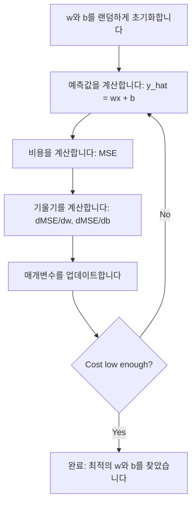

# 선형 회귀

> 선형 회귀는 데이터를 가장 잘 설명하는 직선을 그립니다. 이는 머신러닝의 "hello world"입니다.

**유형:** Build
**언어:** Python
**선수 요건:** 1단계 (선형대수, 미적분, 최적화), 2단계 01강
**시간:** 약 90분

## 학습 목표

- 평균 제곱 오차(MSE)에 대한 경사 하강법 업데이트 규칙을 유도하고, 선형 회귀를 처음부터 구현해 보세요
- 경사 하강법과 정규 방정식을 계산 복잡도 측면에서 비교하고, 각각을 언제 사용해야 하는지 설명해 보세요
- 특성 표준화를 적용한 다중 선형 회귀 모델을 구축하고, 학습된 가중치를 해석해 보세요
- Ridge 회귀(L2 정규화)가 큰 가중치에 페널티를 부과하여 과적합을 방지하는 방식을 설명해 보세요

## 문제점

데이터가 있습니다: 집의 크기와 판매 가격. 집의 크기를 알고 새로운 집의 가격을 예측하고 싶다고 가정해 보세요. 산점도(scatter plot)로 눈으로 확인할 수도 있지만, 공식이 필요합니다. 데이터를 가장 잘 설명하는 직선이 필요하며, 이 직선을 통해 임의의 크기를 입력하면 가격 예측값을 얻을 수 있습니다.

선형 회귀는 그 직선을 제공합니다. 더 중요한 점은, 이것이 전체 ML 학습 루프를 소개한다는 것입니다: 모델을 정의하고, 비용 함수를 정의하고, 매개변수를 최적화합니다. 모든 ML 알고리즘은 이 동일한 패턴을 따릅니다. 가장 단순한 사례로 이를 마스터하면, 모든 곳에서 이 패턴을 인식할 수 있습니다.

이것은 단순한 문제만을 위한 것이 아닙니다. 선형 회귀는 수요 예측, A/B 테스트 분석, 금융 모델링 등 생산 시스템에서 사용되며, 모든 회귀 작업의 기준선(baseline)으로도 활용됩니다.

## 개념

### 모델

선형 회귀는 입력(x)과 출력(y) 사이에 선형 관계가 있다고 가정합니다:

```
y = wx + b
```

- `w` (가중치/기울기): x가 1 증가할 때 y가 변하는 정도
- `b` (편향/절편): x = 0일 때 y의 값

다중 입력(특성)의 경우, 이는 다음과 같이 확장됩니다:

```
y = w1*x1 + w2*x2 + ... + wn*xn + b
```

또는 벡터 형태로: `y = w^T * x + b`

목표: 모든 학습 예제에서 예측된 y가 실제 y와 최대한 가깝게 만드는 w와 b의 값을 찾는 것입니다.

### 비용 함수 (평균 제곱 오차)

"가장 가까운 상태"는 어떻게 측정하나요? 예측이 얼마나 틀렸는지를 하나의 숫자로 나타내야 합니다. 가장 흔한 선택지는 평균 제곱 오차 (MSE)입니다:

```
MSE = (1/n) * sum((y_predicted - y_actual)^2)
```

왜 제곱하나요? 두 가지 이유가 있습니다. 첫째, 큰 오차는 작은 오차보다 더 크게 페널티를 부여합니다 (오차 10은 오차 1보다 10배가 아니라 100배 더 나쁜 것입니다). 둘째, 제곱 함수는 모든 곳에서 매끄럽고 미분 가능하므로 최적화가 간단합니다.

비용 함수는 표면을 만듭니다. 단일 가중치 w와 편향 b에 대해, MSE 표면은 그릇 모양 (볼록 포물면)처럼 보입니다. 그릇의 바닥은 MSE가 최소화되는 지점입니다. 학습은 그 바닥을 찾는 것을 의미합니다.

### 경사 하강법

경사 하강법은 내리막길로 발을 내딛는 방식으로 그릇의 바닥을 찾습니다.



기울기는 두 가지를 알려줍니다: 각 매개변수를 어떤 방향으로 이동해야 하는지, 그리고 얼마나 이동해야 하는지입니다.

y_hat = wx + b에 대한 MSE의 경우:

```
dMSE/dw = (2/n) * sum((y_hat - y) * x)
dMSE/db = (2/n) * sum(y_hat - y)
```

업데이트 규칙:

```
w = w - learning_rate * dMSE/dw
b = b - learning_rate * dMSE/db
```

학습률은 단계 크기를 제어합니다. 너무 크면: 최소값을 지나쳐 발산합니다. 너무 작으면: 학습이 영원히 걸립니다. 일반적인 시작 값: 0.01, 0.001, 또는 0.0001입니다.

### 정규 방정식 (폐형 해)

선형 회귀의 경우, 반복 없이 최적의 가중치를 직접 계산하는 공식이 있습니다:

```
w = (X^T * X)^(-1) * X^T * y
```

이 공식은 행렬을 역전시켜 한 단계에서 w를 구합니다. 작은 데이터셋에서는 완벽하게 작동합니다. 큰 데이터셋 (수백만 행 또는 수천 개 특징)에서는 행렬 역전 계산이 특징 수에 대해 O(n^3)이므로 경사 하강법이 선호됩니다.

### 다중 선형 회귀

여러 특징을 사용하면 모델은 다음과 같이 됩니다:

```
y = w1*x1 + w2*x2 + ... + wn*xn + b
```

모든 것이 동일하게 작동합니다: MSE는 비용 함수이고, 경사 하강법은 모든 가중치를 동시에 업데이트합니다. 유일한 차이점은 선이 아닌 초평면을 피팅한다는 것입니다.

여기서 기능(feature) 스케일링이 중요합니다. 한 기능은 0에서 1까지이고 다른 기능은 0에서 1,000,000까지라면, 비용 표면이 길게 늘어나기 때문에 경사 하강법(Gradient Descent)이 어려움을 겪게 됩니다. 학습 전에 기능을 표준화(평균을 빼고 표준 편차로 나누는 것)하세요.

### 다항 회귀(Polynomial Regression)

관계가 선형이 아닌 경우에도 다항 기능(polynomial features)을 만들어 선형 회귀를 사용할 수 있습니다:

```
y = w1*x + w2*x^2 + w3*x^3 + b
```

이것은 여전히 "선형" 회귀입니다. 모델이 가중치(w1, w2, w3)에 대해 선형이기 때문입니다. x의 비선형 기능을 사용하는 것일 뿐입니다.

차수가 높은 다항식은 더 복잡한 곡선에 적합할 수 있지만 과적합(Overfitting) 위험이 있습니다. 차수 10의 다항식은 10개 점으로 이루어진 데이터셋의 모든 점을 통과하지만, 새로운 데이터에 대한 예측은 잘하지 못합니다.

### R-제곱 점수(R-Squared Score)

MSE는 얼마나 틀렸는지 알려주지만, 그 값은 y의 스케일에 의존합니다. R-제곱(R^2)은 스케일에 독립적인 측정값을 제공합니다:

```
R^2 = 1 - (sum of squared residuals) / (sum of squared deviations from mean)
    = 1 - SS_res / SS_tot
```

- R^2 = 1.0: 완벽한 예측
- R^2 = 0.0: 모델이 매번 평균을 예측하는 것보다 낫지 않음
- R^2 < 0.0: 모델이 평균을 예측하는 것보다 나쁨

### 정규화 미리보기 (리지 회귀)(Regularization Preview (Ridge Regression))

기능이 많을 때, 모델은 큰 가중치를 할당하여 과적합(Overfitting)될 수 있습니다. 리지 회귀(Ridge regression)(L2 정규화)는 페널티를 추가합니다:

```
Cost = MSE + lambda * sum(w_i^2)
```

페널티 항은 큰 가중치를 억제합니다. 하이퍼파라미터(Hyperparameter) lambda가 트레이드오프를 제어합니다. lambda가 높을수록 가중치가 작아지고 정규화가 더 강해집니다. 이 내용은 이후 강에서 자세히 다루므로, 지금은 이것이 존재하며 왜 도움이 되는지만 알면 됩니다.

```figure
linear-regression-fit
```

## 구현하기

### 1단계: 샘플 데이터 생성

```python
import random
import math

random.seed(42)

TRUE_W = 3.0
TRUE_B = 7.0
N_SAMPLES = 100

X = [random.uniform(0, 10) for _ in range(N_SAMPLES)]
y = [TRUE_W * x + TRUE_B + random.gauss(0, 2.0) for x in X]

print(f"Generated {N_SAMPLES} samples")
print(f"True relationship: y = {TRUE_W}x + {TRUE_B} (+ noise)")
print(f"First 5 points: {[(round(X[i], 2), round(y[i], 2)) for i in range(5)]}")
```

### 2단계: 경사 하강법으로 처음부터 선형 회귀 구현

```python
class LinearRegression:
    def __init__(self, learning_rate=0.01):
        self.w = 0.0
        self.b = 0.0
        self.lr = learning_rate
        self.cost_history = []

    def predict(self, X):
        return [self.w * x + self.b for x in X]

    def compute_cost(self, X, y):
        predictions = self.predict(X)
        n = len(y)
        cost = sum((pred - actual) ** 2 for pred, actual in zip(predictions, y)) / n
        return cost

    def compute_gradients(self, X, y):
        predictions = self.predict(X)
        n = len(y)
        dw = (2 / n) * sum((pred - actual) * x for pred, actual, x in zip(predictions, y, X))
        db = (2 / n) * sum(pred - actual for pred, actual in zip(predictions, y))
        return dw, db

    def fit(self, X, y, epochs=1000, print_every=200):
        for epoch in range(epochs):
            dw, db = self.compute_gradients(X, y)
            self.w -= self.lr * dw
            self.b -= self.lr * db
            cost = self.compute_cost(X, y)
            self.cost_history.append(cost)
            if epoch % print_every == 0:
                print(f"  Epoch {epoch:4d} | Cost: {cost:.4f} | w: {self.w:.4f} | b: {self.b:.4f}")
        return self

    def r_squared(self, X, y):
        predictions = self.predict(X)
        y_mean = sum(y) / len(y)
        ss_res = sum((actual - pred) ** 2 for actual, pred in zip(y, predictions))
        ss_tot = sum((actual - y_mean) ** 2 for actual in y)
        return 1 - (ss_res / ss_tot)


print("=== Training Linear Regression (Gradient Descent) ===")
model = LinearRegression(learning_rate=0.005)
model.fit(X, y, epochs=1000, print_every=200)
print(f"\nLearned: y = {model.w:.4f}x + {model.b:.4f}")
print(f"True:    y = {TRUE_W}x + {TRUE_B}")
print(f"R-squared: {model.r_squared(X, y):.4f}")
```

### 3단계: 정규 방정식(폐형 해)(Normal equation (closed-form solution))

```python
class LinearRegressionNormal:
    def __init__(self):
        self.w = 0.0
        self.b = 0.0

    def fit(self, X, y):
        n = len(X)
        x_mean = sum(X) / n
        y_mean = sum(y) / n
        numerator = sum((X[i] - x_mean) * (y[i] - y_mean) for i in range(n))
        denominator = sum((X[i] - x_mean) ** 2 for i in range(n))
        self.w = numerator / denominator
        self.b = y_mean - self.w * x_mean
        return self

    def predict(self, X):
        return [self.w * x + self.b for x in X]

    def r_squared(self, X, y):
        predictions = self.predict(X)
        y_mean = sum(y) / len(y)
        ss_res = sum((actual - pred) ** 2 for actual, pred in zip(y, predictions))
        ss_tot = sum((actual - y_mean) ** 2 for actual in y)
        return 1 - (ss_res / ss_tot)


print("\n=== Normal Equation (Closed-Form) ===")
model_normal = LinearRegressionNormal()
model_normal.fit(X, y)
print(f"Learned: y = {model_normal.w:.4f}x + {model_normal.b:.4f}")
print(f"R-squared: {model_normal.r_squared(X, y):.4f}")
```

### 4단계: 다중 선형 회귀

```python
class MultipleLinearRegression:
    def __init__(self, n_features, learning_rate=0.01):
        self.weights = [0.0] * n_features
        self.bias = 0.0
        self.lr = learning_rate
        self.cost_history = []

    def predict_single(self, x):
        return sum(w * xi for w, xi in zip(self.weights, x)) + self.bias

    def predict(self, X):
        return [self.predict_single(x) for x in X]

    def compute_cost(self, X, y):
        predictions = self.predict(X)
        n = len(y)
        return sum((pred - actual) ** 2 for pred, actual in zip(predictions, y)) / n

    def fit(self, X, y, epochs=1000, print_every=200):
        n = len(y)
        n_features = len(X[0])
        for epoch in range(epochs):
            predictions = self.predict(X)
            errors = [pred - actual for pred, actual in zip(predictions, y)]
            for j in range(n_features):
                grad = (2 / n) * sum(errors[i] * X[i][j] for i in range(n))
                self.weights[j] -= self.lr * grad
            grad_b = (2 / n) * sum(errors)
            self.bias -= self.lr * grad_b
            cost = self.compute_cost(X, y)
            self.cost_history.append(cost)
            if epoch % print_every == 0:
                print(f"  Epoch {epoch:4d} | Cost: {cost:.4f}")
        return self

    def r_squared(self, X, y):
        predictions = self.predict(X)
        y_mean = sum(y) / len(y)
        ss_res = sum((actual - pred) ** 2 for actual, pred in zip(y, predictions))
        ss_tot = sum((actual - y_mean) ** 2 for actual in y)
        return 1 - (ss_res / ss_tot)


random.seed(42)
N = 100
X_multi = []
y_multi = []
for _ in range(N):
    size = random.uniform(500, 3000)
    bedrooms = random.randint(1, 5)
    age = random.uniform(0, 50)
    price = 50 * size + 10000 * bedrooms - 1000 * age + 50000 + random.gauss(0, 20000)
    X_multi.append([size, bedrooms, age])
    y_multi.append(price)


def standardize(X):
    n_features = len(X[0])
    means = [sum(X[i][j] for i in range(len(X))) / len(X) for j in range(n_features)]
    stds = []
    for j in range(n_features):
        variance = sum((X[i][j] - means[j]) ** 2 for i in range(len(X))) / len(X)
        stds.append(variance ** 0.5)
    X_scaled = []
    for i in range(len(X)):
        row = [(X[i][j] - means[j]) / stds[j] if stds[j] > 0 else 0 for j in range(n_features)]
        X_scaled.append(row)
    return X_scaled, means, stds


y_mean_val = sum(y_multi) / len(y_multi)
y_std_val = (sum((yi - y_mean_val) ** 2 for yi in y_multi) / len(y_multi)) ** 0.5
y_scaled = [(yi - y_mean_val) / y_std_val for yi in y_multi]

X_scaled, x_means, x_stds = standardize(X_multi)

print("\n=== Multiple Linear Regression (3 features) ===")
print("Features: house size, bedrooms, age")
multi_model = MultipleLinearRegression(n_features=3, learning_rate=0.01)
multi_model.fit(X_scaled, y_scaled, epochs=1000, print_every=200)

print(f"\nWeights (standardized): {[round(w, 4) for w in multi_model.weights]}")
print(f"Bias (standardized): {multi_model.bias:.4f}")
print(f"R-squared: {multi_model.r_squared(X_scaled, y_scaled):.4f}")
```

### 5단계: 다항 회귀

```python
class PolynomialRegression:
    def __init__(self, degree, learning_rate=0.01):
        self.degree = degree
        self.weights = [0.0] * degree
        self.bias = 0.0
        self.lr = learning_rate

    def make_features(self, X):
        return [[x ** (d + 1) for d in range(self.degree)] for x in X]

    def predict(self, X):
        features = self.make_features(X)
        return [sum(w * f for w, f in zip(self.weights, row)) + self.bias for row in features]

    def fit(self, X, y, epochs=1000, print_every=200):
        features = self.make_features(X)
        n = len(y)
        for epoch in range(epochs):
            predictions = [sum(w * f for w, f in zip(self.weights, row)) + self.bias for row in features]
            errors = [pred - actual for pred, actual in zip(predictions, y)]
            for j in range(self.degree):
                grad = (2 / n) * sum(errors[i] * features[i][j] for i in range(n))
                self.weights[j] -= self.lr * grad
            grad_b = (2 / n) * sum(errors)
            self.bias -= self.lr * grad_b
            if epoch % print_every == 0:
                cost = sum(e ** 2 for e in errors) / n
                print(f"  Epoch {epoch:4d} | Cost: {cost:.6f}")
        return self

    def r_squared(self, X, y):
        predictions = self.predict(X)
        y_mean = sum(y) / len(y)
        ss_res = sum((actual - pred) ** 2 for actual, pred in zip(y, predictions))
        ss_tot = sum((actual - y_mean) ** 2 for actual in y)
        return 1 - (ss_res / ss_tot)


random.seed(42)
X_poly = [x / 10.0 for x in range(0, 50)]
y_poly = [0.5 * x ** 2 - 2 * x + 3 + random.gauss(0, 1.0) for x in X_poly]

x_max = max(abs(x) for x in X_poly)
X_poly_norm = [x / x_max for x in X_poly]
y_poly_mean = sum(y_poly) / len(y_poly)
y_poly_std = (sum((yi - y_poly_mean) ** 2 for yi in y_poly) / len(y_poly)) ** 0.5
y_poly_norm = [(yi - y_poly_mean) / y_poly_std for yi in y_poly]

print("\n=== Polynomial Regression (degree 2 vs degree 5) ===")
print("True relationship: y = 0.5x^2 - 2x + 3")

print("\nDegree 2:")
poly2 = PolynomialRegression(degree=2, learning_rate=0.1)
poly2.fit(X_poly_norm, y_poly_norm, epochs=2000, print_every=500)
print(f"  R-squared: {poly2.r_squared(X_poly_norm, y_poly_norm):.4f}")

print("\nDegree 5:")
poly5 = PolynomialRegression(degree=5, learning_rate=0.1)
poly5.fit(X_poly_norm, y_poly_norm, epochs=2000, print_every=500)
print(f"  R-squared: {poly5.r_squared(X_poly_norm, y_poly_norm):.4f}")

print("\nDegree 2 fits the true curve well. Degree 5 fits training data slightly better")
print("but risks overfitting on new data.")
```

### 6단계: 리지 회귀 (L2 정규화)(Ridge regression (L2 regularization))

```python
class RidgeRegression:
    def __init__(self, n_features, learning_rate=0.01, alpha=1.0):
        self.weights = [0.0] * n_features
        self.bias = 0.0
        self.lr = learning_rate
        self.alpha = alpha

    def predict_single(self, x):
        return sum(w * xi for w, xi in zip(self.weights, x)) + self.bias

    def predict(self, X):
        return [self.predict_single(x) for x in X]

    def fit(self, X, y, epochs=1000, print_every=200):
        n = len(y)
        n_features = len(X[0])
        for epoch in range(epochs):
            predictions = self.predict(X)
            errors = [pred - actual for pred, actual in zip(predictions, y)]
            mse = sum(e ** 2 for e in errors) / n
            reg_term = self.alpha * sum(w ** 2 for w in self.weights)
            cost = mse + reg_term
            for j in range(n_features):
                grad = (2 / n) * sum(errors[i] * X[i][j] for i in range(n))
                grad += 2 * self.alpha * self.weights[j]
                self.weights[j] -= self.lr * grad
            grad_b = (2 / n) * sum(errors)
            self.bias -= self.lr * grad_b
            if epoch % print_every == 0:
                print(f"  Epoch {epoch:4d} | Cost: {cost:.4f} | L2 penalty: {reg_term:.4f}")
        return self


print("\n=== Ridge Regression (L2 Regularization) ===")
print("Same data as multiple regression, with alpha=0.1")
ridge = RidgeRegression(n_features=3, learning_rate=0.01, alpha=0.1)
ridge.fit(X_scaled, y_scaled, epochs=1000, print_every=200)
print(f"\nRidge weights: {[round(w, 4) for w in ridge.weights]}")
print(f"Plain weights: {[round(w, 4) for w in multi_model.weights]}")
print("Ridge weights are smaller (shrunk toward zero) due to the L2 penalty.")
```

## 사용하기

이제 scikit-learn을 사용하여 동일한 작업을 해 보세요. 실제 프로덕션 환경에서는 scikit-learn을 사용하게 될 것입니다.

```python
from sklearn.linear_model import LinearRegression as SklearnLR
from sklearn.linear_model import Ridge
from sklearn.preprocessing import PolynomialFeatures, StandardScaler
from sklearn.model_selection import train_test_split
from sklearn.metrics import mean_squared_error, r2_score
import numpy as np

np.random.seed(42)
X_sk = np.random.uniform(0, 10, (100, 1))
y_sk = 3.0 * X_sk.squeeze() + 7.0 + np.random.normal(0, 2.0, 100)

X_train, X_test, y_train, y_test = train_test_split(X_sk, y_sk, test_size=0.2, random_state=42)

lr = SklearnLR()
lr.fit(X_train, y_train)
y_pred = lr.predict(X_test)

print("=== Scikit-learn Linear Regression ===")
print(f"Coefficient (w): {lr.coef_[0]:.4f}")
print(f"Intercept (b): {lr.intercept_:.4f}")
print(f"R-squared (test): {r2_score(y_test, y_pred):.4f}")
print(f"MSE (test): {mean_squared_error(y_test, y_pred):.4f}")

poly = PolynomialFeatures(degree=2, include_bias=False)
X_poly_sk = poly.fit_transform(X_train)
X_poly_test = poly.transform(X_test)

lr_poly = SklearnLR()
lr_poly.fit(X_poly_sk, y_train)
print(f"\nPolynomial degree 2 R-squared: {r2_score(y_test, lr_poly.predict(X_poly_test)):.4f}")

scaler = StandardScaler()
X_train_scaled = scaler.fit_transform(X_train)
X_test_scaled = scaler.transform(X_test)

ridge = Ridge(alpha=1.0)
ridge.fit(X_train_scaled, y_train)
print(f"Ridge R-squared: {r2_score(y_test, ridge.predict(X_test_scaled)):.4f}")
print(f"Ridge coefficient: {ridge.coef_[0]:.4f}")
```

직접 구현한 코드와 scikit-learn이 동일한 결과를 산출합니다. 차이점은 scikit-learn이 경계 사례, 수치적 안정성, 성능 최적화를 처리한다는 점입니다. 프로덕션 환경에서는 라이브러리를 사용하세요. 직접 구현한 버전은 내부에서 일어나는 일을 이해하는 데 활용하세요.

## 출시하기

이 강의에서 생성되는 것:
- `outputs/skill-regression.md` - 문제에 따라 적절한 회귀 접근법을 선택하는 스킬

## 연습 문제

1. 배치 경사 하강법, 확률적 경사 하강법 (SGD)(Stochastic Gradient Descent (SGD)), 미니배치 경사 하강법을 구현해 보세요. 동일한 데이터셋에서 수렴 속도를 비교하세요. 어떤 방법이 가장 빠르게 수렴하나요? 어떤 방법이 비용 곡선이 가장 매끄러운가요?
2. 3차 함수(y = ax^3 + bx^2 + cx + d + noise)에서 데이터를 생성하세요. 1차, 3차, 10차 다항식을 적합해 보세요. 학습 R^2와 테스트 R^2를 비교하세요. 몇 차에서 과적합(Overfitting)이 명확해지나요?
3. Lasso 회귀(L1 정규화: penalty = alpha * sum(|w_i|))를 구현해 보세요. 다중 특성 주택 데이터로 학습하세요. Ridge와 비교하여 어떤 가중치가 0으로 수렴하는지 확인하세요. 왜 L1은 희소 솔루션을 생성하는 반면 L2는 생성하지 않나요?

## 핵심 용어

| 용어 | 사람들이 말하는 것 | 실제 의미 |
|------|----------------|----------------------|
| 선형 회귀 | "데이터에 선을 그린다" | wx+b와 실제 y 값 사이의 제곱 차이의 합을 최소화하는 가중치 w와 편향 b를 찾는 것 |
| 비용 함수 | "모델이 얼마나 나쁜지" | 모델 매개변수를 예측 오차를 측정하는 단일 숫자에 매핑하는 함수로, 최적화 과정에서 최소화됨 |
| 평균 제곱 오차 | "제곱 오차의 평균" | (1/n) * sum of (predicted - actual)^2, 큰 오차에 대해 불균형적으로 큰 페널티를 부여 |
| 경사 하강법 | "내리막길로 걷는다" | 편미분을 사용하여 비용 함수를 감소시키는 방향으로 매개변수를 반복적으로 조정 |
| 학습률 | "걸음 크기" | 경사 하강법 단계마다 매개변수가 얼마나 변하는지 제어하는 스칼라 값 |
| 정규 방정식 | "직접 해결한다" | 반복 없이 최적 가중치를 제공하는 폐형 해 w = (X^T X)^-1 X^T y |
| R-제곱 | "적합도가 얼마나 좋은지" | 모델이 설명하는 y의 분산 비율로, 음의 무한대에서 1.0까지 범위를 가짐 |
| 특징 스케일링 | "특징을 비교 가능하게 만들기" | 특징을 유사한 범위로 변환 (예: 평균 0, 단위 분산)하여 경사 하강법(Gradient Descent)이 더 빠르게 수렴하도록 함 |
| 정규화(Normalization) | "복잡성에 페널티를 부여" | 비용 함수에 가중치를 축소하는 항을 추가하여 과적합(Overfitting)을 방지 |
| 릿지 회귀(Ridge regression) | "L2 정규화(Normalization)" | MSE에 lambda * sum(w_i^2) 페널티가 추가된 선형 회귀 |
| 다항 회귀(Polynomial regression) | "선형 연산으로 곡선 피팅" | 다항 특징(x, x^2, x^3, ...)에 대한 선형 회귀로, 가중치(Weight)에 대해서는 여전히 선형 |
| 과적합(Overfitting) | "학습 데이터를 암기" | 모델이 너무 복잡하여 학습 데이터의 잡음까지 피팅하고 새로운 데이터에서는 실패 |

## 추가 읽기

- [An Introduction to Statistical Learning (ISLR)](https://www.statlearning.com/) -- 무료 PDF, 3장과 6장에서 선형 회귀와 정규화(Normalization)를 실용적인 R 예제와 함께 다룸
- [The Elements of Statistical Learning (ESL)](https://hastie.su.domains/ElemStatLearn/) -- 무료 PDF, ISLR의 수학적으로 더 깊은 동반자이며 릿지(Ridge)와 라소(Lasso)를 더 깊이 다룸
- [Stanford CS229 Lecture Notes on Linear Regression](https://cs229.stanford.edu/main_notes.pdf) -- Andrew Ng의 노트로, 정상 방정식(Normal Equation)과 경사 하강법(Gradient Descent)을 첫 원리부터 유도함
- [scikit-learn LinearRegression documentation](https://scikit-learn.org/stable/modules/linear_model.html) -- LinearRegression, Ridge, Lasso, ElasticNet에 대한 실용적인 참고 자료로, 코드 예제 포함
