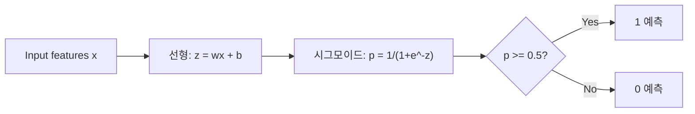
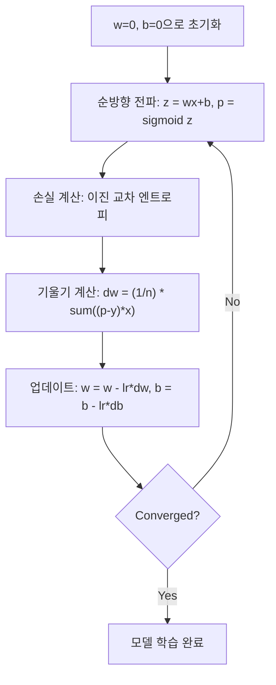

# 로지스틱 회귀

> 로지스틱 회귀는 직선을 S자 곡선으로 변형하여 확률로 예/아오 질문에 답합니다.

**유형:** Build
**언어:** Python
**선수 요건:** 2단계 01-02강 (ML이란, 선형 회귀)
**시간:** 약 90분

## 학습 목표

- 시그모이드 함수와 이진 교차 엔트로피 손실 함수를 사용하여 로지스틱 회귀를 처음부터 구현해 보세요
- 이진 분류를 위해 정밀도, 재현율, F1 점수 및 혼동 행렬을 계산하고 해석해 보세요
- 분류에서 MSE가 실패하는 이유와 이진 교차 엔트로피가 볼록한 비용 표면을 생성하는 이유를 설명해 보세요
- 다중 클래스 분류를 위해 소프트맥스 회귀 모델을 구축하고 임계값 조정의 트레이드오프를 평가해 보세요

## 문제점

종양의 크기를 보고 악성인지 양성인지 예측하고 싶다고 가정해 보세요. 선형 회귀를 시도하면 0.3, 1.7, -0.5 같은 숫자가 출력됩니다. 이 값들은 무엇을 의미할까요? 1.7은 "매우 악성"이고 -0.5는 "매우 양성"일까요? 선형 회귀는 범위가 정해지지 않은(unbounded) 숫자를 출력합니다. 분류는 00강 1 사이의 범위가 정해진 확률과 명확한 결정(예 또는 아니오)이 필요합니다.

로지스틱 회귀는 이 문제를 해결합니다. 동일한 선형 결합(wx + b)을 시그모이드 함수에 통과시키면 모든 숫자를 (0, 1) 범위로 압축(squash)합니다. 출력은 확률입니다. 임계값(보통 0.5)을 설정하고 결정을 내립니다.

이 알고리즘은 실무에서 가장 널리 사용되는 알고리즘 중 하나입니다. 이름에도 불구하고 로지스틱 회귀는 회귀 알고리즘이 아닌 분류 알고리즘입니다. 이름은 사용하는 로지스틱(시그모이드) 함수에서 유래했습니다.

## 개념

### 분류에서 선형 회귀가 실패하는 이유

공부한 시간을 기준으로 합격/불합격(1/0)을 예측한다고 상상해 보세요. 선형 회귀는 데이터를 통과하는 직선을 적합(fit)합니다:

```
hours:  1   2   3   4   5   6   7   8   9   10
actual: 0   0   0   0   1   1   1   1   1   1
```

선형 적합은 1시간에 -0.2, 10시간에 1.3 같은 예측값을 생성할 수 있습니다. 이 값들은 확률이 아닙니다. 0보다 작아지고 1보다 커집니다. 더 나쁜 것은, 하나의 이상치(outlier, 50시간 공부한 사람)가 전체 직선을 끌어당겨 모든 사람의 예측값을 변경할 수 있다는 점입니다.

분류는 다음을 만족하는 함수가 필요합니다:
- 00강 1 사이의 값(확률)을 출력합니다
- 선명한 전환(결정 경계)을 만듭니다
- 경계에서 멀리 떨어진 이상치(outlier)에 의해 왜곡되지 않습니다

### 시그모이드 함수(Sigmoid Function)

시그모이드 함수는 정확히 이 역할을 수행합니다:

```
sigmoid(z) = 1 / (1 + e^(-z))
```

속성:
- z가 크고 양수일 때, sigmoid(z)는 1에 가까워집니다
- z가 크고 음수일 때, sigmoid(z)는 0에 가까워집니다
- z = 0일 때, sigmoid(z) = 0.5입니다
- 출력은 항상 00강 1 사이입니다
- 함수는 모든 곳에서 매끄럽고 미분 가능합니다

미분계수는 편리한 형태를 가집니다: sigmoid'(z) = sigmoid(z) * (1 - sigmoid(z)). 이는 기울기 계산의 효율성을 높입니다.

### 로지스틱 회귀 = 선형 모델 + 시그모이드

모델은 z = wx + b (선형 회귀와 동일)를 계산한 후, 시그모이드를 적용합니다:



출력 p는 P(y=1 | x), 즉 입력이 클래스 1에 속할 확률로 해석됩니다. 결정 경계는 wx + b = 0인 지점이며, 이때 시그모이드 출력은 정확히 0.5가 됩니다.

### 이진 교차 엔트로피 손실(Binary Cross-Entropy Loss)

로지스틱 회귀에 MSE를 사용할 수 없습니다. 시그모이드와 함께 MSE를 사용하면 많은 지역 최소값을 가진 비볼록 비용 표면이 생성됩니다. 대신 이진 교차 엔트로피(log loss)를 사용하세요:

```
Loss = -(1/n) * sum(y * log(p) + (1-y) * log(1-p))
```

이 방식이 작동하는 이유:
- y=1이고 p가 1에 가까울 때: log(1) = 0이므로, 손실은 0에 가깝습니다 (정답, 낮은 비용)
- y=1이고 p가 0에 가까울 때: log(0)는 음의 무한대에 가까워지므로, 손실은 매우 큽니다 (오답, 높은 비용)
- y=0이고 p가 0에 가까울 때: log(1) = 0이므로, 손실은 0에 가깝습니다 (정답, 낮은 비용)
- y=0이고 p가 1에 가까울 때: log(0)는 음의 무한대에 가까워지므로, 손실은 매우 큽니다 (오답, 높은 비용)

이 손실 함수는 로지스틱 회귀에 대해 볼록(convex)이므로, 단일 전역 최소값이 보장됩니다.

### 로지스틱 회귀를 위한 경사 하강법(Gradient Descent)

시그모이드와 함께 이진 교차 엔트로피의 기울기는 깔끔한 형태를 가집니다:

```
dL/dw = (1/n) * sum((p - y) * x)
dL/db = (1/n) * sum(p - y)
```

이 기울기들은 선형 회귀의 기울기와 동일해 보입니다. 차이는 p = sigmoid(wx + b)라는 점이며, p = wx + b가 아닙니다. 시그모이드가 비선형성을 도입하지만, 기울기 업데이트 규칙은 동일합니다.



### 결정 경계

2D 입력(두 가지 특징)의 경우, 결정 경계는 다음을 만족하는 선입니다:

```
w1*x1 + w2*x2 + b = 0
```

한쪽 점들은 1로 분류되고, 다른 쪽 점들은 0으로 분류됩니다. 로지스틱 회귀는 항상 선형 결정 경계를 생성합니다. 곡선 경계가 필요하다면 다항식 특징을 추가하거나 비선형 모델을 사용해야 합니다.

### 소프트맥스를 이용한 다중 클래스 분류

이진 로지스틱 회귀는 두 클래스를 처리합니다. k개의 클래스를 위해 소프트맥스 함수를 사용하세요:

```
softmax(z_i) = e^(z_i) / sum(e^(z_j) for all j)
```

각 클래스는 자체 가중치 벡터를 가집니다. 모델은 각 클래스에 대한 점수 z_i를 계산한 후, 소프트맥스가 점수를 합이 1인 확률로 변환합니다. 예측된 클래스는 확률이 가장 높은 클래스입니다.

손실 함수는 범주형 교차 엔트로피가 됩니다:

```
Loss = -(1/n) * sum(sum(y_k * log(p_k)))
```

여기서 y_k는 참 클래스에 대해 1이고, 나머지 모든 클래스에 대해 0입니다(원 핫 인코딩).

### 평가 지표

정확도만으로는 충분하지 않습니다. 95%가 음이고 5%가 양인 데이터셋에서, 항상 음으로 예측하는 모델은 95%의 정확도를 얻지만 쓸모가 없습니다.

**혼동 행렬**:

| | 예측 양 | 예측 음 |
|---|---|---|
| 실제 양 | 참 양(TP) | 거짓 음(FN) |
| 실제 음 | 거짓 양(FP) | 참 음(TN) |

**정밀도**: 예측된 양 중 실제로 양인 것은 몇 개일까요?
```
Precision = TP / (TP + FP)
```

**재현율**(민감도): 실제 양 중 우리가 포착한 것은 몇 개일까요?
```
Recall = TP / (TP + FN)
```

**F1 점수**: 정밀도와 재현율의 조화 평균입니다. 두 지표를 균형 있게 반영합니다.
```
F1 = 2 * (Precision * Recall) / (Precision + Recall)
```

우선순위를 정할 때:
- **정밀도(Precision)**: 오탐(false positive) 비용이 클 때 (스팸 필터, 합법적인 이메일을 차단하고 싶지 않은 경우)
- **재현율(Recall)**: 미탐(false negative) 비용이 클 때 (암 선별 검사, 종양을 놓치고 싶지 않은 경우)
- **F1**: 단일 균형 지표가 필요할 때

```figure
logistic-sigmoid
```

## 구현하기

### 1단계: 시그모이드 함수 및 데이터 생성

```python
import random
import math

def sigmoid(z):
    z = max(-500, min(500, z))
    return 1.0 / (1.0 + math.exp(-z))


random.seed(42)
N = 200
X = []
y = []

for _ in range(N // 2):
    X.append([random.gauss(2, 1), random.gauss(2, 1)])
    y.append(0)

for _ in range(N // 2):
    X.append([random.gauss(5, 1), random.gauss(5, 1)])
    y.append(1)

combined = list(zip(X, y))
random.shuffle(combined)
X, y = zip(*combined)
X = list(X)
y = list(y)

print(f"Generated {N} samples (2 classes, 2 features)")
print(f"Class 0 center: (2, 2), Class 1 center: (5, 5)")
print(f"First 5 samples:")
for i in range(5):
    print(f"  Features: [{X[i][0]:.2f}, {X[i][1]:.2f}], Label: {y[i]}")
```

### 2단계: 로지스틱 회귀를 처음부터 구현하기

```python
class LogisticRegression:
    def __init__(self, n_features, learning_rate=0.01):
        self.weights = [0.0] * n_features
        self.bias = 0.0
        self.lr = learning_rate
        self.loss_history = []

    def predict_proba(self, x):
        z = sum(w * xi for w, xi in zip(self.weights, x)) + self.bias
        return sigmoid(z)

    def predict(self, x, threshold=0.5):
        return 1 if self.predict_proba(x) >= threshold else 0

    def compute_loss(self, X, y):
        n = len(y)
        total = 0.0
        for i in range(n):
            p = self.predict_proba(X[i])
            p = max(1e-15, min(1 - 1e-15, p))
            total += y[i] * math.log(p) + (1 - y[i]) * math.log(1 - p)
        return -total / n

    def fit(self, X, y, epochs=1000, print_every=200):
        n = len(y)
        n_features = len(X[0])
        for epoch in range(epochs):
            dw = [0.0] * n_features
            db = 0.0
            for i in range(n):
                p = self.predict_proba(X[i])
                error = p - y[i]
                for j in range(n_features):
                    dw[j] += error * X[i][j]
                db += error
            for j in range(n_features):
                self.weights[j] -= self.lr * (dw[j] / n)
            self.bias -= self.lr * (db / n)
            loss = self.compute_loss(X, y)
            self.loss_history.append(loss)
            if epoch % print_every == 0:
                print(f"  Epoch {epoch:4d} | Loss: {loss:.4f} | w: [{self.weights[0]:.3f}, {self.weights[1]:.3f}] | b: {self.bias:.3f}")
        return self

    def accuracy(self, X, y):
        correct = sum(1 for i in range(len(y)) if self.predict(X[i]) == y[i])
        return correct / len(y)


split = int(0.8 * N)
X_train, X_test = X[:split], X[split:]
y_train, y_test = y[:split], y[split:]

print("\n=== Training Logistic Regression ===")
model = LogisticRegression(n_features=2, learning_rate=0.1)
model.fit(X_train, y_train, epochs=1000, print_every=200)

print(f"\nTrain accuracy: {model.accuracy(X_train, y_train):.4f}")
print(f"Test accuracy:  {model.accuracy(X_test, y_test):.4f}")
print(f"Weights: [{model.weights[0]:.4f}, {model.weights[1]:.4f}]")
print(f"Bias: {model.bias:.4f}")
```

### 3단계: 혼동 행렬 및 지표를 처음부터 구현하기

```python
class ClassificationMetrics:
    def __init__(self, y_true, y_pred):
        self.tp = sum(1 for t, p in zip(y_true, y_pred) if t == 1 and p == 1)
        self.tn = sum(1 for t, p in zip(y_true, y_pred) if t == 0 and p == 0)
        self.fp = sum(1 for t, p in zip(y_true, y_pred) if t == 0 and p == 1)
        self.fn = sum(1 for t, p in zip(y_true, y_pred) if t == 1 and p == 0)

    def accuracy(self):
        total = self.tp + self.tn + self.fp + self.fn
        return (self.tp + self.tn) / total if total > 0 else 0

    def precision(self):
        denom = self.tp + self.fp
        return self.tp / denom if denom > 0 else 0

    def recall(self):
        denom = self.tp + self.fn
        return self.tp / denom if denom > 0 else 0

    def f1(self):
        p = self.precision()
        r = self.recall()
        return 2 * p * r / (p + r) if (p + r) > 0 else 0

    def print_confusion_matrix(self):
        print(f"\n  Confusion Matrix:")
        print(f"                  Predicted")
        print(f"                  Pos   Neg")
        print(f"  Actual Pos     {self.tp:4d}  {self.fn:4d}")
        print(f"  Actual Neg     {self.fp:4d}  {self.tn:4d}")

    def print_report(self):
        self.print_confusion_matrix()
        print(f"\n  Accuracy:  {self.accuracy():.4f}")
        print(f"  Precision: {self.precision():.4f}")
        print(f"  Recall:    {self.recall():.4f}")
        print(f"  F1 Score:  {self.f1():.4f}")


y_pred_test = [model.predict(x) for x in X_test]
print("\n=== Classification Report (Test Set) ===")
metrics = ClassificationMetrics(y_test, y_pred_test)
metrics.print_report()
```

### 4단계: 결정 경계 분석

```python
print("\n=== Decision Boundary ===")
w1, w2 = model.weights
b = model.bias
print(f"Decision boundary: {w1:.4f}*x1 + {w2:.4f}*x2 + {b:.4f} = 0")
if abs(w2) > 1e-10:
    print(f"Solved for x2:     x2 = {-w1/w2:.4f}*x1 + {-b/w2:.4f}")

print("\nSample predictions near the boundary:")
test_points = [
    [3.0, 3.0],
    [3.5, 3.5],
    [4.0, 4.0],
    [2.5, 2.5],
    [5.0, 5.0],
]
for point in test_points:
    prob = model.predict_proba(point)
    pred = model.predict(point)
    print(f"  [{point[0]}, {point[1]}] -> prob={prob:.4f}, class={pred}")
```

### 5단계: 소프트맥스를 이용한 다중 클래스

```python
class SoftmaxRegression:
    def __init__(self, n_features, n_classes, learning_rate=0.01):
        self.n_features = n_features
        self.n_classes = n_classes
        self.lr = learning_rate
        self.weights = [[0.0] * n_features for _ in range(n_classes)]
        self.biases = [0.0] * n_classes

    def softmax(self, scores):
        max_score = max(scores)
        exp_scores = [math.exp(s - max_score) for s in scores]
        total = sum(exp_scores)
        return [e / total for e in exp_scores]

    def predict_proba(self, x):
        scores = [
            sum(self.weights[k][j] * x[j] for j in range(self.n_features)) + self.biases[k]
            for k in range(self.n_classes)
        ]
        return self.softmax(scores)

    def predict(self, x):
        probs = self.predict_proba(x)
        return probs.index(max(probs))

    def fit(self, X, y, epochs=1000, print_every=200):
        n = len(y)
        for epoch in range(epochs):
            grad_w = [[0.0] * self.n_features for _ in range(self.n_classes)]
            grad_b = [0.0] * self.n_classes
            total_loss = 0.0
            for i in range(n):
                probs = self.predict_proba(X[i])
                for k in range(self.n_classes):
                    target = 1.0 if y[i] == k else 0.0
                    error = probs[k] - target
                    for j in range(self.n_features):
                        grad_w[k][j] += error * X[i][j]
                    grad_b[k] += error
                true_prob = max(probs[y[i]], 1e-15)
                total_loss -= math.log(true_prob)
            for k in range(self.n_classes):
                for j in range(self.n_features):
                    self.weights[k][j] -= self.lr * (grad_w[k][j] / n)
                self.biases[k] -= self.lr * (grad_b[k] / n)
            if epoch % print_every == 0:
                print(f"  Epoch {epoch:4d} | Loss: {total_loss / n:.4f}")
        return self

    def accuracy(self, X, y):
        correct = sum(1 for i in range(len(y)) if self.predict(X[i]) == y[i])
        return correct / len(y)


random.seed(42)
X_3class = []
y_3class = []

centers = [(1, 1), (5, 1), (3, 5)]
for label, (cx, cy) in enumerate(centers):
    for _ in range(50):
        X_3class.append([random.gauss(cx, 0.8), random.gauss(cy, 0.8)])
        y_3class.append(label)

combined = list(zip(X_3class, y_3class))
random.shuffle(combined)
X_3class, y_3class = zip(*combined)
X_3class = list(X_3class)
y_3class = list(y_3class)

split_3 = int(0.8 * len(X_3class))
X_train_3 = X_3class[:split_3]
y_train_3 = y_3class[:split_3]
X_test_3 = X_3class[split_3:]
y_test_3 = y_3class[split_3:]

print("\n=== Multi-class Softmax Regression (3 classes) ===")
softmax_model = SoftmaxRegression(n_features=2, n_classes=3, learning_rate=0.1)
softmax_model.fit(X_train_3, y_train_3, epochs=1000, print_every=200)
print(f"\nTrain accuracy: {softmax_model.accuracy(X_train_3, y_train_3):.4f}")
print(f"Test accuracy:  {softmax_model.accuracy(X_test_3, y_test_3):.4f}")

print("\nSample predictions:")
for i in range(5):
    probs = softmax_model.predict_proba(X_test_3[i])
    pred = softmax_model.predict(X_test_3[i])
    print(f"  True: {y_test_3[i]}, Predicted: {pred}, Probs: [{', '.join(f'{p:.3f}' for p in probs)}]")
```

### 6단계: 임계값 튜닝

```python
print("\n=== Threshold Tuning ===")
print("Default threshold: 0.5. Adjusting the threshold trades precision for recall.\n")

thresholds = [0.3, 0.4, 0.5, 0.6, 0.7]
print(f"{'Threshold':>10} {'Accuracy':>10} {'Precision':>10} {'Recall':>10} {'F1':>10}")
print("-" * 52)

for t in thresholds:
    y_pred_t = [1 if model.predict_proba(x) >= t else 0 for x in X_test]
    m = ClassificationMetrics(y_test, y_pred_t)
    print(f"{t:>10.1f} {m.accuracy():>10.4f} {m.precision():>10.4f} {m.recall():>10.4f} {m.f1():>10.4f}")
```

## 사용하기

이제 scikit-learn을 사용하여 동일한 작업을 수행해 보세요.

```python
from sklearn.linear_model import LogisticRegression as SklearnLR
from sklearn.metrics import accuracy_score, precision_score, recall_score, f1_score
from sklearn.metrics import confusion_matrix, classification_report
from sklearn.model_selection import train_test_split
from sklearn.preprocessing import StandardScaler
import numpy as np

np.random.seed(42)
X_0 = np.random.randn(100, 2) + [2, 2]
X_1 = np.random.randn(100, 2) + [5, 5]
X_sk = np.vstack([X_0, X_1])
y_sk = np.array([0] * 100 + [1] * 100)

X_tr, X_te, y_tr, y_te = train_test_split(X_sk, y_sk, test_size=0.2, random_state=42)

scaler = StandardScaler()
X_tr_sc = scaler.fit_transform(X_tr)
X_te_sc = scaler.transform(X_te)

lr = SklearnLR()
lr.fit(X_tr_sc, y_tr)
y_pred = lr.predict(X_te_sc)

print("=== Scikit-learn Logistic Regression ===")
print(f"Accuracy:  {accuracy_score(y_te, y_pred):.4f}")
print(f"Precision: {precision_score(y_te, y_pred):.4f}")
print(f"Recall:    {recall_score(y_te, y_pred):.4f}")
print(f"F1:        {f1_score(y_te, y_pred):.4f}")
print(f"\nConfusion Matrix:\n{confusion_matrix(y_te, y_pred)}")
print(f"\nClassification Report:\n{classification_report(y_te, y_pred)}")
```

처음부터 구현한 코드가 동일한 결정 경계와 지표를 생성합니다. Scikit-learn은 솔버 옵션(liblinear, lbfgs, saga), 자동 정규화, 다중 클래스 전략(one-vs-rest, multinomial) 및 수치적 안정성 최적화를 제공합니다.

## 출시하기

이 강의는 다음을 생성합니다:
- `code/logistic_regression.py` - 지표가 포함된 처음부터 구현한 로지스틱 회귀

## 연습 문제

1. 선형 분리 불가능한 데이터셋(예: 두 개의 동심원)을 생성하세요. 로지스틱 회귀를 학습하고 실패를 관찰하세요. 이후 다항식 특성(x1^2, x2^2, x1*x2)을 추가하고 다시 학습하세요. 정확도가 향상됨을 보여주세요.
2. 3개 클래스 소프트맥스 모델에 대한 다중 클래스 혼동 행렬을 구현하세요. 클래스별 정밀도(Precision)와 재현율(Recall)을 계산하세요. 분류하기 가장 어려운 클래스는 무엇인가요?
3. 처음부터 ROC 곡선을 구현하세요. 0에서 1까지의 100개 임계값에 대해 참 양성 비율(true positive rate)과 오탐 비율(false positive rate)을 계산하세요. 사다리꼴 규칙(trapezoidal rule)을 사용하여 AUC(곡선 아래 면적)를 계산하세요.

## 핵심 용어

| 용어 | 사람들이 말하는 것 | 실제 의미 |
|------|----------------|----------------------|
| 로지스틱 회귀(Logistic regression) | "분류를 위한 회귀" | 시그모이드 함수가 클래스 확률을 출력하는 선형 모델 |
| 시그모이드 함수(Sigmoid function) | "S-곡선" | 모든 실수를 (0, 1) 범위로 매핑하는 함수 1/(1+e^(-z)) |
| 이진 교차 엔트로피(Binary cross-entropy) | "로그 손실(Log loss)" | 확신에 찬 잘못된 예측을 심각하게 페널티하는 손실 함수 -[y*log(p) + (1-y)*log(1-p)] |
| 결정 경계 | "분리선" | 모델의 출력 확률이 0.5가 되는 표면으로, 예측된 클래스를 분리합니다 |
| Softmax | "다중 클래스 시그모이드" | 점수 벡터를 합이 1인 확률로 변환하는 함수입니다 |
| 정밀도(Precision) | "선정된 항목 중 관련 있는 비율" | TP / (TP + FP), 양의 예측 중 실제로 양인 비율입니다 |
| 재현율(Recall) | "관련 있는 항목 중 선정된 비율" | TP / (TP + FN), 실제 양 중 모델이 올바르게 식별한 비율입니다 |
| F1 점수 | "균형 잡힌 정확도" | 정밀도와 재현율의 조화 평균: 2*P*R / (P+R) |
| 혼동 행렬 | "오류 분류" | 각 클래스 쌍에 대한 TP, TN, FP, FN 개수를 보여주는 표입니다 |
| 임계값 | "컷오프" | 모델이 클래스 1을 예측하는 확률 값 (기본값 0.5, 조정 가능) |
| 원-핫 인코딩 | "카테고리용 이진 열" | 클래스 k를 위치 k에 1이 있고 나머지는 0인 벡터로 표현하는 것 |
| 범주형 교차 엔트로피(Categorical cross-entropy) | "다중 클래스 로그 손실" | 원-핫 인코딩된 레이블을 사용하여 이진 교차 엔트로피를 k개 클래스로 확장한 것입니다 |
