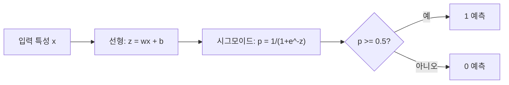
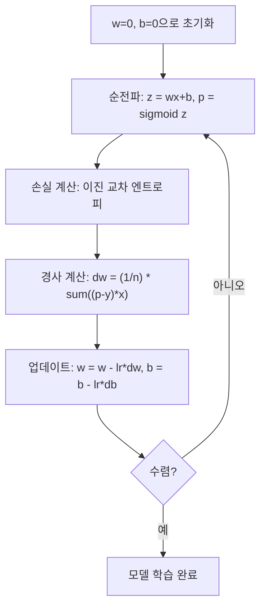

# 로지스틱 회귀 (Logistic Regression)

> 로지스틱 회귀는 직선을 S자 곡선으로 구부려, yes-or-no 질문에 확률로 답합니다.

**Type:** Build
**Languages:** Python
**Prerequisites:** Phase 2 Lesson 1-2 (What Is ML, Linear Regression)
**Time:** ~90 minutes

## 학습 목표 (Learning Objectives)

- 시그모이드 함수와 이진 교차 엔트로피 손실로 로지스틱 회귀를 처음부터 구현합니다
- 이진 분류의 precision, recall, F1 점수, 혼동 행렬을 계산하고 해석합니다
- 분류에 MSE가 실패하는 이유와, 이진 교차 엔트로피가 볼록한 비용 곡면을 만드는 이유를 설명합니다
- 다중 클래스 분류용 소프트맥스 회귀 모델을 만들고, 임계값 조정의 트레이드오프를 평가합니다

## 문제 상황 (The Problem)

종양의 크기가 주어졌을 때 악성인지 양성인지 예측하고 싶습니다. 선형 회귀를 시도합니다. 0.3이나 1.7이나 -0.5 같은 숫자를 출력합니다. 그게 무슨 뜻인가요? 1.7은 "매우 악성"? -0.5는 "매우 양성"? 선형 회귀는 범위가 없는 숫자를 냅니다. 분류에는 0과 1 사이의 유계 확률, 그리고 명확한 결정(yes 또는 no)이 필요합니다.

로지스틱 회귀가 이를 해결합니다. 같은 선형 결합(wx + b)을 취한 뒤, 어떤 숫자든 (0, 1) 구간으로 찌그러뜨리는 시그모이드 함수에 통과시킵니다. 출력은 확률입니다. 임계값(보통 0.5)을 정하고 결정을 내립니다.

실무에서 가장 널리 쓰이는 알고리즘 중 하나입니다. 이름과 달리 로지스틱 회귀는 회귀가 아니라 분류 알고리즘입니다. 이름은 사용하는 logistic(시그모이드) 함수에서 옵니다.

## 핵심 개념 (The Concept)

### 분류에서 선형 회귀가 실패하는 이유

공부 시간으로 합격/불합격(1/0)을 예측한다고 해 봅시다. 선형 회귀는 데이터에 직선을 맞춥니다:

```
hours:  1   2   3   4   5   6   7   8   9   10
actual: 0   0   0   0   1   1   1   1   1   1
```

선형 적합은 1시간에서 -0.2, 10시간에서 1.3 같은 예측을 낼 수 있습니다. 이 값들은 확률이 아닙니다. 0 아래와 1 위로 나갑니다. 더 나쁜 점은, 이상치 하나(50시간 공부한 사람)가 전체 선을 끌어 모든 사람의 예측을 바꿉니다.

분류에는 다음을 하는 함수가 필요합니다:
- 0과 1 사이의 값(확률)을 출력
- 날카로운 전환(결정 경계)을 만듦
- 경계에서 먼 이상치에 왜곡되지 않음

### 시그모이드 함수

시그모이드 함수가 정확히 이를 합니다:

```
sigmoid(z) = 1 / (1 + e^(-z))
```

성질:
- z가 크고 양수이면 sigmoid(z)는 1에 접근
- z가 크고 음수이면 sigmoid(z)는 0에 접근
- z = 0이면 sigmoid(z) = 0.5
- 출력은 항상 0과 1 사이
- 함수는 어디서나 매끄럽고 미분 가능

도함수는 편리한 형태입니다: sigmoid'(z) = sigmoid(z) * (1 - sigmoid(z)). 경사 계산이 효율적입니다.

### 로지스틱 회귀 = 선형 모델 + 시그모이드

모델은 z = wx + b를 계산한 뒤(선형 회귀와 같음) 시그모이드를 적용합니다:



출력 p는 P(y=1 | x), 즉 입력이 클래스 1에 속할 확률로 해석합니다. 결정 경계는 wx + b = 0인 곳이며, 여기서 시그모이드 출력이 정확히 0.5입니다.

### 이진 교차 엔트로피 손실

로지스틱 회귀에 MSE를 쓸 수 없습니다. 시그모이드와 함께 MSE를 쓰면 국소 최솟값이 많은 비볼록 비용 곡면이 됩니다. 대신 이진 교차 엔트로피(log loss)를 씁니다:

```
Loss = -(1/n) * sum(y * log(p) + (1-y) * log(1-p))
```

왜 동작하는가:
- y=1이고 p가 1에 가깝면: log(1) = 0이므로 손실은 거의 0 (맞음, 낮은 비용)
- y=1이고 p가 0에 가깝면: log(0)이 음의 무한대로 가므로 손실이 거대함 (틀림, 높은 비용)
- y=0이고 p가 0에 가깝면: log(1) = 0이므로 손실은 거의 0 (맞음, 낮은 비용)
- y=0이고 p가 1에 가깝면: log(0)이 음의 무한대로 가므로 손실이 거대함 (틀림, 높은 비용)

이 손실 함수는 로지스틱 회귀에 대해 볼록하며, 단일 전역 최솟값을 보장합니다.

### 로지스틱 회귀의 경사하강법

시그모이드와 이진 교차 엔트로피의 경사는 깔끔한 형태입니다:

```
dL/dw = (1/n) * sum((p - y) * x)
dL/db = (1/n) * sum(p - y)
```

선형 회귀 경사와 동일해 보입니다. 차이는 p = wx + b가 아니라 p = sigmoid(wx + b)라는 점입니다. 시그모이드가 비선형을 도입하지만, 경사 업데이트 규칙은 같습니다.



### 결정 경계

2D 입력(특성 두 개)에서 결정 경계는 다음이 성립하는 직선입니다:

```
w1*x1 + w2*x2 + b = 0
```

한쪽 점은 1로, 다른 쪽은 0으로 분류됩니다. 로지스틱 회귀는 항상 선형 결정 경계를 만듭니다. 곡선 경계가 필요하면 다항 특성을 추가하거나 비선형 모델을 씁니다.

### 소프트맥스로 다중 클래스 분류

이진 로지스틱 회귀는 두 클래스를 다룹니다. k개 클래스에는 소프트맥스 함수를 씁니다:

```
softmax(z_i) = e^(z_i) / sum(e^(z_j) for all j)
```

각 클래스에 자체 가중치 벡터가 있습니다. 모델이 클래스마다 점수 z_i를 계산하고, 소프트맥스가 점수를 합이 1인 확률로 바꿉니다. 예측 클래스는 확률이 가장 높은 것입니다.

손실 함수는 범주형 교차 엔트로피가 됩니다:

```
Loss = -(1/n) * sum(sum(y_k * log(p_k)))
```

여기서 y_k는 진짜 클래스에서 1, 나머지에서 0입니다(원-핫 인코딩).

### 평가 지표

정확도만으로는 부족합니다. 음성 95%, 양성 5%인 데이터셋에서 항상 음성을 예측하는 모델은 정확도 95%지만 쓸모없습니다.

**혼동 행렬 (Confusion Matrix)**:

| | Predicted Positive | Predicted Negative |
|---|---|---|
| Actually Positive | True Positive (TP) | False Negative (FN) |
| Actually Negative | False Positive (FP) | True Negative (TN) |

**Precision**: 양성으로 예측한 것 중 실제로 양성인 비율은?
```
Precision = TP / (TP + FP)
```

**Recall** (Sensitivity): 실제 양성 중 얼마나 잡아냈는가?
```
Recall = TP / (TP + FN)
```

**F1 Score**: precision과 recall의 조화평균. 두 지표의 균형을 잡습니다.
```
F1 = 2 * (Precision * Recall) / (Precision + Recall)
```

언제 무엇을 우선할지:
- **Precision**: 위양성이 비쌀 때 (스팸 필터 — 정상 메일을 막고 싶지 않음)
- **Recall**: 위음성이 비쌀 때 (암 선별 — 종양을 놓치고 싶지 않음)
- **F1**: 균형 잡힌 단일 지표가 필요할 때

```figure
logistic-sigmoid
```

## 직접 만들기 (Build It)

### 1단계: 시그모이드 함수와 데이터 생성

```python
import random
import math

def sigmoid(z):
    z = max(-500, min(500, z))
    return 1.0 / (1.0 + math.exp(-z))


random.seed(42)
N = 200
X = []
y = []

for _ in range(N // 2):
    X.append([random.gauss(2, 1), random.gauss(2, 1)])
    y.append(0)

for _ in range(N // 2):
    X.append([random.gauss(5, 1), random.gauss(5, 1)])
    y.append(1)

combined = list(zip(X, y))
random.shuffle(combined)
X, y = zip(*combined)
X = list(X)
y = list(y)

print(f"Generated {N} samples (2 classes, 2 features)")
print(f"Class 0 center: (2, 2), Class 1 center: (5, 5)")
print(f"First 5 samples:")
for i in range(5):
    print(f"  Features: [{X[i][0]:.2f}, {X[i][1]:.2f}], Label: {y[i]}")
```

### 2단계: 로지스틱 회귀 처음부터 구현

```python
class LogisticRegression:
    def __init__(self, n_features, learning_rate=0.01):
        self.weights = [0.0] * n_features
        self.bias = 0.0
        self.lr = learning_rate
        self.loss_history = []

    def predict_proba(self, x):
        z = sum(w * xi for w, xi in zip(self.weights, x)) + self.bias
        return sigmoid(z)

    def predict(self, x, threshold=0.5):
        return 1 if self.predict_proba(x) >= threshold else 0

    def compute_loss(self, X, y):
        n = len(y)
        total = 0.0
        for i in range(n):
            p = self.predict_proba(X[i])
            p = max(1e-15, min(1 - 1e-15, p))
            total += y[i] * math.log(p) + (1 - y[i]) * math.log(1 - p)
        return -total / n

    def fit(self, X, y, epochs=1000, print_every=200):
        n = len(y)
        n_features = len(X[0])
        for epoch in range(epochs):
            dw = [0.0] * n_features
            db = 0.0
            for i in range(n):
                p = self.predict_proba(X[i])
                error = p - y[i]
                for j in range(n_features):
                    dw[j] += error * X[i][j]
                db += error
            for j in range(n_features):
                self.weights[j] -= self.lr * (dw[j] / n)
            self.bias -= self.lr * (db / n)
            loss = self.compute_loss(X, y)
            self.loss_history.append(loss)
            if epoch % print_every == 0:
                print(f"  Epoch {epoch:4d} | Loss: {loss:.4f} | w: [{self.weights[0]:.3f}, {self.weights[1]:.3f}] | b: {self.bias:.3f}")
        return self

    def accuracy(self, X, y):
        correct = sum(1 for i in range(len(y)) if self.predict(X[i]) == y[i])
        return correct / len(y)


split = int(0.8 * N)
X_train, X_test = X[:split], X[split:]
y_train, y_test = y[:split], y[split:]

print("\n=== Training Logistic Regression ===")
model = LogisticRegression(n_features=2, learning_rate=0.1)
model.fit(X_train, y_train, epochs=1000, print_every=200)

print(f"\nTrain accuracy: {model.accuracy(X_train, y_train):.4f}")
print(f"Test accuracy:  {model.accuracy(X_test, y_test):.4f}")
print(f"Weights: [{model.weights[0]:.4f}, {model.weights[1]:.4f}]")
print(f"Bias: {model.bias:.4f}")
```

### 3단계: 혼동 행렬과 지표 처음부터 구현

```python
class ClassificationMetrics:
    def __init__(self, y_true, y_pred):
        self.tp = sum(1 for t, p in zip(y_true, y_pred) if t == 1 and p == 1)
        self.tn = sum(1 for t, p in zip(y_true, y_pred) if t == 0 and p == 0)
        self.fp = sum(1 for t, p in zip(y_true, y_pred) if t == 0 and p == 1)
        self.fn = sum(1 for t, p in zip(y_true, y_pred) if t == 1 and p == 0)

    def accuracy(self):
        total = self.tp + self.tn + self.fp + self.fn
        return (self.tp + self.tn) / total if total > 0 else 0

    def precision(self):
        denom = self.tp + self.fp
        return self.tp / denom if denom > 0 else 0

    def recall(self):
        denom = self.tp + self.fn
        return self.tp / denom if denom > 0 else 0

    def f1(self):
        p = self.precision()
        r = self.recall()
        return 2 * p * r / (p + r) if (p + r) > 0 else 0

    def print_confusion_matrix(self):
        print(f"\n  Confusion Matrix:")
        print(f"                  Predicted")
        print(f"                  Pos   Neg")
        print(f"  Actual Pos     {self.tp:4d}  {self.fn:4d}")
        print(f"  Actual Neg     {self.fp:4d}  {self.tn:4d}")

    def print_report(self):
        self.print_confusion_matrix()
        print(f"\n  Accuracy:  {self.accuracy():.4f}")
        print(f"  Precision: {self.precision():.4f}")
        print(f"  Recall:    {self.recall():.4f}")
        print(f"  F1 Score:  {self.f1():.4f}")


y_pred_test = [model.predict(x) for x in X_test]
print("\n=== Classification Report (Test Set) ===")
metrics = ClassificationMetrics(y_test, y_pred_test)
metrics.print_report()
```

### 4단계: 결정 경계 분석

```python
print("\n=== Decision Boundary ===")
w1, w2 = model.weights
b = model.bias
print(f"Decision boundary: {w1:.4f}*x1 + {w2:.4f}*x2 + {b:.4f} = 0")
if abs(w2) > 1e-10:
    print(f"Solved for x2:     x2 = {-w1/w2:.4f}*x1 + {-b/w2:.4f}")

print("\nSample predictions near the boundary:")
test_points = [
    [3.0, 3.0],
    [3.5, 3.5],
    [4.0, 4.0],
    [2.5, 2.5],
    [5.0, 5.0],
]
for point in test_points:
    prob = model.predict_proba(point)
    pred = model.predict(point)
    print(f"  [{point[0]}, {point[1]}] -> prob={prob:.4f}, class={pred}")
```

### 5단계: 소프트맥스로 다중 클래스

```python
class SoftmaxRegression:
    def __init__(self, n_features, n_classes, learning_rate=0.01):
        self.n_features = n_features
        self.n_classes = n_classes
        self.lr = learning_rate
        self.weights = [[0.0] * n_features for _ in range(n_classes)]
        self.biases = [0.0] * n_classes

    def softmax(self, scores):
        max_score = max(scores)
        exp_scores = [math.exp(s - max_score) for s in scores]
        total = sum(exp_scores)
        return [e / total for e in exp_scores]

    def predict_proba(self, x):
        scores = [
            sum(self.weights[k][j] * x[j] for j in range(self.n_features)) + self.biases[k]
            for k in range(self.n_classes)
        ]
        return self.softmax(scores)

    def predict(self, x):
        probs = self.predict_proba(x)
        return probs.index(max(probs))

    def fit(self, X, y, epochs=1000, print_every=200):
        n = len(y)
        for epoch in range(epochs):
            grad_w = [[0.0] * self.n_features for _ in range(self.n_classes)]
            grad_b = [0.0] * self.n_classes
            total_loss = 0.0
            for i in range(n):
                probs = self.predict_proba(X[i])
                for k in range(self.n_classes):
                    target = 1.0 if y[i] == k else 0.0
                    error = probs[k] - target
                    for j in range(self.n_features):
                        grad_w[k][j] += error * X[i][j]
                    grad_b[k] += error
                true_prob = max(probs[y[i]], 1e-15)
                total_loss -= math.log(true_prob)
            for k in range(self.n_classes):
                for j in range(self.n_features):
                    self.weights[k][j] -= self.lr * (grad_w[k][j] / n)
                self.biases[k] -= self.lr * (grad_b[k] / n)
            if epoch % print_every == 0:
                print(f"  Epoch {epoch:4d} | Loss: {total_loss / n:.4f}")
        return self

    def accuracy(self, X, y):
        correct = sum(1 for i in range(len(y)) if self.predict(X[i]) == y[i])
        return correct / len(y)


random.seed(42)
X_3class = []
y_3class = []

centers = [(1, 1), (5, 1), (3, 5)]
for label, (cx, cy) in enumerate(centers):
    for _ in range(50):
        X_3class.append([random.gauss(cx, 0.8), random.gauss(cy, 0.8)])
        y_3class.append(label)

combined = list(zip(X_3class, y_3class))
random.shuffle(combined)
X_3class, y_3class = zip(*combined)
X_3class = list(X_3class)
y_3class = list(y_3class)

split_3 = int(0.8 * len(X_3class))
X_train_3 = X_3class[:split_3]
y_train_3 = y_3class[:split_3]
X_test_3 = X_3class[split_3:]
y_test_3 = y_3class[split_3:]

print("\n=== Multi-class Softmax Regression (3 classes) ===")
softmax_model = SoftmaxRegression(n_features=2, n_classes=3, learning_rate=0.1)
softmax_model.fit(X_train_3, y_train_3, epochs=1000, print_every=200)
print(f"\nTrain accuracy: {softmax_model.accuracy(X_train_3, y_train_3):.4f}")
print(f"Test accuracy:  {softmax_model.accuracy(X_test_3, y_test_3):.4f}")

print("\nSample predictions:")
for i in range(5):
    probs = softmax_model.predict_proba(X_test_3[i])
    pred = softmax_model.predict(X_test_3[i])
    print(f"  True: {y_test_3[i]}, Predicted: {pred}, Probs: [{', '.join(f'{p:.3f}' for p in probs)}]")
```

### 6단계: 임계값 조정

```python
print("\n=== Threshold Tuning ===")
print("Default threshold: 0.5. Adjusting the threshold trades precision for recall.\n")

thresholds = [0.3, 0.4, 0.5, 0.6, 0.7]
print(f"{'Threshold':>10} {'Accuracy':>10} {'Precision':>10} {'Recall':>10} {'F1':>10}")
print("-" * 52)

for t in thresholds:
    y_pred_t = [1 if model.predict_proba(x) >= t else 0 for x in X_test]
    m = ClassificationMetrics(y_test, y_pred_t)
    print(f"{t:>10.1f} {m.accuracy():>10.4f} {m.precision():>10.4f} {m.recall():>10.4f} {m.f1():>10.4f}")
```

## 활용하기 (Use It)

이제 같은 것을 scikit-learn으로 합니다.

```python
from sklearn.linear_model import LogisticRegression as SklearnLR
from sklearn.metrics import accuracy_score, precision_score, recall_score, f1_score
from sklearn.metrics import confusion_matrix, classification_report
from sklearn.model_selection import train_test_split
from sklearn.preprocessing import StandardScaler
import numpy as np

np.random.seed(42)
X_0 = np.random.randn(100, 2) + [2, 2]
X_1 = np.random.randn(100, 2) + [5, 5]
X_sk = np.vstack([X_0, X_1])
y_sk = np.array([0] * 100 + [1] * 100)

X_tr, X_te, y_tr, y_te = train_test_split(X_sk, y_sk, test_size=0.2, random_state=42)

scaler = StandardScaler()
X_tr_sc = scaler.fit_transform(X_tr)
X_te_sc = scaler.transform(X_te)

lr = SklearnLR()
lr.fit(X_tr_sc, y_tr)
y_pred = lr.predict(X_te_sc)

print("=== Scikit-learn Logistic Regression ===")
print(f"Accuracy:  {accuracy_score(y_te, y_pred):.4f}")
print(f"Precision: {precision_score(y_te, y_pred):.4f}")
print(f"Recall:    {recall_score(y_te, y_pred):.4f}")
print(f"F1:        {f1_score(y_te, y_pred):.4f}")
print(f"\nConfusion Matrix:\n{confusion_matrix(y_te, y_pred)}")
print(f"\nClassification Report:\n{classification_report(y_te, y_pred)}")
```

처음부터 구현한 것도 같은 결정 경계와 지표를 냅니다. Scikit-learn은 솔버 옵션(liblinear, lbfgs, saga), 자동 정규화, 다중 클래스 전략(one-vs-rest, multinomial), 수치 안정성 최적화를 더합니다.

## 산출물 (Ship It)

이 레슨은 다음을 만듭니다:
- `code/logistic_regression.py` — 지표가 포함된 처음부터 구현한 로지스틱 회귀

## 연습 문제 (Exercises)

1. 선형 분리가 안 되는 데이터셋(예: 동심원 두 개)을 생성하세요. 로지스틱 회귀를 학습하고 실패를 관찰하세요. 그다음 다항 특성(x1^2, x2^2, x1*x2)을 추가하고 다시 학습하세요. 정확도가 좋아짐을 보이세요.
2. 3클래스 소프트맥스 모델용 다중 클래스 혼동 행렬을 구현하세요. 클래스별 precision과 recall을 계산하세요. 어떤 클래스가 가장 분류하기 어렵나요?
3. ROC 곡선을 처음부터 만드세요. 0에서 1까지 임계값 100개에 대해 진양성률과 위양성률을 계산하세요. 사다리꼴 법칙으로 AUC(곡선 아래 면적)를 계산하세요.

## 핵심 용어 (Key Terms)

| Term | What people say | What it actually means |
|------|----------------|----------------------|
| Logistic regression | "분류용 회귀" | 클래스 확률을 출력하는 시그모이드가 뒤따르는 선형 모델 |
| Sigmoid function | "S자 곡선" | 임의의 실수를 (0, 1) 구간으로 매핑하는 함수 1/(1+e^(-z)) |
| Binary cross-entropy | "Log loss" | 자신 있게 틀린 예측을 심하게 벌하는 손실 -[y*log(p) + (1-y)*log(1-p)] |
| Decision boundary | "나누는 선" | 모델 출력 확률이 0.5가 되어 예측 클래스를 가르는 면 |
| Softmax | "다중 클래스 시그모이드" | 점수 벡터를 합이 1인 확률로 바꾸는 함수 |
| Precision | "선택한 것 중 관련 있는 비율" | TP / (TP + FP), 양성 예측 중 실제로 양성인 비율 |
| Recall | "관련 있는 것 중 선택된 비율" | TP / (TP + FN), 실제 양성 중 모델이 올바르게 식별한 비율 |
| F1 score | "균형 정확도" | precision과 recall의 조화평균: 2*P*R / (P+R) |
| Confusion matrix | "오류 분해" | 각 클래스 쌍의 TP, TN, FP, FN 개수를 보여주는 표 |
| Threshold | "컷오프" | 모델이 클래스 1을 예측하는 확률 기준(기본 0.5, 조정 가능) |
| One-hot encoding | "범주용 이진 열" | 클래스 k를 위치 k에 1이 있는 영벡터로 표현 |
| Categorical cross-entropy | "다중 클래스 log loss" | 원-핫 라벨을 쓰는 k클래스용 이진 교차 엔트로피 확장 |
