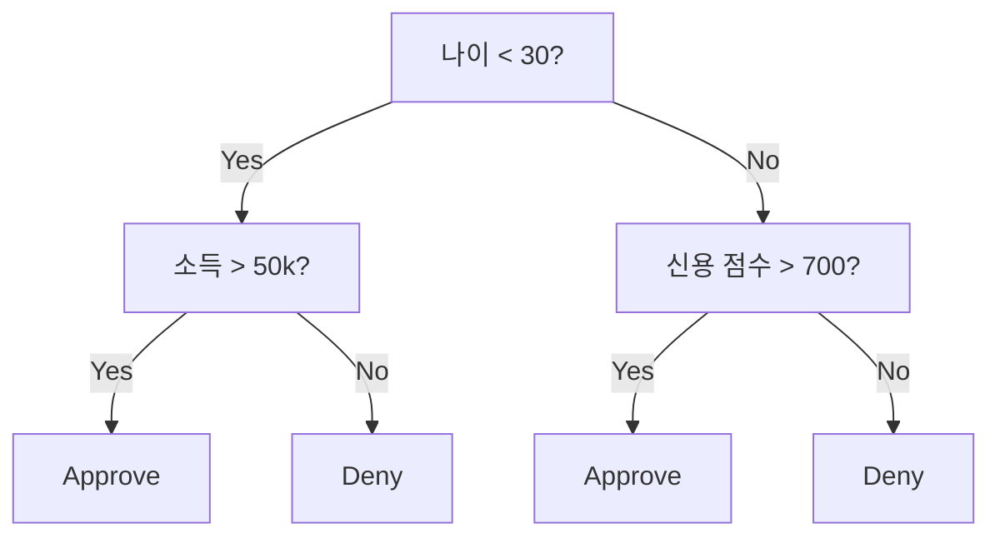
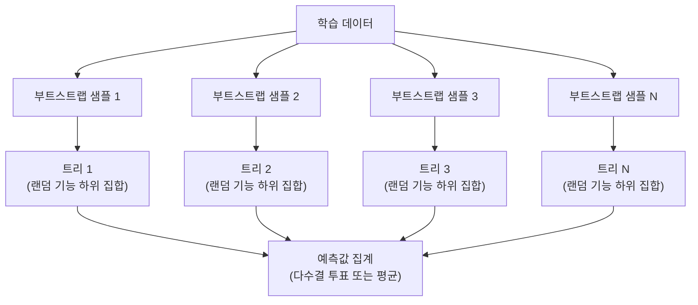

# 의사결정 나무와 랜덤 포레스트

> 의사결정 나무는 단순한 흐름도입니다. 하지만 여러 나무로 이루어진 숲은 ML에서 가장 강력한 도구 중 하나입니다.

**유형:** Build
**언어:** Python
**선수 요건:** 1단계 (09강 정보 이론, 06강 확률)
**시간:** 약 90분

## 학습 목표

- 최적의 의사결정 나무 분할을 찾기 위해 지니 불순도, 엔트로피, 정보 이득 계산을 구현해 보세요
- 사전 가지치기 제어(최대 깊이, 최소 샘플 수)를 포함하여 의사결정 나무 분류기를 처음부터 구축해 보세요
- 부트스트랩 샘플링과 기능 랜덤화를 사용하여 랜덤 포레스트를 구성하고, 이것이 분산을 줄이는 이유를 설명해 보세요
- MDI 기능 중요도와 순열 중요도를 비교하고, MDI가 편향되는 시점을 식별해 보세요

## 문제점

테이블 형식 데이터가 있습니다. 행은 샘플이고, 열은 기능이며, 예측하려는 대상 열이 있습니다. 신경망을 적용할 수도 있습니다. 하지만 테이블 형식 데이터의 경우, 나무 기반 모델(의사결정 나무, 랜덤 포레스트, 그래디언트 부스트 트리)이 딥러닝을 일관되게 능가합니다. 구조화된 데이터에 대한 Kaggle 대회에서는 트랜스포머가 아닌 XGBoost와 LightGBM이 주도합니다.

왜일까요? 나무는 전처리 없이 혼합 기능 유형(숫자 및 범주형)을 처리합니다. 기능 엔지니어링 없이 비선형 관계를 처리합니다. 해석이 가능합니다: 나무를 보고 예측이 이루어진 이유를 정확히 확인할 수 있습니다. 그리고 많은 나무를 평균내는 랜덤 포레스트는 중간 크기의 데이터셋에서 과적합에 매우 강합니다.

이 강의에서는 재귀적 분할을 사용하여 의사결정 나무를 처음부터 구축한 후, 그 위에 랜덤 포레스트를 만듭니다. 분할 기준(Gini 불순도, 엔트로피, 정보 이득)의 수학적 원리를 구현하고, 왜 약한 학습자의 앙상블이 강한 학습자가 되는지 이해하게 됩니다.

## 개념

### 의사결정 나무가 하는 일

의사결정 나무는 일련의 예/아니오 질문을 통해 기능 공간을 직사각형 영역으로 분할합니다.



각 내부 노드는 특정 특징을 임계값과 비교합니다. 각 리프 노드는 예측을 수행합니다. 새로운 데이터 포인트를 분류하려면 루트에서 시작하여 리프에 도달할 때까지 분기를 따라가 보세요.

트리는 상향식으로 구축되며, 각 노드에서 데이터를 가장 잘 분리하는 특징과 임계값을 선택합니다. '최선'은 분할 기준으로 정의됩니다.

### 분할 기준: 불순도 측정

각 노드에는 샘플 집합이 있습니다. resulting child nodes가 가능한 한 '순수'하도록, 즉 각 자식 노드가 대부분 하나의 클래스만 포함하도록 분할해야 합니다.

**Gini 불순도**는 해당 노드의 클래스 분포에 따라 라벨이 지정될 경우, 무작위로 선택된 샘플이 잘못 분류될 확률을 측정합니다.

```
Gini(S) = 1 - sum(p_k^2)

where p_k is the proportion of class k in set S.
```

순수한 노드(모두 하나의 클래스)의 경우 Gini = 0입니다. 50/50 클래스의 이진 분할의 경우 Gini = 0.5입니다. 값이 낮을수록 좋습니다.

```
Example: 6 cats, 4 dogs

Gini = 1 - (0.6^2 + 0.4^2) = 1 - (0.36 + 0.16) = 0.48
```

**엔트로피**는 노드의 정보량(무질서도)을 측정합니다. 1단계 09강에서 다루었습니다.

```
Entropy(S) = -sum(p_k * log2(p_k))
```

순수한 노드의 경우 엔트로피 = 0입니다. 50/50 이진 분할의 경우 엔트로피 = 1.0입니다. 값이 낮을수록 좋습니다.

```
Example: 6 cats, 4 dogs

Entropy = -(0.6 * log2(0.6) + 0.4 * log2(0.4))
        = -(0.6 * -0.737 + 0.4 * -1.322)
        = 0.442 + 0.529
        = 0.971 bits
```

**정보 이득**은 분할 후 불순도(엔트로피 또는 Gini)가 감소한 양입니다.

```
IG(S, feature, threshold) = Impurity(S) - weighted_avg(Impurity(S_left), Impurity(S_right))

where the weights are the proportions of samples in each child.
```

각 노드에서의 탐욕 알고리즘: 모든 특징과 모든 가능한 임계값을 시도합니다. 정보 이득을 최대화하는 (특징, 임계값) 쌍을 선택합니다.

### 분할 작동 방식

현재 노드에 n개의 특징과 m개의 샘플이 있는 데이터셋의 경우:

1. 각 특징 j (j = 1부터 n까지)에 대해:
   - 샘플을 특징 j 기준으로 정렬합니다
   - 연속된 서로 다른 값 사이의 모든 중간점을 임계값으로 시도합니다
   - 각 임계값에 대해 정보 이득을 계산합니다
2. 가장 높은 정보 이득을 가진 특징과 임계값을 선택합니다
3. 데이터를 왼쪽(특징 <= 임계값)과 오른쪽(특징 > 임계값)으로 분할합니다
4. 각 자식 노드에 대해 재귀적으로 수행합니다

이 탐욕적 접근법은 전역적으로 최적의 트리를 보장하지는 않습니다. 최적의 트리를 찾는 것은 NP-hard 문제입니다. 하지만 탐욕적 분할은 실제로 잘 작동합니다.

### 중단 조건

중단 조건이 없으면, 모든 리프가 순수해질 때까지(리프당 샘플이 하나) 트리가 계속 자라납니다. 이는 학습 데이터를 완벽하게 기억해 내지만, 일반화 성능은 매우 떨어집니다.

**사전 가지치기(Pre-pruning)**는 트리가 완전히 자라기 전에 중단합니다:
- 최대 깊이: 트리가 설정된 깊이에 도달하면 분할을 중단합니다
- 리프당 최소 샘플 수: 노드가 k개 미만의 샘플을 포함하면 중단합니다
- 최소 정보 이득: 최선의 분할이 불순도를 임계값 미만으로 개선하면 중단합니다
- 최대 리프 노드 수: 리프의 총 개수를 제한합니다

**사후 가지치기(Post-pruning)**는 트리를 완전히 자라게 한 후 잘라냅니다:
- 비용 복잡도 가지치기(scikit-learn에서 사용): 리프 수에 비례하는 페널티를 추가합니다. 페널티를 높이면 더 작은 트리를 얻을 수 있습니다
- 오류 감소 가지치기: 검증 오류가 증가하지 않으면 하위 트리를 제거합니다

사전 가지치기는 더 단순하고 빠릅니다. 사후 가지치기는 유용한 추가 분할로 이어질 수 있는 분할을 조기에 중단하지 않기 때문에, 종종 더 나은 트리를 생성합니다.

### 회귀를 위한 결정 트리

회귀에서는 리프 예측값이 해당 리프 내 타겟 값의 평균입니다. 분할 기준도 변경됩니다:

**분산 감소(Variance reduction)**가 정보 이득을 대체합니다:

```
VR(S, feature, threshold) = Var(S) - weighted_avg(Var(S_left), Var(S_right))
```

분산을 가장 많이 감소시키는 분할을 선택합니다. 트리는 입력 공간을 영역으로 분할하며, 각 영역에서 상수(평균)를 예측합니다.

### 랜덤 포레스트: 앙상블의 힘

단일 결정 트리는 분산이 높습니다. 데이터의 작은 변화가 완전히 다른 트리를 생성할 수 있습니다. 랜덤 포레스트는 많은 트리를 평균 내어 이를 해결합니다.



두 가지 무작위성이 트리를 다양하게 만듭니다:

**배깅(bootstrap aggregating):** 각 트리는 부트스트랩 샘플, 즉 학습 데이터에서 복원 추출한 랜덤 샘플로 학습됩니다. 원본 샘플의 약 63%가 각 부트스트랩에 포함되며(나머지는 검증에 사용할 수 있는 out-of-bag 샘플입니다).

**기능 랜덤화:** 각 분할 시 기능(feature)의 랜덤한 하위 집합만 고려됩니다. 분류의 경우 기본값은 sqrt(n_features)입니다. 회귀의 경우 n_features/3입니다. 이는 모든 트리가 동일한 지배적 기능으로 분할되는 것을 방지합니다.

핵심 통찰: 상관관계가 낮은 많은 트리를 평균화하면 편향(bias)을 증가시키지 않으면서 분산(variance)을 줄입니다. 개별 트리는 평범할 수 있습니다. 앙상블은 강력합니다.

### 기능 중요도

랜덤 포레스트는 기능 중요도 점수를 자연스럽게 제공합니다. 가장 일반적인 방법:

**불순도 감소 평균(MDI):** 각 기능에 대해, 모든 트리와 해당 기능이 사용된 모든 노드에서 불순도 감소의 총합을 계산합니다. 초기 분할에서 더 큰 불순도 감소를 생성하는 기능이 더 중요합니다.

```
importance(feature_j) = sum over all nodes where feature_j is used:
    (n_samples_at_node / n_total_samples) * impurity_decrease
```

이 방법은 빠릅니다(학습 중 계산됨)하지만, 카디널리티가 높은 기능과 가능한 분할 점이 많은 기능에 편향됩니다.

**순열 중요도(Permutation importance)**는 대안입니다: 하나의 기능 값을 셔플하고 모델의 정확도가 얼마나 떨어지는지 측정합니다. 더 신뢰할 수 있지만 느립니다.

### 트리가 신경망을 이길 때

트리와 포레스트는 테이블 데이터에서 신경망을 압도합니다. 몇 가지 이유:

| 요인 | 트리 | 신경망 |
|--------|-------|----------------|
| 혼합 유형(숫자 + 범주형) | 네이티브 지원 | 인코딩 필요 |
| 작은 데이터셋(< 10k 행) | 잘 작동 | 과적합 |
| 기능 상호작용 | 분할로 발견 | 아키텍처 설계 필요 |
| 해석 가능성 | 완전한 투명성 | 블랙박스 |
| 학습 시간 | 몇 분 | 몇 시간 |
| 하이퍼파라미터 민감도 | 낮음 | 높음 |

신경망은 데이터가 공간적 또는 순차적 구조(이미지, 텍스트, 오디오)를 가질 때 승리합니다. 평평한 기능 테이블의 경우, 트리가 기본값입니다.

```figure
decision-tree-depth
```

## 구현하기

### 1단계: 지니 불순도와 엔트로피

두 분할 기준을 처음부터 직접 구현하고, 어떤 분할이 좋은지 일치하는지 확인해 보세요.

```python
import math

def gini_impurity(labels):
    n = len(labels)
    if n == 0:
        return 0.0
    counts = {}
    for label in labels:
        counts[label] = counts.get(label, 0) + 1
    return 1.0 - sum((c / n) ** 2 for c in counts.values())

def entropy(labels):
    n = len(labels)
    if n == 0:
        return 0.0
    counts = {}
    for label in labels:
        counts[label] = counts.get(label, 0) + 1
    return -sum(
        (c / n) * math.log2(c / n) for c in counts.values() if c > 0
    )
```

### 2단계: 최적의 분할 찾기

모든 특징과 모든 임계값을 시도해 보세요. 정보 이득이 가장 높은 것을 반환합니다.

```python
def information_gain(parent_labels, left_labels, right_labels, criterion="gini"):
    measure = gini_impurity if criterion == "gini" else entropy
    n = len(parent_labels)
    n_left = len(left_labels)
    n_right = len(right_labels)
    if n_left == 0 or n_right == 0:
        return 0.0
    parent_impurity = measure(parent_labels)
    child_impurity = (
        (n_left / n) * measure(left_labels) +
        (n_right / n) * measure(right_labels)
    )
    return parent_impurity - child_impurity
```

### 3단계: DecisionTree 클래스 구현하기

재귀적 분할, 예측 및 특징 중요도 추적. `_build`는 트리의 핵심입니다: 노드가 순수하거나 사전 가지치기 한계에 도달하면 멈추고, 그렇지 않으면 최적의 분할을 선택하여 두 자식 노드로 재귀합니다.

```python
import random

class DecisionTree:
    def __init__(self, max_depth=None, min_samples_split=2,
                 min_samples_leaf=1, criterion="gini",
                 max_features=None):
        self.max_depth = max_depth
        self.min_samples_split = min_samples_split
        self.min_samples_leaf = min_samples_leaf
        self.criterion = criterion
        self.max_features = max_features
        self.tree = None
        self.feature_importances_ = None

    def fit(self, X, y):
        self.n_features = len(X[0])
        self.feature_importances_ = [0.0] * self.n_features
        self.n_samples = len(X)
        self.tree = self._build(X, y, depth=0)
        total = sum(self.feature_importances_)
        if total > 0:
            self.feature_importances_ = [
                fi / total for fi in self.feature_importances_
            ]

    def predict(self, X):
        return [self._predict_one(x, self.tree) for x in X]

    def _build(self, X, y, depth):
        if len(set(y)) == 1:
            return {"leaf": True, "value": y[0]}

        if self.max_depth is not None and depth >= self.max_depth:
            return self._make_leaf(y)

        if len(y) < self.min_samples_split:
            return self._make_leaf(y)

        best_feature, best_threshold, best_gain = self._best_split(X, y)

        if best_feature is None or best_gain <= 0:
            return self._make_leaf(y)

        left_X, left_y, right_X, right_y = self._split_data(
            X, y, best_feature, best_threshold
        )

        if len(left_y) < self.min_samples_leaf or len(right_y) < self.min_samples_leaf:
            return self._make_leaf(y)

        weight = len(y) / self.n_samples
        self.feature_importances_[best_feature] += weight * best_gain

        return {
            "leaf": False,
            "feature": best_feature,
            "threshold": best_threshold,
            "left": self._build(left_X, left_y, depth + 1),
            "right": self._build(right_X, right_y, depth + 1),
        }

    def _make_leaf(self, y):
        counts = {}
        for label in y:
            counts[label] = counts.get(label, 0) + 1
        return {"leaf": True, "value": max(counts, key=counts.get)}

    def _best_split(self, X, y):
        best_feature = None
        best_threshold = None
        best_gain = -1.0

        if self.max_features == "sqrt":
            k = max(1, int(math.sqrt(self.n_features)))
            feature_indices = random.sample(range(self.n_features), k)
        elif isinstance(self.max_features, int):
            if self.max_features < 1:
                raise ValueError("max_features must be at least 1 when given as an integer")
            k = min(self.max_features, self.n_features)
            feature_indices = random.sample(range(self.n_features), k)
        else:
            feature_indices = list(range(self.n_features))

        for feature_idx in feature_indices:
            values = sorted(set(X[i][feature_idx] for i in range(len(X))))
            if len(values) <= 1:
                continue

            for i in range(len(values) - 1):
                threshold = (values[i] + values[i + 1]) / 2.0
                left_y = [y[j] for j in range(len(X)) if X[j][feature_idx] <= threshold]
                right_y = [y[j] for j in range(len(X)) if X[j][feature_idx] > threshold]

                if len(left_y) < self.min_samples_leaf or len(right_y) < self.min_samples_leaf:
                    continue

                gain = information_gain(y, left_y, right_y, self.criterion)
                if gain > best_gain:
                    best_gain = gain
                    best_feature = feature_idx
                    best_threshold = threshold

        return best_feature, best_threshold, best_gain

    def _split_data(self, X, y, feature, threshold):
        left_X, left_y, right_X, right_y = [], [], [], []
        for i in range(len(X)):
            if X[i][feature] <= threshold:
                left_X.append(X[i])
                left_y.append(y[i])
            else:
                right_X.append(X[i])
                right_y.append(y[i])
        return left_X, left_y, right_X, right_y

    def _predict_one(self, x, node):
        if node["leaf"]:
            return node["value"]
        if x[node["feature"]] <= node["threshold"]:
            return self._predict_one(x, node["left"])
        return self._predict_one(x, node["right"])
```

### 4단계: RandomForest 클래스 구현하기

부트스트랩 샘플링, 특징 랜덤화 및 다수결 투표.

```python
class RandomForest:
    def __init__(self, n_trees=100, max_depth=None,
                 min_samples_split=2, max_features="sqrt",
                 criterion="gini"):
        self.n_trees = n_trees
        self.max_depth = max_depth
        self.min_samples_split = min_samples_split
        self.max_features = max_features
        self.criterion = criterion
        self.trees = []

    def fit(self, X, y):
        n = len(X)
        for _ in range(self.n_trees):
            indices = [random.randint(0, n - 1) for _ in range(n)]
            X_boot = [X[i] for i in indices]
            y_boot = [y[i] for i in indices]
            tree = DecisionTree(
                max_depth=self.max_depth,
                min_samples_split=self.min_samples_split,
                max_features=self.max_features,
                criterion=self.criterion,
            )
            tree.fit(X_boot, y_boot)
            self.trees.append(tree)

    def predict(self, X):
        all_preds = [tree.predict(X) for tree in self.trees]
        predictions = []
        for i in range(len(X)):
            votes = {}
            for preds in all_preds:
                v = preds[i]
                votes[v] = votes.get(v, 0) + 1
            predictions.append(max(votes, key=votes.get))
        return predictions
```

모든 헬퍼 메서드를 포함한 전체 구현은 `code/trees.py`를 참고하세요.

## 사용하기

scikit-learn을 사용하면 랜덤 포레스트 학습은 세 줄로 가능합니다:

```python
from sklearn.ensemble import RandomForestClassifier
from sklearn.datasets import load_iris
from sklearn.model_selection import train_test_split

X, y = load_iris(return_X_y=True)
X_train, X_test, y_train, y_test = train_test_split(X, y, random_state=42)

rf = RandomForestClassifier(n_estimators=100, random_state=42)
rf.fit(X_train, y_train)
print(f"Accuracy: {rf.score(X_test, y_test):.4f}")
print(f"Feature importances: {rf.feature_importances_}")
```

실제로는 그래디언트 부스트 트리(XGBoost, LightGBM, CatBoost)가 트리를 순차적으로 구축하며 각 트리가 이전 트리의 오류를 수정하기 때문에 랜덤 포레스트보다 더 강력한 경우가 많습니다. 하지만 랜덤 포레스트는 설정이 더 어렵고 하이퍼파라미터 튜닝이 거의 필요하지 않습니다.

## 출시하기

이 강의는 `outputs/prompt-tree-interpreter.md`를 생성합니다 -- 비즈니스 이해관계자를 위해 의사결정 트리 분할을 해석하는 프롬프트입니다. 학습된 트리의 구조(깊이, 특징, 분할 임계값, 정확도)를 입력하면 모델을 평이한 언어의 규칙으로 번역하고, 특징 중요도를 순위를 매기며, 과적합이나 누수를 표시하고, 다음 단계를 권장합니다. 코드를 읽지 않는 사람에게 트리 기반 모델을 설명해야 할 때마다 사용하세요.

## 연습 문제

1. 3개 클래스가 있는 2D 데이터셋에 단일 의사결정 트리를 학습하세요. 분할을 수동으로 추적하고 직사각형 결정 경계를 그려보세요. max_depth=2와 max_depth=10에서의 경계를 비교하세요.

2. 회귀 트리를 위한 분산 감소 분할을 구현하세요. 200개 점에 대해 y = sin(x) + noise를 생성하고 회귀 트리를 적합하세요. 트리의 조각별 상수 예측을 실제 곡선과 비교하여 플롯하세요.

3. 1, 5, 10, 50, 200개의 트리를 가진 랜덤 포레스트를 구축하세요. 트리 수에 따른 학습 정확도와 테스트 정확도를 플롯하세요. 테스트 정확도가 평평해지지만 감소하지는 않는다는 것을 관찰하세요(포레스트는 과적합을 저항합니다).

4. 5개의 서로 다른 데이터셋에서 분할 기준으로 지니 불순도와 엔트로피를 비교해 보세요. 정확도와 트리 깊이를 측정합니다. 대부분의 경우, 두 기준은 거의 동일한 결과를 생성합니다. 그 이유를 설명해 보세요.

5. 순열 중요도를 구현해 보세요. 무작위 잡음 특성이 존재하지만 카디널리티가 높은 데이터셋에서 MDI 중요도와 비교해 보세요. MDI는 잡음 특성을 높게 순위를 매깁니다. 순열 중요도는 그렇지 않습니다.

## 핵심 용어

| 용어 | 사람들이 말하는 것 | 실제 의미 |
|------|----------------|----------------------|
| 결정 트리 | "예측을 위한 흐름도" | 일련의 if/else 분할을 학습하여 특성 공간을 직사각형 영역으로 분할하는 모델 |
| 지니 불순도 | "노드가 얼마나 섞여 있는지" | 노드에서 무작위 샘플을 잘못 분류할 확률. 0 = 순수, 0.5 = 이진 분류의 최대 불순도 |
| 엔트로피 | "노드의 무질서도" | 노드의 정보량. 0 = 순수, 1.0 = 이진 분류의 최대 불확실성. 정보 이론에서 유래 |
| 정보 이득 | "분할이 얼마나 좋은지" | 분할 후 불순도의 감소량. 분할을 선택하기 위한 탐욕 기준 |
| 사전 가지치기 | "트리를 일찍 멈추기" | 최대 깊이, 최소 샘플 수, 또는 최소 이득 임계값을 설정하여 트리 성장을 일찍 멈추는 것 |
| 사후 가지치기 | "트리를 나중에 잘라내기" | 전체 트리를 성장시킨 후, 검증 성능을 개선하지 않는 하위 트리를 제거하는 것 |
| 배깅 | "무작위 부분집합으로 학습하기" | 부트스트랩 집계. 각 모델을 복원 추출된 서로 다른 무작위 샘플로 학습 |
| 랜덤 포레스트 | "나무들의 집합" | 각 분할 시 무작위 특성 부분집합을 사용하여 부트스트랩 샘플로 학습된 결정 트리의 앙상블 |
| 특성 중요도 (MDI) | "어떤 특성이 중요한지" | 모든 트리와 노드에서 각 특성이 기여한 총 불순도 감소량 |
| 순열 중요도 | "섞어서 확인하기" | 특성의 값을 무작위로 섞었을 때 정확도가 떨어지는 정도. 잡음 특성에 대해 MDI보다 더 신뢰할 수 있음 |
| 분산 감소 | "정보 이득의 회귀 버전" | 정보 이득의 회귀 트리 유사체. 타겟 분산을 가장 많이 감소시키는 분할을 선택 |
| 부트스트랩 샘플 | "중복을 포함한 랜덤 샘플" | 원본 데이터셋에서 복원 추출(replacement)로 뽑은 랜덤 샘플입니다. 크기는 동일하지만 중복이 포함됩니다 |

## 추가 읽기

- [Breiman: Random Forests (2001)](https://link.springer.com/article/10.1023/A:1010933404324) - 랜덤 포레스트 원 논문
- [Grinsztajn et al.: Why do tree-based models still outperform deep learning on tabular data? (2022)](https://arxiv.org/abs/2207.08815) - 표 데이터 작업에서 트리 vs 신경망의 엄밀한 비교
- [scikit-learn Decision Trees documentation](https://scikit-learn.org/stable/modules/tree.html) - 시각화 도구를 포함한 실용 가이드
- [XGBoost: A Scalable Tree Boosting System (Chen & Guestrin, 2016)](https://arxiv.org/abs/1603.02754) - Kaggle을 지배하는 그래디언트 부스팅 논문
