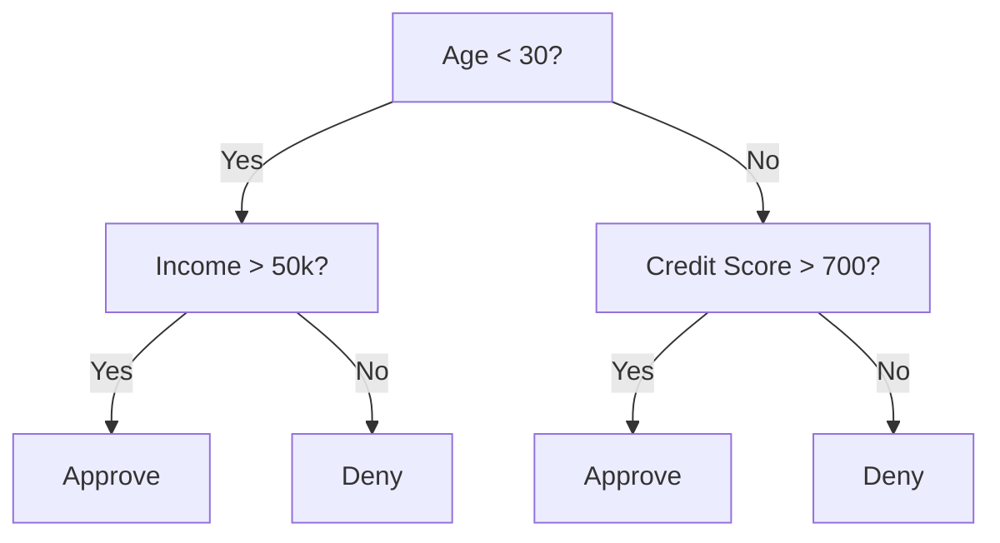
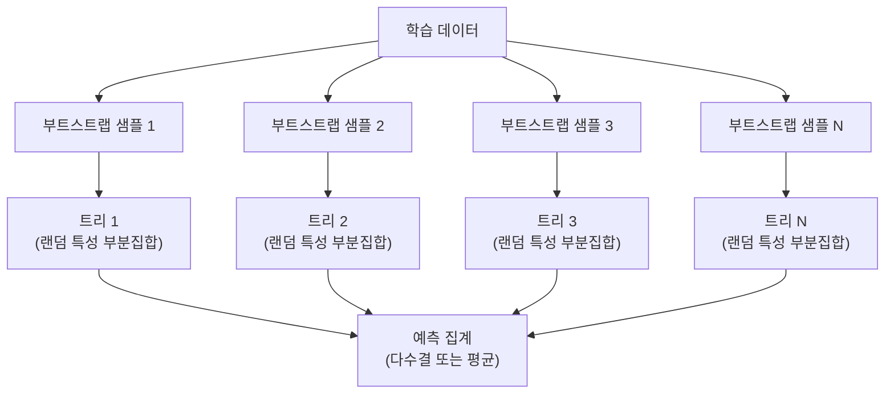

# 결정 트리와 랜덤 포레스트 (Decision Trees and Random Forests)

> 결정 트리는 그냥 플로우차트입니다. 하지만 그 숲은 ML에서 가장 강력한 도구 중 하나입니다.

**Type:** Build
**Language:** Python
**Prerequisites:** Phase 1 (Lessons 09 Information Theory, 06 Probability)
**Time:** ~90 minutes

## 학습 목표 (Learning Objectives)

- 지니 불순도·엔트로피·정보 이득을 계산해 최적의 결정 트리 분할을 찾습니다
- 사전 가지치기 제어(최대 깊이, 최소 샘플)가 있는 결정 트리 분류기를 처음부터 만듭니다
- 부트스트랩 샘플링과 특성 무작위화로 랜덤 포레스트를 구성하고, 왜 분산을 줄이는지 설명합니다
- MDI 특성 중요도와 순열 중요도를 비교하고, MDI가 편향되는 경우를 식별합니다

## 문제 상황 (The Problem)

표 형태 데이터가 있습니다. 행은 샘플, 열은 특성, 예측하고 싶은 타깃 열이 있습니다. 신경망을 던질 수도 있습니다. 하지만 표 데이터에서는 트리 기반 모델(결정 트리, 랜덤 포레스트, 그래디언트 부스팅 트리)이 딥러닝을 꾸준히 이깁니다. 구조화 데이터 Kaggle 대회는 트랜스포머가 아니라 XGBoost와 LightGBM이 장악합니다.

왜일까요? 트리는 혼합 특성 타입(수치·범주)을 전처리 없이 다룹니다. 특성 공학 없이 비선형 관계를 다룹니다. 해석 가능합니다: 트리를 보면 예측이 왜 나왔는지 정확히 알 수 있습니다. 그리고 많은 트리를 평균하는 랜덤 포레스트는 중간 규모 데이터셋에서 과적합에 매우 강합니다.

이 레슨은 재귀 분할로 결정 트리를 처음부터 만든 뒤, 그 위에 랜덤 포레스트를 쌓습니다. 분할 기준 뒤의 수학(지니 불순도, 엔트로피, 정보 이득)을 구현하고, 약한 학습기의 앙상블이 왜 강해지는지 이해합니다.

## 핵심 개념 (The Concept)

### 결정 트리가 하는 일

결정 트리는 yes/no 질문을 이어서 물어 특성 공간을 직사각 영역으로 분할합니다.



각 내부 노드는 특성을 임계값과 비교합니다. 각 리프 노드는 예측을 합니다. 새 데이터 포인트를 분류하려면 루트에서 시작해 리프에 도달할 때까지 가지를 따라갑니다.

트리는 각 노드에서 데이터를 가장 잘 나누는 특성과 임계값을 골라 위에서 아래로 만들어집니다. "가장 잘"은 분할 기준으로 정의합니다.

### 분할 기준: 불순도 측정

각 노드에는 샘플 집합이 있습니다. 자식 노드가 가능한 한 "순수"해지도록 — 각 자식이 대부분 한 클래스만 담도록 — 분할하고 싶습니다.

**지니 불순도 (Gini impurity)**는 그 노드의 클래스 분포에 따라 라벨을 붙였을 때, 무작위로 고른 샘플이 잘못 분류될 확률을 잽니다.

```
Gini(S) = 1 - sum(p_k^2)

where p_k is the proportion of class k in set S.
```

순수 노드(전부 한 클래스)에서는 Gini = 0입니다. 이진 분할에서 50/50이면 Gini = 0.5입니다. 낮을수록 좋습니다.

```
Example: 6 cats, 4 dogs

Gini = 1 - (0.6^2 + 0.4^2) = 1 - (0.36 + 0.16) = 0.48
```

**엔트로피 (Entropy)**는 노드의 정보량(무질서)을 잽니다. Phase 1 Lesson 09에서 다룹니다.

```
Entropy(S) = -sum(p_k * log2(p_k))
```

순수 노드에서는 entropy = 0입니다. 50/50 이진 분할에서는 entropy = 1.0입니다. 낮을수록 좋습니다.

```
Example: 6 cats, 4 dogs

Entropy = -(0.6 * log2(0.6) + 0.4 * log2(0.4))
        = -(0.6 * -0.737 + 0.4 * -1.322)
        = 0.442 + 0.529
        = 0.971 bits
```

**정보 이득 (Information gain)**은 분할 후 불순도(엔트로피 또는 지니)의 감소량입니다.

```
IG(S, feature, threshold) = Impurity(S) - weighted_avg(Impurity(S_left), Impurity(S_right))

where the weights are the proportions of samples in each child.
```

각 노드의 탐욕 알고리즘: 모든 특성과 가능한 모든 임계값을 시도합니다. 정보 이득을 최대화하는 (특성, 임계값) 쌍을 고릅니다.

### 분할이 동작하는 방식

현재 노드에 n개 특성, m개 샘플이 있는 데이터셋에서:

1. 각 특성 j (j = 1 to n)에 대해:
   - 특성 j로 샘플을 정렬
   - 연속된 서로 다른 값 사이 중점을 임계값으로 시도
   - 각 임계값의 정보 이득을 계산
2. 정보 이득이 가장 높은 특성과 임계값을 선택
3. 데이터를 왼쪽(feature <= threshold)과 오른쪽(feature > threshold)으로 분할
4. 각 자식에서 재귀

이 탐욕 접근은 전역 최적 트리를 보장하지 않습니다. 최적 트리 찾기는 NP-hard입니다. 하지만 탐욕 분할은 실무에서 잘 동작합니다.

### 정지 조건

정지 조건이 없으면 트리는 모든 리프가 순수해질 때까지(리프당 샘플 하나) 자랍니다. 학습 데이터를 완벽히 암기하고 일반화는 처참합니다.

**사전 가지치기 (Pre-pruning)**는 트리가 완전히 자라기 전에 멈춥니다:
- 최대 깊이: 설정한 깊이에 도달하면 분할 중단
- 리프당 최소 샘플: 노드에 샘플이 k개 미만이면 중단
- 최소 정보 이득: 최선의 분할이 불순도를 임계값 미만으로만 개선하면 중단
- 최대 리프 노드: 리프 총개수 제한

**사후 가지치기 (Post-pruning)**는 전체 트리를 키운 뒤 다시 잘라냅니다:
- 비용-복잡도 가지치기 (scikit-learn이 사용): 리프 수에 비례하는 페널티를 더합니다. 페널티를 키우면 트리가 작아집니다
- 축소 오차 가지치기: 검증 오차가 늘지 않으면 서브트리를 제거

사전 가지치기는 더 단순하고 빠릅니다. 사후 가지치기는 나중에 유용한 분할로 이어질 수 있는 분할을 너무 일찍 끊지 않아서, 종종 더 나은 트리를 만듭니다.

### 회귀용 결정 트리

회귀에서 리프 예측은 그 리프의 타깃 값들의 평균입니다. 분할 기준도 바뀝니다:

**분산 감소 (Variance reduction)**가 정보 이득을 대체합니다:

```
VR(S, feature, threshold) = Var(S) - weighted_avg(Var(S_left), Var(S_right))
```

분산을 가장 많이 줄이는 분할을 고릅니다. 트리는 입력 공간을 영역으로 나누고, 각 영역에서 상수(평균)를 예측합니다.

### 랜덤 포레스트: 앙상블의 힘

단일 결정 트리는 분산이 큽니다. 데이터의 작은 변화가 완전히 다른 트리를 만들 수 있습니다. 랜덤 포레스트는 많은 트리를 평균해 이를 고칩니다.



트리를 다양하게 만드는 두 가지 무작위성:

**배깅 (Bagging, bootstrap aggregating):** 각 트리는 학습 데이터에서 복원 추출한 부트스트랩 샘플로 학습합니다. 각 부트스트랩에는 원본 샘플의 약 63%가 등장합니다(나머지는 out-of-bag 샘플로 검증에 쓸 수 있음).

**특성 무작위화 (Feature randomization):** 각 분할에서 특성의 랜덤 부분집합만 고려합니다. 분류의 기본값은 sqrt(n_features), 회귀는 n_features/3입니다. 모든 트리가 같은 지배적 특성으로 분할하는 것을 막습니다.

핵심 통찰: 상관을 줄인(decorrelated) 많은 트리를 평균하면 편향을 키우지 않고 분산을 줄입니다. 개별 트리는 평범할 수 있습니다. 앙상블은 강합니다.

### 특성 중요도

랜덤 포레스트는 자연스럽게 특성 중요도 점수를 제공합니다. 가장 흔한 방법:

**평균 불순도 감소 (MDI, Mean Decrease in Impurity):** 각 특성에 대해, 그 특성이 쓰인 모든 트리·모든 노드에서 불순도 감소의 총합을 더합니다. 더 이른 분할에서 더 큰 불순도 감소를 내는 특성이 더 중요합니다.

```
importance(feature_j) = sum over all nodes where feature_j is used:
    (n_samples_at_node / n_total_samples) * impurity_decrease
```

빠릅니다(학습 중 계산)만, 고카디널리티 특성과 가능한 분할점이 많은 특성에 편향됩니다.

**순열 중요도 (Permutation importance)**는 대안입니다: 한 특성의 값을 섞고 모델 정확도가 얼마나 떨어지는지 잽니다. 더 신뢰할 만하지만 더 느립니다.

### 트리가 신경망을 이기는 때

표 데이터에서는 트리와 포레스트가 신경망을 압도합니다. 이유:

| Factor | Trees | Neural networks |
|--------|-------|----------------|
| 혼합 타입 (수치 + 범주) | 네이티브 지원 | 인코딩 필요 |
| 작은 데이터셋 (< 10k rows) | 잘 동작 | 과적합 |
| 특성 상호작용 | 분할로 발견 | 아키텍처 설계 필요 |
| 해석 가능성 | 완전 투명 | 블랙박스 |
| 학습 시간 | 분 단위 | 시간 단위 |
| 하이퍼파라미터 민감도 | 낮음 | 높음 |

데이터가 공간·순차 구조(이미지, 텍스트, 오디오)를 가질 때 신경망이 이깁니다. 평평한 특성 표에서는 트리가 기본값입니다.

```figure
decision-tree-depth
```

## 직접 만들기 (Build It)

### 1단계: 지니 불순도와 엔트로피

두 분할 기준을 처음부터 만들고, 어떤 분할이 좋은지에 대해 둘이 일치하는지 검증합니다.

```python
import math

def gini_impurity(labels):
    n = len(labels)
    if n == 0:
        return 0.0
    counts = {}
    for label in labels:
        counts[label] = counts.get(label, 0) + 1
    return 1.0 - sum((c / n) ** 2 for c in counts.values())

def entropy(labels):
    n = len(labels)
    if n == 0:
        return 0.0
    counts = {}
    for label in labels:
        counts[label] = counts.get(label, 0) + 1
    return -sum(
        (c / n) * math.log2(c / n) for c in counts.values() if c > 0
    )
```

### 2단계: 최선의 분할 찾기

모든 특성과 모든 임계값을 시도합니다. 정보 이득이 가장 높은 것을 반환합니다.

```python
def information_gain(parent_labels, left_labels, right_labels, criterion="gini"):
    measure = gini_impurity if criterion == "gini" else entropy
    n = len(parent_labels)
    n_left = len(left_labels)
    n_right = len(right_labels)
    if n_left == 0 or n_right == 0:
        return 0.0
    parent_impurity = measure(parent_labels)
    child_impurity = (
        (n_left / n) * measure(left_labels) +
        (n_right / n) * measure(right_labels)
    )
    return parent_impurity - child_impurity
```

### 3단계: DecisionTree 클래스 만들기

재귀 분할, 예측, 특성 중요도 추적. `_build`가 트리의 심장입니다: 노드가 순수하거나 사전 가지치기 한도에 도달하면 멈추고, 그렇지 않으면 최선의 분할을 취해 양쪽 자식으로 재귀합니다.

```python
import random

class DecisionTree:
    def __init__(self, max_depth=None, min_samples_split=2,
                 min_samples_leaf=1, criterion="gini",
                 max_features=None):
        self.max_depth = max_depth
        self.min_samples_split = min_samples_split
        self.min_samples_leaf = min_samples_leaf
        self.criterion = criterion
        self.max_features = max_features
        self.tree = None
        self.feature_importances_ = None

    def fit(self, X, y):
        self.n_features = len(X[0])
        self.feature_importances_ = [0.0] * self.n_features
        self.n_samples = len(X)
        self.tree = self._build(X, y, depth=0)
        total = sum(self.feature_importances_)
        if total > 0:
            self.feature_importances_ = [
                fi / total for fi in self.feature_importances_
            ]

    def predict(self, X):
        return [self._predict_one(x, self.tree) for x in X]

    def _build(self, X, y, depth):
        if len(set(y)) == 1:
            return {"leaf": True, "value": y[0]}

        if self.max_depth is not None and depth >= self.max_depth:
            return self._make_leaf(y)

        if len(y) < self.min_samples_split:
            return self._make_leaf(y)

        best_feature, best_threshold, best_gain = self._best_split(X, y)

        if best_feature is None or best_gain <= 0:
            return self._make_leaf(y)

        left_X, left_y, right_X, right_y = self._split_data(
            X, y, best_feature, best_threshold
        )

        if len(left_y) < self.min_samples_leaf or len(right_y) < self.min_samples_leaf:
            return self._make_leaf(y)

        weight = len(y) / self.n_samples
        self.feature_importances_[best_feature] += weight * best_gain

        return {
            "leaf": False,
            "feature": best_feature,
            "threshold": best_threshold,
            "left": self._build(left_X, left_y, depth + 1),
            "right": self._build(right_X, right_y, depth + 1),
        }

    def _make_leaf(self, y):
        counts = {}
        for label in y:
            counts[label] = counts.get(label, 0) + 1
        return {"leaf": True, "value": max(counts, key=counts.get)}

    def _best_split(self, X, y):
        best_feature = None
        best_threshold = None
        best_gain = -1.0

        if self.max_features == "sqrt":
            k = max(1, int(math.sqrt(self.n_features)))
            feature_indices = random.sample(range(self.n_features), k)
        elif isinstance(self.max_features, int):
            if self.max_features < 1:
                raise ValueError("max_features must be at least 1 when given as an integer")
            k = min(self.max_features, self.n_features)
            feature_indices = random.sample(range(self.n_features), k)
        else:
            feature_indices = list(range(self.n_features))

        for feature_idx in feature_indices:
            values = sorted(set(X[i][feature_idx] for i in range(len(X))))
            if len(values) <= 1:
                continue

            for i in range(len(values) - 1):
                threshold = (values[i] + values[i + 1]) / 2.0
                left_y = [y[j] for j in range(len(X)) if X[j][feature_idx] <= threshold]
                right_y = [y[j] for j in range(len(X)) if X[j][feature_idx] > threshold]

                if len(left_y) < self.min_samples_leaf or len(right_y) < self.min_samples_leaf:
                    continue

                gain = information_gain(y, left_y, right_y, self.criterion)
                if gain > best_gain:
                    best_gain = gain
                    best_feature = feature_idx
                    best_threshold = threshold

        return best_feature, best_threshold, best_gain

    def _split_data(self, X, y, feature, threshold):
        left_X, left_y, right_X, right_y = [], [], [], []
        for i in range(len(X)):
            if X[i][feature] <= threshold:
                left_X.append(X[i])
                left_y.append(y[i])
            else:
                right_X.append(X[i])
                right_y.append(y[i])
        return left_X, left_y, right_X, right_y

    def _predict_one(self, x, node):
        if node["leaf"]:
            return node["value"]
        if x[node["feature"]] <= node["threshold"]:
            return self._predict_one(x, node["left"])
        return self._predict_one(x, node["right"])
```

### 4단계: RandomForest 클래스 만들기

부트스트랩 샘플링, 특성 무작위화, 다수결 투표.

```python
class RandomForest:
    def __init__(self, n_trees=100, max_depth=None,
                 min_samples_split=2, max_features="sqrt",
                 criterion="gini"):
        self.n_trees = n_trees
        self.max_depth = max_depth
        self.min_samples_split = min_samples_split
        self.max_features = max_features
        self.criterion = criterion
        self.trees = []

    def fit(self, X, y):
        n = len(X)
        for _ in range(self.n_trees):
            indices = [random.randint(0, n - 1) for _ in range(n)]
            X_boot = [X[i] for i in indices]
            y_boot = [y[i] for i in indices]
            tree = DecisionTree(
                max_depth=self.max_depth,
                min_samples_split=self.min_samples_split,
                max_features=self.max_features,
                criterion=self.criterion,
            )
            tree.fit(X_boot, y_boot)
            self.trees.append(tree)

    def predict(self, X):
        all_preds = [tree.predict(X) for tree in self.trees]
        predictions = []
        for i in range(len(X)):
            votes = {}
            for preds in all_preds:
                v = preds[i]
                votes[v] = votes.get(v, 0) + 1
            predictions.append(max(votes, key=votes.get))
        return predictions
```

전체 구현과 모든 헬퍼 메서드는 `code/trees.py`를 보세요.

## 활용하기 (Use It)

scikit-learn이면 랜덤 포레스트 학습은 세 줄입니다:

```python
from sklearn.ensemble import RandomForestClassifier
from sklearn.datasets import load_iris
from sklearn.model_selection import train_test_split

X, y = load_iris(return_X_y=True)
X_train, X_test, y_train, y_test = train_test_split(X, y, random_state=42)

rf = RandomForestClassifier(n_estimators=100, random_state=42)
rf.fit(X_train, y_train)
print(f"Accuracy: {rf.score(X_test, y_test):.4f}")
print(f"Feature importances: {rf.feature_importances_}")
```

실무에서는 그래디언트 부스팅 트리(XGBoost, LightGBM, CatBoost)가 종종 랜덤 포레스트보다 강합니다. 트리를 순차적으로 만들고, 각 트리가 이전 트리의 오차를 보정하기 때문입니다. 하지만 랜덤 포레스트는 잘못 설정하기 어렵고 하이퍼파라미터 튜닝이 거의 필요 없습니다.

## 산출물 (Ship It)

이 레슨은 `outputs/prompt-tree-interpreter.md`를 만듭니다 — 비즈니스 이해관계자에게 결정 트리 분할을 해석해 주는 프롬프트입니다. 학습된 트리의 구조(깊이, 특성, 분할 임계값, 정확도)를 넣으면, 모델을 쉬운 말로 된 규칙으로 번역하고, 특성 중요도를 순위화하고, 과적합·누수를 표시하고, 다음 단계를 추천합니다. 코드를 읽지 않는 사람에게 트리 기반 모델을 설명해야 할 때 쓰세요.

## 연습 문제 (Exercises)

1. 클래스 3개인 2D 데이터셋에 단일 결정 트리를 학습하세요. 분할을 손으로 추적하고 직사각 결정 경계를 그리세요. max_depth=2와 max_depth=10의 경계를 비교하세요.

2. 회귀 트리를 위한 분산 감소 분할을 구현하세요. 점 200개에 대해 y = sin(x) + noise를 생성하고 회귀 트리를 맞추세요. 트리의 구간별 상수 예측을 진짜 곡선과 함께 플롯하세요.

3. 트리 1, 5, 10, 50, 200개로 랜덤 포레스트를 만드세요. 트리 수에 대한 학습 정확도와 테스트 정확도를 플롯하세요. 테스트 정확도는 평평해지지만 떨어지지 않음을 관찰하세요(포레스트는 과적합에 강함).

4. 데이터셋 5개에서 분할 기준으로 지니 불순도와 엔트로피를 비교하세요. 정확도와 트리 깊이를 측정하세요. 대부분 거의 동일한 결과가 나옵니다. 이유를 설명하세요.

5. 순열 중요도를 구현하세요. 한 특성이 랜덤 노이즈이지만 고카디널리티인 데이터셋에서 MDI 중요도와 비교하세요. MDI는 노이즈 특성을 높게 순위매깁니다. 순열 중요도는 그렇지 않습니다.

## 핵심 용어 (Key Terms)

| Term | What people say | What it actually means |
|------|----------------|----------------------|
| Decision tree | "예측용 플로우차트" | if/else 분할 시퀀스를 학습해 특성 공간을 직사각 영역으로 나누는 모델 |
| Gini impurity | "노드가 얼마나 섞였는지" | 노드에서 무작위 샘플을 잘못 분류할 확률. 0 = 순수, 0.5 = 이진에서 최대 불순도 |
| Entropy | "노드의 무질서" | 노드의 정보량. 0 = 순수, 1.0 = 이진에서 최대 불확실성. 정보 이론에서 옴 |
| Information gain | "분할이 얼마나 좋은지" | 분할 후 불순도 감소. 분할을 고르는 탐욕 기준 |
| Pre-pruning | "트리를 일찍 멈춤" | 최대 깊이·최소 샘플·최소 이득 임계값으로 트리 성장을 일찍 중단 |
| Post-pruning | "나중에 트리를 자름" | 전체 트리를 키운 뒤, 검증 성능을 개선하지 않는 서브트리를 제거 |
| Bagging | "랜덤 부분집합으로 학습" | Bootstrap aggregating. 복원 추출한 서로 다른 랜덤 샘플로 각 모델을 학습 |
| Random forest | "트리 무리" | 각 분할에서 랜덤 특성 부분집합과 부트스트랩 샘플로 학습한 결정 트리 앙상블 |
| Feature importance (MDI) | "어떤 특성이 중요한지" | 각 특성이 기여한 총 불순도 감소를 모든 트리·노드에 걸쳐 합산 |
| Permutation importance | "섞고 확인" | 특성 값을 무작위로 섞었을 때 정확도 하락. 노이즈 특성에는 MDI보다 신뢰할 만함 |
| Variance reduction | "정보 이득의 회귀 버전" | 정보 이득의 회귀 트리 대응물. 타깃 분산을 가장 많이 줄이는 분할을 고름 |
| Bootstrap sample | "중복 있는 랜덤 샘플" | 원본 데이터셋에서 복원 추출한 랜덤 샘플. 크기는 같고 중복이 있음 |

## 더 읽을거리 (Further Reading)

- [Breiman: Random Forests (2001)](https://link.springer.com/article/10.1023/A:1010933404324) — 원조 랜덤 포레스트 논문
- [Grinsztajn et al.: Why do tree-based models still outperform deep learning on tabular data? (2022)](https://arxiv.org/abs/2207.08815) — 표 과제에서 트리 vs 신경망의 엄밀한 비교
- [scikit-learn Decision Trees documentation](https://scikit-learn.org/stable/modules/tree.html) — 시각화 도구가 있는 실무 가이드
- [XGBoost: A Scalable Tree Boosting System (Chen & Guestrin, 2016)](https://arxiv.org/abs/1603.02754) — Kaggle을 장악한 그래디언트 부스팅 논문
