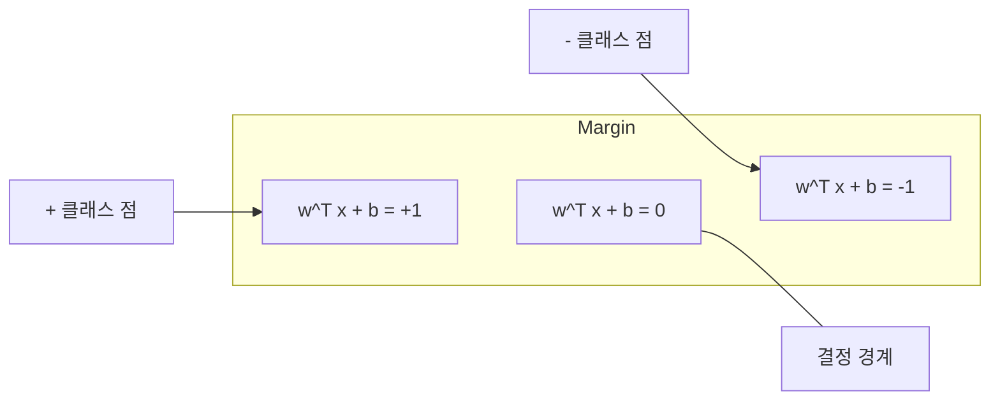
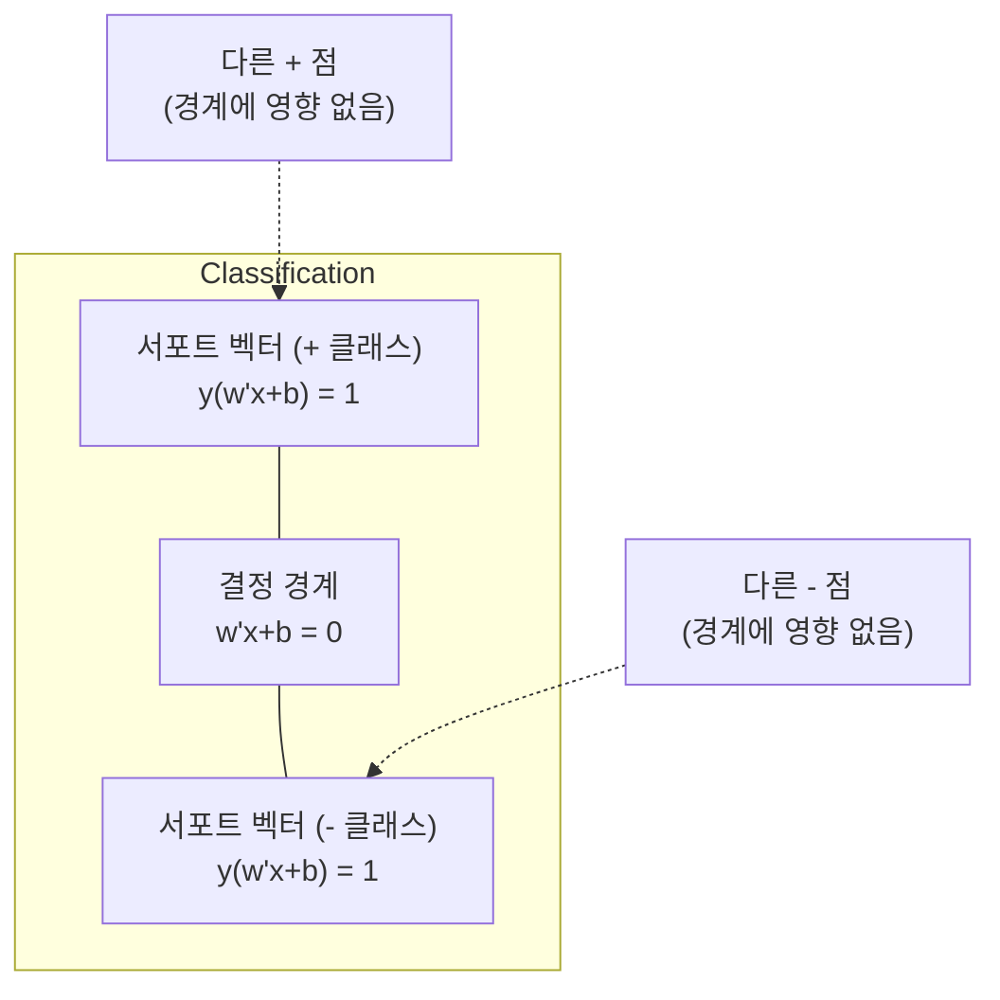
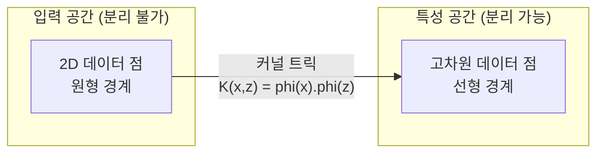

# 서포트 벡터 머신 (Support Vector Machines)

> 두 클래스 사이의 가장 넓은 길을 찾으세요. 그게 전부입니다.

**Type:** Build
**Language:** Python
**Prerequisites:** Phase 1 (Lessons 08 Optimization, 14 Norms and Distances, 18 Convex Optimization)
**Time:** ~90 minutes

## 학습 목표 (Learning Objectives)

- 힌지 손실과 원시(primal) 수식의 경사하강법으로 선형 SVM을 처음부터 구현합니다
- 최대 마진 원리를 설명하고, 학습된 모델에서 서포트 벡터를 식별합니다
- 선형·다항·RBF 커널을 비교하고, 커널 트릭이 명시적 고차원 매핑을 피하는 방식을 설명합니다
- C 파라미터가 제어하는 마진 폭과 분류 오차 사이의 트레이드오프를 평가합니다

## 문제 상황 (The Problem)

두 클래스의 데이터 포인트가 있고, 이를 가르는 직선(또는 초평면)을 그려야 합니다. 무한히 많은 직선이 가능합니다. 어느 것을 골라야 할까요?

마진이 가장 큰 것. 마진은 결정 경계와 양쪽에서 가장 가까운 데이터 포인트 사이의 거리입니다. 마진이 넓을수록 분류기가 더 확신하고, 보지 못한 데이터에 더 잘 일반화합니다.

이 직관이 서포트 벡터 머신으로 이어집니다. ML에서 가장 수학적으로 우아한 알고리즘 중 하나입니다. SVM은 딥러닝 이전의 지배적 분류 방법이었고, 작은 데이터셋·고차원 데이터·이론적 보장이 있는 원칙적이고 잘 이해된 모델이 필요할 때 여전히 최선의 선택입니다.

SVM은 Phase 1과 직접 연결됩니다: 최적화는 볼록하고(Lesson 18), 마진은 노름으로 재며(Lesson 14), 커널 트릭은 내적을 활용해 고차원 공간에서 계산하지 않고도 비선형 경계를 다룹니다.

## 핵심 개념 (The Concept)

### 최대 마진 분류기

라벨 y_i가 {-1, +1}이고 특성 벡터가 x_i인 선형 분리 가능 데이터가 있을 때, 클래스를 가르는 초평면 w^T x + b = 0을 원합니다.

점 x_i에서 초평면까지의 거리:

```
distance = |w^T x_i + b| / ||w||
```

올바르게 분류된 점: y_i * (w^T x_i + b) > 0. 마진은 초평면에서 양쪽 가장 가까운 점까지의 거리의 두 배입니다.



최적화 문제:

```
maximize    2 / ||w||     (마진 폭)
subject to  y_i * (w^T x_i + b) >= 1  for all i
```

동등하게 (||w||^2 최소화가 최적화하기 더 쉬움):

```
minimize    (1/2) ||w||^2
subject to  y_i * (w^T x_i + b) >= 1  for all i
```

이것은 볼록 이차 계획입니다. 유일한 전역 해가 있습니다. 마진 경계에 정확히 앉은 데이터 포인트(y_i * (w^T x_i + b) = 1인 곳)가 서포트 벡터입니다. 결정 경계를 결정하는 유일한 점들입니다. 서포트 벡터가 아닌 점을 움직이거나 제거해도 경계는 바뀌지 않습니다.

### 서포트 벡터: 결정적인 소수



대부분의 학습 점은 무관합니다. 서포트 벡터만 중요합니다. 그래서 SVM은 예측 시 메모리 효율적입니다: 전체 학습 집합이 아니라 서포트 벡터만 저장하면 됩니다.

서포트 벡터 수는 일반화 오차의 상한도 줍니다. 데이터셋 크기 대비 서포트 벡터가 적을수록 일반화가 더 좋습니다.

### 소프트 마진: C 파라미터로 노이즈 다루기

실제 데이터는 거의 완벽하게 분리되지 않습니다. 어떤 점은 경계의 잘못된 쪽에, 또는 마진 안에 있을 수 있습니다. 소프트 마진 수식은 슬랙 변수를 도입해 위반을 허용합니다.

```
minimize    (1/2) ||w||^2 + C * sum(xi_i)
subject to  y_i * (w^T x_i + b) >= 1 - xi_i
            xi_i >= 0  for all i
```

슬랙 변수 xi_i는 점 i가 마진을 얼마나 위반하는지 잽니다. C가 트레이드오프를 제어합니다:

| C value | Behavior |
|---------|----------|
| Large C | 위반을 강하게 페널티. 좁은 마진, 적은 오분류. 과적합 |
| Small C | 더 많은 위반 허용. 넓은 마진, 더 많은 오분류. 과소적합 |

C는 뒤집힌 정규화 강도입니다. 큰 C = 정규화 적음. 작은 C = 정규화 많음.

### 힌지 손실: SVM 손실 함수

소프트 마진 SVM은 비제약 최적화로 다시 쓸 수 있습니다:

```
minimize    (1/2) ||w||^2 + C * sum(max(0, 1 - y_i * (w^T x_i + b)))
```

항 max(0, 1 - y_i * f(x_i))가 힌지 손실입니다. 점이 올바르게 분류되고 마진 밖에 있으면 0입니다. 마진 안이거나 오분류되면 선형입니다.

```
한 점에 대한 힌지 손실:

loss
  |
  | \
  |  \
  |   \
  |    \
  |     \_______________
  |
  +-----|-----|-------->  y * f(x)
       0     1

y*f(x) >= 1이면 손실 0 (올바르게 분류, 마진 밖).
y*f(x) < 1이면 선형 페널티.
```

로지스틱 손실(로지스틱 회귀)과 비교:

```
Hinge:     max(0, 1 - y*f(x))          마진에서 딱딱한 컷오프
Logistic:  log(1 + exp(-y*f(x)))        매끄럽고, 정확히 0이 되지 않음
```

힌지 손실은 희소 해를 만듭니다(서포트 벡터만 기여가 0이 아님). 로지스틱 손실은 모든 데이터 포인트를 씁니다. 그래서 SVM은 예측 시 더 메모리 효율적입니다.

### 경사하강법으로 선형 SVM 학습

제약 QP를 풀지 않고, 힌지 손실 + L2 정규화에 대한 경사하강법으로 선형 SVM을 학습할 수 있습니다:

```
L(w, b) = (lambda/2) * ||w||^2 + (1/n) * sum(max(0, 1 - y_i * (w^T x_i + b)))

w에 대한 기울기:
  If y_i * (w^T x_i + b) >= 1:  dL/dw = lambda * w
  If y_i * (w^T x_i + b) < 1:   dL/dw = lambda * w - y_i * x_i

b에 대한 기울기:
  If y_i * (w^T x_i + b) >= 1:  dL/db = 0
  If y_i * (w^T x_i + b) < 1:   dL/db = -y_i
```

이것을 원시(primal) 수식이라고 합니다. 에포크당 O(n * d)로 실행되며, n은 샘플 수, d는 특성 수입니다. 크고 희소하며 고차원인 데이터(텍스트 분류)에서는 빠릅니다.

### 쌍대 수식과 커널 트릭

SVM 문제의 라그랑주 쌍대(Phase 1 Lesson 18, KKT 조건)는:

```
maximize    sum(alpha_i) - (1/2) * sum_ij(alpha_i * alpha_j * y_i * y_j * (x_i . x_j))
subject to  0 <= alpha_i <= C
            sum(alpha_i * y_i) = 0
```

쌍대는 데이터 포인트 사이의 내적 x_i . x_j만 포함합니다. 이것이 핵심 통찰입니다. 모든 내적을 커널 함수 K(x_i, x_j)로 바꾸면, 변환을 명시적으로 계산하지 않고도 SVM이 비선형 경계를 학습할 수 있습니다.

```
Linear kernel:      K(x, z) = x . z
Polynomial kernel:  K(x, z) = (x . z + c)^d
RBF (Gaussian):     K(x, z) = exp(-gamma * ||x - z||^2)
```

RBF 커널은 데이터를 무한 차원 공간으로 매핑합니다. 입력 공간에서 가까운 점은 커널 값이 1에 가깝습니다. 멀리 떨어진 점은 0에 가깝습니다. 임의의 매끄러운 결정 경계를 학습할 수 있습니다.



커널 트릭은 고차원 공간에 가지 않고도 그 공간에서의 내적을 계산합니다. D차원에서 차수 d의 다항 커널이면, 명시적 특성 공간은 O(D^d) 차원입니다. 하지만 K(x, z)는 O(D) 시간에 계산됩니다.

### 회귀용 SVM (SVR)

서포트 벡터 회귀는 데이터 주변에 폭 epsilon인 튜브를 맞춥니다. 튜브 안의 점은 손실 0입니다. 튜브 밖의 점은 선형으로 페널티를 받습니다.

```
minimize    (1/2) ||w||^2 + C * sum(xi_i + xi_i*)
subject to  y_i - (w^T x_i + b) <= epsilon + xi_i
            (w^T x_i + b) - y_i <= epsilon + xi_i*
            xi_i, xi_i* >= 0
```

epsilon 파라미터가 튜브 폭을 제어합니다. 넓은 튜브 = 서포트 벡터 적음 = 더 매끄러운 적합. 좁은 튜브 = 서포트 벡터 많음 = 더 타이트한 적합.

### SVM이 딥러닝에 밀린 이유 (그리고 여전히 이기는 때)

SVM은 1990년대 말부터 2010년대 초까지 ML을 지배했습니다. 딥러닝이 앞선 이유:

| Factor | SVMs | Deep learning |
|--------|------|---------------|
| Feature engineering | 필요함 | 특성을 학습 |
| Scalability | 커널은 O(n^2)~O(n^3) | SGD로 에포크당 O(n) |
| Image/text/audio | 수제 특성 필요 | 원시 데이터에서 학습 |
| Large datasets (>100k) | 느림 | 잘 스케일 |
| GPU acceleration | 이득 제한적 | 대규모 가속 |

SVM이 여전히 이기는 상황:
- 작은 데이터셋(수백~수천 샘플)
- 고차원 희소 데이터(TF-IDF 특성이 있는 텍스트)
- 수학적 보장이 필요할 때(마진 바운드)
- 학습 시간이 최소여야 할 때(선형 SVM은 매우 빠름)
- 마진 구조가 분명한 이진 분류
- 이상 탐지(one-class SVM)

```figure
svm-margin
```

## 직접 만들기 (Build It)

### 1단계: 힌지 손실과 기울기

기초입니다. 배치에 대한 힌지 손실과 그 기울기를 계산합니다.

```python
def hinge_loss(X, y, w, b):
    n = len(X)
    total_loss = 0.0
    for i in range(n):
        margin = y[i] * (dot(w, X[i]) + b)
        total_loss += max(0.0, 1.0 - margin)
    return total_loss / n
```

### 2단계: 경사하강법으로 선형 SVM

정규화된 힌지 손실을 최소화해 학습합니다. QP 솔버가 필요 없습니다.

```python
class LinearSVM:
    def __init__(self, lr=0.001, lambda_param=0.01, n_epochs=1000):
        self.lr = lr
        self.lambda_param = lambda_param
        self.n_epochs = n_epochs
        self.w = None
        self.b = 0.0

    def fit(self, X, y):
        n_features = len(X[0])
        self.w = [0.0] * n_features
        self.b = 0.0

        for epoch in range(self.n_epochs):
            for i in range(len(X)):
                margin = y[i] * (dot(self.w, X[i]) + self.b)
                if margin >= 1:
                    self.w = [wj - self.lr * self.lambda_param * wj
                              for wj in self.w]
                else:
                    self.w = [wj - self.lr * (self.lambda_param * wj - y[i] * X[i][j])
                              for j, wj in enumerate(self.w)]
                    self.b -= self.lr * (-y[i])

    def predict(self, X):
        return [1 if dot(self.w, x) + self.b >= 0 else -1 for x in X]
```

### 3단계: 커널 함수

선형·다항·RBF 커널을 구현합니다.

```python
def linear_kernel(x, z):
    return dot(x, z)

def polynomial_kernel(x, z, degree=3, c=1.0):
    return (dot(x, z) + c) ** degree

def rbf_kernel(x, z, gamma=0.5):
    diff = [xi - zi for xi, zi in zip(x, z)]
    return math.exp(-gamma * dot(diff, diff))
```

### 4단계: 마진과 서포트 벡터 식별

학습 후, 어느 점이 서포트 벡터인지 식별하고 마진 폭을 계산합니다.

```python
def find_support_vectors(X, y, w, b, tol=1e-3):
    support_vectors = []
    for i in range(len(X)):
        margin = y[i] * (dot(w, X[i]) + b)
        if abs(margin - 1.0) < tol:
            support_vectors.append(i)
    return support_vectors
```

전체 구현과 모든 데모는 `code/svm.py`를 보세요.

## 활용하기 (Use It)

scikit-learn으로:

```python
from sklearn.svm import SVC, LinearSVC, SVR
from sklearn.preprocessing import StandardScaler
from sklearn.pipeline import Pipeline

clf = Pipeline([
    ("scaler", StandardScaler()),
    ("svm", SVC(kernel="rbf", C=1.0, gamma="scale")),
])
clf.fit(X_train, y_train)
print(f"Accuracy: {clf.score(X_test, y_test):.4f}")
print(f"Support vectors: {clf['svm'].n_support_}")
```

중요: SVM을 학습하기 전에 항상 특성을 스케일하세요. 마진이 ||w||에 의존하고, 스케일되지 않은 특성은 기하를 왜곡하므로 SVM은 특성 크기에 민감합니다.

큰 데이터셋에는 `SVC`(쌍대 수식, O(n^2)~O(n^3)) 대신 `LinearSVC`(원시 수식, 에포크당 O(n))를 쓰세요:

```python
from sklearn.svm import LinearSVC

clf = Pipeline([
    ("scaler", StandardScaler()),
    ("svm", LinearSVC(C=1.0, max_iter=10000)),
])
```

## 연습 문제 (Exercises)

1. 2D 선형 분리 가능 데이터셋을 생성하세요. LinearSVM을 학습하고 서포트 벡터를 식별하세요. 서포트 벡터가 결정 경계에 가장 가까운 점인지 검증하세요.

2. 노이즈가 있는 데이터셋에서 C를 0.001부터 1000까지 바꾸세요. 각 C 값에 대해 결정 경계를 플롯하세요. 넓은 마진(과소적합)에서 좁은 마진(과적합)으로의 전환을 관찰하세요.

3. 클래스 경계가 원형(비선형)인 데이터셋을 만드세요. 선형 SVM이 실패함을 보이세요. RBF 커널 행렬을 계산하고, 커널이 유도한 특성 공간에서 클래스가 분리 가능해짐을 보이세요.

4. 같은 데이터셋에서 힌지 손실과 로지스틱 손실을 비교하세요. 선형 SVM과 로지스틱 회귀를 학습하세요. 각 모델의 결정 경계에 기여하는 학습 점 수를 세요(서포트 벡터 vs 모든 점).

5. SVR(epsilon-insensitive 손실)을 구현하세요. y = sin(x) + noise에 맞추세요. 예측 주변의 epsilon 튜브를 플롯하고 서포트 벡터(튜브 밖 점)를 강조하세요.

## 핵심 용어 (Key Terms)

| Term | What it actually means |
|------|----------------------|
| Support vectors | 결정 경계에 가장 가까운 학습 점. 초평면을 결정하는 유일한 점 |
| Margin | 결정 경계와 가장 가까운 서포트 벡터 사이의 거리. SVM이 이를 최대화 |
| Hinge loss | max(0, 1 - y*f(x)). 올바르게 분류되고 마진 밖이면 0. 그 외에는 선형 페널티 |
| C parameter | 마진 폭과 분류 오차 사이의 트레이드오프. 큰 C = 좁은 마진, 작은 C = 넓은 마진 |
| Soft margin | 슬랙 변수로 마진 위반을 허용하는 SVM 수식. 비분리 데이터를 다룸 |
| Kernel trick | 고차원 특성 공간으로 명시적으로 매핑하지 않고 그 공간의 내적을 계산 |
| Linear kernel | K(x, z) = x . z. 표준 내적과 동등. 선형 분리 가능 데이터용 |
| RBF kernel | K(x, z) = exp(-gamma * \|\|x-z\|\|^2). 무한 차원으로 매핑. 임의의 매끄러운 경계 학습 |
| Polynomial kernel | K(x, z) = (x . z + c)^d. 다항 조합의 특성 공간으로 매핑 |
| Dual formulation | 데이터 포인트 사이 내적에만 의존하는 SVM 문제의 재수식화. 커널을 가능하게 함 |
| SVR | Support Vector Regression. 데이터 주변에 epsilon-튜브를 맞춤. 튜브 안 점은 손실 0 |
| Slack variables | xi_i: 점이 마진을 얼마나 위반하는지. 마진 밖·올바르게 분류된 점은 0 |
| Maximum margin | 각 클래스의 가장 가까운 점까지의 거리를 최대화하는 초평면을 고르는 원리 |

## 더 읽을거리 (Further Reading)

- [Vapnik: The Nature of Statistical Learning Theory (1995)](https://link.springer.com/book/10.1007/978-1-4757-3264-1) — SVM과 통계적 학습의 기초 텍스트
- [Cortes & Vapnik: Support-vector networks (1995)](https://link.springer.com/article/10.1007/BF00994018) — 원본 SVM 논문
- [Platt: Sequential Minimal Optimization (1998)](https://www.microsoft.com/en-us/research/publication/sequential-minimal-optimization-a-fast-algorithm-for-training-support-vector-machines/) — SVM 학습을 실용적으로 만든 SMO 알고리즘
- [scikit-learn SVM documentation](https://scikit-learn.org/stable/modules/svm.html) — 구현 세부사항이 있는 실무 가이드
- [LIBSVM: A Library for Support Vector Machines](https://www.csie.ntu.edu.tw/~cjlin/libsvm/) — 대부분의 SVM 구현 뒤의 C++ 라이브러리
