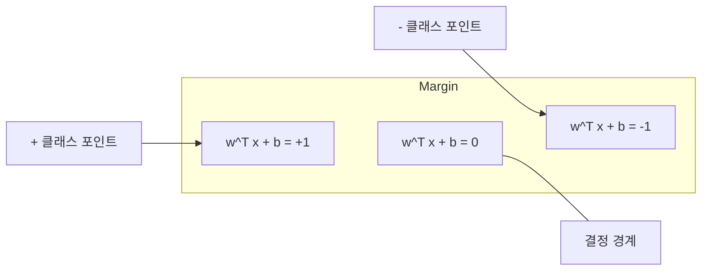
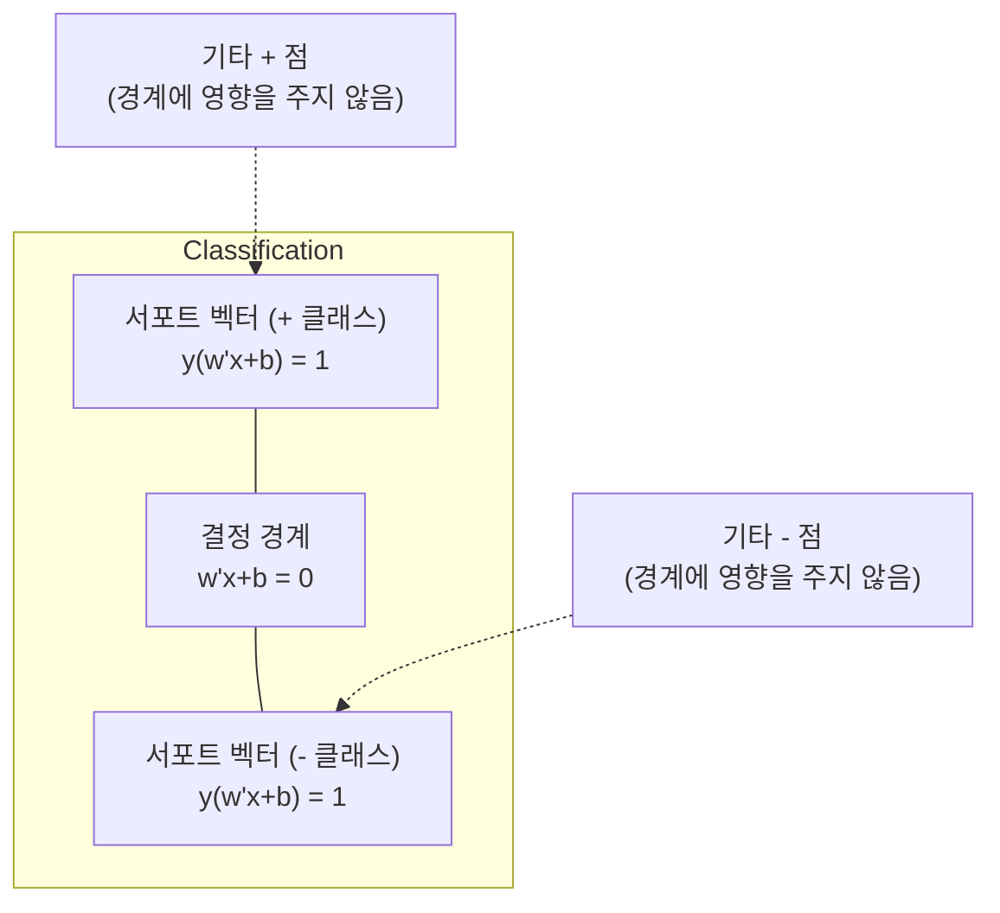
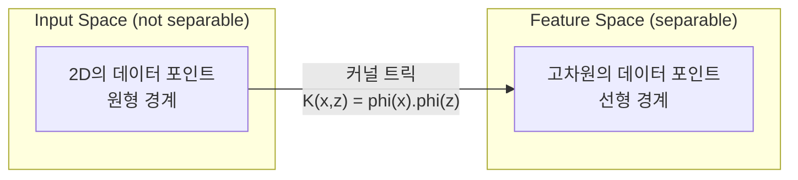

# 서포트 벡터 머신

> 두 클래스 사이의 가장 넓은 거리를 찾습니다. 이것이 전체 아이디어입니다.

**유형:** Build
**언어:** Python
**선수 요건:** 1단계 (08강 최적화, 14강 노름과 거리, 18강 볼록 최적화)
**시간:** 약 90분

## 학습 목표

- 힌지 손실과 원형 형식(primal formulation)에 대한 경사 하강법을 사용하여 선형 SVM을 처음부터 구현해 보세요
- 최대 마진 원리를 설명하고 학습된 모델에서 서포트 벡터를 식별해 보세요
- 선형, 다항식, RBF 커널을 비교하고 커널 트릭이 명시적인 고차원 매핑을 피하는 방식을 설명해 보세요
- C 매개변수가 마진 폭과 분류 오류 사이에서 제어하는 트레이드오프를 평가해 보세요

## 문제점

두 클래스의 데이터 포인트가 있고, 이들을 분리하는 선(또는 초평면)을 그려야 합니다. 무수히 많은 선이 작동할 수 있습니다. 어떤 선을 선택해야 할까요?

가장 큰 마진을 가진 선을 선택해야 합니다. 마진은 결정 경계와 각 쪽의 가장 가까운 데이터 포인트 사이의 거리입니다. 더 넓은 마진은 분류기가 더 확신하며, unseen data에 대해 더 잘 일반화됨을 의미합니다.

이 직관은 서포트 벡터 머신(SVM)으로 이어지며, 이는 ML에서 가장 수학적으로 우아한 알고리즘 중 하나입니다. SVM은 딥러닝 이전의 지배적인 분류 방법이었으며, 작은 데이터셋, 고차원 데이터, 그리고 이론적 보장이 있는 원리적이고 잘 이해된 모델이 필요한 문제에서 여전히 최선의 선택입니다.

SVM은 1단계와 직접 연결됩니다: 최적화는 볼록하며(18강), 마진은 노름으로 측정되고(14강), 커널 트릭은 내적을 활용하여 고차원 공간에서 계산하지 않고도 비선형 경계를 처리합니다.

## 개념

### 최대 마진 분류기

레이블 y_i가 {-1, +1}이고 특징 벡터가 x_i인 선형 분리 가능한 데이터가 주어지면, 클래스를 분리하는 초평면 w^T x + b = 0을 원합니다.

점 x_i에서 초평면까지의 거리는 다음과 같습니다:

```
distance = |w^T x_i + b| / ||w||
```

정확히 분류된 점에 대해: y_i * (w^T x_i + b) > 0. 마진은 초평면에서 양쪽 가장 가까운 점까지의 거리의 두 배입니다.



최적화 문제:

```
maximize    2 / ||w||     (the margin width)
subject to  y_i * (w^T x_i + b) >= 1  for all i
```

동등하게 (||w||^2 최소화는 최적화하기 더 쉽습니다):

```
minimize    (1/2) ||w||^2
subject to  y_i * (w^T x_i + b) >= 1  for all i
```

이것은 볼록 2차 프로그래밍입니다. 유일한 전역 해가 존재합니다. 마진 경계에 정확히 위치하는 데이터 포인트(y_i * (w^T x_i + b) = 1인 점)는 서포트 벡터입니다. 이 점들만이 결정 경계를 결정합니다. 서포트 벡터가 아닌 점을 이동하거나 제거해도 경계는 변하지 않습니다.

### 서포트 벡터: 중요한 몇 안 되는 점



대부분의 학습 포인트는 관련이 없습니다. 서포트 벡터만 중요합니다. SVM이 예측 시 메모리 효율적인 이유는 서포트 벡터만 저장하면 되고 전체 학습 집합을 저장할 필요가 없기 때문입니다.

서포트 벡터의 수는 일반화 오차에 대한 상한을 제공합니다. 데이터셋 크기에 비해 서포트 벡터가 적을수록 일반화 성능이 더 좋습니다.

### 소프트 마진: C 매개변수로 잡음 처리하기

실제 데이터는 거의 완벽하게 분리되지 않습니다. 일부 점은 경계의 반대쪽에 있거나 마진 내부에 있을 수 있습니다. 소프트 마진 공식은 슬랙 변수를 도입하여 위반을 허용합니다.

```
minimize    (1/2) ||w||^2 + C * sum(xi_i)
subject to  y_i * (w^T x_i + b) >= 1 - xi_i
            xi_i >= 0  for all i
```

슬랙 변수 xi_i는 점 i가 마진을 얼마나 위반하는지 측정합니다. C는 트레이드오프를 제어합니다:

| C 값 | 동작 |
|---------|----------|
| 큰 C | 위반을 강하게 페널티화합니다. 좁은 마진, 적은 오분류. 과적합 |
| 작은 C | 더 많은 위반을 허용합니다. 넓은 마진, 더 많은 오분류. 과소 적합 |

C는 정규화 강도의 역수입니다. 큰 C = 적은 정규화. 작은 C = 많은 정규화.

### 힝 손실: SVM 손실 함수

소프트 마진 SVM은 무제약 최적화 문제로 다시 쓸 수 있습니다:

```
minimize    (1/2) ||w||^2 + C * sum(max(0, 1 - y_i * (w^T x_i + b)))
```

항 max(0, 1 - y_i * f(x_i))는 힝 손실(hinge loss)입니다. 포인트가 올바르게 분류되고 마진 바깥에 있을 때 0이 됩니다. 포인트가 마진 내부에 있거나 잘못 분류될 때는 선형이 됩니다.

```
Hinge loss for a single point:

loss
  |
  | \
  |  \
  |   \
  |    \
  |     \_______________
  |
  +-----|-----|-------->  y * f(x)
       0     1

Zero loss when y*f(x) >= 1 (correctly classified, outside margin).
Linear penalty when y*f(x) < 1.
```

로지스틱 손실(로지스틱 회귀)과 비교해 보세요:

```
Hinge:     max(0, 1 - y*f(x))          Hard cutoff at margin
Logistic:  log(1 + exp(-y*f(x)))        Smooth, never exactly zero
```

힝 손실은 희소 해를 생성합니다(서포트 벡터만 비영(nonzero) 기여를 합니다). 로지스틱 손실은 모든 데이터 포인트를 사용합니다. 이는 SVM이 예측 시 메모리 효율성을 높여줍니다.

### 경사 하강법으로 선형 SVM 학습하기

제약 QP를 풀지 않고, 힝 손실과 L2 정규화에 대해 경사 하강법을 적용하여 선형 SVM을 학습할 수 있습니다:

```
L(w, b) = (lambda/2) * ||w||^2 + (1/n) * sum(max(0, 1 - y_i * (w^T x_i + b)))

Gradient with respect to w:
  If y_i * (w^T x_i + b) >= 1:  dL/dw = lambda * w
  If y_i * (w^T x_i + b) < 1:   dL/dw = lambda * w - y_i * x_i

Gradient with respect to b:
  If y_i * (w^T x_i + b) >= 1:  dL/db = 0
  If y_i * (w^T x_i + b) < 1:   dL/db = -y_i
```

이것을 원형(primal) 공식화라고 합니다. 에포크(epoch)당 O(n * d) 시간이 걸리며, 여기서 n은 샘플 수, d는 특징(feature) 수입니다. 크고 희소하며 고차원인 데이터(텍스트 분류)의 경우, 이 방법은 빠릅니다.

### 쌍대(dual) 공식화와 커널 트릭(kernel trick)

SVM 문제의 라그랑주 쌍대(Lagrangian dual)(1단계 18강, KKT 조건)는 다음과 같습니다:

```
maximize    sum(alpha_i) - (1/2) * sum_ij(alpha_i * alpha_j * y_i * y_j * (x_i . x_j))
subject to  0 <= alpha_i <= C
            sum(alpha_i * y_i) = 0
```

쌍대 공식화에는 데이터 포인트 간의 내적 x_i . x_j만 포함됩니다. 이것이 핵심 통찰입니다. 모든 내적을 커널 함수 K(x_i, x_j)로 대체하면, SVM은 변환을 명시적으로 계산하지 않고도 비선형 경계를 학습할 수 있습니다.

```
Linear kernel:      K(x, z) = x . z
Polynomial kernel:  K(x, z) = (x . z + c)^d
RBF (Gaussian):     K(x, z) = exp(-gamma * ||x - z||^2)
```

RBF 커널은 데이터를 무한 차원 공간으로 매핑합니다. 입력 공간에서 가까운 포인트는 커널 값이 1에 가깝습니다. 멀리 떨어진 포인트는 커널 값이 0에 가깝습니다. 매끄러운 결정 경계(decision boundary)를 학습할 수 있습니다.



커널 트릭은 고차원 공간으로 가지 않으면서도 그 공간에서의 내적을 계산합니다. D 차원에서 차수 d인 다항 커널의 경우, 명시적 특징 공간은 O(D^d) 차원을 가집니다. 하지만 K(x, z)는 O(D) 시간에 계산됩니다.

### 회귀를 위한 SVM (SVR)

서포트 벡터 회귀(SVR)는 데이터 주위에 너비 epsilon의 튜브(tube)를 맞춥니다. 튜브 내부의 포인트는 손실이 0입니다. 튜브 외부의 포인트는 선형으로 페널티를 받습니다.

```
minimize    (1/2) ||w||^2 + C * sum(xi_i + xi_i*)
subject to  y_i - (w^T x_i + b) <= epsilon + xi_i
            (w^T x_i + b) - y_i <= epsilon + xi_i*
            xi_i, xi_i* >= 0
```

epsilon 매개변수가 튜브의 너비를 제어합니다. 튜브가 넓어지면 서포트 벡터의 수가 줄어들고 더 매끄러운 적합(fit)을 얻습니다. 튜브가 좁아지면 서포트 벡터의 수가 늘어나고 더 촘촘한 적합을 얻습니다.

### SVM이 딥러닝에 밀린 이유 (그리고 여전히 SVM이 이기는 경우)

SVM은 1990년대 후반부터 2010년대 초반까지 ML 분야를 지배했습니다. 딥러닝이 SVM을 능가한 이유는 여러 가지입니다:

| 요인 | SVM | 딥러닝 |
|--------|------|---------------|
| 특징 엔지니어링 | 필요함 | 특징을 학습함 |
| 확장성 | 커널의 경우 O(n^2)에서 O(n^3) | SGD를 사용하여 에포크당 O(n) |
| 이미지/텍스트/오디오 | 수작업 특징(handcrafted features)이 필요함 | 원시 데이터에서 학습함 |
| 대규모 데이터셋 (>100k) | 느림 | 잘 확장됨 |
| GPU 가속 | 제한적인 이점 | 대규모 속도 향상 |

SVM은 다음 상황에서 여전히 이깁니다:
- 소규모 데이터셋 (수백에서 수천 개의 샘플)
- 고차원 희소 데이터 (TF-IDF 특징을 가진 텍스트)
- 수학적 보장이 필요한 경우 (마진 경계)
- 학습 시간이 최소화되어야 하는 경우 (선형 SVM은 매우 빠름)
- 명확한 마진 구조를 가진 이진 분류
- 이상치 탐지 (one-class SVM)

```figure
svm-margin
```

## 구현하기

### 1단계: 힌지 손실과 기울기

기초입니다. 배치에 대한 힌지 손실과 그 기울기를 계산합니다.

```python
def hinge_loss(X, y, w, b):
    n = len(X)
    total_loss = 0.0
    for i in range(n):
        margin = y[i] * (dot(w, X[i]) + b)
        total_loss += max(0.0, 1.0 - margin)
    return total_loss / n
```

### 2단계: 경사 하강법을 통한 선형 SVM

정규화된 힌지 손실을 최소화하여 학습합니다. QP 솔버가 필요하지 않습니다.

```python
class LinearSVM:
    def __init__(self, lr=0.001, lambda_param=0.01, n_epochs=1000):
        self.lr = lr
        self.lambda_param = lambda_param
        self.n_epochs = n_epochs
        self.w = None
        self.b = 0.0

    def fit(self, X, y):
        n_features = len(X[0])
        self.w = [0.0] * n_features
        self.b = 0.0

        for epoch in range(self.n_epochs):
            for i in range(len(X)):
                margin = y[i] * (dot(self.w, X[i]) + self.b)
                if margin >= 1:
                    self.w = [wj - self.lr * self.lambda_param * wj
                              for wj in self.w]
                else:
                    self.w = [wj - self.lr * (self.lambda_param * wj - y[i] * X[i][j])
                              for j, wj in enumerate(self.w)]
                    self.b -= self.lr * (-y[i])

    def predict(self, X):
        return [1 if dot(self.w, x) + self.b >= 0 else -1 for x in X]
```

### 3단계: 커널 함수

선형, 다항식 및 RBF 커널을 구현합니다.

```python
def linear_kernel(x, z):
    return dot(x, z)

def polynomial_kernel(x, z, degree=3, c=1.0):
    return (dot(x, z) + c) ** degree

def rbf_kernel(x, z, gamma=0.5):
    diff = [xi - zi for xi, zi in zip(x, z)]
    return math.exp(-gamma * dot(diff, diff))
```

### 4단계: 마진 및 서포트 벡터 식별

학습 후, 어떤 포인트가 서포트 벡터인지 식별하고 마진 너비를 계산합니다.

```python
def find_support_vectors(X, y, w, b, tol=1e-3):
    support_vectors = []
    for i in range(len(X)):
        margin = y[i] * (dot(w, X[i]) + b)
        if abs(margin - 1.0) < tol:
            support_vectors.append(i)
    return support_vectors
```

모든 데모가 포함된 완전한 구현은 `code/svm.py`를 참조하세요.

## 사용하기

scikit-learn를 사용할 때:

```python
from sklearn.svm import SVC, LinearSVC, SVR
from sklearn.preprocessing import StandardScaler
from sklearn.pipeline import Pipeline

clf = Pipeline([
    ("scaler", StandardScaler()),
    ("svm", SVC(kernel="rbf", C=1.0, gamma="scale")),
])
clf.fit(X_train, y_train)
print(f"Accuracy: {clf.score(X_test, y_test):.4f}")
print(f"Support vectors: {clf['svm'].n_support_}")
```

중요: SVM을 학습하기 전에 항상 특징(features)을 스케일링하세요. SVM은 특징의 크기에 민감합니다. 왜냐하면 마진은 ||w||에 의존하며, 스케일링되지 않은 특징은 기하학적 구조를 왜곡하기 때문입니다.

대규모 데이터셋에서는 `SVC` (이중 형식, O(n^2) ~ O(n^3)) 대신 `LinearSVC` (원형 형식, 에포크당 O(n))를 사용하세요:

```python
from sklearn.svm import LinearSVC

clf = Pipeline([
    ("scaler", StandardScaler()),
    ("svm", LinearSVC(C=1.0, max_iter=10000)),
])
```

## 연습 문제

1. 선형 분리 가능한 2D 데이터셋을 생성하세요. LinearSVM을 학습하고 서포트 벡터를 식별하세요. 서포트 벡터가 결정 경계에 가장 가까운 점임을 확인하세요.

2. 잡음이 있는 데이터셋에서 C를 0.001부터 1000까지 변화시키세요. 각 C 값에 대한 결정 경계를 플롯하세요. 넓은 마진(과소 적합)에서 좁은 마진(과적합)으로의 전환을 관찰하세요.

3. 클래스 경계가 원형인(선형이 아닌) 데이터셋을 만드세요. 선형 SVM이 실패함을 보이세요. RBF 커널 행렬을 계산하고, 커널이 유도하는 특징 공간에서 클래스가 분리 가능해짐을 보이세요.

4. 동일한 데이터셋에서 힌지 손실과 로지스틱 손실을 비교하세요. 선형 SVM과 로지스틱 회귀를 학습하세요. 각 모델의 결정 경계에 기여하는 학습 포인트의 수를 세어 보세요 (서포트 벡터 vs 모든 점).

5. SVR (엡실론 비민감 손실)을 구현하세요. y = sin(x) + 잡음에 적합하세요. 예측값 주위의 엡실론 튜브를 플롯하고, 튜브 밖의 점인 서포트 벡터를 강조하세요.

## 핵심 용어

| 용어 | 실제 의미 |
|------|----------------------|
| 서포트 벡터 | 결정 경계에 가장 가까운 학습 포인트. 초평면을 결정하는 유일한 점 |
| 마진 | 결정 경계와 가장 가까운 서포트 벡터 사이의 거리. SVM은 이를 최대화 |
| 힌지 손실 | max(0, 1 - y*f(x)). 올바르게 분류되고 마진 밖에 있을 때 0. 그 외에는 선형 페널티 |
| C 매개변수 | 마진 폭과 분류 오류 간의 트레이드오프. 큰 C = 좁은 마진, 작은 C = 넓은 마진 |
| 소프트 마진 | 슬랙 변수를 통해 마진 위반을 허용하는 SVM 형식. 분리 불가능한 데이터를 처리 |
| 커널 트릭 | 고차원 특징 공간에 명시적으로 매핑하지 않고도 그 공간에서의 내적을 계산 |
| 선형 커널 | K(x, z) = x . z. 표준 내적과 동일. 선형 분리 가능한 데이터에 사용 |
| RBF 커널 | K(x, z) = exp(-gamma * \|\|x-z\|\|^2). 무한 차원으로 매핑. 모든 매끄러운 경계를 학습 |
| 다항식 커널 | K(x, z) = (x . z + c)^d. 다항식 조합의 특징 공간으로 매핑합니다 |
| 쌍대 공식화 | SVM 문제를 데이터 포인트 간 내적에만 의존하도록 재공식화한 것입니다. 커널을 가능하게 합니다 |
| SVR | Support Vector Regression입니다. 데이터를 에psilon 튜브로 둘러싸서 적합합니다. 튜브 내부의 포인트는 손실이 0입니다 |
| 슬랙 변수 | xi_i: 포인트가 마진을 얼마나 위반하는지 측정합니다. 마진 밖에서 올바르게 분류된 포인트는 0입니다 |
| 최대 마진 | 각 클래스의 가장 가까운 포인트까지의 거리를 최대화하는 초평면을 선택하는 원칙입니다 |

## 추가 읽기

- [Vapnik: The Nature of Statistical Learning Theory (1995)](https://link.springer.com/book/10.1007/978-1-4757-3264-1) - SVM 및 통계 학습에 관한 기초 텍스트입니다
- [Cortes & Vapnik: Support-vector networks (1995)](https://link.springer.com/article/10.1007/BF00994018) - SVM 원 논문입니다
- [Platt: Sequential Minimal Optimization (1998)](https://www.microsoft.com/en-us/research/publication/sequential-minimal-optimization-a-fast-algorithm-for-training-support-vector-machines/) - SVM 학습을 실용적으로 만든 SMO 알고리즘입니다
- [scikit-learn SVM documentation](https://scikit-learn.org/stable/modules/svm.html) - 구현 세부 사항이 포함된 실용 가이드입니다
- [LIBSVM: A Library for Support Vector Machines](https://www.csie.ntu.edu.tw/~cjlin/libsvm/) - 대부분의 SVM 구현의 기반이 되는 C++ 라이브러리입니다
