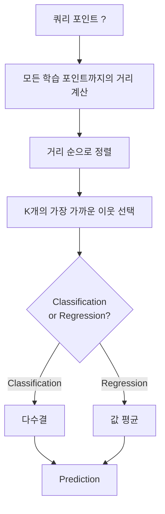
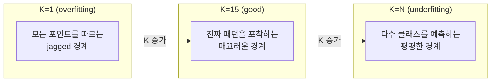
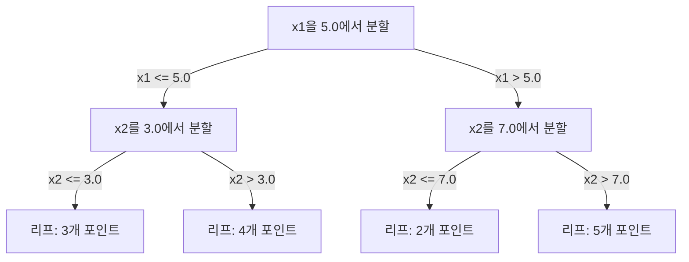

# K-최근접 이웃과 거리

> 모든 것을 저장합니다. 이웃을 살펴보고 예측합니다. 실제로 작동하는 가장 단순한 알고리즘입니다.

**유형:** Build
**언어:** Python
**선수 요건:** 1단계 (14강: 규범과 거리)
**시간:** 약 90분

## 학습 목표

- K를 설정하고 거리 가중치 투표를 적용하여 KNN 분류 및 회귀를 처음부터 구현해 보세요
- L1, L2, 코사인 및 민코프스키 거리 메트릭을 비교하고 주어진 데이터 유형에 적합한 메트릭을 선택해 보세요
- 차원의 저주를 설명하고 고차원 공간에서 KNN이 성능이 저하되는 이유를 시연해 보세요
- 효율적인 최근접 이웃 검색을 위해 KD-트리를 구축하고 브루트 포스(brute-force)보다 성능이 뛰어난 경우를 분석해 보세요

## 문제점

데이터셋이 있습니다. 새로운 데이터 포인트가 도착합니다. 이를 분류하거나 값을 예측해야 합니다. 선형 회귀나 SVM처럼 데이터에서 매개변수를 학습하는 대신, 새로운 점에 가장 가까운 K개의 학습 포인트를 찾아 투표를 진행합니다.

이것이 K-최근접 이웃(KNN)입니다. 학습 단계가 없습니다. 학습해야 할 매개변수가 없습니다. 최소화해야 할 손실 함수가 없습니다. 전체 학습 집합을 저장하고 예측 시점에 거리를 계산합니다.

너무 단순해서 작동하지 않을 것 같지만, KNN은 특히 소규모 및 중규모 데이터셋에서 많은 문제에 놀라울 정도로 경쟁력 있습니다. 이를 깊이 이해하면 거리 메트릭 선택(1단계 14강과 연결됨), 차원의 저주, 그리고 게으른 학습(lazy learning)과 성실한 학습(eager learning)의 차이 등 근본적인 개념을 파악할 수 있습니다.

KNN은 현대 AI의 모든 곳에서 다른 이름으로 등장합니다. 벡터 데이터베이스는 임베딩에 대해 KNN 검색을 수행합니다. RAG (검색 증강 생성)(RAG (Retrieval-Augmented Generation))는 K개의 가장 가까운 문서 청크를 찾습니다. 추천 시스템은 유사한 사용자나 항목을 찾습니다. 알고리즘은 동일합니다. 규모와 데이터 구조가 다를 뿐입니다.

## 개념

### KNN 작동 방식

레이블이 지정된 포인트의 데이터셋과 새로운 쿼리 포인트가 주어지면:

1. 쿼리에서 데이터셋의 모든 포인트까지의 거리를 계산합니다
2. 거리를 기준으로 정렬합니다
3. 가장 가까운 K개의 포인트를 선택합니다
4. 분류: K개의 이웃 중 다수결
5. 회귀: K개의 이웃 값의 평균 (또는 가중 평균)



이것이 알고리즘의 전부입니다. 피팅 없음. 경사 하강법 없음. 에포크 없음.

### K 선택

K는 유일한 하이퍼파라미터입니다. 편향-분산 트레이드오프를 제어합니다:

| K | 동작 |
|---|----------|
| K = 1 | 결정 경계가 모든 포인트를 따릅니다. 학습 오차 0. 높은 분산. 과적합 |
| 작은 K (3-5) | 지역 구조에 민감합니다. 복잡한 경계를 포착할 수 있습니다 |
| 큰 K | 더 매끄러운 경계. 잡음에 더 강건합니다. 과소 적합할 수 있습니다 |
| K = N | 모든 포인트에 대해 다수 클래스를 예측합니다. 최대 편향 |

N개의 포인트가 있는 데이터셋의 일반적인 시작점은 K = sqrt(N)입니다. 이진 분류에서는 동점을 피하기 위해 홀수 K를 사용하세요.



### 거리 측정법

거리 함수는 "가까움"의 의미를 정의합니다. 서로 다른 측정법은 서로 다른 이웃과 예측을 생성합니다.

**L2 (유클리드)**는 기본값입니다. 직선 거리입니다.

```
d(a, b) = sqrt(sum((a_i - b_i)^2))
```

특징 스케일에 민감합니다. KNN과 L2를 사용하기 전에 항상 특징을 표준화하세요.

**L1 (맨해튼)**은 절대 차이의 합입니다. 차이를 제곱하지 않으므로 L2보다 이상치에 더 강건합니다.

```
d(a, b) = sum(|a_i - b_i|)
```

**코사인 거리**는 벡터 사이의 각도를 측정하며 크기를 무시합니다. 텍스트 및 임베딩 데이터에 필수적입니다.

```
d(a, b) = 1 - (a . b) / (||a|| * ||b||)
```

**민코프스키**는 매개변수 p로 L01강 L2를 일반화합니다.

```
d(a, b) = (sum(|a_i - b_i|^p))^(1/p)

p=1: Manhattan
p=2: Euclidean
p->inf: Chebyshev (max absolute difference)
```

사용할 측정법은 데이터에 따라 다릅니다:

| 데이터 유형 | 최적 측정법 | 이유 |
|-----------|------------|-----|
| 수치 특징, 유사한 스케일 | L2 (유클리드) | 기본값, 공간 데이터에 적합 |
| 수치형 특징, 이상치 | L1 (맨해튼) | 강건하며, 큰 차이를 증폭하지 않음 |
| 텍스트 임베딩 | 코사인 | 크기는 잡음이고, 방향이 의미임 |
| 고차원 희소 데이터 | 코사인 또는 L1 | L2는 차원의 저주에 시달림 |
| 혼합 유형 | 사용자 정의 거리 | 특징 유형별로 메트릭을 결합 |

### 가중치 KNN

표준 KNN은 모든 K 이웃에 동일한 가중치를 부여합니다. 하지만 거리 0.1에 있는 이웃은 거리 5.0에 있는 이웃보다 더 중요해야 합니다.

**거리 가중치 KNN**은 각 이웃에 거리의 역수로 가중치를 부여합니다:

```
weight_i = 1 / (distance_i + epsilon)

For classification: weighted vote
For regression:     weighted average = sum(w_i * y_i) / sum(w_i)
```

epsilon은 쿼리 포인트가 학습 포인트와 정확히 일치할 때 0으로 나누는 것을 방지합니다.

가중치 KNN은 K 선택에 덜 민감합니다. 먼 이웃은 어쨌든 거의 기여하지 않기 때문입니다.

### 차원의 저주

KNN 성능은 고차원에서 저하됩니다. 이는 모호한 우려가 아닙니다. 이는 수학적 사실입니다.

**문제점 1: 거리가 수렴합니다.** 차원 수가 증가하면 최대 거리와 최소 거리의 비율이 1에 가까워집니다. 모든 점이 쿼리로부터 똑같이 "먼" 거리가 됩니다.

```
In d dimensions, for random uniform points:

d=2:    max_dist / min_dist = varies widely
d=100:  max_dist / min_dist ~ 1.01
d=1000: max_dist / min_dist ~ 1.001

When all distances are nearly equal, "nearest" is meaningless.
```

**문제점 2: 부피가 폭발합니다.** 데이터의 고정된 비율 내에서 K 이웃을 포착하려면, 검색 반경을 특징 공간의 훨씬 더 큰 부분을 커버하도록 확장해야 합니다. 고차원에서의 "이웃 영역"은 공간의 대부분을 포함합니다.

**문제점 3: 모서리가 지배합니다.** d차원 단위 초입방체에서 부피의 대부분은 중심이 아닌 모서리 근처에 집중됩니다. 입방체에 내접하는 구는 d가 증가함에 따라 부피의 비율이 사라집니다.

실제 결과: KNN은 약 20-50개 특징까지 잘 작동합니다. 그 이상에서는 KNN을 적용하기 전에 차원 축소(PCA, UMAP, t-SNE)가 필요하거나, 데이터의 내재적 저차원을 활용하는 트리 기반 검색 구조를 사용해야 합니다.

### KD-트리: 빠른 최근접 이웃 검색

브루트 포스 KNN은 쿼리에서 모든 학습 포인트까지의 거리를 계산합니다. 이는 쿼리당 O(n * d)입니다. 대규모 데이터셋에서는 너무 느립니다.

KD-트리는 공간에 대해 기능 축을 따라 재귀적으로 분할합니다. 각 레벨에서 중앙값을 기준으로 한 차원을 따라 분할합니다.



최근접 이웃을 찾기 위해 쿼리를 포함하는 리프까지 트리를 순회한 후, 더 가까운 포인트를 포함할 수 있는 경우에만 인접한 분할을 확인하기 위해 역추적합니다.

평균 쿼리 시간: 낮은 차원에서는 O(log n)입니다. 하지만 KD-트리는 차원이 높을 때(d > 20) 역추적이 제거하는 가지가 점점 줄어들기 때문에 O(n)으로 성능이 저하됩니다.

### 볼 트리: 중간 차원에서 더 잘 작동

볼 트리는 데이터를 축 정렬된 상자 대신 중첩된 초구로 분할합니다. 각 노드는 해당 하위 트리의 모든 포인트를 포함하는 볼(중심 + 반지름)을 정의합니다.

KD-트리에 대한 장점:
- 중간 차원(~50까지)에서 더 잘 작동
- 축 정렬되지 않은 구조를 처리
- 더 밀접한 경계 부피로 인해 검색 중에 더 많은 가지가 제거됨

KD-트리와 볼 트리 모두 정확한 알고리즘입니다. 대규모 검색(수백만 개의 포인트, 수백 개의 차원)을 위해 근사 최근접 이웃 (ANN)(Approximate Nearest Neighbor (ANN)) 방법(HNSW, IVF, 곱 양자화)을 대신 사용합니다. 이 내용은 1단계 14강에서 다루고 있습니다.

### 게으른 학습 vs 열심 학습

KNN은 게으른 학습자입니다. 학습 시간에는 아무 작업도 하지 않고 예측 시간에만 모든 작업을 수행합니다. 대부분의 다른 알고리즘(선형 회귀, SVM, 신경망)은 열심 학습자입니다. 학습 시간에는 컴팩트한 모델을 구축하기 위해 무거운 연산을 수행하며, 이후 예측은 빠릅니다.

| 측면 | 게으른 학습(KNN) | 열심 학습(SVM, 신경망) |
|--------|------------|------------------------|
| 학습 시간 | O(1) 데이터만 저장 | O(n * 에포크) |
| 예측 시간 | 쿼리당 O(n * d) | O(d) 또는 O(매개변수) |
| 예측 시 메모리 | 전체 훈련 세트 저장 | 모델 매개변수만 저장 |
| 새로운 데이터에 적응 | 포인트를 즉시 추가 | 모델 재훈련 |
| 결정 경계 | 암시적, 실시간 계산 | 명시적, 훈련 후 고정 |

게으른 학습(Lazy Learning)은 다음 상황에서 이상적입니다:
- 데이터셋이 자주 변경되는 경우 (재훈련 없이 포인트 추가/삭제)
- 매우 적은 수의 쿼리에 대한 예측이 필요한 경우
- 훈련 시간이 0인 경우
- 데이터셋이 작아서 브루트 포스 검색이 빠른 경우

### KNN 회귀

KNN 회귀는 다수결 투표 대신 K개의 이웃의 목표값을 평균냅니다.

```
prediction = (1/K) * sum(y_i for i in K nearest neighbors)

Or with distance weighting:
prediction = sum(w_i * y_i) / sum(w_i)
where w_i = 1 / distance_i
```

KNN 회귀는 구간별 상수(또는 가중치를 적용하면 구간별 매끄러운) 예측을 생성합니다. 훈련 데이터의 범위를 벗어나는 값으로 외삽할 수 없습니다. 훈련 목표값이 모두 00강 100 사이에 있다면, KNN은 200을 예측하지 못합니다.

```figure
knn-smoothness
```

## 구현하기

### 1단계: 거리 함수

L1, L2, 코사인 및 민코프스키 거리를 구현합니다. 이는 1단계 14강과 직접 연결됩니다.

```python
import math

def l2_distance(a, b):
    return math.sqrt(sum((ai - bi) ** 2 for ai, bi in zip(a, b)))

def l1_distance(a, b):
    return sum(abs(ai - bi) for ai, bi in zip(a, b))

def cosine_distance(a, b):
    dot_val = sum(ai * bi for ai, bi in zip(a, b))
    norm_a = math.sqrt(sum(ai ** 2 for ai in a))
    norm_b = math.sqrt(sum(bi ** 2 for bi in b))
    if norm_a == 0 or norm_b == 0:
        return 1.0
    return 1.0 - dot_val / (norm_a * norm_b)

def minkowski_distance(a, b, p=2):
    if p == float('inf'):
        return max(abs(ai - bi) for ai, bi in zip(a, b))
    return sum(abs(ai - bi) ** p for ai, bi in zip(a, b)) ** (1 / p)
```

### 2단계: KNN 분류기 및 회귀기

K, 거리 측정법 및 선택적 거리 가중치를 설정할 수 있는 완전한 KNN을 구축합니다.

```python
class KNN:
    def __init__(self, k=5, distance_fn=l2_distance, weighted=False,
                 task="classification"):
        self.k = k
        self.distance_fn = distance_fn
        self.weighted = weighted
        self.task = task
        self.X_train = None
        self.y_train = None

    def fit(self, X, y):
        self.X_train = X
        self.y_train = y

    def predict(self, X):
        return [self._predict_one(x) for x in X]
```

### 3단계: 효율적인 검색을 위한 KD-트리

각 차원의 중앙값으로 재귀적으로 분할하는 KD-트리를 처음부터 구축합니다.

```python
class KDTree:
    def __init__(self, X, indices=None, depth=0):
        # 데이터를 재귀적으로 분할
        self.axis = depth % len(X[0])
        # 현재 축의 중앙값으로 분할
        ...

    def query(self, point, k=1):
        # 리프까지 탐색한 후 백트래킹
        ...
```

모든 헬퍼 메서드와 데모가 포함된 완전한 구현은 `code/knn.py`를 참조하세요.

### 4단계: 특징 스케일링

KNN은 거리가 특징의 크기에 민감하므로 특징 스케일링이 필요합니다. 0에서 1000까지 범위를 가진 특징은 0에서 1까지 범위를 가진 특징을 압도합니다.

```python
def standardize(X):
    n = len(X)
    d = len(X[0])
    means = [sum(X[i][j] for i in range(n)) / n for j in range(d)]
    stds = [
        max(1e-10, (sum((X[i][j] - means[j]) ** 2 for i in range(n)) / n) ** 0.5)
        for j in range(d)
    ]
    return [[((X[i][j] - means[j]) / stds[j]) for j in range(d)] for i in range(n)], means, stds
```

## 사용하기

scikit-learn 사용 시:

```python
from sklearn.neighbors import KNeighborsClassifier
from sklearn.preprocessing import StandardScaler
from sklearn.pipeline import Pipeline

clf = Pipeline([
    ("scaler", StandardScaler()),
    ("knn", KNeighborsClassifier(n_neighbors=5, metric="euclidean")),
])
clf.fit(X_train, y_train)
print(f"Accuracy: {clf.score(X_test, y_test):.4f}")
```

scikit-learn은 데이터셋이 충분히 크고 차원이 충분히 낮으면 자동으로 KD-트리 또는 볼 트리를 사용합니다. 고차원 데이터의 경우 브루트 포스로 폴백합니다. `algorithm` 매개변수로 이를 제어할 수 있습니다.

대규모 최근접 이웃 검색(수백만 개의 벡터)에는 FAISS, Annoy 또는 벡터 데이터베이스를 사용해 보세요:

```python
import faiss

index = faiss.IndexFlatL2(dimension)
index.add(embeddings)
distances, indices = index.search(query_vectors, k=5)
```

## 연습 문제

1. 3개 클래스를 가진 2D 데이터셋에 KNN 분류를 구현해 보세요. K=1, K=5, K=15, K=N에 대한 결정 경계를 플롯하고, 과적합에서 과소 적합으로의 전환을 관찰해 보세요.

2. 2, 5, 10, 50, 100, 500차원에서 1000개의 랜덤 포인트를 생성해 보세요. 각 차원마다 최대 쌍별 거리와 최소 쌍별 거리의 비율을 계산하고, 차원 저주의 저주를 시각화하기 위해 비율 대 차원을 플롯해 보세요.

3. 텍스트 분류 문제(TF-IDF 벡터 사용)에서 KNN에 대한 L1, L2 및 코사인 거리를 비교해 보세요. 어떤 메트릭이 가장 높은 정확도를 제공하나요? 텍스트에서는 코사인 거리가 더 잘 작동하는 이유는 무엇인가요?

4. KD-트리를 구현하고 2D, 10D, 50D에서 각각 1k, 10k, 100k 포인트를 가진 데이터셋에 대해 쿼리 시간을 브루트 포스와 비교해 보세요. KD-트리가 브루트 포스보다 더 이상 빠르지 않게 되는 차원은 어디인가요?

5. y = sin(x) + noise에 대해 가중치 KNN 회귀자를 구축해 보세요. K=3, 10, 30에서 가중치 없는 KNN과 비교해 보세요. 가중치 적용이 특히 큰 K에서 더 매끄러운 예측을 생성함을 보여 주세요.

## 핵심 용어

| 용어 | 실제 의미 |
|------|----------------------|
| K-최근접 이웃 | 쿼리 포인트에 가장 가까운 K개의 학습 포인트를 찾아 예측하는 비모수 알고리즘 |
| 지연 학습 | 학습 시점에는 계산이 없습니다. 모든 작업은 예측 시점에 수행됩니다. KNN이 대표적인 예시입니다 |
| 조기 학습 | 컴팩트한 모델을 구축하기 위해 학습 시점에 무거운 계산을 수행합니다. 대부분의 ML 알고리즘이 조기 학습 방식입니다 |
| 차원 저주 | 고차원에서는 거리가 수렴하고 이웃이 공간의 대부분을 차지하게 되어 KNN이 효과적이지 않게 됩니다 |
| KD-트리 | 특성 축을 따라 공간을 재귀적으로 분할하는 이진 트리입니다. 저차원에서는 O(log n) 쿼리 시간을 가집니다 |
| 볼 트리 | 중첩된 초구(hypersphere)의 트리입니다. 중간 차원(~50까지)에서는 KD-트리보다 더 잘 작동합니다 |
| 가중치 KNN | 이웃이 거리의 역수에 따라 가중치가 부여됩니다. 더 가까운 이웃이 예측에 더 큰 영향을 미칩니다 |
| 특성 스케일링 | 특성을 비교 가능한 범위로 정규화하는 것입니다. KNN과 같은 거리 기반 방법에는 필수적입니다 |
| 다수결 투표 | K개의 이웃 중 가장 흔한 클래스를 세어 분류하는 방식 |
| 브루트 포스 검색 | 모든 학습 데이터 포인트와의 거리를 계산합니다. 쿼리당 O(n*d)입니다. 정확하지만 n이 크면 느립니다 |
| 근사 최근접 이웃 (ANN)(Approximate Nearest Neighbor (ANN)) | HNSW, LSH, IVF 등 정확한 검색보다 훨씬 빠르게 근사적으로 가장 가까운 점을 찾는 알고리즘 |
| 보로노이 다이어그램 | 각 영역이 하나의 학습 데이터 포인트에 다른 어떤 점보다 더 가까운 모든 점을 포함하는 공간 분할입니다. K=1 KNN은 보로노이 경계를 생성합니다 |

## 추가 읽기

- [Cover & Hart: Nearest Neighbor Pattern Classification (1967)](https://ieeexplore.ieee.org/document/1053964) - KNN이 베이지안 최적의 오차율의 최대 두 배를 가짐을 증명한 기초 논문
- [Friedman, Bentley, Finkel: An Algorithm for Finding Best Matches in Logarithmic Expected Time (1977)](https://dl.acm.org/doi/10.1145/355744.355745) - KD-트리의 원 논문
- [Beyer et al.: When Is "Nearest Neighbor" Meaningful? (1999)](https://link.springer.com/chapter/10.1007/3-540-49257-7_15) - 최근접 이웃의 차원 저주에 대한 형식적 분석
- [scikit-learn Nearest Neighbors documentation](https://scikit-learn.org/stable/modules/neighbors.html) - 알고리즘 선택을 포함한 실용 가이드
- [FAISS: A Library for Efficient Similarity Search](https://github.com/facebookresearch/faiss) - Meta의 십억 규모 근사 최근접 이웃 검색 라이브러리
