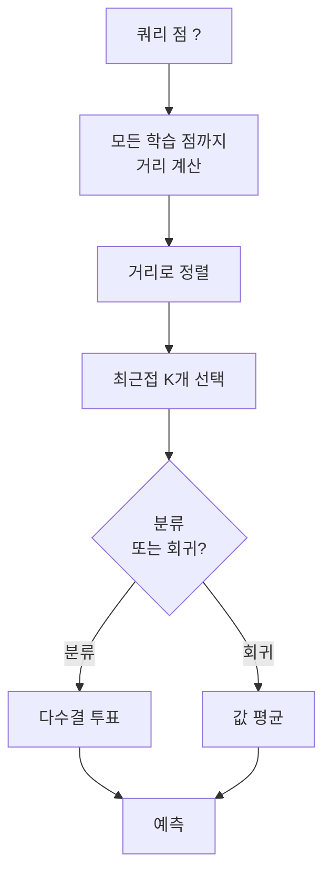
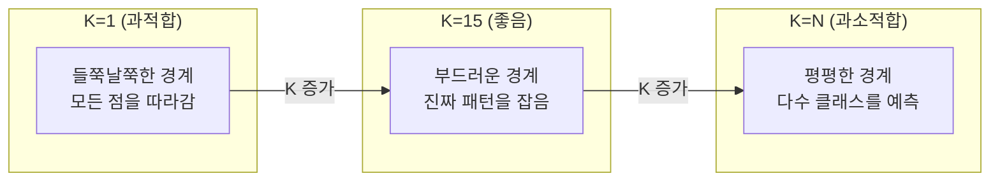
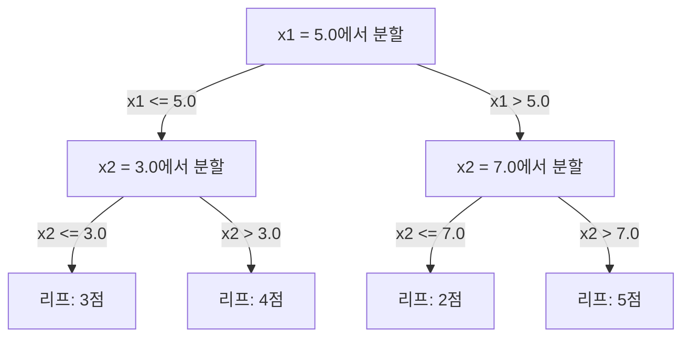

# KNN과 거리 지표 (K-Nearest Neighbors and Distances)

> 전부 저장하세요. 이웃을 보고 예측하세요. 실제로 동작하는 가장 단순한 알고리즘입니다.

**Type:** Build
**Language:** Python
**Prerequisites:** Phase 1 (Lesson 14 Norms and Distances)
**Time:** ~90 minutes

## 학습 목표 (Learning Objectives)

- 설정 가능한 K와 거리 가중 투표로 KNN 분류·회귀를 처음부터 구현합니다
- L1, L2, 코사인, Minkowski 거리 지표를 비교하고, 주어진 데이터 유형에 맞는 것을 선택합니다
- 차원의 저주를 설명하고, 고차원 공간에서 KNN이 왜 나빠지는지 보여 줍니다
- 효율적인 최근접 이웃 검색을 위한 KD-트리를 만들고, 언제 무차별 대입보다 나은지 분석합니다

## 문제 상황 (The Problem)

데이터셋이 있습니다. 새 데이터 포인트가 도착합니다. 분류하거나 값을 예측해야 합니다. 데이터에서 파라미터를 학습하는 대신(선형 회귀나 SVM처럼), 새 점에 가장 가까운 학습 점 K개를 찾아 투표하게 합니다.

이것이 K-최근접 이웃입니다. 학습 단계가 없습니다. 배울 파라미터도 없습니다. 최소화할 손실 함수도 없습니다. 전체 학습 집합을 저장하고, 예측 시점에 거리를 계산합니다.

너무 단순해서 안 될 것 같습니다. 하지만 KNN은 많은 문제, 특히 중소 규모 데이터셋에서 놀랍도록 경쟁력이 있고, 깊이 이해하면 근본 개념이 드러납니다: 거리 지표의 선택(Phase 1 Lesson 14와 연결), 차원의 저주, 게으른 학습과 열심 학습의 차이.

KNN은 현대 AI 어디에나 나타납니다. 이름만 다를 뿐입니다. 벡터 데이터베이스는 임베딩에 대해 KNN 검색을 합니다. RAG는 가장 가까운 문서 청크 K개를 찾습니다. 추천 시스템은 비슷한 사용자나 아이템을 찾습니다. 알고리즘은 같습니다. 규모와 자료구조가 다릅니다.

## 핵심 개념 (The Concept)

### KNN이 동작하는 방식

라벨된 점들의 데이터셋과 새 쿼리 점이 주어지면:

1. 쿼리에서 데이터셋의 모든 점까지 거리를 계산합니다
2. 거리로 정렬합니다
3. 가장 가까운 K개 점을 취합니다
4. 분류: K개 이웃의 다수결 투표
5. 회귀: K개 이웃 값의 평균(또는 가중 평균)



그게 전체 알고리즘입니다. 피팅도, 경사하강법도, 에폭도 없습니다.

### K 선택

K는 유일한 하이퍼파라미터입니다. 편향-분산 트레이드오프를 제어합니다:

| K | Behavior |
|---|----------|
| K = 1 | 결정 경계가 모든 점을 따라감. 학습 오차 0. 높은 분산. 과적합 |
| Small K (3-5) | 지역 구조에 민감. 복잡한 경계를 잡을 수 있음 |
| Large K | 더 부드러운 경계. 노이즈에 더 견고. 과소적합할 수 있음 |
| K = N | 모든 점에 대해 다수 클래스를 예측. 최대 편향 |

N개 점 데이터셋의 흔한 시작점은 K = sqrt(N)입니다. 이진 분류에서는 동점을 피하려고 홀수 K를 쓰세요.



### 거리 지표

거리 함수가 "가깝다"의 의미를 정의합니다. 지표가 다르면 이웃이 달라지고, 예측도 달라집니다.

**L2 (유클리드)**가 기본입니다. 직선 거리.

```
d(a, b) = sqrt(sum((a_i - b_i)^2))
```

특성 스케일에 민감합니다. KNN에 L2를 쓰기 전에 항상 특성을 표준화하세요.

**L1 (맨해튼)**은 절대 차이의 합입니다. 차이를 제곱하지 않으므로 L2보다 이상치에 더 견고합니다.

```
d(a, b) = sum(|a_i - b_i|)
```

**코사인 거리**는 크기를 무시하고 벡터 사이 각을 재습니다. 텍스트와 임베딩 데이터에 필수입니다.

```
d(a, b) = 1 - (a . b) / (||a|| * ||b||)
```

**Minkowski**는 파라미터 p로 L1과 L2를 일반화합니다.

```
d(a, b) = (sum(|a_i - b_i|^p))^(1/p)

p=1: Manhattan
p=2: Euclidean
p->inf: Chebyshev (max absolute difference)
```

어떤 지표를 쓸지는 데이터에 달립니다:

| Data type | Best metric | Why |
|-----------|------------|-----|
| 수치 특성, 비슷한 스케일 | L2 (Euclidean) | 기본값, 공간 데이터에 잘 맞음 |
| 수치 특성, 이상치 | L1 (Manhattan) | 견고, 큰 차이를 증폭하지 않음 |
| 텍스트 임베딩 | Cosine | 크기는 노이즈, 방향이 의미 |
| 고차원 희소 | Cosine 또는 L1 | L2는 차원의 저주에 취약 |
| 혼합 타입 | Custom distance | 특성 타입별로 지표를 결합 |

### 가중 KNN

표준 KNN은 K개 이웃에 같은 가중치를 줍니다. 하지만 거리 0.1인 이웃이 거리 5.0인 이웃보다 더 중요해야 합니다.

**거리 가중 KNN**은 각 이웃을 거리의 역수로 가중합니다:

```
weight_i = 1 / (distance_i + epsilon)

For classification: weighted vote
For regression:     weighted average = sum(w_i * y_i) / sum(w_i)
```

epsilon은 쿼리 점이 학습 점과 정확히 일치할 때 0으로 나누는 것을 막습니다.

가중 KNN은 K 선택에 덜 민감합니다. 먼 이웃은 어쨌든 기여가 거의 없기 때문입니다.

### 차원의 저주

KNN 성능은 고차원에서 나빠집니다. 모호한 우려가 아닙니다. 수학적 사실입니다.

**문제 1: 거리가 수렴합니다.** 차원이 커질수록 최대 거리와 최소 거리의 비가 1에 가까워집니다. 모든 점이 쿼리에서 비슷하게 "멀리" 있습니다.

```
In d dimensions, for random uniform points:

d=2:    max_dist / min_dist = varies widely
d=100:  max_dist / min_dist ~ 1.01
d=1000: max_dist / min_dist ~ 1.001

When all distances are nearly equal, "nearest" is meaningless.
```

**문제 2: 부피가 폭발합니다.** 데이터의 고정 비율 안에서 K개 이웃을 잡으려면, 특성 공간의 훨씬 더 큰 비율을 덮도록 검색 반경을 늘려야 합니다. 고차원의 "이웃"은 공간의 대부분을 포함합니다.

**문제 3: 모서리가 지배합니다.** d차원 단위 초입방체에서 대부분의 부피는 중심이 아니라 모서리 근처에 집중됩니다. 입방체에 내접한 구는 d가 커질수록 부피의 사라지는 비율만 담습니다.

실무적 결과: KNN은 대략 20-50개 특성까지 잘 동작합니다. 그 이상이면 KNN 전에 차원 축소(PCA, UMAP, t-SNE)가 필요하거나, 데이터의 내재 저차원을 활용하는 트리 기반 검색 구조를 써야 합니다.

### KD-트리: 빠른 최근접 이웃 검색

무차별 대입 KNN은 쿼리에서 모든 학습 점까지 거리를 계산합니다. 쿼리당 O(n * d)입니다. 큰 데이터셋에서는 너무 느립니다.

KD-트리는 특성 축을 따라 공간을 재귀적으로 분할합니다. 각 레벨에서 한 차원의 중앙값으로 나눕니다.



최근접 이웃을 찾으려면 쿼리를 담은 리프까지 트리를 순회한 뒤, 더 가까운 점이 있을 수 있는 이웃 파티션만 백트래킹하며 확인합니다.

평균 쿼리 시간: 저차원에서 O(log n). 하지만 고차원(d > 20)에서는 KD-트리가 O(n)으로 저하됩니다. 백트래킹이 가지를 점점 덜 잘라내기 때문입니다.

### 볼 트리: 중간 차원에 더 나음

볼 트리는 축정렬 상자 대신 중첩된 초구로 데이터를 분할합니다. 각 노드는 그 서브트리의 모든 점을 담는 공(중심 + 반경)을 정의합니다.

KD-트리 대비 장점:
- 중간 차원(최대 ~50)에서 더 잘 동작
- 축정렬이 아닌 구조를 다룸
- 더 타이트한 경계 부피로 검색 중 더 많은 가지를 가지치기

KD-트리와 볼 트리 모두 정확한 알고리즘입니다. 진짜 대규모 검색(수백만 점, 수백 차원)에는 근사 최근접 이웃 방법(HNSW, IVF, product quantization)을 씁니다. 이것들은 Phase 1 Lesson 14에서 다룹니다.

### 게으른 학습 vs 열심 학습

KNN은 게으른 학습자입니다: 학습 시점에는 아무 일도 하지 않고, 예측 시점에 모든 일을 합니다. 대부분의 다른 알고리즘(선형 회귀, SVM, 신경망)은 열심 학습자입니다: 학습 시점에 무거운 계산으로 압축된 모델을 만들고, 예측은 빠릅니다.

| Aspect | Lazy (KNN) | Eager (SVM, neural net) |
|--------|------------|------------------------|
| Training time | O(1) 데이터만 저장 | O(n * epochs) |
| Prediction time | 쿼리당 O(n * d) | O(d) 또는 O(parameters) |
| Memory at prediction | 전체 학습 집합 저장 | 모델 파라미터만 저장 |
| Adapts to new data | 점을 즉시 추가 | 모델을 재학습 |
| Decision boundary | 암시적, 즉석 계산 | 명시적, 학습 후 고정 |

게으른 학습이 이상적인 경우:
- 데이터셋이 자주 바뀜(재학습 없이 점 추가/삭제)
- 쿼리가 매우 적을 때
- 학습 시간 0이 필요할 때
- 무차별 대입 검색이 빠를 만큼 데이터셋이 작을 때

### 회귀용 KNN

다수결 대신, 회귀용 KNN은 K개 이웃의 타깃 값을 평균합니다.

```
prediction = (1/K) * sum(y_i for i in K nearest neighbors)

Or with distance weighting:
prediction = sum(w_i * y_i) / sum(w_i)
where w_i = 1 / distance_i
```

KNN 회귀는 조각별 상수(또는 가중이 있으면 조각별 부드러운) 예측을 만듭니다. 학습 데이터 범위 밖으로는 외삽할 수 없습니다. 학습 타깃이 전부 0과 100 사이면, KNN은 절대 200을 예측하지 않습니다.

```figure
knn-smoothness
```

## 직접 만들기 (Build It)

### 1단계: 거리 함수

L1, L2, 코사인, Minkowski 거리를 구현합니다. Phase 1 Lesson 14와 직접 연결됩니다.

```python
import math

def l2_distance(a, b):
    return math.sqrt(sum((ai - bi) ** 2 for ai, bi in zip(a, b)))

def l1_distance(a, b):
    return sum(abs(ai - bi) for ai, bi in zip(a, b))

def cosine_distance(a, b):
    dot_val = sum(ai * bi for ai, bi in zip(a, b))
    norm_a = math.sqrt(sum(ai ** 2 for ai in a))
    norm_b = math.sqrt(sum(bi ** 2 for bi in b))
    if norm_a == 0 or norm_b == 0:
        return 1.0
    return 1.0 - dot_val / (norm_a * norm_b)

def minkowski_distance(a, b, p=2):
    if p == float('inf'):
        return max(abs(ai - bi) for ai, bi in zip(a, b))
    return sum(abs(ai - bi) ** p for ai, bi in zip(a, b)) ** (1 / p)
```

### 2단계: KNN 분류기와 회귀기

설정 가능한 K, 거리 지표, 선택적 거리 가중이 있는 전체 KNN을 만듭니다.

```python
class KNN:
    def __init__(self, k=5, distance_fn=l2_distance, weighted=False,
                 task="classification"):
        self.k = k
        self.distance_fn = distance_fn
        self.weighted = weighted
        self.task = task
        self.X_train = None
        self.y_train = None

    def fit(self, X, y):
        self.X_train = X
        self.y_train = y

    def predict(self, X):
        return [self._predict_one(x) for x in X]
```

### 3단계: 효율적 검색을 위한 KD-트리

각 차원의 중앙값으로 재귀 분할하는 KD-트리를 처음부터 만듭니다.

```python
class KDTree:
    def __init__(self, X, indices=None, depth=0):
        # Recursively partition the data
        self.axis = depth % len(X[0])
        # Split on median of the current axis
        ...

    def query(self, point, k=1):
        # Traverse to leaf, then backtrack
        ...
```

전체 헬퍼 메서드와 데모는 `code/knn.py`를 보세요.

### 4단계: 특성 스케일링

거리는 특성 크기에 민감하므로 KNN에는 특성 스케일링이 필요합니다. 0~1000 범위 특성이 0~1 범위 특성을 지배합니다.

```python
def standardize(X):
    n = len(X)
    d = len(X[0])
    means = [sum(X[i][j] for i in range(n)) / n for j in range(d)]
    stds = [
        max(1e-10, (sum((X[i][j] - means[j]) ** 2 for i in range(n)) / n) ** 0.5)
        for j in range(d)
    ]
    return [[((X[i][j] - means[j]) / stds[j]) for j in range(d)] for i in range(n)], means, stds
```

## 활용하기 (Use It)

scikit-learn으로:

```python
from sklearn.neighbors import KNeighborsClassifier
from sklearn.preprocessing import StandardScaler
from sklearn.pipeline import Pipeline

clf = Pipeline([
    ("scaler", StandardScaler()),
    ("knn", KNeighborsClassifier(n_neighbors=5, metric="euclidean")),
])
clf.fit(X_train, y_train)
print(f"Accuracy: {clf.score(X_test, y_test):.4f}")
```

scikit-learn은 데이터셋이 충분히 크고 차원이 충분히 낮을 때 자동으로 KD-트리 또는 볼 트리를 씁니다. 고차원 데이터에서는 무차별 대입으로 돌아갑니다. `algorithm` 파라미터로 제어할 수 있습니다.

대규모 최근접 이웃 검색(수백만 벡터)에는 FAISS, Annoy, 또는 벡터 데이터베이스를 쓰세요:

```python
import faiss

index = faiss.IndexFlatL2(dimension)
index.add(embeddings)
distances, indices = index.search(query_vectors, k=5)
```

## 연습 문제 (Exercises)

1. 클래스 3개인 2D 데이터셋에서 KNN 분류를 구현하세요. K=1, K=5, K=15, K=N에 대해 결정 경계를 그리세요. 과적합에서 과소적합으로의 전이를 관찰하세요.

2. 2, 5, 10, 50, 100, 500차원에서 무작위 점 1000개를 생성하세요. 각 차원에 대해 최대 쌍별 거리와 최소 쌍별 거리의 비를 계산하세요. 차원의 저주를 시각화하려면 비 대 차원을 그리세요.

3. 텍스트 분류 문제(TF-IDF 벡터 사용)에서 KNN에 L1, L2, 코사인 거리를 비교하세요. 어떤 지표가 최고 정확도인가요? 텍스트에서 코사인이 이기는 경향이 있는 이유는?

4. KD-트리를 구현하고 2D, 10D, 50D에서 1k, 10k, 100k 점 데이터셋에 대해 무차별 대입 대비 쿼리 시간을 측정하세요. 어느 차원에서 KD-트리가 무차별 대입보다 빨라지기를 멈추나요?

5. y = sin(x) + noise에 대한 가중 KNN 회귀기를 만드세요. K=3, 10, 30에서 비가중 KNN과 비교하세요. 가중이 더 부드러운 예측을 만들고, 특히 큰 K에서 그렇다는 것을 보이세요.

## 핵심 용어 (Key Terms)

| Term | What it actually means |
|------|----------------------|
| K-nearest neighbors | 쿼리에 가장 가까운 학습 점 K개를 찾아 예측하는 비모수 알고리즘 |
| Lazy learning | 학습 시점에 계산 없음. 모든 일은 예측 시점에. KNN이 전형적 예 |
| Eager learning | 학습 시점에 무거운 계산으로 압축 모델을 만듦. 대부분의 ML 알고리즘이 열심 |
| Curse of dimensionality | 고차원에서 거리가 수렴하고 이웃이 공간 대부분을 덮어 KNN이 무력해짐 |
| KD-tree | 특성 축을 따라 공간을 재귀 분할하는 이진 트리. 저차원에서 O(log n) 쿼리 |
| Ball tree | 중첩 초구의 트리. 중간 차원(최대 ~50)에서 KD-트리보다 나음 |
| Weighted KNN | 거리의 역수로 이웃을 가중. 가까운 이웃이 예측에 더 큰 영향 |
| Feature scaling | 특성을 비슷한 범위로 정규화. KNN 같은 거리 기반 방법에 필수 |
| Majority vote | K개 이웃 중 가장 흔한 클래스를 세어 분류 |
| Brute force search | 모든 학습 점까지 거리 계산. 쿼리당 O(n*d). 정확하지만 큰 n에서 느림 |
| Approximate nearest neighbor | 정확한 검색보다 훨씬 빠르게 대략적 최근접 점을 찾는 알고리즘(HNSW, LSH, IVF) |
| Voronoi diagram | 각 영역이 한 학습 점에 다른 어떤 점보다 가까운 모든 점을 담는 공간 분할. K=1 KNN이 Voronoi 경계를 만듦 |

## 더 읽을거리 (Further Reading)

- [Cover & Hart: Nearest Neighbor Pattern Classification (1967)](https://ieeexplore.ieee.org/document/1053964) — KNN의 오류율이 베이즈 최적의 최대 두 배임을 증명한 기초 논문
- [Friedman, Bentley, Finkel: An Algorithm for Finding Best Matches in Logarithmic Expected Time (1977)](https://dl.acm.org/doi/10.1145/355744.355745) — 원조 KD-트리 논문
- [Beyer et al.: When Is "Nearest Neighbor" Meaningful? (1999)](https://link.springer.com/chapter/10.1007/3-540-49257-7_15) — 최근접 이웃에 대한 차원의 저주 형식 분석
- [scikit-learn Nearest Neighbors documentation](https://scikit-learn.org/stable/modules/neighbors.html) — 알고리즘 선택이 있는 실무 가이드
- [FAISS: A Library for Efficient Similarity Search](https://github.com/facebookresearch/faiss) — 십억 규모 근사 최근접 이웃 검색을 위한 Meta의 라이브러리
