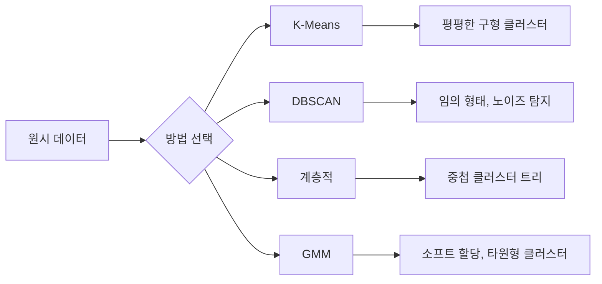

# 비지도 학습 (Unsupervised Learning)

> 라벨도 없고, 선생님도 없습니다. 알고리즘이 스스로 구조를 찾습니다.

**Type:** Build
**Languages:** Python
**Prerequisites:** Phase 1 (Norms & Distances, Probability & Distributions), Phase 2 Lessons 1-6
**Time:** ~90 minutes

## 학습 목표 (Learning Objectives)

- K-Means, DBSCAN, 가우시안 혼합 모델(GMM)을 처음부터 구현하고 클러스터링 동작을 비교합니다
- 실루엣 점수와 엘보우 방법으로 클러스터 품질을 평가해 최적 K를 선택합니다
- DBSCAN이 K-Means보다 나은 경우를 설명하고, 비구형 클러스터·이상치를 다루는 알고리즘을 식별합니다
- 정상 패턴에서 벗어난 점을 표시하는 이상 탐지 파이프라인을 클러스터링으로 만듭니다

## 문제 상황 (The Problem)

지금까지의 모든 ML 레슨은 라벨 데이터를 가정했습니다: "여기 입력이 있고, 여기 정답 출력이 있다." 현실에서 라벨은 비쌉니다. 병원에는 수백만 건의 환자 기록이 있지만, 질병 범주로 일일이 손으로 태깅한 사람은 없습니다. 이커머스 사이트에는 수백만 세션이 있지만, 고객 세그먼트를 손으로 라벨한 사람은 없습니다. 보안팀은 네트워크 로그가 있지만, 모든 이상을 표시한 사람은 없습니다.

비지도 학습은 무엇을 찾을지 지시받지 않고 패턴을 찾습니다. 비슷한 데이터 포인트를 묶고, 숨은 구조를 발견하고, 이상을 드러냅니다. 지도 학습이 정답지가 있는 교과서로 배우는 것이라면, 비지도 학습은 패턴이 드러날 때까지 원시 데이터를 응시하는 것입니다.

함정: 라벨이 없으면 "맞다/틀리다"를 직접 측정할 수 없습니다. 알고리즘이 찾은 구조가 의미 있는지 평가하려면 다른 도구가 필요합니다.

## 핵심 개념 (The Concept)

### 클러스터링: 비슷한 것을 묶기

클러스터링은 각 데이터 포인트를 그룹(클러스터)에 할당해, 같은 그룹 안 점들이 다른 그룹 점들보다 서로 더 비슷하게 만듭니다. 질문은 항상 같습니다: "비슷하다"는 무엇을 뜻하는가?



### K-Means: 일꾼

K-Means는 데이터를 정확히 K개 클러스터로 분할합니다. 각 클러스터에는 중심(질량 중심)이 있고, 모든 점은 가장 가까운 중심에 속합니다.

Lloyd 알고리즘:

1. 초기 중심으로 K개 무작위 점을 고른다
2. 각 데이터 점을 가장 가까운 중심에 할당한다
3. 각 중심을 할당된 점들의 평균으로 다시 계산한다
4. 할당이 더 이상 바뀌지 않을 때까지 2-3을 반복한다

목적 함수(inertia)는 각 점에서 할당된 중심까지의 제곱 거리 합입니다. K-Means는 이를 최소화하지만, 국소 최솟값만 찾습니다. 초기화가 다르면 결과가 달라질 수 있습니다.

### K 고르기

표준 방법 두 가지:

**엘보우 방법 (Elbow method):** K = 1, 2, 3, ..., n에 대해 K-Means를 돌립니다. inertia vs K를 그립니다. 클러스터를 더 추가해도 inertia가 크게 줄지 않는 "팔꿈치"를 찾습니다.

**실루엣 점수 (Silhouette score):** 각 점에 대해, 자기 클러스터와의 유사도(a)와 가장 가까운 다른 클러스터와의 유사도(b)를 잽니다. 실루엣 계수는 (b - a) / max(a, b)이며, -1(잘못된 클러스터)부터 +1(잘 클러스터됨)까지입니다. 전역 점수를 위해 모든 점에 대해 평균합니다.

### DBSCAN: 밀도 기반 클러스터링

K-Means는 클러스터가 구형이라고 가정하고, 미리 K를 고르게 합니다. DBSCAN은 둘 다 가정하지 않습니다. 성긴 영역으로 분리된 밀집 영역으로 클러스터를 찾습니다.

파라미터 두 개:
- **eps**: 이웃 반경
- **min_samples**: 밀집 영역을 이루는 데 필요한 최소 점 수

점의 세 유형:
- **코어 점 (Core point)**: eps 거리 안에 최소 min_samples개 점이 있음
- **경계 점 (Border point)**: 코어 점의 eps 안에 있지만 자신은 코어가 아님
- **노이즈 점 (Noise point)**: 코어도 경계도 아님. 이상치입니다.

DBSCAN은 서로 eps 안에 있는 코어 점들을 같은 클러스터로 연결합니다. 경계 점은 근처 코어 점의 클러스터에 합류합니다. 노이즈 점은 어떤 클러스터에도 속하지 않습니다.

강점: 임의 형태의 클러스터를 찾고, 클러스터 수를 자동으로 정하며, 이상치를 식별합니다. 약점: 밀도가 다른 클러스터에서는 고전합니다.

### 계층적 클러스터링 (Hierarchical Clustering)

중첩 클러스터의 트리(덴드로그램)를 만듭니다.

응집형 (bottom-up):
1. 각 점을 자기 클러스터로 시작한다
2. 가장 가까운 두 클러스터를 병합한다
3. 클러스터가 하나만 남을 때까지 반복한다
4. 원하는 수준에서 덴드로그램을 잘라 K개 클러스터를 얻는다

클러스터 간 "가까움"은 다음으로 잴 수 있습니다:
- **단일 연결 (Single linkage)**: 두 클러스터의 임의의 두 점 사이 최소 거리
- **완전 연결 (Complete linkage)**: 임의의 두 점 사이 최대 거리
- **평균 연결 (Average linkage)**: 모든 쌍의 평균 거리
- **워드 방법 (Ward's method)**: 클러스터 내 총 분산을 가장 작게 늘리는 병합

### 가우시안 혼합 모델 (GMM)

K-Means는 하드 할당을 줍니다: 각 점은 정확히 하나의 클러스터에 속합니다. GMM은 소프트 할당을 줍니다: 각 점이 각 클러스터에 속할 확률을 갖습니다.

GMM은 데이터가 각자 평균과 공분산을 가진 K개 가우시안 분포의 혼합에서 생성되었다고 가정합니다. 기댓값-최대화(EM) 알고리즘은 다음을 번갈아 합니다:

- **E-step**: 각 점이 각 가우시안에 속할 확률을 계산
- **M-step**: 데이터의 가능도를 최대화하도록 각 가우시안의 평균·공분산·혼합 가중치를 갱신

GMM은 타원형 클러스터를 모델링할 수 있고(K-Means처럼 구형만은 아님), 겹치는 클러스터를 자연스럽게 다룹니다.

### 언제 무엇을 쓸까

| Method | Best for | Avoid when |
|--------|----------|------------|
| K-Means | 큰 데이터셋, 구형 클러스터, K를 알 때 | 불규칙한 형태, 이상치가 있을 때 |
| DBSCAN | K 미지, 임의 형태, 이상치 탐지 | 밀도 편차, 매우 높은 차원 |
| Hierarchical | 작은 데이터셋, 덴드로그램 필요, K 미지 | 큰 데이터셋 (O(n^2) 메모리) |
| GMM | 겹치는 클러스터, 소프트 할당 필요 | 매우 큰 데이터셋, 차원이 너무 많을 때 |

### 클러스터링으로 이상 탐지

클러스터링은 이상 탐지를 자연스럽게 지원합니다:
- **K-Means**: 어떤 중심에서도 먼 점이 이상
- **DBSCAN**: 노이즈 점이 정의상 이상
- **GMM**: 모든 가우시안 아래에서 확률이 낮은 점이 이상

```figure
kmeans-step
```

## 직접 만들기 (Build It)

### 1단계: K-Means 처음부터 구현

```python
import math
import random


def euclidean_distance(a, b):
    return math.sqrt(sum((ai - bi) ** 2 for ai, bi in zip(a, b)))


def kmeans(data, k, max_iterations=100, seed=42):
    random.seed(seed)
    n_features = len(data[0])

    centroids = random.sample(data, k)

    for iteration in range(max_iterations):
        clusters = [[] for _ in range(k)]
        assignments = []

        for point in data:
            distances = [euclidean_distance(point, c) for c in centroids]
            nearest = distances.index(min(distances))
            clusters[nearest].append(point)
            assignments.append(nearest)

        new_centroids = []
        for cluster in clusters:
            if len(cluster) == 0:
                new_centroids.append(random.choice(data))
                continue
            centroid = [
                sum(point[j] for point in cluster) / len(cluster)
                for j in range(n_features)
            ]
            new_centroids.append(centroid)

        if all(
            euclidean_distance(old, new) < 1e-6
            for old, new in zip(centroids, new_centroids)
        ):
            print(f"  Converged at iteration {iteration + 1}")
            break

        centroids = new_centroids

    return assignments, centroids
```

### 2단계: 엘보우 방법과 실루엣 점수

```python
def compute_inertia(data, assignments, centroids):
    total = 0.0
    for point, cluster_id in zip(data, assignments):
        total += euclidean_distance(point, centroids[cluster_id]) ** 2
    return total


def silhouette_score(data, assignments):
    n = len(data)
    if n < 2:
        return 0.0

    clusters = {}
    for i, c in enumerate(assignments):
        clusters.setdefault(c, []).append(i)

    if len(clusters) < 2:
        return 0.0

    scores = []
    for i in range(n):
        own_cluster = assignments[i]
        own_members = [j for j in clusters[own_cluster] if j != i]

        if len(own_members) == 0:
            scores.append(0.0)
            continue

        a = sum(euclidean_distance(data[i], data[j]) for j in own_members) / len(own_members)

        b = float("inf")
        for cluster_id, members in clusters.items():
            if cluster_id == own_cluster:
                continue
            avg_dist = sum(euclidean_distance(data[i], data[j]) for j in members) / len(members)
            b = min(b, avg_dist)

        if max(a, b) == 0:
            scores.append(0.0)
        else:
            scores.append((b - a) / max(a, b))

    return sum(scores) / len(scores)


def find_best_k(data, max_k=10):
    print("Elbow method:")
    inertias = []
    for k in range(1, max_k + 1):
        assignments, centroids = kmeans(data, k)
        inertia = compute_inertia(data, assignments, centroids)
        inertias.append(inertia)
        print(f"  K={k}: inertia={inertia:.2f}")

    print("\nSilhouette scores:")
    for k in range(2, max_k + 1):
        assignments, centroids = kmeans(data, k)
        score = silhouette_score(data, assignments)
        print(f"  K={k}: silhouette={score:.4f}")

    return inertias
```

### 3단계: DBSCAN 처음부터 구현

```python
def dbscan(data, eps, min_samples):
    n = len(data)
    labels = [-1] * n
    cluster_id = 0

    def region_query(point_idx):
        neighbors = []
        for i in range(n):
            if euclidean_distance(data[point_idx], data[i]) <= eps:
                neighbors.append(i)
        return neighbors

    visited = [False] * n

    for i in range(n):
        if visited[i]:
            continue
        visited[i] = True

        neighbors = region_query(i)

        if len(neighbors) < min_samples:
            labels[i] = -1
            continue

        labels[i] = cluster_id
        seed_set = list(neighbors)
        seed_set.remove(i)

        j = 0
        while j < len(seed_set):
            q = seed_set[j]

            if not visited[q]:
                visited[q] = True
                q_neighbors = region_query(q)
                if len(q_neighbors) >= min_samples:
                    for nb in q_neighbors:
                        if nb not in seed_set:
                            seed_set.append(nb)

            if labels[q] == -1:
                labels[q] = cluster_id

            j += 1

        cluster_id += 1

    return labels
```

### 4단계: 가우시안 혼합 모델 (EM 알고리즘)

```python
def gmm(data, k, max_iterations=100, seed=42):
    random.seed(seed)
    n = len(data)
    d = len(data[0])

    indices = random.sample(range(n), k)
    means = [list(data[i]) for i in indices]
    variances = [1.0] * k
    weights = [1.0 / k] * k

    def gaussian_pdf(x, mean, variance):
        d = len(x)
        coeff = 1.0 / ((2 * math.pi * variance) ** (d / 2))
        exponent = -sum((xi - mi) ** 2 for xi, mi in zip(x, mean)) / (2 * variance)
        return coeff * math.exp(max(exponent, -500))

    for iteration in range(max_iterations):
        responsibilities = []
        for i in range(n):
            probs = []
            for j in range(k):
                probs.append(weights[j] * gaussian_pdf(data[i], means[j], variances[j]))
            total = sum(probs)
            if total == 0:
                total = 1e-300
            responsibilities.append([p / total for p in probs])

        old_means = [list(m) for m in means]

        for j in range(k):
            r_sum = sum(responsibilities[i][j] for i in range(n))
            if r_sum < 1e-10:
                continue

            weights[j] = r_sum / n

            for dim in range(d):
                means[j][dim] = sum(
                    responsibilities[i][j] * data[i][dim] for i in range(n)
                ) / r_sum

            variances[j] = sum(
                responsibilities[i][j]
                * sum((data[i][dim] - means[j][dim]) ** 2 for dim in range(d))
                for i in range(n)
            ) / (r_sum * d)
            variances[j] = max(variances[j], 1e-6)

        shift = sum(
            euclidean_distance(old_means[j], means[j]) for j in range(k)
        )
        if shift < 1e-6:
            print(f"  GMM converged at iteration {iteration + 1}")
            break

    assignments = []
    for i in range(n):
        assignments.append(responsibilities[i].index(max(responsibilities[i])))

    return assignments, means, weights, responsibilities
```

### 5단계: 테스트 데이터 생성과 전체 실행

```python
def make_blobs(centers, n_per_cluster=50, spread=0.5, seed=42):
    random.seed(seed)
    data = []
    true_labels = []
    for label, (cx, cy) in enumerate(centers):
        for _ in range(n_per_cluster):
            x = cx + random.gauss(0, spread)
            y = cy + random.gauss(0, spread)
            data.append([x, y])
            true_labels.append(label)
    return data, true_labels


def make_moons(n_samples=200, noise=0.1, seed=42):
    random.seed(seed)
    data = []
    labels = []
    n_half = n_samples // 2
    for i in range(n_half):
        angle = math.pi * i / n_half
        x = math.cos(angle) + random.gauss(0, noise)
        y = math.sin(angle) + random.gauss(0, noise)
        data.append([x, y])
        labels.append(0)
    for i in range(n_half):
        angle = math.pi * i / n_half
        x = 1 - math.cos(angle) + random.gauss(0, noise)
        y = 1 - math.sin(angle) - 0.5 + random.gauss(0, noise)
        data.append([x, y])
        labels.append(1)
    return data, labels


if __name__ == "__main__":
    centers = [[2, 2], [8, 3], [5, 8]]
    data, true_labels = make_blobs(centers, n_per_cluster=50, spread=0.8)

    print("=== K-Means on 3 blobs ===")
    assignments, centroids = kmeans(data, k=3)
    print(f"  Centroids: {[[round(c, 2) for c in cent] for cent in centroids]}")
    sil = silhouette_score(data, assignments)
    print(f"  Silhouette score: {sil:.4f}")

    print("\n=== Elbow Method ===")
    find_best_k(data, max_k=6)

    print("\n=== DBSCAN on 3 blobs ===")
    db_labels = dbscan(data, eps=1.5, min_samples=5)
    n_clusters = len(set(db_labels) - {-1})
    n_noise = db_labels.count(-1)
    print(f"  Found {n_clusters} clusters, {n_noise} noise points")

    print("\n=== GMM on 3 blobs ===")
    gmm_assignments, gmm_means, gmm_weights, _ = gmm(data, k=3)
    print(f"  Means: {[[round(m, 2) for m in mean] for mean in gmm_means]}")
    print(f"  Weights: {[round(w, 3) for w in gmm_weights]}")
    gmm_sil = silhouette_score(data, gmm_assignments)
    print(f"  Silhouette score: {gmm_sil:.4f}")

    print("\n=== DBSCAN on moons (non-spherical clusters) ===")
    moon_data, moon_labels = make_moons(n_samples=200, noise=0.1)
    moon_db = dbscan(moon_data, eps=0.3, min_samples=5)
    n_moon_clusters = len(set(moon_db) - {-1})
    n_moon_noise = moon_db.count(-1)
    print(f"  Found {n_moon_clusters} clusters, {n_moon_noise} noise points")

    print("\n=== K-Means on moons (will fail to separate) ===")
    moon_km, moon_centroids = kmeans(moon_data, k=2)
    moon_sil = silhouette_score(moon_data, moon_km)
    print(f"  Silhouette score: {moon_sil:.4f}")
    print("  K-Means splits moons poorly because they are not spherical")

    print("\n=== Anomaly detection with DBSCAN ===")
    anomaly_data = list(data)
    anomaly_data.append([20.0, 20.0])
    anomaly_data.append([-5.0, -5.0])
    anomaly_data.append([15.0, 0.0])
    anomaly_labels = dbscan(anomaly_data, eps=1.5, min_samples=5)
    anomalies = [
        anomaly_data[i]
        for i in range(len(anomaly_labels))
        if anomaly_labels[i] == -1
    ]
    print(f"  Detected {len(anomalies)} anomalies")
    for a in anomalies[-3:]:
        print(f"    Point {[round(v, 2) for v in a]}")
```

## 활용하기 (Use It)

scikit-learn이면 같은 알고리즘이 한 줄입니다:

```python
from sklearn.cluster import KMeans, DBSCAN, AgglomerativeClustering
from sklearn.mixture import GaussianMixture
from sklearn.metrics import silhouette_score as sklearn_silhouette

km = KMeans(n_clusters=3, random_state=42).fit(data)
db = DBSCAN(eps=1.5, min_samples=5).fit(data)
agg = AgglomerativeClustering(n_clusters=3).fit(data)
gmm_model = GaussianMixture(n_components=3, random_state=42).fit(data)
```

처음부터 구현한 버전은 이 라이브러리들이 정확히 무엇을 계산하는지 보여 줍니다. K-Means는 할당과 재계산을 반복합니다. DBSCAN은 밀집 시드에서 클러스터를 키웁니다. GMM은 기댓값과 최대화를 번갈아 합니다. 라이브러리 버전은 수치 안정성, 더 똑똑한 초기화(K-Means++), GPU 가속을 더하지만, 핵심 로직은 같습니다.

## 산출물 (Ship It)

이 레슨은 K-Means, DBSCAN, GMM의 처음부터 구현한 동작 코드를 만듭니다. 클러스터링 코드는 더 고급 비지도 방법의 기반으로 재사용할 수 있습니다.

## 연습 문제 (Exercises)

1. K-Means++ 초기화를 구현하세요: 무작위 중심 대신, 첫 번째는 무작위로 고르고, 이후 각 중심은 기존 최근접 중심까지의 제곱 거리에 비례하는 확률로 고릅니다. 무작위 초기화와 수렴 속도를 비교하세요.
2. 코드에 계층적 응집 클러스터링을 추가하세요. Ward 연결을 구현하고 덴드로그램(병합의 중첩 리스트)을 만드세요. 다른 수준에서 잘라 K-Means 결과와 비교하세요.
3. 간단한 이상 탐지 파이프라인을 만드세요: 같은 데이터에 DBSCAN과 GMM을 돌리고, 두 방법이 모두 이상치로 동의하는 점을 표시하세요(DBSCAN의 노이즈, GMM의 낮은 확률). 겹침을 측정하고, 방법이 불일치할 때를 논의하세요.

## 핵심 용어 (Key Terms)

| Term | What people say | What it actually means |
|------|----------------|----------------------|
| Clustering | "비슷한 것을 묶기" | 특정 거리 척도로 잰 그룹 내 유사도가 그룹 간 유사도를 넘도록 데이터를 부분 집합으로 분할 |
| Centroid | "클러스터의 중심" | 클러스터에 할당된 모든 점의 평균. K-Means에서 클러스터 대표로 사용 |
| Inertia | "클러스터가 얼마나 조밀한가" | 각 점에서 할당된 중심까지의 제곱 거리 합. 낮을수록 조밀 |
| Silhouette score | "클러스터가 얼마나 잘 분리되었는가" | 각 점에 대해 (b - a) / max(a, b). a는 평균 클러스터 내 거리, b는 평균 최근접 클러스터 거리 |
| Core point | "밀집 영역의 점" | DBSCAN에서 eps 거리 안에 최소 min_samples개 이웃이 있는 점 |
| EM algorithm | "소프트 K-Means" | 기댓값-최대화: 소속 확률을 반복 계산(E-step)하고 분포 파라미터를 갱신(M-step) |
| Dendrogram | "클러스터 트리" | 계층적 클러스터링에서 클러스터가 병합된 순서와 거리를 보여주는 트리 다이어그램 |
| Anomaly | "이상치" | 기대 패턴에 맞지 않는 데이터 점. DBSCAN에서는 노이즈, GMM에서는 저확률로 식별 |

## 더 읽을거리 (Further Reading)

- [Stanford CS229 - Unsupervised Learning](https://cs229.stanford.edu/notes2022fall/main_notes.pdf) — 클러스터링과 EM에 대한 Andrew Ng 강의 노트
- [scikit-learn Clustering Guide](https://scikit-learn.org/stable/modules/clustering.html) — 시각 예제와 함께 모든 클러스터링 알고리즘의 실용 비교
- [DBSCAN original paper (Ester et al., 1996)](https://www.aaai.org/Papers/KDD/1996/KDD96-037.pdf) — 밀도 기반 클러스터링을 소개한 논문
