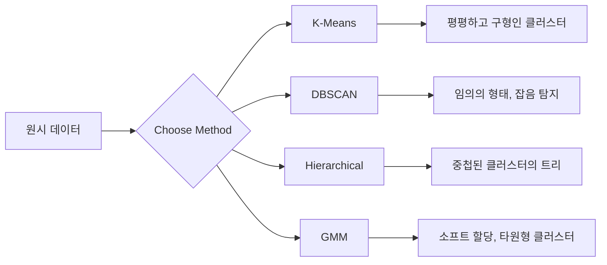

# 비지도 학습

> 레이블도 없고, 교사도 없습니다. 알고리즘이 스스로 구조를 찾아냅니다.

**유형:** Build
**언어:** Python
**선수 요건:** 1단계 (규범 및 거리, 확률 및 분포), 2단계 01-06강
**시간:** 약 90분

## 학습 목표

- K-Means, DBSCAN, 가우시안 혼합 모델을 처음부터 구현하고, 각 클러스터링 동작을 비교해 보세요
- 실루엣 점수와 팔꿈치 방법을 사용해 클러스터 품질을 평가하고 최적의 K를 선택해 보세요
- DBSCAN이 K-Means보다 성능이 좋은 경우를 설명하고, 비구형 클러스터와 이상치를 처리하는 알고리즘이 무엇인지 식별해 보세요
- 클러스터링 방법을 사용해 정상 패턴에서 벗어난 포인트를 표시하는 이상 탐지 파이프라인을 구축해 보세요

## 문제점

지금까지의 모든 ML 강의는 레이블이 있는 데이터를 가정했습니다: "여기 입력이 있고, 여기 정답이 있다." 현실 세계에서는 레이블이 비쌉니다. 병원은 수백만 개의 환자 기록을 가지고 있지만, 각 기록에 질병 카테고리를 수동으로 태그한 사람은 없습니다. 전자 상거래 사이트는 수백만 개의 사용자 세션을 가지고 있지만, 고객 세그먼트를 수동으로 레이블링한 사람은 없습니다. 보안 팀은 네트워크 로그를 가지고 있지만, 모든 이상치를 플래그한 사람은 없습니다.

비지도 학습은 무엇을 찾아야 하는지 알려주지 않아도 패턴을 발견합니다. 유사한 데이터 포인트를 그룹화하고, 숨겨진 구조를 발견하며, 이상치를 드러냅니다. 지도 학습이 정답이 있는 교과서로 학습하는 것이라면, 비지도 학습은 패턴이 스스로 드러날 때까지 원시 데이터를 바라보는 것과 같습니다.

함정: 레이블이 없으므로 "정답"이나 "오답"을 직접 측정할 수 없습니다. 알고리즘이 찾은 구조가 의미 있는지를 평가하기 위해 다른 도구가 필요합니다.

## 개념

### 클러스터링: 유사한 것들을 함께 그룹화하기

클러스터링은 각 데이터 포인트를 그룹(클러스터)에 할당하여, 같은 그룹 내의 포인트들이 다른 그룹의 포인트들보다 서로 더 유사하도록 만듭니다. 핵심 질문은 항상 "유사함"이 무엇을 의미하는가입니다.



### K-Means: 주력 알고리즘

K-Means는 데이터를 정확히 K개의 클러스터로 분할합니다. 각 클러스터에는 중심점(질량 중심)이 있으며, 모든 점은 가장 가까운 중심점에 속합니다.

Lloyd의 알고리즘:

1. K개의 랜덤 점을 초기 중심점으로 선택합니다
2. 각 데이터 포인트를 가장 가까운 중심점에 할당합니다
3. 각 중심점을 할당된 점들의 평균으로 재계산합니다
4. 할당이 더 이상 변하지 않을 때까지 2-3단계를 반복합니다

목적 함수(관성)는 각 점에서 할당된 중심점까지의 총 제곱 거리를 측정합니다. K-Means는 이를 최소화하지만, 지역 최소값만 찾습니다. 초기화 방식에 따라 결과가 달라질 수 있습니다.

### K 선택하기

두 가지 표준 방법:

**팔꿈치 방법:** K = 1, 2, 3, ..., n에 대해 K-Means를 실행합니다. 관성 vs K를 플롯합니다. 더 많은 클러스터를 추가해도 관성이 더 이상 크게 감소하지 않는 "팔꿈치" 지점을 찾습니다.

**실루엣 점수:** 각 점에 대해, 자신의 클러스터(a)와의 유사성과 가장 가까운 다른 클러스터(b)와의 유사성을 측정합니다. 실루엣 계수는 (b - a) / max(a, b)로, -1(잘못된 클러스터)부터 +1(잘 클러스터링됨)까지 범위를 가집니다. 모든 점에 대해 평균을 내어 전역 점수를 계산합니다.

### DBSCAN: 밀도 기반 클러스터링

K-Means는 클러스터가 구형이라고 가정하며 K를 미리 선택해야 합니다. DBSCAN은 이러한 가정을 하지 않습니다. 밀도가 높은 영역을 밀도가 낮은 영역이 분리하는 형태로 클러스터를 찾습니다.

두 개의 매개변수:
- **eps**: 이웃의 반지름
- **min_samples**: 밀도 높은 영역을 형성하는 데 필요한 최소 점 수

세 가지 유형의 점:
- **코어 점**: eps 거리 내에 min_samples 이상의 점이 있는 점
- **경계 포인트**: 코어 점의 eps 거리 내에 있지만, 코어 점 자체는 아닌 점
- **잡음 포인트**: 코어 점도 경계 포인트도 아닌 점. 이는 이상치입니다.

DBSCAN은 서로 eps 거리 내에 있는 코어 점들을 같은 클러스터로 연결합니다. 경계 포인트는 가까운 코어 점의 클러스터에 합류합니다. 잡음 포인트는 어떤 클러스터에도 속하지 않습니다.

장점: 임의의 형태의 클러스터를 찾아내고, 클러스터 수를 자동으로 결정하며, 이상치를 식별합니다. 단점: 밀도가 다른 클러스터에 대해서는 성능이 떨어집니다.

### 계층적 클러스터링

중첩된 클러스터의 트리(덴드로그램)를 구축합니다.

응집형(bottom-up):
1. 각 점을 하나의 클러스터로 시작합니다
2. 가장 가까운 두 클러스터를 병합합니다
3. 클러스터가 하나만 남을 때까지 반복합니다
4. 덴드로그램을 원하는 수준에서 잘라 K개의 클러스터를 얻습니다

클러스터 간 "가까움"은 다음과 같이 측정할 수 있습니다:
- **단일 연결(Single linkage)**: 두 클러스터 내의 임의의 두 점 사이의 최소 거리
- **완전 연결(Complete linkage)**: 임의의 두 점 사이의 최대 거리
- **평균 연결(Average linkage)**: 모든 쌍 사이의 평균 거리
- **Ward 방법**: 클러스터 내 총 분산의 증가량이 가장 작은 병합

### 가우시안 혼합 모델(GMM)

K-Means는 하드 할당을 제공합니다: 각 점은 정확히 하나의 클러스터에 속합니다. GMM은 소프트 할당을 제공합니다: 각 점은 각 클러스터에 속할 확률을 가집니다.

GMM은 데이터가 각각 고유한 평균과 공분산을 가진 K개의 가우시안 분포의 혼합에서 생성되었다고 가정합니다. 기대-최대화(EM) 알고리즘은 다음을 반복합니다:

- **E-step**: 각 점이 각 가우시안에 속할 확률을 계산합니다
- **M-step**: 데이터의 우도를 극대화하기 위해 각 가우시안의 평균, 공분산 및 혼합 가중치를 업데이트합니다

GMM은 타원형 클러스터를 모델링할 수 있으며(K-Means처럼 구형만 아님), 겹치는 클러스터를 자연스럽게 처리합니다.

### 어떤 방법을 언제 사용할까

| 방법 | 최적의 사용처 | 피해야 할 경우 |
|--------|----------|------------|
| K-Means | 대규모 데이터셋, 구형 클러스터, K가 알려진 경우 | 불규칙한 형태, 이상치가 존재하는 경우 |
| DBSCAN | K가 알려지지 않은 경우, 임의의 형태, 이상치 탐지 | 밀도가 다양한 경우, 매우 높은 차원 |
| 계층적 | 소규모 데이터셋, 덴드로그램이 필요한 경우, K가 알려지지 않은 경우 | 대규모 데이터셋(O(n^2) 메모리) |
| GMM | 겹치는 클러스터, 소프트 할당이 필요한 경우 | 매우 대규모 데이터셋, 차원이 너무 많은 경우 |

### 클러스터링을 이용한 이상 탐지

클러스터링은 이상 탐지를 자연스럽게 지원합니다:
- **K-Means**: 모든 중심점(centroid)에서 멀리 떨어진 포인트는 이상치입니다
- **DBSCAN**: 잡음 포인트(잡음 포인트)는 정의상 이상치입니다
- **GMM**: 모든 가우시안(Gaussian)에서 확률이 낮은 포인트는 이상치입니다

```figure
kmeans-step
```

## 구현하기

### 1단계: K-Means를 처음부터 구현하기

```python
import math
import random


def euclidean_distance(a, b):
    return math.sqrt(sum((ai - bi) ** 2 for ai, bi in zip(a, b)))


def kmeans(data, k, max_iterations=100, seed=42):
    random.seed(seed)
    n_features = len(data[0])

    centroids = random.sample(data, k)

    for iteration in range(max_iterations):
        clusters = [[] for _ in range(k)]
        assignments = []

        for point in data:
            distances = [euclidean_distance(point, c) for c in centroids]
            nearest = distances.index(min(distances))
            clusters[nearest].append(point)
            assignments.append(nearest)

        new_centroids = []
        for cluster in clusters:
            if len(cluster) == 0:
                new_centroids.append(random.choice(data))
                continue
            centroid = [
                sum(point[j] for point in cluster) / len(cluster)
                for j in range(n_features)
            ]
            new_centroids.append(centroid)

        if all(
            euclidean_distance(old, new) < 1e-6
            for old, new in zip(centroids, new_centroids)
        ):
            print(f"  Converged at iteration {iteration + 1}")
            break

        centroids = new_centroids

    return assignments, centroids
```

### 2단계: 팔꿈치 방법(elbow method)과 실루엣 점수(silhouette score)

```python
def compute_inertia(data, assignments, centroids):
    total = 0.0
    for point, cluster_id in zip(data, assignments):
        total += euclidean_distance(point, centroids[cluster_id]) ** 2
    return total


def silhouette_score(data, assignments):
    n = len(data)
    if n < 2:
        return 0.0

    clusters = {}
    for i, c in enumerate(assignments):
        clusters.setdefault(c, []).append(i)

    if len(clusters) < 2:
        return 0.0

    scores = []
    for i in range(n):
        own_cluster = assignments[i]
        own_members = [j for j in clusters[own_cluster] if j != i]

        if len(own_members) == 0:
            scores.append(0.0)
            continue

        a = sum(euclidean_distance(data[i], data[j]) for j in own_members) / len(own_members)

        b = float("inf")
        for cluster_id, members in clusters.items():
            if cluster_id == own_cluster:
                continue
            avg_dist = sum(euclidean_distance(data[i], data[j]) for j in members) / len(members)
            b = min(b, avg_dist)

        if max(a, b) == 0:
            scores.append(0.0)
        else:
            scores.append((b - a) / max(a, b))

    return sum(scores) / len(scores)


def find_best_k(data, max_k=10):
    print("Elbow method:")
    inertias = []
    for k in range(1, max_k + 1):
        assignments, centroids = kmeans(data, k)
        inertia = compute_inertia(data, assignments, centroids)
        inertias.append(inertia)
        print(f"  K={k}: inertia={inertia:.2f}")

    print("\nSilhouette scores:")
    for k in range(2, max_k + 1):
        assignments, centroids = kmeans(data, k)
        score = silhouette_score(data, assignments)
        print(f"  K={k}: silhouette={score:.4f}")

    return inertias
```

### 3단계: DBSCAN을 처음부터 구현하기

```python
def dbscan(data, eps, min_samples):
    n = len(data)
    labels = [-1] * n
    cluster_id = 0

    def region_query(point_idx):
        neighbors = []
        for i in range(n):
            if euclidean_distance(data[point_idx], data[i]) <= eps:
                neighbors.append(i)
        return neighbors

    visited = [False] * n

    for i in range(n):
        if visited[i]:
            continue
        visited[i] = True

        neighbors = region_query(i)

        if len(neighbors) < min_samples:
            labels[i] = -1
            continue

        labels[i] = cluster_id
        seed_set = list(neighbors)
        seed_set.remove(i)

        j = 0
        while j < len(seed_set):
            q = seed_set[j]

            if not visited[q]:
                visited[q] = True
                q_neighbors = region_query(q)
                if len(q_neighbors) >= min_samples:
                    for nb in q_neighbors:
                        if nb not in seed_set:
                            seed_set.append(nb)

            if labels[q] == -1:
                labels[q] = cluster_id

            j += 1

        cluster_id += 1

    return labels
```

### 4단계: 가우시안 혼합 모델(GMM, EM 알고리즘)

```python
def gmm(data, k, max_iterations=100, seed=42):
    random.seed(seed)
    n = len(data)
    d = len(data[0])

    indices = random.sample(range(n), k)
    means = [list(data[i]) for i in indices]
    variances = [1.0] * k
    weights = [1.0 / k] * k

    def gaussian_pdf(x, mean, variance):
        d = len(x)
        coeff = 1.0 / ((2 * math.pi * variance) ** (d / 2))
        exponent = -sum((xi - mi) ** 2 for xi, mi in zip(x, mean)) / (2 * variance)
        return coeff * math.exp(max(exponent, -500))

    for iteration in range(max_iterations):
        responsibilities = []
        for i in range(n):
            probs = []
            for j in range(k):
                probs.append(weights[j] * gaussian_pdf(data[i], means[j], variances[j]))
            total = sum(probs)
            if total == 0:
                total = 1e-300
            responsibilities.append([p / total for p in probs])

        old_means = [list(m) for m in means]

        for j in range(k):
            r_sum = sum(responsibilities[i][j] for i in range(n))
            if r_sum < 1e-10:
                continue

            weights[j] = r_sum / n

            for dim in range(d):
                means[j][dim] = sum(
                    responsibilities[i][j] * data[i][dim] for i in range(n)
                ) / r_sum

            variances[j] = sum(
                responsibilities[i][j]
                * sum((data[i][dim] - means[j][dim]) ** 2 for dim in range(d))
                for i in range(n)
            ) / (r_sum * d)
            variances[j] = max(variances[j], 1e-6)

        shift = sum(
            euclidean_distance(old_means[j], means[j]) for j in range(k)
        )
        if shift < 1e-6:
            print(f"  GMM converged at iteration {iteration + 1}")
            break

    assignments = []
    for i in range(n):
        assignments.append(responsibilities[i].index(max(responsibilities[i])))

    return assignments, means, weights, responsibilities
```

### 5단계: 테스트 데이터를 생성하고 모든 것을 실행하기

```python
def make_blobs(centers, n_per_cluster=50, spread=0.5, seed=42):
    random.seed(seed)
    data = []
    true_labels = []
    for label, (cx, cy) in enumerate(centers):
        for _ in range(n_per_cluster):
            x = cx + random.gauss(0, spread)
            y = cy + random.gauss(0, spread)
            data.append([x, y])
            true_labels.append(label)
    return data, true_labels


def make_moons(n_samples=200, noise=0.1, seed=42):
    random.seed(seed)
    data = []
    labels = []
    n_half = n_samples // 2
    for i in range(n_half):
        angle = math.pi * i / n_half
        x = math.cos(angle) + random.gauss(0, noise)
        y = math.sin(angle) + random.gauss(0, noise)
        data.append([x, y])
        labels.append(0)
    for i in range(n_half):
        angle = math.pi * i / n_half
        x = 1 - math.cos(angle) + random.gauss(0, noise)
        y = 1 - math.sin(angle) - 0.5 + random.gauss(0, noise)
        data.append([x, y])
        labels.append(1)
    return data, labels


if __name__ == "__main__":
    centers = [[2, 2], [8, 3], [5, 8]]
    data, true_labels = make_blobs(centers, n_per_cluster=50, spread=0.8)

    print("=== K-Means on 3 blobs ===")
    assignments, centroids = kmeans(data, k=3)
    print(f"  Centroids: {[[round(c, 2) for c in cent] for cent in centroids]}")
    sil = silhouette_score(data, assignments)
    print(f"  Silhouette score: {sil:.4f}")

    print("\n=== Elbow Method ===")
    find_best_k(data, max_k=6)

    print("\n=== DBSCAN on 3 blobs ===")
    db_labels = dbscan(data, eps=1.5, min_samples=5)
    n_clusters = len(set(db_labels) - {-1})
    n_noise = db_labels.count(-1)
    print(f"  Found {n_clusters} clusters, {n_noise} noise points")

    print("\n=== GMM on 3 blobs ===")
    gmm_assignments, gmm_means, gmm_weights, _ = gmm(data, k=3)
    print(f"  Means: {[[round(m, 2) for m in mean] for mean in gmm_means]}")
    print(f"  Weights: {[round(w, 3) for w in gmm_weights]}")
    gmm_sil = silhouette_score(data, gmm_assignments)
    print(f"  Silhouette score: {gmm_sil:.4f}")

    print("\n=== DBSCAN on moons (non-spherical clusters) ===")
    moon_data, moon_labels = make_moons(n_samples=200, noise=0.1)
    moon_db = dbscan(moon_data, eps=0.3, min_samples=5)
    n_moon_clusters = len(set(moon_db) - {-1})
    n_moon_noise = moon_db.count(-1)
    print(f"  Found {n_moon_clusters} clusters, {n_moon_noise} noise points")

    print("\n=== K-Means on moons (will fail to separate) ===")
    moon_km, moon_centroids = kmeans(moon_data, k=2)
    moon_sil = silhouette_score(moon_data, moon_km)
    print(f"  Silhouette score: {moon_sil:.4f}")
    print("  K-Means splits moons poorly because they are not spherical")

    print("\n=== Anomaly detection with DBSCAN ===")
    anomaly_data = list(data)
    anomaly_data.append([20.0, 20.0])
    anomaly_data.append([-5.0, -5.0])
    anomaly_data.append([15.0, 0.0])
    anomaly_labels = dbscan(anomaly_data, eps=1.5, min_samples=5)
    anomalies = [
        anomaly_data[i]
        for i in range(len(anomaly_labels))
        if anomaly_labels[i] == -1
    ]
    print(f"  Detected {len(anomalies)} anomalies")
    for a in anomalies[-3:]:
        print(f"    Point {[round(v, 2) for v in a]}")
```

## 사용하기

scikit-learn을 사용하면 동일한 알고리즘을 한 줄 코드로 작성할 수 있습니다:

```python
from sklearn.cluster import KMeans, DBSCAN, AgglomerativeClustering
from sklearn.mixture import GaussianMixture
from sklearn.metrics import silhouette_score as sklearn_silhouette

km = KMeans(n_clusters=3, random_state=42).fit(data)
db = DBSCAN(eps=1.5, min_samples=5).fit(data)
agg = AgglomerativeClustering(n_clusters=3).fit(data)
gmm_model = GaussianMixture(n_components=3, random_state=42).fit(data)
```

처음부터 구현한 버전은 이러한 라이브러리가 정확히 무엇을 계산하는지 보여줍니다. K-Means는 할당과 재계산을 반복합니다. DBSCAN은 밀집된 시드(seed)에서 클러스터를 확장합니다. GMM은 기대(expectation)와 최대화(maximization)를 번갈아 수행합니다. 라이브러리 버전은 수치적 안정성, 더 스마트한 초기화(K-Means++), GPU 가속을 추가하지만, 핵심 로직은 동일합니다.

## 출시하기

이 강의는 K-Means, DBSCAN, GMM의 동작하는 구현을 처음부터 만들어 냅니다. 클러스터링 코드는 더 고급 비지도 학습 방법의 기초로 재사용할 수 있습니다.

## 연습 문제

1. K-Means++ 초기화를 구현해 보세요. 랜덤 중심점을 선택하는 대신, 첫 번째 중심점은 랜덤으로 선택하고, 이후의 각 중심점은 가장 가까운 기존 중심점과의 제곱 거리에 비례하는 확률로 선택합니다. 랜덤 초기화와 수렴 속도를 비교해 보세요.
2. 코드에 계층적 응집(agglomerative) 클러스터링을 추가해 보세요. Ward의 연결(linkage)을 구현하고 덴드로그램(dendrogram, 병합의 중첩된 리스트)을 생성합니다. 다른 레벨에서 절단(cut)하고 K-Means 결과와 비교해 보세요.
3. 간단한 이상 탐지 파이프라인을 구축해 보세요. 동일한 데이터에 DBSCAN과 GMM을 실행하고, 두 방법 모두 이상치로 동의하는 포인트(DBSCAN의 잡음, GMM의 낮은 확률)를 플래그(flag)합니다. 겹치는 부분을 측정하고 두 방법이 불일치하는 경우를 논의해 보세요.

## 핵심 용어

| 용어 | 사람들이 말하는 것 | 실제 의미 |
|------|----------------|----------------------|
| 군집화(Clustering) | "유사한 항목을 그룹으로 묶는 것" | 특정 거리 측정 지표로 측정된 군집 내 유사성이 군집 간 유사성을 초과하도록 데이터를 하위 집합으로 분할하는 것 |
| 중심점(Centroid) | "군집의 중심" | 군집에 할당된 모든 점의 평균; K-Means에서 군집 대표로 사용됨 |
| 관성(Inertia) | "군집이 얼마나 밀집되어 있는지" | 각 점에서 할당된 중심점까지의 거리의 제곱 합; 낮을수록 더 밀집됨 |
| 실루엣 점수(Silhouette score) | "군집이 얼마나 잘 분리되어 있는지" | 각 점에 대해 (b - a) / max(a, b)로 계산되며, 여기서 a는 군집 내 평균 거리, b는 가장 가까운 군집의 평균 거리 |
| 코어 점(Core point) | "밀집된 영역에 있는 점" | DBSCAN에서 eps 거리 내에 min_samples 이상의 이웃을 가진 점 |
| EM 알고리즘(EM algorithm) | "소프트 K-Means" | 기대값-최대화(Expectation-Maximization): 멤버십 확률(E-step)을 반복적으로 계산하고 분포 매개변수(M-step)를 업데이트함 |
| 덴드로그램(Dendrogram) | "군집의 트리" | 계층적 군집화에서 군집이 병합된 순서와 거리를 보여주는 트리 다이어그램 |
| 이상치(Anomaly) | "아웃라이어" | 예상 패턴에 부합하지 않는 데이터 포인트으로, DBSCAN에서는 잡음(noise)으로, GMM에서는 낮은 확률로 식별됨 |

## 추가 읽기

- [Stanford CS229 - Unsupervised Learning](https://cs229.stanford.edu/notes2022fall/main_notes.pdf) - 군집화 및 EM에 관한 Andrew Ng의 강의 노트
- [scikit-learn Clustering Guide](https://scikit-learn.org/stable/modules/clustering.html) - 시각적 예시와 함께 모든 군집화 알고리즘을 실용적으로 비교
- [DBSCAN original paper (Ester et al., 1996)](https://www.aaai.org/Papers/KDD/1996/KDD96-037.pdf) - 밀도 기반 군집화를 도입한 논문
