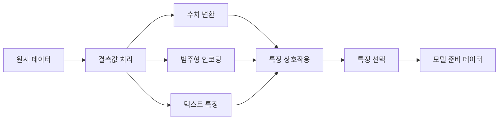

# 특징 엔지니어링 및 선택

> 좋은 특징은 천 개의 데이터 포인트만큼의 가치를 가집니다.

**유형:** Build
**언어:** Python
**선수 요건:** 1단계 (ML을 위한 통계, 선형 대수), 2단계 01-07강
**시간:** 약 90분

## 학습 목표

- 수치 변환(표준화, min-max 스케일링, 로그 변환, 분할)을 구현하고 각각이 적합한 시점을 설명해 보세요
- 범주형 특징을 위한 원-핫(one-hot), 레이블, 타겟 인코딩을 구축하고 타겟 인코딩에서의 데이터 누수 위험을 식별해 보세요
- TF-IDF 벡터화기를 처음부터 구축하고 텍스트 분류에서 원시 단어 수보다 성능이 뛰어난 이유를 설명해 보세요
- 차원 축소를 위해 필터 기반 특징 선택(분산 임계값, 상관관계, 상호 정보)을 적용해 보세요

## 문제점

데이터셋이 있습니다. 알고리즘을 선택합니다. 학습합니다. 결과는 평범합니다. 더 복잡한 알고리즘을 시도합니다. 여전히 평범합니다. 일주일 동안 하이퍼파라미터를 튜닝합니다. 개선은 미미합니다.

그러면 누군가 원시 데이터를 더 나은 특징으로 변환하고, 단순한 로지스틱 회귀가 튜닝된 그래디언트 부스팅 앙상블을 이깁니다.

이런 일은 constantly 발생합니다. 고전 ML에서는 데이터의 표현이 알고리즘 선택보다 중요합니다. "면적"과 "침실 수"를 특징으로 하는 주택 가격 모델은 학습기가 얼마나 정교하든 "주소 원시 문자열"을 특징으로 하는 모델을 이깁니다. 알고리즘은 당신이 제공하는 것만 처리할 수 있습니다.

특징 엔지니어링은 원시 데이터를 모델이 패턴을 찾기 쉬운 표현으로 변환하는 과정입니다. 특징 선택은 신호를 추가하지 않고 잡음만 추가하는 특징을 버리는 과정입니다. 이 둘은 고전 ML에서 가장 레버리지 효과가 높은 활동입니다.

## 개념

### 특징 파이프라인



### 수치형 특징

원시 숫자는 모델이 바로 사용할 수 있는 상태가 아닙니다. 일반적인 변환은 다음과 같습니다:

**스케일링:** 특징을 동일한 범위로 맞춰 거리 기반 알고리즘(K-Means, KNN, SVM)이 모든 특징을 동일하게 취급하도록 합니다. Min-max 스케일링은 [0, 1] 범위로 매핑합니다. 표준화(z-score)는 평균=0, 표준편차=1로 매핑합니다.

**로그 변환:** 오른쪽으로 치우친 분포(소득, 인구, 단어 수)를 압축합니다. 곱셈적 관계를 덧셈적 관계로 바꿉니다.

**분할(Binning):** 연속 값을 범주형으로 변환합니다. 특징과 타겟 간의 관계가 비선형적이지만 단계적인 경우(예: 연령 그룹)에 유용합니다.

**다항 특징:** x^2, x^3, x1*x2 항을 생성합니다. 더 많은 특징을 사용하는 대가로 선형 모델이 비선형 관계를 포착할 수 있게 합니다.

### 범주형 특징

모델은 숫자를 필요로 합니다. 범주는 인코딩이 필요합니다.

**원-핫(one-hot) 인코딩:** 각 범주에 대해 이진 열을 생성합니다. "color = red/blue/green"는 세 개의 열(is_red, is_blue, is_green)로 변환됩니다. 낮은 카디널리티(low-cardinality) 특징에는 잘 작동하지만, 범주가 많으면 폭발적으로 증가합니다.

**레이블 인코딩:** 각 범주를 정수로 매핑합니다: red=0, blue=1, green=2. 잘못된 순서를 도입합니다(모델이 green > blue > red라고 생각할 수 있음). 개별 값으로 분할하는 트리 기반 모델에만 적절합니다.

**타겟 인코딩:** 각 범주를 해당 범주의 타겟 변수 평균으로 대체합니다. 강력하지만 위험합니다: 데이터 누수(data leakage) 위험이 높습니다. 훈련 데이터에서만 계산하고 테스트 데이터에 적용해야 합니다.

### 텍스트 특징

**카운트 벡터화(Count vectorizer):** 문서에서 각 단어가 몇 번 나타나는지 세는 방식입니다. "the cat sat on the mat"는 {the: 2, cat: 1, sat: 1, on: 1, mat: 1}가 됩니다.

**TF-IDF:** 단어 빈도-역 문서 빈도(Term Frequency-Inverse Document Frequency)입니다. 문서 간 단어의 고유성에 따라 가중치를 부여합니다. "the" 같은 흔한 단어는 낮은 가중치를 받습니다. 희소하고 독특한 단어는 높은 가중치를 받습니다.

```
TF(word, doc) = count(word in doc) / total words in doc
IDF(word) = log(total docs / docs containing word)
TF-IDF = TF * IDF
```

### 결측값

실제 데이터에는 결손이 있습니다. 전략은 다음과 같습니다:

- **행 삭제:** 결측 데이터가 드물고 무작위인 경우에만
- **평균/중간값 대체:** 단순하며, 분포 형태를 보존합니다(중간값은 이상치에 더 강건합니다)
- **최빈값(mode) 대체:** 범주형 특징의 경우
- **지표 열:** 결측치 채우기 전에 "was_this_missing"라는 이진 열을 추가하세요. 데이터가 결측이라는 사실 자체가 유용한 정보일 수 있습니다.
- **전방/후방 채우기:** 시계열 데이터에 사용하세요.

### 특징 상호작용

때로는 관계가 조합에 있습니다. "키"와 "체중"만으로는 "BMI = 체중 / 키^2"보다 예측력이 떨어집니다. 특징 상호작용은 특징 공간을 확장하므로, 도메인 지식을 활용하여 적절한 조합을 선택하세요.

### 특징 선택

특징이 많다고 항상 좋은 것은 아닙니다. 관련 없는 특징은 잡음을 추가하고, 학습 시간을 늘리며, 과적합을 유발할 수 있습니다.

**필터 방법 (모델 전):**
- 상관관계: 서로 Highly correlated한 특징을 제거하세요 (중복 제거)
- 상호 정보량: 특정 특징을 알면 타겟에 대한 불확실성이 얼마나 감소하는지 측정합니다
- 분산 임계값: 거의 변하지 않는 특징을 제거하세요

**래퍼 방법 (모델 기반):**
- L1 정규화 (Lasso): 관련 없는 특징의 가중치를 정확히 0으로 만듭니다
- 재귀적 특징 제거: 학습, 가장 중요도가 낮은 특징 제거, 반복

**선택이 중요한 이유:** 좋은 특징 10개를 가진 모델은 좋은 특징 10개와 잡음 특징 90개를 가진 모델보다 일반적으로 더 잘 작동합니다. 잡음 특징은 모델이 일반화되지 않는 학습 데이터 패턴에 과적합할 기회를 제공합니다.

```figure
feature-scaling
```

## 구현하기

### 1단계: 처음부터 수치 변환 만들기

```python
import math


def min_max_scale(values):
    min_val = min(values)
    max_val = max(values)
    if max_val == min_val:
        return [0.0] * len(values)
    return [(v - min_val) / (max_val - min_val) for v in values]


def standardize(values):
    n = len(values)
    mean = sum(values) / n
    variance = sum((v - mean) ** 2 for v in values) / n
    std = math.sqrt(variance) if variance > 0 else 1.0
    return [(v - mean) / std for v in values]


def log_transform(values):
    return [math.log(v + 1) for v in values]


def bin_values(values, n_bins=5):
    min_val = min(values)
    max_val = max(values)
    bin_width = (max_val - min_val) / n_bins
    if bin_width == 0:
        return [0] * len(values)
    result = []
    for v in values:
        bin_idx = int((v - min_val) / bin_width)
        bin_idx = min(bin_idx, n_bins - 1)
        result.append(bin_idx)
    return result


def polynomial_features(row, degree=2):
    n = len(row)
    result = list(row)
    if degree >= 2:
        for i in range(n):
            result.append(row[i] ** 2)
        for i in range(n):
            for j in range(i + 1, n):
                result.append(row[i] * row[j])
    return result
```

### 2단계: 처음부터 범주형 인코딩 만들기

```python
def one_hot_encode(values):
    categories = sorted(set(values))
    cat_to_idx = {cat: i for i, cat in enumerate(categories)}
    n_cats = len(categories)

    encoded = []
    for v in values:
        row = [0] * n_cats
        row[cat_to_idx[v]] = 1
        encoded.append(row)

    return encoded, categories


def label_encode(values):
    categories = sorted(set(values))
    cat_to_int = {cat: i for i, cat in enumerate(categories)}
    return [cat_to_int[v] for v in values], cat_to_int


def target_encode(feature_values, target_values, smoothing=10):
    global_mean = sum(target_values) / len(target_values)

    category_stats = {}
    for feat, target in zip(feature_values, target_values):
        if feat not in category_stats:
            category_stats[feat] = {"sum": 0.0, "count": 0}
        category_stats[feat]["sum"] += target
        category_stats[feat]["count"] += 1

    encoding = {}
    for cat, stats in category_stats.items():
        cat_mean = stats["sum"] / stats["count"]
        weight = stats["count"] / (stats["count"] + smoothing)
        encoding[cat] = weight * cat_mean + (1 - weight) * global_mean

    return [encoding[v] for v in feature_values], encoding
```

### 3단계: 처음부터 텍스트 특징 만들기

```python
def count_vectorize(documents):
    vocab = {}
    idx = 0
    for doc in documents:
        for word in doc.lower().split():
            if word not in vocab:
                vocab[word] = idx
                idx += 1

    vectors = []
    for doc in documents:
        vec = [0] * len(vocab)
        for word in doc.lower().split():
            vec[vocab[word]] += 1
        vectors.append(vec)

    return vectors, vocab


def tfidf(documents):
    n_docs = len(documents)

    vocab = {}
    idx = 0
    for doc in documents:
        for word in doc.lower().split():
            if word not in vocab:
                vocab[word] = idx
                idx += 1

    doc_freq = {}
    for doc in documents:
        seen = set()
        for word in doc.lower().split():
            if word not in seen:
                doc_freq[word] = doc_freq.get(word, 0) + 1
                seen.add(word)

    vectors = []
    for doc in documents:
        words = doc.lower().split()
        word_count = len(words)
        tf_map = {}
        for word in words:
            tf_map[word] = tf_map.get(word, 0) + 1

        vec = [0.0] * len(vocab)
        for word, count in tf_map.items():
            tf = count / word_count
            idf = math.log(n_docs / doc_freq[word])
            vec[vocab[word]] = tf * idf
        vectors.append(vec)

    return vectors, vocab
```

### 4단계: 처음부터 결측치 채우기 만들기

```python
def impute_mean(values):
    present = [v for v in values if v is not None]
    if not present:
        return [0.0] * len(values), 0.0
    mean = sum(present) / len(present)
    return [v if v is not None else mean for v in values], mean


def impute_median(values):
    present = sorted(v for v in values if v is not None)
    if not present:
        return [0.0] * len(values), 0.0
    n = len(present)
    if n % 2 == 0:
        median = (present[n // 2 - 1] + present[n // 2]) / 2
    else:
        median = present[n // 2]
    return [v if v is not None else median for v in values], median


def impute_mode(values):
    present = [v for v in values if v is not None]
    if not present:
        return values, None
    counts = {}
    for v in present:
        counts[v] = counts.get(v, 0) + 1
    mode = max(counts, key=counts.get)
    return [v if v is not None else mode for v in values], mode


def add_missing_indicator(values):
    return [0 if v is not None else 1 for v in values]
```

### 5단계: 처음부터 특징 선택 만들기

```python
def correlation(x, y):
    n = len(x)
    mean_x = sum(x) / n
    mean_y = sum(y) / n
    cov = sum((xi - mean_x) * (yi - mean_y) for xi, yi in zip(x, y)) / n
    std_x = math.sqrt(sum((xi - mean_x) ** 2 for xi in x) / n)
    std_y = math.sqrt(sum((yi - mean_y) ** 2 for yi in y) / n)
    if std_x == 0 or std_y == 0:
        return 0.0
    return cov / (std_x * std_y)


def mutual_information(feature, target, n_bins=10):
    feat_min = min(feature)
    feat_max = max(feature)
    bin_width = (feat_max - feat_min) / n_bins if feat_max != feat_min else 1.0
    feat_binned = [
        min(int((f - feat_min) / bin_width), n_bins - 1) for f in feature
    ]

    n = len(feature)
    target_classes = sorted(set(target))

    feat_bins = sorted(set(feat_binned))
    p_feat = {}
    for b in feat_bins:
        p_feat[b] = feat_binned.count(b) / n

    p_target = {}
    for t in target_classes:
        p_target[t] = target.count(t) / n

    mi = 0.0
    for b in feat_bins:
        for t in target_classes:
            joint_count = sum(
                1 for fb, tv in zip(feat_binned, target) if fb == b and tv == t
            )
            p_joint = joint_count / n
            if p_joint > 0:
                mi += p_joint * math.log(p_joint / (p_feat[b] * p_target[t]))

    return mi


def variance_threshold(features, threshold=0.01):
    n_features = len(features[0])
    n_samples = len(features)
    selected = []

    for j in range(n_features):
        col = [features[i][j] for i in range(n_samples)]
        mean = sum(col) / n_samples
        var = sum((v - mean) ** 2 for v in col) / n_samples
        if var >= threshold:
            selected.append(j)

    return selected


def remove_correlated(features, threshold=0.9):
    n_features = len(features[0])
    n_samples = len(features)

    to_remove = set()
    for i in range(n_features):
        if i in to_remove:
            continue
        col_i = [features[r][i] for r in range(n_samples)]
        for j in range(i + 1, n_features):
            if j in to_remove:
                continue
            col_j = [features[r][j] for r in range(n_samples)]
            corr = abs(correlation(col_i, col_j))
            if corr >= threshold:
                to_remove.add(j)

    return [i for i in range(n_features) if i not in to_remove]
```

### 6단계: 전체 파이프라인 및 데모

```python
import random


def make_housing_data(n=200, seed=42):
    random.seed(seed)
    data = []
    for _ in range(n):
        sqft = random.uniform(500, 5000)
        bedrooms = random.choice([1, 2, 3, 4, 5])
        age = random.uniform(0, 50)
        neighborhood = random.choice(["downtown", "suburbs", "rural"])
        has_pool = random.choice([True, False])

        sqft_with_missing = sqft if random.random() > 0.05 else None
        age_with_missing = age if random.random() > 0.08 else None

        price = (
            50 * sqft
            + 20000 * bedrooms
            - 1000 * age
            + (50000 if neighborhood == "downtown" else 10000 if neighborhood == "suburbs" else 0)
            + (15000 if has_pool else 0)
            + random.gauss(0, 20000)
        )

        data.append({
            "sqft": sqft_with_missing,
            "bedrooms": bedrooms,
            "age": age_with_missing,
            "neighborhood": neighborhood,
            "has_pool": has_pool,
            "price": price,
        })
    return data


if __name__ == "__main__":
    data = make_housing_data(200)

    print("=== Raw Data Sample ===")
    for row in data[:3]:
        print(f"  {row}")

    sqft_raw = [d["sqft"] for d in data]
    age_raw = [d["age"] for d in data]
    prices = [d["price"] for d in data]

    print("\n=== Missing Value Handling ===")
    sqft_missing = sum(1 for v in sqft_raw if v is None)
    age_missing = sum(1 for v in age_raw if v is None)
    print(f"  sqft missing: {sqft_missing}/{len(sqft_raw)}")
    print(f"  age missing: {age_missing}/{len(age_raw)}")

    sqft_indicator = add_missing_indicator(sqft_raw)
    age_indicator = add_missing_indicator(age_raw)
    sqft_imputed, sqft_fill = impute_median(sqft_raw)
    age_imputed, age_fill = impute_mean(age_raw)
    print(f"  sqft filled with median: {sqft_fill:.0f}")
    print(f"  age filled with mean: {age_fill:.1f}")

    print("\n=== Numerical Transforms ===")
    sqft_scaled = standardize(sqft_imputed)
    age_scaled = min_max_scale(age_imputed)
    sqft_log = log_transform(sqft_imputed)
    age_binned = bin_values(age_imputed, n_bins=5)
    print(f"  sqft standardized: mean={sum(sqft_scaled)/len(sqft_scaled):.4f}, std={math.sqrt(sum(v**2 for v in sqft_scaled)/len(sqft_scaled)):.4f}")
    print(f"  age min-max: [{min(age_scaled):.2f}, {max(age_scaled):.2f}]")
    print(f"  age bins: {sorted(set(age_binned))}")

    print("\n=== Categorical Encoding ===")
    neighborhoods = [d["neighborhood"] for d in data]

    ohe, ohe_cats = one_hot_encode(neighborhoods)
    print(f"  One-hot categories: {ohe_cats}")
    print(f"  Sample encoding: {neighborhoods[0]} -> {ohe[0]}")

    le, le_map = label_encode(neighborhoods)
    print(f"  Label encoding map: {le_map}")

    te, te_map = target_encode(neighborhoods, prices, smoothing=10)
    print(f"  Target encoding: {({k: round(v) for k, v in te_map.items()})}")

    print("\n=== Text Features ===")
    descriptions = [
        "large modern house with pool",
        "small cozy cottage near downtown",
        "spacious family home with large yard",
        "modern apartment downtown with view",
        "rustic cabin in rural area",
    ]
    cv, cv_vocab = count_vectorize(descriptions)
    print(f"  Vocabulary size: {len(cv_vocab)}")
    print(f"  Doc 0 non-zero features: {sum(1 for v in cv[0] if v > 0)}")

    tf, tf_vocab = tfidf(descriptions)
    print(f"  TF-IDF vocabulary size: {len(tf_vocab)}")
    top_words = sorted(tf_vocab.keys(), key=lambda w: tf[0][tf_vocab[w]], reverse=True)[:3]
    print(f"  Doc 0 top TF-IDF words: {top_words}")

    print("\n=== Polynomial Features ===")
    sample_row = [sqft_scaled[0], age_scaled[0]]
    poly = polynomial_features(sample_row, degree=2)
    print(f"  Input: {[round(v, 4) for v in sample_row]}")
    print(f"  Polynomial: {[round(v, 4) for v in poly]}")
    print(f"  Features: [x1, x2, x1^2, x2^2, x1*x2]")

    print("\n=== Feature Selection ===")
    feature_matrix = [
        [sqft_scaled[i], age_scaled[i], float(sqft_indicator[i]), float(age_indicator[i])]
        + ohe[i]
        for i in range(len(data))
    ]

    print(f"  Total features: {len(feature_matrix[0])}")

    surviving_var = variance_threshold(feature_matrix, threshold=0.01)
    print(f"  After variance threshold (0.01): {len(surviving_var)} features kept")

    surviving_corr = remove_correlated(feature_matrix, threshold=0.9)
    print(f"  After correlation filter (0.9): {len(surviving_corr)} features kept")

    binary_prices = [1 if p > sum(prices) / len(prices) else 0 for p in prices]
    print("\n  Mutual information with target:")
    feature_names = ["sqft", "age", "sqft_missing", "age_missing"] + [f"neigh_{c}" for c in ohe_cats]
    for j in range(len(feature_matrix[0])):
        col = [feature_matrix[i][j] for i in range(len(feature_matrix))]
        mi = mutual_information(col, binary_prices, n_bins=10)
        print(f"    {feature_names[j]}: MI={mi:.4f}")

    print("\n  Correlation with price:")
    for j in range(len(feature_matrix[0])):
        col = [feature_matrix[i][j] for i in range(len(feature_matrix))]
        corr = correlation(col, prices)
        print(f"    {feature_names[j]}: r={corr:.4f}")
```

## 사용하기

scikit-learn을 사용하면 이러한 변환은 조합 가능한 파이프라인이 됩니다:

```python
from sklearn.preprocessing import StandardScaler, OneHotEncoder, PolynomialFeatures
from sklearn.impute import SimpleImputer
from sklearn.feature_extraction.text import TfidfVectorizer
from sklearn.feature_selection import mutual_info_classif, VarianceThreshold
from sklearn.compose import ColumnTransformer
from sklearn.pipeline import Pipeline

numeric_pipe = Pipeline([
    ("imputer", SimpleImputer(strategy="median")),
    ("scaler", StandardScaler()),
])

categorical_pipe = Pipeline([
    ("encoder", OneHotEncoder(sparse_output=False)),
])

preprocessor = ColumnTransformer([
    ("num", numeric_pipe, ["sqft", "age"]),
    ("cat", categorical_pipe, ["neighborhood"]),
])
```

처음부터 만든 버전은 각 변환 내부에서 정확히 어떤 일이 일어나는지 보여줍니다. 라이브러리 버전은 엣지 케이스 처리, 희소 행렬 지원, 파이프라인 조합을 추가하지만, 수학적 원리는 동일합니다.

## 출시하기

이 강의는 다음을 생성합니다:
- `outputs/prompt-feature-engineer.md` - 원시 데이터로부터 특징을 체계적으로 엔지니어링하기 위한 프롬프트

## 연습 문제

1. 수치형 변환에 강건한 스케일링(평균과 표준 편차 대신 중앙값과 사분위수 범위 사용)을 추가해 보세요. 극단적 이상치가 있는 데이터에서 표준 스케일링과 비교해 보세요.
2. 루프아웃(leave-one-out) 타겟 인코딩을 구현해 보세요: 각 행에 대해, 해당 행의 타겟 값을 제외하고 타겟 평균을 계산합니다. 단순 타겟 인코딩과 비교하여 과적합이 어떻게 감소하는지 보여주세요.
3. 분산 임계값, 상관관계 필터링, 상호 정보량 순위를 결합한 자동화된 기능 선택 파이프라인을 구축해 보세요. 주택 데이터셋에 적용하고, 모든 기능을 사용했을 때와 선택된 기능만 사용했을 때의 모델 성능(단순 선형 회귀 사용)을 비교해 보세요.

## 핵심 용어

| 용어 | 사람들이 말하는 표현 | 실제 의미 |
|------|----------------|----------------------|
| 기능 엔지니어링 | "새로운 열 만들기" | 원시 데이터를 모델이 패턴을 드러낼 수 있는 표현으로 변환하는 것 |
| 표준화 | "정규 분포로 만들기" | 평균을 빼고 표준 편차로 나누어 기능의 평균=0, 표준 편차=1이 되도록 하는 것 |
| 원-핫 인코딩 | "더미 변수 만들기" | 각 범주마다 하나의 이진 열을 생성하며, 각 행에서 정확히 하나의 열만 1이 되는 것 |
| 타겟 인코딩 | "정답으로 인코딩하기" | 각 범주를 해당 범주의 평균 타겟 값으로 대체하며, 과적합을 방지하기 위해 스무딩을 적용하는 것 |
| TF-IDF | " Fancy한 단어 세기" | 용어 빈도(Term Frequency)에 역 문서 빈도(Inverse Document Frequency)를 곱한 것: 코퍼스 내에서 단어가 얼마나 독특한지에 따라 가중치를 부여하는 것 |
| 결측치 처리 | "빈칸 채우기" | 누락된 값을 추정된 값(평균, 중앙값, 최빈값, 또는 모델 예측값)으로 대체하는 것 |
| 기능 선택 | "나쁜 열 버리기" | 잡음이나 중복을 추가하는 기능을 제거하고, 타겟에 대한 신호가 있는 기능만 유지하는 것 |
| 상호 정보량 | "한 변수가 다른 변수에 대해 얼마나 알려주는지" | 변수 X를 관측함으로써 변수 Y에 대한 불확실성이 얼마나 감소하는지를 측정하는 지표 |
| 데이터 누수 | "우연히 부정행위하기" | 학습 중에 예측 시점에는 이용 불가능한 정보를 사용하여, 허위 낙관적인 결과를 얻는 것 |

## 추가 읽기

- [Feature Engineering and Selection (Max Kuhn & Kjell Johnson)](http://www.feat.engineering/) - 기능 엔지니어링 전체 영역을 다루는 무료 온라인 도서
- [scikit-learn Preprocessing Guide](https://scikit-learn.org/stable/modules/preprocessing.html) - 모든 표준 변환에 대한 실용적 참고 자료
- [Target Encoding Done Right (Micci-Barreca, 2001)](https://dl.acm.org/doi/10.1145/507533.507538) - 스무딩을 적용한 타깃 인코딩에 관한 원 논문
