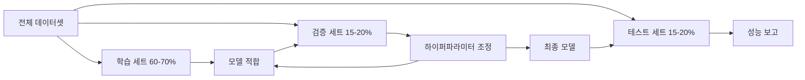

# 모델 평가 (Model Evaluation)

> 모델의 품질은, 측정하는 방식만큼만 좋습니다.

**Type:** Build
**Languages:** Python
**Prerequisites:** Phase 1 (Probability & Distributions, Statistics for ML), Phase 2 Lessons 1-8
**Time:** ~90 minutes

## 학습 목표 (Learning Objectives)

- K-fold와 stratified K-fold 교차검증을 처음부터 구현하고, 불균형 데이터에서 계층화가 왜 중요한지 설명합니다
- precision, recall, F1, AUC-ROC와 회귀 지표(MSE, RMSE, MAE, R-squared)를 처음부터 계산합니다
- 학습 곡선을 해석해 모델이 높은 편향인지 높은 분산인지 진단합니다
- 데이터 누수, 잘못된 지표 선택, 테스트 세트 오염을 포함한 흔한 평가 실수를 식별합니다

## 문제 상황 (The Problem)

모델을 학습했습니다. 데이터에서 정확도 95%가 나옵니다. 좋은가요?

그럴 수도 있고, 아닐 수도 있습니다. 데이터의 95%가 한 클래스라면, 그 클래스만 항상 예측하는 모델도 정확도 95%를 내면서 완전히 쓸모없습니다. 학습에 쓴 같은 데이터로 평가했다면, 모델이 답을 암기한 것이라 95%는 의미가 없습니다. 데이터에 시간 성분이 있는데 분할 전에 무작위로 섞었다면, 모델이 과거를 예측하는 데 미래 데이터를 쓰고 있을 수 있습니다.

모델 평가야말로 대부분의 ML 프로젝트가 틀어지는 지점입니다. 잘못된 지표는 나쁜 모델을 좋아 보이게 합니다. 잘못된 분할은 모델이 치트하게 둡니다. 잘못된 비교는 더 나쁜 모델을 고르게 합니다. 평가를 제대로 하는 것은 선택 사항이 아닙니다. 프로덕션에서 동작하는 모델과, 실제 데이터를 보는 순간 실패하는 모델의 차이입니다.

## 핵심 개념 (The Concept)

### 학습, 검증, 테스트



세 분할, 세 목적:

- **학습 세트**: 모델이 이 데이터로부터 학습합니다. 학습 중 이 예제를 봅니다.
- **검증 세트**: 하이퍼파라미터를 조정하고 모델 간 선택에 씁니다. 모델은 이 데이터로 학습하지 않지만, 당신의 결정은 여기에 영향을 받습니다.
- **테스트 세트**: 맨 끝에 정확히 한 번만 만져, 최종 성능을 보고합니다. 테스트 성능을 보고 모델을 바꾸면, 더 이상 테스트 세트가 아닙니다. 두 번째 검증 세트가 됩니다.

테스트 세트는 보고된 성능이 정말 본 적 없는 데이터에서의 성능을 반영한다는 홀드아웃 보장입니다.

### K-Fold 교차검증

작은 데이터셋에서는 단일 학습/검증 분할이 데이터를 낭비하고 추정이 시끄럽습니다. K-fold 교차검증은 학습과 검증 모두에 전체 데이터를 씁니다:

```mermaid
flowchart TB
    subgraph Fold1["Fold 1"]
        direction LR
        V1["Val"] --- T1a["Train"] --- T1b["Train"] --- T1c["Train"] --- T1d["Train"]
    end
    subgraph Fold2["Fold 2"]
        direction LR
        T2a["Train"] --- V2["Val"] --- T2b["Train"] --- T2c["Train"] --- T2d["Train"]
    end
    subgraph Fold3["Fold 3"]
        direction LR
        T3a["Train"] --- T3b["Train"] --- V3["Val"] --- T3c["Train"] --- T3d["Train"]
    end
    subgraph Fold4["Fold 4"]
        direction LR
        T4a["Train"] --- T4b["Train"] --- T4c["Train"] --- V4["Val"] --- T4d["Train"]
    end
    subgraph Fold5["Fold 5"]
        direction LR
        T5a["Train"] --- T5b["Train"] --- T5c["Train"] --- T5d["Train"] --- V5["Val"]
    end
    Fold1 --> R["점수 평균"]
    Fold2 --> R
    Fold3 --> R
    Fold4 --> R
    Fold5 --> R
```



1. 데이터를 크기가 같은 K개 fold로 분할
2. 각 fold마다 K-1개 fold로 학습하고 남은 fold로 검증
3. K개 검증 점수를 평균

K=5 또는 K=10이 표준 선택입니다. 모든 데이터 포인트가 검증에 정확히 한 번 쓰입니다. 평균 점수는 단일 분할보다 안정적인 추정입니다.

**Stratified K-fold**: 각 fold에서 클래스 분포를 유지합니다. 데이터셋이 클래스 A 70%, 클래스 B 30%라면, 각 fold도 대략 같은 비율을 가집니다. 무작위 분할이 소수 샘플을 한 fold에 몰아넣을 수 있는 불균형 데이터셋에서 중요합니다.

### 분류 지표

**혼동 행렬 (Confusion matrix)**: 기초입니다. 이진 분류에서:

|  | Predicted Positive | Predicted Negative |
|--|---|---|
| Actually Positive | True Positive (TP) | False Negative (FN) |
| Actually Negative | False Positive (FP) | True Negative (TN) |

이 행렬에서 다른 모든 지표가 나옵니다:

- **Accuracy** = (TP + TN) / (TP + TN + FP + FN). 올바른 예측의 비율. 클래스가 불균형할 때 오해를 줍니다.
- **Precision** = TP / (TP + FP). 양성이라고 예측한 것 중 실제로 양성이었던 비율. 위양성이 비쌀 때 씁니다(예: 스팸 필터가 진짜 메일을 스팸으로).
- **Recall** (sensitivity) = TP / (TP + FN). 실제 양성 중 몇이나 잡았는가. 위음성이 비쌀 때 씁니다(예: 암 검진에서 종양을 놓침).
- **F1 score** = 2 * precision * recall / (precision + recall). precision과 recall의 조화평균. 어느 쪽도 분명히 우세하지 않을 때 둘을 균형 잡습니다.
- **AUC-ROC**: Receiver Operating Characteristic 곡선 아래 면적. 여러 분류 임계값에서 진양성률 대 위양성률을 그립니다. AUC = 0.5는 무작위 추측, AUC = 1.0은 완벽한 분리. 임계값에 무관합니다: 어떤 컷오프를 고르든, 모델이 음수보다 양수를 위에 얼마나 잘 순위 매기는지를 측정합니다.

### 회귀 지표

- **MSE** (Mean Squared Error) = mean((y_true - y_pred)^2). 큰 오차를 이차로 벌합니다. 이상치에 민감합니다.
- **RMSE** (Root Mean Squared Error) = sqrt(MSE). 타깃 변수와 같은 단위. MSE보다 해석하기 쉽습니다.
- **MAE** (Mean Absolute Error) = mean(|y_true - y_pred|). 모든 오차를 선형으로 다룹니다. MSE보다 이상치에 견고합니다.
- **R-squared** = 1 - SS_res / SS_tot, 여기서 SS_res = sum((y_true - y_pred)^2), SS_tot = sum((y_true - y_mean)^2). 모델이 설명하는 분산의 비율. R^2 = 1.0은 완벽. R^2 = 0.0은 항상 평균을 예측하는 것과 다름없음. 모델이 평균보다 나쁘면 R^2는 음수가 될 수 있습니다.

### 학습 곡선 (Learning Curves)

학습 세트 크기의 함수로 학습·검증 점수를 그립니다:

- **높은 편향 (과소적합)**: 두 곡선이 낮은 점수로 수렴. 데이터를 더 넣어도 도움이 안 됩니다. 더 복잡한 모델이 필요합니다.
- **높은 분산 (과적합)**: 학습 점수는 높지만 검증 점수는 훨씬 낮음. 격차가 큽니다. 데이터를 더 넣으면 도움이 됩니다.

### 검증 곡선 (Validation Curves)

하이퍼파라미터의 함수로 학습·검증 점수를 그립니다:

- 낮은 복잡도: 두 점수 모두 낮음 (과소적합)
- 적절한 복잡도: 두 점수 모두 높고 서로 가까움
- 높은 복잡도: 학습 점수는 높지만 검증 점수가 떨어짐 (과적합)

최적 하이퍼파라미터 값은 검증 점수가 정점인 곳입니다.

### 흔한 평가 실수

**데이터 누수 (Data leakage)**: 테스트 세트 정보가 학습으로 새어 들어갑니다. 예: 분할 전에 전체 데이터셋으로 스케일러를 적합, 시계열 예측에 미래 데이터 포함, 타깃에서 파생된 특성 사용. 항상 먼저 분할하고, 그다음 전처리하세요.

**클래스 불균형**: 거래의 99%가 정상, 1%가 사기. 항상 "정상"을 예측하는 모델은 정확도 99%를 냅니다. 대신 precision, recall, F1, 또는 AUC-ROC를 쓰세요.

**잘못된 지표**: recall을 최적화해야 하는데 accuracy를 최적화(의료 진단), 또는 데이터에 무거운 이상치가 있는데 RMSE를 최적화(대신 MAE).

**계층화 분할을 쓰지 않음**: 불균형 데이터에서 무작위 분할은 검증 fold에 소수 샘플을 거의 넣지 않아, 추정이 불안정할 수 있습니다.

**너무 자주 테스트**: 테스트 성능을 보고 조정할 때마다 테스트 세트에 과적합합니다. 테스트 세트는 일회용입니다.

```figure
precision-recall-threshold
```

## 직접 만들기 (Build It)

### 1단계: 학습/검증/테스트 분할

```python
import random
import math


def train_val_test_split(X, y, train_ratio=0.6, val_ratio=0.2, seed=42):
    random.seed(seed)
    n = len(X)
    indices = list(range(n))
    random.shuffle(indices)

    train_end = int(n * train_ratio)
    val_end = int(n * (train_ratio + val_ratio))

    train_idx = indices[:train_end]
    val_idx = indices[train_end:val_end]
    test_idx = indices[val_end:]

    X_train = [X[i] for i in train_idx]
    y_train = [y[i] for i in train_idx]
    X_val = [X[i] for i in val_idx]
    y_val = [y[i] for i in val_idx]
    X_test = [X[i] for i in test_idx]
    y_test = [y[i] for i in test_idx]

    return X_train, y_train, X_val, y_val, X_test, y_test
```

### 2단계: K-fold와 stratified K-fold 교차검증

```python
def kfold_split(n, k=5, seed=42):
    random.seed(seed)
    indices = list(range(n))
    random.shuffle(indices)

    fold_size = n // k
    folds = []

    for i in range(k):
        start = i * fold_size
        end = start + fold_size if i < k - 1 else n
        val_idx = indices[start:end]
        train_idx = indices[:start] + indices[end:]
        folds.append((train_idx, val_idx))

    return folds


def stratified_kfold_split(y, k=5, seed=42):
    random.seed(seed)

    class_indices = {}
    for i, label in enumerate(y):
        class_indices.setdefault(label, []).append(i)

    for label in class_indices:
        random.shuffle(class_indices[label])

    folds = [{"train": [], "val": []} for _ in range(k)]

    for label, indices in class_indices.items():
        fold_size = len(indices) // k
        for i in range(k):
            start = i * fold_size
            end = start + fold_size if i < k - 1 else len(indices)
            val_part = indices[start:end]
            train_part = indices[:start] + indices[end:]
            folds[i]["val"].extend(val_part)
            folds[i]["train"].extend(train_part)

    return [(f["train"], f["val"]) for f in folds]


def cross_validate(X, y, model_fn, k=5, metric_fn=None, stratified=False):
    n = len(X)

    if stratified:
        folds = stratified_kfold_split(y, k)
    else:
        folds = kfold_split(n, k)

    scores = []
    for train_idx, val_idx in folds:
        X_train = [X[i] for i in train_idx]
        y_train = [y[i] for i in train_idx]
        X_val = [X[i] for i in val_idx]
        y_val = [y[i] for i in val_idx]

        model = model_fn()
        model.fit(X_train, y_train)
        predictions = [model.predict(x) for x in X_val]

        if metric_fn:
            score = metric_fn(y_val, predictions)
        else:
            score = sum(1 for yt, yp in zip(y_val, predictions) if yt == yp) / len(y_val)
        scores.append(score)

    return scores
```

### 3단계: 혼동 행렬과 분류 지표

```python
def confusion_matrix(y_true, y_pred):
    tp = sum(1 for yt, yp in zip(y_true, y_pred) if yt == 1 and yp == 1)
    tn = sum(1 for yt, yp in zip(y_true, y_pred) if yt == 0 and yp == 0)
    fp = sum(1 for yt, yp in zip(y_true, y_pred) if yt == 0 and yp == 1)
    fn = sum(1 for yt, yp in zip(y_true, y_pred) if yt == 1 and yp == 0)
    return tp, tn, fp, fn


def accuracy(y_true, y_pred):
    tp, tn, fp, fn = confusion_matrix(y_true, y_pred)
    total = tp + tn + fp + fn
    return (tp + tn) / total if total > 0 else 0.0


def precision(y_true, y_pred):
    tp, tn, fp, fn = confusion_matrix(y_true, y_pred)
    return tp / (tp + fp) if (tp + fp) > 0 else 0.0


def recall(y_true, y_pred):
    tp, tn, fp, fn = confusion_matrix(y_true, y_pred)
    return tp / (tp + fn) if (tp + fn) > 0 else 0.0


def f1_score(y_true, y_pred):
    p = precision(y_true, y_pred)
    r = recall(y_true, y_pred)
    return 2 * p * r / (p + r) if (p + r) > 0 else 0.0


def roc_curve(y_true, y_scores):
    thresholds = sorted(set(y_scores), reverse=True)
    tpr_list = []
    fpr_list = []

    total_positives = sum(y_true)
    total_negatives = len(y_true) - total_positives

    for threshold in thresholds:
        y_pred = [1 if s >= threshold else 0 for s in y_scores]
        tp = sum(1 for yt, yp in zip(y_true, y_pred) if yt == 1 and yp == 1)
        fp = sum(1 for yt, yp in zip(y_true, y_pred) if yt == 0 and yp == 1)

        tpr = tp / total_positives if total_positives > 0 else 0.0
        fpr = fp / total_negatives if total_negatives > 0 else 0.0

        tpr_list.append(tpr)
        fpr_list.append(fpr)

    return fpr_list, tpr_list, thresholds


def auc_roc(y_true, y_scores):
    fpr_list, tpr_list, _ = roc_curve(y_true, y_scores)

    pairs = sorted(zip(fpr_list, tpr_list))
    fpr_sorted = [p[0] for p in pairs]
    tpr_sorted = [p[1] for p in pairs]

    area = 0.0
    for i in range(1, len(fpr_sorted)):
        width = fpr_sorted[i] - fpr_sorted[i - 1]
        height = (tpr_sorted[i] + tpr_sorted[i - 1]) / 2
        area += width * height

    return area
```

### 4단계: 회귀 지표

```python
def mse(y_true, y_pred):
    n = len(y_true)
    return sum((yt - yp) ** 2 for yt, yp in zip(y_true, y_pred)) / n


def rmse(y_true, y_pred):
    return math.sqrt(mse(y_true, y_pred))


def mae(y_true, y_pred):
    n = len(y_true)
    return sum(abs(yt - yp) for yt, yp in zip(y_true, y_pred)) / n


def r_squared(y_true, y_pred):
    mean_y = sum(y_true) / len(y_true)
    ss_res = sum((yt - yp) ** 2 for yt, yp in zip(y_true, y_pred))
    ss_tot = sum((yt - mean_y) ** 2 for yt in y_true)
    if ss_tot == 0:
        return 0.0
    return 1.0 - ss_res / ss_tot
```

### 5단계: 학습 곡선

```python
def learning_curve(X, y, model_fn, metric_fn, train_sizes=None, val_ratio=0.2, seed=42):
    random.seed(seed)
    n = len(X)
    indices = list(range(n))
    random.shuffle(indices)

    val_size = int(n * val_ratio)
    val_idx = indices[:val_size]
    pool_idx = indices[val_size:]

    X_val = [X[i] for i in val_idx]
    y_val = [y[i] for i in val_idx]

    if train_sizes is None:
        train_sizes = [int(len(pool_idx) * r) for r in [0.1, 0.2, 0.4, 0.6, 0.8, 1.0]]

    train_scores = []
    val_scores = []

    for size in train_sizes:
        subset = pool_idx[:size]
        X_train = [X[i] for i in subset]
        y_train = [y[i] for i in subset]

        model = model_fn()
        model.fit(X_train, y_train)

        train_pred = [model.predict(x) for x in X_train]
        val_pred = [model.predict(x) for x in X_val]

        train_scores.append(metric_fn(y_train, train_pred))
        val_scores.append(metric_fn(y_val, val_pred))

    return train_sizes, train_scores, val_scores
```

### 6단계: 테스트용 단순 분류기, 그리고 전체 데모

```python
class SimpleLogistic:
    def __init__(self, lr=0.1, epochs=100):
        self.lr = lr
        self.epochs = epochs
        self.weights = None
        self.bias = 0.0

    def sigmoid(self, z):
        z = max(-500, min(500, z))
        return 1.0 / (1.0 + math.exp(-z))

    def fit(self, X, y):
        n_features = len(X[0])
        self.weights = [0.0] * n_features
        self.bias = 0.0

        for _ in range(self.epochs):
            for xi, yi in zip(X, y):
                z = sum(w * x for w, x in zip(self.weights, xi)) + self.bias
                pred = self.sigmoid(z)
                error = yi - pred
                for j in range(n_features):
                    self.weights[j] += self.lr * error * xi[j]
                self.bias += self.lr * error

    def predict_proba(self, x):
        z = sum(w * xi for w, xi in zip(self.weights, x)) + self.bias
        return self.sigmoid(z)

    def predict(self, x):
        return 1 if self.predict_proba(x) >= 0.5 else 0


class SimpleLinearRegression:
    def __init__(self, lr=0.001, epochs=200):
        self.lr = lr
        self.epochs = epochs
        self.weights = None
        self.bias = 0.0

    def fit(self, X, y):
        n_features = len(X[0])
        self.weights = [0.0] * n_features
        self.bias = 0.0
        n = len(X)

        for _ in range(self.epochs):
            for xi, yi in zip(X, y):
                pred = sum(w * x for w, x in zip(self.weights, xi)) + self.bias
                error = yi - pred
                for j in range(n_features):
                    self.weights[j] += self.lr * error * xi[j] / n
                self.bias += self.lr * error / n

    def predict(self, x):
        return sum(w * xi for w, xi in zip(self.weights, x)) + self.bias


def standardize(values):
    n = len(values)
    mean = sum(values) / n
    var = sum((v - mean) ** 2 for v in values) / n
    std = math.sqrt(var) if var > 0 else 1.0
    return [(v - mean) / std for v in values], mean, std


def make_classification_data(n=300, seed=42):
    random.seed(seed)
    X = []
    y = []
    for _ in range(n):
        x1 = random.gauss(0, 1)
        x2 = random.gauss(0, 1)
        label = 1 if (x1 + x2 + random.gauss(0, 0.5)) > 0 else 0
        X.append([x1, x2])
        y.append(label)
    return X, y


def make_regression_data(n=200, seed=42):
    random.seed(seed)
    X = []
    y = []
    for _ in range(n):
        x1 = random.uniform(0, 10)
        x2 = random.uniform(0, 5)
        target = 3 * x1 + 2 * x2 + random.gauss(0, 2)
        X.append([x1, x2])
        y.append(target)
    return X, y


def make_imbalanced_data(n=300, minority_ratio=0.05, seed=42):
    random.seed(seed)
    X = []
    y = []
    for _ in range(n):
        if random.random() < minority_ratio:
            x1 = random.gauss(3, 0.5)
            x2 = random.gauss(3, 0.5)
            label = 1
        else:
            x1 = random.gauss(0, 1)
            x2 = random.gauss(0, 1)
            label = 0
        X.append([x1, x2])
        y.append(label)
    return X, y


if __name__ == "__main__":
    X_clf, y_clf = make_classification_data(300)

    print("=== Train/Validation/Test Split ===")
    X_train, y_train, X_val, y_val, X_test, y_test = train_val_test_split(X_clf, y_clf)
    print(f"  Train: {len(X_train)}, Val: {len(X_val)}, Test: {len(X_test)}")
    print(f"  Train class distribution: {sum(y_train)}/{len(y_train)} positive")
    print(f"  Val class distribution: {sum(y_val)}/{len(y_val)} positive")

    model = SimpleLogistic(lr=0.1, epochs=200)
    model.fit(X_train, y_train)

    print("\n=== Classification Metrics ===")
    y_pred = [model.predict(x) for x in X_test]
    tp, tn, fp, fn = confusion_matrix(y_test, y_pred)
    print(f"  Confusion matrix: TP={tp}, TN={tn}, FP={fp}, FN={fn}")
    print(f"  Accuracy:  {accuracy(y_test, y_pred):.4f}")
    print(f"  Precision: {precision(y_test, y_pred):.4f}")
    print(f"  Recall:    {recall(y_test, y_pred):.4f}")
    print(f"  F1 Score:  {f1_score(y_test, y_pred):.4f}")

    y_scores = [model.predict_proba(x) for x in X_test]
    auc = auc_roc(y_test, y_scores)
    print(f"  AUC-ROC:   {auc:.4f}")

    print("\n=== K-Fold Cross-Validation (K=5) ===")
    cv_scores = cross_validate(
        X_clf, y_clf,
        model_fn=lambda: SimpleLogistic(lr=0.1, epochs=200),
        k=5,
        metric_fn=accuracy,
    )
    mean_cv = sum(cv_scores) / len(cv_scores)
    std_cv = math.sqrt(sum((s - mean_cv) ** 2 for s in cv_scores) / len(cv_scores))
    print(f"  Fold scores: {[round(s, 4) for s in cv_scores]}")
    print(f"  Mean: {mean_cv:.4f} (+/- {std_cv:.4f})")

    print("\n=== Stratified K-Fold Cross-Validation (K=5) ===")
    strat_scores = cross_validate(
        X_clf, y_clf,
        model_fn=lambda: SimpleLogistic(lr=0.1, epochs=200),
        k=5,
        metric_fn=accuracy,
        stratified=True,
    )
    strat_mean = sum(strat_scores) / len(strat_scores)
    strat_std = math.sqrt(sum((s - strat_mean) ** 2 for s in strat_scores) / len(strat_scores))
    print(f"  Fold scores: {[round(s, 4) for s in strat_scores]}")
    print(f"  Mean: {strat_mean:.4f} (+/- {strat_std:.4f})")

    print("\n=== Imbalanced Data: Why Accuracy Lies ===")
    X_imb, y_imb = make_imbalanced_data(300, minority_ratio=0.05)
    positives = sum(y_imb)
    print(f"  Class distribution: {positives} positive, {len(y_imb) - positives} negative ({positives/len(y_imb)*100:.1f}% positive)")

    always_negative = [0] * len(y_imb)
    print(f"  Always-negative baseline:")
    print(f"    Accuracy:  {accuracy(y_imb, always_negative):.4f}")
    print(f"    Precision: {precision(y_imb, always_negative):.4f}")
    print(f"    Recall:    {recall(y_imb, always_negative):.4f}")
    print(f"    F1 Score:  {f1_score(y_imb, always_negative):.4f}")

    X_tr_i, y_tr_i, X_v_i, y_v_i, X_te_i, y_te_i = train_val_test_split(X_imb, y_imb)
    model_imb = SimpleLogistic(lr=0.5, epochs=500)
    model_imb.fit(X_tr_i, y_tr_i)
    y_pred_imb = [model_imb.predict(x) for x in X_te_i]
    print(f"\n  Trained model on imbalanced data:")
    print(f"    Accuracy:  {accuracy(y_te_i, y_pred_imb):.4f}")
    print(f"    Precision: {precision(y_te_i, y_pred_imb):.4f}")
    print(f"    Recall:    {recall(y_te_i, y_pred_imb):.4f}")
    print(f"    F1 Score:  {f1_score(y_te_i, y_pred_imb):.4f}")

    print("\n=== Regression Metrics ===")
    X_reg, y_reg = make_regression_data(200)

    col0 = [x[0] for x in X_reg]
    col1 = [x[1] for x in X_reg]
    col0_s, m0, s0 = standardize(col0)
    col1_s, m1, s1 = standardize(col1)
    X_reg_scaled = [[col0_s[i], col1_s[i]] for i in range(len(X_reg))]

    X_tr_r, y_tr_r, X_v_r, y_v_r, X_te_r, y_te_r = train_val_test_split(X_reg_scaled, y_reg)
    reg_model = SimpleLinearRegression(lr=0.01, epochs=500)
    reg_model.fit(X_tr_r, y_tr_r)
    y_pred_r = [reg_model.predict(x) for x in X_te_r]

    print(f"  MSE:       {mse(y_te_r, y_pred_r):.4f}")
    print(f"  RMSE:      {rmse(y_te_r, y_pred_r):.4f}")
    print(f"  MAE:       {mae(y_te_r, y_pred_r):.4f}")
    print(f"  R-squared: {r_squared(y_te_r, y_pred_r):.4f}")

    mean_baseline = [sum(y_tr_r) / len(y_tr_r)] * len(y_te_r)
    print(f"\n  Mean baseline:")
    print(f"    MSE:       {mse(y_te_r, mean_baseline):.4f}")
    print(f"    R-squared: {r_squared(y_te_r, mean_baseline):.4f}")

    print("\n=== Learning Curve ===")
    sizes, train_sc, val_sc = learning_curve(
        X_clf, y_clf,
        model_fn=lambda: SimpleLogistic(lr=0.1, epochs=200),
        metric_fn=accuracy,
    )
    print(f"  {'Size':>6} {'Train':>8} {'Val':>8}")
    for s, tr, va in zip(sizes, train_sc, val_sc):
        print(f"  {s:>6} {tr:>8.4f} {va:>8.4f}")

    print("\n=== Statistical Model Comparison ===")
    model_a_scores = cross_validate(
        X_clf, y_clf,
        model_fn=lambda: SimpleLogistic(lr=0.1, epochs=100),
        k=5, metric_fn=accuracy,
    )
    model_b_scores = cross_validate(
        X_clf, y_clf,
        model_fn=lambda: SimpleLogistic(lr=0.1, epochs=500),
        k=5, metric_fn=accuracy,
    )
    diffs = [a - b for a, b in zip(model_a_scores, model_b_scores)]
    mean_diff = sum(diffs) / len(diffs)
    std_diff = math.sqrt(sum((d - mean_diff) ** 2 for d in diffs) / len(diffs))
    t_stat = mean_diff / (std_diff / math.sqrt(len(diffs))) if std_diff > 0 else 0.0
    print(f"  Model A (100 epochs) mean: {sum(model_a_scores)/len(model_a_scores):.4f}")
    print(f"  Model B (500 epochs) mean: {sum(model_b_scores)/len(model_b_scores):.4f}")
    print(f"  Mean difference: {mean_diff:.4f}")
    print(f"  Paired t-statistic: {t_stat:.4f}")
    print(f"  (|t| > 2.78 for significance at p<0.05 with df=4)")
```

## 활용하기 (Use It)

scikit-learn에서는 평가가 워크플로에 내장되어 있습니다:

```python
from sklearn.model_selection import cross_val_score, StratifiedKFold, learning_curve
from sklearn.metrics import (
    accuracy_score, precision_score, recall_score, f1_score,
    roc_auc_score, confusion_matrix, mean_squared_error, r2_score,
)
from sklearn.linear_model import LogisticRegression

model = LogisticRegression()
scores = cross_val_score(model, X, y, cv=StratifiedKFold(5), scoring="f1")
```

처음부터 구현한 버전은 교차검증이 정확히 무엇을 하는지(마법 없음, for-loop와 인덱스 추적), 각 지표가 어떻게 계산되는지(TP/FP/TN/FN만 세기), 계층화가 왜 중요한지(각 fold에서 클래스 비율 유지)를 보여 줍니다. 라이브러리 버전은 병렬화, 더 많은 스코어링 옵션, 파이프라인 통합을 더합니다.

## 산출물 (Ship It)

이 레슨은 다음을 만듭니다:
- `outputs/skill-evaluation.md` — 분류·회귀 모델의 평가 전략을 다루는 스킬

## 연습 문제 (Exercises)

1. precision-recall 곡선을 구현하세요: 여러 임계값에서 precision 대 recall을 그립니다. average precision(PR 곡선 아래 면적)을 계산합니다. 불균형 데이터셋에서 PR 곡선과 ROC 곡선을 비교하고, 각각이 언제 더 유용한지 설명하세요.
2. nested 교차검증 루프를 만드세요: 바깥 루프는 모델 성능을 평가하고, 안쪽 루프는 하이퍼파라미터를 조정합니다. 검증 데이터를 평가로 누수시키지 않고 두 모델을 공정하게 비교하는 데 쓰세요.
3. 모델 비교를 위한 permutation test를 구현하세요: 라벨을 섞고, 재학습하고, 성능을 측정합니다. 100번 반복해 null 분포를 만듭니다. 이 분포에 대해 관측된 모델 성능의 p-value를 계산하세요.

## 핵심 용어 (Key Terms)

| Term | What people say | What it actually means |
|------|----------------|----------------------|
| Overfitting | "학습 데이터를 암기" | 모델이 학습 데이터의 노이즈를 잡아, 학습에서는 잘하고 본 적 없는 데이터에서는 나쁨 |
| Cross-validation | "다른 부분 집합으로 테스트" | 어느 부분이 검증에 쓰이는지를 체계적으로 회전하며, 모든 회전에 걸쳐 결과를 평균 |
| Precision | "예측한 양성 중 몇이 맞았나" | TP / (TP + FP): 양성 예측 중 실제로 양성인 비율 |
| Recall | "실제 양성을 몇이나 찾았나" | TP / (TP + FN): 실제 양성 중 올바르게 식별된 비율 |
| AUC-ROC | "모델이 클래스를 얼마나 잘 분리하나" | 모든 임계값에 걸친 진양성률 대 위양성률 곡선 아래 면적. 0.5(무작위)에서 1.0(완벽) |
| R-squared | "분산을 얼마나 설명하나" | 1 - (잔차 제곱합 / 총 제곱합): 모델이 포착한 타깃 분산의 비율 |
| Data leakage | "모델이 치트함" | 예측 시점에 없을 정보를 학습에 써서, 평가가 낙관적으로 나옴 |
| Learning curve | "데이터가 늘면 성능이 어떻게 변하나" | 학습 세트 크기 대비 학습·검증 점수 플롯. 과소적합 또는 과적합을 드러냄 |
| Stratified split | "클래스 비율을 균형 있게" | 각 부분 집합이 전체 데이터셋과 같은 클래스 비율을 갖도록 분할 |

## 더 읽을거리 (Further Reading)

- [scikit-learn Model Selection Guide](https://scikit-learn.org/stable/model_selection.html) — 교차검증, 지표, 하이퍼파라미터 조정에 대한 종합 참고서
- [Beyond Accuracy: Precision and Recall (Google ML Crash Course)](https://developers.google.com/machine-learning/crash-course/classification/precision-and-recall) — 인터랙티브 예제가 있는 명확한 설명
- [A Survey of Cross-Validation Procedures (Arlot & Celisse, 2010)](https://projecteuclid.org/journals/statistics-surveys/volume-4/issue-none/A-survey-of-cross-validation-procedures-for-model-selection/10.1214/09-SS054.full) — 서로 다른 CV 전략이 언제·왜 동작하는지에 대한 엄밀한 다룸
