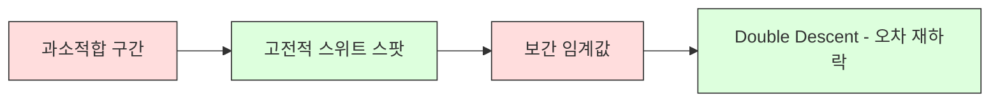
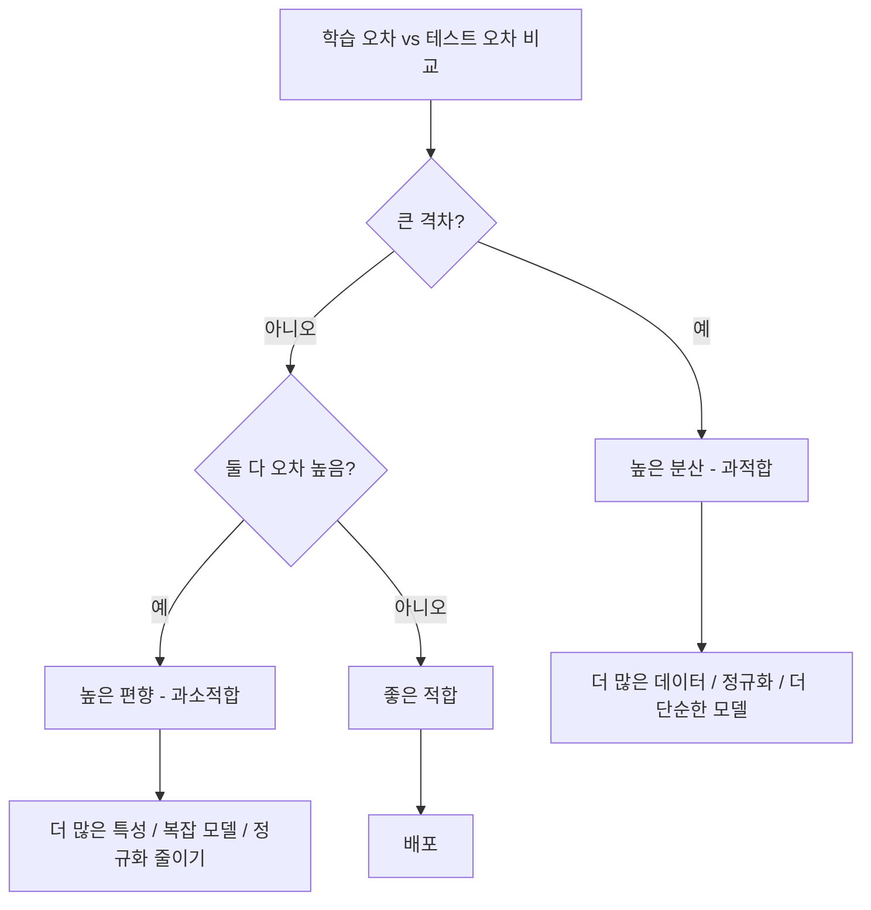
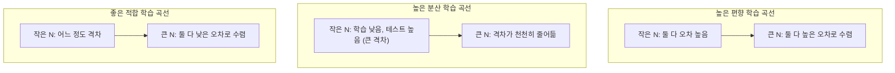
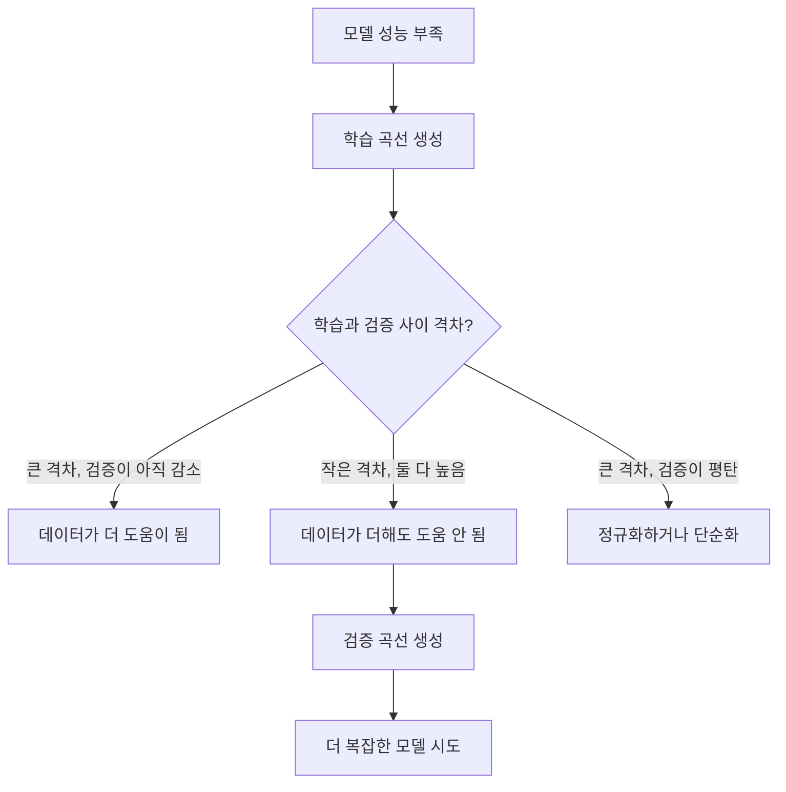

# 편향-분산 트레이드오프 (Bias-Variance Tradeoff)

> 모든 모델 오차는 편향, 분산, 노이즈 세 가지 중 하나에서 옵니다. 제어할 수 있는 것은 앞의 둘뿐입니다.

**Type:** Learn
**Language:** Python
**Prerequisites:** Phase 2, Lessons 01-09 (ML basics, regression, classification, evaluation)
**Time:** ~75 minutes

## 학습 목표 (Learning Objectives)

- 기대 예측 오차의 편향-분산 분해를 유도하고, 줄일 수 없는 노이즈의 역할을 설명합니다
- 학습·테스트 오차 패턴으로 모델이 높은 편향인지 높은 분산인지 진단합니다
- 정규화 기법(L1, L2, dropout, early stopping)이 분산을 위해 편향을 어떻게 교환하는지 설명합니다
- 복잡도가 증가하는 모델들에 대해 편향-분산 트레이드오프를 시각화하는 실험을 구현합니다

## 문제 상황 (The Problem)

모델을 학습했습니다. 테스트 데이터에 어떤 오차가 있습니다. 그 오차는 어디서 올까요?

모델이 너무 단순하면(곡선 데이터셋에 선형 회귀) 진짜 패턴을 일관되게 놓칩니다. 그것이 편향입니다. 모델이 너무 복잡하면(데이터 포인트 15개에 20차 다항식) 학습 데이터는 완벽하게 맞추지만 새 데이터에서는 예측이 크게 달라집니다. 그것이 분산입니다.

고정된 모델 용량에서는 둘을 동시에 최소화할 수 없습니다. 편향을 내리면 분산이 올라갑니다. 분산을 내리면 편향이 올라갑니다. 이 트레이드오프를 이해하는 것이 머신러닝에서 가장 쓸모 있는 진단 스킬입니다. 모델을 더 복잡하게 할지 덜 복잡하게 할지, 데이터를 더 모을지 특성을 더 잘 만들지, 정규화를 더 할지 덜 할지 알려 줍니다.

## 핵심 개념 (The Concept)

### 편향: 체계적 오차

편향은 모델의 평균 예측이 참값에서 얼마나 벗어나는지를 잽니다. 같은 분포에서 뽑은 여러 학습 세트로 같은 모델을 학습하고 예측을 평균했을 때, 그 평균과 진실 사이의 간극이 편향입니다.

높은 편향은 모델이 너무 경직해서 실제 패턴을 잡지 못함을 뜻합니다. 포물선에 맞춘 직선은 데이터를 아무리 많이 줘도 곡선을 항상 놓칩니다. 이것이 과소적합입니다.

```
High bias (underfitting):
  Model always predicts roughly the same wrong thing.
  Training error: HIGH
  Test error: HIGH
  Gap between them: SMALL
```

### 분산: 학습 데이터에 대한 민감도

분산은 다른 데이터 부분 집합으로 학습할 때 예측이 얼마나 바뀌는지를 잽니다. 학습 세트의 작은 변화가 모델의 큰 변화를 일으키면 분산이 높습니다.

높은 분산은 모델이 기저 신호가 아니라 학습 데이터의 노이즈를 맞추고 있음을 뜻합니다. 20차 다항식은 모든 학습 점을 통과하지만 그 사이에서는 격렬하게 진동합니다. 이것이 과적합입니다.

```
High variance (overfitting):
  Model fits training data perfectly but fails on new data.
  Training error: LOW
  Test error: HIGH
  Gap between them: LARGE
```

### 분해

임의의 점 x에서, 제곱 손실 아래의 기대 예측 오차는 정확히 분해됩니다:

```
Expected Error = Bias^2 + Variance + Irreducible Noise

where:
  Bias^2   = (E[f_hat(x)] - f(x))^2
  Variance = E[(f_hat(x) - E[f_hat(x)])^2]
  Noise    = E[(y - f(x))^2]             (sigma^2)
```

- `f(x)`는 참 함수
- `f_hat(x)`는 모델의 예측
- `E[...]`는 서로 다른 학습 세트에 대한 기댓값
- `y`는 관측 라벨(참 함수 + 노이즈)

노이즈 항은 줄일 수 없습니다. 어떤 모델도 노이즈가 있는 데이터에서 sigma^2보다 나을 수 없습니다. 할 일은 bias^2와 분산 사이의 올바른 균형을 찾는 것입니다.

### 모델 복잡도 vs 오차


고전적인 U자 곡선:

| Complexity | Bias | Variance | Total Error |
|-----------|------|----------|-------------|
| 너무 낮음 | HIGH | LOW | HIGH (과소적합) |
| 딱 맞음 | MODERATE | MODERATE | LOWEST |
| 너무 높음 | LOW | HIGH | HIGH (과적합) |

### 편향-분산 제어로서의 정규화

정규화는 분산을 줄이기 위해 의도적으로 편향을 올립니다. 모델이 노이즈를 쫓지 못하도록 제약합니다.

- **L2 (Ridge):** 모든 가중치를 0 쪽으로 수축합니다. 특성은 모두 유지하되 영향력을 줄입니다.
- **L1 (Lasso):** 일부 가중치를 정확히 0으로 밀어냅니다. 특성 선택을 수행합니다.
- **Dropout:** 학습 중 뉴런을 무작위로 비활성화합니다. 중복 표현을 강제합니다.
- **Early stopping:** 모델이 학습 데이터를 완전히 맞추기 전에 학습을 멈춥니다.

정규화 강도(lambda, dropout rate, epoch 수)가 편향-분산 곡선에서 어디에 앉을지를 직접 제어합니다. 정규화가 많을수록 편향은 커지고 분산은 작아집니다.

### Double Descent: 현대적 관점

고전 이론은 말합니다: 스위트 스팟을 지나면 복잡도를 더 올리면 항상 해가 된다. 하지만 2019년 이후 연구는 예상치 못한 것을 보여 주었습니다. 보간 임계값(모델이 학습 데이터를 완벽히 맞출 만큼 파라미터가 있는 지점)을 훨씬 지나 모델 용량을 계속 키우면, 테스트 오차가 다시 떨어질 수 있습니다.



이 "double descent" 현상은 왜 극단적으로 과파라미터화된 신경망(학습 예제보다 파라미터가 훨씬 많은)이 여전히 잘 일반화하는지를 설명합니다. 고전적 편향-분산 트레이드오프가 틀린 것은 아니지만, 현대 체제에서는 불완전합니다.

Double descent에 대한 핵심 관찰:
- 선형 모델, 결정 트리, 신경망에서 모두 일어남
- 보간 구간에서는 데이터가 더 많아도 오히려 해가 될 수 있음(sample-wise double descent)
- 학습 epoch를 더해도 일어날 수 있음(epoch-wise double descent)
- 정규화는 피크를 부드럽게 하지만 없애지는 않음

왜 이런가? 보간 임계값에서 모델은 모든 학습 점을 맞출 만큼의 용량만 겨우 갖습니다. 모든 점을 통과하는 매우 특수한 해로 강제되고, 데이터의 작은 섭동이 적합의 큰 변화를 일으킵니다. 여기서 분산이 피크입니다. 임계값을 지나면 데이터를 완벽히 맞추는 해가 많아집니다. 학습 알고리즘(예: 암묵적 정규화가 있는 경사하강법)은 그중 가장 단순한 쪽을 고르는 경향이 있습니다. 단순 해로의의 이 암묵적 편향 때문에 과파라미터화 모델이 일반화합니다.

| Regime | Parameters vs Samples | Behavior |
|--------|----------------------|----------|
| 과소파라미터화 | p << n | 고전적 트레이드오프가 적용 |
| 보간 임계값 | p ~ n | 분산이 피크, 테스트 오차 급등 |
| 과파라미터화 | p >> n | 암묵적 정규화가 작동, 테스트 오차 하락 |

실무적으로: 신경망이나 큰 트리 앙상블을 쓴다면 보간 임계값에서 멈추지 마세요. 명시적 정규화로 그 아래 멀리 있거나, 훨씬 지나 가세요. 최악의 자리는 임계값 바로 위입니다.

### 모델 진단하기



| Symptom | Diagnosis | Fix |
|---------|-----------|-----|
| 높은 학습 오차, 높은 테스트 오차 | Bias | 더 많은 특성, 복잡 모델, 정규화 줄이기 |
| 낮은 학습 오차, 높은 테스트 오차 | Variance | 더 많은 데이터, 정규화, 더 단순한 모델, dropout |
| 낮은 학습 오차, 낮은 테스트 오차 | Good fit | 배포 |
| 학습 오차 감소, 테스트 오차 증가 | 진행 중 과적합 | Early stopping |

### 실무 전략

**편향이 문제일 때:**
- 다항식·상호작용 특성 추가
- 더 유연한 모델 사용(선형 대신 트리 앙상블)
- 정규화 강도 줄이기
- 더 오래 학습(아직 수렴하지 않았다면)

**분산이 문제일 때:**
- 학습 데이터를 더 모음
- 배깅 사용(랜덤 포레스트)
- 정규화 증가(더 높은 lambda, 더 많은 dropout)
- 특성 선택(노이즈 특성 제거)
- 교차검증으로 조기 탐지

### 앙상블 방법과 분산 감소

앙상블 방법은 분산과 싸우는 가장 실용적인 도구입니다.

**배깅 (Bootstrap Aggregating)**은 학습 데이터의 서로 다른 부트스트랩 샘플로 여러 모델을 학습한 뒤 예측을 평균합니다. 개별 모델은 분산이 높지만, 평균은 분산이 훨씬 낮습니다. 랜덤 포레스트는 결정 트리에 배깅을 적용한 것입니다.

수학적으로 왜 동작하는가: 각각 분산 sigma^2인 독립 예측 N개를 평균하면, 평균의 분산은 sigma^2 / N입니다. 모델들은 진짜로 독립이 아니지만(비슷한 데이터를 모두 봄) 감소는 1/N보다 작아도 여전히 상당합니다.

**부스팅**은 순차적으로 모델을 만들어 편향을 줄입니다. 각 새 모델은 지금까지 앙상블의 오차에 집중합니다. 그래디언트 부스팅과 AdaBoost가 주요 예입니다. 모델을 너무 많이 더하면 과적합할 수 있으므로 early stopping이나 정규화가 필요합니다.

| Method | Primary Effect | Bias Change | Variance Change |
|--------|---------------|-------------|-----------------|
| Bagging | 분산 감소 | 변화 없음 | 감소 |
| Boosting | 편향 감소 | 감소 | 증가할 수 있음 |
| Stacking | 둘 다 감소 | 메타 학습기에 따라 | 베이스 모델에 따라 |
| Dropout | 암묵적 배깅 | 약간 증가 | 감소 |

**실무 규칙:** 베이스 모델의 분산이 높으면(깊은 트리, 고차 다항식) 배깅을 쓰세요. 베이스 모델의 편향이 높으면(얕은 스텀프, 단순 선형 모델) 부스팅을 쓰세요.

### 학습 곡선

학습 곡선은 학습 세트 크기의 함수로 학습·검증 오차를 그립니다. 가장 실용적인 진단 도구입니다. 단일 학습/테스트 비교와 달리, 학습 곡선은 모델의 궤적을 보여 주고 데이터가 더 도움이 될지 알려 줍니다.



읽는 법:

| Scenario | Training Error | Validation Error | Gap | What It Means | What to Do |
|----------|---------------|-----------------|-----|---------------|------------|
| 높은 편향 | High | High | Small | 모델이 패턴을 잡지 못함 | 더 많은 특성, 복잡 모델, 정규화 줄이기 |
| 높은 분산 | Low | High | Large | 모델이 학습 데이터를 암기 | 더 많은 데이터, 정규화, 더 단순한 모델 |
| 좋은 적합 | Moderate | Moderate | Small | 모델이 잘 일반화 | 배포 |
| 높은 분산, 개선 중 | Low | 데이터와 함께 감소 | 축소 중 | 데이터가 고칠 수 있는 분산 문제 | 데이터 더 수집 |
| 높은 편향, 평탄 | High | High and flat | Small and flat | 데이터가 더 있어도 도움 안 됨 | 모델 아키텍처 변경 |

핵심 통찰: 두 곡선이 평탄해졌고 격차는 작지만 오차가 둘 다 높으면, 데이터는 쓸모없습니다. 더 나은 모델이 필요합니다. 격차가 크고 아직 줄어드는 중이면, 데이터가 더 도움이 됩니다.

### 학습 곡선 생성 방법

접근은 두 가지입니다:

**접근 1: 학습 세트 크기 변화, 모델 고정.** 모델과 하이퍼파라미터를 고정합니다. 점점 큰 학습 데이터 부분 집합으로 학습합니다. 각 크기에서 학습·검증 오차를 측정합니다. 이것이 표준 학습 곡선입니다.

**접근 2: 모델 복잡도 변화, 데이터 고정.** 데이터를 고정합니다. 복잡도 파라미터(다항식 차수, 트리 깊이, 층 수)를 스윕합니다. 각 복잡도에서 학습·검증 오차를 측정합니다. 이것이 검증 곡선이며 편향-분산 트레이드오프를 직접 보여 줍니다.

두 접근은 서로 보완합니다. 첫 번째는 데이터가 더 도움이 될지 알려 줍니다. 두 번째는 다른 모델이 도움이 될지 알려 줍니다. 다음 단계를 결정하기 전에 둘 다 실행하세요.



```figure
bias-variance
```

## 직접 만들기 (Build It)

`code/bias_variance.py`의 코드는 전체 편향-분산 분해 실험을 실행합니다. 접근을 단계별로 봅니다.

### 1단계: 알려진 함수에서 합성 데이터 생성

가우시안 노이즈가 있는 `f(x) = sin(1.5x) + 0.5x`를 씁니다. 참 함수를 알면 정확한 편향과 분산을 계산할 수 있습니다.

```python
def true_function(x):
    return np.sin(1.5 * x) + 0.5 * x

def generate_data(n_samples=30, noise_std=0.5, x_range=(-3, 3), seed=None):
    rng = np.random.RandomState(seed)
    x = rng.uniform(x_range[0], x_range[1], n_samples)
    y = true_function(x) + rng.normal(0, noise_std, n_samples)
    return x, y
```

### 2단계: 부트스트랩 샘플링과 다항식 적합

각 다항식 차수에 대해 많은 부트스트랩 학습 세트를 뽑아 다항식을 적합하고, 고정 테스트 격자에서 예측을 기록합니다. 각 테스트 점에서 예측의 분포를 얻습니다.

```python
def fit_polynomial(x_train, y_train, degree, lam=0.0):
    X = np.column_stack([x_train ** d for d in range(degree + 1)])
    if lam > 0:
        penalty = lam * np.eye(X.shape[1])
        penalty[0, 0] = 0
        w = np.linalg.solve(X.T @ X + penalty, X.T @ y_train)
    else:
        w = np.linalg.lstsq(X, y_train, rcond=None)[0]
    return w
```

200개의 서로 다른 부트스트랩 샘플에 적합합니다. 각 부트스트랩 샘플은 같은 기저 분포에서 오지만 다른 점을 포함합니다.

### 3단계: Bias^2, Variance 분해 계산

각 테스트 점에서 예측 200세트가 있으면, 정의에서 직접 분해를 계산할 수 있습니다:

```python
mean_pred = predictions.mean(axis=0)
bias_sq = np.mean((mean_pred - y_true) ** 2)
variance = np.mean(predictions.var(axis=0))
total_error = np.mean(np.mean((predictions - y_true) ** 2, axis=1))
```

- `mean_pred`는 부트스트랩 샘플에서 추정한 E[f_hat(x)]
- `bias_sq`는 평균 예측과 진실 사이의 제곱 간극
- `variance`는 부트스트랩 샘플에 걸친 예측 확산의 평균
- `total_error`는 대략 bias^2 + variance + noise와 같아야 함

### 4단계: 학습 곡선

학습 곡선은 모델 복잡도를 고정한 채 학습 세트 크기를 스윕합니다. 모델이 데이터 제한인지 용량 제한인지 보여 줍니다.

```python
def demo_learning_curves():
    sizes = [10, 15, 20, 30, 50, 75, 100, 150, 200, 300]
    degree = 5

    for n in sizes:
        train_errors = []
        test_errors = []
        for seed in range(50):
            x_train, y_train = generate_data(n_samples=n, seed=seed * 100)
            w = fit_polynomial(x_train, y_train, degree)
            train_pred = predict_polynomial(x_train, w)
            train_mse = np.mean((train_pred - y_train) ** 2)
            test_pred = predict_polynomial(x_test, w)
            test_mse = np.mean((test_pred - y_test) ** 2)
            train_errors.append(train_mse)
            test_errors.append(test_mse)
        # Average over runs gives the learning curve point
```

높은 분산 모델(작은 데이터에 degree 5)에서는:
- 학습 오차는 낮게 시작해, 데이터가 늘면 암기가 어려워져 증가
- 테스트 오차는 높게 시작해, 모델이 더 많은 신호를 얻으며 감소
- 격차는 데이터가 늘수록 축소

높은 편향 모델(degree 1)에서는 두 오차가 같은 높은 값으로 빠르게 수렴하고, 데이터가 더해도 도움이 되지 않습니다.

### 5단계: 정규화 스윕

코드에는 `demo_regularization_sweep()`도 포함됩니다. 고차 다항식(degree 15)을 고정하고 Ridge 정규화 강도를 0.001부터 100까지 스윕합니다. 모델 복잡도를 바꾸는 대신 제약 강도를 바꿔 편향-분산 트레이드오프를 다른 각도에서 보여 줍니다.

```python
def demo_regularization_sweep():
    alphas = [0.001, 0.005, 0.01, 0.05, 0.1, 0.5, 1.0, 5.0, 10.0, 50.0, 100.0]
    for alpha in alphas:
        results = bias_variance_decomposition([15], lam=alpha)
        r = results[15]
        print(f"alpha={alpha:.3f}  bias={r['bias_sq']:.4f}  var={r['variance']:.4f}")
```

낮은 alpha에서는 degree-15 다항식이 거의 제약받지 않습니다. 각 부트스트랩 샘플의 노이즈를 쫓아 분산이 지배합니다. 높은 alpha에서는 페널티가 너무 강해 모델이 사실상 거의 상수 함수가 됩니다. 편향이 지배합니다. 최적 alpha는 이 극단 사이에 있습니다.

다항식 차수를 바꿀 때의 같은 U곡선이지만, 이산 노브 대신 연속 노브로 제어합니다. 실무에서는 특성 집합을 바꾸지 않고도 세밀한 제어가 가능하므로, 정규화가 트레이드오프를 제어하는 선호 방식입니다.

## 활용하기 (Use It)

sklearn은 부트스트랩 루프를 직접 쓰지 않고도 이 진단을 자동화하는 `learning_curve`와 `validation_curve`를 제공합니다.

### 검증 곡선: 모델 복잡도 스윕

```python
from sklearn.model_selection import validation_curve
from sklearn.pipeline import make_pipeline
from sklearn.preprocessing import PolynomialFeatures
from sklearn.linear_model import Ridge

degrees = list(range(1, 16))
train_scores_all = []
val_scores_all = []

for d in degrees:
    pipe = make_pipeline(PolynomialFeatures(d), Ridge(alpha=0.01))
    train_scores, val_scores = validation_curve(
        pipe, X, y, param_name="polynomialfeatures__degree",
        param_range=[d], cv=5, scoring="neg_mean_squared_error"
    )
    train_scores_all.append(-train_scores.mean())
    val_scores_all.append(-val_scores.mean())
```

편향-분산 트레이드오프 곡선을 직접 줍니다. 검증 점수가 학습 점수 대비 가장 나쁠 때 분산이 지배합니다. 둘 다 나쁠 때 편향이 지배합니다.

### 학습 곡선: 학습 세트 크기 스윕

```python
from sklearn.model_selection import learning_curve

pipe = make_pipeline(PolynomialFeatures(5), Ridge(alpha=0.01))
train_sizes, train_scores, val_scores = learning_curve(
    pipe, X, y, train_sizes=np.linspace(0.1, 1.0, 10),
    cv=5, scoring="neg_mean_squared_error"
)
train_mse = -train_scores.mean(axis=1)
val_mse = -val_scores.mean(axis=1)
```

`train_mse`와 `val_mse`를 `train_sizes`에 대해 그리세요. 모양이 모델에 대해 모든 것을 말해 줍니다.

### 정규화 스윕과 교차검증

```python
from sklearn.model_selection import cross_val_score

alphas = [0.001, 0.01, 0.1, 1.0, 10.0, 100.0]
for alpha in alphas:
    pipe = make_pipeline(PolynomialFeatures(10), Ridge(alpha=alpha))
    scores = cross_val_score(pipe, X, y, cv=5, scoring="neg_mean_squared_error")
    print(f"alpha={alpha:>7.3f}  MSE={-scores.mean():.4f} +/- {scores.std():.4f}")
```

고정 모델 복잡도에 대해 정규화 강도를 스윕합니다. 같은 편향-분산 트레이드오프를 봅니다: 낮은 alpha는 높은 분산, 높은 alpha는 높은 편향.

### 합치기: 완전한 진단 워크플로

실무에서는 이 진단을 순서대로 실행합니다:

1. 모델을 학습합니다. 학습·테스트 오차를 계산합니다.
2. 둘 다 높으면: 편향 문제입니다. 4단계로 건너뜁니다.
3. 학습은 낮고 테스트는 높으면: 분산 문제입니다. 학습 곡선을 생성해 데이터가 더 도움이 될지 봅니다. 아니면 정규화합니다.
4. 주요 복잡도 파라미터를 스윕하는 검증 곡선을 생성합니다. 스위트 스팟을 찾습니다.
5. 스위트 스팟에서 학습 곡선을 생성합니다. 격차가 여전히 크면 데이터나 정규화가 더 필요합니다.
6. `cross_val_score`로 다른 alpha의 Ridge/Lasso를 시도합니다. 교차검증 오차가 가장 낮은 alpha를 고릅니다.

대부분의 표 형태 데이터셋에서 연산 10-15분이면 되고, 추측으로 보내는 시간을 수 시간 절약합니다.

## 산출물 (Ship It)

이 레슨은 `outputs/prompt-model-diagnostics.md`를 만듭니다.

## 연습 문제 (Exercises)

1. `noise_std=0`(노이즈 없음)으로 분해를 실행하세요. 줄일 수 없는 오차 항은 어떻게 되나요? 최적 복잡도가 바뀌나요?

2. 학습 세트 크기를 30에서 300으로 늘리세요. 분산 성분에 어떤 영향이 있나요? 최적 다항식 차수가 이동하나요?

3. 실험에 L2 정규화(Ridge 회귀)를 추가하세요. 고정된 고차 다항식(degree 15)에 대해 lambda를 0부터 100까지 스윕하고, bias^2와 variance를 lambda의 함수로 그리세요.

4. 참 함수를 다항식에서 `sin(x)`로 바꾸세요. 편향-분산 분해는 어떻게 바뀌나요? 여전히 명확한 최적 차수가 있나요?

5. 간단한 부트스트랩 집계(배깅) 래퍼를 구현하세요: 부트스트랩 샘플로 모델 10개를 학습하고 예측을 평균하세요. 편향을 많이 올리지 않고 분산이 줄어듦을 보이세요.

## 핵심 용어 (Key Terms)

| Term | What people say | What it actually means |
|------|----------------|----------------------|
| Bias | "모델이 너무 단순하다" | 잘못된 가정에서 오는 체계적 오차. 평균 모델 예측과 진실 사이의 간극. |
| Variance | "모델이 과적합한다" | 학습 데이터에 대한 민감도에서 오는 오차. 서로 다른 학습 세트에 걸쳐 예측이 얼마나 바뀌는지. |
| Irreducible error | "데이터의 노이즈" | 진짜 데이터 생성 과정의 무작위성에서 오는 오차. 어떤 모델도 없앨 수 없음. |
| Underfitting | "충분히 배우지 않음" | 모델에 높은 편향. 학습 데이터에서도 실제 패턴을 놓침. |
| Overfitting | "데이터를 암기함" | 모델에 높은 분산. 일반화되지 않는 학습 데이터의 노이즈를 맞춤. |
| Regularization | "모델을 제약함" | 모델 복잡도를 줄이는 페널티를 더해, 낮은 분산을 위해 편향을 교환. |
| Double descent | "파라미터가 더 있으면 도움이 될 수 있음" | 모델 용량이 보간 임계값을 훨씬 넘으면 테스트 오차가 다시 감소. |
| Model complexity | "모델이 얼마나 유연한가" | 임의의 패턴을 맞출 수 있는 모델의 용량. 아키텍처·특성·정규화로 제어. |

## 더 읽을거리 (Further Reading)

- [Hastie, Tibshirani, Friedman: Elements of Statistical Learning, Ch. 7](https://hastie.su.domains/ElemStatLearn/) — 편향-분산 분해의 결정적 서술
- [Belkin et al., Reconciling modern machine learning practice and the bias-variance trade-off (2019)](https://arxiv.org/abs/1812.11118) — double descent 논문
- [Nakkiran et al., Deep Double Descent (2019)](https://arxiv.org/abs/1912.02292) — epoch-wise·sample-wise double descent
- [Scott Fortmann-Roe: Understanding the Bias-Variance Tradeoff](http://scott.fortmann-roe.com/docs/BiasVariance.html) — 명확한 시각적 설명
