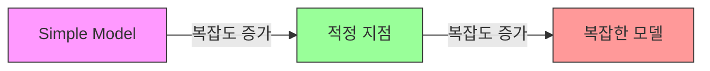
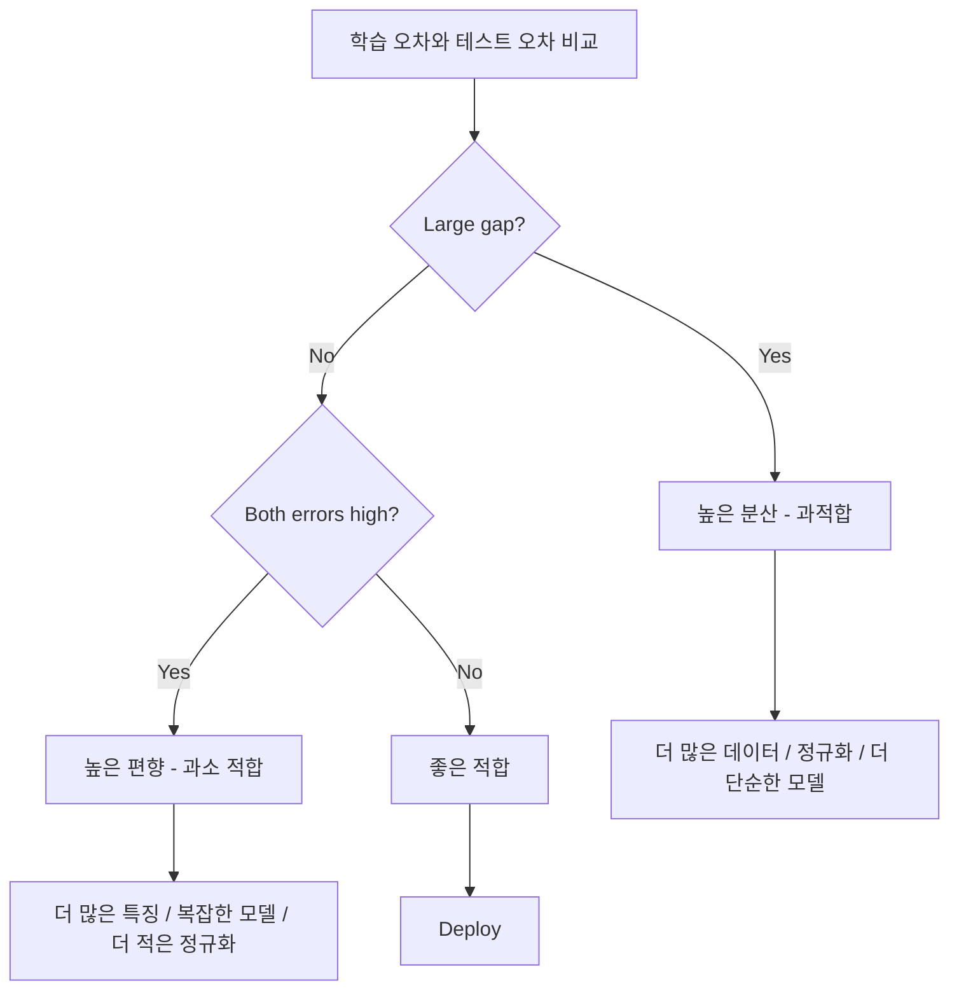
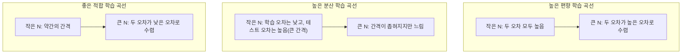
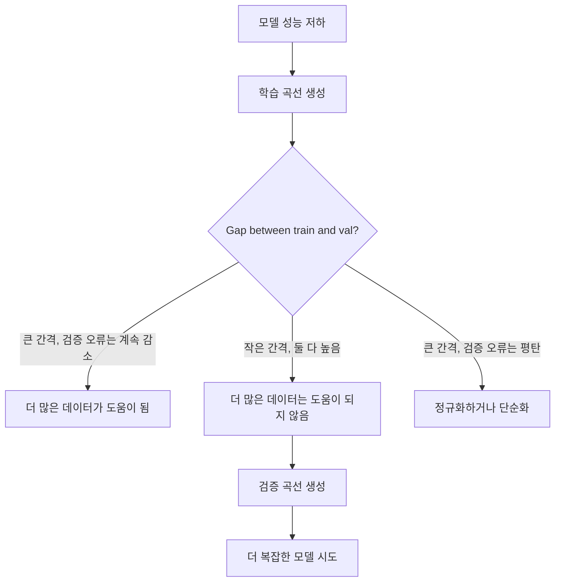

# 편향-분산 트레이드오프

> 모든 모델 오류는 세 가지 원인 중 하나에서 발생합니다: 편향, 분산, 잡음. 첫 두 가지만 제어할 수 있습니다.

**유형:** Learn
**언어:** Python
**선수 요건:** 2단계, 01-09강 (ML 기초, 회귀, 분류, 평가)
**시간:** 약 75분

## 학습 목표

- 예측 오차의 편향-분산 분해를 유도하고, 불가피한 잡음의 역할을 설명해 보세요
- 학습 및 테스트 오차 패턴을 사용하여 모델이 높은 편향이나 높은 분산을 겪고 있는지 진단해 보세요
- 정규화 기법(L1, L2, 드롭아웃, 조기 종료)이 편향과 분산을 어떻게 트레이드오프하는지 설명해 보세요
- 점점 복잡해지는 모델에 걸쳐 편향-분산 트레이드오프를 시각화하는 실험을 구현해 보세요

## 문제점

모델을 학습했습니다. 테스트 데이터에 일부 오차가 있습니다. 그 오차는 어디에서 발생하나요?

모델이 너무 단순하다면(곡선 데이터셋에 선형 회귀를 적용하는 경우), 실제 패턴을 일관되게 놓칠 것입니다. 이것이 편향입니다. 모델이 너무 복잡하다면(15개 데이터 포인트에 대해 20차 다항식을 적용하는 경우), 학습 데이터를 완벽하게 맞추지만 새로운 데이터에서는 극도로 다른 예측을 내놓을 것입니다. 이것이 분산입니다.

고정된 모델 용량으로는 두 가지를 동시에 최소화할 수 없습니다. 편향을 낮추면 분산이 올라갑니다. 분산을 낮추면 편향이 올라갑니다. 이 트레이드오프를 이해하는 것은 머신러닝에서 가장 유용한 진단 기술입니다. 모델을 더 복잡하게 만들지, 덜 복잡하게 만들지, 더 많은 데이터를 가져올지, 더 나은 특징을 엔지니어링할지, 정규화를 더 강하게 할지 약하게 할지 결정하는 데 도움이 됩니다.

## 개념

### 편향: 체계적 오차

편향은 모델의 평균 예측이 실제 값과 얼마나 멀리 떨어져 있는지를 측정합니다. 동일한 분포에서 추출한 여러 다른 학습 세트에 동일한 모델을 학습하고 예측값을 평균냈다면, 편향은 그 평균과 실제 값 사이의 차이입니다.

높은 편향은 모델이 실제 패턴을 포착하기에는 너무 경직되어 있음을 의미합니다. 포물선에 직선을 맞추면, 데이터를 얼마나 많이 주더라도 항상 곡선을 놓칠 것입니다. 이것이 과소 적합(Underfitting)입니다.

```
High bias (underfitting):
  Model always predicts roughly the same wrong thing.
  Training error: HIGH
  Test error: HIGH
  Gap between them: SMALL
```

### 분산: 학습 데이터에 대한 민감도

분산은 서로 다른 데이터 하위 집합으로 학습할 때 예측값이 얼마나 변하는지를 측정합니다. 학습 집합의 작은 변화가 모델의 큰 변화를 유발한다면 분산이 높습니다.

높은 분산은 모델이 학습 데이터의 잡음이 아닌 근본적인 신호를 학습하고 있음을 의미합니다. 20차 다항식은 모든 학습 점을 통과하지만 그 사이에서 극심하게 진동합니다. 이는 과적합입니다.

```
High variance (overfitting):
  Model fits training data perfectly but fails on new data.
  Training error: LOW
  Test error: HIGH
  Gap between them: LARGE
```

### 분해

임의의 점 x에 대해, 제곱 손실 하의 기대 예측 오차는 정확히 다음과 같이 분해됩니다:

```
Expected Error = Bias^2 + Variance + Irreducible Noise

where:
  Bias^2   = (E[f_hat(x)] - f(x))^2
  Variance = E[(f_hat(x) - E[f_hat(x)])^2]
  Noise    = E[(y - f(x))^2]             (sigma^2)
```

- `f(x)`는 참 함수입니다
- `f_hat(x)`는 모델의 예측값입니다
- `E[...]`는 서로 다른 학습 집합에 대한 기대값입니다
- `y`는 관측된 레이블(참 함수 + 잡음)입니다

잡음 항은 줄일 수 없습니다. 잡음이 있는 데이터에서 어떤 모델도 sigma^2보다 좋은 성능을 낼 수 없습니다. bias^2와 variance 사이의 올바른 균형을 찾는 것이 당신의 임무입니다.

### 모델 복잡도와 오차



전형적인 U자형 곡선입니다:

| 복잡도 | 편향 | 분산 | 총 오차 |
|-----------|------|----------|-------------|
| 너무 낮음 | 높음 | 낮음 | 높음 (과소 적합) |
| 적정 | 중간 | 중간 | 최저 |
| 너무 높음 | 낮음 | 높음 | 높음 (과적합) |

### 편향-분산 제어로서의 정규화

정규화는 분산을 줄이기 위해 의도적으로 편향을 증가시킵니다. 모델이 잡음을 쫓지 못하도록 제약합니다.

- **L2 (Ridge):** 모든 가중치를 0으로 수축시킵니다. 모든 특징을 유지하지만 그 영향을 줄입니다.
- **L1 (Lasso):** 일부 가중치를 정확히 0으로 만듭니다. 특징 선택을 수행합니다.
- **Dropout:** 학습 중 뉴런을 무작위로 비활성화합니다. 중복된 표현을 강제합니다.
- **Early stopping:** 모델이 학습 데이터를 완전히 맞추기 전에 학습을 중단합니다.

정규화 강도(lambda, 드롭아웃 비율, 에포크 수)는 편향-분산 곡선에서 어디에 위치하는지를 직접적으로 제어합니다. 정규화가 강해질수록 편향은 커지고 분산은 줄어듭니다.

### 더블 디센트: 현대적 관점

고전적 이론은 다음과 같이 말합니다: 최적 지점(sweet spot) 이후에는 복잡도가 증가할수록 항상 성능이 저하됩니다. 그러나 2019년 이후의 연구는 예상치 못한 현상을 보여 주었습니다. 모델 용량을 보간 임계점(모델이 학습 데이터를 완벽하게 적합할 만큼 충분한 매개변수를 가진 지점)을 훨씬 넘겨서 계속 증가시키면, 테스트 오차가 다시 감소할 수 있습니다.


이 "더블 디센트" 현상은 거대하게 과매개변수화된 신경망(학습 예제 수보다 매개변수 수가 훨씬 많은 경우)이 여전히 잘 일반화되는 이유를 설명합니다. 고전적인 편향-분산 트레이드오프는 틀리지 않았지만, 현대적 환경에서는 불완전합니다.

더블 디센트에 대한 주요 관찰 사항:
- 선형 모델, 결정 트리, 신경망에서 모두 발생합니다
- 보간 영역에서는 더 많은 데이터가 오히려 성능을 해칠 수 있습니다(샘플 단위 더블 디센트)
- 더 많은 학습 에포크도 이를 유발할 수 있습니다(에포크 단위 더블 디센트)
- 정규화는 피크를 부드럽게 만들지만 없애지는 못합니다

왜 이런 일이 발생할까요? 보간 임계점에서 모델은 모든 학습 포인트를 적합할 만큼의 용량을刚刚好 가지고 있습니다. 모든 점을 관통하는 매우 특정한 해로 강제되며, 데이터의 작은 섭동이 적합에 큰 변화를 일으킵니다. 여기서 분산이 최고점에 도달합니다. 임계점을 넘어서면, 모델은 데이터를 완벽하게 적합하는 수많은 가능한 해를 가집니다. 학습 알고리즘(예: 암시적 정규화를 가진 경사 하강법)은 그중 가장 단순한 해를 선택하는 경향이 있습니다. 단순한 해에 대한 이 암시적 편향은 과매개변수화된 모델이 일반화되는 이유입니다.

| 영역 | 매개변수 vs 샘플 | 동작 |
|--------|----------------------|----------|
| 과소 매개변수화 | p << n | 고전적 트레이드오프 적용 |
| 보간 임계점 | p ~ n | 분산이 최고점에 도달하고 테스트 오차가 급증 |
| 과매개변수화 | p >> n | 암시적 정규화가 작동하여 테스트 오차가 감소 |

실용적인 관점에서: 신경망이나 대규모 트리 앙상블을 사용하는 경우, 보간 임계값에서 멈추지 마세요. 명시적인 정규화를 통해 임계값보다 충분히 낮게 유지하거나, 임계값을 충분히 넘어서는 쪽으로 진행하세요. 가장 최악의 위치는 임계값 바로 근처입니다.

### 모델 진단



| 증상 | 진단 | 해결책 |
|---------|-----------|-----|
| 높은 학습 오차, 높은 테스트 오차 | 편향 | 더 많은 특징, 복잡한 모델, 더 적은 정규화 |
| 낮은 학습 오차, 높은 테스트 오차 | 분산 | 더 많은 데이터, 정규화, 더 단순한 모델, 드롭아웃 |
| 낮은 학습 오차, 낮은 테스트 오차 | 좋은 적합 | 출시하기 |
| 학습 오차 감소, 테스트 오차 증가 | 진행 중인 과적합 | 조기 종료 |

### 실용적인 전략

**편향이 문제일 때:**
- 다항식 또는 상호작용 특징 추가
- 더 유연한 모델 사용 (선형 대신 트리 앙상블)
- 정규화 강도 감소
- 더 오래 학습 (아직 수렴하지 않은 경우)

**분산이 문제일 때:**
- 더 많은 학습 데이터 확보
- 배깅 사용 (랜덤 포레스트)
- 정규화 증가 (더 높은 lambda, 더 많은 드롭아웃)
- 특징 선택 (잡음 특징 제거)
- 교차 검증으로 조기 감지

### 앙상블 방법과 분산 감소

앙상블 방법은 분산과 싸우기 위한 가장 실용적인 도구입니다.

**배깅 (부트스트랩 집계)**은 학습 데이터의 서로 다른 부트스트랩 샘플로 여러 모델을 학습한 후, 예측값을 평균냅니다. 각 개별 모델은 높은 분산을 가지지만, 평균은 훨씬 낮은 분산을 가집니다. 랜덤 포레스트는 결정 트리에 배깅을 적용한 것입니다.

수학적으로 작동하는 이유: 분산이 sigma^2인 N개의 독립적인 예측을 평균 내면, 평균의 분산은 sigma^2 / N이 됩니다. 모델들이 완전히 독립적이지는 않습니다(모두 유사한 데이터를 보게 되므로), 따라서 감소폭은 1/N보다 작지만 여전히 상당합니다.

**부스팅(Boosting)**은 앙상블의 현재 오류에 집중하는 방식으로 모델을 순차적으로 구축하여 편향을 줄입니다. Gradient boosting과 AdaBoost가 주요 예시입니다. 부스팅은 모델을 너무 많이 추가하면 과적합될 수 있으므로, 조기 종료(early stopping)나 정규화(regularization)가 필요합니다.

| 방법 | 주요 효과 | 편향 변화 | 분산 변화 |
|--------|---------------|-------------|-----------------|
| 배깅(Bagging) | 분산 감소 | 변화 없음 | 감소 |
| 부스팅(Boosting) | 편향 감소 | 감소 | 증가할 수 있음 |
| 스태킹(Stacking) | 둘 다 감소 | 메타 학습자에 따라 다름 | 기본 모델에 따라 다름 |
| 드롭아웃(Dropout) | 암묵적 배깅 | 약간 증가 | 감소 |

**실용적인 규칙:** 기본 모델의 분산이 높다면(깊은 트리, 고차 다항식) 배깅을 사용하세요. 기본 모델의 편향이 높다면(얕은 스텀프, 단순 선형 모델) 부스팅을 사용하세요.

### 학습 곡선

학습 곡선은 학습 집합 크기의 함수로 학습 및 검증 오차를 플롯합니다. 이는 가장 실용적인 진단 도구입니다. 단일 학습/테스트 비교와 달리, 학습 곡선은 모델의 궤적을 보여주고 더 많은 데이터가 도움이 될지 알려줍니다.



읽는 방법:

| 시나리오 | 학습 오차 | 검증 오차 | 간격 | 의미 | 조치 |
|----------|---------------|-----------------|-----|---------------|------------|
| 높은 편향 | 높음 | 높음 | 작음 | 모델이 패턴을 포착하지 못함 | 더 많은 특징, 복잡한 모델, 더 적은 정규화 |
| 높은 분산 | 낮음 | 높음 | 큼 | 모델이 학습 데이터를 암기함 | 더 많은 데이터, 정규화, 더 단순한 모델 |
| 좋은 적합 | 중간 | 중간 | 작음 | 모델이 잘 일반화됨 | 출시하기 |
| 높은 분산, 개선 중 | 낮음 | 데이터가 늘수록 감소 | 축소 중 | 데이터로 해결 가능한 분산 문제 | 더 많은 데이터 수집 |
| 높은 편향, 평탄 | 높음 | 높고 평탄 | 작고 평탄 | 더 많은 데이터는 도움이 되지 않음 | 모델 아키텍처 변경 |

핵심 통찰: 두 곡선 모두 평탄화(gap)되어 있고 간격이 작지만 두 오류가 모두 높다면, 더 많은 데이터는 무용지물입니다. 더 나은 모델이 필요합니다. 간격이 크고 여전히 축소 중이라면, 더 많은 데이터가 도움이 될 것입니다.

### 학습 곡선 생성 방법

두 가지 접근법이 있습니다:

**접근법 1: 학습 세트 크기를 변경하고, 모델은 고정합니다.** 모델과 하이퍼파라미터를 일정하게 유지합니다. 학습 데이터의 점점 더 큰 하위 집합으로 학습합니다. 각 크기에서 학습 오류와 검증 오류를 측정합니다. 이것이 표준 학습 곡선입니다.

**접근법 2: 모델 복잡도를 변경하고, 데이터는 고정합니다.** 데이터를 일정하게 유지합니다. 복잡도 매개변수(다항식 차수, 트리 깊이, 레이어 수)를 스윕합니다. 각 복잡도에서 학습 오류와 검증 오류를 측정합니다. 이것은 검증 곡선이며 편향-분산 트레이드오프를 직접 보여줍니다.

두 접근법은 서로 보완적입니다. 첫 번째는 더 많은 데이터가 도움이 되는지 알려줍니다. 두 번째는 다른 모델이 도움이 되는지 알려줍니다. 다음 단계에 대한 결정을 내리기 전에 두 접근법을 모두 실행해 보세요.



```figure
bias-variance
```

## 구현하기

`code/bias_variance.py`의 코드는 전체 편향-분산 분해 실험을 실행합니다. 단계별 접근법은 다음과 같습니다.

### 1단계: 알려진 함수로부터 합성 데이터 생성

우리는 `f(x) = sin(1.5x) + 0.5x`에 가우시안 잡음을 사용합니다. 참 함수를 알면 편향과 분산을 정확히 계산할 수 있습니다.

```python
def true_function(x):
    return np.sin(1.5 * x) + 0.5 * x

def generate_data(n_samples=30, noise_std=0.5, x_range=(-3, 3), seed=None):
    rng = np.random.RandomState(seed)
    x = rng.uniform(x_range[0], x_range[1], n_samples)
    y = true_function(x) + rng.normal(0, noise_std, n_samples)
    return x, y
```

### 2단계: 부트스트랩 샘플링 및 다항식 적합

각 다항식 차수에 대해 많은 부트스트랩 훈련 세트를 추출하고, 다항식을 적합하며, 고정된 테스트 그리드에서의 예측을 기록합니다. 이를 통해 각 테스트 포인트에서 예측의 분포를 얻을 수 있습니다.

```python
def fit_polynomial(x_train, y_train, degree, lam=0.0):
    X = np.column_stack([x_train ** d for d in range(degree + 1)])
    if lam > 0:
        penalty = lam * np.eye(X.shape[1])
        penalty[0, 0] = 0
        w = np.linalg.solve(X.T @ X + penalty, X.T @ y_train)
    else:
        w = np.linalg.lstsq(X, y_train, rcond=None)[0]
    return w
```

우리는 200개의 서로 다른 부트스트랩 샘플에 대해 적합합니다. 각 부트스트랩 샘플은 동일한 기본 분포에서 추출되지만 서로 다른 포인트를 포함합니다.

### 3단계: 편향^2, 분산 분해 계산

각 테스트 포인트에서 200세트의 예측을 사용하면 정의로부터 분해를 직접 계산할 수 있습니다:

```python
mean_pred = predictions.mean(axis=0)
bias_sq = np.mean((mean_pred - y_true) ** 2)
variance = np.mean(predictions.var(axis=0))
total_error = np.mean(np.mean((predictions - y_true) ** 2, axis=1))
```

- `mean_pred`는 부트스트랩 샘플로부터 추정된 E[f_hat(x)]입니다
- `bias_sq`는 평균 예측과 참값 사이의 제곱된 격차입니다
- `variance`는 부트스트랩 샘플 전반에 걸친 예측의 평균 산포입니다
- `total_error`는 편향^2 + 분산 + 잡음과 대략적으로 같아야 합니다

### 4단계: 학습 곡선

학습 곡선은 모델 복잡도를 고정하면서 훈련 세트 크기를 변화시킵니다. 이를 통해 모델이 데이터에 의해 제한되는지 용량에 의해 제한되는지 확인할 수 있습니다.

```python
def demo_learning_curves():
    sizes = [10, 15, 20, 30, 50, 75, 100, 150, 200, 300]
    degree = 5

    for n in sizes:
        train_errors = []
        test_errors = []
        for seed in range(50):
            x_train, y_train = generate_data(n_samples=n, seed=seed * 100)
            w = fit_polynomial(x_train, y_train, degree)
            train_pred = predict_polynomial(x_train, w)
            train_mse = np.mean((train_pred - y_train) ** 2)
            test_pred = predict_polynomial(x_test, w)
            test_mse = np.mean((test_pred - y_test) ** 2)
            train_errors.append(train_mse)
            test_errors.append(test_mse)
        # 실행에 대한 평균이 학습 곡선 포인트를 제공합니다
```

고분산 모델(소규모 데이터의 차수 5)의 경우 다음을 볼 수 있습니다:
- 훈련 오차는 낮게 시작하며, 더 많은 데이터가 암기를 어렵게 만들면서 증가합니다
- 테스트 오차는 높게 시작하며, 모델이 더 많은 신호를 받으면서 감소합니다
- 더 많은 데이터가 있을수록 격차가 줄어듭니다

고편향 모델(차수 1)의 경우, 두 오차 모두 빠르게 동일한 높은 값으로 수렴하며 더 많은 데이터는 도움이 되지 않습니다.

### 5단계: 정규화 스윕

이 코드에는 `demo_regularization_sweep()`도 포함되어 있으며, 이는 고차 다항식(차수 15)을 고정하고 Ridge 정규화 강도를 0.001에서 100까지 스윕합니다. 이는 편향-분산 트레이드오프를 다른 관점에서 보여줍니다: 모델 복잡도를 변화시키는 대신 제약 강도를 변화시킵니다.

```python
def demo_regularization_sweep():
    alphas = [0.001, 0.005, 0.01, 0.05, 0.1, 0.5, 1.0, 5.0, 10.0, 50.0, 100.0]
    for alpha in alphas:
        results = bias_variance_decomposition([15], lam=alpha)
        r = results[15]
        print(f"alpha={alpha:.3f}  bias={r['bias_sq']:.4f}  var={r['variance']:.4f}")
```

알파(alpha)가 낮으면 15차 다항식은 거의 제약이 없습니다. 모델이 각 부트스트랩 샘플의 잡음을 쫓기 때문에 분산이 지배적입니다. 알파가 높으면 페널티가 매우 강해져 모델이 사실상 거의 상수 함수가 됩니다. 편향이 지배적입니다. 최적의 알파는 이 두 극단 사이에 위치합니다.

이는 다항식 차수를 변경할 때 나타나는 것과 동일한 U자형 곡선이지만, 이산적인 값이 아닌 연속적인 조절 변수로 제어됩니다. 실제로는 정규화가 트레이드오프를 제어하는 데 선호되는 방법입니다. 이는 기능 집합을 변경하지 않고도 세밀한 제어를 가능하게 하기 때문입니다.

## 사용하기

sklearn은 부트스트랩 루프를 작성하지 않고도 이러한 진단을 자동화하기 위해 `learning_curve` 및 `validation_curve`을 제공합니다.

### 검증 곡선: 모델 복잡도 스윕

```python
from sklearn.model_selection import validation_curve
from sklearn.pipeline import make_pipeline
from sklearn.preprocessing import PolynomialFeatures
from sklearn.linear_model import Ridge

degrees = list(range(1, 16))
train_scores_all = []
val_scores_all = []

for d in degrees:
    pipe = make_pipeline(PolynomialFeatures(d), Ridge(alpha=0.01))
    train_scores, val_scores = validation_curve(
        pipe, X, y, param_name="polynomialfeatures__degree",
        param_range=[d], cv=5, scoring="neg_mean_squared_error"
    )
    train_scores_all.append(-train_scores.mean())
    val_scores_all.append(-val_scores.mean())
```

이것은 편향-분산 트레이드오프 곡선을 직접 제공합니다. 학습 점수에 비해 검증 점수가 가장 나쁜 곳에서는 분산이 지배적입니다. 둘 다 나쁜 곳에서는 편향이 지배적입니다.

### 학습 곡선: 학습 세트 크기 스윕

```python
from sklearn.model_selection import learning_curve

pipe = make_pipeline(PolynomialFeatures(5), Ridge(alpha=0.01))
train_sizes, train_scores, val_scores = learning_curve(
    pipe, X, y, train_sizes=np.linspace(0.1, 1.0, 10),
    cv=5, scoring="neg_mean_squared_error"
)
train_mse = -train_scores.mean(axis=1)
val_mse = -val_scores.mean(axis=1)
```

`train_mse` 및 `val_mse`을 `train_sizes`에 대해 플롯하세요. 곡선의 형태는 모델에 대한 모든 것을 알려줍니다.

### 정규화 스윕을 포함한 교차 검증

```python
from sklearn.model_selection import cross_val_score

alphas = [0.001, 0.01, 0.1, 1.0, 10.0, 100.0]
for alpha in alphas:
    pipe = make_pipeline(PolynomialFeatures(10), Ridge(alpha=alpha))
    scores = cross_val_score(pipe, X, y, cv=5, scoring="neg_mean_squared_error")
    print(f"alpha={alpha:>7.3f}  MSE={-scores.mean():.4f} +/- {scores.std():.4f}")
```

이것은 고정된 모델 복잡도에 대해 정규화 강도를 스윕합니다. 동일한 편향-분산 트레이드오프를 볼 수 있습니다. 낮은 알파는 높은 분산을, 높은 알파는 높은 편향을 의미합니다.

### 모두 통합하기: 완전한 진단 워크플로

실제로는 이러한 진단을 순차적으로 실행합니다:

1. 모델을 학습합니다. 학습 및 테스트 오차를 계산합니다.
2. 둘 다 높다면: 편향 문제가 있습니다. 4단계로 건너뛰세요.
3. 학습 오차는 낮지만 테스트 오차가 높다면: 분산 문제가 있습니다. 더 많은 데이터가 도움이 되는지 확인하기 위해 학습 곡선을 생성하세요. 도움이 되지 않는다면 정규화하세요.
4. 주요 복잡도 매개변수를 스윕하는 검증 곡선을 생성하세요. 최적점을 찾으세요.
5. 최적점에서 학습 곡선을 생성하세요. 간격이 여전히 크다면 더 많은 데이터나 정규화가 필요합니다.
6. `cross_val_score`을 사용하여 Ridge/Lasso를 다양한 알파 값으로 시도하세요. 교차 검증 오차가 가장 낮은 알파를 선택하세요.

대부분의 표 데이터셋에서는 10-15분의 컴퓨팅 시간이 소요되며, 몇 시간의 추측을 절약할 수 있습니다.

## 출시하기

이 강의에서 생성되는 결과물: `outputs/prompt-model-diagnostics.md`

## 연습 문제

1. `noise_std=0`로 분해를 실행해 보세요 (잡음 없음). 비가소적 오차 항에는 어떤 변화가 일어나나요? 최적의 복잡도가 변하나요?

2. 학습 집합의 크기를 30에서 300으로 늘려 보세요. 이것이 분산 성분에 어떤 영향을 미치나요? 최적의 다항식 차수가 변하나요?

3. 실험에 L2 정규화(리지 회귀)를 추가해 보세요. 고정된 고차 다항식(15차)에 대해 lambda를 0에서 100까지 스윕해 보세요. lambda의 함수로서 bias^2와 분산을 그래프로 그려 보세요.

4. 참(true) 함수를 다항식에서 `sin(x)`로 변경해 보세요. 편차-분산 분해는 어떻게 변하나요? 여전히 명확한 최적 차수가 있나요?

5. 간단한 부트스트랩 집계(bagging) 래퍼를 구현해 보세요: 부트스트랩 샘플로 10개 모델을 학습하고 예측값을 평균내세요. 이것이 편차를 크게 증가시키지 않으면서 분산을 줄인다는 것을 보여주세요.

## 핵심 용어

| 용어 | 사람들이 말하는 것 | 실제 의미 |
|------|----------------|----------------------|
| 편차(Bias) | "모델이 너무 단순하다" | 잘못된 가정에 의한 체계적 오차. 평균 모델 예측값과 참값 사이의 간격. |
| 분산(Variance) | "모델이 과적합하고 있다" | 학습 데이터에 대한 민감도로 인한 오차. 서로 다른 학습 집합에서 예측값이 얼마나 변하는지. |
| 비가소적 오차(Irreducible error) | "데이터의 잡음" | 참 데이터 생성 과정의 무작위성으로 인한 오차. 어떤 모델도 이를 제거할 수 없습니다. |
| 과소 적합(Underfitting) | "충분히 학습하지 못함" | 모델의 편차가 높습니다. 학습 데이터에서도 실제 패턴을 놓칩니다. |
| 과적합(Overfitting) | "데이터를 암기함" | 모델의 분산이 높습니다. 일반화되지 않는 학습 데이터의 잡음에 맞춰집니다. |
| 정규화(Regularization) | "모델을 제약함" | 모델 복잡도를 줄이기 위해 페널티를 추가하여, 편차를 대가로 분산을 낮추는 것. |
| 이중 하강(Double descent) | "더 많은 매개변수가 도움이 될 수 있음" | 모델 용량이 보간 임계값을 크게 초과할 때 테스트 오차가 다시 감소하는 현상. |
| 모델 복잡도(Model complexity) | "모델이 얼마나 유연한가" | 임의의 패턴을 맞추는 모델의 용량. 아키텍처, 특징(feature), 또는 정규화로 제어됩니다. |

## 추가 읽기

- [Hastie, Tibshirani, Friedman: Elements of Statistical Learning, Ch. 7](https://hastie.su.domains/ElemStatLearn/) -- 편차-분산 분해에 대한 결정적인 자료
- [Belkin et al., Reconciling modern machine learning practice and the bias-variance trade-off (2019)](https://arxiv.org/abs/1812.11118) -- 이중 하강(double descent) 논문
- [Nakkiran et al., Deep Double Descent (2019)](https://arxiv.org/abs/1912.02292) -- 에포크 단위 및 샘플 단위 이중 하강(double descent)
- [Scott Fortmann-Roe: Understanding the Bias-Variance Tradeoff](http://scott.fortmann-roe.com/docs/BiasVariance.html) -- 명확한 시각적 설명
