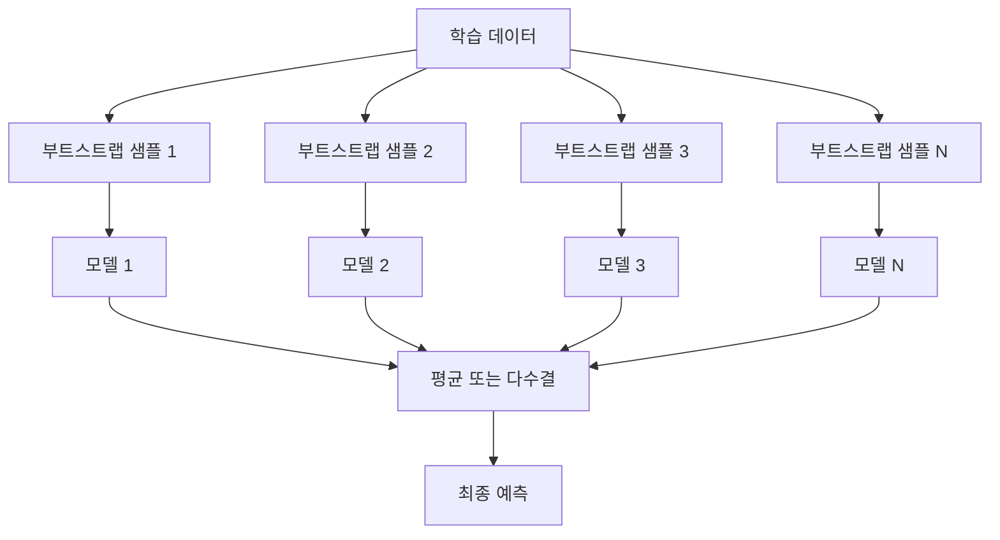
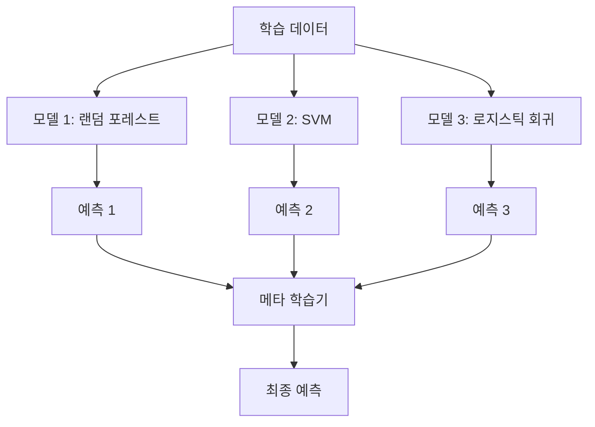

# 앙상블 방법 (Ensemble Methods)

> 약한 학습기(weak learner)들을 올바르게 합치면 강한 학습기가 됩니다. 비유가 아닙니다. 정리(theorem)입니다.

**Type:** Build
**Language:** Python
**Prerequisites:** Phase 2, Lesson 10 (Bias-Variance Tradeoff)
**Time:** ~120 minutes

## 학습 목표 (Learning Objectives)

- AdaBoost와 그래디언트 부스팅(gradient boosting)을 처음부터 구현하고, 부스팅이 순차적으로 편향을 어떻게 줄이는지 설명합니다
- 배깅(bagging) 앙상블을 만들고, 상관관계가 낮은 모델들의 평균이 편향을 크게 늘리지 않으면서 분산을 줄이는 것을 보입니다
- 배깅, 부스팅, 스태킹(stacking)이 각각 어떤 오차 성분을 겨냥하는지 비교합니다
- 앙상블 다양성(diversity)을 평가하고, 독립적인 약한 학습기가 많을수록 다수결 투표 정확도가 왜 올라가는지 설명합니다

## 문제 상황 (The Problem)

단일 결정 트리는 학습이 빠르고 해석하기 쉽지만 과적합합니다. 단일 선형 모델은 복잡한 경계에서 과소적합합니다. 완벽한 모델 아키텍처를 설계하는 데 며칠을 쓸 수도 있습니다. 아니면 불완전한 모델 여러 개를 합쳐 개별적으로보다 더 나은 결과를 얻을 수도 있습니다.

앙상블 방법이 바로 이것입니다. 표 형식(tabular) 데이터 Kaggle 대회에서 가장 믿을 만한 기법이고, 대부분 프로덕션 ML 시스템의 동력이며, 편향-분산 트레이드오프가 실제로 어떻게 작동하는지 보여 줍니다. 배깅은 분산을 줄입니다. 부스팅은 편향을 줄입니다. 스태킹은 어떤 입력에서 어떤 모델을 믿을지 학습합니다.

## 핵심 개념 (The Concept)

### 앙상블이 작동하는 이유

독립적인 분류기 N개가 있고, 각각 정확도 p > 0.5라고 합시다. 다수결 투표의 정확도는 다음과 같습니다:

```
P(majority correct) = sum over k > N/2 of C(N,k) * p^k * (1-p)^(N-k)
```

각각 60% 정확도인 분류기 21개의 다수결은 약 74%입니다. 101개면 약 84%까지 올라갑니다. 모델들이 서로 다른 실수를 하면 오차가 상쇄됩니다.

핵심 조건은 **다양성(diversity)** 입니다. 모든 모델이 같은 실수를 하면 합쳐도 도움이 없습니다. 앙상블이 통하는 이유는 다음과 같이 다양한 모델을 만들기 때문입니다:

- 서로 다른 학습 부분 집합 (배깅)
- 서로 다른 특성 부분 집합 (랜덤 포레스트)
- 순차적 오차 보정 (부스팅)
- 서로 다른 모델 계열 (스태킹)

### 배깅 (Bootstrap Aggregating)

배깅은 학습 데이터의 서로 다른 부트스트랩(bootstrap) 샘플로 각 모델을 학습해 다양성을 만듭니다.



부트스트랩 샘플은 원본과 같은 크기로, 복원 추출합니다. 각 부트스트랩에는 고유 샘플의 약 63.2%가 들어갑니다. 나머지 36.8%(OOB, out-of-bag 샘플)는 무료 검증 세트 역할을 합니다.

배깅은 편향을 크게 늘리지 않으면서 분산을 줄입니다. 개별 트리는 자신의 부트스트랩에 과적합하지만, 과적합 패턴이 트리마다 달라서 평균하면 노이즈가 상쇄됩니다.

**랜덤 포레스트(Random Forests)** 는 배깅에 한 가지를 더합니다. 각 분할에서 특성의 무작위 부분 집합만 고려합니다. 트리 간 다양성이 더 커집니다. 후보 특성 수는 보통 분류에서 `sqrt(n_features)`, 회귀에서 `n_features / 3`입니다.

### 부스팅 (Sequential Error Correction)

부스팅은 모델을 순차적으로 학습합니다. 새 모델은 이전 모델들이 틀린 예에 집중합니다.


부스팅은 편향을 줄입니다. 새 모델이 지금까지 앙상블의 체계적 오차를 보정합니다. 최종 예측은 모든 모델의 가중 합이며, 더 좋은 모델에 더 큰 가중치가 갑니다.

트레이드오프: 라운드를 너무 많이 돌리면 부스팅도 과적합할 수 있습니다. 점점 더 어려운(그중 일부는 노이즈일 수 있는) 예에 맞추기 때문입니다.

### AdaBoost

AdaBoost(Adaptive Boosting)는 최초의 실용적 부스팅 알고리즘입니다. 어떤 베이스 학습기와도 쓸 수 있고, 보통 결정 스텀프(decision stump, 깊이 1 트리)를 씁니다.

알고리즘:

```
1. Initialize sample weights: w_i = 1/N for all i

2. For t = 1 to T:
   a. Train weak learner h_t on weighted data
   b. Compute weighted error:
      err_t = sum(w_i * I(h_t(x_i) != y_i)) / sum(w_i)
   c. Compute model weight:
      alpha_t = 0.5 * ln((1 - err_t) / err_t)
   d. Update sample weights:
      w_i = w_i * exp(-alpha_t * y_i * h_t(x_i))
   e. Normalize weights to sum to 1

3. Final prediction: H(x) = sign(sum(alpha_t * h_t(x)))
```

오차가 낮은 모델일수록 alpha가 큽니다. 오분류된 샘플은 가중치가 커져 다음 모델이 그것에 집중합니다.

### 그래디언트 부스팅 (Gradient Boosting)

그래디언트 부스팅은 임의의 손실 함수로 부스팅을 일반화합니다. 샘플을 다시 가중하지 않고, 현재 앙상블의 잔차(residuals, 손실의 음수 기울기)에 새 모델을 맞춥니다.

```
1. Initialize: F_0(x) = argmin_c sum(L(y_i, c))

2. For t = 1 to T:
   a. Compute pseudo-residuals:
      r_i = -dL(y_i, F_{t-1}(x_i)) / dF_{t-1}(x_i)
   b. Fit a tree h_t to the residuals r_i
   c. Find optimal step size:
      gamma_t = argmin_gamma sum(L(y_i, F_{t-1}(x_i) + gamma * h_t(x_i)))
   d. Update:
      F_t(x) = F_{t-1}(x) + learning_rate * gamma_t * h_t(x)

3. Final prediction: F_T(x)
```

제곱 오차 손실에서는 의사 잔차(pseudo-residuals)가 바로 실제 잔차입니다: `r_i = y_i - F_{t-1}(x_i)`. 각 트리는 말 그대로 이전 앙상블의 오차에 맞춥니다.

학습률(learning rate, shrinkage)은 각 트리가 얼마나 기여할지 제어합니다. 학습률이 작을수록 트리가 더 필요하지만 일반화가 더 좋습니다. 전형값: 0.01~0.3.

### XGBoost: 표 형식 데이터에서 강한 이유

XGBoost(eXtreme Gradient Boosting)는 그래디언트 부스팅에 공학적 최적화를 더한 것으로, 빠르고 정확하며 과적합에 강합니다:

- **정규화된 목적함수:** 리프 가중치에 L1·L2 페널티를 걸어 개별 트리가 너무 자신만만해지지 않게 함
- **2차 근사:** 손실의 1차·2차 미분을 모두 써서 분할 결정을 더 잘함
- **희소성 인식 분할:** 결측값을 네이티브로 처리하고, 각 분할에서 결측의 최적 방향을 학습
- **열 서브샘플링:** 랜덤 포레스트처럼 분할마다 특성을 샘플링해 다양성 확보
- **가중 분위수 스케치:** 분산 데이터에서 연속 특성의 분할점을 효율적으로 찾음
- **캐시 인식 블록 구조:** CPU 캐시 라인에 맞춘 메모리 레이아웃

표 형식 데이터에서는 XGBoost(및 후속 LightGBM)가 신경망을 꾸준히 이깁니다. 당분간 바뀔 가능성은 낮습니다. 데이터가 행·열 표에 들어간다면 그래디언트 부스팅부터 시작하세요.

### 스태킹 (Meta-Learning)

스태킹은 여러 베이스 모델의 예측을 메타 학습기(meta-learner)의 특성으로 씁니다.



메타 학습기는 어떤 입력에서 어떤 베이스 모델을 믿을지 학습합니다. 어떤 영역에서는 랜덤 포레스트가, 다른 영역에서는 SVM이 더 나으면 그에 맞게 라우팅합니다.

데이터 누수(data leakage)를 막으려면 베이스 모델 예측은 학습 세트에 대한 교차 검증으로 만들어야 합니다. 같은 데이터로 베이스를 학습하고 메타 특성을 동시에 만들지 마세요.

### 투표 (Voting)

가장 단순한 앙상블입니다. 예측을 바로 합칩니다.

- **하드 투표(Hard voting):** 클래스 라벨에 대한 다수결.
- **소프트 투표(Soft voting):** 예측 확률을 평균하고 평균 확률이 가장 높은 클래스를 고름. 신뢰도 정보를 쓰므로 보통 더 낫습니다.

```figure
f3-ensemble-average
```

## 직접 구현하기 (Build It)

### 1단계: 결정 스텀프 (베이스 학습기)

`code/ensembles.py`의 코드가 모든 것을 처음부터 구현합니다. 단일 분할을 가진 트리인 결정 스텀프부터 시작합니다.

```python
class DecisionStump:
    def __init__(self):
        self.feature_idx = None
        self.threshold = None
        self.polarity = 1
        self.alpha = None

    def fit(self, X, y, weights):
        n_samples, n_features = X.shape
        best_error = float("inf")

        for f in range(n_features):
            thresholds = np.unique(X[:, f])
            for thresh in thresholds:
                for polarity in [1, -1]:
                    pred = np.ones(n_samples)
                    pred[polarity * X[:, f] < polarity * thresh] = -1
                    error = np.sum(weights[pred != y])
                    if error < best_error:
                        best_error = error
                        self.feature_idx = f
                        self.threshold = thresh
                        self.polarity = polarity

    def predict(self, X):
        n = X.shape[0]
        pred = np.ones(n)
        idx = self.polarity * X[:, self.feature_idx] < self.polarity * self.threshold
        pred[idx] = -1
        return pred
```

### 2단계: AdaBoost를 처음부터

```python
class AdaBoostScratch:
    def __init__(self, n_estimators=50):
        self.n_estimators = n_estimators
        self.stumps = []
        self.alphas = []

    def fit(self, X, y):
        n = X.shape[0]
        weights = np.full(n, 1 / n)

        for _ in range(self.n_estimators):
            stump = DecisionStump()
            stump.fit(X, y, weights)
            pred = stump.predict(X)

            err = np.sum(weights[pred != y])
            err = np.clip(err, 1e-10, 1 - 1e-10)

            alpha = 0.5 * np.log((1 - err) / err)
            weights *= np.exp(-alpha * y * pred)
            weights /= weights.sum()

            stump.alpha = alpha
            self.stumps.append(stump)
            self.alphas.append(alpha)

    def predict(self, X):
        total = sum(a * s.predict(X) for a, s in zip(self.alphas, self.stumps))
        return np.sign(total)
```

### 3단계: 그래디언트 부스팅을 처음부터

```python
class GradientBoostingScratch:
    def __init__(self, n_estimators=100, learning_rate=0.1, max_depth=3):
        self.n_estimators = n_estimators
        self.lr = learning_rate
        self.max_depth = max_depth
        self.trees = []
        self.initial_pred = None

    def fit(self, X, y):
        self.initial_pred = np.mean(y)
        current_pred = np.full(len(y), self.initial_pred)

        for _ in range(self.n_estimators):
            residuals = y - current_pred
            tree = SimpleRegressionTree(max_depth=self.max_depth)
            tree.fit(X, residuals)
            update = tree.predict(X)
            current_pred += self.lr * update
            self.trees.append(tree)

    def predict(self, X):
        pred = np.full(X.shape[0], self.initial_pred)
        for tree in self.trees:
            pred += self.lr * tree.predict(X)
        return pred
```

### 4단계: sklearn과 비교

코드는 처음부터 구현한 결과가 sklearn의 `AdaBoostClassifier`·`GradientBoostingClassifier`와 비슷한 정확도를 내는지 확인하고, 모든 방법을 나란히 비교합니다.

## 활용하기 (Use It)

### 방법별 사용 시점

| Method | Reduces | Best for | Watch out for |
|--------|---------|----------|---------------|
| Bagging / Random Forest | Variance | Noisy data, many features | Does not help with bias |
| AdaBoost | Bias | Clean data, simple base learners | Sensitive to outliers and noise |
| Gradient Boosting | Bias | Tabular data, competitions | Slow to train, easy to overfit without tuning |
| XGBoost / LightGBM | Both | Production tabular ML | Many hyperparameters |
| Stacking | Both | Getting last 1-2% accuracy | Complex, risk of overfitting meta-learner |
| Voting | Variance | Quick combination of diverse models | Only helps if models are diverse |

### 표 형식 데이터용 프로덕션 스택

대부분 표 형식 예측 문제에서는 이 순서로 시도합니다:

1. **LightGBM 또는 XGBoost** 기본 파라미터
2. n_estimators, learning_rate, max_depth, min_child_weight 튜닝
3. 마지막 0.5%가 필요하면 서로 다른 모델 3~5개로 스태킹 앙상블
4. 전 과정에서 교차 검증 사용

표 형식 데이터에서 신경망은 연구 시도가 이어져도 거의 항상 그래디언트 부스팅보다 못합니다. TabNet, NODE 같은 아키텍처가 가끔 따라잡지만, 잘 튜닝된 XGBoost를 이기는 경우는 드뭅니다.

## 산출물 내보내기 (Ship It)

이 레슨은 `outputs/prompt-ensemble-selector.md`를 만듭니다. 주어진 데이터셋에 맞는 앙상블 방법을 고르는 프롬프트입니다. 데이터(크기, 특성 유형, 노이즈 수준, 클래스 균형)와 풀려는 문제를 설명하면, 결정 체크리스트를 따라 방법을 추천하고, 시작 하이퍼파라미터를 제안하며, 그 방법의 흔한 실수를 경고합니다. 전체 선택 가이드는 `outputs/skill-ensemble-builder.md`에도 있습니다.

## 연습 문제 (Exercises)

1. AdaBoost 구현을 수정해 라운드마다 학습 정확도를 추적하세요. 정확도 vs. estimator 수 그래프를 그리세요. 언제 수렴하나요?

2. 회귀 트리에 무작위 특성 서브샘플링을 더해 랜덤 포레스트를 처음부터 구현하세요. `max_features=sqrt(n_features)`로 트리 100개를 학습하고 예측을 평균하세요. 단일 트리 대비 분산 감소를 비교하세요.

3. 그래디언트 부스팅 구현에 early stopping을 추가하세요. 라운드마다 검증 손실을 추적하고, 연속 10라운드 개선이 없으면 멈춥니다. 실제로 트리가 몇 개나 필요한가요?

4. 베이스 모델 세 개(로지스틱 회귀, 결정 트리, k-최근접 이웃)와 로지스틱 회귀 메타 학습기로 스태킹 앙상블을 만드세요. 메타 특성은 5-fold 교차 검증으로 생성하세요. 각 베이스 단독과 비교하세요.

5. 같은 데이터셋에 기본 파라미터 XGBoost를 돌리세요. 처음부터 구현한 그래디언트 부스팅과 정확도를 비교하고, 둘 다 시간을 재세요. 속도 차이는 얼마나 큰가요?

## 핵심 용어 (Key Terms)

| Term | What people say | What it actually means |
|------|----------------|----------------------|
| Bagging | "Train on random subsets" | Bootstrap aggregating: train models on bootstrap samples, average predictions to reduce variance |
| Boosting | "Focus on hard examples" | Train models sequentially, each correcting errors of the ensemble so far, to reduce bias |
| AdaBoost | "Reweight the data" | Boosting via sample weight updates; misclassified points get higher weight for the next learner |
| Gradient boosting | "Fit the residuals" | Boosting via fitting each new model to the negative gradient of the loss function |
| XGBoost | "The Kaggle weapon" | Gradient boosting with regularization, second-order optimization, and systems-level speed tricks |
| Stacking | "Models on top of models" | Use predictions of base models as input features for a meta-learner |
| Random forest | "Many randomized trees" | Bagging with decision trees, adding random feature subsampling at each split for diversity |
| Ensemble diversity | "Make different mistakes" | Models must be uncorrelated in their errors for the ensemble to improve over individuals |
| Out-of-bag error | "Free validation" | Samples not in a bootstrap draw (~36.8%) serve as a validation set without needing a holdout |

## 더 읽어보기 (Further Reading)

- [Schapire & Freund: Boosting: Foundations and Algorithms](https://mitpress.mit.edu/9780262526036/) -- AdaBoost 창시자들의 책
- [Friedman: Greedy Function Approximation: A Gradient Boosting Machine (2001)](https://statweb.stanford.edu/~jhf/ftp/trebst.pdf) -- 원본 그래디언트 부스팅 논문
- [Chen & Guestrin: XGBoost (2016)](https://arxiv.org/abs/1603.02754) -- XGBoost 논문
- [Wolpert: Stacked Generalization (1992)](https://www.sciencedirect.com/science/article/abs/pii/S0893608005800231) -- 원본 스태킹 논문
- [scikit-learn Ensemble Methods](https://scikit-learn.org/stable/modules/ensemble.html) -- 실무 참고
