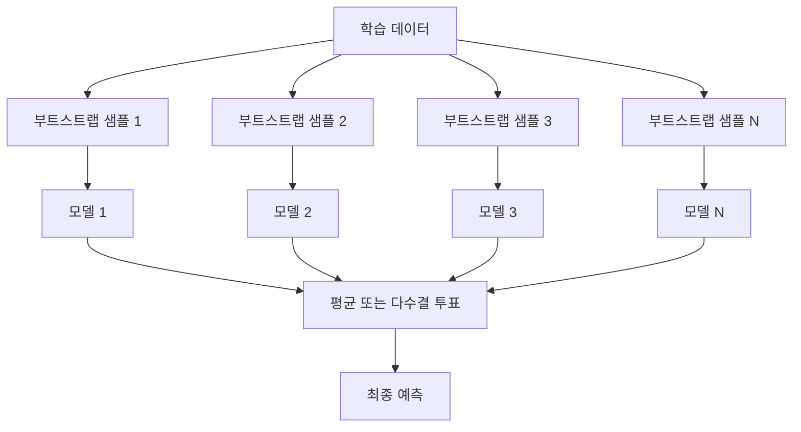

# 앙상블 기법

> 약한 학습자 그룹을 올바르게 결합하면 강한 학습자가 됩니다. 이는 비유가 아닙니다. 이는 정리입니다.

**유형:** Build
**언어:** Python
**선수 요건:** 2단계, 10강 (편향-분산 트레이드오프)
**시간:** 약 120분

## 학습 목표

- AdaBoost와 그래디언트 부스팅을 처음부터 구현하고, 부스팅이 편향을 순차적으로 줄이는 방식을 설명해 보세요
- 배깅 앙상블을 구축하고, 상관이 없는 모델들의 평균이 편향을 증가시키지 않으면서 분산을 줄이는 방식을 시연해 보세요
- 배깅, 부스팅, 스태킹이 각각 어떤 오차 요소를 목표로 하는지 비교해 보세요
- 앙상블 다양성을 평가하고, 더 많은 독립적인 약한 학습자가 있을 때 다수결 정확도가 향상되는 이유를 설명해 보세요

## 문제점

단일 결정 트리는 학습이 빠르고 해석이 쉽지만, 과적합됩니다. 단일 선형 모델은 복잡한 경계에서 과소 적합됩니다. 완벽한 모델 아키텍처를 설계하는 데 며칠을 보낼 수도 있습니다. 또는 여러 불완전한 모델을 결합하여 각각의 모델보다 더 나은 결과를 얻을 수도 있습니다.

앙상블 기법은 정확히 이 역할을 수행합니다. 이는 테이블 데이터 Kaggle 대회에서 우승하기 위한 가장 신뢰할 수 있는 기법이며, 대부분의 프로덕션 ML 시스템을 구동하며, 편향-분산 트레이드오프가 작동하는 방식을 보여줍니다. 배깅은 분산을 줄입니다. 부스팅은 편향을 줄입니다. 스태킹은 어떤 입력에 대해 어떤 모델을 신뢰해야 하는지 학습합니다.

## 개념

### 앙상블이 작동하는 이유

N개의 독립적인 분류기가 있고, 각각의 정확도가 p > 0.5라고 가정해 보세요. 다수결의 정확도는 다음과 같습니다:

```
P(majority correct) = sum over k > N/2 of C(N,k) * p^k * (1-p)^(N-k)
```

각각 60%의 정확도를 가진 21개의 분류기가 있을 경우, 다수결 정확도는 약 74%입니다. 101개의 분류기가 있을 경우, 이는 84%로 상승합니다. 모델들이 서로 다른 실수를 할 때 오차가 상쇄됩니다.

핵심 요구 사항은 **다양성**입니다. 모든 모델이 동일한 실수를 한다면, 결합해도 도움이 되지 않습니다. 앙상블이 작동하는 이유는 다음과 같은 방식으로 다양한 모델을 생성하기 때문입니다:

- 서로 다른 학습 하위 집합 (배깅)
- 서로 다른 특징 하위 집합 (랜덤 포레스트)
- 순차적 오차 수정 (부스팅)
- 다양한 모델 계열 (스태킹)

### 배깅 (부트스트랩 집계)

배깅은 학습 데이터의 서로 다른 부트스트랩 샘플로 각 모델을 학습하여 다양성을 생성합니다.



부트스트랩 샘플은 원본 데이터에서 복원 추출로, 원본과 동일한 크기로 생성됩니다. 각 부트스트랩에는 고유 샘플의 약 63.2%가 포함됩니다. 나머지 36.8% (아웃오브백 샘플)는 무료 검증 세트 역할을 합니다.

배깅은 편향을 크게 증가시키지 않으면서 분산을 줄입니다. 각 개별 트리는 자신의 부트스트랩 샘플에 과적합되지만, 트리마다 과적합 양상이 다르므로 평균화하면 노이즈가 상쇄됩니다.

**랜덤 포레스트**는 배깅에 추가적인 변형을 가한 것입니다. 각 분할 시 랜덤한 하위 집합의 특징만 고려합니다. 이는 트리 간에 더 많은 다양성을 강제합니다. 분류의 경우 후보 특징의 전형적인 개수는 `sqrt(n_features)`이고, 회귀의 경우 `n_features / 3`입니다.

### 부스팅 (순차적 오류 수정)

부스팅은 모델을 순차적으로 학습합니다. 각 새 모델은 이전 모델이 잘못 예측한 예시에 집중합니다.


부스팅은 편향을 줄입니다. 각 새 모델은 현재까지의 앙상블이 가진 체계적 오류를 수정합니다. 최종 예측은 모든 모델의 가중 합이며, 더 좋은 모델일수록 더 높은 가중치를 받습니다.

상충 관계: 부스팅은 너무 많은 라운드를 실행하면 과적합될 수 있습니다. 더 어려운 예시에 계속 맞추기 때문이며, 그중 일부는 노이즈일 수 있습니다.

### AdaBoost

AdaBoost (Adaptive Boosting)는 최초의 실용적인 부스팅 알고리즘입니다. 모든 기본 학습기와 함께 작동하며, 일반적으로 결정 스텀프(depth-1 tree)를 사용합니다.

알고리즘:

```
1. Initialize sample weights: w_i = 1/N for all i

2. For t = 1 to T:
   a. Train weak learner h_t on weighted data
   b. Compute weighted error:
      err_t = sum(w_i * I(h_t(x_i) != y_i)) / sum(w_i)
   c. Compute model weight:
      alpha_t = 0.5 * ln((1 - err_t) / err_t)
   d. Update sample weights:
      w_i = w_i * exp(-alpha_t * y_i * h_t(x_i))
   e. Normalize weights to sum to 1

3. Final prediction: H(x) = sign(sum(alpha_t * h_t(x)))
```

오류가 낮은 모델은 더 높은 alpha를 받습니다. 오분류된 샘플은 더 높은 가중치를 받아 다음 모델이 해당 샘플에 집중하도록 합니다.

### Gradient Boosting

Gradient boosting은 부스팅을 임의의 손실 함수로 일반화합니다. 샘플의 가중치를 재조정하는 대신, 현재 앙상블의 잔차(손실의 음의 기울기)에 각 새 모델을 적합시킵니다.

```
1. Initialize: F_0(x) = argmin_c sum(L(y_i, c))

2. For t = 1 to T:
   a. Compute pseudo-residuals:
      r_i = -dL(y_i, F_{t-1}(x_i)) / dF_{t-1}(x_i)
   b. Fit a tree h_t to the residuals r_i
   c. Find optimal step size:
      gamma_t = argmin_gamma sum(L(y_i, F_{t-1}(x_i) + gamma * h_t(x_i)))
   d. Update:
      F_t(x) = F_{t-1}(x) + learning_rate * gamma_t * h_t(x)

3. Final prediction: F_T(x)
```

제곱 오차 손실의 경우, 유사 잔차는 실제 잔차와 동일합니다: `r_i = y_i - F_{t-1}(x_i)`. 각 트랜은 이전 앙상블의 오류를 문자 그대로 적합시킵니다.

학습률(shrinkage)은 각 트랜이 얼마나 기여하는지 제어합니다. 작은 학습률은 더 많은 트랜이 필요하지만 더 잘 일반화됩니다. 일반적인 값은 0.01에서 0.3입니다.

### XGBoost: 표 데이터에서 지배적인 이유

XGBoost (eXtreme Gradient Boosting)는 Gradient boosting에 엔지니어링 최적화를 적용하여 빠르고 정확하며 과적합에 강하도록 만든 것입니다:

- **정규화된 목적 함수:** 리프 가중치에 대한 L1 및 L2 페널티는 개별 트랜이 너무 확신하지 않도록 방지합니다
- **2차 근사:** 손실의 1차 및 2차 도함수를 모두 사용하여 더 나은 분할 결정을 제공합니다
- **희소성 인식 분할:** 각 분할에서 결측 데이터의 최적 방향을 학습하여 결측 값을 기본적으로 처리합니다
- **열 샘플링:** 랜덤 포레스트처럼 다양성을 위해 각 분할에서 특징을 샘플링합니다
- **가중치 양분 스케치:** 분산 데이터에서 연속 특징의 분할 점을 효율적으로 찾습니다
- **캐시 인식 블록 구조:** CPU 캐시 라인에 최적화된 메모리 레이아웃

표 데이터의 경우, XGBoost (및 후속 LightGBM)는 신경망을 일관되게 능가합니다. 이는 가까운 장래에 변하지 않을 것입니다. 데이터가 행과 열로 구성된 표에 맞다면, Gradient boosting으로 시작해 보세요.

### Stacking (Meta-Learning)

Stacking은 여러 기본 모델의 예측을 메타 학습기의 특징으로 사용합니다.


메타 학습자는 어떤 입력에 대해 어떤 기본 모델을 신뢰해야 하는지 학습합니다. 랜덤 포레스트가 특정 영역에서 더 잘 작동하고 SVM이 다른 영역에서 더 잘 작동한다면, 메타 학습자는 이에 따라 라우팅하는 방법을 학습합니다.

데이터 누수를 방지하기 위해, 기본 모델의 예측은 훈련 세트에 대한 교차 검증을 통해 생성되어야 합니다. 기본 모델을 훈련하고 메타 특성을 생성하는 데 동일한 데이터를 사용하는 일은 절대 없습니다.

### 투표

가장 단순한 앙상블입니다. 예측을 직접 결합하기만 하면 됩니다.

- **하드 투표:** 클래스 레이블에 대한 다수결 투표.
- **소프트 투표:** 예측 확률을 평균 내어, 평균 확률이 가장 높은 클래스를 선택합니다. 신뢰도 정보를 활용하므로 일반적으로 더 좋습니다.

```figure
f3-ensemble-average
```

## 구현하기

### 1단계: 결정 스텀프 (기본 학습자)

`code/ensembles.py`의 코드는 모든 것을 처음부터 구현합니다. 우리는 단일 분할을 가진 트리인 결정 스텀프부터 시작합니다.

```python
class DecisionStump:
    def __init__(self):
        self.feature_idx = None
        self.threshold = None
        self.polarity = 1
        self.alpha = None

    def fit(self, X, y, weights):
        n_samples, n_features = X.shape
        best_error = float("inf")

        for f in range(n_features):
            thresholds = np.unique(X[:, f])
            for thresh in thresholds:
                for polarity in [1, -1]:
                    pred = np.ones(n_samples)
                    pred[polarity * X[:, f] < polarity * thresh] = -1
                    error = np.sum(weights[pred != y])
                    if error < best_error:
                        best_error = error
                        self.feature_idx = f
                        self.threshold = thresh
                        self.polarity = polarity

    def predict(self, X):
        n = X.shape[0]
        pred = np.ones(n)
        idx = self.polarity * X[:, self.feature_idx] < self.polarity * self.threshold
        pred[idx] = -1
        return pred
```

### 2단계: AdaBoost를 처음부터 구현하기

```python
class AdaBoostScratch:
    def __init__(self, n_estimators=50):
        self.n_estimators = n_estimators
        self.stumps = []
        self.alphas = []

    def fit(self, X, y):
        n = X.shape[0]
        weights = np.full(n, 1 / n)

        for _ in range(self.n_estimators):
            stump = DecisionStump()
            stump.fit(X, y, weights)
            pred = stump.predict(X)

            err = np.sum(weights[pred != y])
            err = np.clip(err, 1e-10, 1 - 1e-10)

            alpha = 0.5 * np.log((1 - err) / err)
            weights *= np.exp(-alpha * y * pred)
            weights /= weights.sum()

            stump.alpha = alpha
            self.stumps.append(stump)
            self.alphas.append(alpha)

    def predict(self, X):
        total = sum(a * s.predict(X) for a, s in zip(self.alphas, self.stumps))
        return np.sign(total)
```

### 3단계: Gradient Boosting을 처음부터 구현하기

```python
class GradientBoostingScratch:
    def __init__(self, n_estimators=100, learning_rate=0.1, max_depth=3):
        self.n_estimators = n_estimators
        self.lr = learning_rate
        self.max_depth = max_depth
        self.trees = []
        self.initial_pred = None

    def fit(self, X, y):
        self.initial_pred = np.mean(y)
        current_pred = np.full(len(y), self.initial_pred)

        for _ in range(self.n_estimators):
            residuals = y - current_pred
            tree = SimpleRegressionTree(max_depth=self.max_depth)
            tree.fit(X, residuals)
            update = tree.predict(X)
            current_pred += self.lr * update
            self.trees.append(tree)

    def predict(self, X):
        pred = np.full(X.shape[0], self.initial_pred)
        for tree in self.trees:
            pred += self.lr * tree.predict(X)
        return pred
```

### 4단계: sklearn과 비교하기

코드는 처음부터 구현한 방법들이 sklearn의 `AdaBoostClassifier` 및 `GradientBoostingClassifier`와 유사한 정확도를 산출하는지 검증하고, 모든 방법을 나란히 비교합니다.

## 사용하기

### 각 방법의 사용 시점

| 방법 | 감소 대상 | 최적 용도 | 주의 사항 |
|--------|---------|----------|---------------|
| 배깅 / 랜덤 포레스트 | 분산 | 잡음이 많은 데이터, 많은 특성 | 편향에는 도움이 되지 않음 |
| AdaBoost | 편향 | 깨끗한 데이터, 단순한 기본 학습자 | 이상치와 잡음에 민감 |
| Gradient Boosting | 편향 | 표 데이터, 대회 | 훈련이 느림, 튜닝 없이 과적합하기 쉬움 |
| XGBoost / LightGBM | 둘 다 | 프로덕션 표 데이터 ML | 많은 하이퍼파라미터 |
| 스태킹 | 둘 다 | 마지막 1-2%의 정확도 확보 | 복잡함, 메타 학습자의 과적합 위험 |
| 투표 | 분산 | 다양한 모델의 빠른 결합 | 모델이 다양할 때만 도움이 됨 |

### 표 데이터를 위한 프로덕션 스택

대부분의 표 데이터 예측 문제에서는 다음 순서로 시도해 보세요:

1. **LightGBM 또는 XGBoost** 기본 매개변수 사용
2. n_estimators, learning_rate, max_depth, min_child_weight 조정
3. 마지막 0.5%의 성능이 필요하다면, 3-5개의 다양한 모델을 결합한 스태킹 앙상블을 구축해 보세요
4. 전체 과정에서 교차 검증 사용

표 데이터에 대한 신경망은 지속적인 연구 시도에도 불구하고, 거의 항상 그래디언트 부스팅보다 성능이 떨어집니다. TabNet, NODE 및 유사한 아키텍처는 가끔 잘 튜닝된 XGBoost와 동등한 성능을 보이기도 하지만, 이를 능가하는 경우는 드뭅니다.

## 출시하기

이 강의는 `outputs/prompt-ensemble-selector.md`를 생성합니다. 이는 주어진 데이터셋에 적합한 앙상블 방법을 선택하는 데 도움이 되는 프롬프트입니다. 데이터(크기, 특징 유형, 잡음 수준, 클래스 균형)와 해결하려는 문제를 설명하세요. 프롬프트는 결정 체크리스트를 안내하고, 방법을 추천하며, 시작 매개변수를 제안하고, 해당 방법의 일반적인 실수에 대해 경고합니다. 또한 `outputs/skill-ensemble-builder.md`를 생성하여 전체 선택 가이드를 제공합니다.

## 연습 문제

1. AdaBoost 구현을 수정하여 각 라운드 후의 학습 정확도를 추적하세요. 에스티메이터 수 대비 정확도를 그래프로 그려 보세요. 언제 수렴하나요?

2. 회귀 트리에 랜덤 특징 부분 샘플링을 추가하여 랜덤 포레스트를 처음부터 구현하세요. `max_features=sqrt(n_features)`를 사용하여 100개의 트리를 학습하고 예측값을 평균내세요. 단일 트리와 비교하여 분산 감소 효과를 확인하세요.

3. 그래디언트 부스팅 구현에 조기 종료(early stopping)를 추가하세요. 각 라운드 후의 검증 손실을 추적하고, 10 라운드 연속으로 개선되지 않으면 멈추세요. 실제로는 몇 개의 트리가 필요하나요?

4. 세 개의 기본 모델(로지스틱 회귀, 결정 트리, k-최근접 이웃)과 로지스틱 회귀 메타 학습기를 사용하여 스태킹 앙상블을 구축하세요. 5-폴드 교차 검증을 사용하여 메타 특징을 생성하세요. 각 기본 모델 단독 성능과 비교하세요.

5. 동일한 데이터셋에 XGBoost를 기본 매개변수로 실행하세요. 처음부터 구현한 그래디언트 부스팅의 정확도와 비교하세요. 두 경우의 실행 시간을 측정하세요. 속도 차이는 얼마나 큰가요?

## 핵심 용어

| 용어 | 사람들이 말하는 것 | 실제 의미 |
|------|----------------|----------------------|
| 배깅(Bagging) | "랜덤 부분집합으로 학습" | 부스트스트랩 집계: 부스트스트랩 샘플로 모델을 학습하고, 예측값을 평균내어 분산을 감소시킴 |
| 부스팅 | "어려운 예시에 집중" | 모델들을 순차적으로 학습하여, 각 모델이 지금까지의 앙상블이 범한 오류를 수정함으로써 편향을 줄임 |
| AdaBoost | "데이터에 가중치를 부여" | 샘플 가중치 업데이트를 통한 부스팅; 오분류된 포인트는 다음 학습자에게 더 높은 가중치를 받음 |
| 그래디언트 부스팅 | "잔차에 적합" | 손실 함수의 음의 기울기에 각 새 모델을 적합하는 방식으로 부스팅 수행 |
| XGBoost | "Kaggle의 무기" | 정규화, 2차 최적화, 시스템 수준의 속도 트릭을 활용한 그래디언트 부스팅 |
| 스태킹 | "모델 위에 모델" | 기본 모델들의 예측을 메타 학습자의 입력 특징으로 사용 |
| 랜덤 포레스트 | "많은 랜덤화된 트리" | 결정 트리를 사용한 배깅; 다양성을 위해 각 분할 시 랜덤한 특징 부분 샘플링을 추가 |
| 앙상블 다양성 | "서로 다른 실수를 하도록" | 앙상블이 개별 모델보다 성능을 개선하려면 모델들의 오류가 서로 상관되지 않아야 함 |
| Out-of-bag 오차 | "무료 검증" | 부트스트랩 샘플링에 포함되지 않은 샘플(~36.8%)은 홀드아웃 없이 검증 세트 역할을 수행 |

## 추가 읽기

- [Schapire & Freund: Boosting: Foundations and Algorithms](https://mitpress.mit.edu/9780262526036/) -- AdaBoost의 개발자가 쓴 책
- [Friedman: Greedy Function Approximation: A Gradient Boosting Machine (2001)](https://doi.org/10.1214/aos/1013203451) -- 원본 그래디언트 부스팅 논문
- [Chen & Guestrin: XGBoost (2016)](https://arxiv.org/abs/1603.02754) -- XGBoost 논문
- [Wolpert: Stacked Generalization (1992)](https://www.sciencedirect.com/science/article/abs/pii/S0893608005800231) -- 원본 스태킹 논문
- [scikit-learn Ensemble Methods](https://scikit-learn.org/stable/modules/ensemble.html) -- 실용적 참고 자료
