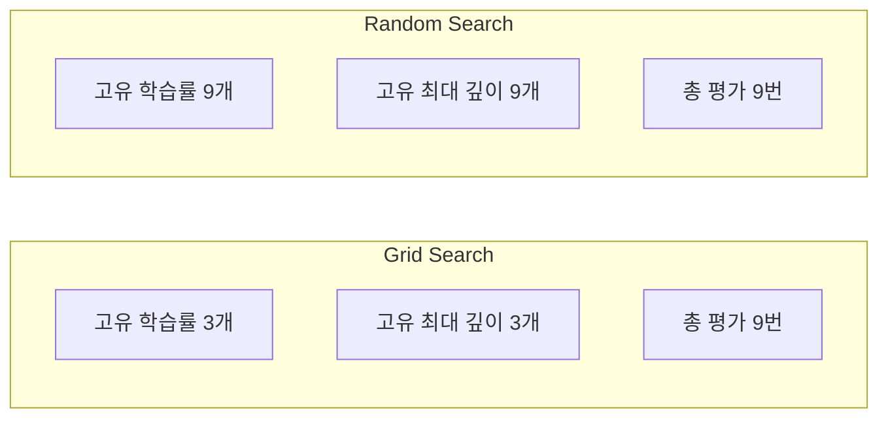
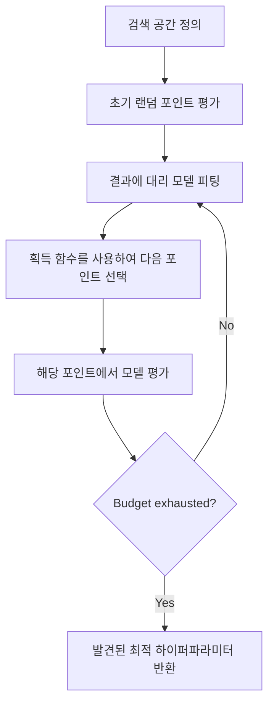
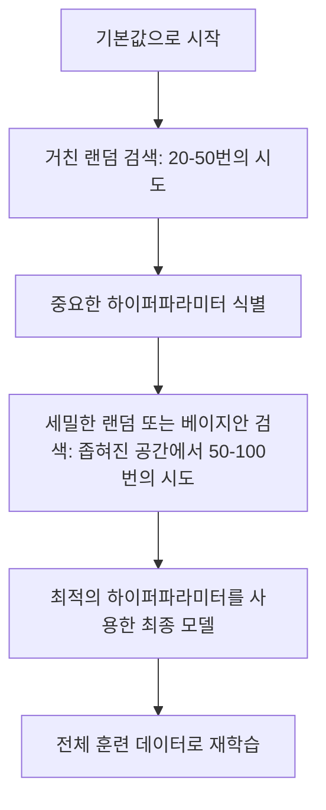
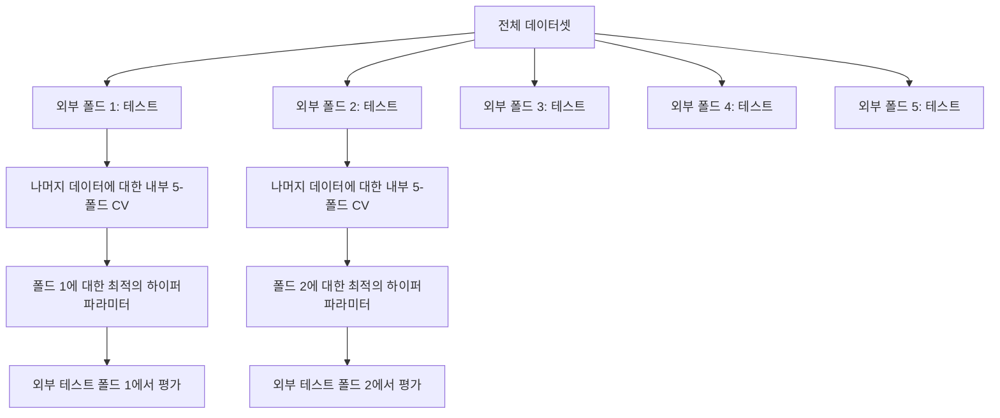

# 하이퍼파라미터 튜닝

> 하이퍼파라미터는 학습이 시작되기 전에 조정하는 제어 변수입니다. 이를 잘 조정하는 것이 mediocre 모델과 great 모델의 차이를 만듭니다.

**유형:** Build
**언어:** Python
**선수 요건:** 2단계, 11강 (앙상블 기법)
**시간:** 약 90분

## 학습 목표

- 그리드 서치, 랜덤 서치, 베이지안 최적화를 처음부터 구현하고 샘플 효율성을 비교해 보세요
- 대부분의 하이퍼파라미터가 낮은 유효 차원을 가질 때 랜덤 서치가 그리드 서치보다 성능이 좋은 이유를 설명해 보세요
- 대리 모델과 획득 함수를 사용하여 탐색을 안내하는 베이지안 최적화 루프를 구축해 보세요
- 적절한 교차 검증을 통해 검증 세트에 대한 과적합을 피하는 하이퍼파라미터 튜닝 전략을 설계해 보세요

## 문제점

그라디언트 부스팅 모델에는 학습률, 트리 수, 최대 깊이, 리프당 최소 샘플 수, 서브샘플 비율, 열 샘플 비율이 있습니다. 이는 6개의 하이퍼파라미터입니다. 각각에 5개의 합리적인 값이 있다면 그리드는 5^6 = 15,625개의 조합을 가집니다. 각각을 학습하는 데 10초가 걸립니다. 모든 조합을 시도하려면 43시간의 컴퓨팅 시간이 필요합니다.

그리드 서치는 가장 명백한 접근법이며 대규모에서는 최악의 방법입니다. 랜덤 서치는 더 적은 컴퓨팅으로 더 좋은 성능을 냅니다. 베이지안 최적화는 과거 평가로부터 학습하여 더욱 더 좋은 성능을 냅니다. 어떤 전략을 사용할지, 그리고 어떤 하이퍼파라미터가 실제로 중요한지 아는 것은 며칠간의 GPU 시간을 낭비하지 않게 해줍니다.

## 개념

### 파라미터 vs 하이퍼파라미터

파라미터는 학습 중에 학습됩니다 (가중치, 편향, 분할 임계값). 하이퍼파라미터는 학습이 시작되기 전에 설정되며 학습이 일어나는 방식을 제어합니다.

| 하이퍼파라미터 | 제어하는 것 | 일반적인 범위 |
|---------------|-----------------|---------------|
| 학습률 | 업데이트당 단계 크기 | 0.001 ~ 1.0 |
| 트리 수/에포크 수 | 학습 시간 | 10 ~ 10,000 |
| 최대 깊이 | 모델 복잡도 | 1 ~ 30 |
| 정규화 (lambda) | 과적합 방지 | 0.0001 ~ 100 |
| 배치 크기 | 기울기 추정 잡음 | 16 ~ 512 |
| 드롭아웃 비율 | 드롭아웃된 뉴런의 비율 | 0.0 ~ 0.5 |

### 그리드 검색

그리드 검색은 지정된 값의 모든 조합을 평가합니다. 이는 포괄적이고 이해하기 쉽지만, 하이퍼파라미터의 수에 따라 지수적으로 확장됩니다.

```
Grid for 2 hyperparameters:

  learning_rate: [0.01, 0.1, 1.0]
  max_depth:     [3, 5, 7]

  Evaluations: 3 x 3 = 9 combinations

  (0.01, 3)  (0.01, 5)  (0.01, 7)
  (0.1,  3)  (0.1,  5)  (0.1,  7)
  (1.0,  3)  (1.0,  5)  (1.0,  7)
```

그리드 검색에는 근본적인 결함이 있습니다. 하나의 하이퍼파라미터가 중요하고 다른 하나는 중요하지 않은 경우, 대부분의 평가가 낭비됩니다. 9번의 평가에서 중요한 파라미터의 고유 값은 3개만 얻게 됩니다.

### 랜덤 검색

랜덤 검색은 그리드 대신 분포에서 하이퍼파라미터를 샘플링합니다. 9번의 평가라는 동일한 예산으로, 각 하이퍼파라미터의 고유 값 9개를 얻게 됩니다.



랜덤 검색이 그리드 검색보다 우수한 이유 (Bergstra & Bengio, 2012):

- 대부분의 하이퍼파라미터는 낮은 유효 차원을 가집니다. 주어진 문제에 대해 6개의 하이퍼파라미터 중 보통 1~2개만 중요합니다.
- 그리드 검색은 중요하지 않은 차원에 평가를 낭비합니다.
- 랜덤 검색은 동일한 예산으로 중요한 차원을 더 밀집하게 커버합니다.
- 60번의 랜덤 시도를 하면, (검색 공간에 최적점이 존재한다면) 최적점의 5% 이내 지점을 찾을 확률이 95%입니다.

### 베이지안 최적화

랜덤 검색은 결과를 무시합니다. 높은 학습률이 발산을 일으킨다거나, 깊이 3이 깊이 10보다 일관되게 더 잘 수행된다는 것을 학습하지 못합니다. 베이지안 최적화는 과거 평가를 활용하여 다음에 검색할 위치를 결정합니다.



두 가지 핵심 구성 요소:

**대리 모델:** 비싼 목적 함수를 근사하는, 평가 비용이 낮은 모델 (보통 가우시안 프로세스)입니다. 검색 공간의 모든 지점에서 예측값과 불확실성 추정값을 제공합니다.

**획득 함수:** 알려진 좋은 지점 근처를 탐색하는 활용(exploitation)과 불확실성이 높은 곳을 탐색하는 탐험(exploration)의 균형을 맞춰 다음에 평가할 위치를 결정합니다. 일반적인 선택지:

- **기대 개선량 (Expected Improvement, EI):** 현재 최선 대비 이 지점에서 얼마나 개선될 것으로 기대합니까?
- **상한 신뢰 구간 (Upper Confidence Bound, UCB):** 예측값에 불확실성의 배수를 더한 값. UCB가 높다는 것은 유망하거나 아직 탐험되지 않았다는 의미입니다.
- **개선 확률 (Probability of Improvement, PI):** 이 지점이 현재 최선보다 더 좋은 결과를 낼 확률은 얼마입니까?

베이즈 최적화는 무작위 탐색보다 2-5배 적은 평가 횟수로 더 나은 하이퍼파라미터를 찾는 경우가 많습니다. 대리 모델(surrogate model)을 피팅하는 오버헤드는 실제 모델을 훈련하는 비용에 비해 무시할 수 있습니다.

### 조기 종료(Early Stopping)

모든 훈련 실행이 완료될 필요는 없습니다. 10 에포크(Epoch) 후에 구성이 명백히 나쁘다면 중단하고 다음으로 넘어가세요. 이는 하이퍼파라미터 탐색 맥락에서의 조기 종료입니다.

전략:
- **인내심 기반(Patience-based):** 검증 손실(validation loss)이 N 연속 에포크 동안 개선되지 않으면 중단
- **중간값 가지치기(Median pruning):** 시도의 중간 결과가 같은 단계에서 완료된 시도들의 중간값보다 나쁘면 중단
- **Hyperband:** 많은 구성에 작은 예산을 할당한 후, 가장 좋은 구성들의 예산을 점진적으로 증가

Hyperband는 특히 효과적입니다. 81개 구성을 각각 1 에포크로 시작하여 상위 1/3을 유지하고, 그들에게 3 에포크를 부여하며, 다시 상위 1/3을 유지하는 식으로 진행합니다. 이는 모든 구성을 전체 예산으로 평가하는 것보다 좋은 구성을 10-50배 더 빠르게 찾습니다.

### 학습률 스케줄러(Learning Rate Schedulers)

학습률(Learning Rate)은 거의 항상 가장 중요한 하이퍼파라미터입니다. 고정된 상태로 두는 대신, 스케줄러는 훈련 중에 이를 조정합니다.

| 스케줄러 | 공식 | 사용 시점 |
|-----------|---------|-------------|
| 단계적 감쇠(Step decay) | N 에포크마다 0.1 곱하기 | 클래식 CNN 훈련 |
| 코사인 어닐링(Cosine annealing) | lr * 0.5 * (1 + cos(pi * t / T)) | 현대적 기본값 |
| 워밍업 + 감쇠(Warmup + decay) | 선형 증가 후 코사인 감쇠 | 트랜스포머 |
| 원사이클(One-cycle) | 한 사이클 동안 증가 후 감소 | 빠른 수렴 |
| 플래토 감소 | 지표가 정체될 때 비율로 감소 | 안전한 기본값 |

### 하이퍼파라미터 중요도

모든 하이퍼파라미터가 동일한 중요도를 가지지는 않습니다. 랜덤 포레스트(Probst et al., 2019)와 그래디언트 부스팅에 대한 연구는 일관된 패턴을 보여줍니다:

**높은 중요도:**
- 학습률 (항상 먼저 튜닝)
- 추정자 수 / 에포크 수 (튜닝 대신 조기 종료 사용)
- 정규화 강도

**중간 중요도:**
- 최대 깊이 / 레이어 수
- 리프당 최소 샘플 수 / 가중치 감쇠
- 서브샘플 비율

**낮은 중요도:**
- 최대 특징 수 (랜덤 포레스트의 경우)
- 특정 활성화 함수 선택
- 배치 크기 (합리적인 범위 내)

중요한 파라미터를 먼저 튜닝하고, 나머지는 기본값으로 남겨두세요.

### 실용적 전략



구체적인 워크플로우:

1. **라이브러리 기본값으로 시작하세요.** 경험 많은 실무자가 선택한 값이며, 종종 목표의 80%에 도달합니다.
2. **거친 랜덤 검색.** 넓은 범위, 20-50번의 시도. 조기 종료를 사용하여 나쁜 실행을 빠르게 중단하세요.
3. **결과 분석.** 어떤 하이퍼파라미터가 성능과 상관관계가 있나요? 검색 공간을 좁히세요.
4. **세밀한 검색.** 좁혀진 공간에서 베이지안 최적화 또는 집중된 랜덤 검색. 50-100번의 시도.
5. **전체 훈련 데이터로 재학습**하여 발견된 최적의 하이퍼파라미터를 사용하세요.

### 교차 검증 통합

단일 검증 분할에서 하이퍼파라미터를 튜닝하는 것은 위험합니다. 최적의 하이퍼파라미터가 특정 검증 폴드에 과적합될 수 있습니다. 중첩 교차 검증은 두 개의 루프를 사용하여 이를 해결합니다:

- **외부 루프** (평가): 데이터를 훈련+검증과 테스트로 분할합니다. 편향 없는 성능을 보고합니다.
- **내부 루프**(튜닝): train+val을 train과 val로 분할합니다. 최적의 하이퍼파라미터를 찾습니다.



각 외부 폴드는 자체적으로 최적의 하이퍼파라미터를 독립적으로 찾습니다. 외부 점수는 일반화 성능의 편향 없는 추정치입니다.

sklearn 사용 시:

```python
from sklearn.model_selection import cross_val_score, GridSearchCV
from sklearn.ensemble import GradientBoostingRegressor

inner_cv = GridSearchCV(
    GradientBoostingRegressor(),
    param_grid={
        "learning_rate": [0.01, 0.05, 0.1],
        "max_depth": [2, 3, 5],
        "n_estimators": [50, 100, 200],
    },
    cv=5,
    scoring="neg_mean_squared_error",
)

outer_scores = cross_val_score(
    inner_cv, X, y, cv=5, scoring="neg_mean_squared_error"
)

print(f"Nested CV MSE: {-outer_scores.mean():.4f} +/- {outer_scores.std():.4f}")
```

이 방법은 비용이 많이 듭니다(외부 5폴드 x 내부 5폴드 x 그리드 포인트 27개 = 모델 적합 675회)하지만, 신뢰할 수 있는 성능 추정치를 제공합니다. 논문에서 최종 결과를 보고할 때나 결정의 중요성이 높을 때 사용하세요.

### 실용적인 팁

**학습률부터 시작하세요.** 학습률은 기울기 기반 방법에서 항상 가장 중요한 하이퍼파라미터입니다. 나쁜 학습률은 다른 모든 요소를 무의미하게 만듭니다. 다른 하이퍼파라미터는 기본값으로 고정하고 학습률을 먼저 탐색하세요.

**학습률과 정규화에는 로그 균등 분포를 사용하세요.** 0.01강 0.01의 차이는 0.01강 1.0의 차이만큼 중요합니다. 선형적으로 탐색하면 큰 값 쪽에 예산을 낭비합니다.

**n_estimators를 튜닝하는 대신 조기 종료(early stopping)를 사용하세요.** 부스팅과 신경망에서는 n_estimators나 에포크를 높게 설정하고 조기 종료가 언제 멈출지 결정하도록 하세요. 이렇게 하면 탐색에서 하이퍼파라미터 하나를 제거할 수 있습니다.

**예산 배분.** 튜닝 예산의 60%는 가장 중요한 상위 2개 하이퍼파라미터에 사용하세요. 나머지 40%는 다른 모든 요소에 사용하세요. 상위 2개 하이퍼파라미터가 성능 변동의 대부분을 차지합니다.

**스케일이 중요합니다.** 배치 크기는 절대 로그 스케일(16, 32, 64는 적절함)로 탐색하지 마세요. 학습률은 항상 로그 스케일로 탐색하세요. 하이퍼파라미터가 모델에 영향을 미치는 방식에 맞춰 탐색 분포를 조정하세요.

| 모델 유형 | 주요 하이퍼파라미터 | 권장 탐색 | 예산 |
|-----------|--------------------|--------------------|--------|
| 랜덤 포레스트 | n_estimators, max_depth, min_samples_leaf | 랜덤 검색, 50회 시도 | 낮음 (빠른 학습) |
| 그래디언트 부스팅 | learning_rate, n_estimators, max_depth | 베이지안, 100회 시도 + 조기 종료 | 중간 |
| 신경망 | learning_rate, weight_decay, batch_size | 베이지안 또는 랜덤, 100회 이상 시도 | 높음 (느린 학습) |
| SVM | C, gamma (RBF 커널) | 로그 스케일 그리드, 25-50회 시도 | 낮음 (2개 매개변수) |
| 라소/리지 | alpha | 로그 스케일 1D 검색, 20회 시도 | 매우 낮음 |
| XGBoost | learning_rate, max_depth, subsample, colsample | 베이지안, 100-200회 시도 + 조기 종료 | 중간 |

**모호할 때:** 하이퍼파라미터 수의 2배 횟수로 랜덤 검색을 수행하세요 (예: 하이퍼파라미터 6개 = 최소 12회 이상 시도). 50회 랜덤 검색이 정교하게 설계된 그리드 검색을 능가하는 경우가 얼마나 많은지 놀라실 것입니다.

```figure
k-fold-cv
```

## 구현하기

### 1단계: 그리드 검색을 처음부터 구현하기

`code/tuning.py`의 코드는 그리드 검색, 랜덤 검색, 그리고 간단한 베이지안 옵티마이저를 처음부터 구현합니다.

```python
def grid_search(model_fn, param_grid, X_train, y_train, X_val, y_val):
    keys = list(param_grid.keys())
    values = list(param_grid.values())
    best_score = -float("inf")
    best_params = None
    n_evals = 0

    for combo in itertools.product(*values):
        params = dict(zip(keys, combo))
        model = model_fn(**params)
        model.fit(X_train, y_train)
        score = evaluate(model, X_val, y_val)
        n_evals += 1

        if score > best_score:
            best_score = score
            best_params = params

    return best_params, best_score, n_evals
```

### 2단계: 랜덤 검색을 처음부터 구현하기

```python
def random_search(model_fn, param_distributions, X_train, y_train,
                  X_val, y_val, n_iter=50, seed=42):
    rng = np.random.RandomState(seed)
    best_score = -float("inf")
    best_params = None

    for _ in range(n_iter):
        params = {k: sample(v, rng) for k, v in param_distributions.items()}
        model = model_fn(**params)
        model.fit(X_train, y_train)
        score = evaluate(model, X_val, y_val)

        if score > best_score:
            best_score = score
            best_params = params

    return best_params, best_score, n_iter
```

### 3단계: 베이지안 최적화 (단순화)

핵심 아이디어: 관측된 (하이퍼파라미터, 점수) 쌍에 가우시안 프로세스를 적합하고, 획득 함수(acquisition function)를 사용하여 다음에 탐색할 위치를 결정합니다.

```python
class SimpleBayesianOptimizer:
    def __init__(self, search_space, n_initial=5):
        self.search_space = search_space
        self.n_initial = n_initial
        self.X_observed = []
        self.y_observed = []

    def _kernel(self, x1, x2, length_scale=1.0):
        dists = np.sum((x1[:, None, :] - x2[None, :, :]) ** 2, axis=2)
        return np.exp(-0.5 * dists / length_scale ** 2)

    def _fit_gp(self, X_new):
        X_obs = np.array(self.X_observed)
        y_obs = np.array(self.y_observed)
        y_mean = y_obs.mean()
        y_centered = y_obs - y_mean

        K = self._kernel(X_obs, X_obs) + 1e-4 * np.eye(len(X_obs))
        K_star = self._kernel(X_new, X_obs)

        L = np.linalg.cholesky(K)
        alpha = np.linalg.solve(L.T, np.linalg.solve(L, y_centered))
        mu = K_star @ alpha + y_mean

        v = np.linalg.solve(L, K_star.T)
        var = 1.0 - np.sum(v ** 2, axis=0)
        var = np.maximum(var, 1e-6)

        return mu, var

    def _expected_improvement(self, mu, var, best_y):
        sigma = np.sqrt(var)
        z = (mu - best_y) / (sigma + 1e-10)
        ei = sigma * (z * norm_cdf(z) + norm_pdf(z))
        return ei

    def suggest(self):
        if len(self.X_observed) < self.n_initial:
            return sample_random(self.search_space)

        candidates = [sample_random(self.search_space) for _ in range(500)]
        X_cand = np.array([to_vector(c) for c in candidates])
        mu, var = self._fit_gp(X_cand)
        ei = self._expected_improvement(mu, var, max(self.y_observed))
        return candidates[np.argmax(ei)]

    def observe(self, params, score):
        self.X_observed.append(to_vector(params))
        self.y_observed.append(score)
```

GP 대리 모델은 각 후보 지점에서 두 가지를 제공합니다: 예측 점수(mu)와 불확실성(var). 기대 개선(Expected Improvement)은 이 두 요소를 균형 있게 고려합니다: 모델이 높은 점수를 예측하는 지점이나 불확실성이 높은 지점을 선호합니다. 초기에는 대부분의 지점이 높은 불확실성을 가지므로 옵티마이저가 탐색을 수행합니다. 이후에는 가장 유망한 영역에 집중합니다.

### 4단계: 모든 방법 비교하기

동일한 합성 목적 함수에 세 가지 방법을 모두 실행하고 비교하세요. 이 비교는 각 옵티마이저를 직접 목적 함수로 호출하는 단순화된 래퍼(wrapper)를 사용하므로 (모델 학습 없음), API가 위의 모델 기반 구현과 다릅니다:

```python
def synthetic_objective(params):
    lr = params["learning_rate"]
    depth = params["max_depth"]
    return -(np.log10(lr) + 2) ** 2 - (depth - 4) ** 2 + 10

param_grid = {
    "learning_rate": [0.001, 0.01, 0.1, 1.0],
    "max_depth": [2, 3, 4, 5, 6, 7, 8],
}

grid_best = None
grid_score = -float("inf")
grid_history = []
for combo in itertools.product(*param_grid.values()):
    params = dict(zip(param_grid.keys(), combo))
    score = synthetic_objective(params)
    grid_history.append((params, score))
    if score > grid_score:
        grid_score = score
        grid_best = params

param_dist = {
    "learning_rate": ("log_float", 0.001, 1.0),
    "max_depth": ("int", 2, 8),
}

rand_best = None
rand_score = -float("inf")
rand_history = []
rng = np.random.RandomState(42)
for _ in range(28):
    params = {k: sample(v, rng) for k, v in param_dist.items()}
    score = synthetic_objective(params)
    rand_history.append((params, score))
    if score > rand_score:
        rand_score = score
        rand_best = params

optimizer = SimpleBayesianOptimizer(param_dist, n_initial=5)
bayes_history = []
for _ in range(28):
    params = optimizer.suggest()
    score = synthetic_objective(params)
    optimizer.observe(params, score)
    bayes_history.append((params, score))
bayes_score = max(s for _, s in bayes_history)

print(f"{'Method':<20} {'Best Score':>12} {'Evaluations':>12}")
print("-" * 50)
print(f"{'Grid Search':<20} {grid_score:>12.4f} {len(grid_history):>12}")
print(f"{'Random Search':<20} {rand_score:>12.4f} {len(rand_history):>12}")
print(f"{'Bayesian Opt':<20} {bayes_score:>12.4f} {len(bayes_history):>12}")
```

동일한 예산 하에서, 베이지안 최적화는 명백히 나쁜 영역에서 평가를 낭비하지 않기 때문에 보통 최상의 점수를 가장 빠르게 찾습니다. 랜덤 서치는 그리드 서치보다 더 넓은 영역을 탐색합니다. 그리드 서치는 하이퍼파라미터가 매우 적고 exhaustive(전수 탐색)가 가능한 경우에만 유리합니다.

## 사용하기

### 실전에서의 Optuna

Optuna는 진지한 하이퍼파라미터 튜닝을 위해 권장되는 라이브러리입니다. pruning(가지치기), 분산 탐색, 시각화를 기본으로 지원합니다.

```python
import optuna

def objective(trial):
    lr = trial.suggest_float("learning_rate", 1e-4, 1e-1, log=True)
    n_est = trial.suggest_int("n_estimators", 50, 500)
    max_depth = trial.suggest_int("max_depth", 2, 10)

    model = GradientBoostingRegressor(
        learning_rate=lr,
        n_estimators=n_est,
        max_depth=max_depth,
    )
    model.fit(X_train, y_train)
    return mean_squared_error(y_val, model.predict(X_val))

study = optuna.create_study(direction="minimize")
study.optimize(objective, n_trials=100)

print(f"Best params: {study.best_params}")
print(f"Best MSE: {study.best_value:.4f}")
```

Optuna의 주요 기능:
- `suggest_float(..., log=True)`는 로그 스케일에서 최적 탐색이 필요한 파라미터(학습률, 정규화)에 사용
- `suggest_int`는 정수 파라미터에 사용
- `suggest_categorical`는 이산 선택(discrete choices)에 사용
- 나쁜 trial의 조기 중단을 위한 내장 MedianPruner
- 분석을 위한 `study.trials_dataframe()`

### Pruning을 활용한 Optuna

Pruning은 유망하지 않은 trial을 조기에 중단하여 대규모 컴퓨팅 자원을 절약합니다. 패턴은 다음과 같습니다:

```python
import optuna
from sklearn.model_selection import cross_val_score

def objective(trial):
    params = {
        "learning_rate": trial.suggest_float("lr", 1e-4, 0.5, log=True),
        "max_depth": trial.suggest_int("max_depth", 2, 10),
        "n_estimators": trial.suggest_int("n_estimators", 50, 500),
        "subsample": trial.suggest_float("subsample", 0.5, 1.0),
    }

    model = GradientBoostingRegressor(**params)
    scores = cross_val_score(model, X_train, y_train, cv=3,
                             scoring="neg_mean_squared_error")
    mean_score = -scores.mean()

    trial.report(mean_score, step=0)
    if trial.should_prune():
        raise optuna.TrialPruned()

    return mean_score

pruner = optuna.pruners.MedianPruner(n_startup_trials=10, n_warmup_steps=5)
study = optuna.create_study(direction="minimize", pruner=pruner)
study.optimize(objective, n_trials=200)
```

`MedianPruner`는 중간 값이 같은 단계에서 완료된 모든 trial의 중앙값보다 나쁜 경우 trial을 중단합니다. Pruning은 중간 지표를 보고하기 위해 `trial.report()`를 호출하고, trial을 중단해야 하는지 확인하기 위해 `trial.should_prune()`를 호출해야 합니다. `n_startup_trials=10`는 pruning이 시작되기 전에 최소 10개의 trial이 완전히 완료되도록 보장합니다. 이는 일반적으로 총 컴퓨팅 자원의 40-60%를 절약합니다.

### sklearn의 내장 튜너

빠른 실험을 위해 sklearn은 `GridSearchCV`, `RandomizedSearchCV`, `HalvingRandomSearchCV`를 제공합니다:

```python
from sklearn.model_selection import RandomizedSearchCV
from scipy.stats import loguniform, randint

param_dist = {
    "learning_rate": loguniform(1e-4, 0.5),
    "max_depth": randint(2, 10),
    "n_estimators": randint(50, 500),
}

search = RandomizedSearchCV(
    GradientBoostingRegressor(),
    param_dist,
    n_iter=100,
    cv=5,
    scoring="neg_mean_squared_error",
    random_state=42,
    n_jobs=-1,
)
search.fit(X_train, y_train)
print(f"Best params: {search.best_params_}")
print(f"Best CV MSE: {-search.best_score_:.4f}")
```

학습률과 정규화에는 scipy의 `loguniform`를 사용하세요. 정수 하이퍼파라미터에는 `randint`를 사용하세요. `n_jobs=-1` 플래그는 모든 CPU 코어에 걸쳐 병렬화합니다.

### 하이퍼파라미터 튜닝에서의 흔한 실수

**전처리에서의 데이터 누수.** 교차 검증 전에 전체 데이터셋에 스케일러를 fit하면, 검증 폴드의 정보가 학습 데이터로 누수됩니다. 전처리는 항상 `Pipeline` 안에 배치하여 학습 폴드에서만 fit되도록 하세요.

**검증 세트에 대한 과적합.** 수천 개의 trial을 실행하는 것은 사실상 검증 세트에 대해 학습하는 것과 같습니다. 최종 성능 추정에는 중첩 교차 검증(nested cross-validation)을 사용하거나, 튜닝 중에 절대 건드리지 않는 별도의 테스트 세트를 유지하세요.

**너무 좁은 범위를 탐색하는 경우.** 최적값이 탐색 공간의 경계에 있다면, 충분히 넓게 탐색하지 않은 것입니다. 최적값이 범위 밖에 있을 수 있습니다. 항상 최적 매개변수가 경계에 있는지 확인하세요.

**상호작용 효과를 무시하는 경우.** 부팅(boosting)에서는 학습률과 추정자 수(estimator)가 강하게 상호작용합니다. 낮은 학습률은 더 많은 추정자가 필요합니다. 각각 독립적으로 튜닝하면 함께 튜닝하는 것보다 결과가 나빠집니다.

**반복 모델에 조기 종료(early stopping)를 사용하지 않는 경우.** 그래디언트 부팅과 신경망에서는 `n_estimators`나 에포크(epoch)를 높은 값으로 설정하고 조기 종료를 사용하세요. 이는 반복 횟수를 하이퍼파라미터로 튜닝하는 것보다 엄격하게 더 좋습니다.

## 연습 문제

1. 동일한 총 예산(예: 50회 평가)으로 그리드 검색과 랜덤 검색을 실행하세요. 발견된 최고 점수를 비교하세요. 서로 다른 시드로 실험을 10번 실행하세요. 랜덤 검색이 얼마나 자주 이기나요?

2. Hyperband를 처음부터 구현하세요. 81개 구성을 시작하고, 각각 1 에포크(epoch) 동안 학습하세요. 각 라운드에서 상위 1/3를 유지하고 예산을 3배로 늘리세요. 총 연산량(모든 구성의 모든 에포크 합)을 81개 구성을 전체 예산으로 실행하는 것과 비교하세요.

3. 11강의 그래디언트 부팅 구현에 학습률 스케줄러(cosine annealing)를 추가하세요. 고정 학습률과 비교했을 때 도움이 되나요?

4. Optuna를 사용하여 실제 데이터셋(예: sklearn의 유방암 데이터셋)에서 `RandomForestClassifier`를 튜닝하세요. `optuna.visualization.plot_param_importances(study)`를 사용하여 어떤 하이퍼파라미터가 가장 중요한지 확인하세요. 이 강의의 중요도 순위와 일치하나요?

5. 간단한 획득 함수(Expected Improvement)를 구현하고 탐색(exploration)과 활용(exploitation)을 시연하세요. 대리 모델의 평균과 불확실성을 플롯하고, EI가 다음에 평가할 위치를 선택하는 부분을 표시하세요.

## 핵심 용어

| 용어 | 사람들이 말하는 것 | 실제 의미 |
|------|----------------|----------------------|
| 하이퍼파라미터 | "선택하는 설정" | 학습 프로세스를 제어하며 데이터로부터 학습되지 않는, 학습 전에 설정된 값 |
| 그리드 검색 | "모든 조합을 시도" | 지정된 매개변수 그리드에 대한 exhaustive search. 지수적 비용. |
| 랜덤 검색 | "무작위로 샘플링" | 하이퍼파라미터를 분포에서 샘플링합니다. 그리드 검색보다 중요한 차원을 더 잘 커버합니다. |
| 베이지안 최적화 | "스마트 검색" | 목적 함수의 대리 모델을 사용하여 다음에 평가할 위치를 결정하며, 탐색과 활용의 균형을 맞춥니다. |
| 대리 모델 | "저렴한 근사치" | 관측된 평가로부터 비싼 목적 함수를 근사하는 모델 (일반적으로 가우시안 프로세스) |
| 획득 함수 | "다음에 볼 위치" | 예상 개선과 불확실성의 균형을 통해 후보 포인트에 점수를 매깁니다. EI와 UCB가 일반적인 선택입니다. |
| 조기 종료 | "시간 낭비 중지" | 검증 성능이 더 이상 개선되지 않으면 훈련을 조기에 종료합니다. |
| Hyperband | "구성용 토너먼트 대진표" | 적응형 자원 할당: 많은 구성을 작은 예산으로 시작하고, 최상의 구성을 유지하며 예산을 늘립니다. |
| 학습률 스케줄러 | "훈련 중 lr 변경" | 더 나은 수렴을 위해 훈련 과정에서 학습률을 조정하는 함수 |

## 추가 읽기

- [Bergstra & Bengio: Random Search for Hyper-Parameter Optimization (2012)](https://jmlr.org/papers/v13/bergstra12a.html) -- 랜덤이 그리드보다 낫다는 것을 보여준 논문
- [Snoek et al., Practical Bayesian Optimization of Machine Learning Algorithms (2012)](https://arxiv.org/abs/1206.2944) -- ML을 위한 베이지안 최적화
- [Li et al., Hyperband: A Novel Bandit-Based Approach (2018)](https://jmlr.org/papers/v18/16-558.html) -- Hyperband 논문
- [Optuna: A Next-generation Hyperparameter Optimization Framework](https://arxiv.org/abs/1907.10902) -- Optuna 논문
- [Probst et al., Tunability: Importance of Hyperparameters (2019)](https://jmlr.org/papers/v20/18-444.html) -- 어떤 하이퍼파라미터가 중요한지
