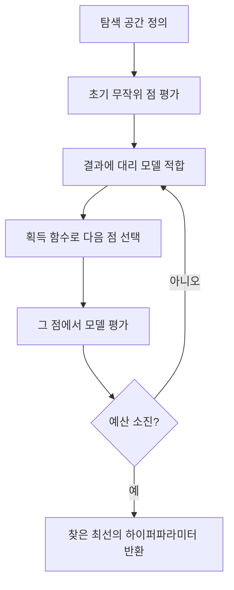
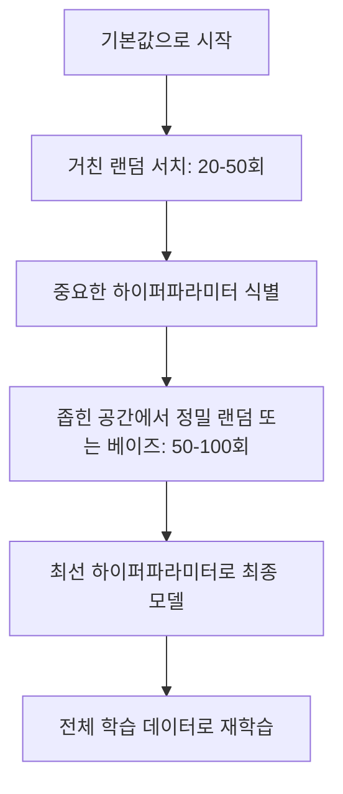
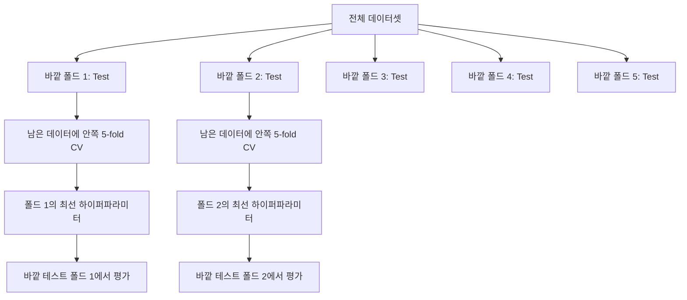

# 하이퍼파라미터 튜닝 (Hyperparameter Tuning)

> 하이퍼파라미터는 학습이 시작되기 전에 돌리는 노브입니다. 잘 돌리면 평범한 모델과 훌륭한 모델의 차이가 됩니다.

**Type:** Build
**Language:** Python
**Prerequisites:** Phase 2, Lesson 11 (Ensemble Methods)
**Time:** ~90 minutes

## 학습 목표 (Learning Objectives)

- 그리드 서치, 랜덤 서치, 베이즈 최적화(Bayesian optimization)를 처음부터 구현하고 샘플 효율을 비교합니다
- 대부분 하이퍼파라미터가 낮은 유효 차원(effective dimensionality)을 가질 때 랜덤 서치가 그리드 서치보다 나은 이유를 설명합니다
- 대리 모델(surrogate model)과 획득 함수(acquisition function)로 탐색을 이끄는 베이즈 최적화 루프를 만듭니다
- 적절한 교차 검증으로 검증 세트 과적합을 피하는 하이퍼파라미터 튜닝 전략을 설계합니다

## 문제 상황 (The Problem)

그래디언트 부스팅 모델에는 학습률, 트리 수, 최대 깊이, 리프당 최소 샘플, 서브샘플 비율, 열 샘플 비율이 있습니다. 하이퍼파라미터가 여섯 개입니다. 각각 합리적인 값 5개면 그리드는 5^6 = 15,625 조합입니다. 조합마다 학습에 10초면 전부 시도하는 데 43시간의 계산이 듭니다.

그리드 서치는 뻔한 접근이자 규모가 커지면 최악입니다. 랜덤 서치는 더 적은 계산으로 더 잘합니다. 베이즈 최적화는 과거 평가에서 배워 더 잘합니다. 어떤 전략을 쓸지, 어떤 하이퍼파라미터가 실제로 중요한지 알면 GPU 시간을 며칠씩 낭비하지 않습니다.

## 핵심 개념 (The Concept)

### 파라미터 vs 하이퍼파라미터

파라미터는 학습 중에 학습됩니다(가중치, 편향, 분할 임계값). 하이퍼파라미터는 학습 시작 전에 정하고, 학습이 어떻게 일어나는지를 제어합니다.

| Hyperparameter | What it controls | Typical range |
|---------------|-----------------|---------------|
| Learning rate | Step size per update | 0.001 to 1.0 |
| Number of trees/epochs | How long to train | 10 to 10,000 |
| Max depth | Model complexity | 1 to 30 |
| Regularization (lambda) | Overfitting prevention | 0.0001 to 100 |
| Batch size | Gradient estimation noise | 16 to 512 |
| Dropout rate | Fraction of neurons dropped | 0.0 to 0.5 |

### 그리드 서치 (Grid Search)

그리드 서치는 지정한 값의 모든 조합을 평가합니다. 완전하고 이해하기 쉽지만, 하이퍼파라미터 수에 따라 지수적으로 커집니다.

```
Grid for 2 hyperparameters:

  learning_rate: [0.01, 0.1, 1.0]
  max_depth:     [3, 5, 7]

  Evaluations: 3 x 3 = 9 combinations

  (0.01, 3)  (0.01, 5)  (0.01, 7)
  (0.1,  3)  (0.1,  5)  (0.1,  7)
  (1.0,  3)  (1.0,  5)  (1.0,  7)
```

근본적인 결함: 한 하이퍼파라미터만 중요하고 다른 것은 아니면, 대부분의 평가가 낭비됩니다. 평가 9번으로 중요한 파라미터의 고유 값은 3개뿐입니다.

### 랜덤 서치 (Random Search)

랜덤 서치는 그리드 대신 분포에서 하이퍼파라미터를 샘플링합니다. 같은 예산 9번이면 각 하이퍼파라미터의 고유 값 9개를 얻습니다.


랜덤이 그리드를 이기는 이유 (Bergstra & Bengio, 2012):

- 대부분 하이퍼파라미터는 유효 차원이 낮습니다. 보통 6개 중 1~2개만 해당 문제에 중요합니다.
- 그리드 서치는 중요하지 않은 차원에 평가를 낭비합니다.
- 같은 예산에서 랜덤 서치는 중요한 차원을 더 촘촘히 덮습니다.
- 랜덤 시도 60번이면, 탐색 공간에 최적이 있을 때 그 최적의 5% 이내 점을 찾을 확률이 95%입니다.

### 베이즈 최적화 (Bayesian Optimization)

랜덤 서치는 결과를 무시합니다. 높은 학습률이 발산을 일으키는지, 깊이 3이 깊이 10보다 꾸준히 나은지 배우지 않습니다. 베이즈 최적화는 과거 평가로 다음에 어디를 볼지 정합니다.



두 핵심 구성 요소:

**대리 모델(Surrogate model):** 비싼 목적 함수를 근사하는, 평가가 싼 모델(보통 가우시안 프로세스). 탐색 공간의 임의의 점에서 예측과 불확실성 추정치를 둘 다 줍니다.

**획득 함수(Acquisition function):** 활용(exploitation, 알려진 좋은 점 근처 탐색)과 탐험(exploration, 불확실성이 큰 곳 탐색)의 균형으로 다음 평가 위치를 정합니다. 흔한 선택:

- **Expected Improvement (EI):** 이 점에서 현재 최선 대비 얼마나 개선을 기대하는가?
- **Upper Confidence Bound (UCB):** 예측 + 불확실성의 배수. UCB가 높으면 유망하거나 미탐험.
- **Probability of Improvement (PI):** 이 점이 현재 최선을 이길 확률은?

베이즈 최적화는 보통 랜덤 서치보다 2~5배 적은 평가로 더 나은 하이퍼파라미터를 찾습니다. 대리 모델 적합 오버헤드는 실제 모델 학습에 비하면 무시할 만합니다.

### Early Stopping

모든 학습 실행을 끝까지 돌릴 필요는 없습니다. 10 에폭 후 설정이 분명히 나쁘면 멈추고 다음으로 갑니다. 이것이 하이퍼파라미터 탐색 맥락의 early stopping입니다.

전략:
- **Patience 기반:** 검증 손실이 연속 N 에폭 개선되지 않으면 중단
- **Median pruning:** 같은 단계에서 완료된 시도들의 중앙값보다 중간 결과가 나쁘면 중단
- **Hyperband:** 많은 설정에 작은 예산을 주고, 좋은 것만 예산을 점진적으로 늘림

Hyperband가 특히 효과적입니다. 설정 81개를 각 1 에폭으로 시작하고, 상위 1/3을 남긴 뒤 3 에폭을 주고, 다시 상위 1/3을 남기는 식입니다. 모든 설정을 전체 예산으로 돌리는 것보다 좋은 설정을 10~50배 빨리 찾습니다.

### 학습률 스케줄러 (Learning Rate Schedulers)

학습률은 거의 항상 가장 중요한 하이퍼파라미터입니다. 고정하지 않고, 스케줄러가 학습 중에 조정합니다.

| Scheduler | Formula | When to use |
|-----------|---------|-------------|
| Step decay | Multiply by 0.1 every N epochs | Classic CNN training |
| Cosine annealing | lr * 0.5 * (1 + cos(pi * t / T)) | Modern default |
| Warmup + decay | Linear increase then cosine decay | Transformers |
| One-cycle | Increase then decrease over one cycle | Fast convergence |
| Reduce on plateau | Reduce by factor when metric stalls | Safe default |

### 하이퍼파라미터 중요도

모든 하이퍼파라미터가 똑같이 중요하지는 않습니다. 랜덤 포레스트(Probst et al., 2019)와 그래디언트 부스팅 연구는 일관된 패턴을 보입니다:

**높은 중요도:**
- 학습률 (항상 먼저 튜닝)
- estimator / 에폭 수 (튜닝 대신 early stopping)
- 정규화 강도

**중간 중요도:**
- 최대 깊이 / 레이어 수
- 리프당 최소 샘플 / weight decay
- 서브샘플 비율

**낮은 중요도:**
- max features (랜덤 포레스트)
- 특정 활성화 함수 선택
- 배치 크기 (합리적 범위 안)

중요한 것부터 튜닝하고, 나머지는 기본값에 두세요.

### 실무 전략



구체적 워크플로:

1. **라이브러리 기본값으로 시작.** 경험 많은 실무자가 고른 값이라 종종 80%까지는 갑니다.
2. **거친 랜덤 서치.** 넓은 범위, 20~50회. early stopping으로 나쁜 실행을 빨리 끊습니다.
3. **결과 분석.** 어떤 하이퍼파라미터가 성능과 상관있나요? 탐색 공간을 좁힙니다.
4. **정밀 탐색.** 좁힌 공간에서 베이즈 최적화 또는 집중 랜덤 서치. 50~100회.
5. **찾은 최선 하이퍼파라미터로 전체 학습 데이터에 재학습.**

### 교차 검증 통합

단일 검증 분할로 하이퍼파라미터를 튜닝하면 위험합니다. 최선 하이퍼파라미터가 그 검증 폴드에 과적합할 수 있습니다. 중첩 교차 검증(nested cross-validation)은 두 루프로 이를 해결합니다:

- **바깥 루프** (평가): 데이터를 train+val과 test로 나눕니다. 편향 없는 성능을 보고합니다.
- **안쪽 루프** (튜닝): train+val을 train과 val로 나눕니다. 최선의 하이퍼파라미터를 찾습니다.



각 바깥 폴드는 독립적으로 자신의 최선 하이퍼파라미터를 찾습니다. 바깥 점수는 일반화 성능의 편향 없는 추정입니다.

sklearn으로:

```python
from sklearn.model_selection import cross_val_score, GridSearchCV
from sklearn.ensemble import GradientBoostingRegressor

inner_cv = GridSearchCV(
    GradientBoostingRegressor(),
    param_grid={
        "learning_rate": [0.01, 0.05, 0.1],
        "max_depth": [2, 3, 5],
        "n_estimators": [50, 100, 200],
    },
    cv=5,
    scoring="neg_mean_squared_error",
)

outer_scores = cross_val_score(
    inner_cv, X, y, cv=5, scoring="neg_mean_squared_error"
)

print(f"Nested CV MSE: {-outer_scores.mean():.4f} +/- {outer_scores.std():.4f}")
```

비용이 큽니다(바깥 5 × 안쪽 5 × 그리드 점 27 = 모델 적합 675회). 하지만 믿을 만한 성능 추정을 줍니다. 논문에 최종 결과를 보고하거나 결정의 이해관계가 클 때 쓰세요.

### 실무 팁

**학습률부터 시작하세요.** 그래디언트 기반 방법에서 항상 가장 중요합니다. 나쁜 학습률이면 나머지가 무의미합니다. 다른 하이퍼파라미터는 기본값에 두고 학습률을 먼저 스윕하세요.

**학습률과 정규화에는 log-uniform 분포를 쓰세요.** 0.001과 0.01의 차이는 0.1과 1.0의 차이만큼 중요합니다. 선형 탐색은 큰 쪽 구간에 예산을 낭비합니다.

**n_estimators 튜닝 대신 early stopping을 쓰세요.** 부스팅과 신경망에서는 n_estimators나 에폭을 크게 두고 early stopping이 멈출 시점을 정하게 하세요. 탐색에서 하이퍼파라미터 하나를 제거합니다.

**예산 배분.** 튜닝 예산의 60%를 가장 중요한 하이퍼파라미터 상위 2개에 쓰세요. 나머지 40%를 그 외에. 상위 2개가 성능 변동의 대부분을 설명합니다.

**스케일이 중요합니다.** 배치 크기는 로그 스케일로 찾지 마세요(16, 32, 64면 충분). 학습률은 항상 로그 스케일로. 하이퍼파라미터가 모델에 미치는 방식에 맞게 탐색 분포를 맞추세요.

| Model Type | Top Hyperparameters | Recommended Search | Budget |
|-----------|--------------------|--------------------|--------|
| Random Forest | n_estimators, max_depth, min_samples_leaf | Random search, 50 trials | Low (fast training) |
| Gradient Boosting | learning_rate, n_estimators, max_depth | Bayesian, 100 trials + early stopping | Medium |
| Neural Network | learning_rate, weight_decay, batch_size | Bayesian or random, 100+ trials | High (slow training) |
| SVM | C, gamma (RBF kernel) | Grid on log scale, 25-50 trials | Low (2 params) |
| Lasso/Ridge | alpha | 1D search on log scale, 20 trials | Very low |
| XGBoost | learning_rate, max_depth, subsample, colsample | Bayesian, 100-200 trials + early stopping | Medium |

**확실하지 않으면:** 하이퍼파라미터 수의 2배 시도로 랜덤 서치(예: 하이퍼파라미터 6개면 최소 12+회). 잘 설계한 그리드 서치를 랜덤 서치 50회가 이기는 경우가 놀랍도록 많습니다.

```figure
k-fold-cv
```

## 직접 구현하기 (Build It)

### 1단계: 그리드 서치를 처음부터

`code/tuning.py`의 코드가 그리드 서치, 랜덤 서치, 간단한 베이즈 최적화기를 처음부터 구현합니다.

```python
def grid_search(model_fn, param_grid, X_train, y_train, X_val, y_val):
    keys = list(param_grid.keys())
    values = list(param_grid.values())
    best_score = -float("inf")
    best_params = None
    n_evals = 0

    for combo in itertools.product(*values):
        params = dict(zip(keys, combo))
        model = model_fn(**params)
        model.fit(X_train, y_train)
        score = evaluate(model, X_val, y_val)
        n_evals += 1

        if score > best_score:
            best_score = score
            best_params = params

    return best_params, best_score, n_evals
```

### 2단계: 랜덤 서치를 처음부터

```python
def random_search(model_fn, param_distributions, X_train, y_train,
                  X_val, y_val, n_iter=50, seed=42):
    rng = np.random.RandomState(seed)
    best_score = -float("inf")
    best_params = None

    for _ in range(n_iter):
        params = {k: sample(v, rng) for k, v in param_distributions.items()}
        model = model_fn(**params)
        model.fit(X_train, y_train)
        score = evaluate(model, X_val, y_val)

        if score > best_score:
            best_score = score
            best_params = params

    return best_params, best_score, n_iter
```

### 3단계: 베이즈 최적화 (단순화)

핵심 아이디어: 관측된 (하이퍼파라미터, 점수) 쌍에 가우시안 프로세스를 맞춘 뒤, 획득 함수로 다음에 어디를 볼지 정합니다.

```python
class SimpleBayesianOptimizer:
    def __init__(self, search_space, n_initial=5):
        self.search_space = search_space
        self.n_initial = n_initial
        self.X_observed = []
        self.y_observed = []

    def _kernel(self, x1, x2, length_scale=1.0):
        dists = np.sum((x1[:, None, :] - x2[None, :, :]) ** 2, axis=2)
        return np.exp(-0.5 * dists / length_scale ** 2)

    def _fit_gp(self, X_new):
        X_obs = np.array(self.X_observed)
        y_obs = np.array(self.y_observed)
        y_mean = y_obs.mean()
        y_centered = y_obs - y_mean

        K = self._kernel(X_obs, X_obs) + 1e-4 * np.eye(len(X_obs))
        K_star = self._kernel(X_new, X_obs)

        L = np.linalg.cholesky(K)
        alpha = np.linalg.solve(L.T, np.linalg.solve(L, y_centered))
        mu = K_star @ alpha + y_mean

        v = np.linalg.solve(L, K_star.T)
        var = 1.0 - np.sum(v ** 2, axis=0)
        var = np.maximum(var, 1e-6)

        return mu, var

    def _expected_improvement(self, mu, var, best_y):
        sigma = np.sqrt(var)
        z = (mu - best_y) / (sigma + 1e-10)
        ei = sigma * (z * norm_cdf(z) + norm_pdf(z))
        return ei

    def suggest(self):
        if len(self.X_observed) < self.n_initial:
            return sample_random(self.search_space)

        candidates = [sample_random(self.search_space) for _ in range(500)]
        X_cand = np.array([to_vector(c) for c in candidates])
        mu, var = self._fit_gp(X_cand)
        ei = self._expected_improvement(mu, var, max(self.y_observed))
        return candidates[np.argmax(ei)]

    def observe(self, params, score):
        self.X_observed.append(to_vector(params))
        self.y_observed.append(score)
```

GP 대리 모델은 각 후보 점에서 두 가지를 줍니다: 예측 점수(mu)와 불확실성(var). Expected Improvement는 이를 균형 잡습니다. 예측 점수가 높거나 불확실성이 큰 점을 선호합니다. 초반에는 대부분 점이 불확실성이 커서 탐험하고, 나중에는 가장 유망한 영역에 집중합니다.

### 4단계: 모든 방법 비교

같은 합성 목적함수에 세 방법을 모두 돌리고 비교합니다. 이 비교는 모델 학습 없이 목적함수를 직접 호출하는 단순 래퍼를 쓰므로, 위의 모델 기반 구현과 API가 다릅니다:

```python
def synthetic_objective(params):
    lr = params["learning_rate"]
    depth = params["max_depth"]
    return -(np.log10(lr) + 2) ** 2 - (depth - 4) ** 2 + 10

param_grid = {
    "learning_rate": [0.001, 0.01, 0.1, 1.0],
    "max_depth": [2, 3, 4, 5, 6, 7, 8],
}

grid_best = None
grid_score = -float("inf")
grid_history = []
for combo in itertools.product(*param_grid.values()):
    params = dict(zip(param_grid.keys(), combo))
    score = synthetic_objective(params)
    grid_history.append((params, score))
    if score > grid_score:
        grid_score = score
        grid_best = params

param_dist = {
    "learning_rate": ("log_float", 0.001, 1.0),
    "max_depth": ("int", 2, 8),
}

rand_best = None
rand_score = -float("inf")
rand_history = []
rng = np.random.RandomState(42)
for _ in range(28):
    params = {k: sample(v, rng) for k, v in param_dist.items()}
    score = synthetic_objective(params)
    rand_history.append((params, score))
    if score > rand_score:
        rand_score = score
        rand_best = params

optimizer = SimpleBayesianOptimizer(param_dist, n_initial=5)
bayes_history = []
for _ in range(28):
    params = optimizer.suggest()
    score = synthetic_objective(params)
    optimizer.observe(params, score)
    bayes_history.append((params, score))
bayes_score = max(s for _, s in bayes_history)

print(f"{'Method':<20} {'Best Score':>12} {'Evaluations':>12}")
print("-" * 50)
print(f"{'Grid Search':<20} {grid_score:>12.4f} {len(grid_history):>12}")
print(f"{'Random Search':<20} {rand_score:>12.4f} {len(rand_history):>12}")
print(f"{'Bayesian Opt':<20} {bayes_score:>12.4f} {len(bayes_history):>12}")
```

같은 예산에서 베이즈 최적화는 분명히 나쁜 영역에 평가를 낭비하지 않으므로 보통 최선 점수를 가장 빨리 찾습니다. 랜덤 서치는 그리드보다 더 넓게 덮습니다. 그리드 서치는 하이퍼파라미터가 매우 적고 완전 탐색을 감당할 때만 이깁니다.

## 활용하기 (Use It)

### 실무에서의 Optuna

Optuna는 본격적인 하이퍼파라미터 튜닝에 추천하는 라이브러리입니다. pruning, 분산 탐색, 시각화를 기본으로 지원합니다.

```python
import optuna

def objective(trial):
    lr = trial.suggest_float("learning_rate", 1e-4, 1e-1, log=True)
    n_est = trial.suggest_int("n_estimators", 50, 500)
    max_depth = trial.suggest_int("max_depth", 2, 10)

    model = GradientBoostingRegressor(
        learning_rate=lr,
        n_estimators=n_est,
        max_depth=max_depth,
    )
    model.fit(X_train, y_train)
    return mean_squared_error(y_val, model.predict(X_val))

study = optuna.create_study(direction="minimize")
study.optimize(objective, n_trials=100)

print(f"Best params: {study.best_params}")
print(f"Best MSE: {study.best_value:.4f}")
```

주요 Optuna 기능:
- `suggest_float(..., log=True)` — 로그 스케일 탐색이 맞는 파라미터(학습률, 정규화)
- `suggest_int` — 정수 파라미터
- `suggest_categorical` — 이산 선택
- 나쁜 시도를 일찍 끊는 내장 MedianPruner
- `study.trials_dataframe()` — 분석용

### Pruning이 있는 Optuna

Pruning은 가망 없는 시도를 일찍 멈춰 계산을 크게 절약합니다. 패턴은 다음과 같습니다:

```python
import optuna
from sklearn.model_selection import cross_val_score

def objective(trial):
    params = {
        "learning_rate": trial.suggest_float("lr", 1e-4, 0.5, log=True),
        "max_depth": trial.suggest_int("max_depth", 2, 10),
        "n_estimators": trial.suggest_int("n_estimators", 50, 500),
        "subsample": trial.suggest_float("subsample", 0.5, 1.0),
    }

    model = GradientBoostingRegressor(**params)
    scores = cross_val_score(model, X_train, y_train, cv=3,
                             scoring="neg_mean_squared_error")
    mean_score = -scores.mean()

    trial.report(mean_score, step=0)
    if trial.should_prune():
        raise optuna.TrialPruned()

    return mean_score

pruner = optuna.pruners.MedianPruner(n_startup_trials=10, n_warmup_steps=5)
study = optuna.create_study(direction="minimize", pruner=pruner)
study.optimize(objective, n_trials=200)
```

`MedianPruner`는 중간 값이 같은 단계에서 완료된 모든 시도의 중앙값보다 나쁘면 시도를 멈춥니다. pruning에는 중간 지표를 보고하는 `trial.report()`와 중단 여부를 확인하는 `trial.should_prune()` 호출이 필요합니다. `n_startup_trials=10`은 pruning이 시작되기 전에 최소 10회가 완전히 끝나게 합니다. 보통 총 계산의 40~60%를 절약합니다.

### sklearn 내장 튜너

빠른 실험에는 sklearn의 `GridSearchCV`, `RandomizedSearchCV`, `HalvingRandomSearchCV`를 씁니다:

```python
from sklearn.model_selection import RandomizedSearchCV
from scipy.stats import loguniform, randint

param_dist = {
    "learning_rate": loguniform(1e-4, 0.5),
    "max_depth": randint(2, 10),
    "n_estimators": randint(50, 500),
}

search = RandomizedSearchCV(
    GradientBoostingRegressor(),
    param_dist,
    n_iter=100,
    cv=5,
    scoring="neg_mean_squared_error",
    random_state=42,
    n_jobs=-1,
)
search.fit(X_train, y_train)
print(f"Best params: {search.best_params_}")
print(f"Best CV MSE: {-search.best_score_:.4f}")
```

학습률과 정규화에는 scipy의 `loguniform`을 쓰세요. 정수 하이퍼파라미터에는 `randint`. `n_jobs=-1`은 모든 CPU 코어로 병렬화합니다.

### 하이퍼파라미터 튜닝의 흔한 실수

**전처리로 인한 데이터 누수.** 교차 검증 전에 전체 데이터셋에 스케일러를 맞추면 검증 폴드 정보가 학습으로 새어 나갑니다. 전처리는 항상 `Pipeline` 안에 넣어 학습 폴드에만 맞추세요.

**검증 세트에 과적합.** 수천 번 시도하면 사실상 검증 세트에 학습하는 셈입니다. 최종 성능 추정에는 중첩 교차 검증을 쓰거나, 튜닝 중에는 절대 건드리지 않는 별도 테스트 세트를 남겨 두세요.

**탐색 범위가 너무 좁음.** 최선 값이 탐색 공간의 경계에 있으면 충분히 넓게 찾지 않은 것입니다. 최적값이 범위 밖일 수 있습니다. 최선 파라미터가 가장자리에 있는지 항상 확인하세요.

**상호작용 효과를 무시.** 부스팅에서 학습률과 estimator 수는 강하게 상호작용합니다. 낮은 학습률에는 더 많은 estimator가 필요합니다. 따로 튜닝하면 함께 튜닝하는 것보다 결과가 나쁩니다.

**반복 모델에 early stopping을 쓰지 않음.** 그래디언트 부스팅과 신경망에서는 n_estimators나 에폭을 크게 두고 early stopping을 쓰세요. 반복 횟수를 하이퍼파라미터로 튜닝하는 것보다 엄밀히 낫습니다.

## 연습 문제 (Exercises)

1. 같은 총 예산(예: 평가 50회)으로 그리드 서치와 랜덤 서치를 돌리세요. 찾은 최선 점수를 비교하세요. 시드를 바꿔 실험 10번. 랜덤 서치가 얼마나 자주 이기나요?

2. Hyperband를 처음부터 구현하세요. 설정 81개를 각 1 에폭으로 시작하고, 라운드마다 상위 1/3을 남긴 뒤 예산을 세 배로 주세요. 모든 설정에 전체 예산을 쓰는 것과 총 계산(모든 설정의 에폭 합)을 비교하세요.

3. 레슨 11의 그래디언트 부스팅 구현에 학습률 스케줄러(코사인 annealing)를 추가하세요. 고정 학습률보다 도움이 되나요?

4. Optuna로 실제 데이터셋(예: sklearn breast cancer)에서 RandomForestClassifier를 튜닝하세요. `optuna.visualization.plot_param_importances(study)`로 어떤 하이퍼파라미터가 가장 중요한지 보세요. 이 레슨의 중요도 순위와 맞나요?

5. 간단한 획득 함수(Expected Improvement)를 구현하고 탐험 vs 활용을 보이세요. 대리 모델의 평균과 불확실성을 그리고, EI가 다음에 평가할 위치를 보이세요.

## 핵심 용어 (Key Terms)

| Term | What people say | What it actually means |
|------|----------------|----------------------|
| Hyperparameter | "A setting you choose" | A value set before training that controls the learning process, not learned from data |
| Grid search | "Try every combination" | Exhaustive search over a specified parameter grid. Exponential cost. |
| Random search | "Just sample randomly" | Sample hyperparameters from distributions. Covers important dimensions better than grid search. |
| Bayesian optimization | "Smart search" | Uses a surrogate model of the objective to decide where to evaluate next, balancing exploration and exploitation |
| Surrogate model | "A cheap approximation" | A model (usually Gaussian process) that approximates the expensive objective function from observed evaluations |
| Acquisition function | "Where to look next" | Scores candidate points by balancing expected improvement with uncertainty. EI and UCB are common choices. |
| Early stopping | "Stop wasting time" | Terminate training early when validation performance stops improving |
| Hyperband | "Tournament bracket for configs" | Adaptive resource allocation: start many configs with small budgets, keep the best and increase their budgets |
| Learning rate scheduler | "Change lr during training" | A function that adjusts the learning rate over the course of training for better convergence |

## 더 읽어보기 (Further Reading)

- [Bergstra & Bengio: Random Search for Hyper-Parameter Optimization (2012)](https://jmlr.org/papers/v13/bergstra12a.html) -- 랜덤이 그리드를 이긴다는 논문
- [Snoek et al., Practical Bayesian Optimization of Machine Learning Algorithms (2012)](https://arxiv.org/abs/1206.2944) -- ML용 베이즈 최적화
- [Li et al., Hyperband: A Novel Bandit-Based Approach (2018)](https://jmlr.org/papers/v18/16-558.html) -- Hyperband 논문
- [Optuna: A Next-generation Hyperparameter Optimization Framework](https://arxiv.org/abs/1907.10902) -- Optuna 논문
- [Probst et al., Tunability: Importance of Hyperparameters (2019)](https://jmlr.org/papers/v20/18-444.html) -- 어떤 하이퍼파라미터가 중요한지
