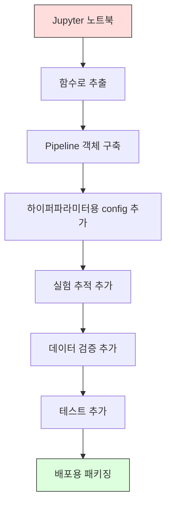

# ML 파이프라인 (ML Pipelines)

> 모델은 제품이 아니다. 파이프라인이 제품이다. 파이프라인은 원시 데이터부터 배포된 예측까지 전부이며, 모든 단계는 재현 가능해야 한다.

**Type:** Build
**Language:** Python
**Prerequisites:** Phase 2, Lesson 12 (Hyperparameter Tuning)
**Time:** ~120 minutes

## 학습 목표 (Learning Objectives)

- 결측치 대체(imputation), 스케일링, 인코딩, 모델 학습을 하나의 재현 가능한 객체로 연결하는 ML 파이프라인을 처음부터 구축합니다
- 데이터 누수(data leakage) 시나리오를 식별하고, 변환기를 학습 데이터에만 적합(fit)시켜 파이프라인이 누수를 어떻게 막는지 설명합니다
- 수치형과 범주형 특성에 서로 다른 전처리를 적용하는 ColumnTransformer를 구성합니다
- 파이프라인 직렬화를 구현하고, 적합된 같은 파이프라인이 학습과 프로덕션에서 동일한 결과를 내는지 입증합니다

## 문제 상황 (The Problem)

노트북이 데이터를 로드하고, 중앙값으로 결측치를 채우고, 특성을 스케일하고, 모델을 학습한 뒤 정확도를 출력합니다. 잘 됩니다. 그래서 배포합니다.

한 달 뒤 누군가 모델을 재학습하니 결과가 달라집니다. 중앙값이 테스트 데이터까지 포함한 전체 데이터셋에서 계산되었습니다(데이터 누수). 스케일링 파라미터가 저장되지 않아 추론이 다른 통계량을 씁니다. 특성 엔지니어링 코드가 학습과 서빙 사이에 복사·붙여넣기되어 서로 어긋났습니다. 범주형 열에 인코더가 본 적 없는 새 값이 프로덕션에 등장했습니다.

가설이 아닙니다. ML 시스템이 프로덕션에서 실패하는 가장 흔한 이유입니다. 파이프라인은 모든 변환 단계를 하나의 순서 있는 재현 가능한 객체로 묶어 이 문제들을 해결합니다.

## 핵심 개념 (The Concept)

### 파이프라인이란 (What a Pipeline Is)

파이프라인은 모델로 이어지는 데이터 변환의 순서 있는 시퀀스입니다. 각 단계는 이전 단계의 출력을 입력으로 받습니다. 전체 파이프라인은 학습 데이터에 한 번 적합됩니다. 추론 시에는 같은 적합된 파이프라인이 새 데이터를 변환하고 예측을 만듭니다.


파이프라인이 보장하는 것:
- 변환기는 학습 데이터에만 적합됩니다(누수 없음)
- 추론 시에도 같은 변환이 적용됩니다
- 전체 객체를 직렬화해 하나의 아티팩트로 배포할 수 있습니다
- 교차 검증이 폴드마다 파이프라인을 적용해 미묘한 누수를 막습니다

### 데이터 누수: 조용한 살인자 (Data Leakage: The Silent Killer)

데이터 누수는 테스트 세트나 미래 정보의 정보가 학습을 오염시킬 때 발생합니다. 파이프라인은 가장 흔한 형태를 막습니다.

**누수(잘못된 방식):**
```python
X = df.drop("target", axis=1)
y = df["target"]

scaler = StandardScaler()
X_scaled = scaler.fit_transform(X)

X_train, X_test = X_scaled[:800], X_scaled[800:]
y_train, y_test = y[:800], y[800:]
```

스케일러가 테스트 데이터를 봤습니다. 평균과 표준편차에 테스트 샘플이 포함됩니다. 정확도 추정치가 부풀려집니다.

**올바른 방식:**
```python
X_train, X_test = X[:800], X[800:]

scaler = StandardScaler()
X_train_scaled = scaler.fit_transform(X_train)
X_test_scaled = scaler.transform(X_test)
```

파이프라인을 쓰면 이런 걸 일일이 생각할 필요가 없습니다. 파이프라인이 자동으로 처리합니다.

### sklearn Pipeline

sklearn의 `Pipeline`은 변환기와 추정기를 연결합니다. `.fit()`, `.predict()`, `.score()`가 모든 단계를 순서대로 적용합니다.

```python
from sklearn.pipeline import Pipeline
from sklearn.preprocessing import StandardScaler
from sklearn.linear_model import LogisticRegression

pipe = Pipeline([
    ("scaler", StandardScaler()),
    ("model", LogisticRegression()),
])

pipe.fit(X_train, y_train)
predictions = pipe.predict(X_test)
```

`pipe.fit(X_train, y_train)`을 호출하면:
1. 스케일러가 X_train에 `fit_transform`을 호출합니다
2. 모델이 스케일된 X_train에 `fit`을 호출합니다

`pipe.predict(X_test)`를 호출하면:
1. 스케일러가 X_test에 `transform`(fit_transform이 아님)을 호출합니다
2. 모델이 스케일된 X_test에 `predict`를 호출합니다

스케일러는 적합 중에 테스트 데이터를 절대 보지 않습니다. 이것이 핵심입니다.

### ColumnTransformer: 열마다 다른 파이프라인 (Different Pipelines for Different Columns)

실제 데이터셋에는 서로 다른 전처리가 필요한 수치형·범주형 열이 있습니다. `ColumnTransformer`가 이를 처리합니다.

```python
from sklearn.compose import ColumnTransformer
from sklearn.preprocessing import StandardScaler, OneHotEncoder
from sklearn.impute import SimpleImputer

numeric_pipe = Pipeline([
    ("impute", SimpleImputer(strategy="median")),
    ("scale", StandardScaler()),
])

categorical_pipe = Pipeline([
    ("impute", SimpleImputer(strategy="most_frequent")),
    ("encode", OneHotEncoder(handle_unknown="ignore")),
])

preprocessor = ColumnTransformer([
    ("num", numeric_pipe, ["age", "income", "score"]),
    ("cat", categorical_pipe, ["city", "gender", "plan"]),
])

full_pipeline = Pipeline([
    ("preprocess", preprocessor),
    ("model", GradientBoostingClassifier()),
])
```

OneHotEncoder의 `handle_unknown="ignore"`는 프로덕션에서 중요합니다. 모델이 본 적 없는 새 범주(예: 새 도시)가 나타나면 크래시 대신 영벡터를 만듭니다.

### 실험 추적 (Experiment Tracking)

파이프라인은 학습을 재현 가능하게 만들지만, 실험 전반에서 무엇이 일어났는지도 추적해야 합니다: 어떤 하이퍼파라미터, 어떤 데이터셋 버전, 어떤 지표, 어떤 코드가 실행되었는지.

**MLflow**는 가장 흔한 오픈소스 솔루션입니다:

```python
import mlflow

with mlflow.start_run():
    mlflow.log_param("max_depth", 5)
    mlflow.log_param("n_estimators", 100)
    mlflow.log_param("learning_rate", 0.1)

    pipe.fit(X_train, y_train)
    accuracy = pipe.score(X_test, y_test)

    mlflow.log_metric("accuracy", accuracy)
    mlflow.sklearn.log_model(pipe, "model")
```

모든 실행이 파라미터, 지표, 아티팩트, 전체 모델과 함께 기록됩니다. 실행을 비교하고, 어떤 실험이든 재현하며, 어떤 모델 버전이든 배포할 수 있습니다.

**Weights & Biases (wandb)**는 호스팅 대시보드로 같은 기능을 제공합니다:

```python
import wandb

wandb.init(project="my-pipeline")
wandb.config.update({"max_depth": 5, "n_estimators": 100})

pipe.fit(X_train, y_train)
accuracy = pipe.score(X_test, y_test)

wandb.log({"accuracy": accuracy})
```

### 모델 버전 관리 (Model Versioning)

실험 추적 다음에는 모델 버전을 관리해야 합니다. 프로덕션에 있는 모델은? 스테이징은? 지난주 모델은?

MLflow의 Model Registry가 제공하는 것:
- **버전 추적:** 저장된 모델마다 버전 번호가 부여됩니다
- **스테이지 전환:** "Staging", "Production", "Archived"
- **승인 워크플로:** 모델은 명시적으로 프로덕션으로 승격되어야 합니다
- **롤백:** 이전 버전으로 즉시 전환

### DVC로 데이터 버전 관리 (Data Versioning with DVC)

코드는 git으로 버전 관리합니다. 데이터도 버전 관리해야 하지만 git은 대용량 파일을 다루기 어렵습니다. DVC(Data Version Control)가 이를 해결합니다.

```
dvc init
dvc add data/training.csv
git add data/training.csv.dvc data/.gitignore
git commit -m "Track training data"
dvc push
```

DVC는 실제 데이터를 원격 스토리지(S3, GCS, Azure)에 두고, 해시를 기록한 작은 `.dvc` 파일을 git에 둡니다. git 커밋을 checkout하면 `dvc checkout`이 그때 쓰인 정확한 데이터를 복원합니다.

즉 모든 git 커밋이 코드와 데이터를 함께 고정합니다. 완전한 재현성입니다.

### 재현 가능한 실험 (Reproducible Experiments)

재현 가능한 실험에는 네 가지가 필요합니다:

1. **고정된 난수 시드:** numpy, random, 프레임워크(torch, sklearn)의 시드를 설정
2. **고정된 의존성:** 정확한 버전이 적힌 requirements.txt 또는 poetry.lock
3. **버전 관리된 데이터:** DVC 또는 유사 도구
4. **설정 파일:** 모든 하이퍼파라미터를 하드코딩이 아닌 config에

```python
import numpy as np
import random

def set_seed(seed=42):
    random.seed(seed)
    np.random.seed(seed)
    try:
        import torch
        torch.manual_seed(seed)
        torch.cuda.manual_seed_all(seed)
        torch.backends.cudnn.deterministic = True
    except ImportError:
        pass
```

### 노트북에서 프로덕션 파이프라인으로 (From Notebook to Production Pipeline)



일반적인 진행 순서:

1. **노트북 탐색:** 빠른 실험, 시각화, 특성 아이디어
2. **함수로 추출:** 전처리, 특성 엔지니어링, 평가를 모듈로 이동
3. **Pipeline 구축:** 변환을 sklearn Pipeline 또는 커스텀 클래스로 연결
4. **설정 관리:** 모든 하이퍼파라미터를 YAML/JSON config로 이동
5. **실험 추적:** MLflow 또는 wandb 로깅 추가
6. **데이터 검증:** 학습 전 스키마, 분포, 결측 패턴 확인
7. **테스트:** 변환기 단위 테스트, 전체 파이프라인 통합 테스트
8. **배포:** 파이프라인 직렬화, API(FastAPI, Flask)로 래핑, 컨테이너화

### 흔한 파이프라인 실수 (Common Pipeline Mistakes)

| 실수 | 왜 나쁜가 | 해결 |
|---------|-------------|-----|
| 분할 전에 전체 데이터에 적합 | 데이터 누수 | Pipeline과 cross_val_score 사용 |
| 파이프라인 밖 특성 엔지니어링 | 학습 vs 서빙 변환이 달라짐 | 모든 변환을 Pipeline 안에 |
| 미지 범주 미처리 | 새 값에서 프로덕션 크래시 | OneHotEncoder(handle_unknown="ignore") |
| 하드코딩된 열 이름 | 스키마 변경 시 깨짐 | config의 열 이름 목록 사용 |
| 데이터 검증 없음 | 나쁜 데이터에 조용히 잘못된 예측 | 예측 전 스키마 검사 추가 |
| 학습/서빙 스큐 | 프로덕션에서 다른 특성을 봄 | 둘 다에 하나의 Pipeline 객체 |

```figure
f3-pipeline-flow
```

## 직접 구현하기 (Build It)

`code/pipeline.py`의 코드는 처음부터 완전한 ML 파이프라인을 구축합니다:

### 1단계: 커스텀 변환기 (Custom Transformer)

```python
class CustomTransformer:
    def __init__(self):
        self.means = None
        self.stds = None

    def fit(self, X):
        self.means = np.mean(X, axis=0)
        self.stds = np.std(X, axis=0)
        self.stds[self.stds == 0] = 1.0
        return self

    def transform(self, X):
        return (X - self.means) / self.stds

    def fit_transform(self, X):
        return self.fit(X).transform(X)
```

### 2단계: 처음부터 만드는 Pipeline (Pipeline from Scratch)

```python
class PipelineFromScratch:
    def __init__(self, steps):
        self.steps = steps

    def fit(self, X, y=None):
        X_current = X.copy()
        for name, step in self.steps[:-1]:
            X_current = step.fit_transform(X_current)
        name, model = self.steps[-1]
        model.fit(X_current, y)
        return self

    def predict(self, X):
        X_current = X.copy()
        for name, step in self.steps[:-1]:
            X_current = step.transform(X_current)
        name, model = self.steps[-1]
        return model.predict(X_current)
```

### 3단계: 파이프라인으로 교차 검증 (Cross-Validation with Pipeline)

코드는 파이프라인과 교차 검증이 데이터 누수를 어떻게 막는지 보여 줍니다: 스케일러가 각 폴드의 학습 데이터에 따로 적합됩니다.

### 4단계: sklearn으로 완전한 프로덕션 파이프라인 (Full Production Pipeline with sklearn)

`ColumnTransformer`, 여러 전처리 경로, 모델을 갖춘 완전한 파이프라인을 적절한 교차 검증과 실험 로깅으로 학습합니다.

## 산출물 (Ship It)

이 레슨이 만드는 것:
- `outputs/prompt-ml-pipeline.md` -- ML 파이프라인 구축·디버깅용 스킬
- `code/pipeline.py` -- 처음부터 sklearn까지 완전한 파이프라인

## 연습 문제 (Exercises)

1. 수치형 열 3개와 범주형 열 2개가 있는 데이터셋을 처리하는 파이프라인을 만드세요. `ColumnTransformer`로 수치형에는 중앙값 대체 + 스케일링, 범주형에는 최빈값 대체 + 원-핫 인코딩을 적용하세요. 5-폴드 교차 검증으로 학습하세요.

2. 의도적으로 데이터 누수를 넣으세요: 분할 전에 전체 데이터셋에 스케일러를 적합하세요. 누수된 교차 검증 점수와 파이프라인 교차 검증 점수(깨끗함)를 비교하세요. 차이가 얼마나 큰가요?

3. `joblib.dump`로 파이프라인을 직렬화하세요. 별도 스크립트에서 로드해 예측을 실행하세요. 예측이 동일한지 확인하세요.

4. 가장 중요한 수치형 열 두 개에 다항 특성(차수 2)을 만드는 커스텀 변환기를 파이프라인에 추가하세요. 파이프라인 어디에 넣어야 할까요?

5. 파이프라인용 MLflow 추적을 설정하세요. 서로 다른 하이퍼파라미터로 실험 5번을 돌리세요. MLflow UI(`mlflow ui`)로 실행을 비교하고 최고 모델을 고르세요.

## 핵심 용어 (Key Terms)

| 용어 | 사람들이 말하는 것 | 실제 의미 |
|------|----------------|----------------------|
| Pipeline | "변환 + 모델의 체인" | 누수를 막기 위해 하나의 단위로 적용되는, 적합된 변환기와 모델의 순서 있는 시퀀스 |
| Data leakage | "테스트 정보가 학습으로 새어 들어감" | 학습 세트 밖의 정보를 써서 모델을 만들어 성능 추정치를 부풀리는 것 |
| ColumnTransformer | "열마다 다른 전처리" | 열의 서로 다른 부분 집합에 서로 다른 파이프라인을 적용하고 결과를 합침 |
| Experiment tracking | "실행을 로깅" | 매 학습 실행의 파라미터, 지표, 아티팩트, 코드 버전을 기록 |
| MLflow | "모델을 추적하고 배포" | 실험 추적, 모델 레지스트리, 배포를 위한 오픈소스 플랫폼 |
| DVC | "데이터용 Git" | 대용량 데이터 파일용 버전 관리. 해시는 git에, 데이터는 원격 스토리지에 |
| Model registry | "모델 버전 카탈로그" | staging, production, archived 같은 스테이지 라벨로 모델 버전을 추적하는 시스템 |
| Training/serving skew | "노트북에선 됐는데" | 학습과 추론에서 데이터 처리 방식이 달라 조용히 오류가 나는 것 |
| Reproducibility | "같은 코드, 같은 결과" | 같은 코드·데이터·설정으로 동일한 결과를 얻는 능력 |

## 더 읽어보기 (Further Reading)

- [scikit-learn Pipeline docs](https://scikit-learn.org/stable/modules/compose.html) -- 공식 파이프라인 레퍼런스
- [MLflow documentation](https://mlflow.org/docs/latest/index.html) -- 실험 추적과 모델 레지스트리
- [DVC documentation](https://dvc.org/doc) -- 데이터 버전 관리
- [Sculley et al., Hidden Technical Debt in Machine Learning Systems (2015)](https://papers.nips.cc/paper/2015/hash/86df7dcfd896fcaf2674f757a2463eba-Abstract.html) -- ML 시스템 복잡도에 대한 기념비적 논문
- [Google ML Best Practices: Rules of ML](https://developers.google.com/machine-learning/guides/rules-of-ml) -- 실무 프로덕션 ML 조언
