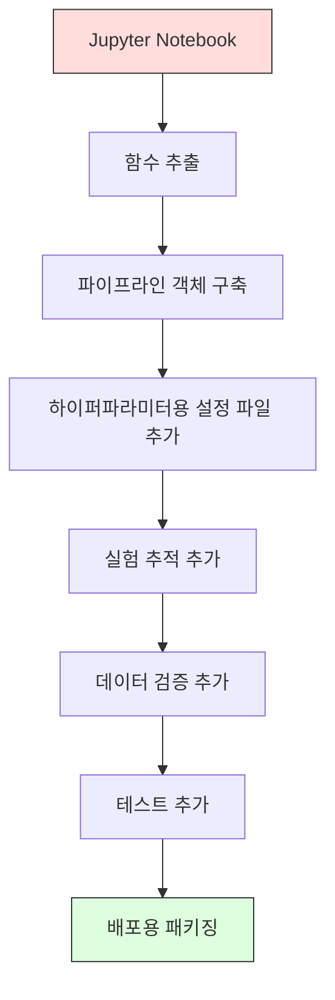

# ML 파이프라인

> 모델은 제품이 아닙니다. 파이프라인이 제품입니다. 파이프라인은 원시 데이터부터 배포된 예측까지 모든 단계를 포함하며, 모든 단계는 재현 가능해야 합니다.

**유형:** Build
**언어:** Python
**선수 요건:** 2단계, 12강 (하이퍼파라미터 튜닝)
**시간:** 약 120분

## 학습 목표

- 결측치 채우기, 스케일링, 인코딩, 모델 학습을 단일 재현 가능한 객체로 연결하는 ML 파이프라인을 처음부터 구축해 보세요
- 데이터 누수 시나리오를 식별하고, 파이프라인이 변환기를 학습 데이터에만 적용하여 이를 방지하는 방식을 설명해 보세요
- 수치형 및 범주형 특징에 서로 다른 전처리를 적용하는 ColumnTransformer를 구성해 보세요
- 파이프라인 직렬화를 구현하고, 동일한 학습된 파이프라인이 학습 환경과 프로덕션 환경에서 동일한 결과를 생성함을 입증해 보세요

## 문제점

데이터를 로드하고, 결측치를 중앙값으로 채우고, 특징을 스케일링하고, 모델을 학습하고, 정확도를 출력하는 노트북이 있습니다. 잘 작동합니다. 이를 배포합니다.

한 달 후, 누군가 모델을 재학습하고 다른 결과를 얻습니다. 중앙값이 테스트 데이터를 포함한 전체 데이터셋에서 계산되었습니다(데이터 누수). 스케일링 매개변수가 저장되지 않아 추론 시 다른 통계값이 사용됩니다. 특징 엔지니어링 코드가 학습과 서빙 사이에 복사-붙여넣기되었으며, 사본들이 서로 달라졌습니다. 범주형 열에 인코더가 본 적 없는 새로운 값이 프로덕션에서 나타났습니다.

이것은 가설이 아닙니다. ML 시스템이 프로덕션에서 실패하는 가장 흔한 이유입니다. 파이프라인은 모든 변환 단계를 단일하고 순서 있는 재현 가능한 객체로 패키징하여 이러한 문제를 모두 해결합니다.

## 개념

### 파이프라인이란 무엇인가

파이프라인은 데이터 변환의 순서 있는 시퀀스이며, 그 뒤에 모델이 따라옵니다. 각 단계는 이전 단계의 출력을 입력으로 받습니다. 전체 파이프라인은 학습 데이터에서 한 번 학습됩니다. 추론 시에는 동일한 학습된 파이프라인이 새로운 데이터를 변환하고 예측을 생성합니다.


파이프라인이 보장하는 사항:
- 변환은 학습 데이터에만 적용됩니다 (누수 없음)
- 추론 시에도 동일한 변환이 적용됩니다
- 전체 객체를 하나의 아티팩트로 직렬화하여 배포할 수 있습니다
- 교차 검증은 각 폴드마다 파이프라인을 적용하여 미묘한 누수를 방지합니다

### 데이터 누수: 조용한 킬러

데이터 누수는 테스트 세트나 미래 데이터의 정보가 학습 데이터를 오염시킬 때 발생합니다. 파이프라인은 가장 흔한 형태의 누수를 방지합니다.

**누수 발생 (잘못된 방식):**
```python
X = df.drop("target", axis=1)
y = df["target"]

scaler = StandardScaler()
X_scaled = scaler.fit_transform(X)

X_train, X_test = X_scaled[:800], X_scaled[800:]
y_train, y_test = y[:800], y[800:]
```

스케일러가 테스트 데이터를 보게 됩니다. 평균과 표준 편차에 테스트 샘플이 포함됩니다. 이는 정확도 추정치를 부풀립니다.

**올바른 방식:**
```python
X_train, X_test = X[:800], X[800:]

scaler = StandardScaler()
X_train_scaled = scaler.fit_transform(X_train)
X_test_scaled = scaler.transform(X_test)
```

파이프라인을 사용하면 이 문제를 고려할 필요가 없습니다. 파이프라인이 자동으로 처리합니다.

### sklearn Pipeline

sklearn의 `Pipeline`는 변환기와 추정기를 연결합니다. 모든 단계를 순서대로 적용하는 `.fit()`, `.predict()`, `.score()`를 노출합니다.

```python
from sklearn.pipeline import Pipeline
from sklearn.preprocessing import StandardScaler
from sklearn.linear_model import LogisticRegression

pipe = Pipeline([
    ("scaler", StandardScaler()),
    ("model", LogisticRegression()),
])

pipe.fit(X_train, y_train)
predictions = pipe.predict(X_test)
```

`pipe.fit(X_train, y_train)`를 호출할 때:
1. 스케일러가 X_train에 `fit_transform`를 호출합니다
2. 모델이 스케일링된 X_train에 `fit`를 호출합니다

`pipe.predict(X_test)`를 호출할 때:
1. 스케일러가 X_test에 `transform`를 호출합니다 (fit_transform가 아님)
2. 모델이 스케일링된 X_test에 `predict`를 호출합니다

스케일러는 학습(fitting) 중에 테스트 데이터를 보지 않습니다. 이것이 핵심입니다.

### ColumnTransformer: 컬럼별 파이프라인

실제 데이터셋은 서로 다른 전처리가 필요한 수치형 및 범주형 컬럼을 포함합니다. `ColumnTransformer`가 이를 처리합니다.

```python
from sklearn.compose import ColumnTransformer
from sklearn.preprocessing import StandardScaler, OneHotEncoder
from sklearn.impute import SimpleImputer

numeric_pipe = Pipeline([
    ("impute", SimpleImputer(strategy="median")),
    ("scale", StandardScaler()),
])

categorical_pipe = Pipeline([
    ("impute", SimpleImputer(strategy="most_frequent")),
    ("encode", OneHotEncoder(handle_unknown="ignore")),
])

preprocessor = ColumnTransformer([
    ("num", numeric_pipe, ["age", "income", "score"]),
    ("cat", categorical_pipe, ["city", "gender", "plan"]),
])

full_pipeline = Pipeline([
    ("preprocess", preprocessor),
    ("model", GradientBoostingClassifier()),
])
```

OneHotEncoder의 `handle_unknown="ignore"`는 프로덕션 환경에서 중요합니다. 새로운 범주(모델이 본 적 없는 도시)가 나타나면, 충돌하지 않고 제로 벡터를 생성합니다.

### 실험 추적

파이프라인은 학습을 재현 가능하게 만들지만, 실험 전반에 걸쳐 발생한 사항을 추적해야 합니다: 어떤 하이퍼파라미터가 사용되었는지, 어떤 데이터셋 버전이 사용되었는지, 지표는 무엇이었는지, 어떤 코드가 실행되었는지.

**MLflow**는 가장 일반적인 오픈소스 솔루션입니다:

```python
import mlflow

with mlflow.start_run():
    mlflow.log_param("max_depth", 5)
    mlflow.log_param("n_estimators", 100)
    mlflow.log_param("learning_rate", 0.1)

    pipe.fit(X_train, y_train)
    accuracy = pipe.score(X_test, y_test)

    mlflow.log_metric("accuracy", accuracy)
    mlflow.sklearn.log_model(pipe, "model")
```

모든 실행은 매개변수, 지표, 산출물, 전체 모델과 함께 기록됩니다. 실행을 비교하고, 모든 실험을 재현하며, 모든 모델 버전을 배포할 수 있습니다.

**Weights & Biases (wandb)**는 호스팅된 대시보드와 동일한 기능을 제공합니다:

```python
import wandb

wandb.init(project="my-pipeline")
wandb.config.update({"max_depth": 5, "n_estimators": 100})

pipe.fit(X_train, y_train)
accuracy = pipe.score(X_test, y_test)

wandb.log({"accuracy": accuracy})
```

### 모델 버전 관리

실험 추적 후, 모델 버전을 관리해야 합니다. 어떤 모델이 프로덕션에 있나요? 어떤 모델이 스테이징에 있나요? 지난주에는 어떤 모델이었나요?

MLflow의 모델 레지스트리는 다음을 제공합니다:
- **버전 추적:** 저장된 모든 모델은 버전 번호를 부여받습니다
- **단계 전환:** "Staging", "Production", "Archived"
- **승인 워크플로:** 모델은 프로덕션으로 명시적으로 승격되어야 합니다
- **롤백:** 이전 버전으로 즉시 되돌릴 수 있습니다

### DVC를 이용한 데이터 버전 관리

코드는 git으로 버전 관리됩니다. 데이터도 버전 관리되어야 하지만, git은 대용량 파일을 처리할 수 없습니다. DVC (Data Version Control)가 이 문제를 해결합니다.

```
dvc init
dvc add data/training.csv
git add data/training.csv.dvc data/.gitignore
git commit -m "Track training data"
dvc push
```

DVC는 실제 데이터를 원격 저장소(S3, GCS, Azure)에 저장하고, 해시를 기록하는 작은 `.dvc` 파일을 git에 유지합니다. git 커밋을 체크아웃하면, `dvc checkout`이 사용된 정확한 데이터를 복원합니다.

이는 모든 git 커밋이 코드와 데이터를 모두 고정한다는 의미입니다. 완전한 재현성이 보장됩니다.

### 재현 가능한 실험

재현 가능한 실험에는 네 가지가 필요합니다:

1. **고정된 랜덤 시드:** numpy, random 및 프레임워크(torch, sklearn)의 시드를 설정합니다
2. **고정된 의존성:** 정확한 버전이 지정된 requirements.txt 또는 poetry.lock
3. **버전 관리된 데이터:** DVC 또는 유사한 도구
4. **설정 파일:** 모든 하이퍼파라미터는 하드코딩하지 않고 설정 파일에 포함합니다

```python
import numpy as np
import random

def set_seed(seed=42):
    random.seed(seed)
    np.random.seed(seed)
    try:
        import torch
        torch.manual_seed(seed)
        torch.cuda.manual_seed_all(seed)
        torch.backends.cudnn.deterministic = True
    except ImportError:
        pass
```

### 노트북에서 프로덕션 파이프라인으로



일반적인 진행 과정:

1. **노트북 탐색:** 빠른 실험, 시각화, 기능 아이디어
2. **함수 추출:** 전처리, 특징 공학, 평가를 모듈로 이동
3. **파이프라인 구축:** 변환을 sklearn Pipeline이나 커스텀 클래스로 연결
4. **설정 관리:** 모든 하이퍼파라미터를 YAML/JSON 설정으로 이동
5. **실험 추적:** MLflow나 wandb 로깅 추가
6. **데이터 검증:** 학습 전에 스키마, 분포, 결측값 패턴을 확인
7. **테스트:** 변환기에 대한 단위 테스트, 전체 파이프라인에 대한 통합 테스트
8. **배포:** 파이프라인을 직렬화하고 API(FastAPI, Flask)로 감싼 후 컨테이너화

### 공통 파이프라인 실수

| 실수 | 왜 나쁜가 | 해결 방법 |
|---------|-------------|-----|
| 분할 전에 전체 데이터에 피팅 | 데이터 누수 | Pipeline과 cross_val_score 사용 |
| 파이프라인 외부에서 특징 공학 | 학습과 서빙 시 변환이 다름 | 모든 변환을 Pipeline에 포함 |
| 알 수 없는 범주 처리하지 않음 | 새로운 값으로 인한 프로덕션 충돌 | OneHotEncoder(handle_unknown="ignore") |
| 컬럼 이름 하드코딩 | 스키마 변경 시 깨짐 | 설정에서 컬럼 이름 목록 사용 |
| 데이터 검증 없음 | 잘못된 데이터에 대해 조용히 잘못된 예측 | 예측 전에 스키마 검사 추가 |
| 학습/서빙 편향 | 모델이 프로덕션에서 다른 특징을 봄 | 둘 다 하나의 Pipeline 객체 사용 |

```figure
f3-pipeline-flow
```

## 구현하기

`code/pipeline.py`의 코드는 ML 파이프라인을 처음부터 완전히 구축합니다:

### 1단계: 커스텀 변환기

```python
class CustomTransformer:
    def __init__(self):
        self.means = None
        self.stds = None

    def fit(self, X):
        self.means = np.mean(X, axis=0)
        self.stds = np.std(X, axis=0)
        self.stds[self.stds == 0] = 1.0
        return self

    def transform(self, X):
        return (X - self.means) / self.stds

    def fit_transform(self, X):
        return self.fit(X).transform(X)
```

### 2단계: 처음부터 만드는 파이프라인

```python
class PipelineFromScratch:
    def __init__(self, steps):
        self.steps = steps

    def fit(self, X, y=None):
        X_current = X.copy()
        for name, step in self.steps[:-1]:
            X_current = step.fit_transform(X_current)
        name, model = self.steps[-1]
        model.fit(X_current, y)
        return self

    def predict(self, X):
        X_current = X.copy()
        for name, step in self.steps[:-1]:
            X_current = step.transform(X_current)
        name, model = self.steps[-1]
        return model.predict(X_current)
```

### 3단계: 파이프라인을 사용한 교차 검증

코드는 파이프라인을 사용한 교차 검증이 데이터 누수를 방지하는 방식을 보여줍니다: 스케일러는 각 폴드의 학습 데이터에 대해 별도로 피팅됩니다.

### 4단계: sklearn을 사용한 완전한 프로덕션 파이프라인

`ColumnTransformer`, 여러 전처리 경로, 모델을 포함하는 완전한 파이프라인으로, 적절한 교차 검증과 실험 로깅으로 학습됩니다.

## 출시하기

이 강의는 다음을 생성합니다:
- `outputs/prompt-ml-pipeline.md` -- ML 파이프라인을 구축하고 디버깅하는 스킬
- `code/pipeline.py` -- 스크래치부터 sklearn까지 완전한 파이프라인

## 연습 문제

1. 3개의 수치형 열과 2개의 범주형 열을 가진 데이터셋을 처리하는 파이프라인을 구축해 보세요. `ColumnTransformer`를 사용하여 수치형 열에는 중앙값 대체 + 스케일링을, 범주형 열에는 최빈값 대체 + 원-핫 인코딩을 적용합니다. 5-폴드 교차 검증으로 학습합니다.

2. 데이터 누수를 의도적으로 도입해 보세요: 분할 전에 전체 데이터셋에 대해 스케일러를 피팅합니다. 누수가 있는 교차 검증 점수(누수)와 파이프라인 교차 검증 점수(클린)를 비교합니다. 차이점은 얼마나 큰가요?

3. 파이프라인을 `joblib.dump`로 직렬화합니다. 별도의 스크립트에서 로드하여 예측을 실행합니다. 예측 결과가 동일한지 확인합니다.

4. 파이프라인에 가장 중요한 두 수치형 열에 대해 다항식 특성(차수 2)을 생성하는 커스텀 변환기를 추가합니다. 파이프라인의 어디에 배치해야 할까요?

5. 파이프라인에 MLflow 추적을 설정합니다. 서로 다른 하이퍼파라미터로 5번의 실험을 실행합니다. MLflow UI (`mlflow ui`)를 사용하여 실행을 비교하고 최적의 모델을 선택합니다.

## 핵심 용어

| 용어 | 사람들이 말하는 것 | 실제 의미 |
|------|----------------|----------------------|
| 파이프라인 | "변환 + 모델의 연쇄" | 누수를 방지하기 위해 하나의 단위로 적용되는, 피팅된 변환기와 모델의 순서 있는 시퀀스 |
| 데이터 누수 | "테스트 정보가 학습에 누수됨" | 학습 세트 외부의 정보를 사용하여 모델을 구축함으로써 성능 추정치를 부풀리는 것 |
| ColumnTransformer | "열별 다른 전처리" | 열의 하위 집합에 서로 다른 파이프라인을 적용하고 결과를 결합합니다 |
| 실험 추적 | "실행 로깅" | 모든 학습 실행에 대해 매개변수, 지표, 산출물 및 코드 버전을 기록하는 것 |
| MLflow | "모델 추적 및 배포" | 실험 추적, 모델 레지스트리 및 배포를 위한 오픈소스 플랫폼 |
| DVC | "데이터용 Git" | 대용량 데이터 파일에 대한 버전 관리 시스템으로, 해시를 git에 저장하고 데이터를 원격 저장소에 저장합니다 |
| 모델 레지스트리 | "모델 버전 카탈로그" | 스테이지 레이블(staging, production, archived)과 함께 모델 버전을 추적하는 시스템 |
| 학습/서빙 편향 | "노트북에서는 잘 작동했어요" | 학습 중과 추론 중 데이터 처리 방식의 차이로 인해 발생하는 조용한 오류 |
| 재현성 | "같은 코드, 같은 결과" | 동일한 코드, 데이터, 구성으로 동일한 결과를 얻을 수 있는 능력 |

## 추가 읽기

- [scikit-learn Pipeline docs](https://scikit-learn.org/stable/modules/compose.html) -- 공식 파이프라인 참조
- [MLflow documentation](https://mlflow.org/docs/latest/index.html) -- 실험 추적 및 모델 레지스트리
- [DVC documentation](https://dvc.org/doc) -- 데이터 버전 관리
- [Sculley et al., Hidden Technical Debt in Machine Learning Systems (2015)](https://papers.nips.cc/paper/2015/hash/86df7dcfd896fcaf2674f757a2463eba-Abstract.html) -- ML 시스템 복잡성에 관한 seminal 논문
- [Google ML Best Practices: Rules of ML](https://developers.google.com/machine-learning/guides/rules-of-ml) -- 실용적인 프로덕션 ML 조언
