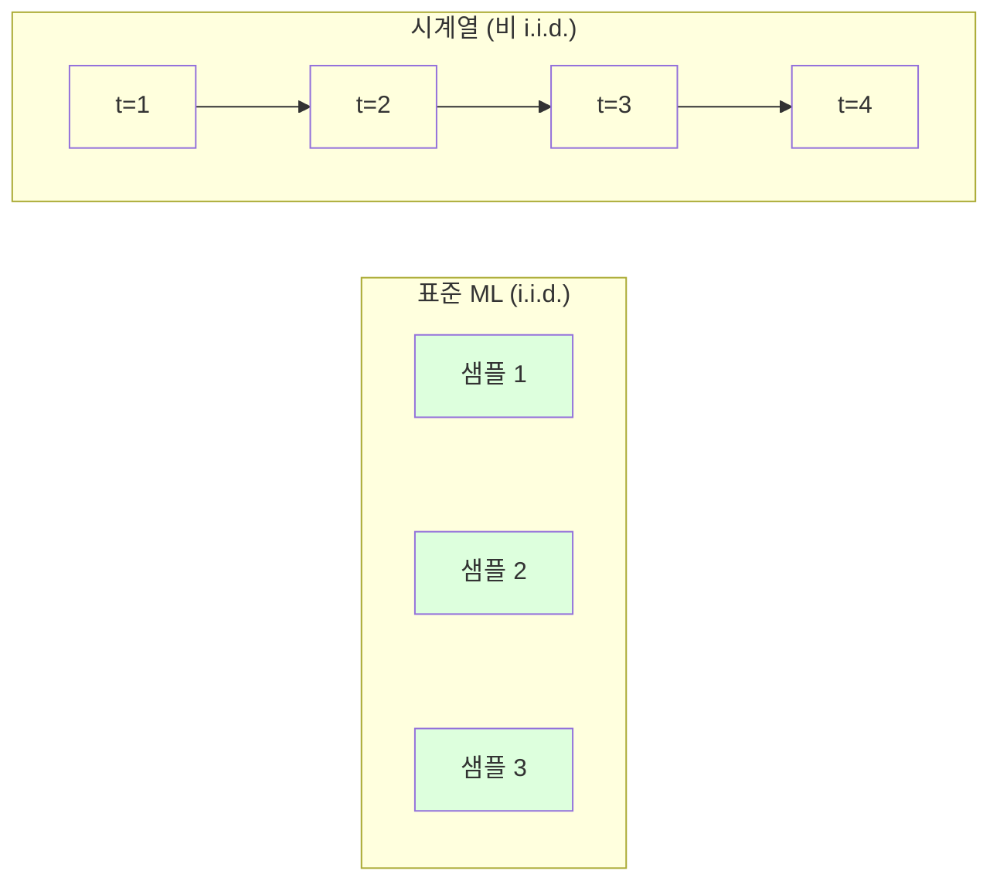
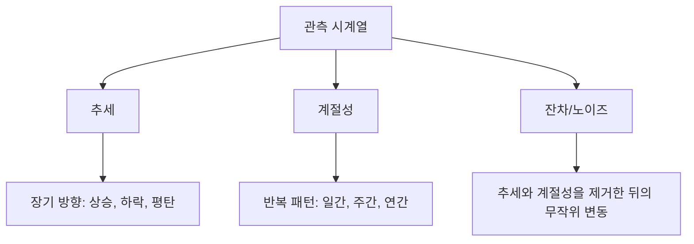
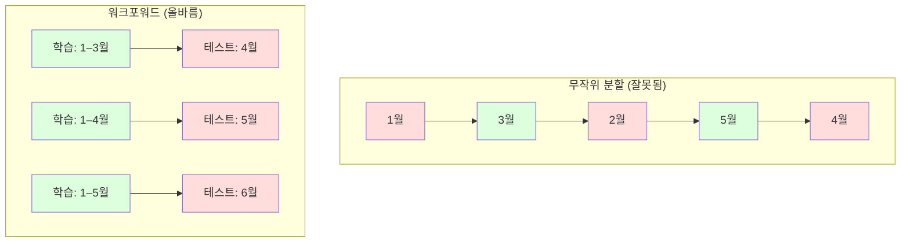

# 시계열 기초 (Time Series Fundamentals)

> 과거 성과가 미래 결과를 예측합니다 -- 먼저 정상성(stationarity)을 확인한다면요.

**Type:** Build
**Language:** Python
**Prerequisites:** Phase 2, Lessons 01-09
**Time:** ~90 minutes

## 학습 목표 (Learning Objectives)

- 시계열을 추세(trend), 계절성(seasonality), 잔차(residual) 성분으로 분해하고 정상성을 검정합니다
- 시차(lag) 특성과 롤링 통계를 구현하여 시계열을 지도 학습 문제로 변환합니다
- 미래 데이터가 학습에 누수되지 않도록 하는 워크포워드(walk-forward) 검증 프레임워크를 구축합니다
- 시계열에서 무작위 학습/테스트 분할이 왜 유효하지 않은지 설명하고, 적절한 시간 분할과의 성능 격차를 보여 줍니다

## 문제 상황 (The Problem)

시간 순서로 정렬된 데이터가 있습니다. 일별 매출, 시간별 온도, 분당 CPU 사용량, 주간 주가. 다음 값, 다음 주, 다음 분기를 예측하고 싶습니다.

표준 ML 도구상자를 꺼냅니다: 무작위 학습/테스트 분할, 교차 검증, 특성 행렬 입력, 예측 출력. 매 단계가 틀립니다.

시계열은 표준 ML이 의존하는 가정을 깨뜨립니다. 샘플은 독립이 아닙니다 -- 오늘의 온도는 어제의 온도에 의존합니다. 무작위 분할은 미래 정보를 과거에 누수합니다. 백테스트에서 훌륭해 보이는 특성은, 시간에 따라 바뀌는 패턴에 의존하기 때문에 프로덕션에서 실패합니다.

무작위 교차 검증으로 95% 정확도를 내는 모델이 적절한 시간 기반 평가로는 55%일 수 있습니다. 그 차이는 사소한 기술 문제가 아닙니다. 종이 위에서만 되는 모델과 프로덕션에서 되는 모델의 차이입니다.

이 레슨은 기초를 다룹니다: 시간 데이터가 무엇이 다른지, 모델을 정직하게 평가하는 방법, 표준 ML 모델이 소비할 수 있는 특성으로 시계열을 바꾸는 방법.

## 핵심 개념 (The Concept)

### 시계열을 다르게 만드는 것

표준 ML은 i.i.d. -- 독립이고 동일하게 분포됨(independent and identically distributed) -- 을 가정합니다. 각 샘플은 같은 분포에서, 다른 샘플과 독립적으로 뽑힙니다. 시계열은 둘 다 위반합니다:

- **독립이 아님.** 오늘의 주가는 어제의 주가에 의존합니다. 이번 주 매출은 지난주 매출과 상관됩니다.
- **동일하게 분포되지 않음.** 분포가 시간에 따라 이동합니다. 12월 매출은 3월 매출과 다르게 보입니다.

이 위반은 사소하지 않습니다. 특성을 만드는 방식, 모델을 평가하는 방식, 어떤 알고리즘이 통하는지를 바꿉니다.



표준 ML에서 샘플은 서로 바꿀 수 있습니다. 섞어도 달라지는 것이 없습니다. 시계열에서는 순서가 전부입니다. 섞으면 신호가 파괴됩니다.

### 시계열의 성분

모든 시계열은 다음의 조합입니다:



- **추세(Trend)**: 장기 방향. 매출이 연 10% 성장. 지구 온도 상승.
- **계절성(Seasonality)**: 고정 간격의 반복 패턴. 소매 매출이 12월에 급증. 에어컨 사용이 7월에 정점.
- **잔차(Residual)**: 추세와 계절성을 제거한 뒤 남은 것. 잔차가 백색 잡음처럼 보이면 분해가 신호를 잘 잡은 것입니다.

### 정상성 (Stationarity)

시계열은 통계적 성질(평균, 분산, 자기상관)이 시간에 따라 변하지 않으면 정상(stationary)입니다. 대부분의 예측 방법은 정상성을 가정합니다.

**왜 중요한가:** 비정상 시계열은 평균이 표류합니다. 1월 데이터로 학습한 모델은 2월이 보일 평균과 다른 평균을 배웠습니다. 체계적으로 틀리게 됩니다.

**확인 방법:** 윈도우에 대해 롤링 평균과 롤링 표준편차를 계산합니다. 표류하면 시계열은 비정상입니다.

**고치는 방법:** 차분(differencing). 원시 값 대신 연속 값 사이의 변화를 모델링합니다:

```
diff[t] = value[t] - value[t-1]
```

한 번의 차분이 시계열을 정상으로 만들지 못하면 다시 적용합니다(2차 차분). 대부분의 실세계 시계열은 최대 두 번이면 됩니다.

**예시:**

원본 시계열: [100, 102, 106, 112, 120]
1차 차분:  [2, 4, 6, 8] (여전히 상승 추세)
2차 차분:  [2, 2, 2] (상수 -- 정상)

원본 시계열은 이차 추세가 있었습니다. 1차 차분은 선형 추세로 바꿨고, 2차 차분은 평탄하게 만들었습니다. 실무에서는 두 번보다 더 필요한 경우는 드뭅니다.

**정식 검정:** Augmented Dickey-Fuller (ADF) 검정이 정상성의 표준 통계 검정입니다. 귀무가설은 "시계열이 비정상이다"입니다. p-value가 0.05 미만이면 귀무를 기각하고 정상이라고 결론낼 수 있습니다. ADF는 점근 분포표가 필요해 처음부터 구현하지 않지만, 코드의 롤링 통계 접근은 실용적인 시각적 확인을 줍니다.

### 자기상관 (Autocorrelation)

자기상관은 시점 t의 값이 시점 t-k(과거 k 스텝)의 값과 얼마나 상관되는지를 잽니다. 자기상관 함수(ACF)는 각 시차 k에 대해 이 상관을 그립니다.

**ACF가 알려 주는 것:**
- 시계열이 얼마나 멀리까지 기억하는지. ACF가 시차 5 이후에 0으로 떨어지면, 5 스텝보다 오래된 값은 무관합니다.
- 계절성이 있는지. ACF가 시차 12에서 스파이크하면(월별 데이터) 연간 계절성이 있습니다.
- 시차 특성을 몇 개 만들지. ACF가 무시할 수 있을 때까지의 시차를 사용합니다.

**PACF (부분 자기상관 함수, Partial Autocorrelation Function)**는 간접 상관을 제거합니다. 오늘이 3일 전과 상관되는 이유가 둘 다 어제와 상관되기 때문이라면, 시차 3의 PACF는 0이지만 시차 3의 ACF는 그렇지 않습니다.

### 시차 특성: 시계열을 지도 학습으로 바꾸기

표준 ML 모델은 특성 행렬 X와 타깃 y가 필요합니다. 시계열은 값의 단일 열을 줍니다. 다리는 시차 특성입니다.

시계열 [10, 12, 14, 13, 15]를 가져와서 lag-1, lag-2 특성을 만듭니다:

| lag_2 | lag_1 | target |
|-------|-------|--------|
| 10    | 12    | 14     |
| 12    | 14    | 13     |
| 14    | 13    | 15     |

이제 표준 회귀 문제가 됩니다. 어떤 ML 모델이든(선형 회귀, 랜덤 포레스트, 그래디언트 부스팅) 시차로부터 타깃을 예측할 수 있습니다.

추가로 공학할 수 있는 특성:
- **롤링 통계:** 최근 k개 값에 대한 mean, std, min, max
- **캘린더 특성:** 요일, 월, is_holiday, is_weekend
- **차분 값:** 이전 스텝 대비 변화
- **확장 통계:** 누적 평균, 누적 합
- **비율 특성:** 현재 값 / 롤링 평균 (최근 평균에서 얼마나 먼지)
- **상호작용 특성:** lag_1 * day_of_week (모멘텀에 대한 요일 효과)

**시차는 몇 개?** 자기상관 함수를 쓰세요. ACF가 시차 10까지 유의하면 최소 10개 시차를 쓰세요. 주간 계절성이 있으면 lag 7(그리고 가능하면 14)을 포함하세요. 시차가 많을수록 모델에 더 많은 이력을 주지만, 맞출 특성도 늘어 과적합 위험이 커집니다.

**타깃 정렬 함정.** 시차 특성을 만들 때 타깃은 시점 t의 값이어야 하고, 모든 특성은 시점 t-1 또는 그 이전의 값을 써야 합니다. 실수로 시점 t의 값을 특성에 넣으면 완벽한 예측기 -- 그리고 완전히 쓸모없는 모델이 됩니다. 시계열 특성 공학에서 가장 흔한 버그입니다.

### 워크포워드 검증 (Walk-Forward Validation)

이 레슨에서 가장 중요한 개념입니다. 표준 k-fold 교차 검증은 샘플을 학습과 테스트에 무작위로 배정합니다. 시계열에서는 미래 정보가 누수됩니다.



워크포워드 검증:
1. 시점 t까지의 데이터로 학습
2. 시점 t+1을 예측 (또는 다단계라면 t+1부터 t+k)
3. 윈도우를 앞으로 슬라이드
4. 반복

각 테스트 폴드는 모든 학습 데이터보다 뒤에 오는 데이터만 포함합니다. 미래 누수 없음. 배포 시 모델이 어떻게 동작할지에 대한 정직한 추정치를 줍니다.

**확장 윈도우(expanding window)**는 학습에 모든 과거 데이터를 사용합니다(윈도우가 커짐). **슬라이딩 윈도우(sliding window)**는 고정 크기 학습 윈도우를 사용합니다(윈도우가 미끄러짐). 오래된 데이터가 여전히 관련 있다고 믿을 때 확장을 쓰세요. 세상이 바뀌어 오래된 데이터가 해가 될 때 슬라이딩을 쓰세요.

### ARIMA 직관

ARIMA는 고전적인 시계열 모델입니다. 세 성분이 있습니다:

- **AR (자기회귀, Autoregressive):** 과거 값으로 예측. AR(p)는 최근 p개 값을 사용합니다.
- **I (적분, Integrated):** 정상성을 얻기 위한 차분. I(d)는 d번 차분을 적용합니다.
- **MA (이동평균, Moving Average):** 과거 예측 오차로 예측. MA(q)는 최근 q개 오차를 사용합니다.

ARIMA(p, d, q)는 셋을 결합합니다. p, d, q는 ACF/PACF 분석이나 자동 탐색(auto-ARIMA)으로 고릅니다.

ARIMA를 처음부터 구현하지 않습니다 -- 이 레슨 범위를 넘는 수치 최적화가 필요합니다. 핵심 통찰은 각 성분이 무엇을 하는지 이해해 ARIMA 결과를 해석하고 언제 쓸지 아는 것입니다.

### 언제 무엇을 쓸까

| Approach | Best For | Handles Seasonality | Handles External Features |
|----------|---------|-------------------|------------------------|
| 시차 특성 + ML | 외부 특성이 많은 테이블형 | 캘린더 특성과 함께 | Yes |
| ARIMA | 단일 단변량 시계열, 단기 | SARIMA 변형 | No (제한적으로 ARIMAX) |
| 지수 평활 | 단순 추세 + 계절성 | Yes (Holt-Winters) | No |
| Prophet | 비즈니스 예측, 휴일 | Yes (푸리에 항) | Limited |
| 신경망 (LSTM, Transformer) | 긴 시퀀스, 많은 시계열 | 학습됨 | Yes |

대부분의 실용 문제에서 시차 특성 + 그래디언트 부스팅이 가장 강한 출발점입니다. 외부 특성을 자연스럽게 다루고, 정상성이 필요 없으며, 디버깅하기 쉽습니다.

### 예측 지평과 전략

단일 스텝 예측은 한 시점 앞을 예측합니다. 다단계 예측은 여러 스텝을 예측합니다. 전략은 세 가지입니다:

**재귀(Recursive, iterated):** 한 스텝 앞을 예측하고, 그 예측을 다음 스텝 입력으로 씁니다. 단순하지만 오차가 누적됩니다 -- 각 예측이 이전 예측을 쓰므로 실수가 복리로 쌓입니다.

**직접(Direct):** 지평마다 별도 모델을 학습합니다. Model-1은 t+1, Model-5는 t+5를 예측합니다. 오차 누적은 없지만, 각 모델의 학습 샘플이 적고 정보를 공유하지 않습니다.

**다중 출력(Multi-output):** 모든 지평을 동시에 출력하는 한 모델을 학습합니다. 지평 간 정보를 공유하지만 다중 출력을 지원하는 모델(또는 커스텀 손실)이 필요합니다.

대부분의 실용 문제에서 짧은 지평(1-5 스텝)은 재귀로, 긴 지평은 직접으로 시작하세요.

### 시계열의 흔한 실수

| Mistake | Why it happens | How to fix |
|---------|---------------|-----------|
| 무작위 학습/테스트 분할 | 표준 ML 습관 | 워크포워드 또는 시간 분할 사용 |
| 미래 특성 사용 | 시점 t 특성을 실수로 포함 | 모든 특성의 시간 정렬 감사 |
| 계절성에 과적합 | 모델이 캘린더 패턴을 암기 | 테스트 세트에 완전한 계절 주기 하나 홀드아웃 |
| 스케일 변화 무시 | 매출이 두 배가 되어도 패턴은 유지 | 절대값 대신 퍼센트 변화 모델링 |
| 시차 특성 과다 | "이력이 많을수록 좋다" | ACF로 관련 시차 결정 |
| 차분하지 않음 | "모델이 알아서 할 것" | 트리 모델은 추세를 다루고; 선형 모델은 정상성 필요 |

```figure
f3-series-decompose
```

## 직접 구현하기 (Build It)

`code/time_series.py`의 코드는 핵심 빌딩 블록을 처음부터 구현합니다.

### 시차 특성 생성기

```python
def make_lag_features(series, n_lags):
    n = len(series)
    X = np.full((n, n_lags), np.nan)
    for lag in range(1, n_lags + 1):
        X[lag:, lag - 1] = series[:-lag]
    valid = ~np.isnan(X).any(axis=1)
    return X[valid], series[valid]
```

1D 시계열을 각 행이 최근 `n_lags` 값을 특성으로, 현재 값을 타깃으로 갖는 특성 행렬로 변환합니다.

### 워크포워드 교차 검증

```python
def walk_forward_split(n_samples, n_splits=5, min_train=50):
    assert min_train < n_samples, "min_train must be less than n_samples"
    step = max(1, (n_samples - min_train) // n_splits)
    for i in range(n_splits):
        train_end = min_train + i * step
        test_end = min(train_end + step, n_samples)
        if train_end >= n_samples:
            break
        yield slice(0, train_end), slice(train_end, test_end)
```

각 분할은 학습 데이터가 테스트 데이터보다 엄격히 앞에 오도록 보장합니다. 학습 윈도우는 폴드마다 확장됩니다.

### 단순 자기회귀 모델

순수 AR 모델은 시차 특성에 대한 선형 회귀일 뿐입니다:

```python
class SimpleAR:
    def __init__(self, n_lags=5):
        self.n_lags = n_lags
        self.weights = None
        self.bias = None

    def fit(self, series):
        X, y = make_lag_features(series, self.n_lags)
        # Solve via normal equations
        X_b = np.column_stack([np.ones(len(X)), X])
        theta = np.linalg.lstsq(X_b, y, rcond=None)[0]
        self.bias = theta[0]
        self.weights = theta[1:]
        return self
```

개념적으로는 Lesson 02의 선형 회귀와 동일하지만, 같은 변수의 시간 시차 버전에 적용한 것입니다.

### 정상성 확인

코드는 롤링 통계를 계산해 정상성을 시각적·수치적으로 평가합니다:

```python
def check_stationarity(series, window=50):
    rolling_mean = np.array([
        series[max(0, i - window):i].mean()
        for i in range(1, len(series) + 1)
    ])
    rolling_std = np.array([
        series[max(0, i - window):i].std()
        for i in range(1, len(series) + 1)
    ])
    return rolling_mean, rolling_std
```

롤링 평균이 표류하거나 롤링 std가 변하면 시계열은 비정상입니다. 차분을 적용하고 다시 확인하세요.

코드는 또한 시계열의 전반부와 후반부를 비교해 정상성을 확인합니다. 평균이 표준편차의 절반보다 많이 다르거나 분산 비율이 2배를 넘으면 비정상으로 표시됩니다.

### 자기상관

```python
def autocorrelation(series, max_lag=20):
    n = len(series)
    mean = series.mean()
    var = series.var()
    acf = np.zeros(max_lag + 1)
    for k in range(max_lag + 1):
        cov = np.mean((series[:n-k] - mean) * (series[k:] - mean))
        acf[k] = cov / var if var > 0 else 0
    return acf
```

## 라이브러리로 쓰기 (Use It)

sklearn에서는 시차 특성을 어떤 회귀기와든 바로 씁니다:

```python
from sklearn.linear_model import Ridge
from sklearn.ensemble import GradientBoostingRegressor

X, y = make_lag_features(series, n_lags=10)

for train_idx, test_idx in walk_forward_split(len(X)):
    model = Ridge(alpha=1.0)
    model.fit(X[train_idx], y[train_idx])
    predictions = model.predict(X[test_idx])
```

ARIMA에는 statsmodels를 쓰세요:

```python
from statsmodels.tsa.arima.model import ARIMA

model = ARIMA(train_series, order=(5, 1, 2))
fitted = model.fit()
forecast = fitted.forecast(steps=30)
```

`time_series.py`의 코드는 두 접근을 모두 시연하고 워크포워드 검증으로 비교합니다.

### sklearn TimeSeriesSplit

sklearn은 워크포워드 검증을 구현하는 `TimeSeriesSplit`을 제공합니다:

```python
from sklearn.model_selection import TimeSeriesSplit

tscv = TimeSeriesSplit(n_splits=5)
for train_index, test_index in tscv.split(X):
    X_train, X_test = X[train_index], X[test_index]
    y_train, y_test = y[train_index], y[test_index]
    model.fit(X_train, y_train)
    score = model.score(X_test, y_test)
```

처음부터 만든 `walk_forward_split`과 동등하지만 sklearn의 교차 검증 프레임워크에 통합되어 있습니다. `cross_val_score`와 함께 쓸 수 있습니다:

```python
from sklearn.model_selection import cross_val_score

scores = cross_val_score(model, X, y, cv=TimeSeriesSplit(n_splits=5))
print(f"Mean score: {scores.mean():.4f} +/- {scores.std():.4f}")
```

### 평가 지표

시계열 예측은 회귀 지표를 쓰되, 시간을 인식하는 맥락과 함께 씁니다:

- **MAE (Mean Absolute Error):** |y_true - y_pred|의 평균. 원본 단위로 해석하기 쉽습니다. "평균적으로 예측이 3.2도 빗나간다."
- **RMSE (Root Mean Squared Error):** 평균 제곱 오차의 제곱근. MAE보다 큰 오차를 더 강하게 벌합니다. 큰 오차가 작은 오차 여러 개보다 나쁠 때 씁니다.
- **MAPE (Mean Absolute Percentage Error):** |error / true_value| * 100의 평균. 스케일 독립적이라 서로 다른 시계열 비교에 유용합니다. 다만 참값이 0이면 정의되지 않습니다.
- **나이브 베이스라인 비교:** 항상 단순 베이스라인과 비교하세요. 계절 나이브 베이스라인은 한 주기 전(어제, 지난주) 값을 예측합니다. 모델이 나이브를 이기지 못하면 문제가 있습니다.

### 롤링 특성

코드는 시차 특성에 롤링 통계(7일과 14일 윈도우의 mean, std, min, max)를 더하는 것을 시연합니다. 시차 특성만으로는 잡지 못하는 최근 추세와 변동성에 대한 정보를 모델에 줍니다.

예를 들어 롤링 평균이 상승하면 상승 추세를 시사합니다. 롤링 std가 커지면 변동성 증가를 시사합니다. 이런 패턴은 트리 기반 모델은 배울 수 있지만 선형 모델은 못 합니다.

## 결과물 (Ship It)

이 레슨이 만드는 것:
- `outputs/prompt-time-series-advisor.md` -- 시계열 문제를 프레이밍하는 프롬프트
- `code/time_series.py` -- 시차 특성, 워크포워드 검증, AR 모델, 정상성 확인

### 반드시 이겨야 할 베이스라인

어떤 모델을 만들기 전에 베이스라인을 세우세요:

1. **마지막 값(지속성, persistence).** 내일이 오늘과 같다고 예측합니다. 많은 시계열에서 놀랍게도 이기기 어렵습니다.
2. **계절 나이브.** 오늘이 지난주 같은 요일(또는 작년)과 같다고 예측합니다. 모델이 이것을 이기지 못하면 계절성 너머의 유용한 패턴을 배우지 못한 것입니다.
3. **이동 평균.** 최근 k개 값의 평균을 예측합니다. 노이즈를 부드럽게 하지만 급격한 변화는 잡지 못합니다.

화려한 ML 모델이 계절 나이브 베이스라인에 지면 버그가 있습니다. 가장 흔히: 특성의 미래 누수, 잘못된 평가 방법, 또는 시계열이 진정으로 무작위이고 예측 불가능함.

### 실무 팁

1. **플롯부터 시작.** 어떤 모델링 전에 원시 시계열을 그리세요. 추세, 계절성, 이상치, 구조적 단절(행동의 급격한 변화)을 찾으세요. 30초 시각 검사가 한 시간의 자동 분석보다 더 많이 알려 주는 경우가 많습니다.

2. **먼저 차분, 그다음 모델링.** 시계열에 명확한 추세가 있으면 시차 특성을 만들기 전에 차분하세요. 트리 기반 모델은 추세를 다룰 수 있지만 선형 모델은 못 하고, 차분은 해가 되지 않습니다.

3. **최소 한 번의 완전한 계절 주기를 홀드아웃.** 주간 계절성이 있으면 테스트 세트에 최소 한 주가 필요합니다. 월간이면 최소 한 달. 그렇지 않으면 모델이 계절 패턴을 잡았는지 평가할 수 없습니다.

4. **프로덕션에서 모니터링.** 시계열 모델은 세상이 바뀌면서 시간에 따라 성능이 떨어집니다. 예측 오차를 롤링 기준으로 추적하세요. 오차가 커지기 시작하면 최근 데이터로 모델을 재학습하세요.

5. **체제 변화를 경계.** 팬데믹 이전 데이터로 학습한 모델은 팬데믹 이후 행동을 예측하지 못합니다. 알려진 체제 변화의 지표를 특성으로 넣거나, 오래된 데이터를 잊는 슬라이딩 윈도우를 쓰세요.

6. **치우친 시계열은 로그 변환.** 매출, 가격, 카운트는 종종 오른쪽 치우침입니다. 로그를 취하면 분산이 안정되고 곱셈 패턴이 덧셈이 되어 선형 모델이 다룰 수 있습니다. 로그 공간에서 예측한 뒤 지수로 원본 단위로 되돌리세요.

## 연습 문제 (Exercises)

1. **정상성 실험.** 선형 추세가 있는 시계열을 생성하세요. 롤링 통계로 정상성을 확인하세요. 1차 차분을 적용하세요. 다시 확인하세요. 이차 추세에는 차분이 몇 번 필요한가요?

2. **시차 선택.** 계절 시계열(period=7)에 ACF를 계산하세요. 어느 시차의 자기상관이 가장 높은가요? 연속 시차가 아니라 그 시차들만으로 시차 특성을 만드세요. 시차 1부터 7까지 쓰는 것과 비교해 정확도가 나아지나요?

3. **워크포워드 vs 무작위 분할.** 시차 특성에 Ridge 회귀를 학습하세요. 무작위 80/20 분할과 워크포워드 검증으로 평가하세요. 무작위 분할이 성능을 얼마나 과대평가하나요?

4. **특성 공학.** 시차 특성에 롤링 평균(window=7), 롤링 std(window=7), 요일 특성을 더하세요. 워크포워드 검증으로 이 추가 특성이 있을 때와 없을 때의 정확도를 비교하세요.

5. **다단계 예측.** AR 모델을 1 스텝이 아니라 5 스텝 앞을 예측하도록 수정하세요. 두 전략을 비교하세요: (a) 한 스텝 예측 후 그 예측을 다음 입력으로 사용(재귀), (b) 지평마다 별도 모델 학습(직접). 어느 쪽이 더 정확한가요?

## 핵심 용어 (Key Terms)

| Term | What people say | What it actually means |
|------|----------------|----------------------|
| Stationarity (정상성) | "통계량이 시간에 따라 안 바뀐다" | 평균, 분산, 자기상관 구조가 시간에 대해 일정한 시계열 |
| Differencing (차분) | "연속 값을 뺀다" | 추세를 제거하고 정상성을 얻기 위해 y[t] - y[t-1]을 계산 |
| Autocorrelation (ACF, 자기상관) | "시계열이 자신과 상관된다" | 시계열과 그 시차 복사본 사이의 상관, 시차의 함수 |
| Partial autocorrelation (PACF, 부분 자기상관) | "직접 상관만" | 더 짧은 모든 시차의 효과를 제거한 뒤 시차 k에서의 자기상관 |
| Lag features (시차 특성) | "과거 값을 입력으로" | y[t]를 예측하기 위해 y[t-1], y[t-2], ..., y[t-k]를 특성으로 사용 |
| Walk-forward validation (워크포워드 검증) | "시간을 존중하는 교차 검증" | 학습 데이터가 항상 테스트 데이터보다 시간상 앞서는 평가 |
| ARIMA | "고전 시계열 모델" | AutoRegressive Integrated Moving Average: 과거 값(AR), 차분(I), 과거 오차(MA)를 결합 |
| Seasonality (계절성) | "반복되는 캘린더 패턴" | 캘린더 주기(일간, 주간, 연간)에 묶인 규칙적이고 예측 가능한 사이클 |
| Trend (추세) | "장기 방향" | 시간에 따른 시계열 수준의 지속적 증가 또는 감소 |
| Expanding window (확장 윈도우) | "모든 이력 사용" | 폴드마다 학습 세트가 커지는 워크포워드 검증 |
| Sliding window (슬라이딩 윈도우) | "고정 크기 이력" | 학습 세트가 고정 길이 윈도우로 앞으로 미끄러지는 워크포워드 검증 |

## 더 읽어보기 (Further Reading)

- [Hyndman and Athanasopoulos, Forecasting: Principles and Practice (3rd ed.)](https://otexts.com/fpp3/) -- 시계열 예측에 관한 최고의 무료 교재
- [scikit-learn Time Series Split](https://scikit-learn.org/stable/modules/generated/sklearn.model_selection.TimeSeriesSplit.html) -- sklearn의 워크포워드 분할기
- [statsmodels ARIMA docs](https://www.statsmodels.org/stable/generated/statsmodels.tsa.arima.model.ARIMA.html) -- 진단이 포함된 ARIMA 구현
- [Makridakis et al., The M5 Competition (2022)](https://www.sciencedirect.com/science/article/pii/S0169207021001874) -- ML 방법과 통계 방법을 비교한 대규모 예측 대회
