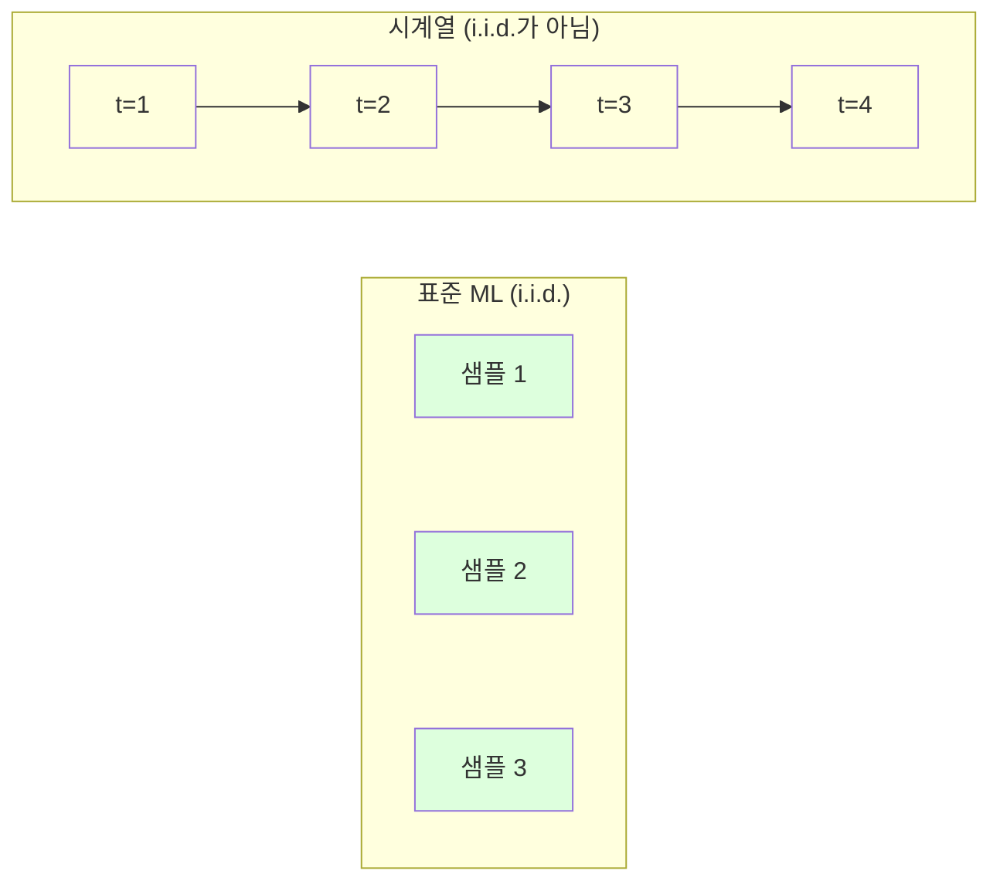
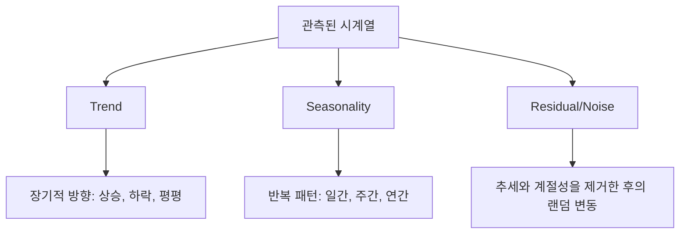
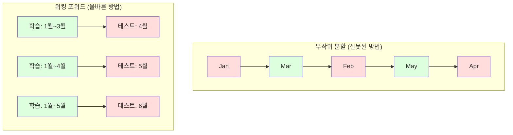

# 시계열 기초

> 먼저 정상성을 확인하면, 과거 성과가 미래 결과를 예측할 수 있습니다.

**유형:** Build
**언어:** Python
**선수 요건:** 2단계, 01-09강
**시간:** 약 90분

## 학습 목표

- 시계열을 추세, 계절성, 잔차 성분으로 분해하고 정상성을 테스트합니다
- 시계열을 지도 학습 문제로 변환하기 위해 지연(lag) 특징과 롤링 통계량을 구현합니다
- 미래 데이터가 학습에 유입되는 것을 방지하는 워크-포워드(walk-forward) 검증 프레임워크를 구축합니다
- 시계열에 무작위 학습/테스트 분할이 유효하지 않은 이유를 설명하고, 적절한 시간 기반 분할 대비 성능 격차를 시연합니다

## 문제점

시간 순서로 정렬된 데이터가 있습니다. 일별 판매량, 시간별 온도, 분별 CPU 사용량, 주간 주가 등입니다. 다음 값, 다음 주, 다음 분기를 예측하고 싶습니다.

표준 ML 도구 상자를 꺼내 무작위 학습/테스트 분할, 교차 검증, 특징 행렬 입력, 예측 출력 단계를 진행합니다. 모든 단계가 잘못되었습니다.

시계열은 표준 ML이 의존하는 가정을 깨뜨립니다. 샘플은 독립적이지 않습니다. 오늘의 온도는 어제의 온도에 의존합니다. 무작위 분할은 미래 정보를 과거에 유입시킵니다. 백테스트에서는 훌륭해 보이는 특징들이 시간이 지남에 따라 패턴이 변하기 때문에 프로덕션에서는 실패합니다.

무작위 교차 검증으로 95% 정확도를 얻는 모델이 적절한 시간 기반 평가에서는 55%를 얻을 수 있습니다. 이 차이는 사소한 기술적 문제가 아닙니다. 종이 위에서 작동하는 모델과 프로덕션에서 작동하는 모델의 차이입니다.

이 강의는 기초를 다룹니다. 시간 데이터가 다른 이유, 모델을 정직하게 평가하는 방법, 그리고 시계열을 표준 ML 모델이 소비할 수 있는 특징으로 변환하는 방법을 다룹니다.

## 개념

### 시계열을 특별하게 만드는 요소

표준 ML은 i.i.d. (독립적이고 동일하게 분포된) 가정을 합니다. 각 샘플은 다른 샘플과 독립적으로 동일한 분포에서 추출됩니다. 시계열은 이 두 가정을 모두 위반합니다:

- **독립적이지 않습니다.** 오늘의 주가는 어제에 의존합니다. 이번 주 매출은 지난주와 상관관계가 있습니다.
- **동일하게 분포하지 않습니다.** 분포가 시간에 따라 변합니다. 12월의 매출은 3월의 매출과 다릅니다.

이러한 위반은 사소한 것이 아닙니다. 기능(features)을 구축하는 방식, 모델을 평가하는 방식, 그리고 어떤 알고리즘이 작동하는지를 바꿉니다.



표준 ML에서는 샘플이 상호 교환 가능합니다. 샘플을 섞어도 아무 변화가 없습니다. 시계열에서는 순서가 모든 것입니다. 섞으면 신호가 파괴됩니다.

### 시계열의 구성 요소

모든 시계열은 다음 요소의 조합입니다:



- **추세(Trend)**: 장기적 방향입니다. 매출이 매년 10% 성장합니다. 지구 온도가 상승합니다.
- **계절성(Seasonality)**: 고정된 간격에서 반복되는 패턴입니다. 소매 매출은 12월에 급증합니다. 에어컨 사용량은 7월에 최고점을 찍습니다.
- **잔차(Residual)**: 추세와 계절성을 제거한 후 남은 것입니다. 잔차가 화이트 노이즈처럼 보이면, 분해가 신호를 잘 포착했습니다.

### 정상성(Stationarity)

시계열이 정상(stationary)이라는 것은 통계적 특성(평균, 분산, 자기상관)이 시간에 따라 변하지 않는다는 것입니다. 대부분의 예측 방법은 정상성을 가정합니다.

**중요한 이유:** 비정상(non-stationary) 시계열은 평균이 표류(drift)합니다. 1월 데이터로 학습한 모델은 2월에 나타나는 평균과 다른 평균을 학습했습니다. 이는 체계적으로 틀린 예측이 될 것입니다.

**확인 방법:** 윈도우에 대해 이동 평균(rolling mean)과 이동 표준 편차(rolling standard deviation)를 계산합니다. 만약 이들이 표류한다면, 시계열은 비정상입니다.

**수정 방법:** 차분(Differencing)입니다. 원시 값을 모델링하는 대신, 연속된 값 사이의 변화를 모델링합니다:

```
diff[t] = value[t] - value[t-1]
```

한 번의 차분으로 시계열이 정상 상태(stationary)가 되지 않으면, 차분을 한 번 더 적용하세요 (2차 차분). 대부분의 실제 시계열은 최대 두 번의 차분으로 충분합니다.

**예시:**

원래 시계열: [100, 102, 106, 112, 120]
1차 차분: [2, 4, 6, 8] (여전히 상승 추세)
2차 차분: [2, 2, 2] (상수 -- 정상 상태)

원래 시계열은 2차 추세를 가지고 있었습니다. 1차 차분은 이를 선형 추세로 변환했고, 2차 차분은 이를 평평하게 만들었습니다. 실제로는 두 번 이상의 차분이 필요한 경우가 거의 없습니다.

**공식적인 검정:** 증강 디키-풀러 (ADF) 검정은 정상성을 위한 표준 통계 검정입니다. 귀무 가설은 "시계열이 비정상적이다"입니다. p-값이 0.05 미만이면 귀무 가설을 기각하고 정상성을 결론 내릴 수 있습니다. ADF는 점근 분포 표를 필요로 하므로 처음부터 구현하지는 않지만, 코드에서의 롤링 통계 접근 방식은 실용적인 시각적 검사를 제공합니다.

### 자기상관

자기상관은 시간 t에서의 값이 시간 t-k (k 단계 전)의 값과 얼마나 상관되는지를 측정합니다. 자기상관 함수 (ACF)는 각 지연 k에 대해 이 상관을 플롯합니다.

**ACF가 알려주는 것:**
- 시계열이 얼마나 오래 기억하는지. ACF가 지연 5 이후에 0으로 떨어지면, 5 단계 이상 이전의 값은 관련이 없습니다.
- 계절성이 존재하는지. ACF가 지연 12 (월별 데이터)에서 급증하면, 연 단위 계절성이 있습니다.
- 몇 개의 지연(lag) 특성을 만들어야 하는지. ACF가 무시할 수 있는 수준이 되는 지연까지 사용하세요.

**PACF (부분 자기상관 함수)**는 간접적인 상관을 제거합니다. 오늘 값이 3일 전 값과 상관되는 이유가 둘 다 어제 값과 상관되기 때문이라면, 지연 3에서의 PACF는 0이 될 것이며, 지연 3에서의 ACF는 0이 아닐 것입니다.

### 지연 특성: 시계열을 지도 학습으로 변환하기

표준 ML 모델은 특성 행렬 X와 타겟 y가 필요합니다. 시계열은 값의 단일 열을 제공합니다. 이 둘을 연결하는 다리는 지연 특성입니다.

시계열 [10, 12, 14, 13, 15]를 사용하여 지연-1 및 지연-2 특성을 만드세요:

| lag_2 | lag_1 | target |
|-------|-------|--------|
| 10    | 12    | 14     |
| 12    | 14    | 13     |
| 14    | 13    | 15     |

이제 표준 회귀 문제가 됩니다. 모든 ML 모델 (선형 회귀, 랜덤 포레스트, 그래디언트 부스팅)은 시차(lag)로부터 타겟을 예측할 수 있습니다.

추가로 엔지니어링할 수 있는 특징(features)은 다음과 같습니다:
- **이동 통계(Rolling statistics):** 최근 k개 값에 대한 평균, 표준 편차, 최솟값, 최댓값
- **캘린더 특징(Calendar features):** 요일, 월, 공휴일 여부, 주말 여부
- **차분 값(Differenced values):** 이전 단계에서의 변화량
- **누적 통계(Expanding statistics):** 누적 평균, 누적 합
- **비율 특징(Ratio features):** 현재 값 / 이동 평균 (최근 평균과의 차이)
- **상호작용 특징(Interaction features):** lag_1 * day_of_week (요일이 모멘텀에 미치는 영향)

**시차(lag)는 몇 개까지 사용할까요?** 자기상관 함수(ACF)를 사용하세요. ACF가 시차 10까지 유의미하다면, 최소 10개의 시차를 사용하세요. 주간 계절성이 있다면 시차 7 (그리고 가능하면 14)을 포함하세요. 더 많은 시차는 모델에 더 많은 역사적 데이터를 제공하지만, 더 많은 특징을 맞춰야 하므로 과적합 위험이 증가합니다.

**타겟 정렬 함정(The target alignment trap).** 시차 특징을 생성할 때, 타겟은 시간 t의 값이어야 하며, 모든 특징은 시간 t-1 또는 그 이전의 값을 사용해야 합니다. 실수로 시간 t의 값을 특징으로 포함하면, 완벽한 예측자이자 완전히 쓸모없는 모델이 됩니다. 이는 시계열 특징 엔지니어링에서 가장 흔한 버그입니다.

### 워킹 포워드 검증(Walk-Forward Validation)

이 개념은 이 강의에서 가장 중요합니다. 표준 k-폴드 교차 검증은 샘플을 무작위로 학습 및 테스트에 할당합니다. 시계열에서는 이 방식이 미래 정보를 유출(leak)시킵니다.



워킹 포워드 검증:
1. 시간 t까지의 데이터로 학습
2. 시간 t+1 (또는 다단계의 경우 t+1부터 t+k까지)에서 예측
3. 윈도우를 앞으로 슬라이드
4. 반복

각 테스트 폴드에는 모든 학습 데이터 이후의 데이터만 포함됩니다. 미래 유출이 없습니다. 이를 통해 모델이 배포되었을 때의 성능에 대한 정직한 추정치를 얻을 수 있습니다.

**확장 윈도우**는 모든 역사적 데이터를 학습에 사용하며(윈도우가 확장됨), **슬라이딩 윈도우**는 고정 크기의 학습 윈도우를 사용합니다(윈도우가 슬라이딩됨). 오래된 데이터가 여전히 관련 있다고 판단되면 확장 윈도우를 사용하세요. 세상이 변하고 오래된 데이터가 해를 끼친다면 슬라이딩 윈도우를 사용하세요.

### ARIMA 직관

ARIMA는 고전적인 시계열 모델입니다. 세 가지 구성 요소를 포함합니다:

- **AR (자기회귀, Autoregressive):** 과거 값으로 예측합니다. AR(p)는 마지막 p개의 값을 사용합니다.
- **I (적분, Integrated):** 정상성을 달성하기 위해 차분(Differencing)을 적용합니다. I(d)는 d번의 차분을 적용합니다.
- **MA (이동 평균, Moving Average):** 과거 예측 오차로 예측합니다. MA(q)는 마지막 q개의 오차를 사용합니다.

ARIMA(p, d, q)는 세 가지 구성 요소를 모두 결합합니다. ACF/PACF 분석이나 자동화된 검색(auto-ARIMA)을 통해 p, d, q를 선택합니다.

ARIMA를 처음부터 구현하지는 않을 것입니다. 이는 이 강의 범위를 넘어서는 수치 최적화를 요구하기 때문입니다. 핵심 통찰은 각 구성 요소가 무엇을 하는지 이해하여 ARIMA 결과를 해석하고 언제 사용해야 할지 아는 것입니다.

### 무엇을 언제 사용할까

| 접근법 | 가장 적합한 경우 | 계절성 처리 | 외부 특성 처리 |
|----------|---------|-------------------|------------------------|
| 지연(Lag) 특성 + ML | 많은 외부 특성을 가진 표 데이터 | 캘린더 특성을 통해 | 예 |
| ARIMA | 단일 단변량 시계열, 단기 예측 | SARIMA 변형 | 아니요 (ARIMAX는 제한적) |
| 지수 평활법 | 단순한 추세 + 계절성 | 예 (Holt-Winters) | 아니요 |
| Prophet | 비즈니스 예측, 공휴일 | 예 (푸리에 항) | 제한적 |
| 신경망 (LSTM, 트랜스포머) | 긴 시퀀스, 다중 시계열 | 학습됨 | 예 |

대부분의 실제 문제에서는 지연(Lag) 특성 + 그래디언트 부스팅이 가장 강력한 출발점입니다. 외부 특성을 자연스럽게 처리하고, 정상성을 요구하지 않으며, 디버깅이 쉽습니다.

### 예측 기간과 전략

단일 단계 예측은 한 시간 단계 앞을 예측합니다. 다중 단계 예측은 여러 단계를 예측합니다. 세 가지 전략이 있습니다:

**재귀적(순환적):** 한 단계를 예측하고, 그 예측을 다음 단계의 입력으로 사용합니다. 단순하지만 오차가 누적됩니다. 각 예측이 이전 예측을 사용하므로 실수가 누적됩니다.

**직접(Direct):** 각 호리즌(horizon)마다 별도의 모델을 학습합니다. Model-1은 t+1을 예측하고, Model-5는 t+5를 예측합니다. 오차 누적은 없지만, 각 모델의 학습 샘플 수가 적고 정보를 공유하지 않습니다.

**다중 출력(Multi-output):** 모든 호리즌을 동시에 출력하는 하나의 모델을 학습합니다. 호리즌 간 정보를 공유하지만, 다중 출력을 지원하는 모델(또는 커스텀 손실 함수)이 필요합니다.

대부분의 실제 문제에서는 짧은 호리즌(1-5단계)은 재귀적(recursive) 방식으로, 긴 호리즌은 직접(direct) 방식으로 시작하는 것이 좋습니다.

### 시계열에서의 흔한 실수

| 실수 | 발생 원인 | 해결 방법 |
|---------|---------------|-----------|
| 무작위 학습/테스트 분할 | 표준 ML에서의 습관 | 워크-포워드(walk-forward) 또는 시간 순 분할 사용 |
| 미래 특성 사용 | 실수로 시간 t의 특성이 포함됨 | 모든 특성의 시간 정합성(temporal alignment)을 감사 |
| 계절성에 과적합 | 모델이 캘린더 패턴을 암기함 | 테스트 세트에 전체 계절 주기(full seasonal cycle)를 포함 |
| 스케일 변화 무시 | 매출이 두 배가 되지만 패턴은 유지됨 | 절대값 대신 백분율 변화 모델링 |
| 너무 많은 지연(lag) 특성 | "역사가 많을수록 좋다" | ACF를 사용하여 관련 지연(lag) 결정 |
| 차분(differencing) 하지 않음 | "모델이 알아서 처리할 것" | 트리 모델은 추세를 처리하지만, 선형 모델은 정상성(stationarity)이 필요 |

```figure
f3-series-decompose
```

## 구현하기

`code/time_series.py`의 코어 빌딩 블록을 처음부터 구현한 코드입니다.

### 지연 특성 생성기(Lag Feature Creator)

```python
def make_lag_features(series, n_lags):
    n = len(series)
    X = np.full((n, n_lags), np.nan)
    for lag in range(1, n_lags + 1):
        X[lag:, lag - 1] = series[:-lag]
    valid = ~np.isnan(X).any(axis=1)
    return X[valid], series[valid]
```

이 기능은 1D 시계열을 특성 행렬로 변환하며, 각 행은 마지막 `n_lags` 값을 특성으로, 현재 값을 타겟으로 가집니다.

### 워크-포워드 교차 검증(Walk-Forward Cross-Validation)

```python
def walk_forward_split(n_samples, n_splits=5, min_train=50):
    assert min_train < n_samples, "min_train must be less than n_samples"
    step = max(1, (n_samples - min_train) // n_splits)
    for i in range(n_splits):
        train_end = min_train + i * step
        test_end = min(train_end + step, n_samples)
        if train_end >= n_samples:
            break
        yield slice(0, train_end), slice(train_end, test_end)
```

각 분할은 학습 데이터가 테스트 데이터보다 엄격히 앞서 있도록 보장합니다. 학습 윈도우는 각 폴드(fold)마다 확장됩니다.

### 단순 자기회귀 모델(Simple Autoregressive Model)

순수 AR 모델은 지연(lag) 특성에 대한 선형 회귀입니다:

```python
class SimpleAR:
    def __init__(self, n_lags=5):
        self.n_lags = n_lags
        self.weights = None
        self.bias = None

    def fit(self, series):
        X, y = make_lag_features(series, self.n_lags)
        # 정규 방정식(normal equations)으로 풀기
        X_b = np.column_stack([np.ones(len(X)), X])
        theta = np.linalg.lstsq(X_b, y, rcond=None)[0]
        self.bias = theta[0]
        self.weights = theta[1:]
        return self
```

이 개념은 02강의 선형 회귀와 동일하지만, 동일한 변수의 시간 지연(time-lagged) 버전에 적용됩니다.

### 정상성 검사(Stationarity Check)

코드는 이동 통계(rolling statistics)를 계산하여 정상성을 시각적 및 수치적으로 평가합니다:

```python
def check_stationarity(series, window=50):
    rolling_mean = np.array([
        series[max(0, i - window):i].mean()
        for i in range(1, len(series) + 1)
    ])
    rolling_std = np.array([
        series[max(0, i - window):i].std()
        for i in range(1, len(series) + 1)
    ])
    return rolling_mean, rolling_std
```

이동 평균이 변하거나 이동 표준 편차가 변하면, 시계열은 비정상(non-stationary)입니다. 차분(differencing)을 적용하고 다시 확인해 보세요.

이 코드는 시계열의 첫 번째 절반과 두 번째 절반을 비교하여 정상성을 확인합니다. 평균이 표준 편차의 절반 이상 차이나거나 분산 비율이 2배를 초과하면, 시계열은 비정상(non-stationary)으로 표시됩니다.

### 자기상관(Autocorrelation)

```python
def autocorrelation(series, max_lag=20):
    n = len(series)
    mean = series.mean()
    var = series.var()
    acf = np.zeros(max_lag + 1)
    for k in range(max_lag + 1):
        cov = np.mean((series[:n-k] - mean) * (series[k:] - mean))
        acf[k] = cov / var if var > 0 else 0
    return acf
```

## 사용하기

sklearn을 사용할 경우, 지연(lag) 특성을 모든 회귀 모델에 직접 사용할 수 있습니다:

```python
from sklearn.linear_model import Ridge
from sklearn.ensemble import GradientBoostingRegressor

X, y = make_lag_features(series, n_lags=10)

for train_idx, test_idx in walk_forward_split(len(X)):
    model = Ridge(alpha=1.0)
    model.fit(X[train_idx], y[train_idx])
    predictions = model.predict(X[test_idx])
```

ARIMA의 경우 statsmodels를 사용하세요:

```python
from statsmodels.tsa.arima.model import ARIMA

model = ARIMA(train_series, order=(5, 1, 2))
fitted = model.fit()
forecast = fitted.forecast(steps=30)
```

`time_series.py`의 코드는 두 가지 접근법을 모두 시연하며, 워크 포워드(walk-forward) 검증을 통해 비교합니다.

### sklearn TimeSeriesSplit

sklearn은 워크 포워드 검증을 구현하는 `TimeSeriesSplit`을 제공합니다:

```python
from sklearn.model_selection import TimeSeriesSplit

tscv = TimeSeriesSplit(n_splits=5)
for train_index, test_index in tscv.split(X):
    X_train, X_test = X[train_index], X[test_index]
    y_train, y_test = y[train_index], y[test_index]
    model.fit(X_train, y_train)
    score = model.score(X_test, y_test)
```

이는 처음부터 작성한 `walk_forward_split`과 동일하지만, sklearn의 교차 검증 프레임워크에 통합되어 있습니다. `cross_val_score`과 함께 사용할 수 있습니다:

```python
from sklearn.model_selection import cross_val_score

scores = cross_val_score(model, X, y, cv=TimeSeriesSplit(n_splits=5))
print(f"Mean score: {scores.mean():.4f} +/- {scores.std():.4f}")
```

### 평가 지표

시계열 예측은 회귀 지표(regression metrics)를 사용하지만, 시간 인식(time-aware) 맥락을 고려합니다:

- **MAE (평균 절대 오차):** |y_true - y_pred|의 평균입니다. 원 단위에서 해석하기 쉽습니다. "평균적으로 예측값이 3.2도만큼 벗어납니다."
- **RMSE (평균 제곱 오차의 제곱근):** 평균 제곱 오차의 제곱근입니다. MAE보다 큰 오차에 더 큰 페널티를 부여합니다. 큰 오차가 많은 작은 오차보다 더 나쁜 경우 사용하세요.
- **MAPE (평균 절대 백분율 오차):** |오차 / 실제값| * 100의 평균입니다. 스케일 독립적(scale-independent)으로, 서로 다른 시계열을 비교하는 데 유용합니다. 하지만 실제값이 0일 때는 정의되지 않습니다.
- **단순한 기준선(Naive baseline) 비교:** 항상 단순한 기준선과 비교하세요. 계절적 단순 기준선(seasonal naive baseline)은 한 주기 전의 값(어제, 지난주)을 예측합니다. 모델이 단순 기준선을 이길 수 없다면, 무언가 잘못된 것입니다.

### 이동 특성(Rolling Features)

이 코드는 지연(lag) 특성에 이동 통계(7일 및 14일 윈도우의 평균, 표준 편차, 최소값, 최대값)를 추가하는 것을 시연합니다. 이러한 특성은 지연 특성만으로는 포착되지 않는 최근 추세와 변동성에 대한 정보를 모델에 제공합니다.

예를 들어, 이동 평균이 상승하면 상승 추세를 나타냅니다. 이동 표준 편차가 증가하면 변동성이 커지고 있음을 시사합니다. 이러한 패턴은 트리 기반 모델이 학습할 수 있지만 선형 모델은 학습할 수 없는 유형입니다.

## 출시하기

이 강의는 다음을 생성합니다:
- `outputs/prompt-time-series-advisor.md` -- 시계열 문제를 정의하기 위한 프롬프트
- `code/time_series.py` -- 지연(lag) 특징, 워크 포워드 검증, AR 모델, 정상성(stationarity) 검사

### 반드시 이겨야 하는 베이스라인

모델을 구축하기 전에 베이스라인을 설정하세요:

1. **마지막 값 (지속성).** 내일이 오늘과 같다고 예측합니다. 많은 시계열에서 이 베이스라인을 넘기는 것이 놀라울 정도로 어렵습니다.
2. **계절적 naiive.** 오늘이 지난 주 같은 요일(또는 작년 같은 날)과 같다고 예측합니다. 모델이 이 베이스라인을 넘지 못한다면, 계절성 이상의 유용한 패턴을 학습하지 못한 것입니다.
3. **이동 평균.** 마지막 k개 값의 평균을 예측합니다. 잡음을 부드럽게 처리하지만 급격한 변화를 포착하지는 못합니다.

고급 ML 모델이 계절적 naiive 베이스라인에 패배한다면 버그가 있습니다. 가장 흔한 원인은 특징(features)에서의 미래 누수(future leakage), 잘못된 평가 방법, 또는 시계열이 실제로 무작위적이고 예측 불가능한 경우입니다.

### 실용적인 팁

1. **먼저 플롯을 시작하세요.** 모델링 전에 원시(raw) 시계열을 플롯하세요. 추세, 계절성, 이상치, 구조적 단절(행동의 급격한 변화)을 찾아보세요. 30초간의 시각적 검사가 1시간의 자동화된 분석보다 더 많은 정보를 주는 경우가 많습니다.

2. **먼저 차분(differencing)하고, 그 다음 모델링하세요.** 시계열에 명확한 추세가 있다면 지연(lag) 특징을 만들기 전에 차분하세요. 트리 기반 모델은 추세를 처리할 수 있지만 선형 모델은 처리할 수 없으며, 차분은 해를 끼치지 않습니다.

3. **최소 한 번의 완전한 계절 주기(seasonal cycle)를 홀드아웃하세요.** 주간 계절성이 있다면 테스트 세트는 최소 한 주 전체를 포함해야 합니다. 월간 계절성이라면 최소 한 달 전체를 포함해야 합니다. 그렇지 않으면 모델이 계절 패턴을 포착했는지 평가할 수 없습니다.

4. **프로덕션에서 모니터링하세요.** 시계열 모델은 세상이 변함에 따라 시간이 지남에 따라 성능이 저하됩니다. 예측 오류를 이동(rolling) 기준으로 추적하세요. 오류가 증가하기 시작하면 최근 데이터로 모델을 재학습하세요.

5. **체제 변화를 주의하세요.** 팬데믹 이전 데이터로 학습된 모델은 팬데믹 이후의 행동을 예측하지 못합니다. 알려진 체제 변화의 지표들을 특징(feature)으로 포함하거나, 오래된 데이터를 잊는 슬라이딩 윈도우(sliding window)를 사용하세요.

6. **왜곡된 시계열에 로그 변환을 적용하세요.** 매출, 가격, 횟수는 종종 오른쪽으로 왜곡(right-skewed)되어 있습니다. 로그를 취하면 분산이 안정화되고, 곱셈 패턴이 덧셈 패턴이 되어 선형 모델이 처리할 수 있게 됩니다. 로그 공간에서 예측한 후, 지수 연산을 통해 원래 단위로 복원하세요.

## 연습 문제

1. **정상성 실험.** 선형 추세가 있는 시계열을 생성하세요. 롤링 통계(rolling statistics)로 정상성을 확인하세요. 1차 차분(first differencing)을 적용하세요. 다시 확인하세요. 2차 추세의 경우 몇 번의 차분이 필요합니까?

2. **시차 선택.** 계절성이 있는 시계열(period=7)에 대해 ACF를 계산하세요. 어떤 시차(lag)가 가장 높은 자기상관(autocorrelation)을 가집니까? 해당 시차만 사용하여 시차 특징(lag features)을 만드세요 (연속적인 시차 사용이 아님). 시차 1부터 7까지를 사용하는 것과 비교했을 때 정확도가 향상됩니까?

3. **워크 포워드 vs 랜덤 분할.** 시차 특징에 대해 Ridge 회귀를 학습하세요. 랜덤 80/20 분할과 워크 포워드 검증(walk-forward validation)으로 평가하세요. 랜덤 분할이 성능을 얼마나 과대평가합니까?

4. **특징 엔지니어링.** 시차 특징에 롤링 평균(window=7), 롤링 표준 편차(window=7), 요일(day-of-week) 특징을 추가하세요. 워크 포워드 검증을 사용하여 이러한 추가 특징이 있을 때와 없을 때의 정확도를 비교하세요.

5. **다단계 예측.** AR 모델을 1단계가 아닌 5단계 앞을 예측하도록 수정하세요. 두 전략을 비교하세요: (a) 한 단계를 예측하고, 그 예측을 다음 단계의 입력으로 사용하는 방식(재귀적), (b) 각 예측 기간(horizon)에 대해 별도의 모델을 학습하는 방식(직접). 어느 쪽이 더 정확합니까?

## 핵심 용어

| 용어 | 사람들이 말하는 것 | 실제 의미 |
|------|----------------|----------------------|
| 정상성(Stationarity) | "통계량이 시간에 따라 변하지 않는다" | 평균, 분산, 자기상관 구조가 시간에 따라 일정하게 유지되는 시계열 |
| 차분(Differencing) | "연속적인 값을 뺀다" | 추세를 제거하고 정상성을 달성하기 위해 y[t] - y[t-1]을 계산하는 것 |
| 자기상관 (ACF) | "시계열이 자기 자신과 상관되는 정도" | 시계열과 그 시차(lagged) 복사본 간의 상관관계로, 시차의 함수 |
| 부분 자기상관 (PACF) | "직접 상관만" | 모든 짧은 지연의 효과를 제거한 후 지연 k에서의 자기상관 |
| 지연 특징 | "과거 값을 입력으로 사용" | y[t]를 예측하기 위해 y[t-1], y[t-2], ..., y[t-k]를 특징으로 사용 |
| 워크포워드 검증 | "시간 순서를 존중하는 교차 검증" | 학습 데이터가 항상 테스트 데이터보다 시간적으로 앞서는 평가 |
| ARIMA | "클래식 시계열 모델" | AutoRegressive Integrated Moving Average: 과거 값 (AR), 차분 (I), 과거 오차 (MA)를 결합 |
| 계절성 | "반복되는 캘린더 패턴" | 캘린더 기간 (일별, 주별, 연별)과 관련된 시계열의 규칙적이고 예측 가능한 주기 |
| 추세 | "장기적인 방향" | 시간에 따라 시계열 수준이 지속적으로 증가하거나 감소하는 것 |
| 확장 윈도우 | "모든 역사 사용" | 각 폴드마다 학습 세트가 증가하는 워크포워드 검증 |
| 슬라이딩 윈도우 | "고정 크기 역사" | 학습 세트가 고정 길이 윈도우로 앞으로 슬라이딩하는 워크포워드 검증 |

## 추가 읽기

- [Hyndman and Athanasopoulos, Forecasting: Principles and Practice (3rd ed.)](https://otexts.com/fpp3/) -- 시계열 예측에 관한 최고의 무료 교과서
- [scikit-learn Time Series Split](https://scikit-learn.org/stable/modules/generated/sklearn.model_selection.TimeSeriesSplit.html) -- sklearn의 워크포워드 스플리터
- [statsmodels ARIMA docs](https://www.statsmodels.org/stable/generated/statsmodels.tsa.arima.model.ARIMA.html) -- 진단 기능이 포함된 ARIMA 구현
- [Makridakis et al., The M5 Competition (2022)](https://www.sciencedirect.com/science/article/pii/S0169207021001874) -- ML 방법과 통계적 방법을 비교하는 대규모 예측 경쟁
