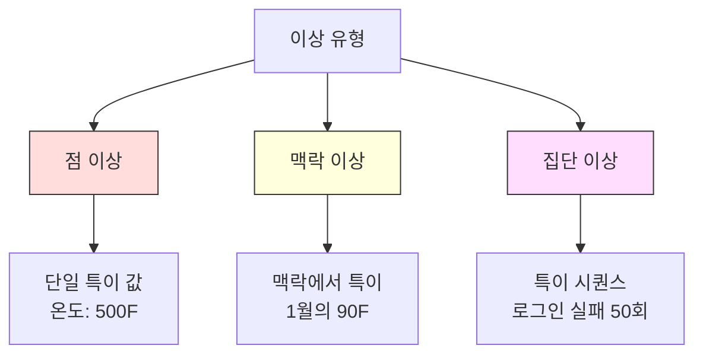
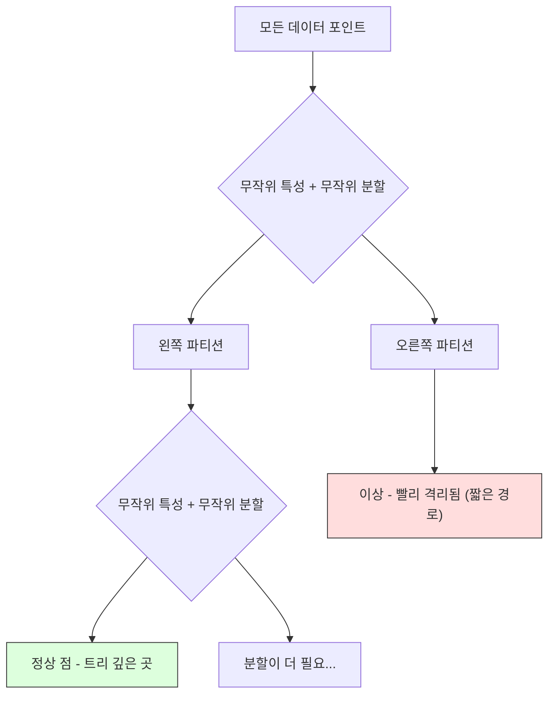
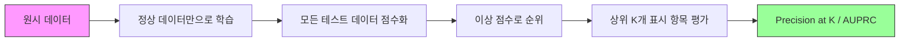

# 이상 탐지 (Anomaly Detection)

> 정상은 정의하기 쉽습니다. 비정상은 맞지 않는 모든 것입니다.

**Type:** Build
**Language:** Python
**Prerequisites:** Phase 2, Lessons 01-09
**Time:** ~75 minutes

## 학습 목표 (Learning Objectives)

- Z-score, IQR, Isolation Forest 이상 탐지 방법을 처음부터 구현합니다
- 점(point), 맥락(contextual), 집단(collective) 이상을 구분하고 각각에 맞는 탐지 방법을 선택합니다
- 이상 탐지가 이상을 분류하는 것이 아니라 정상 데이터를 모델링하는 문제로 프레이밍되는 이유를 설명합니다
- 비지도 이상 탐지와 지도 분류를 비교하고, 신규 이상 커버리지와 정밀도 사이의 트레이드오프를 평가합니다

## 문제 상황 (The Problem)

신용카드가 오후 2시에 뉴욕에서 쓰인 뒤, 2:05에 도쿄에서 쓰입니다. 공장 센서가 정상 범위 80-120도인데 150도를 읽습니다. 서버가 일평균 200건인데 초당 50,000건 요청을 보냅니다.

이것들이 이상(anomaly)입니다. 찾는 일이 중요합니다. 사기는 수십억을 비용으로 만듭니다. 장비 고장은 다운타임을 만듭니다. 네트워크 침입은 데이터를 비용으로 만듭니다.

도전: 이상의 라벨된 예가 거의 없습니다. 사기는 거래의 0.1%입니다. 장비 고장은 연간 몇 번입니다. "이상" 클래스에서 배울 것이 거의 없어 표준 분류기를 학습할 수 없습니다. 라벨이 조금 있어도, 본 이상이 앞으로 만날 유일한 유형이 아닙니다. 내일의 사기 수법은 오늘의 것과 다릅니다.

이상 탐지는 문제를 뒤집습니다. 무엇이 비정상인지 배우는 대신, 무엇이 정상인지 배웁니다. 정상에서 벗어나는 것은 모두 의심스럽습니다. 라벨 없이 동작하고, 새 유형의 이상에 적응하며, 대규모 데이터셋으로 확장됩니다.

## 핵심 개념 (The Concept)

### 이상의 유형

모든 이상이 같지 않습니다:

- **점 이상(Point anomalies).** 맥락과 무관하게 특이한 단일 데이터 포인트. 온도 500도. 평소 50달러를 쓰는 계정의 50,000달러 거래.
- **맥락 이상(Contextual anomalies).** 맥락을 고려하면 특이한 데이터 포인트. 90도는 여름에 정상이고 겨울에 이상입니다. 같은 값, 다른 맥락.
- **집단 이상(Collective anomalies).** 개별 포인트는 정상일 수 있어도 집단으로서 특이한 일련의 데이터 포인트. 로그인 실패 다섯 번은 정상. 연속 쉰 번은 무차별 대입 공격.

대부분 방법은 점 이상을 탐지합니다. 맥락 이상은 시간이나 위치 특성이 필요합니다. 집단 이상은 시퀀스를 인식하는 방법이 필요합니다.



### 비지도 프레이밍

표준 분류에서는 두 클래스의 라벨이 있습니다. 이상 탐지에서는 보통 세 상황 중 하나입니다:

1. **완전 비지도.** 라벨이 전혀 없음. 전체 데이터에 탐지기를 맞추고, 이상이 드물어 "정상" 모델을 오염시키지 않기를 바랍니다.
2. **준지도.** 정상 데이터만의 깨끗한 데이터셋이 있음. 이 깨끗한 세트에 맞추고 나머지를 점수화합니다. 가능할 때 가장 강한 설정입니다.
3. **약한 지도.** 라벨된 이상이 몇 개 있음. 학습이 아니라 평가에 씁니다. 비지도로 학습한 뒤, 라벨된 부분 집합에서 precision/recall을 잽니다.

핵심 통찰: 이상 탐지는 분류와 근본적으로 다릅니다. 두 클래스 사이의 결정 경계가 아니라 정상 데이터의 분포를 모델링합니다.

### 지도 vs 비지도: 트레이드오프

라벨된 이상이 있다면, 학습에 쓸까요(지도 분류) 아니면 평가에만 쓸까요(비지도 탐지)?

**지도(분류로 취급):**
- 이전에 본 정확한 유형의 이상을 잡음
- 알려진 이상 유형에 대해 더 높은 정밀도
- 신규 이상 유형은 완전히 놓침
- 새 이상 유형이 나오면 재학습 필요
- 충분한 이상 예가 필요(종종 너무 적음)

**비지도(정상을 모델링하고 편차를 표시):**
- 신규 유형을 포함해 정상에서 벗어나는 모든 것을 잡음
- 라벨된 이상이 필요 없음
- 더 높은 거짓 양성률(특이한 것이 모두 나쁜 것은 아님)
- 분포 이동에 더 강건

실무에서 최고의 시스템은 둘을 결합합니다: 넓은 커버리지를 위한 비지도 탐지, 알려진 고우선 이상 유형을 위한 지도 모델, 모호한 경우를 위한 사람 검토.

### Z-Score 방법

가장 단순한 접근. 각 특성의 평균과 표준편차를 계산합니다. 평균에서 k 표준편차보다 먼 점을 표시합니다.

```text
z_score = (x - mean) / std
anomaly if |z_score| > threshold
```

기본 임계값은 3.0입니다(가우시안 분포에서 정상 데이터의 99.7%가 3 표준편차 안에 있습니다).

**강점:** 단순. 빠름. 해석 가능("이 값은 정상에서 4.5 표준편차").

**약점:** 데이터가 정규분포라고 가정. 학습 데이터의 이상치에 민감(이상치가 평균을 옮기고 std를 부풀려 탐지를 어렵게 만듦). 다중모드 분포에서 실패.

**잘 될 때:** 데이터가 대략 종 모양인 단일 특성 모니터링. 서버 응답 시간, 제조 공차, 안정적 베이스라인의 센서 읽기.

**실패할 때:** 다중 클러스터 데이터(베이스라인 온도가 다른 두 사무실), 치우친 데이터(1000달러가 드물지만 이상이 아닌 거래액), 학습 세트에 이상치가 있는 데이터.

### IQR 방법

Z-score보다 강건합니다. 평균과 표준편차 대신 사분위수 범위(interquartile range)를 씁니다.

```
Q1 = 25th percentile
Q3 = 75th percentile
IQR = Q3 - Q1
lower_bound = Q1 - factor * IQR
upper_bound = Q3 + factor * IQR
anomaly if x < lower_bound or x > upper_bound
```

기본 factor는 1.5입니다.

**강점:** 이상치에 강건(백분위수는 극단값에 영향받지 않음). 치우친 분포에서도 동작. 정규성 가정 없음.

**약점:** 단변량만(특성마다 독립 적용). 특성을 함께 볼 때만 특이한 이상은 탐지하지 못함(각 특성에서는 정상이어도 결합 공간에서는 이상인 점).

**실무 노트:** IQR의 1.5 factor는 박스 플롯의 수염에 해당합니다. 수염 밖 점은 잠재적 이상치입니다. 1.5 대신 3.0을 쓰면 탐지기가 더 보수적입니다(표시가 적고, 거짓 양성이 적음). 올바른 factor는 거짓 경보에 대한 허용도에 달립니다.

### Isolation Forest

핵심 통찰: 이상은 적고 다릅니다. 데이터의 무작위 분할에서 이상은 더 쉽게 격리됩니다 -- 나머지로부터 분리하는 데 무작위 분할이 더 적게 필요합니다.



**동작 방식:**
1. 많은 무작위 트리(isolation forest)를 구축
2. 각 노드에서 무작위 특성과 그 특성 min/max 사이의 무작위 분할 값을 고름
3. 모든 점이 격리될 때까지(각자 리프) 계속 분할
4. 이상은 모든 트리에서 평균 경로 길이가 더 짧음

**왜 동작하는가:** 정상 점은 밀집 영역에 삽니다. 이웃으로부터 하나를 격리하려면 무작위 분할이 많이 필요합니다. 이상은 희소 영역에 삽니다. 한두 번의 무작위 분할로 충분합니다.

이상 점수는 모든 트리에 걸친 평균 경로 길이를, 무작위 이진 탐색 트리의 기대 경로 길이로 정규화한 것에 기반합니다:

```
score(x) = 2^(-average_path_length(x) / c(n))
```

여기서 `c(n)`은 n개 샘플에 대한 기대 경로 길이입니다. 점수 1에 가까우면 이상. 0.5에 가까우면 정상. 0에 가까우면 매우 정상(밀집 클러스터 깊은 곳).

**강점:** 분포 가정 없음. 고차원에서 동작. 잘 확장됨(각 트리가 부분표본을 쓰므로 샘플 크기에 대해 준선형). 혼합 특성 유형을 다룸.

**약점:** 밀집 영역의 이상과 씨름함(마스킹 효과). 관련 없는 특성이 많으면 무작위 분할이 덜 효과적.

**핵심 하이퍼파라미터:**
- `n_estimators`: 트리 수. 보통 100이면 충분. 트리가 많을수록 점수는 안정되지만 계산은 느려짐.
- `max_samples`: 트리당 샘플 수. 원본 논문 기본값은 256. 작을수록 개별 트리는 덜 정확하지만 다양성은 커짐. 부분표본화가 Isolation Forest를 빠르게 만듦 -- 각 트리는 데이터의 작은 부분만 봄.
- `contamination`: 예상 이상 비율. 임계값 설정에만 사용. 점수 자체에는 영향 없음.

### Local Outlier Factor (LOF)

LOF는 한 점 주변의 국소 밀도를 이웃 주변 밀도와 비교합니다. 밀집 영역으로 둘러싸인 희소 영역의 점은 이상입니다.

**동작 방식:**
1. 각 점에 대해 k 최근접 이웃을 찾음
2. 국소 도달 가능성 밀도(이웃이 얼마나 밀집한가)를 계산
3. 각 점의 밀도를 이웃들의 밀도와 비교
4. 이웃보다 밀도가 훨씬 낮으면 이상치

**LOF 점수:**
- LOF가 1.0에 가까우면 이웃과 비슷한 밀도(정상)
- LOF가 1.0보다 크면 이웃보다 낮은 밀도(잠재적 이상)
- LOF가 1.0보다 훨씬 크면(예: 2.0+) 유의하게 낮은 밀도(이상일 가능성 높음)

"국소"가 핵심입니다. 밀집 클러스터 1000개와 희소 클러스터 50개의 데이터셋을 생각해 보세요. 희소 클러스터 가장자리의 점은 전역적으로는 특이하지 않습니다 -- 이웃이 50개 있습니다. 하지만 바로 옆 이웃이 자신보다 더 밀집하면 국소적으로는 특이합니다. LOF는 전역 방법이 놓치는 이 뉘앙스를 잡습니다.

**강점:** 국소 이상을 탐지(전역적으로는 특이하지 않아도 이웃에서 특이한 점). 밀도가 다른 클러스터에서도 동작.

**약점:** 큰 데이터셋에서 느림(나이브 구현은 O(n^2)). k 선택에 민감. 매우 고차원에서는 잘 안 됨(차원의 저주가 거리 계산에 영향).

### 비교

| Method | Assumptions | Speed | Handles High Dims | Detects Local Anomalies |
|--------|------------|-------|-------------------|------------------------|
| Z-score | 정규분포 | 매우 빠름 | Yes (특성별) | No |
| IQR | 없음 (특성별) | 매우 빠름 | Yes (특성별) | No |
| Isolation Forest | 없음 | 빠름 | Yes | Partially |
| LOF | 거리가 의미 있음 | 느림 | Poorly | Yes |

### 평가의 어려움

이상 탐지기 평가는 분류기 평가보다 어렵습니다:

- **극단적 클래스 불균형.** 이상이 0.1%이면 전부 "정상"이라고 예측해도 정확도 99.9%. 정확도는 쓸모없습니다.
- **AUROC는 오해의 소지가 있음.** 심한 불균형에서 실용적 임계값에서 이상을 대부분 놓쳐도 AUROC는 좋게 보일 수 있습니다.
- **더 나은 지표:** Precision@k (상위 k개 표시 항목 중 진짜 이상이 몇 개), AUPRC (정밀도-재현율 곡선 아래 면적), 고정 거짓 양성률에서의 재현율.



### 이상 탐지 파이프라인

실무에서 이상 탐지는 이 워크플로를 따릅니다:

1. **베이스라인 데이터 수집.** 이상(또는 매우 적은 이상)이 없다고 아는 기간이 이상적입니다.
2. **특성 공학.** 원시 특성에 파생 특성(롤링 통계, 시간 특성, 비율).
3. **탐지기 학습.** 베이스라인 데이터에 맞춤. 모델이 "정상"이 어떤 모습인지 배웁니다.
4. **새 데이터 점수화.** 각 새 관측이 이상 점수를 받습니다.
5. **임계값 선택.** 점수 컷오프를 고릅니다. 비즈니스 결정입니다: 임계값이 높을수록 거짓 경보는 적지만 놓친 이상은 많습니다.
6. **알림과 조사.** 표시된 점은 사람 검토 또는 자동 대응으로 갑니다.
7. **피드백 수집.** 표시된 항목이 진짜 이상인지 거짓 경보인지 기록합니다. 이 데이터로 탐지기를 평가하고 시간에 따라 임계값을 조정합니다.

파이프라인은 결코 "끝"나지 않습니다. 데이터 분포가 이동하고, 새 이상 유형이 나타나며, 임계값 조정이 필요합니다. 이상 탐지를 일회성 모델이 아니라 살아 있는 시스템으로 다루세요.

```figure
f3-anomaly-fence
```

## 직접 구현하기 (Build It)

`code/anomaly_detection.py`의 코드는 Z-score, IQR, Isolation Forest를 처음부터 구현합니다.

### Z-Score 탐지기

```python
def zscore_detect(X, threshold=3.0):
    mean = X.mean(axis=0)
    std = X.std(axis=0)
    std[std == 0] = 1.0
    z = np.abs((X - mean) / std)
    return z.max(axis=1) > threshold
```

단순하고 벡터화되어 있습니다. 어떤 특성이든 임계값을 넘으면 점을 표시합니다.

### IQR 탐지기

```python
def iqr_detect(X, factor=1.5):
    q1 = np.percentile(X, 25, axis=0)
    q3 = np.percentile(X, 75, axis=0)
    iqr = q3 - q1
    iqr[iqr == 0] = 1.0
    lower = q1 - factor * iqr
    upper = q3 + factor * iqr
    outside = (X < lower) | (X > upper)
    return outside.any(axis=1)
```

### Isolation Forest 처음부터

처음부터 구현은 특성 공간을 무작위로 분할하는 isolation tree를 구축합니다:

```python
class IsolationTree:
    def __init__(self, max_depth):
        self.max_depth = max_depth

    def fit(self, X, depth=0):
        n, p = X.shape
        if depth >= self.max_depth or n <= 1:
            self.is_leaf = True
            self.size = n
            return self
        self.is_leaf = False
        self.feature = np.random.randint(p)
        x_min = X[:, self.feature].min()
        x_max = X[:, self.feature].max()
        if x_min == x_max:
            self.is_leaf = True
            self.size = n
            return self
        self.threshold = np.random.uniform(x_min, x_max)
        left_mask = X[:, self.feature] < self.threshold
        self.left = IsolationTree(self.max_depth).fit(X[left_mask], depth + 1)
        self.right = IsolationTree(self.max_depth).fit(X[~left_mask], depth + 1)
        return self
```

점을 격리하는 경로 길이가 이상 점수를 결정합니다. 짧은 경로일수록 더 이상입니다.

`IsolationForest` 클래스는 여러 트리를 감쌉니다:

```python
class IsolationForest:
    def __init__(self, n_estimators=100, max_samples=256, seed=42):
        self.n_estimators = n_estimators
        self.max_samples = max_samples

    def fit(self, X):
        sample_size = min(self.max_samples, X.shape[0])
        max_depth = int(np.ceil(np.log2(sample_size)))
        for _ in range(self.n_estimators):
            idx = rng.choice(X.shape[0], size=sample_size, replace=False)
            tree = IsolationTree(max_depth=max_depth)
            tree.fit(X[idx])
            self.trees.append(tree)

    def anomaly_score(self, X):
        avg_path = average path length across all trees
        scores = 2.0 ** (-avg_path / c(max_samples))
        return scores
```

정규화 인자 `c(n)`은 n개 원소 이진 탐색 트리에서 실패한 탐색의 기대 경로 길이입니다. `2 * H(n-1) - 2*(n-1)/n`이며 여기서 `H`는 조화수입니다. 이 정규화로 크기가 다른 데이터셋 간 점수를 비교할 수 있습니다.

### 데모 시나리오

코드는 여러 테스트 시나리오를 생성합니다:

1. **이상치가 있는 단일 클러스터.** 중심에서 먼 이상이 주입된 2D 가우시안 클러스터. 모든 방법이 여기서 동작해야 합니다.
2. **다중모드 데이터.** 크기와 밀도가 다른 세 클러스터. 클러스터 사이 점이 이상. 특성별 범위가 넓어 Z-score가 고전합니다.
3. **고차원 데이터.** 특성 50개지만 이상은 그중 5개에서만 다름. 방법이 특성 부분 집합에서 이상을 찾을 수 있는지 테스트합니다.

각 데모는 precision, recall, F1, Precision@k로 모든 방법을 비교합니다.

## 라이브러리로 쓰기 (Use It)

sklearn으로(라이브러리 구현, 처음부터가 아님):

```python
from sklearn.ensemble import IsolationForest
from sklearn.neighbors import LocalOutlierFactor

iso = IsolationForest(n_estimators=100, contamination=0.05, random_state=42)
iso.fit(X_train)
predictions = iso.predict(X_test)

lof = LocalOutlierFactor(n_neighbors=20, contamination=0.05, novelty=True)
lof.fit(X_train)
predictions = lof.predict(X_test)
```

`contamination`은 예상 이상 비율을 설정합니다. 올바르게 설정하는 것이 중요합니다 -- 너무 낮으면 이상을 놓치고, 너무 높으면 거짓 경보가 납니다.

`anomaly_detection.py`의 코드는 처음부터 구현을 같은 데이터에서 sklearn과 비교합니다.

### sklearn Contamination 파라미터

sklearn의 `contamination` 파라미터는 연속 이상 점수를 이진 예측으로 바꾸는 임계값을 결정합니다. 기저 점수는 바꾸지 않습니다.

```python
iso_5 = IsolationForest(contamination=0.05)
iso_10 = IsolationForest(contamination=0.10)
```

둘 다 같은 이상 점수를 냅니다. 하지만 `iso_5`는 상위 5%를, `iso_10`은 상위 10%를 표시합니다. 진짜 이상률을 모를 때(보통 모름) contamination을 "auto"로 두고 원시 점수로 직접 작업하세요. 거짓 양성과 거짓 음성의 비용 트레이드오프에 따라 자체 임계값을 정하세요.

### One-Class SVM

알아 둘 만한 또 다른 비지도 이상 탐지기입니다. One-Class SVM은 고차원 특성 공간에서 정상 데이터 주변에 경계를 맞춥니다(커널 트릭 사용).

```python
from sklearn.svm import OneClassSVM

oc_svm = OneClassSVM(kernel="rbf", gamma="auto", nu=0.05)
oc_svm.fit(X_train)
predictions = oc_svm.predict(X_test)
```

`nu` 파라미터는 이상 비율을 근사합니다. One-Class SVM은 중소 규모 데이터셋에서 잘 되지만 매우 큰 데이터로는 확장되지 않습니다(커널 행렬이 이차로 커짐).

### 오토인코더 접근 (미리보기)

오토인코더는 데이터를 압축하고 재구성하도록 학습하는 신경망입니다. 정상 데이터로 학습합니다. 테스트 시 이상은 재구성 오차가 큽니다. 네트워크가 정상 패턴만 재구성하도록 배웠기 때문입니다.

이것은 Phase 3 (Deep Learning)에서 다루지만, 원리는 같습니다: 정상을 모델링하고, 벗어나는 것을 표시.

### 앙상블 이상 탐지

앙상블 방법이 분류를 개선하듯(Lesson 11), 여러 이상 탐지기를 결합하면 탐지가 개선됩니다. 가장 단순한 접근:

1. 여러 탐지기 실행 (Z-score, IQR, Isolation Forest, LOF)
2. 각 탐지기 점수를 [0, 1]로 정규화
3. 정규화된 점수를 평균
4. 평균 점수에서 임계값 위인 점을 표시

방법이 서로 다른 실패 모드를 가지므로 거짓 양성이 줄어듭니다. 네 방법이 모두 표시한 점은 거의 확실히 이상입니다. 하나만 표시한 점은 그 방법의 quirk일 수 있습니다.

더 정교한 앙상블은 추정 신뢰도로 각 탐지기에 가중치를 줍니다(알려진 이상이 있는 검증 세트가 있으면 측정).

### 프로덕션 고려사항

1. **임계값 드리프트.** 데이터 분포가 이동하면 고정 임계값은 낡습니다. 이상 점수 분포를 모니터링하고 주기적으로 조정하세요.
2. **알림 피로.** 거짓 경보가 너무 많으면 운영자가 주의를 멈춥니다. 높은 임계값(적고 더 신뢰할 수 있는 알림)으로 시작해 신뢰가 쌓이면 낮추세요.
3. **앙상블 접근.** 프로덕션에서는 여러 탐지기를 결합하세요. 여러 방법이 이상이라고 동의할 때만 표시하세요. 거짓 양성이 크게 줄어듭니다.
4. **특성 공학.** 원시 특성만으로는 거의 부족합니다. 롤링 통계, 비율, 마지막 이벤트 이후 시간, 도메인 특화 특성을 더하세요. 좋은 특성 세트가 탐지기 선택보다 더 중요합니다.
5. **피드백 루프.** 운영자가 표시된 항목을 조사하고 확인하거나 기각하면, 시스템에 다시 넣으세요. 시간에 따라 라벨 데이터를 쌓아 탐지기를 평가하고 개선하세요.

## 결과물 (Ship It)

이 레슨이 만드는 것:
- `outputs/skill-anomaly-detector.md` -- 올바른 탐지기를 고르는 결정 스킬
- `code/anomaly_detection.py` -- Z-score, IQR, Isolation Forest를 처음부터, sklearn 비교 포함

### 임계값 고르기

이상 점수는 연속입니다. 이진 결정을 하려면 임계값이 필요합니다. 기술 결정이 아니라 비즈니스 결정입니다.

두 시나리오를 생각해 보세요:
- **사기 탐지.** 사기를 놓치면 비용이 큽니다(차지백, 고객 신뢰). 거짓 경보는 분석가 5분 조사 비용입니다. 임계값을 낮춰 더 많은 사기를 잡고, 더 많은 거짓 경보를 받아들입니다.
- **장비 유지보수.** 거짓 경보는 불필요한 가동 중지로 50,000달러. 놓친 고장은 500,000달러 수리. 이 비용을 균형 맞추도록 임계값을 정합니다.

둘 다 최적 임계값은 거짓 양성과 거짓 음성의 비용 비율에 달립니다. 여러 임계값에서 precision과 recall을 그리고, 비용 함수를 겹친 뒤, 최소 비용 지점을 고르세요.

### 프로덕션으로 확장

프로덕션의 실시간 이상 탐지에 대해:

1. **배치 학습, 온라인 점수화.** 최근 정상 데이터로 주기적으로(일간, 주간) 모델을 학습. 새 관측이 도착하는 대로 점수화.
2. **특성 계산이 일치해야 함.** 30일 롤링 통계로 학습했다면, 새 관측의 특성을 계산하려면 30일 이력이 필요합니다. 필요한 이력을 버퍼하세요.
3. **점수 분포 모니터링.** 시간에 따른 이상 점수 분포를 추적하세요. 중앙값이 위로 표류하면 데이터가 바뀌었거나 모델이 낡았습니다.
4. **설명 가능성.** 이상을 표시할 때 이유를 말하세요. Z-score: "특성 X가 정상보다 4.2 표준편차 위." Isolation Forest: "이 점은 평균 3.1번 분할로 격리됨(정상 점은 8.5번)."

## 연습 문제 (Exercises)

1. **임계값 튜닝.** Z-score 탐지기를 임계값 1.0부터 5.0까지 0.5 간격으로 실행하세요. 각 임계값에서 precision과 recall을 그리세요. 데이터에 대한 스위트 스팟은 어디인가요?

2. **다변량 이상.** 각 특성은 개별적으로 정상처럼 보이지만 조합은 이상인 2D 데이터를 만드세요(예: 주 클러스터 대각선에서 먼 점). 특성별 Z-score는 놓치지만 Isolation Forest는 잡는 것을 보이세요.

3. **LOF 처음부터.** k-최근접 이웃으로 Local Outlier Factor를 구현하세요. 같은 데이터에서 sklearn의 LocalOutlierFactor와 비교하세요. k=10과 k=50을 쓰세요 -- k 선택이 결과에 어떻게 영향을 주나요?

4. **스트리밍 이상 탐지.** Z-score 탐지기를 스트리밍 설정에서 동작하도록 수정하세요: 새 점이 도착할 때 러닝 평균과 분산을 갱신(Welford의 온라인 알고리즘). 같은 데이터에서 배치 Z-score와 비교하세요.

5. **실세계 평가.** 알려진 이상이 있는 데이터셋(예: Kaggle 신용카드 사기)을 가져오세요. precision@100, precision@500, AUPRC로 네 방법을 모두 평가하세요. 어느 방법이 가장 잘 되나요? 왜?

## 핵심 용어 (Key Terms)

| Term | What people say | What it actually means |
|------|----------------|----------------------|
| Anomaly (이상) | "이상치, 특이한 점" | 정상 데이터의 기대 패턴에서 유의하게 벗어나는 데이터 포인트 |
| Point anomaly (점 이상) | "단일 이상한 값" | 맥락과 무관하게 특이한 개별 관측 |
| Contextual anomaly (맥락 이상) | "정상 값, 잘못된 맥락" | 맥락(시간, 위치 등)을 고려하면 특이하지만 다른 맥락에서는 정상일 수 있는 관측 |
| Isolation Forest | "무작위 분할로 이상치 찾기" | 정상 점보다 적은 분할로 이상을 격리하는 무작위 트리 앙상블 |
| Local Outlier Factor | "이웃과 밀도 비교" | 국소 밀도가 이웃 밀도보다 훨씬 낮은 점을 표시하는 방법 |
| Z-score | "평균에서 표준편차 수" | (x - mean) / std, 점을 중심에서 표준편차 단위로 얼마나 먼지를 측정 |
| IQR | "사분위수 범위" | Q3 - Q1, 데이터 중간 50%의 퍼짐을 측정, 강건한 이상치 탐지에 사용 |
| Contamination | "예상 이상 비율" | 탐지기에게 데이터 중 얼마를 이상으로 표시할지 알려 주는 하이퍼파라미터 |
| Precision@k | "상위 k개 표시 중 진짜가 몇 개" | 가장 의심스러운 k개 점에 대해서만 계산한 정밀도, 불균형 이상 탐지에 유용 |
| AUPRC | "정밀도-재현율 곡선 아래 면적" | 모든 임계값에 걸친 precision-recall 성능을 요약하는 지표, 불균형 데이터에서 AUROC보다 나음 |

## 더 읽어보기 (Further Reading)

- [Liu et al., Isolation Forest (2008)](https://cs.nju.edu.cn/zhouzh/zhouzh.files/publication/icdm08b.pdf) -- Isolation Forest 원본 논문
- [Breunig et al., LOF: Identifying Density-Based Local Outliers (2000)](https://dl.acm.org/doi/10.1145/342009.335388) -- LOF 원본 논문
- [scikit-learn Outlier Detection docs](https://scikit-learn.org/stable/modules/outlier_detection.html) -- sklearn 이상 탐지기 개요
- [Chandola et al., Anomaly Detection: A Survey (2009)](https://dl.acm.org/doi/10.1145/1541880.1541882) -- 이상 탐지 방법 종합 서베이
- [Goldstein and Uchida, A Comparative Evaluation of Unsupervised Anomaly Detection Algorithms (2016)](https://journals.plos.org/plosone/article?id=10.1371/journal.pone.0152173) -- 실데이터셋에서 10개 방법의 경험적 비교
