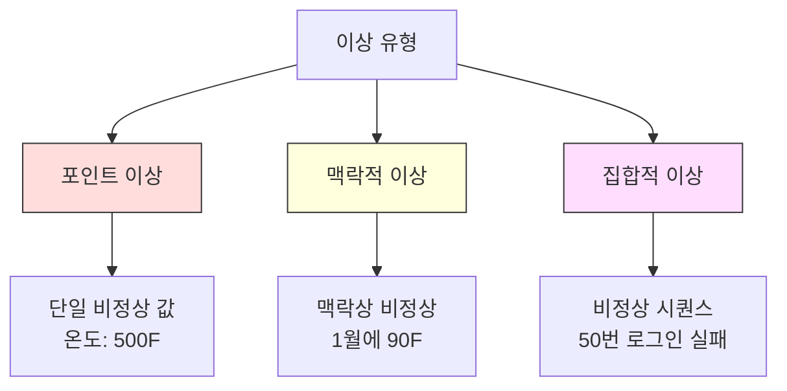
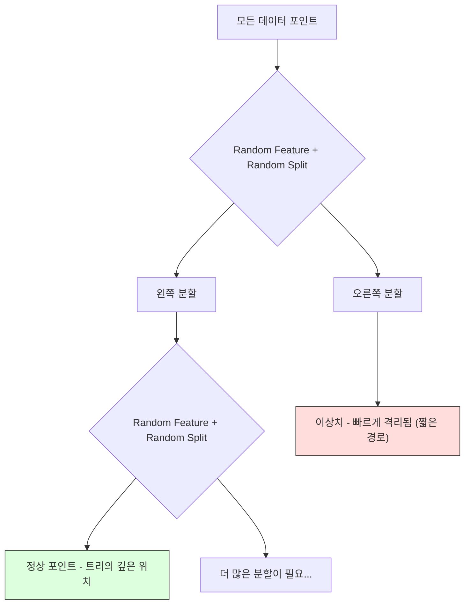
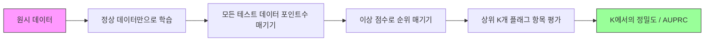

# 이상 탐지

> 정상(normal)은 정의하기 쉽습니다. 비정상(abnormal)은 정상에 포함되지 않는 모든 것입니다.

**유형:** Build
**언어:** Python
**선수 요건:** 2단계, 01-09강
**시간:** 약 75분

## 학습 목표

- Z-점수, IQR, Isolation Forest 이상 탐지 방법을 처음부터 구현해 보세요
- 점(point), 컨텍스트(contextual), 집단(collective) 이상을 구분하고 각각에 적합한 탐지 방법을 선택해 보세요
- 이상 탐지가 이상을 분류하는 것이 아니라 정상 데이터를 모델링하는 방식으로 구성되는 이유를 설명해 보세요
- 비지도 이상 탐지와 지도 분류를 비교하고, 새로운 유형의 이상 커버리지와 정밀도(precision) 간의 트레이드오프(tradeoff)를 평가해 보세요

## 문제점

신용카드가 오후 2시에 뉴욕에서 사용된 후 오후 2시 5분에 도쿄에서 사용되었습니다. 공장 센서가 정상 범위인 80-120도일 때 150도를 읽습니다. 서버가 일일 평균인 초당 200 요청일 때 초당 50,000 요청을 전송합니다.

이것들은 이상(anomaly)입니다. 이들을 찾아내는 것이 중요합니다. 사기는 수십억 달러의 비용이 듭니다. 장비 고장은 다운타임(downtime) 비용이 듭니다. 네트워크 침입은 데이터 비용이 듭니다.

도전 과제: 이상에 대한 레이블이 있는 예시는 거의 없습니다. 사기는 거래의 0.1%를 차지합니다. 장비 고장은 연중 몇 번만 발생합니다. "이상" 클래스에서 학습할 것이 거의 없기 때문에 표준 분류기를 훈련할 수 없습니다. 일부 레이블이 있더라도, 지금까지 본 이상은 앞으로 마주칠 유형의 전부가 아닙니다. 내일의 사기 수법은 오늘의 사기 수법과 다릅니다.

이상 탐지는 문제를 뒤집습니다. 비정상을 학습하는 대신, 정상(normal)을 학습합니다. 정상에서 벗어난 모든 것은 의심스럽습니다. 이 방식은 레이블 없이 작동하며, 새로운 유형의 이상에 적응하고, 대규모 데이터셋으로 확장할 수 있습니다.

## 개념

### 이상(anomaly)의 유형

모든 이상이 동일하지는 않습니다:

- **점(point) 이상.** 컨텍스트와 무관하게 비정상적인 단일 데이터 포인트입니다. 500도의 온도 측정값. $50,000 from an account that normally spends $50의 거래.
- **맥락적 이상.** 맥락에 비추어 비정상적인 데이터 포인트입니다. 90도 온도는 여름에는 정상적이지만, 겨울에는 비정상적입니다. 값은 같지만 맥락이 다릅니다.
- **집합적 이상.** 개별 포인트는 정상일 수 있지만, 그룹으로서 비정상적인 데이터 포인트의 시퀀스입니다. 5번의 로그인 실패는 정상입니다. 50번 연속 실패는 브루트 포스 공격입니다.

대부분의 방법은 포인트 이상을 감지합니다. 맥락적 이상은 시간 또는 위치 특성이 필요합니다. 집합적 이상은 시퀀스를 인식하는 방법이 필요합니다.



### 비지도 관점

표준 분류에서는 두 클래스 모두에 대한 레이블이 있습니다. 이상 탐지에서는 일반적으로 세 가지 상황 중 하나를 마주합니다:

1. **완전 비지도.** 레이블이 전혀 없습니다. 모든 데이터에 탐지기를 적합(fit)하고, 이상치가 "정상" 모델을 오염하지 않을 만큼 희소하기를 바랍니다.
2. **준지도.** 정상 데이터만 포함된 깨끗한 데이터셋이 있습니다. 이 깨끗한 세트에 적합(fit)하고 나머지 모든 데이터를 점수화합니다. 가능한 경우 가장 강력한 설정입니다.
3. **약한 지도.** 몇 개의 레이블이 지정된 이상치가 있습니다. 이를 평가에 사용하며, 학습에는 사용하지 않습니다. 비지도 방식으로 학습한 후, 레이블이 지정된 하위 집합에서 정밀도/재현율을 측정합니다.

핵심 통찰: 이상 탐지는 분류와 근본적으로 다릅니다. 두 클래스 간의 결정 경계를 모델링하는 것이 아니라, 정상 데이터의 분포를 모델링하는 것입니다.

### 지도 vs 비지도: 트레이드오프

레이블이 지정된 이상치가 있다면, 이를 학습에 사용해야 할까요(지도 분류)? 아니면 평가에만 사용해야 할까요(비지도 탐지)?

**지도 방식 (분류로 취급):**
- 이전에 본 이상치 유형을 정확히 포착합니다
- 알려진 이상치 유형에 대해 더 높은 정밀도를 가집니다
- 새로운 이상치 유형을 완전히 놓칩니다
- 새로운 이상치 유형이 등장하면 재학습이 필요합니다
- 충분한 이상 사례가 필요합니다 (종종 너무 적습니다)

**비지도 학습 (정상 모델, 편차 플래그):**
- 새로운 유형을 포함하여 정상에서의 모든 편차를 포착합니다
- 라벨이 지정된 이상 사례가 필요하지 않습니다
- 오탐률(허위 경보율)이 더 높습니다 (모든 비정상적인 것이 나쁜 것은 아닙니다)
- 분포 이동(Distribution Shift)에 대해 더 견고합니다

실제로, 가장 좋은 시스템은 두 가지를 결합합니다: 넓은 커버리지를 위한 비지도 학습 탐지, 알려진 고우선순위 이상 유형을 위한 지도 학습 모델, 그리고 모호한 사례를 위한 인간 검토.

### Z-점수 방법

가장 단순한 접근법입니다. 각 특징의 평균과 표준 편차를 계산합니다. 평균으로부터 k 표준 편차 이상인 모든 포인트를 플래그합니다.

```text
z_score = (x - mean) / std
anomaly if |z_score| > threshold
```

기본 임계값은 3.0입니다 (가우시안 분포에서 정상 데이터의 99.7%가 3 표준 편차 내에 포함됩니다).

**장점:** 단순합니다. 빠릅니다. 해석 가능합니다 ("이 값은 정상으로부터 4.5 표준 편차 떨어져 있습니다").

**단점:** 데이터가 정규 분포를 따른다고 가정합니다. 학습 데이터의 이상치에 민감합니다 (이상치가 평균을 이동시키고 표준 편차를 부풀려, 탐지를 더 어렵게 만듭니다). 다봉(multimodal) 분포에서는 실패합니다.

**잘 작동하는 경우:** 데이터가 대략 종 모양(bell-shaped)인 단일 특징 모니터링. 서버 응답 시간, 제조 허용 오차, 안정적 기준선을 가진 센서 읽기 값.

**실패하는 경우:** 다중 클러스터 데이터 (서로 다른 기준 온도를 가진 두 사무실 위치), 왜곡된(skewed) 데이터 (1000달러가 희소하지만 이상하지 않은 거래 금액), 학습 세트에 이상치가 있는 데이터.

### IQR 방법

Z-점수보다 더 견고합니다. 평균과 표준 편차 대신 사분위수 범위(interquartile range)를 사용합니다.

```
Q1 = 25th percentile
Q3 = 75th percentile
IQR = Q3 - Q1
lower_bound = Q1 - factor * IQR
upper_bound = Q3 + factor * IQR
anomaly if x < lower_bound or x > upper_bound
```

기본 계수는 1.5입니다.

**장점:** 이상치에 견고합니다 (백분위는 극단값의 영향을 받지 않습니다). 왜곡된(skewed) 분포에서도 작동합니다. 정규성 가정이 없습니다.

**단점:** 단변량 전용 (각 특징에 독립적으로 적용됩니다). 특징을 함께 고려할 때만 비정상적인 이상치를 탐지할 수 없습니다 (각 특징에서는 개별적으로 정상일 수 있지만, 결합 공간에서는 이상한 포인트가 있을 수 있습니다).

**실용적 노트:** IQR의 1.5 계수는 박스 플롯의 수염(whiskers)에 해당합니다. 수염 밖의 포인트는 잠재적 이상치입니다. 1.5 대신 3.0을 사용하면 탐지기가 더 보수적으로 동작합니다(플래그가 적어지고, 오탐이 줄어듭니다). 적절한 계수는 오탐에 대한 허용 범위에 따라 달라집니다.

### Isolation Forest

핵심 통찰: 이상치는 적고 다릅니다. 데이터를 무작위로 분할할 때, 이상치는 더 쉽게 격리됩니다. 즉, 나머지 데이터와 분리하기 위해 더 적은 수의 무작위 분할만 필요합니다.



**동작 방식:**
1. 많은 무작위 트리를 구축합니다 (isolation forest).
2. 각 노드에서 무작위 특성과 해당 특성의 최솟값과 최댓값 사이의 무작위 분할 값을 선택합니다.
3. 모든 포인트가 격리될 때까지(각 포인트가 자체 리프에 위치할 때까지) 분할을 계속합니다.
4. 이상치는 모든 트리에 걸쳐 평균 경로 길이가 더 짧습니다.

**작동하는 이유:** 정상 포인트는 밀집된 영역에 위치합니다. 이웃으로부터 하나를 격리하려면 많은 무작위 분할이 필요합니다. 이상치는 희소 영역에 위치합니다. 하나 또는 두 개의 무작위 분할만으로도 격리할 수 있습니다.

이상치 점수는 모든 트리에 걸친 평균 경로 길이에 기반하며, 무작위 이진 탐색 트리의 예상 경로 길이로 정규화됩니다:

```
score(x) = 2^(-average_path_length(x) / c(n))
```

여기서 `c(n)`는 n개 샘플에 대한 예상 경로 길이입니다. 점수가 1에 가까우면 이상치입니다. 점수가 0.5에 가까우면 정상입니다. 점수가 0에 가까우면 매우 정상입니다(밀집된 클러스터 깊은 위치).

**장점:** 분포 가정이 없습니다. 고차원에서 잘 작동합니다. 잘 확장됩니다(각 트리가 하위 샘플을 사용하므로 샘플 크기에 대해 준선형(sublinear)입니다). 혼합된 특성 유형을 처리합니다.

**단점:** 밀집된 영역의 이상치 처리에 어려움을 겪습니다(마스킹 효과). 많은 특성이 관련 없을 때 무작위 분할은 덜 효과적입니다.

**핵심 하이퍼파라미터:**
- `n_estimators`: 트리의 수. 보통 100이면 충분합니다. 트리가 많을수록 점수가 더 안정적이지만 계산 속도는 느려집니다.
- `max_samples`: 트리당 샘플 수입니다. 원 논문에서는 256이 기본값입니다. 값이 작아지면 개별 트리의 정확도는 떨어지지만 다양성은 증가합니다. 서브 샘플링이 Isolation Forest를 빠르게 만드는 핵심 요소입니다. 각 트리는 데이터의 작은 부분만 참조합니다.
- `contamination`: 예상 이상치 비율입니다. 임계값 설정에만 사용되며, 점수 자체에는 영향을 미치지 않습니다.

### Local Outlier Factor (LOF)

LOF는 특정 점 주변의 지역 밀도를 그 점의 이웃 주변 밀도와 비교합니다. 밀집된 영역으로 둘러싸인 희소 영역에 있는 점은 이상치입니다.

**동작 방식:**
1. 각 점에 대해 k개의 최근접 이웃을 찾습니다
2. 지역 도달 가능성 밀도(이웃이 얼마나 밀집되어 있는지)를 계산합니다
3. 각 점의 밀도를 이웃들의 밀도와 비교합니다
4. 점의 밀도가 이웃들의 밀도보다 훨씬 낮으면 그 점은 이상치입니다

**LOF 점수:**
- LOF가 1.0에 가까우면 이웃과 밀도가 유사하다는 의미입니다(정상)
- LOF가 1.0보다 크면 이웃보다 밀도가 낮다는 의미입니다(잠재적 이상치)
- LOF가 1.0보다 훨씬 크면(예: 2.0 이상) 밀도가 현저히 낮다는 의미입니다(높은 확률의 이상치)

"지역(local)" 부분이 매우 중요합니다. 두 개의 클러스터가 있는 데이터셋을 생각해 보세요. 1000개 점으로 구성된 밀집 클러스터와 50개 점으로 구성된 희소 클러스터가 있습니다. 희소 클러스터 가장자리에 있는 점은 전역적으로 특이하지 않습니다. 50개의 이웃을 가지고 있기 때문입니다. 하지만 즉각적인 이웃들이 그 점보다 더 밀집되어 있다면 지역적으로는 특이합니다. LOF는 전역적 방법이 놓치는 이러한 미묘한 차이를 포착합니다.

**장점:** 지역적 이상치(전역적으로 특이하지 않더라도 자신의 이웃 내에서 특이한 점)를 탐지합니다. 서로 다른 밀도를 가진 클러스터에서도 작동합니다.

**단점:** 대규모 데이터셋에서는 느립니다(소박한 구현은 O(n^2)). k 선택에 민감합니다. 매우 높은 차원에서는 잘 작동하지 않습니다(차원의 저주가 거리 계산에 영향을 미침).

### 비교

| 방법 | 가정 | 속도 | 고차원 처리 | 지역적 이상치 탐지 |
|--------|------------|-------|-------------------|------------------------|
| Z-score | 정규 분포 | 매우 빠름 | 예 (특성별) | 아니오 |
| IQR | 없음 (특성별) | 매우 빠름 | 예 (특성별) | 아니오 |
| Isolation Forest | 없음 | 빠름 | 예 | 부분적으로 |
| LOF | 거리가 의미 있음 | 느림 | poorly | 예 |

### 평가의 어려움

이상 탐지기를 평가하는 것은 분류기를 평가하는 것보다 어렵습니다:

- **극단적인 클래스 불균형.** 이상 비율이 0.1%인 경우, 모든 것을 "정상"으로 예측하면 정확도가 99.9%가 됩니다. 정확도는 무용지물입니다.
- **AUROC는 오해를 불러일으킬 수 있습니다.** 불균형이 심한 경우, 실용적인 임계값에서 모델이 대부분의 이상을 놓치더라도 AUROC는 좋아 보일 수 있습니다.
- **더 나은 지표:** Precision@k (상위 k개 항목 중 실제 이상인 항목의 비율), AUPRC (정밀도-재현율 곡선 아래 면적), 그리고 고정된 오탐율에서의 재현율.



### 이상 탐지 파이프라인

실제로 이상 탐지는 다음 워크플로우를 따릅니다:

1. **기본 데이터 수집.** 이상(또는 매우 적은 수의 이상)이 없는 기간의 데이터를 이상적으로 수집합니다.
2. **특성 엔지니어링.** 원시 특성에 파생 특성(이동 통계, 시간 특성, 비율)을 추가합니다.
3. **탐지기 학습.** 기본 데이터에 적합시킵니다. 모델은 "정상"이 어떤 모습인지 학습합니다.
4. **새로운 데이터 포인트수 매기기.** 각 새로운 관측값에 이상 점수를 부여합니다.
5. **임계값 선택.** 점수 컷오프를 선택합니다. 이는 비즈니스 결정입니다: 높은 임계값은 오탐을 줄이지만 놓치는 이상을 늘립니다.
6. **알림 및 조사.** 플래그된 항목은 인간 검토나 자동 응답으로 전달됩니다.
7. **피드백 수집.** 플래그된 항목이 실제 이상인지 오탐인지 기록합니다. 이 데이터를 사용하여 탐지기를 평가하고 임계값을 시간에 따라 조정합니다.

파이프라인은 결코 "완료"되지 않습니다. 데이터 분포가 이동하고, 새로운 이상 유형이 나타나며, 임계값은 조정되어야 합니다. 이상 탐지를 일회성 모델이 아닌 살아있는 시스템으로 취급하세요.

```figure
f3-anomaly-fence
```

## 구현하기

`code/anomaly_detection.py`의 코드는 Z-점수, IQR, Isolation Forest를 처음부터 구현합니다.

### Z-점수 탐지기

```python
def zscore_detect(X, threshold=3.0):
    mean = X.mean(axis=0)
    std = X.std(axis=0)
    std[std == 0] = 1.0
    z = np.abs((X - mean) / std)
    return z.max(axis=1) > threshold
```

단순하고 벡터화되어 있습니다. 어떤 특징이 임계값을 초과하면 해당 포인트를 플래그합니다.

### IQR 탐지기

```python
def iqr_detect(X, factor=1.5):
    q1 = np.percentile(X, 25, axis=0)
    q3 = np.percentile(X, 75, axis=0)
    iqr = q3 - q1
    iqr[iqr == 0] = 1.0
    lower = q1 - factor * iqr
    upper = q3 + factor * iqr
    outside = (X < lower) | (X > upper)
    return outside.any(axis=1)
```

### Isolation Forest를 처음부터 구현하기

처음부터 구현한 코드는 특징 공간을 무작위로 분할하는 격리 트리를 구축합니다:

```python
class IsolationTree:
    def __init__(self, max_depth):
        self.max_depth = max_depth

    def fit(self, X, depth=0):
        n, p = X.shape
        if depth >= self.max_depth or n <= 1:
            self.is_leaf = True
            self.size = n
            return self
        self.is_leaf = False
        self.feature = np.random.randint(p)
        x_min = X[:, self.feature].min()
        x_max = X[:, self.feature].max()
        if x_min == x_max:
            self.is_leaf = True
            self.size = n
            return self
        self.threshold = np.random.uniform(x_min, x_max)
        left_mask = X[:, self.feature] < self.threshold
        self.left = IsolationTree(self.max_depth).fit(X[left_mask], depth + 1)
        self.right = IsolationTree(self.max_depth).fit(X[~left_mask], depth + 1)
        return self
```

포인트를 격리하는 데 필요한 경로 길이가 이상 점수(anomaly score)를 결정합니다. 경로가 짧을수록 더 이상한 점으로 간주됩니다.

`IsolationForest` 클래스는 여러 트리를 래핑합니다:

```python
class IsolationForest:
    def __init__(self, n_estimators=100, max_samples=256, seed=42):
        self.n_estimators = n_estimators
        self.max_samples = max_samples

    def fit(self, X):
        sample_size = min(self.max_samples, X.shape[0])
        max_depth = int(np.ceil(np.log2(sample_size)))
        for _ in range(self.n_estimators):
            idx = rng.choice(X.shape[0], size=sample_size, replace=False)
            tree = IsolationTree(max_depth=max_depth)
            tree.fit(X[idx])
            self.trees.append(tree)

    def anomaly_score(self, X):
        avg_path = average path length across all trees
        scores = 2.0 ** (-avg_path / c(max_samples))
        return scores
```

정규화 인자 `c(n)`는 n개의 요소를 가진 이진 검색 트리에서 unsuccessful search의 예상 경로 길이입니다. 이는 `2 * H(n-1) - 2*(n-1)/n`과 같으며, 여기서 `H`는 조화 수(harmonic number)입니다. 이 정규화는 서로 다른 크기의 데이터셋 간 점수를 비교 가능하게 보장합니다.

### 데모 시나리오

코드는 여러 테스트 시나리오를 생성합니다:

1. **단일 클러스터와 이상치.** 중심에서 멀리 떨어진 이상치가 주입된 2D 가우시안 클러스터. 모든 방법이 여기서 작동해야 합니다.
2. **멀티모달 데이터.** 서로 다른 크기와 밀도를 가진 세 개의 클러스터. 클러스터 사이의 포인트는 이상치입니다. Z-score는 각 특징의 범위가 넓기 때문에 어려움을 겪습니다.
3. **고차원 데이터.** 50개의 특징이 있지만, 이상치는 그 중 5개에서만 다릅니다. 방법들이 특징의 하위 집합에서 이상치를 찾을 수 있는지 테스트합니다.

각 데모는 정밀도, 재현율, F1, Precision@k를 사용하여 모든 방법을 비교합니다.

## 사용하기

sklearn 사용 (라이브러리 구현 사용, 처음부터 구현한 코드 아님):

```python
from sklearn.ensemble import IsolationForest
from sklearn.neighbors import LocalOutlierFactor

iso = IsolationForest(n_estimators=100, contamination=0.05, random_state=42)
iso.fit(X_train)
predictions = iso.predict(X_test)

lof = LocalOutlierFactor(n_neighbors=20, contamination=0.05, novelty=True)
lof.fit(X_train)
predictions = lof.predict(X_test)
```

`contamination`는 예상 이상치 비율을 설정합니다. 이를 올바르게 설정하는 것이 중요합니다. 너무 낮으면 이상치를 놓치고, 너무 높으면 오탐(false alarms)이 발생합니다.

`anomaly_detection.py`의 코드는 동일한 데이터에서 처음부터 구현한 구현체와 sklearn을 비교합니다.

### sklearn Contamination 매개변수

sklearn의 `contamination` 매개변수는 연속적인 이상 점수를 이진 예측으로 변환하는 임계값을 결정합니다. 이는 기본 점수를 변경하지 않습니다.

```python
iso_5 = IsolationForest(contamination=0.05)
iso_10 = IsolationForest(contamination=0.10)
```

두 방법 모두 동일한 이상 점수를 산출합니다. `iso_5`은 상위 5%를 플래그하고 `iso_10`은 상위 10%를 플래그합니다. 실제 이상 비율을 알지 못한다면 (보통 알지 못합니다), contamination을 "auto"로 설정하고 원시 점수를 직접 사용하세요. 오탐과 미탐 사이의 비용 트레이드오프에 기반해 자체 임계값을 설정하세요.

### 원 클래스 SVM

알아둘 가치가 있는 또 다른 비지도 이상 탐지 기법입니다. 원 클래스 SVM은 고차원 특징 공간에서 커널 트릭을 사용해 정상 데이터 주위에 경계를 맞춥니다.

```python
from sklearn.svm import OneClassSVM

oc_svm = OneClassSVM(kernel="rbf", gamma="auto", nu=0.05)
oc_svm.fit(X_train)
predictions = oc_svm.predict(X_test)
```

`nu` 매개변수는 이상 비율을 근사합니다. 원 클래스 SVM은 소규모 및 중규모 데이터셋에서 잘 작동하지만, 매우 큰 데이터에는 확장되지 않습니다 (커널 행렬이 2차적으로 증가합니다).

### 오토인코더 접근법 (미리보기)

오토인코더는 데이터를 압축하고 재구성하는 방법을 학습하는 신경망입니다. 정상 데이터로 학습하세요. 테스트 시, 네트워크가 정상 패턴만 재구성하도록 학습했기 때문에 이상 데이터는 높은 재구성 오차를 가집니다.

이 내용은 3단계 (딥러닝)에서 다루지만, 원리는 동일합니다: 정상적인 것을 모델링하고, 벗어난 것을 플래그하세요.

### 앙상블 이상 탐지

앙상블 방법이 분류를 개선하는 것처럼 (11강), 여러 이상 탐지기를 결합하면 탐지 성능이 향상됩니다. 가장 단순한 접근법:

1. 여러 탐지기를 실행하세요 (Z-점수, IQR, Isolation Forest, LOF)
2. 각 탐지기의 점수를 [0, 1] 범위로 정규화하세요
3. 정규화된 점수를 평균 내세요
4. 평균 점수가 임계값을 넘는 포인트를 플래그하세요

이 방법은 오탐을 줄입니다. 각 방법이 서로 다른 실패 모드를 가지기 때문입니다. 네 가지 방법 모두에 의해 플래그된 포인트는 거의 확실히 이상입니다. 하나의 방법에만 플래그된 포인트는 해당 방법의 특이한 현상일 수 있습니다.

더 정교한 앙상블은 각 탐지기를 추정된 신뢰도에 따라 가중치를 부여합니다 (알려진 이상을 포함하는 검증 세트에서 측정된 경우).

### 프로덕션 고려 사항

1. **임계값 드리프트.** 데이터 분포가 이동하면 고정된 임계값은 시대에 뒤떨어집니다. 이상 점수의 분포를 모니터링하고 주기적으로 조정하세요.
2. **경보 피로.** 너무 많은 오탐으로 인해 운영자가 주의력을 잃습니다. 높은 임계값(적은 수의 신뢰할 수 있는 경보)으로 시작하고 신뢰가 쌓이면 임계값을 낮추세요.
3. **앙상블 접근법.** 프로덕션 환경에서는 여러 감지기를 결합하세요. 여러 방법이 이상치라고 동의하는 경우에만 포인트를 플래그 하세요. 이는 오탐을 크게 줄입니다.
4. **기능 엔지니어링.** 원시 기능은 거의 충분하지 않습니다. 롤링 통계, 비율, 마지막 이벤트 이후 시간, 도메인 특화 기능을 추가하세요. 좋은 기능 세트는 감지기 선택보다 더 중요합니다.
5. **피드백 루프.** 운영자가 플래그된 항목을 조사하고 확인하거나 기각하면 이 정보를 시스템에 피드백하세요. 라벨이 지정된 데이터를 시간에 따라 축적하여 감지기를 평가하고 개선하세요.

## 출시하기

이 강의는 다음을 생성합니다:
- `outputs/skill-anomaly-detector.md` -- 올바른 감지기를 선택하기 위한 결정 스킬
- `code/anomaly_detection.py` -- Z-점수, IQR, Isolation Forest를 처음부터 구현하며 sklearn과 비교

### 임계값 선택

이상치 점수는 연속적입니다. 이진 결정을 내리려면 임계값이 필요합니다. 이는 기술적 결정이 아니라 비즈니스 결정입니다.

두 가지 시나리오를 고려하세요:
- **사기 탐지.** 사기를 놓치면 비용이 큽니다(차지백, 고객 신뢰). 오탐은 인간 분석가가 조사하는 데 5분이 걸립니다. 더 많은 사기를 잡기 위해 임계값을 낮게 설정하고, 더 많은 오탐을 수용하세요.
- **장비 유지보수.** 오탐은 $50,000. A missed failure means a $500,000의 수리 비용이 드는 불필요한 중지를 의미합니다. 이 비용을 균형 잡는 임계값을 설정하세요.

두 경우 모두 최적의 임계값은 오탐과 미탐의 비용 비율에 따라 달라집니다. 다양한 임계값에서 정밀도와 재현율을 플롯하고, 비용 함수를 겹쳐서 최소 비용 포인트를 선택하세요.

### 프로덕션으로 확장

프로덕션에서의 실시간 이상치 탐지를 위해:

1. **배치 학습, 온라인 점수 매기기.** 최근 정상 데이터로 모델을 주기적으로(매일, 매주) 학습하세요. 새로운 관측치가 도착할 때마다 점수를 매기세요.
2. **기능 계산이 일치해야 합니다.** 30일 롤링 통계로 학습했다면, 새로운 관측치의 기능을 계산하기 위해 30일간의 히스토리가 필요합니다. 필요한 히스토리를 버퍼링하세요.
3. **점수 분포 모니터링.** 이상 점수의 분포를 시간에 따라 추적하세요. 중앙값 점수가 상향 이동하면 데이터가 변하고 있거나 모델이 낡아진 것입니다.
4. **설명 가능성.** 이상을 감지하면 이유를 설명하세요. Z-점수: "특성 X가 정상보다 4.2 표준편차 높습니다." Isolation Forest: "이 포인트는 평균 3.1번의 분할로 격리되었습니다 (정상 포인트는 8.5번)."

## 연습 문제

1. **임계값 튜닝.** Z-점수 탐지기를 1.0부터 5.0까지 0.5 간격의 임계값으로 실행하세요. 각 임계값에서 정밀도와 재현율을 플롯하세요. 데이터에 대한 최적 지점은 어디인가요?

2. **다변량 이상.** 각 특성이 개별적으로 정상으로 보이지만 조합이 이상인 2D 데이터를 만드세요 (예: 주요 클러스터 대각선에서 멀리 떨어진 포인트). 특성별 Z-점수가 이를 놓치지만 Isolation Forest는 이를 포착함을 보이세요.

3. **LOF 직접 구현.** k-최근접 이웃을 사용하여 Local Outlier Factor를 구현하세요. 동일한 데이터에서 sklearn의 LocalOutlierFactor와 비교하세요. k=10강 k=50을 사용하세요 -- k 선택이 결과에 어떤 영향을 미치나요?

4. **스트리밍 이상 탐지.** Z-점수 탐지기를 스트리밍 환경에서 작동하도록 수정하세요: 새로운 포인트가 도착할 때마다 평균과 분산을 업데이트하세요 (Welford의 온라인 알고리즘). 동일한 데이터에서 배치 Z-점수와 비교하세요.

5. **실제 세계 평가.** 알려진 이상이 있는 데이터셋 (예: Kaggle의 신용카드 사기)을 가져오세요. 네 가지 방법 모두를 precision@100, precision@500, AUPRC로 평가하세요. 어떤 방법이 가장 잘 작동하나요? 왜인가요?

## 핵심 용어

| 용어 | 사람들이 말하는 것 | 실제 의미 |
|------|----------------|----------------------|
| 이상 (Anomaly) | "아웃라이어, 비정상적인 포인트" | 정상 데이터의 예상 패턴에서 크게 벗어난 데이터 포인트 |
| 포인트 이상 (Point anomaly) | "단일한 이상한 값" | 맥락에 관계없이 비정상적인 개별 관측치 |
| 맥락적 이상 (Contextual anomaly) | "정상 값, 잘못된 맥락" | 맥락 (시간, 위치 등)에 따라 비정상적이지만 다른 맥락에서는 정상일 수 있는 관측치 |
| Isolation Forest | "무작위 분할로 아웃라이어 찾기" | 정상 포인트보다 적은 분할로 이상을 격리하는 무작위 트리의 앙상블 |
| Local Outlier Factor | "이웃과의 밀도 비교" | 이웃의 밀도보다 지역 밀도가 훨씬 낮은 포인트를 플래그하는 방법 |
| Z-score | "평균으로부터의 표준 편차" | (x - mean) / std, 표준 편차 단위로 포인트가 중심에서 얼마나 멀리 떨어져 있는지 측정 |
| IQR | "사분위 범위" | Q3 - Q1, 데이터의 중앙 50%의 퍼짐을 측정하며, 강건한 이상치 탐지에 사용 |
| Contamination | "예상 이상치 비율" | 탐지기가 데이터의 어떤 비율을 이상치로 플래그해야 하는지 알려주는 하이퍼파라미터 |
| Precision@k | "상위 k개 플래그 중 실제 이상치 비율" | 가장 의심스러운 k개 포인트에 대해서만 계산한 정밀도로, 불균형 이상치 탐지에 유용 |
| AUPRC | "정밀도-재현율 곡선 아래 면적" | 모든 임계값에 걸쳐 정밀도-재현율 성능을 요약하는 지표로, 불균형 데이터에서 AUROC보다 더 좋음 |

## 추가 읽기

- [Liu et al., Isolation Forest (2008)](https://cs.nju.edu.cn/zhouzh/zhouzh.files/publication/icdm08b.pdf) -- Isolation Forest 원 논문
- [Breunig et al., LOF: Identifying Density-Based Local Outliers (2000)](https://dl.acm.org/doi/10.1145/342009.335388) -- LOF 원 논문
- [scikit-learn Outlier Detection docs](https://scikit-learn.org/stable/modules/outlier_detection.html) -- 모든 sklearn 이상치 탐지기에 대한 개요
- [Chandola et al., Anomaly Detection: A Survey (2009)](https://dl.acm.org/doi/10.1145/1541880.1541882) -- 이상치 탐지 기법에 대한 종합적인 조사
- [Goldstein and Uchida, A Comparative Evaluation of Unsupervised Anomaly Detection Algorithms (2016)](https://journals.plos.org/plosone/article?id=10.1371/journal.pone.0152173) -- 실제 데이터셋에서 10가지 기법의 경험적 비교
