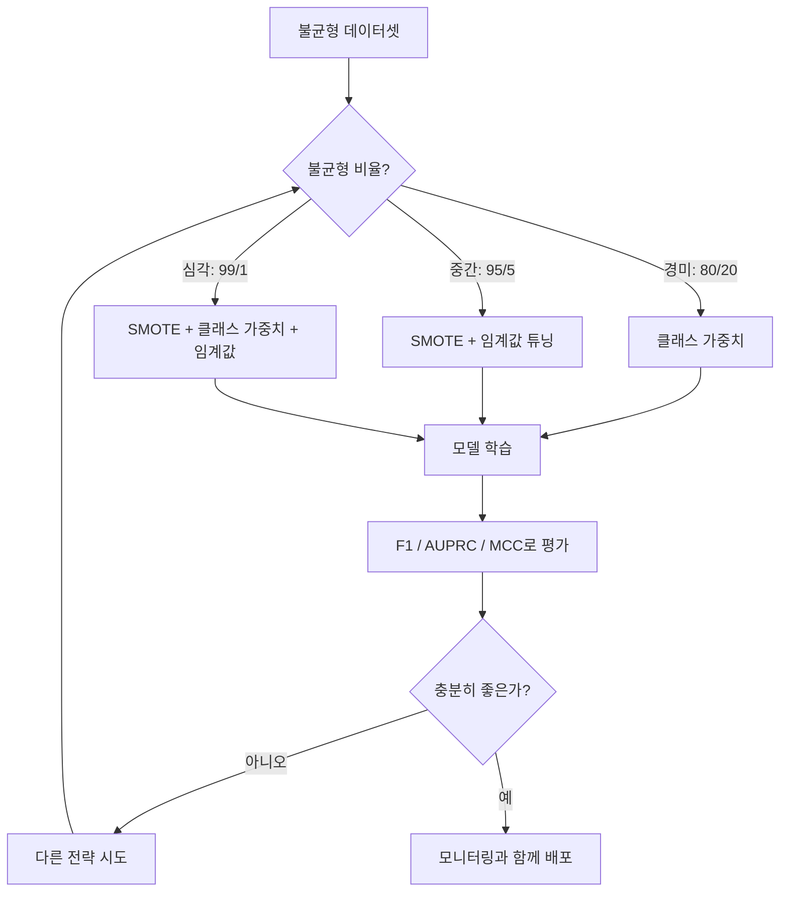
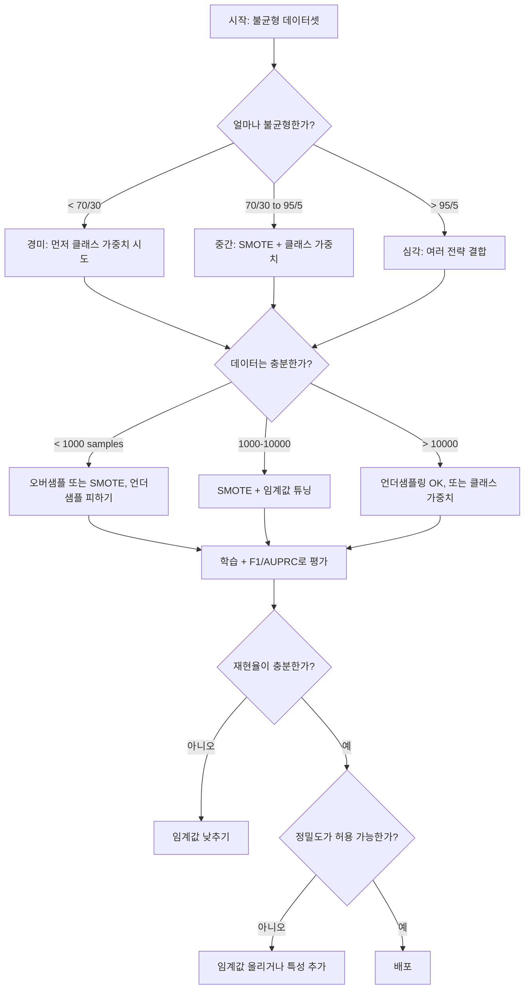

# 불균형 데이터 다루기 (Handling Imbalanced Data)

> 데이터의 99%가 "정상"이면, 정확도는 거짓말입니다.

**Type:** Build
**Language:** Python
**Prerequisites:** Phase 2, Lessons 01-09 (especially evaluation metrics)
**Time:** ~90 minutes

## 학습 목표 (Learning Objectives)

- SMOTE를 처음부터 구현하고, 합성 오버샘플링이 단순 복제와 어떻게 다른지 설명합니다
- 정확도 대신 F1, AUPRC, Matthews Correlation Coefficient로 불균형 분류기를 평가합니다
- 클래스 가중치, 임계값 튜닝, 리샘플링 전략을 비교하고 불균형 비율에 맞는 접근을 고릅니다
- SMOTE, 클래스 가중치, 임계값 최적화를 결합한 완전한 불균형 데이터 파이프라인을 구축합니다

## 문제 상황 (The Problem)

사기 탐지 모델을 만듭니다. 정확도 99.9%가 나옵니다. 축하하다가, 모든 거래를 "사기 아님"으로만 예측한다는 사실을 깨닫습니다.

버그가 아닙니다. 거래의 0.1%만 사기일 때 합리적인 선택입니다. 모델은 항상 다수 클래스를 찍는 것이 전체 오차를 최소화한다는 것을 배웁니다. 기술적으로는 맞고, 완전히 쓸모없습니다.

실제 분류가 중요한 곳마다 이런 일이 일어납니다. 질병 진단: 양성 1%. 네트워크 침입: 공격 0.01%. 제조 결함: 불량 0.5%. 스팸 필터: 스팸 20%. 이탈 예측: 이탈자 5%. 소수 클래스가 더 중요할수록, 더 드문 경향이 있습니다.

정확도가 실패하는 이유는 모든 올바른 예측을 동일하게 취급하기 때문입니다. 정상 거래를 맞게 표시하는 것과 사기를 잡는 것이 각각 정확도 1점으로 칩니다. 그런데 사기를 잡는 것이 모델이 존재하는 이유 전부입니다. 드물지만 중요한 클래스에 모델이 주목하도록 강제하는 지표, 기법, 학습 전략이 필요합니다.

## 핵심 개념 (The Concept)

### 정확도가 실패하는 이유 (Why Accuracy Fails)

샘플 1000개 데이터셋: 음성 990, 양성 10. 항상 음성을 예측하는 모델:

|  | Predicted Positive | Predicted Negative |
|--|---|---|
| Actually Positive | 0 (TP) | 10 (FN) |
| Actually Negative | 0 (FP) | 990 (TN) |

Accuracy = (0 + 990) / 1000 = 99.0%

모델은 사기 0건, 질병 0건, 결함 0건을 잡습니다. 그런데 정확도는 99%라고 합니다. 불균형 문제에서 정확도가 위험한 이유입니다.

### 더 나은 지표 (Better Metrics)

**Precision(정밀도)** = TP / (TP + FP). 양성으로 표시한 것 중 실제로 양성인 비율. 높은 정밀도는 오경보가 적다는 뜻입니다.

**Recall(재현율)** = TP / (TP + FN). 실제 양성 중 얼마나 잡았는지. 높은 재현율은 놓친 양성이 적다는 뜻입니다.

**F1 Score** = 2 * precision * recall / (precision + recall). 조화평균. 산술평균보다 정밀도·재현율의 극단적 불균형을 더 강하게 벌합니다.

**F-beta Score** = (1 + beta^2) * precision * recall / (beta^2 * precision + recall). beta > 1이면 재현율이 더 중요하고, beta < 1이면 정밀도가 더 중요합니다. 사기 탐지에서는 F2가 흔합니다(사기를 놓치는 것이 오경보보다 나쁨).

**AUPRC** (Area Under Precision-Recall Curve). AUC-ROC와 비슷하지만 불균형 데이터에 더 정보적입니다. 무작위 분류기의 AUPRC는 양성 클래스 비율과 같습니다(ROC처럼 0.5가 아님). 그래서 개선이 더 잘 보입니다.

**Matthews Correlation Coefficient** = (TP * TN - FP * FN) / sqrt((TP+FP)(TP+FN)(TN+FP)(TN+FN)). -1에서 +1 범위. 두 클래스 모두에서 잘할 때만 높은 점수를 줍니다. 클래스 크기가 아주 달라도 균형 잡힙니다.

위의 "항상 음성 예측" 모델: precision = 0/0 (미정의, 보통 0으로 둠), recall = 0/10 = 0, F1 = 0, MCC = 0. 이 지표들은 모델이 쓸모없음을 올바르게 드러냅니다.

### 불균형 데이터 파이프라인 (The Imbalanced Data Pipeline)



### SMOTE: Synthetic Minority Oversampling Technique

랜덤 오버샘플링은 기존 소수 샘플을 복제합니다. 동작은 하지만, 모델이 동일한 점을 반복해 보게 되어 과적합 위험이 있습니다.

SMOTE는 복제가 아닌, 그럴듯한 합성 소수 샘플을 만듭니다. 알고리즘:

1. 각 소수 샘플 x에 대해, 다른 소수 샘플 중 k-최근접 이웃을 찾습니다
2. 이웃 하나를 무작위로 고릅니다
3. x와 그 이웃 사이 선분 위에 새 샘플을 만듭니다

공식: `new_sample = x + random(0, 1) * (neighbor - x)`

실제 소수 점들 사이를 보간하여, 기존 데이터를 그대로 복사하지 않고 같은 특성 공간 영역에 샘플을 만듭니다.


### 샘플링 전략 비교 (Sampling Strategies Compared)

**Random Oversampling(랜덤 오버샘플링)**: 소수 샘플을 다수 개수에 맞춰 복제합니다.
- 장점: 단순, 정보 손실 없음
- 단점: 완전 복제로 과적합, 학습 시간 증가

**Random Undersampling(랜덤 언더샘플링)**: 다수 샘플을 소수 개수에 맞춰 제거합니다.
- 장점: 빠른 학습, 단순
- 단점: 유용할 수 있는 다수 데이터를 버림, 분산 증가

**SMOTE**: 보간으로 합성 소수 샘플을 만듭니다.
- 장점: 새 데이터 점 생성, 랜덤 오버샘플링보다 과적합 감소
- 단점: 결정 경계 근처의 노이즈 샘플을 만들 수 있음, 다수 클래스 분포를 반영하지 않음

| Strategy | Data Changed | Risk | When to Use |
|----------|-------------|------|-------------|
| Oversample | 소수 복제 | 과적합 | 작은 데이터셋, 중간 불균형 |
| Undersample | 다수 제거 | 정보 손실 | 큰 데이터셋, 빠른 학습이 필요할 때 |
| SMOTE | 합성 소수 추가 | 경계 노이즈 | 중간 불균형, k-NN에 충분한 소수 샘플 |

### 클래스 가중치 (Class Weights)

데이터를 바꾸지 않고, 모델이 오차를 다루는 방식을 바꿉니다. 소수 클래스 오분류에 더 높은 가중치를 줍니다.

음성 950, 양성 50인 이진 문제:
- 음성 클래스 가중치 = n_samples / (2 * n_negative) = 1000 / (2 * 950) = 0.526
- 양성 클래스 가중치 = n_samples / (2 * n_positive) = 1000 / (2 * 50) = 10.0

양성 클래스가 19배 가중치를 받습니다. 양성 하나를 틀리는 비용이 음성 19개를 틀리는 것과 같습니다. 모델은 소수 클래스에 주목해야 합니다.

로지스틱 회귀에서는 손실 함수가 이렇게 바뀝니다:

```
weighted_loss = -sum(w_i * [y_i * log(p_i) + (1-y_i) * log(1-p_i)])
```

여기서 w_i는 샘플 i의 클래스에 따라 달라집니다.

클래스 가중치는 기댓값 측면에서 오버샘플링과 수학적으로 동등하지만, 새 데이터 점을 만들지 않습니다. 더 빠르고 복제 샘플의 과적합 위험을 피합니다.

### 임계값 튜닝 (Threshold Tuning)

대부분의 분류기는 확률을 출력합니다. 기본 임계값은 0.5입니다: P(positive) >= 0.5이면 양성으로 예측. 하지만 0.5는 임의적입니다. 클래스가 불균형하면 최적 임계값은 보통 훨씬 낮습니다.

과정:
1. 모델을 학습합니다
2. 검증 세트에서 예측 확률을 얻습니다
3. 임계값을 0.0부터 1.0까지 훑습니다
4. 각 임계값에서 F1(또는 선택한 지표)을 계산합니다
5. 지표를 최대화하는 임계값을 고릅니다


모델이 사기 거래에 P(fraud) = 0.15를 줄 수 있습니다. 임계값 0.5에서는 사기 아님으로 분류됩니다. 임계값 0.10에서는 올바르게 잡힙니다. 확률 보정(calibration)보다 순위가 더 중요합니다 — 사기가 비사기보다 높은 확률을 받기만 하면, 둘을 가르는 임계값이 존재합니다.

### 비용 민감 학습 (Cost-Sensitive Learning)

클래스 가중치의 일반화입니다. 균일 비용 대신 구체적인 오분류 비용을 부여합니다:

| | Predict Positive | Predict Negative |
|--|---|---|
| Actually Positive | 0 (correct) | C_FN = 100 |
| Actually Negative | C_FP = 1 | 0 (correct) |

사기 거래를 놓치는 것(FN)이 오경보(FP)보다 100배 비쌉니다. 모델은 총 오차 개수가 아니라 총 비용을 최적화합니다.

실제 세계 비용을 추정할 수 있을 때 가장 원칙적인 접근입니다. 암을 놓친 진단과 추가 조직검사를 유발하는 오경보의 비용은 매우 다릅니다. 이 비용을 명시하면 올바른 트레이드오프를 강제합니다.

### 결정 흐름도 (Decision Flowchart)



```figure
class-imbalance
```

## 직접 구현하기 (Build It)

### Step 1: 불균형 데이터셋 생성

```python
import numpy as np


def make_imbalanced_data(n_majority=950, n_minority=50, seed=42):
    rng = np.random.RandomState(seed)

    X_maj = rng.randn(n_majority, 2) * 1.0 + np.array([0.0, 0.0])
    X_min = rng.randn(n_minority, 2) * 0.8 + np.array([2.5, 2.5])

    X = np.vstack([X_maj, X_min])
    y = np.concatenate([np.zeros(n_majority), np.ones(n_minority)])

    shuffle_idx = rng.permutation(len(y))
    return X[shuffle_idx], y[shuffle_idx]
```

### Step 2: SMOTE를 처음부터

```python
def euclidean_distance(a, b):
    return np.sqrt(np.sum((a - b) ** 2))


def find_k_neighbors(X, idx, k):
    distances = []
    for i in range(len(X)):
        if i == idx:
            continue
        d = euclidean_distance(X[idx], X[i])
        distances.append((i, d))
    distances.sort(key=lambda x: x[1])
    return [d[0] for d in distances[:k]]


def smote(X_minority, k=5, n_synthetic=100, seed=42):
    rng = np.random.RandomState(seed)
    n_samples = len(X_minority)
    k = min(k, n_samples - 1)
    synthetic = []

    for _ in range(n_synthetic):
        idx = rng.randint(0, n_samples)
        neighbors = find_k_neighbors(X_minority, idx, k)
        neighbor_idx = neighbors[rng.randint(0, len(neighbors))]
        t = rng.random()
        new_point = X_minority[idx] + t * (X_minority[neighbor_idx] - X_minority[idx])
        synthetic.append(new_point)

    return np.array(synthetic)
```

### Step 3: 랜덤 오버샘플링과 언더샘플링

```python
def random_oversample(X, y, seed=42):
    rng = np.random.RandomState(seed)
    classes, counts = np.unique(y, return_counts=True)
    max_count = counts.max()

    X_resampled = list(X)
    y_resampled = list(y)

    for cls, count in zip(classes, counts):
        if count < max_count:
            cls_indices = np.where(y == cls)[0]
            n_needed = max_count - count
            chosen = rng.choice(cls_indices, size=n_needed, replace=True)
            X_resampled.extend(X[chosen])
            y_resampled.extend(y[chosen])

    X_out = np.array(X_resampled)
    y_out = np.array(y_resampled)
    shuffle = rng.permutation(len(y_out))
    return X_out[shuffle], y_out[shuffle]


def random_undersample(X, y, seed=42):
    rng = np.random.RandomState(seed)
    classes, counts = np.unique(y, return_counts=True)
    min_count = counts.min()

    X_resampled = []
    y_resampled = []

    for cls in classes:
        cls_indices = np.where(y == cls)[0]
        chosen = rng.choice(cls_indices, size=min_count, replace=False)
        X_resampled.extend(X[chosen])
        y_resampled.extend(y[chosen])

    X_out = np.array(X_resampled)
    y_out = np.array(y_resampled)
    shuffle = rng.permutation(len(y_out))
    return X_out[shuffle], y_out[shuffle]
```

### Step 4: 클래스 가중치가 있는 로지스틱 회귀

```python
def sigmoid(z):
    return 1.0 / (1.0 + np.exp(-np.clip(z, -500, 500)))


def logistic_regression_weighted(X, y, weights, lr=0.01, epochs=200):
    n_samples, n_features = X.shape
    w = np.zeros(n_features)
    b = 0.0

    for _ in range(epochs):
        z = X @ w + b
        pred = sigmoid(z)
        error = pred - y
        weighted_error = error * weights

        gradient_w = (X.T @ weighted_error) / n_samples
        gradient_b = np.mean(weighted_error)

        w -= lr * gradient_w
        b -= lr * gradient_b

    return w, b


def compute_class_weights(y):
    classes, counts = np.unique(y, return_counts=True)
    n_samples = len(y)
    n_classes = len(classes)
    weight_map = {}
    for cls, count in zip(classes, counts):
        weight_map[cls] = n_samples / (n_classes * count)
    return np.array([weight_map[yi] for yi in y])
```

### Step 5: 임계값 튜닝

```python
def find_optimal_threshold(y_true, y_probs, metric="f1"):
    best_threshold = 0.5
    best_score = -1.0

    for threshold in np.arange(0.05, 0.96, 0.01):
        y_pred = (y_probs >= threshold).astype(int)
        tp = np.sum((y_pred == 1) & (y_true == 1))
        fp = np.sum((y_pred == 1) & (y_true == 0))
        fn = np.sum((y_pred == 0) & (y_true == 1))

        if metric == "f1":
            precision = tp / (tp + fp) if (tp + fp) > 0 else 0.0
            recall = tp / (tp + fn) if (tp + fn) > 0 else 0.0
            score = 2 * precision * recall / (precision + recall) if (precision + recall) > 0 else 0.0
        elif metric == "recall":
            score = tp / (tp + fn) if (tp + fn) > 0 else 0.0
        elif metric == "precision":
            score = tp / (tp + fp) if (tp + fp) > 0 else 0.0

        if score > best_score:
            best_score = score
            best_threshold = threshold

    return best_threshold, best_score
```

### Step 6: 평가 함수

```python
def confusion_matrix_values(y_true, y_pred):
    tp = np.sum((y_pred == 1) & (y_true == 1))
    tn = np.sum((y_pred == 0) & (y_true == 0))
    fp = np.sum((y_pred == 1) & (y_true == 0))
    fn = np.sum((y_pred == 0) & (y_true == 1))
    return tp, tn, fp, fn


def compute_metrics(y_true, y_pred):
    tp, tn, fp, fn = confusion_matrix_values(y_true, y_pred)
    accuracy = (tp + tn) / (tp + tn + fp + fn)
    precision = tp / (tp + fp) if (tp + fp) > 0 else 0.0
    recall = tp / (tp + fn) if (tp + fn) > 0 else 0.0
    f1 = 2 * precision * recall / (precision + recall) if (precision + recall) > 0 else 0.0

    denom = np.sqrt(float((tp + fp) * (tp + fn) * (tn + fp) * (tn + fn)))
    mcc = (tp * tn - fp * fn) / denom if denom > 0 else 0.0

    return {
        "accuracy": accuracy,
        "precision": precision,
        "recall": recall,
        "f1": f1,
        "mcc": mcc,
    }
```

### Step 7: 모든 접근 비교

```python
X, y = make_imbalanced_data(950, 50, seed=42)
split = int(0.8 * len(y))
X_train, X_test = X[:split], X[split:]
y_train, y_test = y[:split], y[split:]

# Baseline: no treatment
w_base, b_base = logistic_regression_weighted(
    X_train, y_train, np.ones(len(y_train)), lr=0.1, epochs=300
)
probs_base = sigmoid(X_test @ w_base + b_base)
preds_base = (probs_base >= 0.5).astype(int)

# Oversampled
X_over, y_over = random_oversample(X_train, y_train)
w_over, b_over = logistic_regression_weighted(
    X_over, y_over, np.ones(len(y_over)), lr=0.1, epochs=300
)
preds_over = (sigmoid(X_test @ w_over + b_over) >= 0.5).astype(int)

# SMOTE
minority_mask = y_train == 1
X_minority = X_train[minority_mask]
synthetic = smote(X_minority, k=5, n_synthetic=len(y_train) - 2 * int(minority_mask.sum()))
X_smote = np.vstack([X_train, synthetic])
y_smote = np.concatenate([y_train, np.ones(len(synthetic))])
w_sm, b_sm = logistic_regression_weighted(
    X_smote, y_smote, np.ones(len(y_smote)), lr=0.1, epochs=300
)
preds_smote = (sigmoid(X_test @ w_sm + b_sm) >= 0.5).astype(int)

# Class weights
sample_weights = compute_class_weights(y_train)
w_cw, b_cw = logistic_regression_weighted(
    X_train, y_train, sample_weights, lr=0.1, epochs=300
)
probs_cw = sigmoid(X_test @ w_cw + b_cw)
preds_cw = (probs_cw >= 0.5).astype(int)

# Threshold tuning (tune on held-out validation set, not test set)
probs_val = sigmoid(X_val @ w_cw + b_cw)
best_thresh, best_f1 = find_optimal_threshold(y_val, probs_val, metric="f1")
preds_thresh = (probs_cw >= best_thresh).astype(int)
```

코드 파일은 이 전부를 하나의 스크립트로 실행하고 결과를 출력합니다.

## 라이브러리로 쓰기 (Use It)

scikit-learn과 imbalanced-learn이면 이 기법들은 한 줄입니다:

```python
from sklearn.linear_model import LogisticRegression
from sklearn.metrics import classification_report, f1_score
from sklearn.model_selection import train_test_split
from imblearn.over_sampling import SMOTE
from imblearn.under_sampling import RandomUnderSampler
from imblearn.pipeline import Pipeline

X_train, X_test, y_train, y_test = train_test_split(X, y, stratify=y)

model_weighted = LogisticRegression(class_weight="balanced")
model_weighted.fit(X_train, y_train)
print(classification_report(y_test, model_weighted.predict(X_test)))

smote = SMOTE(random_state=42)
X_resampled, y_resampled = smote.fit_resample(X_train, y_train)
model_smote = LogisticRegression()
model_smote.fit(X_resampled, y_resampled)
print(classification_report(y_test, model_smote.predict(X_test)))

pipeline = Pipeline([
    ("smote", SMOTE()),
    ("model", LogisticRegression(class_weight="balanced")),
])
pipeline.fit(X_train, y_train)
print(classification_report(y_test, pipeline.predict(X_test)))
```

처음부터 구현한 코드는 각 기법이 정확히 무엇을 하는지 보여 줍니다. SMOTE는 소수 클래스에 대한 k-NN 보간일 뿐입니다. 클래스 가중치는 손실에 곱합니다. 임계값 튜닝은 cutoff에 대한 for-loop입니다. 마법은 없습니다.

## 산출물 배포 (Ship It)

이 레슨의 산출물:
- `outputs/skill-imbalanced-data.md` -- 불균형 분류 문제를 다루기 위한 결정 체크리스트

## 연습 문제 (Exercises)

1. **Borderline-SMOTE**: SMOTE 구현을 수정해, 결정 경계 근처의 소수 점(k-최근접 이웃에 다수 클래스 샘플이 포함된 점)에만 합성 샘플을 생성하세요. 클래스가 겹치는 데이터셋에서 표준 SMOTE와 결과를 비교하세요.

2. **비용 행렬 최적화**: 비용 행렬이 매개변수인 비용 민감 학습을 구현하세요. 비용 행렬을 받아 기대 비용을 최소화하는 최적 예측을 반환하는 함수를 만드세요. 서로 다른 비용 비율(1:10, 1:100, 1:1000)로 테스트하고 정밀도-재현율 트레이드오프가 어떻게 바뀌는지 그리세요.

3. **임계값 보정**: Platt scaling을 구현하세요(모델의 원시 출력에 로지스틱 회귀를 맞춰 보정된 확률을 만듦). 보정 전후 정밀도-재현율 곡선을 비교하세요. 보정이 순위는 바꾸지 않으면서(AUC는 동일) 확률을 더 의미 있게 만든다는 것을 보이세요.

4. **균형 배깅 앙상블**: 각각 균형 잡힌 부트스트랩 샘플(소수 전부 + 다수의 랜덤 부분집합)로 여러 모델을 학습하고 예측을 평균하세요. 이 접근을 SMOTE 단일 모델과 비교하세요. 성능과 실행 간 분산을 모두 측정하세요.

5. **불균형 비율 실험**: 균형 데이터셋을 가져와 불균형 비율을 점진적으로 올리세요(50/50, 70/30, 90/10, 95/5, 99/1). 각 비율에서 SMOTE 유무로 학습하세요. 두 접근에 대해 F1 vs 불균형 비율을 그리세요. 어느 비율부터 SMOTE가 의미 있는 차이를 만들기니까?

## 핵심 용어 (Key Terms)

| Term | What people say | What it actually means |
|------|----------------|----------------------|
| Class imbalance | "한 클래스에 샘플이 훨씬 많다" | 데이터셋의 클래스 분포가 크게 치우쳐 모델이 다수 클래스를 선호하게 됨 |
| SMOTE | "합성 오버샘플링" | 기존 소수 샘플과 그 k-최근접 소수 이웃 사이를 보간해 새 소수 샘플을 만듦 |
| Class weights | "드문 클래스 오차를 더 비싸게" | 손실 함수에 클래스별 가중치를 곱해 소수 오분류를 더 강하게 벌함 |
| Threshold tuning | "결정 경계를 옮긴다" | 분류 확률 cutoff를 기본 0.5에서 원하는 지표를 최적화하는 값으로 바꿈 |
| Precision-recall tradeoff | "둘 다 가질 수 없다" | 임계값을 낮추면 양성을 더 잡지만(재현율↑) 오경보도 늘고(정밀도↓), 반대도 성립 |
| AUPRC | "PR 곡선 아래 면적" | 정밀도-재현율 곡선을 하나의 숫자로 요약; 심한 불균형에서 AUC-ROC보다 정보적 |
| Matthews Correlation Coefficient | "균형 잡힌 지표" | 예측과 실제 라벨의 상관으로, 두 클래스 모두에서 잘할 때만 높은 점수 |
| Cost-sensitive learning | "실수마다 비용이 다르다" | 실제 오분류 비용을 학습 목적에 넣어 오차 개수가 아니라 총 비용을 최적화 |
| Random oversampling | "소수를 복제한다" | 클래스 수를 맞추려고 소수 샘플을 반복; 단순하지만 복제 점에 과적합 위험 |

## 더 읽을거리 (Further Reading)

- [SMOTE: Synthetic Minority Over-sampling Technique (Chawla et al., 2002)](https://arxiv.org/abs/1106.1813) -- 원본 SMOTE 논문, 불균형 학습에서 여전히 가장 많이 인용됨
- [Learning from Imbalanced Data (He & Garcia, 2009)](https://ieeexplore.ieee.org/document/5128907) -- 샘플링, 비용 민감, 알고리즘적 접근을 다루는 포괄적 서베이
- [imbalanced-learn documentation](https://imbalanced-learn.org/stable/) -- SMOTE 변형, 언더샘플링 전략, 파이프라인 통합이 있는 Python 라이브러리
- [The Precision-Recall Plot Is More Informative than the ROC Plot (Saito & Rehmsmeier, 2015)](https://journals.plos.org/plosone/article?id=10.1371/journal.pone.0118432) -- 불균형 문제에서 PR 곡선을 ROC보다 언제·왜 선호하는지
