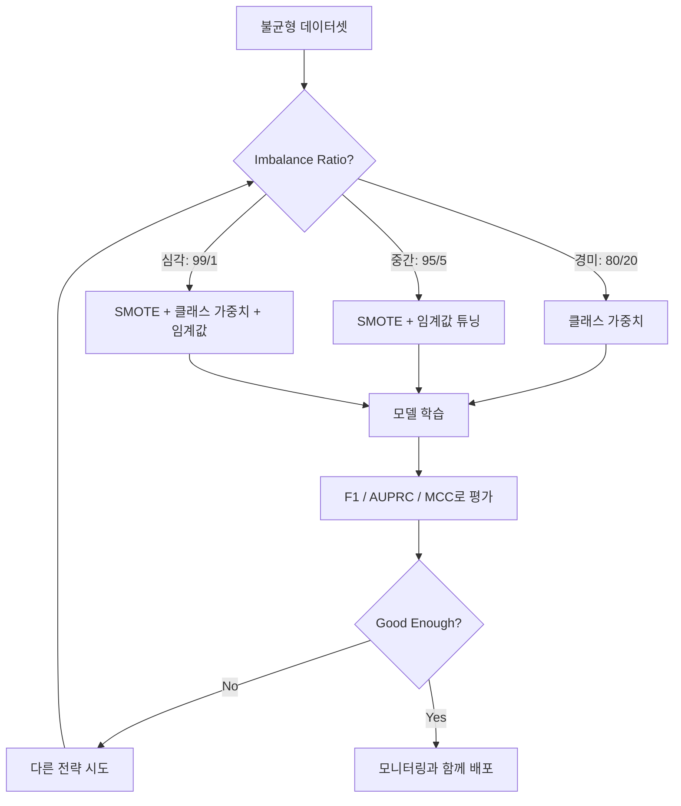
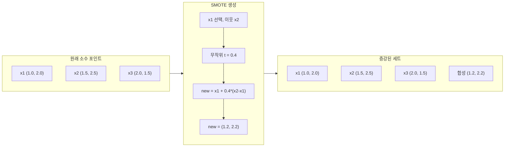
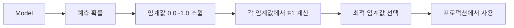
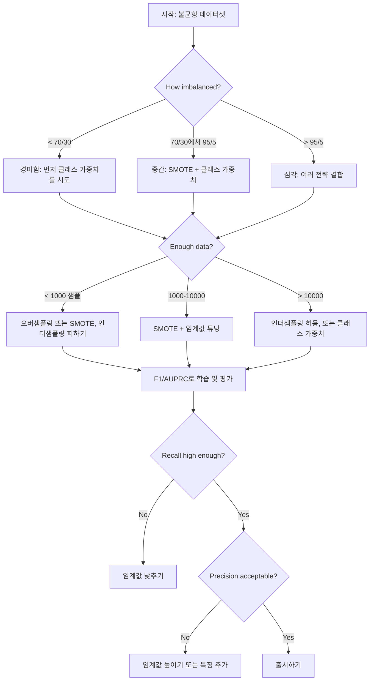

# 불균형 데이터 처리

> 데이터의 99%가 "정상"일 때, 정확도는 거짓말입니다.

**유형:** Build
**언어:** Python
**선수 요건:** 2단계, 01-09강 (특히 평가 지표)
**시간:** 약 90분

## 학습 목표

- SMOTE를 처음부터 구현하고, 합성 오버샘플링이 무작위 중복과 어떻게 다른지 설명해 보세요
- 정확도 대신 F1, AUPRC, 매튜스 상관계수를 사용하여 불균형 분류기를 평가해 보세요
- 클래스 가중치, 임계값 튜닝, 리샘플링 전략을 비교하고, 주어진 불균형 비율에 맞는 올바른 접근법을 선택해 보세요
- SMOTE, 클래스 가중치, 임계값 최적화를 결합한 완전한 불균형 데이터 파이프라인을 구축해 보세요

## 문제점

사기 탐지 모델을 구축했습니다. 정확도가 99.9% 나옵니다. 축하합니다. 그런데 모든 거래에 대해 "사기 아님"을 예측한다는 사실을 깨닫게 됩니다.

이것은 버그가 아닙니다. 거래의 0.1%만 사기일 때 합리적인 선택입니다. 모델은 항상 다수 클래스를 예측하는 것이 전체 오류를 최소화한다는 것을 학습합니다. 기술적으로 정확하지만 완전히 쓸모가 없습니다.

실제 분류가 중요한 모든 곳에서 이런 일이 발생합니다. 질병 진단: 양성률 1%. 네트워크 침입: 공격률 0.01%. 제조 결함: 불량률 0.5%. 스팸 필터링: 스팸률 20%. 이탈 예측: 이탈자 비율 5%. 소수 클래스가 더 중요할수록, 그 희소성은 더 커지는 경향이 있습니다.

정확도는 모든 올바른 예측을 동일하게 취급하기 때문에 실패합니다. 합법적인 거래를 올바르게 라벨링하는 것과 사기를 올바르게 포착하는 것 모두 정확도 1점으로 계산됩니다. 하지만 사기를 포착하는 것이 모델이 존재하는 이유의 전부입니다. 모델이 희소하지만 중요한 클래스에 주의를 기울이도록 강제하는 지표, 기법, 학습 전략이 필요합니다.

## 개념

### 정확도가 실패하는 이유

1000개의 샘플이 있는 데이터셋을 고려해 보세요: 990개는 음(negative), 10개는 양(positive)입니다. 항상 음(negative)을 예측하는 모델:

|  | 예측 양(Positive) | 예측 음(Negative) |
|--|---|---|
| 실제 양(Positive) | 0 (TP) | 10 (FN) |
| 실제 음성 | 0 (FP) | 990 (TN) |

정확도 = (0 + 990) / 1000 = 99.0%

모델은 사기를 전혀 잡지 못합니다. 질병도, 결함도 전혀 잡지 못합니다. 하지만 정확도는 99%라고 말합니다. 불균형 문제에서 정확도가 위험한 이유입니다.

### 더 나은 지표

**정밀도(Precision)** = TP / (TP + FP). 양성으로 분류된 항목 중 실제로 양성인 것은 몇 개일까요? 높은 정밀도는 오탐(False Alarm)이 적다는 의미입니다.

**재현율(Recall)** = TP / (TP + FN). 실제로 양성인 항목 중 우리가 잡은 것은 몇 개일까요? 높은 재현율은 놓친 양성이 적다는 의미입니다.

**F1 점수(F1 Score)** = 2 * 정밀도 * 재현율 / (정밀도 + 재현율). 조화 평균입니다. 산술 평균보다 정밀도와 재현율 간의 극단적인 불균형을 더 강하게 페널티합니다.

**F-beta 점수(F-beta Score)** = (1 + beta^2) * 정밀도 * 재현율 / (beta^2 * 정밀도 + 재현율). beta > 1일 때는 재현율이 더 중요하고, beta < 1일 때는 정밀도가 더 중요합니다. 사기 탐지에서는 F2가 일반적입니다 (사기를 놓치는 것이 오탐보다 더 나쁘기 때문입니다).

**AUPRC** (정밀도-재현율 곡선 아래 면적, Area Under Precision-Recall Curve). AUC-ROC와 유사하지만 불균형 데이터에 대해 더 많은 정보를 제공합니다. 무작위 분류기의 AUPRC는 양성 클래스 비율과 같습니다 (ROC처럼 0.5가 아님). 이를 통해 개선 사항을 더 쉽게 확인할 수 있습니다.

**매튜스 상관계수(Matthews Correlation Coefficient)** = (TP * TN - FP * FN) / sqrt((TP+FP)(TP+FN)(TN+FP)(TN+FN)). -1에서 +1까지 범위를 가집니다. 모델이 두 클래스 모두에서 잘 작동할 때만 높은 점수를 줍니다. 클래스 크기가 매우 다른 경우에도 균형 잡힌 지표입니다.

위 "항상 음성으로 예측하는" 모델의 경우: 정밀도 = 0/0 (정의되지 않음, 보통 0으로 설정), 재현율 = 0/10 = 0, F1 = 0, MCC = 0. 이 지표들은 모델이 쓸모없음을 올바르게 식별합니다.

### 불균형 데이터 파이프라인



### SMOTE: 합성 소수 클래스 과표본 추출 기법(Synthetic Minority Oversampling Technique)

무작위 과표본 추출은 기존 소수 샘플을 복제합니다. 이 방법은 작동하지만, 모델이 동일한 포인트를 반복적으로 보게 되어 과적합 위험이 있습니다.

SMOTE는 복제본이 아닌, 합리적으로 생성된 새로운 합성 소수 샘플을 만듭니다. 알고리즘은 다음과 같습니다:

1. 각 소수 샘플 x에 대해, 다른 소수 샘플 중 k개의 최근접 이웃을 찾습니다
2. 이웃 중 하나를 무작위로 선택합니다
3. x와 선택된 이웃 사이의 선분 위에 새로운 샘플을 생성합니다

공식: `new_sample = x + random(0, 1) * (neighbor - x)`

이 방법은 실제 소수 포인트들 사이를 보간하여, 기존 데이터를 단순히 복제하는 것이 아니라 동일한 특성 공간 영역에 샘플을 생성합니다.



### 표본 추출 전략 비교

**무작위 과표본 추출**: 다수 클래스의 개수에 맞추기 위해 소수 샘플을 복제합니다.
- 장점: 단순하며, 정보 손실이 없습니다
- 단점: 정확한 복제본이 과적합을 유발하며, 학습 시간이 증가합니다

**무작위 과소표본 추출**: 소수 클래스의 개수에 맞추기 위해 다수 샘플을 제거합니다.
- 장점: 빠른 학습, 단순함
- 단점: 잠재적으로 유용한 다수 클래스 데이터를 버리므로, 분산이 높아집니다

**SMOTE**: 보간을 통해 합성 소수 샘플을 생성합니다.
- 장점: 새로운 데이터 포인트를 생성하며, 무작위 과표본 추출에 비해 과적합을 줄입니다
- 단점: 결정 경계 근처에서 잡음 샘플을 생성할 수 있으며, 다수 클래스 분포를 고려하지 않습니다

| 전략 | 변경된 데이터 | 위험 | 사용 시점 |
|----------|-------------|------|-------------|
| 과표본 추출 | 소수 클래스 복제 | 과적합 | 작은 데이터셋, 중간 수준의 불균형 |
| 과소표본 추출 | 다수 클래스 제거 | 정보 손실 | 큰 데이터셋, 빠른 학습을 원할 때 |
| SMOTE | 합성 소수 클래스 추가 | 경계 잡음 | 중간 수준의 불균형, k-NN을 위한 충분한 소수 샘플 |

### 클래스 가중치

데이터를 변경하는 대신, 모델이 오류를 처리하는 방식을 변경합니다. 소수 클래스를 잘못 분류하는 데 더 높은 가중치를 부여합니다.

950개의 음성과 50개의 양성 샘플을 가진 이진 분류 문제의 경우:
- 음성 클래스 가중치 = n_samples / (2 * n_negative) = 1000 / (2 * 950) = 0.526
- 양성 클래스 가중치 = n_samples / (2 * n_positive) = 1000 / (2 * 50) = 10.0

양성 클래스는 19배의 가중치를 받습니다. 양성 샘플 하나를 잘못 분류하는 비용은 음성 샘플 19개를 잘못 분류하는 비용과 같습니다. 모델은 소수 클래스에 집중하도록 강제됩니다.

로지스틱 회귀에서는 손실 함수가 다음과 같이 수정됩니다:

```
weighted_loss = -sum(w_i * [y_i * log(p_i) + (1-y_i) * log(1-p_i)])
```

여기서 w_i는 샘플 i의 클래스에 따라 결정됩니다.

클래스 가중치는 기대값 측면에서 과표본 추출과 수학적으로 동일하지만, 새로운 데이터 포인트를 생성하지 않습니다. 따라서 더 빠르고, 복제된 샘플로 인한 과적합 위험을 피할 수 있습니다.

### 임계값 튜닝

대부분의 분류기는 확률을 출력합니다. 기본 임계값은 0.5입니다: P(positive) >= 0.5이면 양성을 예측합니다. 하지만 0.5는 임의의 값입니다. 클래스가 불균형할 때 최적의 임계값은 보통 훨씬 낮습니다.

과정은 다음과 같습니다:
1. 모델을 학습합니다
2. 검증 세트에서 예측 확률을 얻습니다
3. 0.0부터 1.0까지 임계값을 스윕합니다
4. 각 임계값에서 F1 (또는 선택한 지표)을 계산합니다
5. 지표를 최대화하는 임계값을 선택합니다



모델이 사기 거래에 대해 P(fraud) = 0.15를 출력할 수 있습니다. 임계값이 0.5인 경우, 이는 사기가 아닌 것으로 분류됩니다. 임계값이 0.10인 경우, 사기를 정확히 포착합니다. 확률 보정은 순위보다 중요도가 낮습니다. 사기가 비사기보다 높은 확률을 받는다면, 둘을 분리하는 임계값이 존재합니다.

### 비용 민감 학습

클래스 가중치의 일반화입니다. 균일한 비용 대신, 특정 오분류 비용을 할당합니다:

| | 긍정으로 예측 | 부정으로 예측 |
|--|---|---|
| 실제로 긍정 | 0 (정확) | C_FN = 100 |
| 실제로 부정 | C_FP = 1 | 0 (정확) |

사기 거래를 놓치는 것(FN)은 오탐(FP)보다 비용이 100배 더 높습니다. 모델은 총 오류 수가 아닌 총 비용을 최적화합니다.

실제 비용을 추정할 수 있을 때 가장 원리적으로 타당한 접근법입니다. 암 진단을 놓치는 것은 추가 생검으로 이어지는 오탐과 비용이 매우 다릅니다. 이러한 비용을 명시적으로 설정하면 올바른 트레이드오프를 강제합니다.

### 의사결정 흐름도



```figure
class-imbalance
```

## 구현하기

### 1단계: 불균형 데이터셋 생성

```python
import numpy as np


def make_imbalanced_data(n_majority=950, n_minority=50, seed=42):
    rng = np.random.RandomState(seed)

    X_maj = rng.randn(n_majority, 2) * 1.0 + np.array([0.0, 0.0])
    X_min = rng.randn(n_minority, 2) * 0.8 + np.array([2.5, 2.5])

    X = np.vstack([X_maj, X_min])
    y = np.concatenate([np.zeros(n_majority), np.ones(n_minority)])

    shuffle_idx = rng.permutation(len(y))
    return X[shuffle_idx], y[shuffle_idx]
```

### 2단계: SMOTE를 처음부터 구현

```python
def euclidean_distance(a, b):
    return np.sqrt(np.sum((a - b) ** 2))


def find_k_neighbors(X, idx, k):
    distances = []
    for i in range(len(X)):
        if i == idx:
            continue
        d = euclidean_distance(X[idx], X[i])
        distances.append((i, d))
    distances.sort(key=lambda x: x[1])
    return [d[0] for d in distances[:k]]


def smote(X_minority, k=5, n_synthetic=100, seed=42):
    rng = np.random.RandomState(seed)
    n_samples = len(X_minority)
    k = min(k, n_samples - 1)
    synthetic = []

    for _ in range(n_synthetic):
        idx = rng.randint(0, n_samples)
        neighbors = find_k_neighbors(X_minority, idx, k)
        neighbor_idx = neighbors[rng.randint(0, len(neighbors))]
        t = rng.random()
        new_point = X_minority[idx] + t * (X_minority[neighbor_idx] - X_minority[idx])
        synthetic.append(new_point)

    return np.array(synthetic)
```

### 3단계: 랜덤 오버샘플링 및 언더샘플링

```python
def random_oversample(X, y, seed=42):
    rng = np.random.RandomState(seed)
    classes, counts = np.unique(y, return_counts=True)
    max_count = counts.max()

    X_resampled = list(X)
    y_resampled = list(y)

    for cls, count in zip(classes, counts):
        if count < max_count:
            cls_indices = np.where(y == cls)[0]
            n_needed = max_count - count
            chosen = rng.choice(cls_indices, size=n_needed, replace=True)
            X_resampled.extend(X[chosen])
            y_resampled.extend(y[chosen])

    X_out = np.array(X_resampled)
    y_out = np.array(y_resampled)
    shuffle = rng.permutation(len(y_out))
    return X_out[shuffle], y_out[shuffle]


def random_undersample(X, y, seed=42):
    rng = np.random.RandomState(seed)
    classes, counts = np.unique(y, return_counts=True)
    min_count = counts.min()

    X_resampled = []
    y_resampled = []

    for cls in classes:
        cls_indices = np.where(y == cls)[0]
        chosen = rng.choice(cls_indices, size=min_count, replace=False)
        X_resampled.extend(X[chosen])
        y_resampled.extend(y[chosen])

    X_out = np.array(X_resampled)
    y_out = np.array(y_resampled)
    shuffle = rng.permutation(len(y_out))
    return X_out[shuffle], y_out[shuffle]
```

### 4단계: 클래스 가중치를 적용한 로지스틱 회귀

```python
def sigmoid(z):
    return 1.0 / (1.0 + np.exp(-np.clip(z, -500, 500)))


def logistic_regression_weighted(X, y, weights, lr=0.01, epochs=200):
    n_samples, n_features = X.shape
    w = np.zeros(n_features)
    b = 0.0

    for _ in range(epochs):
        z = X @ w + b
        pred = sigmoid(z)
        error = pred - y
        weighted_error = error * weights

        gradient_w = (X.T @ weighted_error) / n_samples
        gradient_b = np.mean(weighted_error)

        w -= lr * gradient_w
        b -= lr * gradient_b

    return w, b


def compute_class_weights(y):
    classes, counts = np.unique(y, return_counts=True)
    n_samples = len(y)
    n_classes = len(classes)
    weight_map = {}
    for cls, count in zip(classes, counts):
        weight_map[cls] = n_samples / (n_classes * count)
    return np.array([weight_map[yi] for yi in y])
```

### 5단계: 임계값 튜닝

```python
def find_optimal_threshold(y_true, y_probs, metric="f1"):
    best_threshold = 0.5
    best_score = -1.0

    for threshold in np.arange(0.05, 0.96, 0.01):
        y_pred = (y_probs >= threshold).astype(int)
        tp = np.sum((y_pred == 1) & (y_true == 1))
        fp = np.sum((y_pred == 1) & (y_true == 0))
        fn = np.sum((y_pred == 0) & (y_true == 1))

        if metric == "f1":
            precision = tp / (tp + fp) if (tp + fp) > 0 else 0.0
            recall = tp / (tp + fn) if (tp + fn) > 0 else 0.0
            score = 2 * precision * recall / (precision + recall) if (precision + recall) > 0 else 0.0
        elif metric == "recall":
            score = tp / (tp + fn) if (tp + fn) > 0 else 0.0
        elif metric == "precision":
            score = tp / (tp + fp) if (tp + fp) > 0 else 0.0

        if score > best_score:
            best_score = score
            best_threshold = threshold

    return best_threshold, best_score
```

### 6단계: 평가 함수

```python
def confusion_matrix_values(y_true, y_pred):
    tp = np.sum((y_pred == 1) & (y_true == 1))
    tn = np.sum((y_pred == 0) & (y_true == 0))
    fp = np.sum((y_pred == 1) & (y_true == 0))
    fn = np.sum((y_pred == 0) & (y_true == 1))
    return tp, tn, fp, fn


def compute_metrics(y_true, y_pred):
    tp, tn, fp, fn = confusion_matrix_values(y_true, y_pred)
    accuracy = (tp + tn) / (tp + tn + fp + fn)
    precision = tp / (tp + fp) if (tp + fp) > 0 else 0.0
    recall = tp / (tp + fn) if (tp + fn) > 0 else 0.0
    f1 = 2 * precision * recall / (precision + recall) if (precision + recall) > 0 else 0.0

    denom = np.sqrt(float((tp + fp) * (tp + fn) * (tn + fp) * (tn + fn)))
    mcc = (tp * tn - fp * fn) / denom if denom > 0 else 0.0

    return {
        "accuracy": accuracy,
        "precision": precision,
        "recall": recall,
        "f1": f1,
        "mcc": mcc,
    }
```

### 7단계: 모든 접근법 비교

```python
X, y = make_imbalanced_data(950, 50, seed=42)
split = int(0.8 * len(y))
X_train, X_test = X[:split], X[split:]
y_train, y_test = y[:split], y[split:]

# 기준선: 처리 없음
w_base, b_base = logistic_regression_weighted(
    X_train, y_train, np.ones(len(y_train)), lr=0.1, epochs=300
)
probs_base = sigmoid(X_test @ w_base + b_base)
preds_base = (probs_base >= 0.5).astype(int)

# 오버샘플링
X_over, y_over = random_oversample(X_train, y_train)
w_over, b_over = logistic_regression_weighted(
    X_over, y_over, np.ones(len(y_over)), lr=0.1, epochs=300
)
preds_over = (sigmoid(X_test @ w_over + b_over) >= 0.5).astype(int)

# SMOTE
minority_mask = y_train == 1
X_minority = X_train[minority_mask]
synthetic = smote(X_minority, k=5, n_synthetic=len(y_train) - 2 * int(minority_mask.sum()))
X_smote = np.vstack([X_train, synthetic])
y_smote = np.concatenate([y_train, np.ones(len(synthetic))])
w_sm, b_sm = logistic_regression_weighted(
    X_smote, y_smote, np.ones(len(y_smote)), lr=0.1, epochs=300
)
preds_smote = (sigmoid(X_test @ w_sm + b_sm) >= 0.5).astype(int)

# 클래스 가중치
sample_weights = compute_class_weights(y_train)
w_cw, b_cw = logistic_regression_weighted(
    X_train, y_train, sample_weights, lr=0.1, epochs=300
)
probs_cw = sigmoid(X_test @ w_cw + b_cw)
preds_cw = (probs_cw >= 0.5).astype(int)

# 임계값 튜닝 (테스트 세트가 아닌 홀드아웃 검증 세트에서 튜닝)
probs_val = sigmoid(X_val @ w_cw + b_cw)
best_thresh, best_f1 = find_optimal_threshold(y_val, probs_val, metric="f1")
preds_thresh = (probs_cw >= best_thresh).astype(int)
```

이 코드 파일은 모든 과정을 단일 스크립트로 실행하고 결과를 출력합니다.

## 사용하기

scikit-learn과 imbalanced-learn를 사용하면 이러한 기법들은 한 줄 코드로 구현할 수 있습니다:

```python
from sklearn.linear_model import LogisticRegression
from sklearn.metrics import classification_report, f1_score
from sklearn.model_selection import train_test_split
from imblearn.over_sampling import SMOTE
from imblearn.under_sampling import RandomUnderSampler
from imblearn.pipeline import Pipeline

X_train, X_test, y_train, y_test = train_test_split(X, y, stratify=y)

model_weighted = LogisticRegression(class_weight="balanced")
model_weighted.fit(X_train, y_train)
print(classification_report(y_test, model_weighted.predict(X_test)))

smote = SMOTE(random_state=42)
X_resampled, y_resampled = smote.fit_resample(X_train, y_train)
model_smote = LogisticRegression()
model_smote.fit(X_resampled, y_resampled)
print(classification_report(y_test, model_smote.predict(X_test)))

pipeline = Pipeline([
    ("smote", SMOTE()),
    ("model", LogisticRegression(class_weight="balanced")),
])
pipeline.fit(X_train, y_train)
print(classification_report(y_test, pipeline.predict(X_test)))
```

직접 구현한 코드는 각 기법이 정확히 무엇을 하는지 보여줍니다. SMOTE는 소수 클래스에 대한 k-NN 보간일 뿐입니다. 클래스 가중치는 손실을 곱합니다. 임계값 튜닝은 컷오프에 대한 for 루프입니다. 마법은 없습니다.

## 출시하기

이 강의는 다음을 생성합니다:
- `outputs/skill-imbalanced-data.md` -- 불균형 분류 문제를 처리하기 위한 결정 체크리스트

## 연습 문제

1. **Borderline-SMOTE**: SMOTE 구현을 수정하여 결정 경계 근처의 소수 클래스 포인트(소수 클래스의 k-최근접 이웃에 다수 클래스 샘플이 포함되는 포인트)에만 합성 샘플을 생성하도록 하세요. 클래스가 겹치는 데이터셋에서 표준 SMOTE와 결과를 비교하세요.

2. **비용 행렬 최적화**: 비용 행렬이 매개변수인 비용 민감 학습을 구현하세요. 비용 행렬을 받아 기대 비용을 최소화하는 최적 예측을 반환하는 함수를 만드세요. 다양한 비용 비율(1:10, 1:100, 1:1000)으로 테스트하고 정밀도-재현율 트레이드오프가 어떻게 변하는지 플롯하세요.

3. **임계값 보정**: Platt 스케일링을 구현하세요 (모델의 원시 출력에 로지스틱 회귀를 적합하여 보정된 확률을 생성). 보정 전후의 정밀도-재현율 곡선을 비교하세요. 보정은 순위(AUC)를 변경하지 않지만 확률을 더 의미 있게 만든다는 것을 보이세요.

4. **균형 배깅 앙상블**: 여러 모델을 각각 균형 잡힌 부트스트랩 샘플(모든 소수 클래스 + 다수 클래스의 랜덤 서브셋)로 학습하세요. 예측을 평균 내세요. 이 접근법을 SMOTE를 사용한 단일 모델과 비교하세요. 실행 간 성능과 분산을 모두 측정하세요.

5. **불균형 비율 실험**: 균형 잡힌 데이터셋을 가져와 불균형 비율을 점진적으로 증가시키세요 (50/50, 70/30, 90/10, 95/5, 99/1). 각 비율에서 SMOTE를 사용했을 때와 사용하지 않았을 때 모두 학습하세요. 두 접근법에 대해 불균형 비율 대비 F1을 플롯하세요. SMOTE가 의미 있는 차이를 만들기 시작하는 비율은 어디인가요?

## 핵심 용어

| 용어 | 사람들이 말하는 표현 | 실제 의미 |
|------|----------------|----------------------|
| 클래스 불균형 | "한 클래스에 샘플이 훨씬 더 많다" | 데이터셋 내 클래스 분포가 심각하게 편향되어 모델이 다수 클래스를 선호하게 됨 |
| SMOTE | "합성 오버샘플링" | 기존 소수 샘플과 그 k-최근접 소수 이웃들 사이를 보간하여 새로운 소수 샘플을 생성 |
| 클래스 가중치 | "희소 클래스에 대한 오류를 더 비싸게 만든다" | 손실 함수에 클래스별 가중치를 곱하여 모델이 소수 클래스의 오분류를 더 강하게 페널티하도록 함 |
| 임계값 튜닝 | "결정 경계를 이동한다" | 분류를 위한 확률 컷오프를 기본값 0.5에서 원하는 지표가 최적화되는 값으로 변경 |
| 정밀도-재현율 트레이드오프 | "둘 다 가질 수 없다" | 임계값을 낮추면 더 많은 양의(true positive)를 포착(높은 재현율)하지만 더 많은 오탐(false positive)도 발생(낮은 정밀도)하며, 그 반대도 마찬가지 |
| AUPRC | "PR 곡선 아래 면적" | 정밀도-재현율 곡선을 하나의 숫자로 요약; 클래스가 심하게 불균형할 때 AUC-ROC보다 더 유용한 정보 제공 |
| 매튜스 상관계수 | "균형 잡힌 지표" | 예측 레이블과 실제 레이블 간의 상관계수로, 모델이 두 클래스 모두에서 잘 작동할 때만 높은 점수를 산출 |
| 비용 민감 학습 | "다른 실수는 다른 비용을 초래한다" | 실제 세계의 오분류 비용을 학습 목표에 반영하여 모델이 오류 개수가 아닌 총 비용을 최적화하도록 함 |
| 랜덤 오버샘플링 | "소수 클래스를 복제한다" | 클래스 개수를 균형 잡기 위해 소수 클래스 샘플을 반복; 간단하지만 복제된 포인트에 과적합될 위험이 있음 |

## 추가 읽기

- [SMOTE: Synthetic Minority Over-sampling Technique (Chawla et al., 2002)](https://arxiv.org/abs/1106.1813) -- SMOTE 원 논문으로, 불균형 학습에 관한 가장 많이 인용된 연구
- [Learning from Imbalanced Data (He & Garcia, 2009)](https://ieeexplore.ieee.org/document/5128907) -- 샘플링, 비용 민감, 알고리즘적 접근법을 포괄하는 종합적인 조사
- [imbalanced-learn documentation](https://imbalanced-learn.org/stable/) -- SMOTE 변형, 언더샘플링 전략, 파이프라인 통합을 제공하는 Python 라이브러리
- [The Precision-Recall Plot Is More Informative than the ROC Plot (Saito & Rehmsmeier, 2015)](https://journals.plos.org/plosone/article?id=10.1371/journal.pone.0118432) -- 불균형 문제에서 ROC 곡선보다 PR 곡선을 선호해야 하는 시점과 이유
