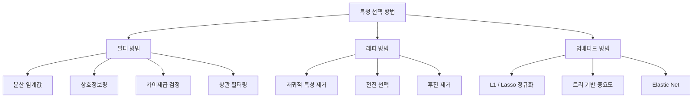
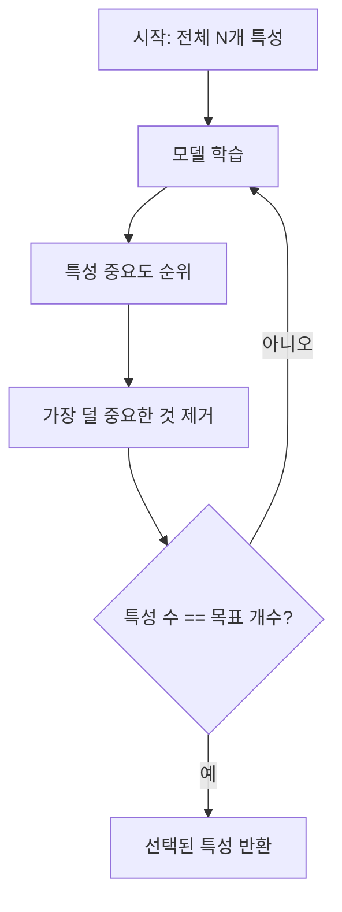
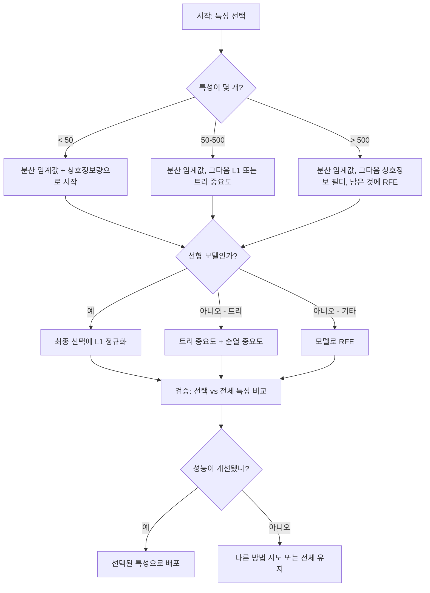

# 특성 선택 (Feature Selection)

> 특성이 많을수록 좋은 것이 아닙니다. 올바른 특성이 더 좋습니다.

**Type:** Build
**Language:** Python
**Prerequisites:** Phase 2, Lessons 01-09, 08 (feature engineering)
**Time:** ~75 minutes

## 학습 목표 (Learning Objectives)

- 필터 방법(분산 임계값, 상호정보량, 카이제곱)과 래퍼 방법(RFE, 전진 선택)을 처음부터 구현합니다
- 상호정보량이 상관이 놓치는 비선형 특성-타깃 관계를 왜 잡는지 설명합니다
- L1 정규화(임베디드 선택)와 RFE(래퍼 선택)를 비교하고 계산 트레이드오프를 평가합니다
- 여러 방법을 결합한 특성 선택 파이프라인을 만들고, 홀드아웃 데이터에서 일반화가 개선됨을 보입니다

## 문제 상황 (The Problem)

특성이 500개입니다. 모델 학습은 느리고, 계속 과적합하며, 무엇을 배웠는지 아무도 설명하지 못합니다. 성능을 올리려고 특성을 더 넣습니다. 더 나빠집니다.

이것이 차원의 저주입니다. 특성이 늘수록 특성 공간의 부피가 폭발합니다. 데이터 점이 희소해집니다. 점 사이 거리가 수렴합니다. 실제 패턴을 찾으려면 데이터가 지수적으로 더 필요합니다. 노이즈 특성이 신호 특성을 덮습니다. 과적합이 기본값이 됩니다.

특성 선택은 해독제입니다. 노이즈를 걷어내고, 중복을 제거하고, 타깃에 대한 실제 정보를 담은 특성만 남깁니다. 결과: 더 빠른 학습, 더 나은 일반화, 실제로 설명할 수 있는 모델.

목표는 가용한 정보를 모두 쓰는 것이 아닙니다. 올바른 정보를 쓰는 것입니다.

## 핵심 개념 (The Concept)

### 특성 선택의 세 범주 (Three Categories of Feature Selection)

모든 특성 선택 방법은 다음 세 범주 중 하나에 속합니다:



**필터 방법(Filter methods)**은 통계량으로 각 특성을 독립적으로 점수 매깁니다. 모델을 쓰지 않습니다. 빠르지만 특성 상호작용을 놓칩니다.

**래퍼 방법(Wrapper methods)**은 모델을 학습해 특성 부분집합을 평가합니다. 모델 성능을 점수로 씁니다. 결과는 더 좋지만, 모델을 여러 번 재학습하므로 비쌉니다.

**임베디드 방법(Embedded methods)**은 모델 학습의 일부로 특성을 선택합니다. L1 정규화는 가중치를 0으로 밀어냅니다. 결정 트리는 가장 유용한 특성으로 분할합니다. 선택은 별도 단계가 아니라 피팅 중에 일어납니다.

### 분산 임계값 (Variance Threshold)

가장 단순한 필터입니다. 샘플 전반에서 거의 변하지 않는 특성은 정보가 거의 없습니다.

1000개 중 999개에서 0.0인 특성을 생각해 보세요. 분산이 거의 0입니다. 어떤 모델도 클래스를 구분하는 데 쓸 수 없습니다. 제거하세요.

```
variance(x) = mean((x - mean(x))^2)
```

임계값(예: 0.01)을 정하고, 그 아래 분산인 특성을 모두 버립니다. 타깃을 전혀 보지 않고도 상수·준상수 특성을 제거합니다.

언제 쓰나: 다른 방법 앞의 전처리 단계로. 명백히 쓸모없는 특성을 거의 비용 없이 잡습니다.

한계: 분산이 높아도 순수 노이즈일 수 있습니다. 분산 임계값은 필요하지만 충분하지 않습니다.

### 상호정보량 (Mutual Information)

상호정보량은 특성 X의 값을 알면 타깃 Y에 대한 불확실성이 얼마나 줄어드는지를 잽니다.

```
I(X; Y) = sum_x sum_y p(x, y) * log(p(x, y) / (p(x) * p(y)))
```

X와 Y가 독립이면 p(x, y) = p(x) * p(y)이므로 log 항이 0이고 I(X; Y) = 0입니다. X가 Y에 대해 더 많이 알려 줄수록 상호정보량이 높습니다.

상관 대비 핵심 이점: 상호정보량은 비선형 관계를 잡습니다. 타깃과 상관이 0이어도, 관계가 이차·주기적이면 상호정보량은 높을 수 있습니다.

연속 특성은 먼저 구간으로 이산화합니다(히스토그램 기반 추정). 구간 수가 추정에 영향을 줍니다 — 너무 적으면 정보 손실, 너무 많으면 노이즈. 흔한 선택: sqrt(n)개 구간 또는 Sturges 규칙(1 + log2(n)).


### 재귀적 특성 제거 (Recursive Feature Elimination, RFE)

RFE는 래퍼 방법입니다. 모델 자체의 특성 중요도로 반복적으로 가지치기합니다:

1. 모든 특성으로 모델을 학습합니다
2. 중요도로 특성을 순위매깁니다(선형 모델은 계수, 트리는 불순도 감소)
3. 가장 덜 중요한 특성(들)을 제거합니다
4. 원하는 특성 수가 남을 때까지 반복합니다



RFE는 남은 특성을 모델이 함께 보기 때문에 특성 상호작용을 고려합니다. 하나를 제거하면 다른 특성의 중요도가 바뀝니다. 필터 방법보다 더 철저합니다.

비용: 모델을 N - target번 학습합니다. 특성 500개, 목표 10개면 490번 학습입니다. 비싼 모델에서는 느립니다. 한 스텝에 여러 특성을 제거하면(예: 매 라운드 하위 10%) 속도를 올릴 수 있습니다.

### L1 (Lasso) 정규화

L1 정규화는 손실 함수에 가중치 절댓값을 더합니다:

```
loss = prediction_error + alpha * sum(|w_i|)
```

alpha 매개변수가 특성을 얼마나 공격적으로 가지치기할지 제어합니다. alpha가 클수록 더 많은 가중치가 정확히 0이 됩니다.

왜 정확히 0인가? L1 페널티는 가중치 공간에 다이아몬드형 제약 영역을 만듭니다. 최적해는 종종 이 다이아몬드의 모서리에 떨어져, 하나 이상의 가중치가 0이 됩니다. L2 정규화(ridge)는 원형 제약을 만들어 가중치는 줄어들지만 거의 0에 닿지 않습니다.

이것이 임베디드 특성 선택입니다: 학습 중에 모델이 어떤 특성을 무시할지 배웁니다. 가중치가 0인 특성은 사실상 제거됩니다.

장점: 학습 한 번, 상관된 특성을 처리(하나를 고르고 나머지를 0으로), 대부분의 선형 모델 구현에 내장.

한계: 선형 모델에만 동작. 비선형 특성 중요도는 잡지 못함.

### 트리 기반 특성 중요도 (Tree-Based Feature Importance)

결정 트리와 그 앙상블(랜덤 포레스트, 그래디언트 부스팅)은 특성을 자연스럽게 순위매깁니다. 매 분할이 불순도를 줄입니다(분류는 Gini 또는 엔트로피, 회귀는 분산). 불순도 감소가 큰 특성이 더 중요합니다.

트리가 T개인 랜덤 포레스트:

```
importance(feature_j) = (1/T) * sum over all trees of
    sum over all nodes splitting on feature_j of
        (n_samples * impurity_decrease)
```

각 특성에 정규화된 중요도 점수를 줍니다. 비선형 관계와 특성 상호작용을 자동으로 다룹니다.

주의: 트리 기반 중요도는 고유값이 많은 특성(높은 카디널리티)에 편향됩니다. 랜덤 ID 열은 모든 샘플을 완벽하게 나누므로 중요해 보입니다. 순열 중요도로 건전성 검사를 하세요.

### 순열 중요도 (Permutation Importance)

모델에 무관한 방법:

1. 모델을 학습하고 검증 데이터에서 기준 성능을 기록합니다
2. 각 특성에 대해: 값을 무작위로 섞고, 성능 하락을 잽니다
3. 하락이 클수록 그 특성이 더 중요합니다

특성을 섞어도 성능이 안 떨어지면 모델이 그것에 의존하지 않습니다. 성능이 붕괴하면 그 특성은 핵심입니다.

순열 중요도는 트리 기반 중요도의 카디널리티 편향을 피합니다. 하지만 느립니다: 특성마다 전체 평가 한 번, 안정성을 위해 여러 번 반복.

### 비교 표 (Comparison Table)

| Method | Type | Speed | Nonlinear | Feature Interactions |
|--------|------|-------|-----------|---------------------|
| Variance threshold | Filter | Very fast | No | No |
| Mutual information | Filter | Fast | Yes | No |
| Correlation filter | Filter | Fast | No | No |
| RFE | Wrapper | Slow | Depends on model | Yes |
| L1 / Lasso | Embedded | Fast | No (linear) | No |
| Tree importance | Embedded | Medium | Yes | Yes |
| Permutation importance | Model-agnostic | Slow | Yes | Yes |

### 결정 흐름도 (Decision Flowchart)



```figure
f3-feature-prune
```

## 직접 구현하기 (Build It)

### Step 1: 알려진 특성 구조의 합성 데이터 생성

```python
import numpy as np


def make_feature_selection_data(n_samples=500, seed=42):
    rng = np.random.RandomState(seed)

    x1 = rng.randn(n_samples)
    x2 = rng.randn(n_samples)
    x3 = rng.randn(n_samples)
    x4 = x1 + 0.1 * rng.randn(n_samples)
    x5 = x2 + 0.1 * rng.randn(n_samples)

    informative = np.column_stack([x1, x2, x3, x4, x5])

    correlated = np.column_stack([
        x1 * 0.9 + 0.1 * rng.randn(n_samples),
        x2 * 0.8 + 0.2 * rng.randn(n_samples),
        x3 * 0.7 + 0.3 * rng.randn(n_samples),
        x1 * 0.5 + x2 * 0.5 + 0.1 * rng.randn(n_samples),
        x2 * 0.6 + x3 * 0.4 + 0.1 * rng.randn(n_samples),
    ])

    noise = rng.randn(n_samples, 10) * 0.5

    X = np.hstack([informative, correlated, noise])
    y = (2 * x1 - 1.5 * x2 + x3 + 0.5 * rng.randn(n_samples) > 0).astype(int)

    feature_names = (
        [f"info_{i}" for i in range(5)]
        + [f"corr_{i}" for i in range(5)]
        + [f"noise_{i}" for i in range(10)]
    )

    return X, y, feature_names
```

정답을 알고 있습니다: 특성 0-4는 정보적(3과 4는 0과 1의 상관 복제), 5-9는 정보적 특성과 상관, 10-19는 순수 노이즈. 좋은 선택 방법은 0-4를 가장 높게, 10-19를 가장 낮게 순위매겨야 합니다.

### Step 2: 분산 임계값

```python
def variance_threshold(X, threshold=0.01):
    variances = np.var(X, axis=0)
    mask = variances > threshold
    return mask, variances
```

### Step 3: 상호정보량 (이산)

```python
def discretize(x, n_bins=10):
    min_val, max_val = x.min(), x.max()
    if max_val == min_val:
        return np.zeros_like(x, dtype=int)
    bin_edges = np.linspace(min_val, max_val, n_bins + 1)
    binned = np.digitize(x, bin_edges[1:-1])
    return binned


def mutual_information(X, y, n_bins=10):
    n_samples, n_features = X.shape
    mi_scores = np.zeros(n_features)

    y_vals, y_counts = np.unique(y, return_counts=True)
    p_y = y_counts / n_samples

    for f in range(n_features):
        x_binned = discretize(X[:, f], n_bins)
        x_vals, x_counts = np.unique(x_binned, return_counts=True)
        p_x = dict(zip(x_vals, x_counts / n_samples))

        mi = 0.0
        for xv in x_vals:
            for yi, yv in enumerate(y_vals):
                joint_mask = (x_binned == xv) & (y == yv)
                p_xy = np.sum(joint_mask) / n_samples
                if p_xy > 0:
                    mi += p_xy * np.log(p_xy / (p_x[xv] * p_y[yi]))
        mi_scores[f] = mi

    return mi_scores
```

### Step 4: 재귀적 특성 제거

```python
def simple_logistic_importance(X, y, lr=0.1, epochs=100):
    n_samples, n_features = X.shape
    w = np.zeros(n_features)
    b = 0.0

    for _ in range(epochs):
        z = X @ w + b
        pred = 1.0 / (1.0 + np.exp(-np.clip(z, -500, 500)))
        error = pred - y
        w -= lr * (X.T @ error) / n_samples
        b -= lr * np.mean(error)

    return w, b


def rfe(X, y, n_features_to_select=5, lr=0.1, epochs=100):
    n_total = X.shape[1]
    remaining = list(range(n_total))
    rankings = np.ones(n_total, dtype=int)
    rank = n_total

    while len(remaining) > n_features_to_select:
        X_subset = X[:, remaining]
        w, _ = simple_logistic_importance(X_subset, y, lr, epochs)
        importances = np.abs(w)

        least_idx = np.argmin(importances)
        original_idx = remaining[least_idx]
        rankings[original_idx] = rank
        rank -= 1
        remaining.pop(least_idx)

    for idx in remaining:
        rankings[idx] = 1

    selected_mask = rankings == 1
    return selected_mask, rankings
```

### Step 5: L1 특성 선택

```python
def soft_threshold(w, alpha):
    return np.sign(w) * np.maximum(np.abs(w) - alpha, 0)


def l1_feature_selection(X, y, alpha=0.1, lr=0.01, epochs=500):
    n_samples, n_features = X.shape
    w = np.zeros(n_features)
    b = 0.0

    for _ in range(epochs):
        z = X @ w + b
        pred = 1.0 / (1.0 + np.exp(-np.clip(z, -500, 500)))
        error = pred - y

        gradient_w = (X.T @ error) / n_samples
        gradient_b = np.mean(error)

        w -= lr * gradient_w
        w = soft_threshold(w, lr * alpha)
        b -= lr * gradient_b

    selected_mask = np.abs(w) > 1e-6
    return selected_mask, w
```

### Step 6: 트리 기반 중요도 (단순 결정 트리)

```python
def gini_impurity(y):
    if len(y) == 0:
        return 0.0
    classes, counts = np.unique(y, return_counts=True)
    probs = counts / len(y)
    return 1.0 - np.sum(probs ** 2)


def best_split(X, y, feature_idx):
    values = np.unique(X[:, feature_idx])
    if len(values) <= 1:
        return None, -1.0

    best_threshold = None
    best_gain = -1.0
    parent_gini = gini_impurity(y)
    n = len(y)

    for i in range(len(values) - 1):
        threshold = (values[i] + values[i + 1]) / 2.0
        left_mask = X[:, feature_idx] <= threshold
        right_mask = ~left_mask

        n_left = np.sum(left_mask)
        n_right = np.sum(right_mask)

        if n_left == 0 or n_right == 0:
            continue

        gain = parent_gini - (n_left / n) * gini_impurity(y[left_mask]) - (n_right / n) * gini_impurity(y[right_mask])

        if gain > best_gain:
            best_gain = gain
            best_threshold = threshold

    return best_threshold, best_gain


def tree_importance(X, y, n_trees=50, max_depth=5, seed=42):
    rng = np.random.RandomState(seed)
    n_samples, n_features = X.shape
    importances = np.zeros(n_features)

    for _ in range(n_trees):
        sample_idx = rng.choice(n_samples, size=n_samples, replace=True)
        feature_subset = rng.choice(n_features, size=max(1, int(np.sqrt(n_features))), replace=False)

        X_boot = X[sample_idx]
        y_boot = y[sample_idx]

        tree_imp = _build_tree_importance(X_boot, y_boot, feature_subset, max_depth)
        importances += tree_imp

    total = importances.sum()
    if total > 0:
        importances /= total

    return importances


def _build_tree_importance(X, y, feature_subset, max_depth, depth=0):
    n_features = X.shape[1]
    importances = np.zeros(n_features)

    if depth >= max_depth or len(np.unique(y)) <= 1 or len(y) < 4:
        return importances

    best_feature = None
    best_threshold = None
    best_gain = -1.0

    for f in feature_subset:
        threshold, gain = best_split(X, y, f)
        if gain > best_gain:
            best_gain = gain
            best_feature = f
            best_threshold = threshold

    if best_feature is None or best_gain <= 0:
        return importances

    importances[best_feature] += best_gain * len(y)

    left_mask = X[:, best_feature] <= best_threshold
    right_mask = ~left_mask

    importances += _build_tree_importance(X[left_mask], y[left_mask], feature_subset, max_depth, depth + 1)
    importances += _build_tree_importance(X[right_mask], y[right_mask], feature_subset, max_depth, depth + 1)

    return importances
```

### Step 7: 모든 방법을 실행하고 비교

코드 파일은 같은 합성 데이터셋에 다섯 방법을 모두 돌리고, 각 방법이 어떤 특성을 선택하는지 비교 표를 출력합니다.

## 라이브러리로 쓰기 (Use It)

scikit-learn이면 특성 선택이 파이프라인에 내장되어 있습니다:

```python
from sklearn.feature_selection import (
    VarianceThreshold,
    mutual_info_classif,
    RFE,
    SelectFromModel,
)
from sklearn.linear_model import Lasso, LogisticRegression
from sklearn.ensemble import RandomForestClassifier

vt = VarianceThreshold(threshold=0.01)
X_filtered = vt.fit_transform(X)

mi_scores = mutual_info_classif(X, y)
top_k = np.argsort(mi_scores)[-10:]

rfe_selector = RFE(LogisticRegression(), n_features_to_select=10)
rfe_selector.fit(X, y)
X_rfe = rfe_selector.transform(X)

lasso_selector = SelectFromModel(Lasso(alpha=0.01))
lasso_selector.fit(X, y)
X_lasso = lasso_selector.transform(X)

rf = RandomForestClassifier(n_estimators=100)
rf.fit(X, y)
importances = rf.feature_importances_
```

처음부터 구현한 코드는 각 방법 안에서 정확히 무엇이 일어나는지 보여 줍니다. 분산 임계값은 `var(X, axis=0)`을 계산하고 마스크를 적용하는 것뿐입니다. 상호정보량은 분할표에서 결합·주변 빈도를 세는 것입니다. RFE는 학습·순위·가지치기를 반복하는 루프입니다. L1은 soft-thresholding 단계가 있는 경사하강법입니다. 트리 중요도는 분할 전반의 불순도 감소를 누적합니다. 마법은 없습니다 — 통계와 루프뿐입니다.

sklearn 버전은 견고성(예: mutual_info_classif는 구간화 대신 k-NN 밀도 추정), 속도(C 구현), 파이프라인 통합을 더합니다.

## 산출물 배포 (Ship It)

이 레슨의 산출물:
- `outputs/skill-feature-selector.md` -- 올바른 특성 선택 방법을 고르는 빠른 참조 결정 트리

## 연습 문제 (Exercises)

1. **전진 선택**: RFE의 반대를 구현하세요. 특성 0개로 시작합니다. 매 스텝에서 모델 성능을 가장 많이 올리는 특성을 추가합니다. 추가해도 도움이 안 되면 멈춥니다. 선택된 특성을 RFE 결과와 비교하세요. 어느 쪽이 더 빠릅니까? 어느 쪽이 더 좋은 결과를 줍니까?

2. **안정성 선택**: L1 특성 선택을 50번 돌리되, 매번 데이터의 랜덤 80% 부분표본과 약간 다른 alpha로 하세요. 각 특성이 얼마나 자주 선택되는지 셉니다. 실행의 80% 이상에서 선택된 특성은 "안정"합니다. 안정 특성을 단일 실행 L1 선택과 비교하세요. 어느 쪽이 더 신뢰할 만합니까?

3. **다중공선성 탐지**: 모든 특성의 상관 행렬을 계산하세요. 상관 임계값(예: 0.9)이 주어지면, 고상관 쌍에서 특성 하나를 제거하는 함수를 구현하세요(타깃과 상호정보량이 더 높은 쪽을 유지). 합성 데이터셋에서 테스트하고 중복 상관 특성을 제거하는지 검증하세요.

4. **특성 선택 파이프라인**: 분산 임계값, 상호정보량 필터, RFE를 하나의 파이프라인으로 연결하세요. 먼저 준영분산 특성을 제거하고, 상호정보량 상위 50%를 유지한 뒤, 남은 것에 RFE를 돌립니다. 이 파이프라인을 전체 특성에 RFE만 돌린 것과 비교하세요. 파이프라인이 더 빠릅니까? 정확도는 동등합니까?

5. **순열 중요도를 처음부터**: 순열 중요도를 구현하세요. 각 특성에 대해 값을 10번 섞고, F1 점수의 평균 하락을 잽니다. 순위를 트리 기반 중요도와 비교하세요. 서로 어긋나는 경우를 찾고 이유를 설명하세요(힌트: 상관된 특성).

## 핵심 용어 (Key Terms)

| Term | What people say | What it actually means |
|------|----------------|----------------------|
| Filter method | "특성을 독립적으로 점수 매긴다" | 모델을 학습하지 않고 통계량으로 특성을 순위매기며, 각 특성을 격리해 평가하는 접근 |
| Wrapper method | "모델로 특성을 고른다" | 특성 부분집합을 모델 학습으로 평가하고, 그 성능을 선택 기준으로 쓰는 접근 |
| Embedded method | "학습 중에 모델이 특성을 고른다" | L1 정규화가 가중치를 0으로 밀어내듯, 모델 피팅의 일부로 일어나는 특성 선택 |
| Mutual information | "한 변수가 다른 변수에 대해 얼마나 알려 주나" | X를 알면 Y에 대한 불확실성이 얼마나 줄는지의 측도로, 선형·비선형 종속 모두 포착 |
| Recursive Feature Elimination | "학습, 순위, 가지치기, 반복" | 모델을 학습하고 가장 덜 중요한 특성을 제거한 뒤, 목표 개수에 도달할 때까지 반복하는 래퍼 |
| L1 / Lasso regularization | "특성을 죽이는 페널티" | 손실에 가중치 절댓값 합을 더해, 중요하지 않은 특성 가중치를 정확히 0으로 만듦 |
| Variance threshold | "상수 특성을 제거한다" | 샘플 전반 분산이 지정 임계값 아래인 특성을 버려, 정보가 없는 특성을 필터링 |
| Feature importance | "어떤 특성이 가장 중요한가" | 각 특성이 예측에 얼마나 기여하는지의 점수; 분할 이득(트리) 또는 계수 크기(선형)에서 계산 |
| Permutation importance | "섞고 피해를 잰다" | 각 특성 값을 무작위로 섞고 성능 하락을 재어 특성 중요도를 평가 |
| Curse of dimensionality | "특성은 많고 데이터는 부족" | 특성을 더하면 특성 공간 부피가 지수적으로 커져 데이터가 희소해지고 거리가 무의미해지는 현상 |

## 더 읽을거리 (Further Reading)

- [An Introduction to Variable and Feature Selection (Guyon & Elisseeff, 2003)](https://jmlr.org/papers/v3/guyon03a.html) -- 특성 선택 방법의 기초 서베이, 여전히 널리 인용됨
- [scikit-learn Feature Selection Guide](https://scikit-learn.org/stable/modules/feature_selection.html) -- 필터·래퍼·임베디드 방법의 실무 참조와 코드 예제
- [Stability Selection (Meinshausen & Buhlmann, 2010)](https://arxiv.org/abs/0809.2932) -- 부분표본화와 특성 선택을 결합해 견고하고 재현 가능한 결과
- [Beware Default Random Forest Importances (Strobl et al., 2007)](https://bmcbioinformatics.biomedcentral.com/articles/10.1186/1471-2105-8-25) -- 트리 기반 중요도의 카디널리티 편향을 보이고 조건부 중요도를 대안으로 제안
