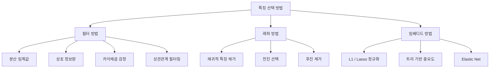
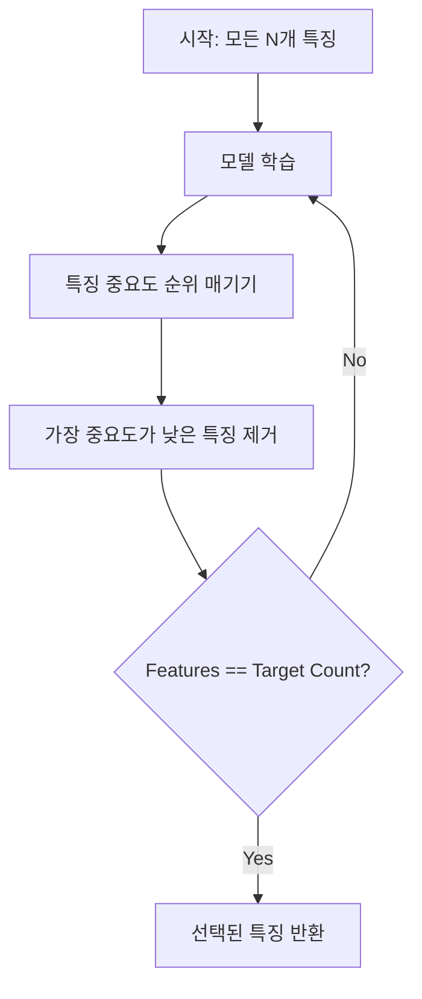
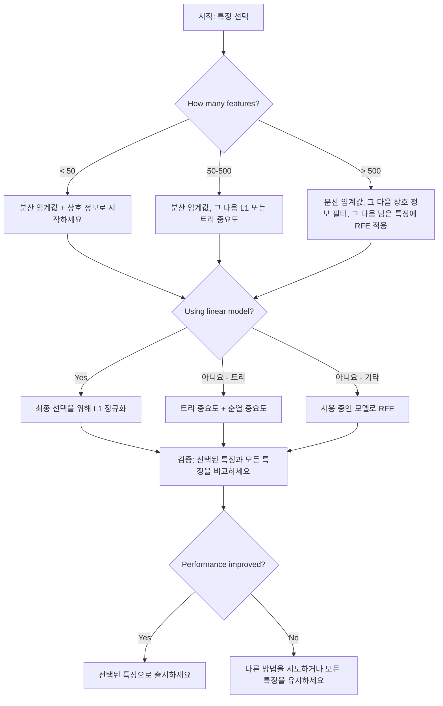

# 특징 선택

> 특징이 많다고 더 좋은 것이 아닙니다. 올바른 특징이 더 좋습니다.

**유형:** Build
**언어:** Python
**선수 요건:** 2단계, 01-09강, 08강 (특징 엔지니어링)
**시간:** 약 75분

## 학습 목표

- 필터 방법(분산 임계값, 상호 정보량, 카이제곱 검정)과 래퍼 방법(RFE, 전진 선택)을 처음부터 구현해 보세요
- 상관관계가 놓치는 비선형 특징-타겟 관계를 상호 정보량이 포착하는 이유를 설명해 보세요
- L1 정규화(임베디드 선택)와 RFE(래퍼 선택)를 비교하고, 계산적 트레이드오프를 평가해 보세요
- 여러 방법을 결합한 특징 선택 파이프라인을 구축하고, 홀드아웃 데이터에서 일반화 성능이 개선됨을 입증해 보세요

## 문제점

500개의 특징이 있습니다. 모델은 학습 속도가 느리고, 항상 과적합되며, 아무도 모델이 무엇을 학습했는지 설명할 수 없습니다. 성능을 개선하기 위해 더 많은 특징을 추가합니다. 오히려 더 나빠집니다.

이는 차원의 저주가 작동하는 모습입니다. 특징의 수가 증가하면 특징 공간의 부피가 폭발합니다. 데이터 포인트는 희소해지고, 포인트 간 거리는 수렴합니다. 모델은 실제 패턴을 찾기 위해 지수적으로 더 많은 데이터를 필요로 합니다. 잡음 특징이 신호 특징을 압도합니다. 과적합이 기본값이 됩니다.

특징 선택은 이에 대한 해독제입니다. 잡음을 제거하고, 중복을 없애며, 타겟에 대한 실제 정보를 담고 있는 특징만 유지합니다. 결과: 더 빠른 학습, 더 나은 일반화, 그리고 실제로 설명할 수 있는 모델.

목표는 사용 가능한 모든 정보를 사용하는 것이 아닙니다. 올바른 정보를 사용하는 것입니다.

## 개념

### 특징 선택의 세 가지 범주

모든 특징 선택 방법은 세 가지 범주 중 하나에 속합니다:



**필터 방법**은 통계적 측정값을 사용하여 각 특징을 독립적으로 점수화합니다. 모델을 사용하지 않습니다. 빠르지만, 특징 간 상호작용을 놓칩니다.

**래퍼 방법**은 특징 하위 집합을 평가하기 위해 모델을 학습합니다. 모델 성능을 점수로 사용합니다. 더 나은 결과를 제공하지만, 모델을 여러 번 재학습해야 하므로 비용이 많이 듭니다.

**임베디드 방법**은 모델 학습의 일부로 특징을 선택합니다. L1 정규화는 가중치를 0으로 만듭니다. 결정 트리는 가장 유용한 특징으로 분할합니다. 선택은 별도의 단계가 아니라 학습 과정에서 이루어집니다.

### 분산 임계값

가장 단순한 필터입니다. 특징이 샘플 간에 거의 변하지 않으면, 거의 정보를 담고 있지 않습니다.

1000개 샘플 중 999개에서 0.0인 특징을 고려해 보세요. 그 분산은 0에 가깝습니다. 어떤 모델도 이를 사용하여 클래스를 구분할 수 없습니다. 제거하세요.

```
variance(x) = mean((x - mean(x))^2)
```

임계값(예: 0.01)을 설정하세요. 분산이 이 값보다 낮은 모든 특징을 제거하세요. 이는 타겟 변수를 전혀 보지 않고 상수 또는 거의 상수인 특징을 제거합니다.

사용 시점: 다른 방법들보다 먼저 전처리 단계로 사용하세요. 거의 비용이 들지 않는 명백히 쓸모없는 특징을 잡아냅니다.

한계: 특징이 높은 분산을 가질 수 있으며, 여전히 순수한 잡음일 수 있습니다. 분산 임계값은 필요하지만 충분하지는 않습니다.

### 상호 정보

상호 정보는 특징 X의 값을 알면 타겟 Y에 대한 불확실성이 얼마나 감소하는지 측정합니다.

```
I(X; Y) = sum_x sum_y p(x, y) * log(p(x, y) / (p(x) * p(y)))
```

X와 Y가 독립적이면, p(x, y) = p(x) * p(y)이므로 로그 항은 0이고 I(X; Y) = 0입니다. X가 Y에 대해 더 많은 것을 알려줄수록 상호 정보는 더 높습니다.

상관관계에 대한 주요 장점: 상호 정보는 비선형 관계를 포착합니다. 특징이 타겟과 상관관계가 0일 수 있지만, 관계가 이차적이거나 주기적이므로 상호 정보는 높을 수 있습니다.

연속형 특징은 먼저 구간(bin)으로 이산화하세요 (히스토그램 기반 추정). 구간의 개수는 추정값에 영향을 미칩니다 -- 구간이 너무 적으면 정보를 잃고, 너무 많으면 잡음이 추가됩니다. 일반적인 선택: sqrt(n)개의 구간 또는 Sturges 규칙 (1 + log2(n)).


### 재귀적 특징 제거 (RFE)

RFE는 래퍼(wrapper) 방법입니다. 모델 자체의 특징 중요도를 사용하여 반복적으로 제거합니다:

1. 모든 특징으로 모델 학습
2. 중요도에 따라 특징 순위 매기기 (선형 모델의 계수, 트리의 불순도 감소)
3. 가장 중요도가 낮은 특징 제거
4. 원하는 개수의 특징이 남을 때까지 반복



RFE는 모델이 남은 모든 특징을 함께 보므로 특징 간 상호작용을 고려합니다. 하나의 특징을 제거하면 다른 특징의 중요도가 변합니다. 이는 필터 방법보다 더 철저합니다.

비용: 모델을 N - target 횟수만큼 학습합니다. 500개의 특징이 있고 target이 10이라면, 490번의 학습 실행이 필요합니다. 비용이 큰 모델의 경우, 이는 느립니다. 각 단계에서 여러 특징을 제거하여 속도를 높일 수 있습니다 (예: 매 라운드마다 하위 10% 제거).

### L1 (Lasso) 정규화

L1 정규화는 가중치의 절대값을 손실 함수에 더합니다:

```
loss = prediction_error + alpha * sum(|w_i|)
```

alpha 매개변수는 특징이 얼마나 공격적으로 제거되는지 제어합니다. alpha가 높을수록 더 많은 가중치가 정확히 0이 됩니다.

왜 정확히 0이 될까요? L1 페널티는 가중치 공간에서 다이아몬드 모양의 제약 영역을 만듭니다. 최적 해는 이 다이아몬드의 꼭짓점에 위치하는 경향이 있으며, 여기서 하나 이상의 가중치가 0이 됩니다. L2 정규화(ridge)는 가중치가 축소되지만 거의 0에 도달하지 않는 원형 제약 영역을 만듭니다.

이것은 내장형 특징 선택입니다: 모델은 학습 중에 어떤 특징을 무시할지 학습합니다. 가중치가 0인 특징은 효과적으로 제거됩니다.

장점: 단일 학습 실행, 상관된 특징 처리 (하나를 선택하고 나머지는 0으로 만듦), 대부분의 선형 모델 구현에 내장되어 있음.

한계: 선형 모델에만 적용됩니다. 비선형 특징 중요도를 포착할 수 없습니다.

### 트리 기반 특징 중요도

의사결정 트리 및 그 앙상블 (랜덤 포레스트, 그래디언트 부스팅)은 특징을 자연스럽게 순위를 매깁니다. 모든 분할은 불순도를 감소시킵니다 (분류의 경우 Gini 또는 엔트로피, 회귀의 경우 분산). 더 큰 불순도 감소를 생성하는 특징이 더 중요합니다.

T개의 트리를 가진 랜덤 포레스트의 경우:

```
importance(feature_j) = (1/T) * sum over all trees of
    sum over all nodes splitting on feature_j of
        (n_samples * impurity_decrease)
```

이것은 각 특징에 대해 정규화된 중요도 점수를 제공합니다. 비선형 관계와 특징 상호작용을 자동으로 처리합니다.

주의: 트리 기반 중요도는 많은 고유 값을 가진 특징 (높은 카디널리티)에 편향됩니다. 랜덤 ID 열은 모든 샘플을 완벽하게 분할하므로 중요한 것으로 나타날 수 있습니다. 퍼무테이션 중요도를 Sanity Check로 사용하세요.

### 퍼무테이션 중요도

모델에 독립적인 방법:

1. 모델을 학습하고 검증 데이터에서 기준 성능을 기록합니다
2. 각 특징에 대해: 값을 무작위로 섞고, 성능 저하를 측정합니다
3. 저하가 클수록 특징이 더 중요합니다

특징을 섞는 것이 성능에 해를 끼치지 않으면, 모델은 그 특징에 의존하지 않습니다. 성능이 붕괴되면, 그 특징은 결정적입니다.

퍼무테이션 중요도는 트리 기반 중요도의 카디널리티 편향을 피합니다. 하지만 느립니다: 특징당 전체 평가 한 번, 안정성을 위해 여러 번 반복합니다.

### 비교 표

| 방법 | 유형 | 속도 | 비선형 | 특징 상호작용 |
|--------|------|-------|-----------|---------------------|
| 분산 임계값 | 필터 | 매우 빠름 | 아니오 | 아니오 |
| 상호 정보 | 필터 | 빠름 | 예 | 아니오 |
| 상관관계 필터 | 필터 | 빠름 | 아니오 | 아니오 |
| RFE | 래퍼 | 느림 | 모델에 따라 다름 | 예 |
| L1 / Lasso | 내장형 | 빠름 | 아니오 (선형) | 아니오 |
| 트리 중요도 | 내장 | 중간 | 예 | 예 |
| 순열 중요도 | 모델 독립적 | 느림 | 예 | 예 |

### 의사결정 순서도



```figure
f3-feature-prune
```

## 구현하기

### 1단계: 알려진 특징 구조를 가진 합성 데이터를 생성하세요

```python
import numpy as np


def make_feature_selection_data(n_samples=500, seed=42):
    rng = np.random.RandomState(seed)

    x1 = rng.randn(n_samples)
    x2 = rng.randn(n_samples)
    x3 = rng.randn(n_samples)
    x4 = x1 + 0.1 * rng.randn(n_samples)
    x5 = x2 + 0.1 * rng.randn(n_samples)

    informative = np.column_stack([x1, x2, x3, x4, x5])

    correlated = np.column_stack([
        x1 * 0.9 + 0.1 * rng.randn(n_samples),
        x2 * 0.8 + 0.2 * rng.randn(n_samples),
        x3 * 0.7 + 0.3 * rng.randn(n_samples),
        x1 * 0.5 + x2 * 0.5 + 0.1 * rng.randn(n_samples),
        x2 * 0.6 + x3 * 0.4 + 0.1 * rng.randn(n_samples),
    ])

    noise = rng.randn(n_samples, 10) * 0.5

    X = np.hstack([informative, correlated, noise])
    y = (2 * x1 - 1.5 * x2 + x3 + 0.5 * rng.randn(n_samples) > 0).astype(int)

    feature_names = (
        [f"info_{i}" for i in range(5)]
        + [f"corr_{i}" for i in range(5)]
        + [f"noise_{i}" for i in range(10)]
    )

    return X, y, feature_names
```

정답을 알고 있습니다: 특징 0-4는 정보적이며(03강 4는 00강 1의 상관된 복사본), 특징 5-9는 정보적 특징과 상관관계가 있고, 특징 10-19는 순수한 잡음입니다. 좋은 선택 방법은 0-4를 가장 높게, 10-19를 가장 낮게 순위를 매겨야 합니다.

### 2단계: 분산 임계값

```python
def variance_threshold(X, threshold=0.01):
    variances = np.var(X, axis=0)
    mask = variances > threshold
    return mask, variances
```

### 3단계: 상호 정보 (이산)

```python
def discretize(x, n_bins=10):
    min_val, max_val = x.min(), x.max()
    if max_val == min_val:
        return np.zeros_like(x, dtype=int)
    bin_edges = np.linspace(min_val, max_val, n_bins + 1)
    binned = np.digitize(x, bin_edges[1:-1])
    return binned


def mutual_information(X, y, n_bins=10):
    n_samples, n_features = X.shape
    mi_scores = np.zeros(n_features)

    y_vals, y_counts = np.unique(y, return_counts=True)
    p_y = y_counts / n_samples

    for f in range(n_features):
        x_binned = discretize(X[:, f], n_bins)
        x_vals, x_counts = np.unique(x_binned, return_counts=True)
        p_x = dict(zip(x_vals, x_counts / n_samples))

        mi = 0.0
        for xv in x_vals:
            for yi, yv in enumerate(y_vals):
                joint_mask = (x_binned == xv) & (y == yv)
                p_xy = np.sum(joint_mask) / n_samples
                if p_xy > 0:
                    mi += p_xy * np.log(p_xy / (p_x[xv] * p_y[yi]))
        mi_scores[f] = mi

    return mi_scores
```

### 4단계: 재귀적 특징 제거(RFE)

```python
def simple_logistic_importance(X, y, lr=0.1, epochs=100):
    n_samples, n_features = X.shape
    w = np.zeros(n_features)
    b = 0.0

    for _ in range(epochs):
        z = X @ w + b
        pred = 1.0 / (1.0 + np.exp(-np.clip(z, -500, 500)))
        error = pred - y
        w -= lr * (X.T @ error) / n_samples
        b -= lr * np.mean(error)

    return w, b


def rfe(X, y, n_features_to_select=5, lr=0.1, epochs=100):
    n_total = X.shape[1]
    remaining = list(range(n_total))
    rankings = np.ones(n_total, dtype=int)
    rank = n_total

    while len(remaining) > n_features_to_select:
        X_subset = X[:, remaining]
        w, _ = simple_logistic_importance(X_subset, y, lr, epochs)
        importances = np.abs(w)

        least_idx = np.argmin(importances)
        original_idx = remaining[least_idx]
        rankings[original_idx] = rank
        rank -= 1
        remaining.pop(least_idx)

    for idx in remaining:
        rankings[idx] = 1

    selected_mask = rankings == 1
    return selected_mask, rankings
```

### 5단계: L1 특징 선택

```python
def soft_threshold(w, alpha):
    return np.sign(w) * np.maximum(np.abs(w) - alpha, 0)


def l1_feature_selection(X, y, alpha=0.1, lr=0.01, epochs=500):
    n_samples, n_features = X.shape
    w = np.zeros(n_features)
    b = 0.0

    for _ in range(epochs):
        z = X @ w + b
        pred = 1.0 / (1.0 + np.exp(-np.clip(z, -500, 500)))
        error = pred - y

        gradient_w = (X.T @ error) / n_samples
        gradient_b = np.mean(error)

        w -= lr * gradient_w
        w = soft_threshold(w, lr * alpha)
        b -= lr * gradient_b

    selected_mask = np.abs(w) > 1e-6
    return selected_mask, w
```

### 6단계: 트리 기반 중요도 (단순 결정 트리)

```python
def gini_impurity(y):
    if len(y) == 0:
        return 0.0
    classes, counts = np.unique(y, return_counts=True)
    probs = counts / len(y)
    return 1.0 - np.sum(probs ** 2)


def best_split(X, y, feature_idx):
    values = np.unique(X[:, feature_idx])
    if len(values) <= 1:
        return None, -1.0

    best_threshold = None
    best_gain = -1.0
    parent_gini = gini_impurity(y)
    n = len(y)

    for i in range(len(values) - 1):
        threshold = (values[i] + values[i + 1]) / 2.0
        left_mask = X[:, feature_idx] <= threshold
        right_mask = ~left_mask

        n_left = np.sum(left_mask)
        n_right = np.sum(right_mask)

        if n_left == 0 or n_right == 0:
            continue

        gain = parent_gini - (n_left / n) * gini_impurity(y[left_mask]) - (n_right / n) * gini_impurity(y[right_mask])

        if gain > best_gain:
            best_gain = gain
            best_threshold = threshold

    return best_threshold, best_gain


def tree_importance(X, y, n_trees=50, max_depth=5, seed=42):
    rng = np.random.RandomState(seed)
    n_samples, n_features = X.shape
    importances = np.zeros(n_features)

    for _ in range(n_trees):
        sample_idx = rng.choice(n_samples, size=n_samples, replace=True)
        feature_subset = rng.choice(n_features, size=max(1, int(np.sqrt(n_features))), replace=False)

        X_boot = X[sample_idx]
        y_boot = y[sample_idx]

        tree_imp = _build_tree_importance(X_boot, y_boot, feature_subset, max_depth)
        importances += tree_imp

    total = importances.sum()
    if total > 0:
        importances /= total

    return importances


def _build_tree_importance(X, y, feature_subset, max_depth, depth=0):
    n_features = X.shape[1]
    importances = np.zeros(n_features)

    if depth >= max_depth or len(np.unique(y)) <= 1 or len(y) < 4:
        return importances

    best_feature = None
    best_threshold = None
    best_gain = -1.0

    for f in feature_subset:
        threshold, gain = best_split(X, y, f)
        if gain > best_gain:
            best_gain = gain
            best_feature = f
            best_threshold = threshold

    if best_feature is None or best_gain <= 0:
        return importances

    importances[best_feature] += best_gain * len(y)

    left_mask = X[:, best_feature] <= best_threshold
    right_mask = ~left_mask

    importances += _build_tree_importance(X[left_mask], y[left_mask], feature_subset, max_depth, depth + 1)
    importances += _build_tree_importance(X[right_mask], y[right_mask], feature_subset, max_depth, depth + 1)

    return importances
```

### 7단계: 모든 방법을 실행하고 비교하세요

이 코드 파일은 동일한 합성 데이터셋에서 다섯 가지 방법을 모두 실행하며, 각 방법이 어떤 특징을 선택하는지 보여주는 비교 표를 출력합니다.

## 사용하기

scikit-learn에서는 특징 선택이 파이프라인에 내장되어 있습니다:

```python
from sklearn.feature_selection import (
    VarianceThreshold,
    mutual_info_classif,
    RFE,
    SelectFromModel,
)
from sklearn.linear_model import Lasso, LogisticRegression
from sklearn.ensemble import RandomForestClassifier

vt = VarianceThreshold(threshold=0.01)
X_filtered = vt.fit_transform(X)

mi_scores = mutual_info_classif(X, y)
top_k = np.argsort(mi_scores)[-10:]

rfe_selector = RFE(LogisticRegression(), n_features_to_select=10)
rfe_selector.fit(X, y)
X_rfe = rfe_selector.transform(X)

lasso_selector = SelectFromModel(Lasso(alpha=0.01))
lasso_selector.fit(X, y)
X_lasso = lasso_selector.transform(X)

rf = RandomForestClassifier(n_estimators=100)
rf.fit(X, y)
importances = rf.feature_importances_
```

직접 구현한 코드는 각 방법 내부에서 정확히 어떤 일이 일어나는지 보여줍니다. 분산 임계값은 `var(X, axis=0)`를 계산하고 마스크를 적용하는 것뿐입니다. 상호 정보는 컨틴전시 테이블(contingency table)에서 결합 및 주변 빈도를 세는 것입니다. RFE는 학습, 순위 매기기, 제거를 반복하는 루프입니다. L1은 소프트 임계값 단계가 포함된 경사 하강법입니다. 트리 중요도는 분할 전체에 걸쳐 불순도 감소량을 누적합니다. 마법은 없습니다 -- 통계와 루프뿐입니다.

sklearn 버전은 robustness (예: `mutual_info_classif`는 binning 대신 k-NN 밀도 추정 사용), speed (C 구현), pipeline integration을 제공합니다.

## 출시하기

이 강의는 다음을 생성합니다:
- `outputs/skill-feature-selector.md` -- 적절한 기능 선택 방법을 선택하기 위한 빠른 참조 의사결정 트리

## 연습 문제

1. **전진 선택**: RFE의 반대인 전진 선택을 구현해 보세요. 기능 0개로 시작합니다. 각 단계에서 모델 성능을 가장 크게 개선하는 기능을 추가합니다. 기능 추가가 더 이상 도움이 되지 않으면 중단합니다. 선택된 기능을 RFE 결과와 비교해 보세요. 어느 것이 더 빠릅니까? 어느 것이 더 좋은 결과를 줍니까?

2. **안정성 선택**: L1 기능 선택을 50번 실행합니다. 매번 데이터의 무작위 80% 하위 샘플에 대해 slightly 다른 alpha 값으로 실행합니다. 각 기능이 선택된 횟수를 세어 보세요. 실행의 80% 이상에서 선택된 기능은 "stable"입니다. stable 기능을 단일 실행 L1 선택과 비교해 보세요. 어느 것이 더 신뢰할 수 있습니까?

3. **다중 공선성 탐지**: 모든 기능에 대해 상관 행렬을 계산합니다. 상관 임계값 (예: 0.9)이 주어지면, 높은 상관관계를 가진 각 쌍에서 하나의 기능을 제거하는 함수를 구현해 보세요 (타겟과의 상호 정보량이 더 높은 기능을 유지합니다). 합성 데이터셋에서 테스트하고, 중복된 상관 기능을 제거하는지 확인해 보세요.

4. **기능 선택 파이프라인**: variance threshold, mutual information filter, RFE를 단일 파이프라인으로 연결합니다. 먼저 near-zero-variance 기능을 제거하고, mutual information에 따라 상위 50%를 유지한 후, 남은 기능에 대해 RFE를 실행합니다. 이 파이프라인을 모든 기능에 대해 RFE만 실행하는 것과 비교해 보세요. 파이프라인이 더 빠릅니까? 정확도가 동일한가요?

5. **처음부터 구현하는 permutation importance**: permutation importance를 구현해 보세요. 각 기능에 대해 값을 10번 섞고, F1 점수의 평균 감소량을 측정합니다. tree-based importance의 순위와 비교해 보세요. 두 방법이 일치하지 않는 경우를 찾아 이유를 설명해 보세요 (힌트: 상관된 기능).

## 핵심 용어

| 용어 | 사람들이 말하는 것 | 실제 의미 |
|------|----------------|----------------------|
| 필터 방법 | "기능을 독립적으로 점수화" | 모델을 훈련하지 않고 통계적 측정값을 사용하여 기능을 순위 매기는 기능 선택 접근법으로, 각 기능을 독립적으로 평가합니다 |
| 래퍼 방법 | "모델을 사용하여 특징을 선택" | 모델의 성능을 선택 기준으로 사용하여 특징 하위 집합을 평가하는 특징 선택 접근법 |
| 임베디드 방법 | "모델이 학습 중에 특징을 선택" | L1 정규화가 가중치를 0으로 만드는 것과 같이 모델 적합 과정의 일부로 수행되는 특징 선택 |
| 상호 정보 | "한 변수가 다른 변수에 대해 얼마나 알려주는지" | X에 대한 지식을 통해 Y에 대한 불확실성이 얼마나 감소하는지를 측정하며, 선형 및 비선형 의존성을 모두 포착하는 지표 |
| 재귀적 특징 제거 | "학습, 순위 매기기, 제거, 반복" | 모델을 학습하고, 가장 중요도가 낮은 특징을 제거하며, 목표 개수에 도달할 때까지 반복하는 반복적 래퍼 방법 |
| L1 / 라소 정규화 | "특징을 없애는 페널티" | 손실 함수에 가중치 절대값의 합을 추가하여 중요하지 않은 특징의 가중치를 정확히 0으로 만드는 기법 |
| 분산 임계값 | "상수 특징 제거" | 샘플 간 분산이 지정된 임계값 미만인 특징을 제거하여 정보를 담지 않은 특징을 필터링하는 기법 |
| 특징 중요도 | "어떤 특징이 가장 중요한지" | 모델 예측에 각 특징이 얼마나 기여하는지 나타내는 점수로, 분할 이득(트리) 또는 계수 크기(선형)로부터 계산됨 |
| 순열 중요도 | "셔플하고 피해 측정" | 각 특징의 값을 무작위로 셔플하고 resulting 모델 성능의 감소량을 측정하여 특징 중요도를 평가하는 기법 |
| 차원의 저주 | "특징이 너무 많고 데이터가 부족" | 특징을 추가하면 특징 공간의 부피가 지수적으로 증가하여 데이터가 희소해지고 거리가 무의미해지는 현상 |

## 추가 읽기

- [An Introduction to Variable and Feature Selection (Guyon & Elisseeff, 2003)](https://jmlr.org/papers/v3/guyon03a.html) -- 특징 선택 방법에 대한 기초적인 조사로, 여전히 널리 인용됨
- [scikit-learn Feature Selection Guide](https://scikit-learn.org/stable/modules/feature_selection.html) -- 필터, 래퍼, 임베디드 방법에 대한 실용적인 참고 자료로, 코드 예제 포함
- [Stability Selection (Meinshausen & Buhlmann, 2010)](https://arxiv.org/abs/0809.2932) -- 하위 샘플링과 특징 선택을 결합하여 견고하고 재현 가능한 결과를 생성
- [Beware Default Random Forest Importances (Strobl et al., 2007)](https://bmcbioinformatics.biomedcentral.com/articles/10.1186/1471-2105-8-25) -- 트리 기반 중요도에서의 카디널리티 편향을 시연하고, 대안으로 조건부 중요도를 제안
