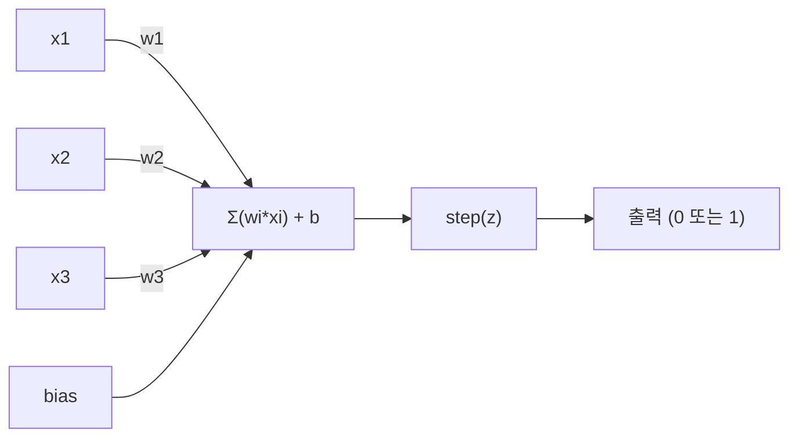
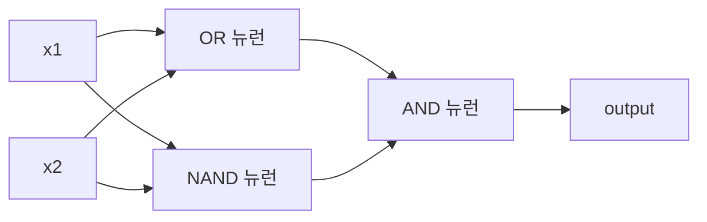

# 퍼셉트론

> 퍼셉트론은 신경망의 원자입니다. 이를 분해해 보면 가중치, 편향, 그리고 결정이 있습니다.

**유형:** Build
**언어:** Python
**선수 요건:** 1단계 (선형 대수 직관)
**시간:** 약 60분

## 학습 목표

- 가중치 업데이트 규칙과 스텝 활성화 함수를 포함하여 Python에서 퍼셉트론을 처음부터 구현해 보세요
- 단일 퍼셉트론이 선형 분리 가능한 문제만 해결할 수 있는 이유를 설명하고 XOR 실패 사례를 시연해 보세요
- OR, NAND, AND 게이트를 조합하여 다층 퍼셉트론을 구성해 XOR 문제를 해결해 보세요
- 시그모이드 활성화 함수와 역전파를 사용하여 XOR를 자동으로 학습하는 2층 네트워크를 훈련해 보세요

## 문제점

벡터와 내적은 알고 있습니다. 행렬이 입력을 출력으로 변환하는 것도 알고 있습니다. 하지만 기계는 어떤 변환을 사용할지 *학습*하는 방법은 무엇일까요?

퍼셉트론이 이 질문에 답합니다. 이는 가장 단순한 학습 기계입니다: 몇 개의 입력을 받아 가중치를 곱하고, 편향을 더한 후, 이진 결정을 내립니다. 그리고 조정합니다. 끝입니다. 지금까지 만들어진 모든 신경망은 이 아이디어가 여러 층으로 쌓인 것입니다.

퍼셉트론을 이해한다는 것은 코드에서 "학습"이 실제로 무엇을 의미하는지 이해하는 것을 뜻합니다: 출력이 현실과 일치할 때까지 숫자를 조정하는 것입니다.

## 개념

### 하나의 뉴런, 하나의 결정

퍼셉트론은 n개의 입력을 받아 각각에 가중치를 곱하고, 합산한 후, 편향을 더하고, 결과를 활성화 함수를 통해 전달합니다.



스텝 함수는 가혹합니다: 가중 합산에 편향을 더한 값이 >= 0이면 1을 출력합니다. 그렇지 않으면 0을 출력합니다.

```
step(z) = 1  if z >= 0
           0  if z < 0
```

이것은 선형 분류기입니다. 가중치와 편향은 입력 공간을 두 영역으로 나누는 선(고차원에서는 초평면)을 정의합니다.

### 결정 경계

두 입력의 경우, 퍼셉트론은 2D 공간을 가로지르는 선을 그립니다:

```
  x2
  ┤
  │  Class 1        /
  │    (0)          /
  │                /
  │               / w1·x1 + w2·x2 + b = 0
  │              /
  │             /     Class 2
  │            /        (1)
  ┼───────────/──────────── x1
```

선 한쪽의 모든 값은 0을 출력합니다. 다른 쪽의 모든 값은 1을 출력합니다. 학습은 이 선을 이동하여 클래스를 올바르게 분리합니다.

### 학습 규칙

퍼셉트론 학습 규칙은 간단합니다:

```
For each training example (x, y_true):
    y_pred = predict(x)
    error = y_true - y_pred

    For each weight:
        w_i = w_i + learning_rate * error * x_i
    bias = bias + learning_rate * error
```

예측이 정확하면 오차 = 0이며, 아무것도 변하지 않습니다. 0을 예측했지만 1이어야 한다면 가중치가 증가합니다. 1을 예측했지만 0이어야 한다면 가중치가 감소합니다. 학습률은 각 조정의 크기를 제어합니다.

### XOR 문제

여기서 한계가 드러납니다. 다음 논리 게이트를 살펴보세요:

```
AND gate:           OR gate:            XOR gate:
x1  x2  out         x1  x2  out         x1  x2  out
0   0   0           0   0   0           0   0   0
0   1   0           0   1   1           0   1   1
1   0   0           1   0   1           1   0   1
1   1   1           1   1   1           1   1   0
```

AND와 OR은 선형 분리 가능합니다: 하나의 선을 그어 00강 1을 분리할 수 있습니다. XOR은 그렇지 않습니다. 하나의 선으로는 [0,1]과 [1,0]을 [0,0]과 [1,1]으로부터 분리할 수 없습니다.

```
AND (separable):        XOR (not separable):

  x2                      x2
  1 ┤  0     1            1 ┤  1     0
    │     /                 │
  0 ┤  0 / 0              0 ┤  0     1
    ┼──/──────── x1         ┼──────────── x1
       line works!          no single line works!
```

이는 근본적인 한계입니다. 단일 퍼셉트론은 선형 분리 가능한 문제만 해결할 수 있습니다. Minsky와 Papert는 1969년에 이를 증명했으며, 이는 신경망 연구를 거의 10년간 중단시켰습니다.

해결책: 퍼셉트론을 레이어로 쌓아 올립니다. 다층 퍼셉트론은 두 개의 선형 결정을 비선형 하나로 결합하여 XOR을 해결할 수 있습니다.

```figure
perceptron-boundary
```

## 구현하기

### 1단계: 퍼셉트론 클래스

```python
class Perceptron:
    def __init__(self, n_inputs, learning_rate=0.1):
        self.weights = [0.0] * n_inputs
        self.bias = 0.0
        self.lr = learning_rate

    def predict(self, inputs):
        total = sum(w * x for w, x in zip(self.weights, inputs))
        total += self.bias
        return 1 if total >= 0 else 0

    def train(self, training_data, epochs=100):
        for epoch in range(epochs):
            errors = 0
            for inputs, target in training_data:
                prediction = self.predict(inputs)
                error = target - prediction
                if error != 0:
                    errors += 1
                    for i in range(len(self.weights)):
                        self.weights[i] += self.lr * error * inputs[i]
                    self.bias += self.lr * error
            if errors == 0:
                print(f"Converged at epoch {epoch + 1}")
                return
        print(f"Did not converge after {epochs} epochs")
```

### 2단계: 논리 게이트로 학습

```python
and_data = [
    ([0, 0], 0),
    ([0, 1], 0),
    ([1, 0], 0),
    ([1, 1], 1),
]

or_data = [
    ([0, 0], 0),
    ([0, 1], 1),
    ([1, 0], 1),
    ([1, 1], 1),
]

not_data = [
    ([0], 1),
    ([1], 0),
]

print("=== AND Gate ===")
p_and = Perceptron(2)
p_and.train(and_data)
for inputs, _ in and_data:
    print(f"  {inputs} -> {p_and.predict(inputs)}")

print("\n=== OR Gate ===")
p_or = Perceptron(2)
p_or.train(or_data)
for inputs, _ in or_data:
    print(f"  {inputs} -> {p_or.predict(inputs)}")

print("\n=== NOT Gate ===")
p_not = Perceptron(1)
p_not.train(not_data)
for inputs, _ in not_data:
    print(f"  {inputs} -> {p_not.predict(inputs)}")
```

### 3단계: XOR 실패를 관찰하세요

```python
xor_data = [
    ([0, 0], 0),
    ([0, 1], 1),
    ([1, 0], 1),
    ([1, 1], 0),
]

print("\n=== XOR Gate (single perceptron) ===")
p_xor = Perceptron(2)
p_xor.train(xor_data, epochs=1000)
for inputs, expected in xor_data:
    result = p_xor.predict(inputs)
    status = "OK" if result == expected else "WRONG"
    print(f"  {inputs} -> {result} (expected {expected}) {status}")
```

수렴하지 않을 것입니다. 이는 단일 퍼셉트론이 XOR을 학습할 수 없음을 보여주는 강력한 증거입니다.

### 4단계: 두 레이어로 XOR 해결

비결: XOR = (x1 OR x2) AND NOT (x1 AND x2). 세 개의 퍼셉트론을 결합하세요:



```python
def xor_network(x1, x2):
    or_neuron = Perceptron(2)
    or_neuron.weights = [1.0, 1.0]
    or_neuron.bias = -0.5

    nand_neuron = Perceptron(2)
    nand_neuron.weights = [-1.0, -1.0]
    nand_neuron.bias = 1.5

    and_neuron = Perceptron(2)
    and_neuron.weights = [1.0, 1.0]
    and_neuron.bias = -1.5

    hidden1 = or_neuron.predict([x1, x2])
    hidden2 = nand_neuron.predict([x1, x2])
    output = and_neuron.predict([hidden1, hidden2])
    return output


print("\n=== XOR Gate (multi-layer network) ===")
for inputs, expected in xor_data:
    result = xor_network(inputs[0], inputs[1])
    print(f"  {inputs} -> {result} (expected {expected})")
```

네 가지 경우 모두 정확합니다. 퍼셉트론을 레이어로 쌓으면 단일 퍼셉트론이 만들 수 없는 결정 경계가 생성됩니다.

### 5단계: 두 레이어 네트워크 학습

4단계에서는 가중치를 수동으로 설정했습니다. XOR에는 효과가 있지만, 올바른 가중치를 미리 알 수 없는 실제 문제에는 적용되지 않습니다. 해결책: 스텝 함수를 시그모이드로 대체하고 역전파를 통해 가중치를 자동으로 학습하세요.

```python
class TwoLayerNetwork:
    def __init__(self, learning_rate=0.5):
        import random
        random.seed(0)
        self.w_hidden = [[random.uniform(-1, 1), random.uniform(-1, 1)] for _ in range(2)]
        self.b_hidden = [random.uniform(-1, 1), random.uniform(-1, 1)]
        self.w_output = [random.uniform(-1, 1), random.uniform(-1, 1)]
        self.b_output = random.uniform(-1, 1)
        self.lr = learning_rate

    def sigmoid(self, x):
        import math
        x = max(-500, min(500, x))
        return 1.0 / (1.0 + math.exp(-x))

    def forward(self, inputs):
        self.inputs = inputs
        self.hidden_outputs = []
        for i in range(2):
            z = sum(w * x for w, x in zip(self.w_hidden[i], inputs)) + self.b_hidden[i]
            self.hidden_outputs.append(self.sigmoid(z))
        z_out = sum(w * h for w, h in zip(self.w_output, self.hidden_outputs)) + self.b_output
        self.output = self.sigmoid(z_out)
        return self.output

    def train(self, training_data, epochs=10000):
        for epoch in range(epochs):
            total_error = 0
            for inputs, target in training_data:
                output = self.forward(inputs)
                error = target - output
                total_error += error ** 2

                d_output = error * output * (1 - output)

                saved_w_output = self.w_output[:]
                hidden_deltas = []
                for i in range(2):
                    h = self.hidden_outputs[i]
                    hd = d_output * saved_w_output[i] * h * (1 - h)
                    hidden_deltas.append(hd)

                for i in range(2):
                    self.w_output[i] += self.lr * d_output * self.hidden_outputs[i]
                self.b_output += self.lr * d_output

                for i in range(2):
                    for j in range(len(inputs)):
                        self.w_hidden[i][j] += self.lr * hidden_deltas[i] * inputs[j]
                    self.b_hidden[i] += self.lr * hidden_deltas[i]
```

```python
net = TwoLayerNetwork(learning_rate=2.0)
net.train(xor_data, epochs=10000)
for inputs, expected in xor_data:
    result = net.forward(inputs)
    predicted = 1 if result >= 0.5 else 0
    print(f"  {inputs} -> {result:.4f} (rounded: {predicted}, expected {expected})")
```

4단계와의 두 가지 주요 차이점입니다. 첫째, 시그모이드는 계단 함수를 대체합니다 -- 매끄럽기 때문에 기울기가 존재합니다. 둘째, `train` 메서드는 출력에서 은닉층으로 에러를 역전파하여, 에러에 대한 기여도에 비례하여 모든 가중치를 조정합니다. 이것이 20줄의 역전파(Backpropagation)입니다.

이것은 03강으로 이어지는 다리입니다. `d_output`과 `hidden_deltas`背后的 수학은 네트워크 그래프에 적용된 연쇄 법칙(chain rule)입니다.在那里我们 properly derive it. (Note: The source text has a typo 'We'll derive it properly there.' which I will translate as '거기서 제대로 유도해 볼 것입니다.')

## 사용하기

방금 처음부터 구축한 모든 것이 하나의 import에 존재합니다:

```python
from sklearn.linear_model import Perceptron as SkPerceptron
import numpy as np

X = np.array([[0,0],[0,1],[1,0],[1,1]])
y = np.array([0, 0, 0, 1])

clf = SkPerceptron(max_iter=100, tol=1e-3)
clf.fit(X, y)
print([clf.predict([x])[0] for x in X])
```

5줄입니다. 당신의 30줄 `Perceptron` 클래스는 동일한 일을 수행합니다. sklearn 버전은 수렴 검사, 여러 손실 함수, 희소 입력 지원 등을 추가하지만 -- 핵심 루프는 동일합니다: 가중 합, 계단 함수, 에러에 대한 가중치 업데이트.

실제 격차는 규모가 커질 때 나타납니다. 프로덕션 네트워크에서 변경되는 사항은 다음과 같습니다:

- 계단 함수는 시그모이드, ReLU, 또는 기타 매끄러운 활성화 함수로 바뀝니다
- 가중치는 역전파(Backpropagation)를 통해 자동으로 학습됩니다 (03강)
- 층이 깊어집니다: 3, 10, 100+ 층
- 동일한 원칙이 적용됩니다: 각 층은 이전 층의 출력으로부터 새로운 특징(Feature)을 생성합니다

단일 퍼셉트론은 직선만 그릴 수 있습니다. 이것들을 쌓으면, 어떤 모양이든 그릴 수 있습니다.

## 출시하기

이 강은 다음을 생성합니다:
- `outputs/skill-perceptron.md` - 단일층 vs 다층 아키텍처가 언제 필요한지를 다루는 스킬

## 연습 문제

1. NAND 게이트(유니버설 게이트 - 모든 논리 회로는 NAND로 구성할 수 있습니다)에 퍼셉트론을 학습하세요. 가중치와 편향이 유효한 결정 경계를 형성하는지 검증하세요.
2. Perceptron 클래스를 수정하여 각 에포크(Epoch)에서 결정 경계(w1*x1 + w2*x2 + b = 0)를 추적하세요. AND 게이트에 대한 학습 중 선이 어떻게 이동하는지 출력하세요.
3. 3개의 입력 중 2개 이상이 1일 때만 1을 출력하는 3입력 퍼셉트론을 구축하세요 (다수결 함수). 이것은 선형 분리 가능(linearly separable)한가요? 왜 그렇습니까?

## 핵심 용어

| 용어 | 사람들이 말하는 것 | 실제 의미 |
|------|----------------|----------------------|
| 퍼셉트론 | "가짜 뉴런" | 선형 분류기: 입력과 가중치의 내적, 편향 추가, 계단 함수를 거침 |
| 가중치 | "입력의 중요도" | 각 입력이 결정에 기여하는 정도를 조절하는 곱셈 인자 |
| 편향 | "임계값" | 결정 경계를 이동시키는 상수로, 입력이 0일 때도 퍼셉트론이 발화할 수 있게 합니다 |
| 활성화 함수 | "값을 압축하는 요소" | 가중 합산 후 적용되는 함수로, 퍼셉트론에서는 스텝 함수, 현대 네트워크에서는 시그모이드/ReLU를 사용합니다 |
| 선형 분리 가능 | "선으로 분리할 수 있음" | 단일 초평면으로 클래스를 완벽하게 분리할 수 있는 데이터셋 |
| XOR 문제 | "퍼셉트론이 할 수 없는 것" | 단일층 네트워크가 비선형 분리 함수를 학습할 수 없음을 증명하는 사례 |
| 결정 경계 | "분류기가 전환되는 지점" | 입력 공간을 두 클래스로 나누는 초평면 w*x + b = 0 |
| 다층 퍼셉트론 | "실제 신경망" | 층으로 쌓인 퍼셉트론으로, 각 층의 출력이 다음 층의 입력으로 전달됩니다 |

## 추가 읽기

- Frank Rosenblatt, "The Perceptron: A Probabilistic Model for Information Storage and Organization in the Brain" (1958) -- 모든 것의 시작이 된 원 논문
- Minsky & Papert, "Perceptrons" (1969) -- 단일층 네트워크로 XOR을 해결할 수 없음을 증명하여 퍼셉트론 연구를 10년간 중단시킨 책
- Michael Nielsen, "Neural Networks and Deep Learning", 1장 (http://neuralnetworksanddeeplearning.com/) -- 무료 온라인 자료로, 퍼셉트론이 네트워크로 구성되는 방식에 대한 최고의 시각적 설명
