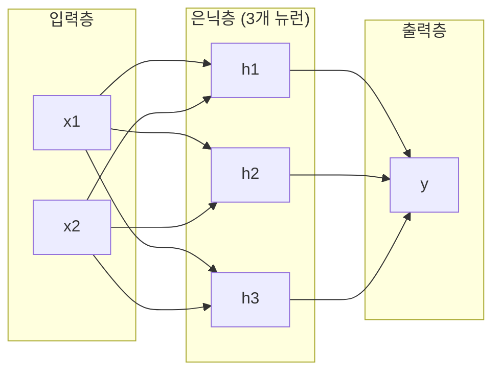
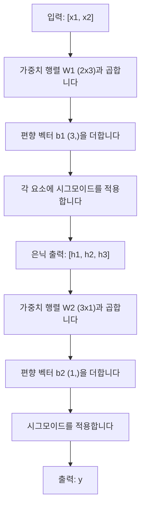

# 다층 네트워크와 순방향 전파

> 뉴런 하나가 선을 그습니다. 이들을 쌓으면 무엇이든 그릴 수 있습니다.

**유형:** Build
**언어:** Python
**선수 요건:** 1단계 (수학 기초), 03.01강 (퍼셉트론)
**시간:** 약 90분

## 학습 목표

- Layer 및 Network 클래스를 사용하여 순방향 전파를 수행하는 다층 네트워크를 처음부터 구축해 보세요
- 네트워크의 각 레이어를 거치며 행렬 차원을 추적하고 형태 불일치를 식별해 보세요
- 비선형 활성화 함수를 쌓는 것이 네트워크가 곡선 결정 경계를 학습할 수 있게 하는 방식을 설명해 보세요
- 수동으로 조정된 시그모이드 가중치를 사용하는 2-2-1 아키텍처로 XOR 문제를 해결해 보세요

## 문제점

단일 뉴런은 선을 그리는 도구입니다. 그것뿐입니다. 데이터에 하나의 직선을 그립니다. AI의 모든 실제 문제 -- 이미지 인식, 언어 이해, 바둑 두기 -- 는 곡선이 필요합니다. 뉴런을 레이어로 쌓는 것이 곡선을 얻는 방법입니다.

1969년, Minsky와 Papert는 이 한계가 치명적임을 증명했습니다. 단일 레이어 네트워크는 XOR를 학습할 수 없습니다. "학습에 어려움을 겪는다"가 아니라, 수학적으로 학습할 수 없습니다. XOR 진리표는 [0,1]과 [1,0]을 한쪽에, [0,0]과 [1,1]을 다른 쪽에 배치합니다. 하나의 직선으로는 이들을 분리할 수 없습니다.

이 발견은 10년 이상 신경망 연구 자금의 붕괴를 초래했습니다. 사후적으로 보면 해결책은 명확했습니다. 하나의 레이어만 사용하지 마세요. 뉴런을 레이어로 쌓으세요. 첫 번째 레이어가 입력 공간을 새로운 특징으로 분할하고, 두 번째 레이어가 하나의 직선으로는 내릴 수 없는 결정을 위해 그 특징들을 결합하도록 하세요.

그 쌓임이 다층 네트워크입니다. 오늘날 생산 환경의 모든 딥러닝 모델의 기초입니다. 순방향 전파 -- 입력에서 은닉 레이어를 거쳐 출력으로 데이터가 흐르는 과정 -- 는 다른 모든 것이 작동하기 전에 가장 먼저 구축해야 하는 것입니다.

## 개념

### 레이어: 입력, 은닉, 출력

다층 네트워크는 세 가지 유형의 레이어를 가집니다:

**입력 레이어** -- 엄밀히 말하면 레이어가 아닙니다. 원시 데이터를 보관합니다. 두 개의 특징은 두 개의 입력 노드를 의미합니다. 여기서 계산은 일어나지 않습니다.

**은닉층** -- 작업이 이루어지는 곳입니다. 각 뉴런은 이전 층의 모든 출력을 받아 가중치와 편향을 적용한 후, 결과를 활성화 함수(Activation Function)를 통해 전달합니다. "은닉"이라고 불리는 이유는 학습 데이터에서 이 값들을 직접 볼 수 없기 때문입니다.

**출력층** -- 최종 답변입니다. 이진 분류의 경우 시그모이드(sigmoid)를 사용하는 뉴런 하나를, 다중 분류의 경우 클래스당 뉴런 하나를 사용합니다.



이것은 2-3-1 네트워크입니다. 입력이 두 개, 은닉 뉴런이 세 개, 출력이 하나입니다. 모든 연결은 가중치를 가지며, 모든 뉴런(입력층 제외)은 편향을 가집니다.

각 층은 은닉 상태(hidden state)라고 불리는 숫자 벡터를 생성합니다. 텍스트의 경우 은닉 상태는 차원을 증가시켜 -- 단어의 의미적 의미를 포착하기 위해 단어를 768개의 숫자로 인코딩합니다. 이미지의 경우 차원을 감소시켜 -- 수백만 개의 픽셀을 관리 가능한 표현으로 압축합니다. 은닉 상태는 학습이 일어나는 곳입니다.

### 뉴런과 활성화 함수

각 뉴런은 세 가지 작업을 수행합니다:

1. 모든 입력에 해당하는 가중치를 곱합니다
2. 모든 곱셈 결과를 합산하고 편향을 더합니다
3. 합산 결과를 활성화 함수를 통해 전달합니다

현재 활성화 함수는 시그모이드(sigmoid)입니다:

```
sigmoid(z) = 1 / (1 + e^(-z))
```

시그모이드는 모든 숫자를 (0, 1) 범위로 압축합니다. 큰 양수 입력은 1에 가깝게, 큰 음수 입력은 0에 가깝게 밀어냅니다. 0은 0.5로 매핑됩니다. 이 매끄러운 곡선이 학습을 가능하게 합니다 -- 퍼셉트론의 하드 스텝과 달리 시그모이드는 모든 곳에서 기울기를 가집니다.

### 순방향 전파: 데이터 흐름

순방향 전파는 입력 데이터를 출력에 도달할 때까지 층별로 네트워크를 통해 밀어냅니다. 순방향 전파 중에는 학습이 일어나지 않습니다. 이는 순수한 계산입니다: 곱하기, 더하기, 활성화, 반복.



각 레이어에서 세 가지 연산이 순서대로 수행됩니다:

```
z = W * input + b       (linear transformation)
a = sigmoid(z)           (activation)
```

한 레이어의 출력은 다음 레이어의 입력이 됩니다. 이것이 전체 순방향 전파(forward pass)입니다.

### 행렬 차원

차원을 추적하는 것은 딥러닝에서 가장 중요한 디버깅 기술입니다. 2-3-1 네트워크는 다음과 같습니다:

| 단계 | 연산 | 차원 | 결과 형상 |
|------|-----------|------------|-------------|
| 입력 | x | -- | (2,) |
| 은닉 선형 | W1 * x + b1 | W1: (3, 2), b1: (3,) | (3,) |
| 은닉 활성화 | sigmoid(z1) | -- | (3,) |
| 출력 선형 | W2 * h + b2 | W2: (1, 3), b2: (1,) | (1,) |
| 출력 활성화 | sigmoid(z2) | -- | (1,) |

규칙: 레이어 k의 가중치 행렬 W는 형상 (neurons_in_layer_k, neurons_in_layer_k_minus_1)을 가집니다. 행은 현재 레이어와 일치하고, 열은 이전 레이어와 일치합니다. 형상이 일치하지 않으면 버그가 있습니다.

### 보편적 근정 정리

1989년, George Cybenko는 놀라운 사실을 증명했습니다: 단일 은닉 레이어와 충분한 뉴런을 가진 신경망은 임의의 연속 함수를 원하는 정확도로 근사할 수 있습니다.

이것이 항상 단일 은닉 레이어가 최선이라는 의미는 아닙니다. 아키텍처가 이론적으로 가능하다는 의미입니다. 실제로는 더 깊은 네트워크(더 많은 레이어, 레이어당 더 적은 뉴런)가 얕고 넓은 네트워크보다 훨씬 적은 총 매개변수로 동일한 함수를 학습합니다. 이것이 딥러닝이 작동하는 이유입니다.

직관: 은닉 레이어의 각 뉴런은 하나의 "돌기" 또는 특징을 학습합니다. 충분한 돌기를 올바른 위치에 배치하면 임의의 매끄러운 곡선을 근사할 수 있습니다. 뉴런이 많을수록, 돌기가 많을수록, 근사 품질이 좋아집니다.


### 조합성

신경망은 조합 가능합니다. 스택으로 쌓고, 체이닝하고, 병렬로 실행할 수 있습니다. Whisper 모델은 오디오를 처리하기 위해 인코더 네트워크를 사용하고, 텍스트를 생성하기 위해 별도의 디코더 네트워크를 사용합니다. 최신 LLM은 디코더 전용입니다. BERT는 인코더 전용입니다. T5는 인코더-디코더입니다. 아키텍처 선택이 모델이 할 수 있는 일을 정의합니다.

```figure
mlp-forward
```

## 구현하기

순수 Python입니다. numpy는 사용하지 않습니다. 모든 행렬 연산을 처음부터 직접 작성합니다.

### 1단계: 시그모이드 활성화 함수

```python
import math

def sigmoid(x):
    x = max(-500.0, min(500.0, x))
    return 1.0 / (1.0 + math.exp(-x))
```

[-500, 500] 범위로 클램프(clamp)하면 오버플로우를 방지할 수 있습니다. `math.exp(500)`는 크지만 유한합니다. `math.exp(1000)`는 무한대입니다.

### 2단계: Layer 클래스

딥러닝에서 가장 중요한 연산은 행렬 곱셈입니다. 모든 레이어, 모든 어텐션 헤드, 모든 순전파는 행렬 곱(matmul)으로 이루어져 있습니다. 선형 레이어는 입력 벡터를 받아 가중치 행렬과 곱하고 편향(bias) 벡터를 더합니다: y = Wx + b. 이 하나의 방정식이 신경망 연산의 90%를 차지합니다.

레이어는 가중치 행렬과 편향 벡터를 포함합니다. forward 메서드는 입력 벡터를 받아 활성화된 출력을 반환합니다.

```python
class Layer:
    def __init__(self, n_inputs, n_neurons, weights=None, biases=None):
        if weights is not None:
            self.weights = weights
        else:
            import random
            self.weights = [
                [random.uniform(-1, 1) for _ in range(n_inputs)]
                for _ in range(n_neurons)
            ]
        if biases is not None:
            self.biases = biases
        else:
            self.biases = [0.0] * n_neurons

    def forward(self, inputs):
        self.last_input = inputs
        self.last_output = []
        for neuron_idx in range(len(self.weights)):
            z = sum(
                w * x for w, x in zip(self.weights[neuron_idx], inputs)
            )
            z += self.biases[neuron_idx]
            self.last_output.append(sigmoid(z))
        return self.last_output
```

가중치 행렬의 모양은 (n_neurons, n_inputs)입니다. 각 행은 모든 입력에 대한 하나의 뉴런의 가중치를 나타냅니다. forward 메서드는 뉴런을 순회하며 가중 합에 편향을 더하고, 시그모이드를 적용한 후 결과를 수집합니다.

### 3단계: Network 클래스

네트워크는 레이어의 리스트입니다. 순전파는 레이어를 연결합니다: 레이어 k의 출력이 레이어 k+1의 입력이 됩니다.

```python
class Network:
    def __init__(self, layers):
        self.layers = layers

    def forward(self, inputs):
        current = inputs
        for layer in self.layers:
            current = layer.forward(current)
        return current
```

이것이 순전파의 전부입니다. 네 줄의 로직으로 구성됩니다. 데이터가 입력되어 모든 레이어를 거쳐 반대편으로 출력됩니다.

### 4단계: 수동으로 조정된 가중치를 이용한 XOR

01강에서는 OR, NAND, AND 퍼셉트론을 조합하여 XOR 문제를 해결했습니다. 이제 Layer와 Network 클래스를 사용하여 동일한 작업을 수행해 보세요. 2-2-1 아키텍처: 입력 2개, 은닉 뉴런 2개, 출력 1개입니다.

```python
hidden = Layer(
    n_inputs=2,
    n_neurons=2,
    weights=[[20.0, 20.0], [-20.0, -20.0]],
    biases=[-10.0, 30.0],
)

output = Layer(
    n_inputs=2,
    n_neurons=1,
    weights=[[20.0, 20.0]],
    biases=[-30.0],
)

xor_net = Network([hidden, output])

xor_data = [
    ([0, 0], 0),
    ([0, 1], 1),
    ([1, 0], 1),
    ([1, 1], 0),
]

for inputs, expected in xor_data:
    result = xor_net.forward(inputs)
    predicted = 1 if result[0] >= 0.5 else 0
    print(f"  {inputs} -> {result[0]:.6f} (rounded: {predicted}, expected: {expected})")
```

큰 가중치(20, -20)는 시그모이드가 계단 함수처럼 작동하게 만듭니다. 첫 번째 은닉 뉴런은 OR을 근사합니다. 두 번째는 NAND를 근사합니다. 출력 뉴런은 이들을 AND로 결합하여 XOR을 만들어냅니다.

### 5단계: 원(circle) 분류

더 어려운 문제입니다: 원점 중심의 반지름 0.5인 원의 내부와 외부에 있는 2D 점을 분류합니다. 이는 곡선 결정 경계가 필요하며, 단일 퍼셉트론으로는 불가능합니다.

```python
import random
import math

random.seed(42)

data = []
for _ in range(200):
    x = random.uniform(-1, 1)
    y = random.uniform(-1, 1)
    label = 1 if (x * x + y * y) < 0.25 else 0
    data.append(([x, y], label))

circle_net = Network([
    Layer(n_inputs=2, n_neurons=8),
    Layer(n_inputs=8, n_neurons=1),
])
```

무작위 가중치를 사용하면 네트워크가 잘 분류하지 못합니다. 하지만 순전파는 여전히 실행됩니다. 이것이 핵심입니다. 순전파는 단순한 계산일 뿐입니다. 올바른 가중치를 학습하는 것은 역전파(backpropagation)이며, 이는 03강에서 다룹니다.

```python
correct = 0
for inputs, expected in data:
    result = circle_net.forward(inputs)
    predicted = 1 if result[0] >= 0.5 else 0
    if predicted == expected:
        correct += 1

print(f"Accuracy with random weights: {correct}/{len(data)} ({100*correct/len(data):.1f}%)")
```

무작위 가중치는 낮은 정확도를 제공합니다. 이는 대개 다수 클래스를 추측하는 것보다 더 나쁜 결과입니다. 학습(03강) 후에는 동일한 아키텍처가 8개의 은닉 뉴런을 사용하여 내부와 외부를 분리하는 곡선 경계를 그립니다.

## 사용하기

PyTorch는 위 내용을 네 줄로 처리합니다:

```python
import torch
import torch.nn as nn

model = nn.Sequential(
    nn.Linear(2, 8),
    nn.Sigmoid(),
    nn.Linear(8, 1),
    nn.Sigmoid(),
)

x = torch.tensor([[0.0, 0.0], [0.0, 1.0], [1.0, 0.0], [1.0, 1.0]])
output = model(x)
print(output)
```

`nn.Linear(2, 8)`는 Layer 클래스입니다: (8, 2) 형태의 가중치 행렬과 (8,) 형태의 편향 벡터를 가집니다. `nn.Sigmoid()`는 요소별로 적용되는 시그모이드 함수입니다. `nn.Sequential`는 Network 클래스입니다: 레이어를 순서대로 연결합니다.

차이는 속도와 규모입니다. PyTorch는 GPU에서 실행되며, 수백만 개의 샘플 배치를 처리하고 역전파를 위해 기울기를 자동으로 계산합니다. 하지만 순전파 로직은 방금 직접 구축한 것과 동일합니다.

## 출시하기

이 강의는 네트워크 아키텍처를 설계하기 위한 재사용 가능한 프롬프트를 생성합니다:

- `outputs/prompt-network-architect.md`

주어진 문제에 대해 레이어 수, 레이어당 뉴런 수, 사용할 활성화 함수를 결정해야 할 때 이 프롬프트를 사용해 보세요.

## 연습 문제

1. 2-4-2-1 네트워크(두 개의 은닉 레이어)를 구축하고, 무작위 가중치를 사용하여 XOR 데이터에 대해 순전파를 실행하세요. 각 레이어에서 표현이 어떻게 변환되는지 보기 위해 중간 은닉 레이어의 출력값을 출력하세요.

2. 원 분류기의 은닉 레이어 크기를 8에서 2로, 그 다음 32로 변경하세요. 매번 무작위 가중치를 사용하여 순전파를 실행하세요. 은닉 뉴런의 수가 출력 범위나 분포를 변경하나요? 왜 그런가요?

3. Network 클래스에 학습 가능한 가중치와 편향의 총 개수를 반환하는 `count_parameters` 메서드를 구현하세요. 784-256-128-10 네트워크(클래식 MNIST 아키텍처)에서 테스트해 보세요. 매개변수는 몇 개인가요?

4. 3-4-4-2 네트워크의 순전파를 구축하세요. RGB 색상 값(0-1로 정규화됨)을 입력하고 두 개의 출력값을 관찰하세요. 이는 두 클래스를 위한 간단한 색상 분류기의 아키텍처입니다.

5. 시그모이드를 '누수 스텝(leaky step)' 함수로 교체하세요: z < 0이면 0.01 * z를 반환하고, 그렇지 않으면 1.0을 반환합니다. 4단계에서 수동으로 조정된 동일한 가중치를 사용하여 XOR에 대해 순전파를 실행하세요. 여전히 작동하나요? 왜 부드러운 시그모이드가 하드 컷오프보다 선호되나요?

## 핵심 용어

| 용어 | 사람들이 말하는 것 | 실제 의미 |
|------|----------------|----------------------|
| 순방향 전파 | "모델 실행" | 입력을 모든 레이어를 통해 전달 -- 가중치 곱하기, 편향 더하기, 활성화 --하여 출력을 생성 |
| 은닉 레이어 | "중간 부분" | 입력과 출력 사이에 위치하며, 그 값이 데이터에서 직접 관측되지 않는 레이어 |
| 다층 네트워크 | "깊은 신경망" | 뉴런 레이어가 순차적으로 쌓여 있으며, 각 레이어의 출력이 다음 레이어의 입력으로 전달되는 구조 |
| 활성화 함수(Activation Function) | "비선형성" | 선형 변환 후 적용되어 결정 경계에 곡선을 도입하는 함수 |
| 시그모이드 | "S-곡선" | sigma(z) = 1/(1+e^(-z)), 모든 실수를 (0,1)로 압축하며, 모든 지점에서 매끄럽고 미분 가능 |
| 가중치 행렬 | "매개변수" | 학습 가능한 연결 강도를 포함하는, (현재 레이어 뉴런 수, 이전 레이어 뉴런 수) 형태의 W 행렬 |
| 편향 벡터 | "오프셋" | 행렬 곱셈 후 더해지는 벡터로, 모든 입력이 0일 때도 뉴런이 활성화될 수 있게 함 |
| 보편적 근사 | "신경망은 모든 것을 학습할 수 있다" | 충분한 뉴런을 가진 단일 은닉 레이어는 모든 연속 함수를 근사할 수 있음 -- 그러나 "충분한"은 수십억을 의미할 수 있음 |
| 선형 변환 | "행렬 곱셈 단계" | z = W * x + b, 활성화 전의 연산으로 입력을 새로운 공간으로 매핑 |
| 결정 경계 | "분류기가 전환되는 지점" | 네트워크 출력이 분류 임계값을 넘어서는 입력 공간의 표면 |

## 추가 읽기

- Michael Nielsen, "Neural Networks and Deep Learning", Chapter 1-2 (http://neuralnetworksanddeeplearning.com/) -- 순방향 전파와 네트워크 구조에 대한 가장 명확한 무료 설명이며, 인터랙티브 시각화 포함
- Cybenko, "Approximation by Superpositions of a Sigmoidal Function" (1989) -- 보편적 근사 정리 원 논문, 놀라울 정도로 읽기 쉬움
- 3Blue1Brown, "But what is a neural network?" (https://www.youtube.com/watch?v=aircAruvnKk) -- 레이어, 가중치, 순방향 전파에 대한 20분 시각적 안내로 올바른 개념 모델을 구축
- Goodfellow, Bengio, Courville, "Deep Learning", Chapter 6 (https://www.deeplearningbook.org/) -- 다층 네트워크에 대한 표준 참고 자료, 무료 온라인 제공
