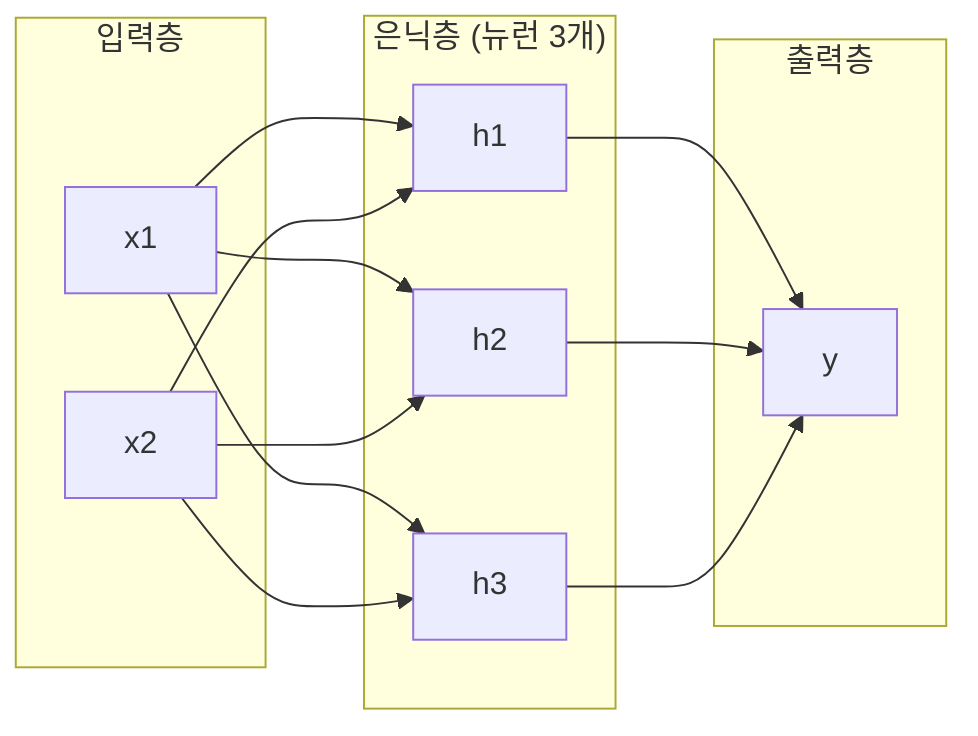
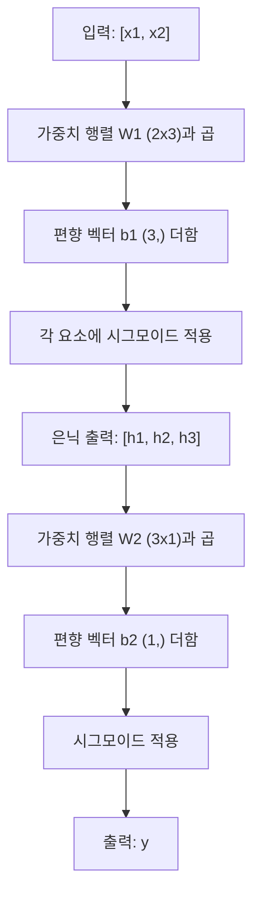

# 다층 네트워크와 순전파 (Multi-Layer Networks and Forward Pass)

> 뉴런 하나는 직선을 그립니다. 쌓으면 무엇이든 그릴 수 있습니다.

**Type:** Build
**Languages:** Python
**Prerequisites:** Phase 01 (Math Foundations), Lesson 03.01 (The Perceptron)
**Time:** ~90 minutes

## 학습 목표 (Learning Objectives)

- Layer와 Network 클래스로 다층 네트워크를 처음부터 만들고 완전한 순전파를 수행합니다
- 네트워크 각 층의 행렬 차원을 추적하고 형태 불일치를 식별합니다
- 비선형 활성화를 쌓으면 네트워크가 곡선 결정 경계를 학습할 수 있는 이유를 설명합니다
- 손으로 맞춘 시그모이드 가중치로 2-2-1 아키텍처를 사용해 XOR 문제를 풉니다

## 문제 상황 (The Problem)

뉴런 하나는 직선 그리는 기계입니다. 그게 전부입니다. 데이터에 직선 하나. AI의 모든 실제 문제 — 이미지 인식, 언어 이해, 바둑 — 는 곡선이 필요합니다. 뉴런을 층으로 쌓는 것이 곡선을 얻는 방법입니다.

1969년 Minsky와 Papert는 이 한계가 치명적임을 증명했습니다. 단일층 네트워크는 XOR을 학습할 수 없습니다. "학습하기 어렵다"가 아니라 수학적으로 불가능합니다. XOR 진리표는 [0,1]과 [1,0]을 한쪽, [0,0]과 [1,1]을 다른 쪽에 둡니다. 단일 직선으로 분리되지 않습니다.

이 때문에 신경망 자금이 10년 넘게 끊겼습니다. 돌이켜 보면 해결책은 뻔했습니다. 한 층을 쓰지 마세요. 뉴런을 층으로 쌓으세요. 첫 층이 입력 공간을 새 특성으로 가르고, 둘째 층이 그 특성을 합쳐 단일 직선으로는 불가능한 결정을 만듭니다.

그 스택이 다층 네트워크입니다. 오늘날 프로덕션의 모든 딥러닝 모델의 기반입니다. 순전파 (forward pass) — 입력이 은닉층을 지나 출력으로 흐르는 것 — 는 다른 무엇보다 먼저 만들어야 하는 것입니다.

## 핵심 개념 (The Concept)

### 층: 입력, 은닉, 출력

다층 네트워크에는 세 종류의 층이 있습니다.

**입력층 (Input layer)** — 사실 층이 아닙니다. 원본 데이터를 담습니다. 특성이 두 개면 입력 노드가 두 개입니다. 여기서는 연산이 없습니다.

**은닉층 (Hidden layers)** — 일이 일어나는 곳입니다. 각 뉴런이 이전 층의 모든 출력을 받아 가중치와 편향을 적용한 뒤, 활성화 함수에 통과시킵니다. "은닉"인 이유는 학습 데이터에서 이 값을 직접 보지 않기 때문입니다.

**출력층 (Output layer)** — 최종 답입니다. 이진 분류면 시그모이드를 쓴 뉴런 하나. 다중 클래스면 클래스당 뉴런 하나.



이것이 2-3-1 네트워크입니다. 입력 2, 은닉 뉴런 3, 출력 1. 모든 연결에 가중치가 있습니다. 입력 제외 모든 뉴런에 편향이 있습니다.

각 층은 은닉 상태 (hidden state)라 불리는 숫자 벡터를 만듭니다. 텍스트에서는 은닉 상태가 차원을 키웁니다 — 단어를 768개 숫자로 인코딩해 의미를 담습니다. 이미지에서는 차원을 줄입니다 — 수백만 픽셀을 다루기 쉬운 표현으로 압축합니다. 학습이 사는 곳이 은닉 상태입니다.

### 뉴런과 활성화

각 뉴런은 세 가지를 합니다.

1. 모든 입력에 대응하는 가중치를 곱합니다
2. 모든 곱을 합하고 편향을 더합니다
3. 합을 활성화 함수에 통과시킵니다

지금은 활성화가 시그모이드입니다.

```
sigmoid(z) = 1 / (1 + e^(-z))
```

시그모이드는 어떤 숫자든 (0, 1) 범위로 찌그러뜨립니다. 큰 양수 입력은 1 쪽으로, 큰 음수는 0 쪽으로 갑니다. 0은 0.5에 매핑됩니다. 이 매끄러운 곡선이 학습을 가능하게 합니다 — 퍼셉트론의 딱딱한 계단과 달리, 시그모이드는 어디서나 기울기가 있습니다.

### 순전파: 데이터가 흐르는 방식

순전파는 입력 데이터를 네트워크를 통해 층마다 밀어, 출력에 도달할 때까지 진행합니다. 순전파 동안에는 학습이 없습니다. 순수 연산입니다. 곱하고, 더하고, 활성화하고, 반복.



각 층에서 세 연산이 순서대로 일어납니다.

```
z = W * input + b       (linear transformation)
a = sigmoid(z)           (activation)
```

한 층의 출력이 다음 층의 입력이 됩니다. 그게 순전파 전부입니다.

### 행렬 차원

차원 추적은 딥러닝에서 가장 중요한 디버깅 기술입니다. 2-3-1 네트워크입니다.

| Step | Operation | Dimensions | Result Shape |
|------|-----------|------------|-------------|
| Input | x | -- | (2,) |
| Hidden linear | W1 * x + b1 | W1: (3, 2), b1: (3,) | (3,) |
| Hidden activation | sigmoid(z1) | -- | (3,) |
| Output linear | W2 * h + b2 | W2: (1, 3), b2: (1,) | (1,) |
| Output activation | sigmoid(z2) | -- | (1,) |

규칙: 층 k의 가중치 행렬 W 형태는 (neurons_in_layer_k, neurons_in_layer_k_minus_1)입니다. 행은 현재 층, 열은 이전 층과 맞습니다. 형태가 안 맞으면 버그입니다.

### 보편 근사 정리 (Universal Approximation Theorem)

1989년 George Cybenko는 놀라운 것을 증명했습니다. 단일 은닉층과 충분한 뉴런을 가진 신경망은 임의의 연속 함수를 원하는 정확도까지 근사할 수 있습니다.

이것이 "은닉층 하나가 항상 최고"라는 뜻은 아닙니다. 아키텍처가 이론적으로 가능하다는 뜻입니다. 실무에서는 더 깊은 네트워크(층은 많고 층당 뉴런은 적음)가 얕고 넓은 네트워크보다 훨씬 적은 총 파라미터로 같은 함수를 학습합니다. 딥러닝이 통하는 이유입니다.

직관: 은닉층의 각 뉴런이 "범프" 또는 특성 하나를 학습합니다. 올바른 위치에 범프를 충분히 놓으면 어떤 매끄러운 곡선도 근사할 수 있습니다. 뉴런이 많을수록 범프가 많아지고, 근사가 좋아집니다.


### 조합 가능성 (Composability)

신경망은 조합 가능합니다. 쌓고, 체인하고, 병렬로 돌릴 수 있습니다. Whisper 모델은 인코더 네트워크로 오디오를 처리하고, 별도 디코더 네트워크로 텍스트를 생성합니다. 현대 LLM은 디코더만. BERT는 인코더만. T5는 인코더-디코더입니다. 아키텍처 선택이 모델이 할 수 있는 일을 정의합니다.

```figure
mlp-forward
```

## 직접 만들기 (Build It)

순수 Python. numpy 없음. 모든 행렬 연산을 처음부터 작성합니다.

### Step 1: 시그모이드 활성화

```python
import math

def sigmoid(x):
    x = max(-500.0, min(500.0, x))
    return 1.0 / (1.0 + math.exp(-x))
```

[-500, 500]으로 클램프하면 오버플로를 막습니다. `math.exp(500)`은 크지만 유한합니다. `math.exp(1000)`은 무한대입니다.

### Step 2: Layer 클래스

딥러닝에서 가장 중요한 연산은 행렬 곱셈입니다. 모든 층, 모든 어텐션 헤드, 모든 순전파 — 끝까지 matmul입니다. 선형 층은 입력 벡터를 받아 가중치 행렬과 곱하고 편향 벡터를 더합니다: y = Wx + b. 이 방정식 하나가 신경망 연산의 90%입니다.

층은 가중치 행렬과 편향 벡터를 보유합니다. forward 메서드는 입력 벡터를 받아 활성화된 출력을 반환합니다.

```python
class Layer:
    def __init__(self, n_inputs, n_neurons, weights=None, biases=None):
        if weights is not None:
            self.weights = weights
        else:
            import random
            self.weights = [
                [random.uniform(-1, 1) for _ in range(n_inputs)]
                for _ in range(n_neurons)
            ]
        if biases is not None:
            self.biases = biases
        else:
            self.biases = [0.0] * n_neurons

    def forward(self, inputs):
        self.last_input = inputs
        self.last_output = []
        for neuron_idx in range(len(self.weights)):
            z = sum(
                w * x for w, x in zip(self.weights[neuron_idx], inputs)
            )
            z += self.biases[neuron_idx]
            self.last_output.append(sigmoid(z))
        return self.last_output
```

가중치 행렬 형태는 (n_neurons, n_inputs)입니다. 각 행이 한 뉴런의, 모든 입력에 대한 가중치입니다. forward 메서드는 뉴런을 순회하며 가중 합 + 편향을 계산하고, 시그모이드를 적용한 뒤 결과를 모읍니다.

### Step 3: Network 클래스

네트워크는 층의 리스트입니다. 순전파가 이들을 체인합니다. 층 k의 출력이 층 k+1의 입력이 됩니다.

```python
class Network:
    def __init__(self, layers):
        self.layers = layers

    def forward(self, inputs):
        current = inputs
        for layer in self.layers:
            current = layer.forward(current)
        return current
```

순전파 전부입니다. 로직 네 줄. 데이터가 들어가고, 모든 층을 지나, 반대편으로 나옵니다.

### Step 4: 손으로 맞춘 가중치로 XOR

Lesson 01에서는 OR, NAND, AND 퍼셉트론을 합쳐 XOR을 풀었습니다. 이제 Layer와 Network 클래스로 같은 일을 합니다. 2-2-1 아키텍처: 입력 2, 은닉 뉴런 2, 출력 1.

```python
hidden = Layer(
    n_inputs=2,
    n_neurons=2,
    weights=[[20.0, 20.0], [-20.0, -20.0]],
    biases=[-10.0, 30.0],
)

output = Layer(
    n_inputs=2,
    n_neurons=1,
    weights=[[20.0, 20.0]],
    biases=[-30.0],
)

xor_net = Network([hidden, output])

xor_data = [
    ([0, 0], 0),
    ([0, 1], 1),
    ([1, 0], 1),
    ([1, 1], 0),
]

for inputs, expected in xor_data:
    result = xor_net.forward(inputs)
    predicted = 1 if result[0] >= 0.5 else 0
    print(f"  {inputs} -> {result[0]:.6f} (rounded: {predicted}, expected: {expected})")
```

큰 가중치(20, -20)는 시그모이드가 계단 함수처럼 동작하게 합니다. 첫 은닉 뉴런은 OR를 근사합니다. 둘째는 NAND를 근사합니다. 출력 뉴런이 이들을 AND로 합치면 XOR이 됩니다.

### Step 5: 원 분류

더 어려운 문제: 원점 중심 반지름 0.5인 원 안/밖 2D 점을 분류합니다. 곡선 결정 경계가 필요하며 — 단일 퍼셉트론으로는 불가능합니다.

```python
import random
import math

random.seed(42)

data = []
for _ in range(200):
    x = random.uniform(-1, 1)
    y = random.uniform(-1, 1)
    label = 1 if (x * x + y * y) < 0.25 else 0
    data.append(([x, y], label))

circle_net = Network([
    Layer(n_inputs=2, n_neurons=8),
    Layer(n_inputs=8, n_neurons=1),
])
```

무작위 가중치로는 잘 분류하지 못합니다. 하지만 순전파는 여전히 돌아갑니다. 그게 요점입니다 — 순전파는 그냥 연산입니다. 올바른 가중치를 학습하는 것은 역전파이고, Lesson 03에서 나옵니다.

```python
correct = 0
for inputs, expected in data:
    result = circle_net.forward(inputs)
    predicted = 1 if result[0] >= 0.5 else 0
    if predicted == expected:
        correct += 1

print(f"Accuracy with random weights: {correct}/{len(data)} ({100*correct/len(data):.1f}%)")
```

무작위 가중치는 정확도가 나쁩니다 — 종종 다수 클래스를 찍는 것보다 못합니다. 학습 후(Lesson 03) 같은 아키텍처에 은닉 뉴런 8개면 안과 밖을 가르는 곡선 경계를 그립니다.

## 활용하기 (Use It)

PyTorch는 위를 네 줄로 합니다.

```python
import torch
import torch.nn as nn

model = nn.Sequential(
    nn.Linear(2, 8),
    nn.Sigmoid(),
    nn.Linear(8, 1),
    nn.Sigmoid(),
)

x = torch.tensor([[0.0, 0.0], [0.0, 1.0], [1.0, 0.0], [1.0, 1.0]])
output = model(x)
print(output)
```

`nn.Linear(2, 8)`이 당신의 Layer 클래스입니다. 형태 (8, 2) 가중치 행렬, 형태 (8,) 편향 벡터. `nn.Sigmoid()`는 요소별 시그모이드. `nn.Sequential`은 Network 클래스: 층을 순서대로 체인합니다.

차이는 속도와 규모입니다. PyTorch는 GPU에서 돌고, 수백만 샘플 배치를 다루며, 역전파용 기울기를 자동 계산합니다. 하지만 순전파 로직은 방금 처음부터 만든 것과 동일합니다.

## 산출물 (Ship It)

이 레슨은 네트워크 아키텍처 설계용 재사용 프롬프트를 만듭니다.

- `outputs/prompt-network-architect.md`

층 수, 층당 뉴런 수, 주어진 문제에 어떤 활성화 함수를 쓸지 결정할 때 사용하세요.

## 연습 문제 (Exercises)

1. 2-4-2-1 네트워크(은닉층 두 개)를 만들고 무작위 가중치로 XOR 데이터에 순전파를 돌리세요. 중간 은닉층 출력을 출력해 표현이 층마다 어떻게 변환되는지 보세요.

2. 원 분류기의 은닉층 크기를 8에서 2로, 그다음 32로 바꾸세요. 매번 무작위 가중치로 순전파를 돌리세요. 은닉 뉴런 수가 출력 범위나 분포를 바꾸나요? 이유는?

3. Network 클래스에 학습 가능한 가중치와 편향 총 개수를 반환하는 `count_parameters` 메서드를 구현하세요. 784-256-128-10 네트워크(고전 MNIST 아키텍처)에서 테스트하세요. 파라미터는 몇 개인가요?

4. 3-4-4-2 네트워크용 순전파를 만드세요. RGB 색상 값(0-1로 정규화)을 넣고 두 출력을 관찰하세요. 클래스 두 개인 단순 색상 분류기 아키텍처입니다.

5. 시그모이드를 "누수 계단" 함수로 바꾸세요. z < 0이면 0.01 * z, 아니면 1.0을 반환합니다. Step 4의 손으로 맞춘 같은 가중치로 XOR에 순전파를 돌리세요. 여전히 동작하나요? 딱딱한 절단보다 매끄러운 시그모이드가 선호되는 이유는?

## 핵심 용어 (Key Terms)

| Term | What people say | What it actually means |
|------|----------------|----------------------|
| Forward pass (순전파) | "모델을 돌린다" | 입력을 모든 층에 밀어 넣음 — 가중치 곱, 편향 더함, 활성화 — 출력을 만듦 |
| Hidden layer (은닉층) | "가운데 부분" | 입력과 출력 사이 층. 값이 데이터에서 직접 관측되지 않음 |
| Multi-layer network (다층 네트워크) | "심층 신경망" | 순차적으로 쌓인 뉴런 층. 각 층 출력이 다음 층 입력이 됨 |
| Activation function (활성화 함수) | "비선형성" | 선형 변환 뒤에 적용해 결정 경계에 곡선을 넣는 함수 |
| Sigmoid (시그모이드) | "S자 곡선" | sigma(z) = 1/(1+e^(-z)), 실수 전체를 (0,1)로 찌그러뜨림. 어디서나 매끄럽고 미분 가능 |
| Weight matrix (가중치 행렬) | "파라미터" | 형태 (current_layer_neurons, previous_layer_neurons)의 행렬 W. 학습 가능한 연결 강도 |
| Bias vector (편향 벡터) | "오프셋" | 행렬 곱 뒤에 더하는 벡터. 입력이 전부 0이어도 뉴런이 활성화되게 함 |
| Universal approximation (보편 근사) | "신경망은 뭐든 배운다" | 은닉층 하나와 충분한 뉴런이면 임의의 연속 함수를 근사 — 단 "충분"이 수십억일 수 있음 |
| Linear transformation (선형 변환) | "행렬 곱 단계" | z = W * x + b, 활성화 전 연산. 입력을 새 공간으로 매핑 |
| Decision boundary (결정 경계) | "분류기가 바뀌는 곳" | 네트워크 출력이 분류 임계값을 넘는 입력 공간의 면 |

## 더 읽을거리 (Further Reading)

- Michael Nielsen, "Neural Networks and Deep Learning", Chapter 1-2 (http://neuralnetworksanddeeplearning.com/) -- 순전파와 네트워크 구조에 대한 가장 명확한 무료 설명, 인터랙티브 시각화 포함
- Cybenko, "Approximation by Superpositions of a Sigmoidal Function" (1989) -- 원본 보편 근사 정리 논문, 의외로 읽기 쉬움
- 3Blue1Brown, "But what is a neural network?" (https://www.youtube.com/watch?v=aircAruvnKk) -- 층, 가중치, 순전파를 20분 시각적으로 훑으며 올바른 멘탈 모델을 만듦
- Goodfellow, Bengio, Courville, "Deep Learning", Chapter 6 (https://www.deeplearningbook.org/) -- 다층 네트워크의 표준 참고서, 무료 온라인
