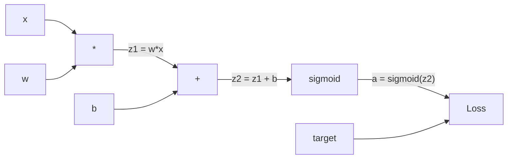
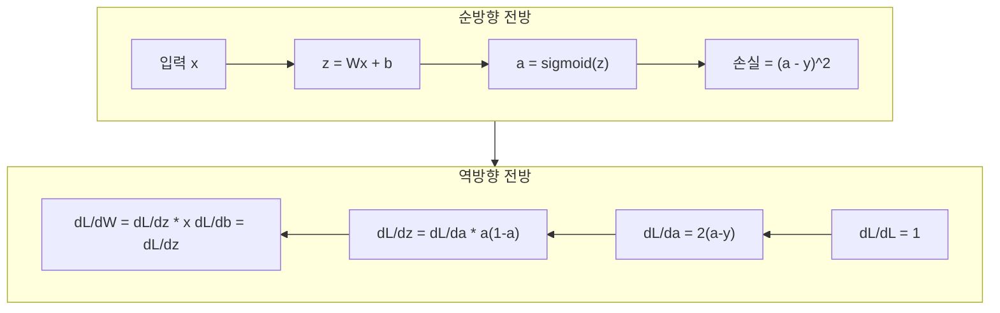
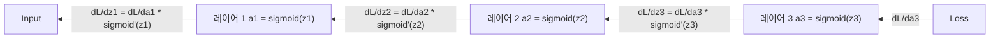

# 처음부터 구현하는 역전파(Backpropagation)

> 역전파(Backpropagation)는 학습을 가능하게 하는 알고리즘입니다. 이 알고리즘이 없으면 신경망은 비싼 난수 생성기에 불과합니다.

**유형:** Build
**언어:** Python
**선수 요건:** 03.02강 (다층 신경망)
**시간:** 약 120분

## 학습 목표

- 연산 그래프를 구축하고 위상 정렬(topological sort)을 통해 기울기를 계산하는 값 기반(Value-based) 오토그라드(Autograd) 엔진을 구현해 보세요
- 연쇄 법칙(chain rule)을 사용하여 덧셈, 곱셈, 시그모이드(sigmoid)의 역전파(backward pass)를 유도해 보세요
- 처음부터 구현한 역전파 엔진만을 사용하여 XOR 및 원(circle) 분류에 다층 신경망을 학습해 보세요
- 깊은 시그모이드(sigmoid) 신경망에서 기울기 소실(vanishing gradient) 문제를 식별하고, 기울기가 지수적으로 감소하는 이유를 설명해 보세요

## 문제점

신경망에 입력이 768개, 출력이 3072개인 단일 은닉층이 있습니다. 이는 가중치(Weight)가 2,359,296개라는 뜻입니다. 신경망이 잘못된 예측을 했습니다. 어떤 가중치가 오류를 일으켰을까요? 각 가중치를 개별적으로 테스트하려면 230만 번의 순전파(forward pass)가 필요합니다. 역전파(Backpropagation)는 단 한 번의 역전파(backward pass)로 230만 개의 기울기를 모두 계산합니다. 이는 단순한 최적화가 아닙니다. 학습 가능한 것과 불가능한 것의 차이입니다.

소박한 접근 방식: 하나의 가중치를 아주 작은 양만큼 조정하고, 순전파(forward pass)를 다시 실행하여 손실(loss)이 증가했는지 감소했는지 측정합니다. 이렇게 하면 해당 가중치의 기울기를 얻을 수 있습니다. 이제 신경망의 모든 가중치에 대해 이 과정을 반복합니다. 수천 번의 학습 단계와 수백만 개의 데이터 포인트를 곱하면, 유용한 것을 학습하는 데 지질학적 시간이 필요할 것입니다.

역전파(Backpropagation)가 이 문제를 해결합니다. 한 번의 순전파(forward pass)와 한 번의 역전파(backward pass)로 모든 기울기를 계산합니다. 핵심은 미적분학의 연쇄 법칙(chain rule)을 연산 그래프에 체계적으로 적용하는 것입니다. 이 알고리즘이 딥러닝을 실용적으로 만들었습니다. 이 알고리즘이 없다면 우리는 여전히 장난감 수준의 문제에 갇혀 있을 것입니다.

## 개념

### 신경망에 적용된 연쇄 법칙

1단계, 05강에서 연쇄 법칙(chain rule)을 보셨습니다. 간단히 복습해 보세요: y = f(g(x))라면, dy/dx = f'(g(x)) * g'(x)입니다. 연쇄를 따라 미분값을 곱합니다.

신경망에서 "체인"은 입력부터 손실까지의 연산 순서입니다. 각 레이어는 가중치를 적용하고, 편향을 더하고, 활성화 함수를 통과합니다. 손실 함수는 최종 출력과 목표값을 비교합니다. 역전파(Backpropagation)는 이 체인을 역방향으로 추적하여 각 연산이 오차에 어떻게 기여했는지 계산합니다.

### 계산 그래프

모든 순방향 전방(Foward pass)은 그래프를 구축합니다. 각 노드는 연산(곱셈, 덧셈, 시그모이드)이며, 각 간선은 값을 앞으로 전달하고 기울기를 뒤로 전달합니다.



순방향 전방: 값이 왼쪽에서 오른쪽으로 흐릅니다. x와 w가 z1 = w*x를 생성합니다. b를 더하여 z2를 얻습니다. 시그모이드가 활성화 a를 생성합니다. 손실 함수를 사용하여 a를 목표 y와 비교합니다.

역방향 전방: 기울기가 오른쪽에서 왼쪽으로 흐릅니다. dL/da (활성화에 따른 손실 변화)로 시작합니다. da/dz2 (시그모이드 미분)를 곱합니다. 이는 dL/dz2를 제공합니다. z2 = z1 + b이므로 dL/db (dL/dz2와 동일)와 dL/dz1로 분할합니다. 이후 dL/dw = dL/dz1 * x, dL/dx = dL/dz1 * w가 됩니다.

그래프의 모든 노드는 역방향 전방 동안 하나의 작업을 수행합니다: 위에서 내려오는 기울기를 받아 지역 미분값과 곱하고, 아래로 전달합니다.

### 순방향 vs 역방향



순방향 전방은 모든 중간 값(z, a, 각 레이어의 입력)을 저장합니다. 역방향 전방은 기울기를 계산하기 위해 이 저장된 값들을 필요로 합니다. 이것이 역전파의 핵심인 메모리-연산 트레이드오프입니다. 메모리(활성화 저장)를 속도(수백만 번의 반복 대신 한 번의 전방)와 교환합니다.

### 네트워크를 통한 기울기 흐름

3층 네트워크의 경우, 기울기는 모든 레이어를 통해 체인처럼 연결됩니다:



각 레이어에서 기울기는 시그모이드 미분값과 곱해집니다. 시그모이드 미분값은 * (1 - a)이며, 최대값은 0.25입니다 (a = 0.5일 때). 세 레이어 깊이에서는 기울기가 최대 0.25^3 = 0.0156까지 곱해집니다. 열 레이어 깊이에서는: 0.25^10 = 0.000001입니다.

### 기울기 소실(Vanishing Gradients)

이것이 기울기 소실(vanishing gradient) 문제입니다. 시그모이드는 출력값을 00강 1 사이로 압축(squash)합니다. 그 미분값은 항상 0.25보다 작습니다. 시그모이드 레이어를 충분히 쌓으면 기울기는 거의 0에 가까워집니다. 초기 레이어는 거의 0에 가까운 기울기를 받기 때문에 학습이 거의 일어나지 않습니다.

```
sigmoid(z):     Output range [0, 1]
sigmoid'(z):    Max value 0.25 (at z = 0)

After 5 layers:   gradient * 0.25^5 = 0.001x original
After 10 layers:  gradient * 0.25^10 = 0.000001x original
```

이 때문에 깊은 시그모이드 네트워크는 학습이 거의 불가능합니다. 해결책인 ReLU 및 그 변형들은 04강의 주제입니다. 지금은 역전파(backprop)가 완벽하게 작동한다는 점을 이해하세요. 문제는 역전파가 무엇을 통해 작동하느냐입니다.

### 2레이어 네트워크의 기울기 유도

입력 x, 시그모이드가 있는 은닉 레이어, 시그모이드가 있는 출력 레이어, MSE 손실을 사용하는 네트워크에 대한 구체적인 수식입니다.

순방향 전파:
```
z1 = W1 * x + b1
a1 = sigmoid(z1)
z2 = W2 * a1 + b2
a2 = sigmoid(z2)
L = (a2 - y)^2
```

역방향 전파 (연쇄 법칙을 단계별로 적용):
```
dL/da2 = 2(a2 - y)
da2/dz2 = a2 * (1 - a2)
dL/dz2 = dL/da2 * da2/dz2 = 2(a2 - y) * a2 * (1 - a2)

dL/dW2 = dL/dz2 * a1
dL/db2 = dL/dz2

dL/da1 = dL/dz2 * W2
da1/dz1 = a1 * (1 - a1)
dL/dz1 = dL/da1 * da1/dz1

dL/dW1 = dL/dz1 * x
dL/db1 = dL/dz1
```

모든 기울기는 손실로부터 거슬러 올라간 지역 미분값들의 곱입니다. 이것이 역전파(backpropagation)의 전부입니다.

```figure
backprop-vanishing
```

## 구현하기

### 1단계: Value 노드

연산의 모든 숫자는 Value가 됩니다. Value는 데이터, 기울기, 그리고 생성된 방식 (역방향으로 기울기를 계산하는 방법을 알기 위해)을 저장합니다.

```python
class Value:
    def __init__(self, data, children=(), op=''):
        self.data = data
        self.grad = 0.0
        self._backward = lambda: None
        self._children = set(children)
        self._op = op

    def __repr__(self):
        return f"Value(data={self.data:.4f}, grad={self.grad:.4f})"
```

아직 기울기가 없습니다 (0.0). 아직 역방향 함수가 없습니다 (no-op). `_children`는 이 Value를 생성한 Value들을 추적하여, 나중에 그래프를 위상 정렬할 수 있게 합니다.

### 2단계: 역방향 함수가 있는 연산

각 연산은 새로운 Value를 생성하고, 기울기가 이를 통해 역방향으로 흐르는 방식을 정의합니다.

```python
def __add__(self, other):
    other = other if isinstance(other, Value) else Value(other)
    out = Value(self.data + other.data, (self, other), '+')

    def _backward():
        self.grad += out.grad
        other.grad += out.grad

    out._backward = _backward
    return out

def __mul__(self, other):
    other = other if isinstance(other, Value) else Value(other)
    out = Value(self.data * other.data, (self, other), '*')

    def _backward():
        self.grad += other.data * out.grad
        other.grad += self.data * out.grad

    out._backward = _backward
    return out
```

덧셈의 경우: d(a+b)/da = 1, d(a+b)/db = 1입니다. 따라서 두 입력 모두 출력의 기울기를 직접 받습니다.

곱셈의 경우: d(a*b)/da = b, d(a*b)/db = a입니다. 각 입력은 다른 입력의 값에 출력의 기울기를 곱한 값을 받습니다.

`+=`는 매우 중요합니다. Value는 여러 연산에서 사용될 수 있습니다. 그 기울기는 모든 경로에서 온 기울기의 합입니다.

### 3단계: 시그모이드와 손실

```python
import math

def sigmoid(self):
    x = self.data
    x = max(-500, min(500, x))
    s = 1.0 / (1.0 + math.exp(-x))
    out = Value(s, (self,), 'sigmoid')

    def _backward():
        self.grad += (s * (1 - s)) * out.grad

    out._backward = _backward
    return out
```

시그모이드 미분: sigmoid(x) * (1 - sigmoid(x)). 순전파 과정에서 sigmoid(x) = s를 계산했습니다. 이를 재사용하세요. 추가 작업이 필요 없습니다.

```python
def mse_loss(predicted, target):
    diff = predicted + Value(-target)
    return diff * diff
```

단일 출력에 대한 MSE: (predicted - target)^2. 뺄셈을 음수 Value를 더하는 방식으로 표현합니다.

### 4단계: 역전파

위상 정렬은 노드를 올바른 순서로 처리하도록 보장합니다 -- 노드의 기울기가 완전히 누적된 후에 그 노드를 통해 전파합니다.

```python
def backward(self):
    topo = []
    visited = set()

    def build_topo(v):
        if v not in visited:
            visited.add(v)
            for child in v._children:
                build_topo(child)
            topo.append(v)

    build_topo(self)
    self.grad = 1.0
    for v in reversed(topo):
        v._backward()
```

손실부터 시작하세요 (기울기 = 1.0, dL/dL = 1이므로). 정렬된 그래프를 거꾸로 탐색하세요. 각 노드의 `_backward`는 기울기를 자식 노드들에게 전파합니다.

### 5단계: 레이어와 네트워크

```python
import random

class Neuron:
    def __init__(self, n_inputs):
        scale = (2.0 / n_inputs) ** 0.5
        self.weights = [Value(random.uniform(-scale, scale)) for _ in range(n_inputs)]
        self.bias = Value(0.0)

    def __call__(self, x):
        act = sum((wi * xi for wi, xi in zip(self.weights, x)), self.bias)
        return act.sigmoid()

    def parameters(self):
        return self.weights + [self.bias]


class Layer:
    def __init__(self, n_inputs, n_outputs):
        self.neurons = [Neuron(n_inputs) for _ in range(n_outputs)]

    def __call__(self, x):
        out = [n(x) for n in self.neurons]
        return out[0] if len(out) == 1 else out

    def parameters(self):
        params = []
        for n in self.neurons:
            params.extend(n.parameters())
        return params


class Network:
    def __init__(self, sizes):
        self.layers = []
        for i in range(len(sizes) - 1):
            self.layers.append(Layer(sizes[i], sizes[i + 1]))

    def __call__(self, x):
        for layer in self.layers:
            x = layer(x)
            if not isinstance(x, list):
                x = [x]
        return x[0] if len(x) == 1 else x

    def parameters(self):
        params = []
        for layer in self.layers:
            params.extend(layer.parameters())
        return params

    def zero_grad(self):
        for p in self.parameters():
            p.grad = 0.0
```

Neuron은 입력을 받아 가중 합 + 편향을 계산하고 시그모이드를 적용합니다. 가중치 초기화는 sqrt(2/n_inputs)로 스케일링하여 더 깊은 네트워크에서 시그모이드 포화를 방지합니다. Layer는 Neuron의 리스트입니다. Network는 Layer의 리스트입니다. `parameters()` 메서드는 학습 가능한 모든 Value를 수집하여 업데이트할 수 있도록 합니다.

### 6단계: XOR로 학습

```python
random.seed(42)
net = Network([2, 4, 1])

xor_data = [
    ([0.0, 0.0], 0.0),
    ([0.0, 1.0], 1.0),
    ([1.0, 0.0], 1.0),
    ([1.0, 1.0], 0.0),
]

learning_rate = 1.0

for epoch in range(1000):
    total_loss = Value(0.0)
    for inputs, target in xor_data:
        x = [Value(i) for i in inputs]
        pred = net(x)
        loss = mse_loss(pred, target)
        total_loss = total_loss + loss

    net.zero_grad()
    total_loss.backward()

    for p in net.parameters():
        p.data -= learning_rate * p.grad

    if epoch % 100 == 0:
        print(f"Epoch {epoch:4d} | Loss: {total_loss.data:.6f}")

print("\nXOR Results:")
for inputs, target in xor_data:
    x = [Value(i) for i in inputs]
    pred = net(x)
    print(f"  {inputs} -> {pred.data:.4f} (expected {target})")
```

손실이 감소하는 것을 지켜보세요. 랜덤 예측에서 올바른 XOR 출력으로, 역전파가 기울기를 계산하고 가중치를 올바른 방향으로 미세 조정하는 것에 의해 완전히 주도됩니다.

### 7단계: 원형 분류

02강에서 원형 분류를 위해 가중치를 수동으로 조정했습니다. 이제 네트워크가 이를 학습하도록 해 보세요.

```python
random.seed(7)

def generate_circle_data(n=100):
    data = []
    for _ in range(n):
        x1 = random.uniform(-1.5, 1.5)
        x2 = random.uniform(-1.5, 1.5)
        label = 1.0 if x1 * x1 + x2 * x2 < 1.0 else 0.0
        data.append(([x1, x2], label))
    return data

circle_data = generate_circle_data(80)

circle_net = Network([2, 8, 1])
learning_rate = 0.5

for epoch in range(2000):
    random.shuffle(circle_data)
    total_loss_val = 0.0
    for inputs, target in circle_data:
        x = [Value(i) for i in inputs]
        pred = circle_net(x)
        loss = mse_loss(pred, target)
        circle_net.zero_grad()
        loss.backward()
        for p in circle_net.parameters():
            p.data -= learning_rate * p.grad
        total_loss_val += loss.data

    if epoch % 200 == 0:
        correct = 0
        for inputs, target in circle_data:
            x = [Value(i) for i in inputs]
            pred = circle_net(x)
            predicted_class = 1.0 if pred.data > 0.5 else 0.0
            if predicted_class == target:
                correct += 1
        accuracy = correct / len(circle_data) * 100
        print(f"Epoch {epoch:4d} | Loss: {total_loss_val:.4f} | Accuracy: {accuracy:.1f}%")
```

여기서는 온라인 SGD를 사용합니다 -- 전체 배치를 누적하는 대신 각 샘플마다 가중치를 업데이트합니다. 이는 대칭을 더 빠르게 깨뜨리고 전체 손실 지형에서의 시그모이드 포화를 피합니다. 각 에포크마다 데이터를 셔플링하면 네트워크가 순서를 암기하는 것을 방지합니다.

수동 조정이 없습니다. 네트워크가 원형 결정 경계를 스스로 발견합니다. 이것이 역전파의 힘입니다: 아키텍처, 손실 함수, 데이터를 정의합니다. 알고리즘이 가중치를 알아냅니다.

## 사용하기

PyTorch는 위의 모든 것을 몇 줄로 처리합니다. 핵심 아이디어는 동일합니다 -- autograd는 순전파 중에 계산 그래프를 구축하고 이를 거꾸로 추적하여 기울기를 계산합니다.

```python
import torch
import torch.nn as nn

model = nn.Sequential(
    nn.Linear(2, 4),
    nn.Sigmoid(),
    nn.Linear(4, 1),
    nn.Sigmoid(),
)
optimizer = torch.optim.SGD(model.parameters(), lr=1.0)
criterion = nn.MSELoss()

X = torch.tensor([[0,0],[0,1],[1,0],[1,1]], dtype=torch.float32)
y = torch.tensor([[0],[1],[1],[0]], dtype=torch.float32)

for epoch in range(1000):
    pred = model(X)
    loss = criterion(pred, y)
    optimizer.zero_grad()
    loss.backward()
    optimizer.step()

print("PyTorch XOR Results:")
with torch.no_grad():
    for i in range(4):
        pred = model(X[i])
        print(f"  {X[i].tolist()} -> {pred.item():.4f} (expected {y[i].item()})")
```

`loss.backward()`는 `total_loss.backward()`입니다. `optimizer.step()`는 수동 `p.data -= lr * p.grad`입니다. `optimizer.zero_grad()`는 `net.zero_grad()`입니다. 동일한 알고리즘, 산업용 수준의 구현입니다. PyTorch는 GPU 가속, 혼합 정밀도(Mixed Precision), 기울기 체크포인팅(Gradient Checkpointing), 수백 가지 레이어 유형을 처리합니다. 하지만 역전파는 동일한 계산 그래프에 적용된 동일한 연쇄 법칙입니다.

학습은 순방향 전파를 실행한 후, 역전파를 실행하고 가중치를 업데이트합니다. 추론은 순방향 전파만 실행합니다. 기울기도, 업데이트도 없습니다. 이 구분이 중요한 이유는 추론이 프로덕션에서 일어나는 일이기 때문입니다. Claude나 GPT 같은 API를 호출할 때, 추론을 실행하는 것입니다. 프롬프트가 네트워크를 통해 앞으로 흐르고, 반대편 끝에서 토큰이 나옵니다. 가중치는 변하지 않습니다. 역전파를 이해하는 것이 중요한 이유는 그 네트워크의 모든 가중치를 형성했기 때문입니다.

## 출시하기

이 강의에서 생성되는 것:
- `outputs/prompt-gradient-debugger.md` -- 모든 신경망에서 기울기 문제(소실, 폭발, NaN)를 진단하기 위한 재사용 가능한 프롬프트

## 연습 문제

1. Value 클래스에 `__sub__` 메서드를 추가하세요 (a - b = a + (-1 * b)). 그 후 `__neg__` 메서드를 구현하세요. (a - b)^2 같은 간단한 표현에 대해 수동 계산과 비교하여 기울기가 올바른지 확인하세요.

2. Value에 `relu` 메서드를 추가하세요 (출력은 max(0, x), x > 0이면 도함수는 1, 그렇지 않으면 0). 은닉 레이어에서 sigmoid를 relu로 대체하고 XOR에 대해 다시 학습하세요. 수렴 속도를 비교하세요. 더 빠른 학습을 볼 수 있어야 합니다. 이는 04강을 미리 보여줍니다.

3. Value에 정수 거듭제곱을 위한 `__pow__` 메서드를 구현하세요. 이를 사용하여 `mse_loss`를 적절한 `(predicted - target) ** 2` 표현으로 대체하세요. 기울기가 원본 구현과 일치하는지 확인하세요.

4. 학습 루프에 기울기 클리핑(Gradient Clipping)을 추가하세요: `backward()`를 호출한 후, 모든 기울기를 [-1, 1]로 클리핑하세요. 더 깊은 네트워크(sigmoid 포함 4개 이상 레이어)를 학습하고 클리핑 유무에 따른 손실 곡선을 비교하세요. 이는 기울기 폭발에 대한 첫 번째 방어입니다.

5. 시각화를 구축하세요: XOR에 대해 학습한 후, 네트워크의 모든 매개변수(Parameter)의 기울기를 출력하세요. 가장 작은 기울기를 가진 레이어를 식별하세요. 이는 개념 섹션에서 읽은 기울기 소실 문제를 보여줍니다.

## 핵심 용어

| 용어 | 사람들이 말하는 것 | 실제 의미 |
|------|----------------|----------------------|
| 역전파(Backpropagation) | "네트워크가 학습한다" | 계산 그래프를 거슬러 연쇄 법칙을 적용하여 모든 가중치에 대해 dL/dw를 계산하는 알고리즘 |
| 계산 그래프 | "네트워크 구조" | 노드가 연산이고, 간선이 값(순방향)과 기울기(역방향)를 전달하는 방향성 비순환 그래프 |
| 연쇄 법칙 | "미분값을 곱한다" | y = f(g(x))이면 dy/dx = f'(g(x)) * g'(x) -- 역전파의 수학적 기초 |
| 기울기 | "가장 가파른 상승 방향" | 매개변수에 대한 손실의 부분 미분 -- 손실을 줄이기 위해 해당 매개변수를 어떻게 변경해야 하는지 알려줍니다 |
| 기울기 소실 | "깊은 네트워크는 학습하지 못한다" | 시그모이드 같은 포화 활성화 함수가 있는 레이어를 거치며 기울기가 지수적으로 감소합니다 |
| 순방향 전파 | "네트워크 실행" | 각 레이어의 연산을 순차적으로 적용하고 중간 값을 저장하여 입력으로부터 출력을 계산합니다 |
| 역방향 전파 | "기울기 계산" | 계산 그래프를 거슬러 순회하며, 연쇄 법칙을 사용하여 각 노드에서 기울기를 누적합니다 |
| 학습률 | "학습 속도" | 가중치 업데이트 시 단계 크기를 제어하는 스칼라 값: w_new = w_old - lr * gradient |
| 위상 정렬 | "올바른 순서" | 각 노드가 의존하는 모든 노드 이후에 나타나도록 그래프 노드를 정렬 -- 전파 전에 기울기가 완전히 누적되도록 보장합니다 |
| 오토그라드(Autograd) | "자동 미분" | 순방향 계산 중에 계산 그래프를 구축하고 기울기를 자동으로 계산하는 시스템 -- PyTorch 엔진이 하는 일 |

## 추가 읽기

- Rumelhart, Hinton & Williams, "Learning representations by back-propagating errors" (1986) -- 역전파를 주류로 만들고 다층 네트워크 학습을 가능하게 한 논문
- 3Blue1Brown, "Neural Networks" 시리즈 (https://www.youtube.com/playlist?list=PLZHQObOWTQDNU6R1_67000Dx_ZCJB-3pi) -- 역전파와 네트워크를 통한 기울기 흐름에 대한 최고의 시각적 설명
