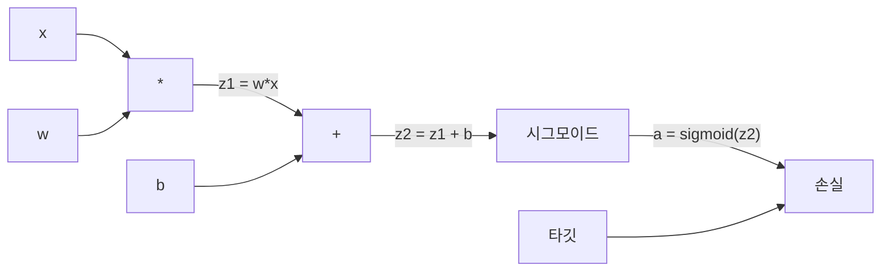
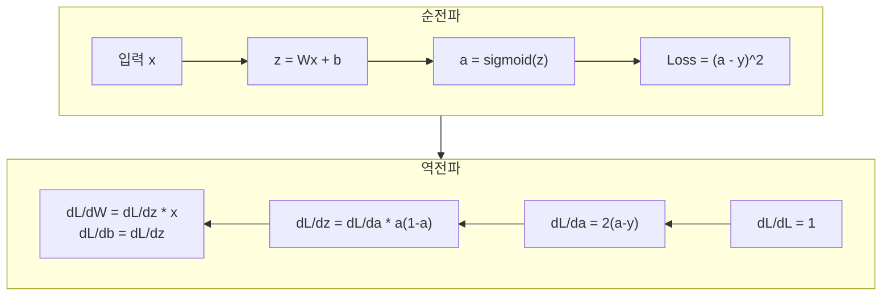
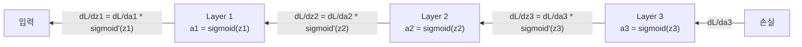

# 처음부터 만드는 역전파 (Backpropagation from Scratch)

> 역전파는 학습을 가능하게 하는 알고리즘입니다. 없으면 신경망은 비싼 난수 생성기에 불과합니다.

**Type:** Build
**Languages:** Python
**Prerequisites:** Lesson 03.02 (Multi-Layer Networks)
**Time:** ~120 minutes

## 학습 목표 (Learning Objectives)

- 계산 그래프를 만들고 위상 정렬로 기울기를 계산하는 Value 기반 autograd 엔진을 구현합니다
- 연쇄법칙으로 덧셈, 곱셈, 시그모이드의 역전파를 유도합니다
- 처음부터 만든 역전파 엔진만으로 XOR와 원 분류에 다층 네트워크를 학습시킵니다
- 깊은 시그모이드 네트워크의 기울기 소실 문제를 식별하고, 기울기가 지수적으로 줄어드는 이유를 설명합니다

## 문제 상황 (The Problem)

네트워크에 입력 768개, 출력 3072개인 은닉층이 하나 있습니다. 가중치가 2,359,296개입니다. 예측이 틀렸습니다. 어떤 가중치가 오차를 냈을까요? 가중치마다 하나씩 테스트하면 순전파 230만 번입니다. 역전파 (backpropagation)는 단일 역방향 패스로 기울기 230만을 모두 계산합니다. 이건 최적화가 아닙니다. 학습 가능과 불가능의 차이입니다.

순진한 접근: 가중치 하나를 아주 조금 밀고, 순전파를 다시 돌리고, 손실이 올랐는지 내렸는지 측정합니다. 그 가중치의 기울기가 나옵니다. 이제 네트워크의 모든 가중치에 대해 반복합니다. 학습 스텝 수천 번과 데이터 포인트 수백만을 곱하세요. 쓸모 있는 것을 학습하려면 지질학적 시간이 필요합니다.

역전파가 이것을 풉니다. 순전파 한 번, 역전파 한 번, 모든 기울기 계산. 요령은 미적분의 연쇄법칙이며, 계산 그래프에 체계적으로 적용합니다. 딥러닝을 실용적으로 만든 알고리즘입니다. 없으면 우리는 여전히 장난감 문제에 묶여 있었을 것입니다.

## 핵심 개념 (The Concept)

### 네트워크에 적용한 연쇄법칙

Phase 01 Lesson 05에서 연쇄규칙을 봤습니다. 빠른 복습: y = f(g(x))이면 dy/dx = f'(g(x)) * g'(x). 체인을 따라 도함수를 곱합니다.

신경망에서 "체인"은 입력부터 손실까지의 연산 시퀀스입니다. 각 층이 가중치를 적용하고, 편향을 더하고, 활성화를 통과시킵니다. 손실 함수가 최종 출력을 타깃과 비교합니다. 역전파는 이 체인을 뒤로 추적하며, 각 연산이 오차에 얼마나 기여했는지 계산합니다.

### 계산 그래프 (Computational Graphs)

모든 순전파가 그래프를 만듭니다. 각 노드는 연산(곱, 덧셈, 시그모이드)입니다. 각 간선은 값을 앞으로, 기울기를 뒤로 전달합니다.



순전파: 값이 왼쪽에서 오른쪽으로 흐릅니다. x와 w가 z1 = w*x를 만듭니다. b를 더해 z2를 얻습니다. 시그모이드가 활성화 a를 줍니다. 손실 함수로 a를 타깃 y와 비교합니다.

역전파: 기울기가 오른쪽에서 왼쪽으로 흐릅니다. dL/da(활성화에 대한 손실 변화)부터 시작합니다. da/dz2(시그모이드 도함수)를 곱하면 dL/dz2가 됩니다. dL/db(z2 = z1 + b이므로 dL/dz2와 같음)와 dL/dz1로 나뉩니다. 그다음 dL/dw = dL/dz1 * x, dL/dx = dL/dz1 * w.

그래프의 모든 노드는 역전파 동안 한 가지 일만 합니다. 위에서 오는 기울기를 받아 국소 도함수를 곱하고, 아래로 넘깁니다.

### 순전파 vs 역전파



순전파는 모든 중간 값을 저장합니다. z, a, 각 층의 입력. 역전파는 이 저장된 값이 있어야 기울기를 계산합니다. 이것이 역전파 핵심의 메모리-연산 트레이드오프입니다. 메모리(활성화 저장)를 속도(수백만 번 대신 한 패스)와 바꿉니다.

### 네트워크를 통한 기울기 흐름

3층 네트워크에서 기울기는 모든 층을 체인합니다.



각 층에서 기울기는 시그모이드 도함수와 곱해집니다. 시그모이드 도함수는 a * (1 - a)이며, a = 0.5일 때 최대 0.25입니다. 3층이면 기울기는 최대 0.25^3 = 0.0156배로 줄어듭니다. 10층이면: 0.25^10 = 0.000001.

### 기울기 소실 (Vanishing Gradients)

이것이 기울기 소실 문제입니다. 시그모이드는 출력을 0과 1 사이로 찌그러뜨립니다. 도함수는 항상 0.25 미만입니다. 시그모이드 층을 충분히 쌓으면 기울기가 거의 사라집니다. 초기 층은 거의 0에 가까운 기울기를 받아 거의 학습하지 못합니다.

```
sigmoid(z):     Output range [0, 1]
sigmoid'(z):    Max value 0.25 (at z = 0)

After 5 layers:   gradient * 0.25^5 = 0.001x original
After 10 layers:  gradient * 0.25^10 = 0.000001x original
```

깊은 시그모이드 네트워크를 학습하기가 거의 불가능한 이유입니다. 해결책 — ReLU와 그 변형 — 은 Lesson 04의 주제입니다. 지금은 역전파 자체는 완벽하게 동작한다는 점을 이해하세요. 문제는 그것이 통과하는 것에 있습니다.

### 2층 네트워크의 기울기 유도

입력 x, 시그모이드 은닉층, 시그모이드 출력층, MSE 손실을 쓰는 네트워크의 구체적 수학입니다.

순전파:
```
z1 = W1 * x + b1
a1 = sigmoid(z1)
z2 = W2 * a1 + b2
a2 = sigmoid(z2)
L = (a2 - y)^2
```

역전파 (연쇄규칙을 단계별로 적용):
```
dL/da2 = 2(a2 - y)
da2/dz2 = a2 * (1 - a2)
dL/dz2 = dL/da2 * da2/dz2 = 2(a2 - y) * a2 * (1 - a2)

dL/dW2 = dL/dz2 * a1
dL/db2 = dL/dz2

dL/da1 = dL/dz2 * W2
da1/dz1 = a1 * (1 - a1)
dL/dz1 = dL/da1 * da1/dz1

dL/dW1 = dL/dz1 * x
dL/db1 = dL/dz1
```

모든 기울기는 손실에서 뒤로 추적한 국소 도함수의 곱입니다. 역전파가 전부 그것입니다.

```figure
backprop-vanishing
```

## 직접 만들기 (Build It)

### Step 1: Value 노드

계산의 모든 숫자가 Value가 됩니다. 데이터, 기울기, 어떻게 만들어졌는지(뒤로 기울기를 계산하는 방법을 알기 위해)를 저장합니다.

```python
class Value:
    def __init__(self, data, children=(), op=''):
        self.data = data
        self.grad = 0.0
        self._backward = lambda: None
        self._children = set(children)
        self._op = op

    def __repr__(self):
        return f"Value(data={self.data:.4f}, grad={self.grad:.4f})"
```

아직 기울기 없음(0.0). 아직 역함수 없음(no-op). `_children`은 이 Value를 만든 Value들을 추적해, 나중에 그래프를 위상 정렬할 수 있게 합니다.

### Step 2: 역함수가 있는 연산

각 연산은 새 Value를 만들고, 기울기가 그 연산을 통해 뒤로 흐르는 방식을 정의합니다.

```python
def __add__(self, other):
    other = other if isinstance(other, Value) else Value(other)
    out = Value(self.data + other.data, (self, other), '+')

    def _backward():
        self.grad += out.grad
        other.grad += out.grad

    out._backward = _backward
    return out

def __mul__(self, other):
    other = other if isinstance(other, Value) else Value(other)
    out = Value(self.data * other.data, (self, other), '*')

    def _backward():
        self.grad += other.data * out.grad
        other.grad += self.data * out.grad

    out._backward = _backward
    return out
```

덧셈: d(a+b)/da = 1, d(a+b)/db = 1. 따라서 두 입력 모두 출력의 기울기를 그대로 받습니다.

곱셈: d(a*b)/da = b, d(a*b)/db = a. 각 입력이 상대 값에 출력 기울기를 곱한 것을 받습니다.

`+=`가 중요합니다. Value가 여러 연산에 쓰일 수 있습니다. 기울기는 모든 경로에서 오는 기울기의 합입니다.

### Step 3: 시그모이드와 손실

```python
import math

def sigmoid(self):
    x = self.data
    x = max(-500, min(500, x))
    s = 1.0 / (1.0 + math.exp(-x))
    out = Value(s, (self,), 'sigmoid')

    def _backward():
        self.grad += (s * (1 - s)) * out.grad

    out._backward = _backward
    return out
```

시그모이드 도함수: sigmoid(x) * (1 - sigmoid(x)). 순전파에서 sigmoid(x) = s를 이미 계산했습니다. 재사용합니다. 추가 작업 없음.

```python
def mse_loss(predicted, target):
    diff = predicted + Value(-target)
    return diff * diff
```

단일 출력 MSE: (predicted - target)^2. 뺄셈을 부호 반전 Value와의 덧셈으로 표현합니다.

### Step 4: 역전파

위상 정렬은 올바른 순서로 노드를 처리하게 합니다 — 노드의 기울기가 완전히 누적된 뒤에야 그 노드를 통해 전파합니다.

```python
def backward(self):
    topo = []
    visited = set()

    def build_topo(v):
        if v not in visited:
            visited.add(v)
            for child in v._children:
                build_topo(child)
            topo.append(v)

    build_topo(self)
    self.grad = 1.0
    for v in reversed(topo):
        v._backward()
```

손실에서 시작합니다(기울기 = 1.0, dL/dL = 1이므로). 정렬된 그래프를 뒤로 걷습니다. 각 노드의 `_backward`가 자식에게 기울기를 밀어 넣습니다.

### Step 5: Layer와 Network

```python
import random

class Neuron:
    def __init__(self, n_inputs):
        scale = (2.0 / n_inputs) ** 0.5
        self.weights = [Value(random.uniform(-scale, scale)) for _ in range(n_inputs)]
        self.bias = Value(0.0)

    def __call__(self, x):
        act = sum((wi * xi for wi, xi in zip(self.weights, x)), self.bias)
        return act.sigmoid()

    def parameters(self):
        return self.weights + [self.bias]


class Layer:
    def __init__(self, n_inputs, n_outputs):
        self.neurons = [Neuron(n_inputs) for _ in range(n_outputs)]

    def __call__(self, x):
        out = [n(x) for n in self.neurons]
        return out[0] if len(out) == 1 else out

    def parameters(self):
        params = []
        for n in self.neurons:
            params.extend(n.parameters())
        return params


class Network:
    def __init__(self, sizes):
        self.layers = []
        for i in range(len(sizes) - 1):
            self.layers.append(Layer(sizes[i], sizes[i + 1]))

    def __call__(self, x):
        for layer in self.layers:
            x = layer(x)
            if not isinstance(x, list):
                x = [x]
        return x[0] if len(x) == 1 else x

    def parameters(self):
        params = []
        for layer in self.layers:
            params.extend(layer.parameters())
        return params

    def zero_grad(self):
        for p in self.parameters():
            p.grad = 0.0
```

Neuron은 입력을 받아 가중 합 + 편향을 계산하고 시그모이드를 적용합니다. 가중치 초기화는 sqrt(2/n_inputs)로 스케일해 더 깊은 네트워크에서 시그모이드 포화를 막습니다. Layer는 Neuron의 리스트입니다. Network는 Layer의 리스트입니다. `parameters()` 메서드가 모든 학습 가능 Value를 모아 갱신할 수 있게 합니다.

### Step 6: XOR로 학습

```python
random.seed(42)
net = Network([2, 4, 1])

xor_data = [
    ([0.0, 0.0], 0.0),
    ([0.0, 1.0], 1.0),
    ([1.0, 0.0], 1.0),
    ([1.0, 1.0], 0.0),
]

learning_rate = 1.0

for epoch in range(1000):
    total_loss = Value(0.0)
    for inputs, target in xor_data:
        x = [Value(i) for i in inputs]
        pred = net(x)
        loss = mse_loss(pred, target)
        total_loss = total_loss + loss

    net.zero_grad()
    total_loss.backward()

    for p in net.parameters():
        p.data -= learning_rate * p.grad

    if epoch % 100 == 0:
        print(f"Epoch {epoch:4d} | Loss: {total_loss.data:.6f}")

print("\nXOR Results:")
for inputs, target in xor_data:
    x = [Value(i) for i in inputs]
    pred = net(x)
    print(f"  {inputs} -> {pred.data:.4f} (expected {target})")
```

손실이 줄어드는 것을 보세요. 무작위 예측에서 올바른 XOR 출력까지, 전적으로 역전파가 기울기를 계산하고 가중치를 올바른 방향으로 미는 덕분입니다.

### Step 7: 원 분류

Lesson 02에서는 원 분류용 가중치를 손으로 맞췄습니다. 이제 네트워크가 스스로 학습하게 합니다.

```python
random.seed(7)

def generate_circle_data(n=100):
    data = []
    for _ in range(n):
        x1 = random.uniform(-1.5, 1.5)
        x2 = random.uniform(-1.5, 1.5)
        label = 1.0 if x1 * x1 + x2 * x2 < 1.0 else 0.0
        data.append(([x1, x2], label))
    return data

circle_data = generate_circle_data(80)

circle_net = Network([2, 8, 1])
learning_rate = 0.5

for epoch in range(2000):
    random.shuffle(circle_data)
    total_loss_val = 0.0
    for inputs, target in circle_data:
        x = [Value(i) for i in inputs]
        pred = circle_net(x)
        loss = mse_loss(pred, target)
        circle_net.zero_grad()
        loss.backward()
        for p in circle_net.parameters():
            p.data -= learning_rate * p.grad
        total_loss_val += loss.data

    if epoch % 200 == 0:
        correct = 0
        for inputs, target in circle_data:
            x = [Value(i) for i in inputs]
            pred = circle_net(x)
            predicted_class = 1.0 if pred.data > 0.5 else 0.0
            if predicted_class == target:
                correct += 1
        accuracy = correct / len(circle_data) * 100
        print(f"Epoch {epoch:4d} | Loss: {total_loss_val:.4f} | Accuracy: {accuracy:.1f}%")
```

여기서는 온라인 SGD를 씁니다 — 전체 배치를 누적하는 대신 샘플마다 가중치를 갱신합니다. 대칭을 더 빨리 깨고, 전체 손실 곡면에서의 시그모이드 포화를 피합니다. 매 에폭 데이터를 섞으면 네트워크가 순서를 암기하지 못하게 합니다.

손 튜닝 없음. 네트워크가 원형 결정 경계를 스스로 발견합니다. 그것이 역전파의 힘입니다. 아키텍처, 손실 함수, 데이터를 정의하면 알고리즘이 가중치를 찾아냅니다.

## 활용하기 (Use It)

PyTorch는 위를 몇 줄로 합니다. 핵심 아이디어는 동일합니다 — autograd가 순전파 동안 계산 그래프를 만들고, 뒤로 추적해 기울기를 계산합니다.

```python
import torch
import torch.nn as nn

model = nn.Sequential(
    nn.Linear(2, 4),
    nn.Sigmoid(),
    nn.Linear(4, 1),
    nn.Sigmoid(),
)
optimizer = torch.optim.SGD(model.parameters(), lr=1.0)
criterion = nn.MSELoss()

X = torch.tensor([[0,0],[0,1],[1,0],[1,1]], dtype=torch.float32)
y = torch.tensor([[0],[1],[1],[0]], dtype=torch.float32)

for epoch in range(1000):
    pred = model(X)
    loss = criterion(pred, y)
    optimizer.zero_grad()
    loss.backward()
    optimizer.step()

print("PyTorch XOR Results:")
with torch.no_grad():
    for i in range(4):
        pred = model(X[i])
        print(f"  {X[i].tolist()} -> {pred.item():.4f} (expected {y[i].item()})")
```

`loss.backward()`가 당신의 `total_loss.backward()`입니다. `optimizer.step()`이 수동 `p.data -= lr * p.grad`입니다. `optimizer.zero_grad()`가 `net.zero_grad()`입니다. 같은 알고리즘, 산업 강도의 구현. PyTorch는 GPU 가속, 혼합 정밀도, 기울기 체크포인팅, 수백 가지 층 타입을 처리합니다. 하지만 역전파는 같은 계산 그래프에 적용한 같은 연쇄규칙입니다.

학습은 순전파, 그다음 역전파, 그다음 가중치 갱신을 돌립니다. 추론은 순전파만 돌립니다. 기울기 없음, 갱신 없음. 이 구분이 중요한 이유는 프로덕션에서 일어나는 일이 추론이기 때문입니다. Claude나 GPT 같은 API를 호출할 때 하는 일이 추론입니다 — 프롬프트가 네트워크를 앞으로 흐르고, 반대편에서 토큰이 나옵니다. 가중치는 바뀌지 않습니다. 역전파를 이해하는 것이 중요한 이유는, 그 네트워크의 모든 가중치를 역전파가 만들었기 때문입니다.

## 산출물 (Ship It)

이 레슨이 만드는 것:
- `outputs/prompt-gradient-debugger.md` -- 어떤 신경망에서든 기울기 문제(소실, 폭발, NaN)를 진단하는 재사용 프롬프트

## 연습 문제 (Exercises)

1. Value 클래스에 `__sub__` 메서드를 추가하세요 (a - b = a + (-1 * b)). 그다음 `__neg__` 메서드를 구현하세요. (a - b)^2 같은 단순 식에 대해 수동 계산과 비교해 기울기가 맞는지 확인하세요.

2. Value에 `relu` 메서드를 추가하세요 (출력 max(0, x), 도함수는 x > 0이면 1, 아니면 0). 은닉층의 시그모이드를 relu로 바꾸고 XOR로 다시 학습하세요. 수렴 속도를 비교하세요. 더 빠른 학습을 볼 수 있어야 합니다 — Lesson 04의 미리보기입니다.

3. Value에 정수 거듭제곱용 `__pow__` 메서드를 구현하세요. `mse_loss`를 올바른 `(predicted - target) ** 2` 식으로 바꾸세요. 기울기가 원래 구현과 일치하는지 확인하세요.

4. 학습 루프에 기울기 클리핑을 추가하세요. `backward()` 호출 후 모든 기울기를 [-1, 1]로 자릅니다. 더 깊은 네트워크(시그모이드 4층+)를 학습시키고, 클리핑 유무의 손실 곡선을 비교하세요. 기울기 폭발에 대한 첫 방어입니다.

5. 시각화를 만드세요. XOR 학습 후 네트워크의 모든 파라미터 기울기를 출력하세요. 어느 층의 기울기가 가장 작은지 식별하세요. Concept 섹션에서 읽은 기울기 소실 문제를 보여줍니다.

## 핵심 용어 (Key Terms)

| Term | What people say | What it actually means |
|------|----------------|----------------------|
| Backpropagation (역전파) | "네트워크가 학습한다" | 계산 그래프를 뒤로 연쇄규칙을 적용해 모든 가중치에 대한 dL/dw를 계산하는 알고리즘 |
| Computational graph (계산 그래프) | "네트워크 구조" | 노드가 연산이고 간선이 값(앞)과 기울기(뒤)를 나르는 방향성 비순환 그래프 |
| Chain rule (연쇄규칙) | "도함수를 곱한다" | y = f(g(x))이면 dy/dx = f'(g(x)) * g'(x) — 역전파의 수학적 기반 |
| Gradient (기울기) | "가장 가파른 상승 방향" | 파라미터에 대한 손실의 편도함수 — 손실을 줄이려면 그 파라미터를 어떻게 바꿀지 알려줌 |
| Vanishing gradient (기울기 소실) | "깊은 네트워크가 학습하지 못한다" | 시그모이드처럼 포화하는 활성화를 통과하며 기울기가 지수적으로 줄어듦 |
| Forward pass (순전파) | "네트워크를 돌린다" | 각 층의 연산을 순차 적용해 입력에서 출력을 계산하고 중간 값을 저장 |
| Backward pass (역전파) | "기울기를 계산한다" | 계산 그래프를 역순으로 순회하며 연쇄규칙으로 각 노드에 기울기를 누적 |
| Learning rate (학습률) | "얼마나 빨리 배우지" | 가중치 갱신 시 스텝 크기를 제어하는 스칼라: w_new = w_old - lr * gradient |
| Topological sort (위상 정렬) | "올바른 순서" | 의존하는 모든 노드 뒤에 각 노드가 오는 그래프 순서 — 전파 전에 기울기가 완전히 누적되게 함 |
| Autograd (자동 미분) | "자동 미분" | 순방향 계산 중 계산 그래프를 만들고 기울기를 자동 계산하는 시스템 — PyTorch 엔진이 하는 일 |

## 더 읽을거리 (Further Reading)

- Rumelhart, Hinton & Williams, "Learning representations by back-propagating errors" (1986) -- 역전파를 주류로 만들고 다층 네트워크 학습의 문을 연 논문
- 3Blue1Brown, "Neural Networks" series (https://www.youtube.com/playlist?list=PLZHQObOWTQDNU6R1_67000Dx_ZCJB-3pi) -- 역전파와 네트워크를 통한 기울기 흐름에 대한 최고의 시각적 설명
