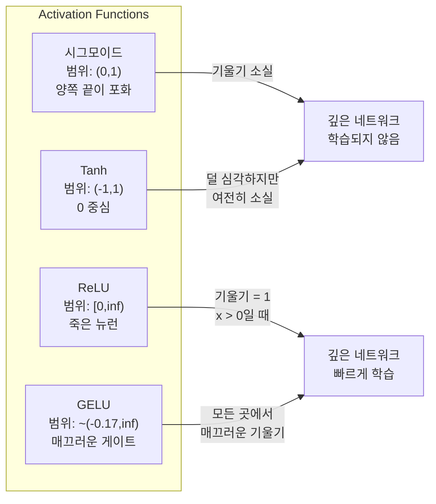
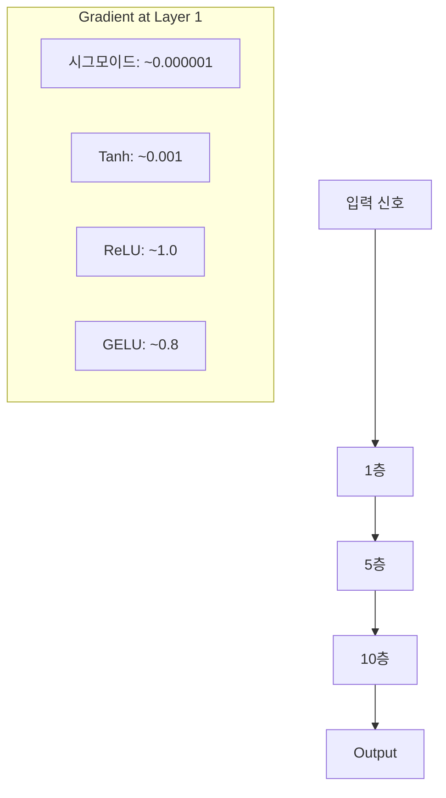
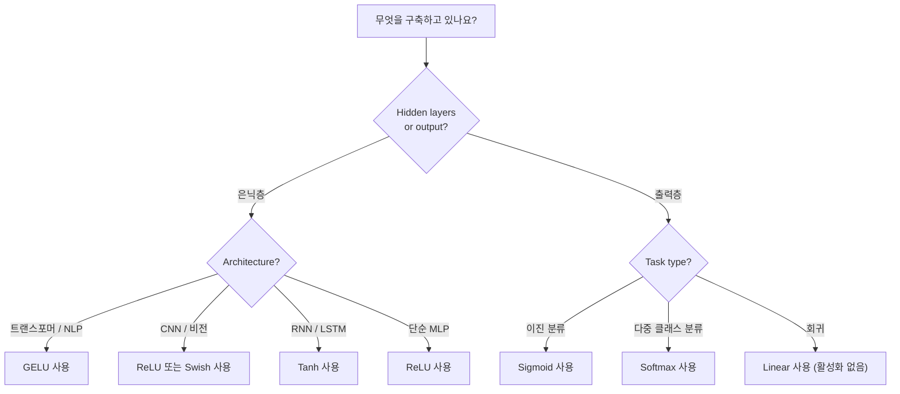

# 활성화 함수(Activation Functions)

> 비선형성이 없다면, 100층 네트워크는 단순한 행렬 곱셈에 불과합니다. 활성화 함수는 신경망이 곡선으로 사고할 수 있게 해주는 게이트입니다.

**유형:** Build
**언어:** Python
**선수 요건:** 03-03강 (역전파(Backpropagation))
**시간:** 약 75분

## 학습 목표

- 시그모이드(sigmoid), tanh, ReLU, Leaky ReLU, GELU, Swish, softmax를 그 도함수까지 직접 구현해 보세요
- 10층 이상의 네트워크에서 서로 다른 활성화 함수를 사용하여 활성화 값의 크기를 측정함으로써 기울기 소실(vanishing gradient) 문제를 진단해 보세요
- ReLU 네트워크에서 죽은 뉴런(dead neurons)을 감지하고, GELU가 이 실패 모드(failure mode)를 피하는 이유를 설명해 보세요
- 주어진 아키텍처(트랜스포머(transformer), CNN, RNN, 출력층)에 적합한 활성화 함수를 선택해 보세요

## 문제점

두 개의 선형 변환을 쌓아 보세요: y = W2(W1x + b1) + b2. 이를 전개하면 y = W2W1x + W2b1 + b2가 됩니다. 이는 결국 y = Ax + c, 즉 하나의 선형 변환에 불과합니다. 선형 레이어를 아무리 많이 쌓아도 결과는 하나의 행렬 곱셈으로 축소됩니다. 100층 네트워크는 단일 레이어와 동일한 표현력을 가집니다.

이것은 단순한 이론적 호기심이 아닙니다. 깊은 선형 네트워크는 XOR를 학습할 수 없고, 나선형(spiral) 데이터셋을 분류할 수 없으며, 얼굴을 인식할 수 없다는 것을 의미합니다. 활성화 함수가 없다면 깊이는 환상에 불과합니다.

활성화 함수는 선형성을 깨뜨립니다. 각 레이어의 출력을 비선형 함수를 통해 왜곡하여, 네트워크가 결정 경계를 휘게 하고 임의의 함수를 근사하며 실제로 학습할 수 있는 능력을 부여합니다. 하지만 활성화 함수를 잘못 선택하면 기울기가 0으로 소실되거나(깊은 네트워크에서의 시그모이드(sigmoid)), 무한대로 폭발하거나(신중한 초기화 없이 무한대 활성화 함수 사용), 뉴런이 영구적으로 죽습니다(큰 음의 편향을 가진 ReLU). 활성화 함수의 선택은 네트워크가 학습을 할 수 있는지 여부를 직접적으로 결정합니다.

## 개념

### 비선형성이 필요한 이유

행렬 곱셈은 합성 가능합니다. 벡터에 행렬 A를 곱한 후 행렬 B를 곱하는 것은 AB를 곱하는 것과 동일합니다. 이는 10개의 선형 레이어를 쌓는 것이 하나의 큰 행렬을 가진 단일 선형 레이어와 수학적으로 동등하다는 의미입니다. 모든 파라미터와 모든 깊이가 -- 낭비됩니다. 체인을 끊을 무언가가 필요합니다. 활성화 함수(Activation Function)가 바로 그 역할을 합니다.

증명입니다. 선형 레이어는 f(x) = Wx + b를 계산합니다. 두 개를 쌓으면:

```
Layer 1: h = W1 * x + b1
Layer 2: y = W2 * h + b2
```

대입하면:

```
y = W2 * (W1 * x + b1) + b2
y = (W2 * W1) * x + (W2 * b1 + b2)
y = A * x + c
```

하나의 레이어가 됩니다. 레이어 사이에 비선형 활성화 g()를 삽입하면:

```
h = g(W1 * x + b1)
y = W2 * h + b2
```

이제 대입이 깨집니다. W2 * g(W1 * x + b1) + b2는 단일 선형 변환으로 축소될 수 없습니다. 네트워크는 비선형 함수를 표현할 수 있습니다. 활성화 함수가 있는 추가 레이어는 표현 용량을 증가시킵니다.

### 시그모이드(Sigmoid)

신경망의 원래 활성화 함수입니다.

```
sigmoid(x) = 1 / (1 + e^(-x))
```

출력 범위: (0, 1). 매끄럽고 미분 가능하며, 모든 실수를 확률과 유사한 값으로 매핑합니다.

미분값:

```
sigmoid'(x) = sigmoid(x) * (1 - sigmoid(x))
```

이 미분값의 최대값은 x = 0에서 0.25입니다. 역전파(Backpropagation)에서 기울기는 레이어를 통해 곱해집니다. 10개의 시그모이드 레이어는 기울기가 최대 0.25번 곱해집니다:

```
0.25^10 = 0.000000953674
```

원래 신호의 백만분의 일 미만입니다. 이것이 소실되는 기울기(vanishing gradient) 문제입니다. 초기 레이어의 기울기가 너무 작아져 가중치가 거의 업데이트되지 않습니다. 네트워크는 학습하는 것처럼 보입니다 -- 후기 레이어에서 손실이 감소합니다 -- 하지만 첫 레이어는 얼어붙어 있습니다. 깊은 시그모이드 네트워크는 단순히 학습되지 않습니다.

추가 문제: 시그모이드 출력은 항상 양수(0에서 1)이므로, 가중치에 대한 기울기는 항상 같은 부호를 가집니다. 이는 경사 하강법(Gradient Descent) 동안 지그재그(zig-zagging)를 유발합니다.

### Tanh

시그모이드의 중심화 버전입니다.

```
tanh(x) = (e^x - e^(-x)) / (e^x + e^(-x))
```

출력 범위: (-1, 1). 중심이 0에 위치하여 지그재그 문제를 제거합니다.

미분값:

```
tanh'(x) = 1 - tanh(x)^2
```

최대 미분값은 x = 0에서 1.0입니다 -- 시그모이드보다 4배 더 좋습니다. 하지만 소실되는 기울기 문제는 여전히 존재합니다. 큰 양수 또는 음수 입력에 대해 미분값은 0에 가까워집니다. 10개의 레이어는 여전히 기울기를 압축합니다, 다만 덜 공격적으로 할 뿐입니다.

### ReLU: 돌파구

정류 선형 유닛(Rectified Linear Unit). 2010년 Nair와 Hinton이 딥러닝에 대중화한 이 함수는 (함수 자체는 1969년 Fukushima의 연구로 거슬러 올라갑니다) 모든 것을 바꾸어 놓았습니다.

```
relu(x) = max(0, x)
```

출력 범위: [0, 무한대). 미분은 매우 간단합니다:

```
relu'(x) = 1  if x > 0
            0  if x <= 0
```

양수 입력에 대한 기울기 소실(vanishing gradient)이 없습니다. 기울기는 정확히 1이며, 그대로 전달됩니다. ReLU는 레이어 간에 기울기 크기를 보존하므로 딥 네트워크가 학습 가능해진 이유입니다.

그러나 실패 모드인 죽은 뉴런(dead neuron) 문제가 있습니다. 뉴런의 가중 입력이 항상 음수인 경우 (큰 음수 편향이나 불운한 가중치 초기화 때문에), 출력은 항상 0이고, 기울기는 항상 0이며, 업데이트되지 않습니다. 뉴런은 영구적으로 죽습니다. 실제로 ReLU 네트워크의 뉴런 중 10-40%가 학습 중에 죽을 수 있습니다.

### Leaky ReLU

죽은 뉴런에 대한 가장 단순한 해결책입니다.

```
leaky_relu(x) = x        if x > 0
                alpha * x if x <= 0
```

여기서 alpha는 작은 상수이며, 일반적으로 0.01입니다. 음수 쪽은 0이 아닌 작은 기울기를 가지므로, 죽은 뉴런도 기울기 신호를 받아 회복할 수 있습니다.

### GELU: 현대의 기본값

가우시안 오차 선형 유닛(Gaussian Error Linear Unit). 2016년 Hendrycks와 Gimpel이 도입했습니다. BERT, GPT 및 대부분의 현대 트랜스포머(transformer)의 기본 활성화 함수입니다.

```
gelu(x) = x * Phi(x)
```

여기서 Phi(x)는 표준 정규 분포의 누적 분포 함수입니다. 실무에서 사용되는 근사식은 다음과 같습니다:

```
gelu(x) ~= 0.5 * x * (1 + tanh(sqrt(2/pi) * (x + 0.044715 * x^3)))
```

GELU는 모든 곳에서 매끄럽고, 작은 음수 값을 허용하며 (ReLU가 0으로 강제로 클립하는 것과 다름), 확률적 해석을 가집니다: 가우시안 분포에서 양수일 가능성에 따라 각 입력에 가중치를 부여합니다. 이 매끄러운 게이팅(gating)은 트랜스포머 아키텍처에서 ReLU보다 더 나은 기울기 흐름을 제공하고 죽은 뉴런 문제를 완전히 피하기 때문에 성능이 더 좋습니다.

### Swish / SiLU

2017년 Ramachandran 등이 자동화된 검색을 통해 발견한 자기 게이팅(self-gated) 활성화 함수입니다.

```
swish(x) = x * sigmoid(x)
```

Swish는 형식적으로 x * sigmoid(x)입니다. Google은 활성화 함수 공간에 대한 자동화된 검색을 통해 이를 발견했습니다 -- 신경망이 신경망의 일부 설계를 한 것입니다.

GELU처럼 매끄럽고, 비단조적이며, 작은 음수 값을 허용합니다. 차이는 미묘합니다: Swish는 게이트로 시그모이드를 사용하지만 GELU는 가우시안 CDF를 사용합니다. 실제로는 성능이 거의 동일합니다. Swish는 EfficientNet 및 일부 비전 모델에서 사용되며, GELU는 언어 모델에서 지배적입니다.

### 소프트맥스: 출력 활성화

은닉층에서는 사용되지 않습니다. 소프트맥스는 원시 점수 벡터(로짓)를 확률 분포로 변환합니다.

```
softmax(x_i) = e^(x_i) / sum(e^(x_j) for all j)
```

모든 출력은 00강 1 사이입니다. 모든 출력의 합은 1입니다. 이 특성 때문에 다중 클래스 분류의 표준 최종 활성화 함수로 사용됩니다. 가장 큰 로짓이 가장 높은 확률을 받지만, argmax와 달리 소프트맥스는 미분 가능하며 상대적 신뢰도에 대한 정보를 보존합니다.

### 형태 비교



### 기울기 흐름 비교



### 언제 어떤 활성화 함수를 사용할까



```figure
softmax-temperature
```

## 구현하기

### 1단계: 모든 활성화 함수와 미분 구현하기

각 함수는 단일 float를 입력으로 받아 float를 반환합니다. 각 미분 함수는 동일한 입력을 받아 기울기를 반환합니다.

```python
import math

def sigmoid(x):
    x = max(-500, min(500, x))
    return 1.0 / (1.0 + math.exp(-x))

def sigmoid_derivative(x):
    s = sigmoid(x)
    return s * (1 - s)

def tanh_act(x):
    return math.tanh(x)

def tanh_derivative(x):
    t = math.tanh(x)
    return 1 - t * t

def relu(x):
    return max(0.0, x)

def relu_derivative(x):
    return 1.0 if x > 0 else 0.0

def leaky_relu(x, alpha=0.01):
    return x if x > 0 else alpha * x

def leaky_relu_derivative(x, alpha=0.01):
    return 1.0 if x > 0 else alpha

def gelu(x):
    return 0.5 * x * (1 + math.tanh(math.sqrt(2 / math.pi) * (x + 0.044715 * x ** 3)))

def gelu_derivative(x):
    phi = 0.5 * (1 + math.erf(x / math.sqrt(2)))
    pdf = math.exp(-0.5 * x * x) / math.sqrt(2 * math.pi)
    return phi + x * pdf

def swish(x):
    return x * sigmoid(x)

def swish_derivative(x):
    s = sigmoid(x)
    return s + x * s * (1 - s)

def softmax(xs):
    max_x = max(xs)
    exps = [math.exp(x - max_x) for x in xs]
    total = sum(exps)
    return [e / total for e in exps]
```

### 2단계: 기울기가 소멸하는 위치 시각화하기

-5에서 5까지 균등 간격의 100개 지점에서 기울기를 계산합니다. 각 활성화 함수의 기울기가 0에 가까운 위치를 보여주는 텍스트 히스토그램을 출력합니다.

```python
def gradient_scan(name, derivative_fn, start=-5, end=5, n=100):
    step = (end - start) / n
    near_zero = 0
    healthy = 0
    for i in range(n):
        x = start + i * step
        g = derivative_fn(x)
        if abs(g) < 0.01:
            near_zero += 1
        else:
            healthy += 1
    pct_dead = near_zero / n * 100
    print(f"{name:15s}: {healthy:3d} healthy, {near_zero:3d} near-zero ({pct_dead:.0f}% dead zone)")

gradient_scan("Sigmoid", sigmoid_derivative)
gradient_scan("Tanh", tanh_derivative)
gradient_scan("ReLU", relu_derivative)
gradient_scan("Leaky ReLU", leaky_relu_derivative)
gradient_scan("GELU", gelu_derivative)
gradient_scan("Swish", swish_derivative)
```

### 3단계: 기울기 소멸 실험

신호를 N개의 레이어를 통해 순전파하며 sigmoid와 ReLU를 비교합니다. 활성화 크기가 어떻게 변하는지 측정합니다.

```python
import random

def vanishing_gradient_experiment(activation_fn, name, n_layers=10, n_inputs=5):
    random.seed(42)
    values = [random.gauss(0, 1) for _ in range(n_inputs)]

    print(f"\n{name} through {n_layers} layers:")
    for layer in range(n_layers):
        weights = [random.gauss(0, 1) for _ in range(n_inputs)]
        z = sum(w * v for w, v in zip(weights, values))
        activated = activation_fn(z)
        magnitude = abs(activated)
        bar = "#" * int(magnitude * 20)
        print(f"  Layer {layer+1:2d}: magnitude = {magnitude:.6f} {bar}")
        values = [activated] * n_inputs

vanishing_gradient_experiment(sigmoid, "Sigmoid")
vanishing_gradient_experiment(relu, "ReLU")
vanishing_gradient_experiment(gelu, "GELU")
```

### 4단계: 죽은 뉴런 탐지

ReLU 네트워크를 생성하고, 랜덤 입력을 통과시켜 뉴런이 발화하지 않는 횟수를 세어보세요.

```python
def dead_neuron_detector(n_inputs=5, hidden_size=20, n_samples=1000):
    random.seed(0)
    weights = [[random.gauss(0, 1) for _ in range(n_inputs)] for _ in range(hidden_size)]
    biases = [random.gauss(0, 1) for _ in range(hidden_size)]

    fire_counts = [0] * hidden_size

    for _ in range(n_samples):
        inputs = [random.gauss(0, 1) for _ in range(n_inputs)]
        for neuron_idx in range(hidden_size):
            z = sum(w * x for w, x in zip(weights[neuron_idx], inputs)) + biases[neuron_idx]
            if relu(z) > 0:
                fire_counts[neuron_idx] += 1

    dead = sum(1 for c in fire_counts if c == 0)
    rarely_fire = sum(1 for c in fire_counts if 0 < c < n_samples * 0.05)
    healthy = hidden_size - dead - rarely_fire

    print(f"\nDead Neuron Report ({hidden_size} neurons, {n_samples} samples):")
    print(f"  Dead (never fired):     {dead}")
    print(f"  Barely alive (<5%):     {rarely_fire}")
    print(f"  Healthy:                {healthy}")
    print(f"  Dead neuron rate:       {dead/hidden_size*100:.1f}%")

    for i, c in enumerate(fire_counts):
        status = "DEAD" if c == 0 else "WEAK" if c < n_samples * 0.05 else "OK"
        bar = "#" * (c * 40 // n_samples)
        print(f"  Neuron {i:2d}: {c:4d}/{n_samples} fires [{status:4s}] {bar}")

dead_neuron_detector()
```

### 5단계: 학습 비교 -- Sigmoid vs ReLU vs GELU

세 가지 다른 활성화 함수를 사용하여 원형 데이터셋(원 내부 점 = 클래스 1, 외부 점 = 클래스 0)에 동일한 두 레이어 네트워크를 학습합니다. 수렴 속도를 비교합니다.

```python
def make_circle_data(n=200, seed=42):
    random.seed(seed)
    data = []
    for _ in range(n):
        x = random.uniform(-2, 2)
        y = random.uniform(-2, 2)
        label = 1.0 if x * x + y * y < 1.5 else 0.0
        data.append(([x, y], label))
    return data


class ActivationNetwork:
    def __init__(self, activation_fn, activation_deriv, hidden_size=8, lr=0.1):
        random.seed(0)
        self.act = activation_fn
        self.act_d = activation_deriv
        self.lr = lr
        self.hidden_size = hidden_size

        self.w1 = [[random.gauss(0, 0.5) for _ in range(2)] for _ in range(hidden_size)]
        self.b1 = [0.0] * hidden_size
        self.w2 = [random.gauss(0, 0.5) for _ in range(hidden_size)]
        self.b2 = 0.0

    def forward(self, x):
        self.x = x
        self.z1 = []
        self.h = []
        for i in range(self.hidden_size):
            z = self.w1[i][0] * x[0] + self.w1[i][1] * x[1] + self.b1[i]
            self.z1.append(z)
            self.h.append(self.act(z))

        self.z2 = sum(self.w2[i] * self.h[i] for i in range(self.hidden_size)) + self.b2
        self.out = sigmoid(self.z2)
        return self.out

    def backward(self, target):
        error = self.out - target
        d_out = error * self.out * (1 - self.out)

        for i in range(self.hidden_size):
            d_h = d_out * self.w2[i] * self.act_d(self.z1[i])
            self.w2[i] -= self.lr * d_out * self.h[i]
            for j in range(2):
                self.w1[i][j] -= self.lr * d_h * self.x[j]
            self.b1[i] -= self.lr * d_h
        self.b2 -= self.lr * d_out

    def train(self, data, epochs=200):
        losses = []
        for epoch in range(epochs):
            total_loss = 0
            correct = 0
            for x, y in data:
                pred = self.forward(x)
                self.backward(y)
                total_loss += (pred - y) ** 2
                if (pred >= 0.5) == (y >= 0.5):
                    correct += 1
            avg_loss = total_loss / len(data)
            accuracy = correct / len(data) * 100
            losses.append(avg_loss)
            if epoch % 50 == 0 or epoch == epochs - 1:
                print(f"    Epoch {epoch:3d}: loss={avg_loss:.4f}, accuracy={accuracy:.1f}%")
        return losses


data = make_circle_data()

configs = [
    ("Sigmoid", sigmoid, sigmoid_derivative),
    ("ReLU", relu, relu_derivative),
    ("GELU", gelu, gelu_derivative),
]

results = {}
for name, act_fn, act_d_fn in configs:
    print(f"\n=== Training with {name} ===")
    net = ActivationNetwork(act_fn, act_d_fn, hidden_size=8, lr=0.1)
    losses = net.train(data, epochs=200)
    results[name] = losses

print("\n=== Final Loss Comparison ===")
for name, losses in results.items():
    print(f"  {name:10s}: start={losses[0]:.4f} -> end={losses[-1]:.4f} (improvement: {(1 - losses[-1]/losses[0])*100:.1f}%)")
```

## 사용하기

PyTorch는 이 모든 함수를 함수형 및 모듈형으로 제공합니다:

```python
import torch
import torch.nn as nn
import torch.nn.functional as F

x = torch.randn(4, 10)

relu_out = F.relu(x)
gelu_out = F.gelu(x)
sigmoid_out = torch.sigmoid(x)
swish_out = F.silu(x)

logits = torch.randn(4, 5)
probs = F.softmax(logits, dim=1)

model = nn.Sequential(
    nn.Linear(10, 64),
    nn.GELU(),
    nn.Linear(64, 32),
    nn.GELU(),
    nn.Linear(32, 5),
)
```

트랜스포머의 숨겨진 레이어: GELU. CNN의 숨겨진 레이어: ReLU. 분류용 출력 레이어: softmax. 회귀용 출력 레이어: 없음 (linear). 확률용 출력 레이어: sigmoid. 이것이 전부입니다. 이 기본값으로 시작하세요. 증거가 있을 때만 변경하세요.

RNN과 LSTM은 숨겨진 상태에 tanh를, 게이트에 sigmoid를 사용하지만, 오늘날 처음부터 구축한다면 RNN을 사용하지 않을 가능성이 높습니다. ReLU 네트워크에서 뉴런이 죽는다면 GELU로 전환하세요. 특별한 이유가 없는 한 Leaky ReLU를 사용하지 마세요. GELU는 죽은 뉴런 문제를 해결하고 더 나은 기울기 흐름을 제공합니다.

## 출시하기

이 강의는 다음을 생성합니다:
- `outputs/prompt-activation-selector.md` -- 모든 아키텍처에 적합한 활성화 함수를 선택하는 데 도움이 되는 재사용 가능한 프롬프트

## 연습 문제

1. 음의 기울기 alpha가 학습 가능한 매개변수인 매개변수적 ReLU(PReLU)를 구현해 보세요. 원(circle) 데이터셋으로 학습하고 고정된 Leaky ReLU와 비교해 보세요.

2. 10층 대신 50층으로 소실 기울기 실험을 실행해 보세요. sigmoid, tanh, ReLU, GELU의 각 층에서의 크기를 플롯해 보세요. 각 활성화 함수의 신호가 실제로 0에 도달하는 층은 어디인가요?

3. ELU (Exponential Linear Unit)를 구현해 보세요: elu(x) = x if x > 0, alpha * (e^x - 1) if x <= 0. 동일한 네트워크에서 ReLU와 비교하여 죽은 뉴런 비율을 비교해 보세요.

4. 학습 중에 실행되는 "기울기 건강 모니터"를 구축해 보세요: 각 에포크(epoch)에서 각 층의 평균 기울기 크기를 계산합니다. 어떤 층의 기울기가 0.001 미만으로 떨어지거나 100을 초과하면 경고 메시지를 출력합니다.

5. 원(circle) 대신 01강의 XOR 데이터셋을 사용하여 학습 비교를 수정해 보세요. XOR에서 가장 빠르게 수렴하는 활성화 함수는 무엇인가요? 왜 원(circle) 결과와 다른가요?

## 핵심 용어

| 용어 | 사람들이 말하는 것 | 실제 의미 |
|------|----------------|----------------------|
| 활성화 함수(Activation Function) | "비선형 부분" | 각 뉴런의 출력에 적용되어 선형성을 깨고 네트워크가 비선형 매핑을 학습할 수 있게 하는 함수 |
| 소실 기울기(Vanishing Gradient) | "깊은 네트워크에서 기울기가 사라진다" | 활성화 함수의 도함수가 1보다 작을 때 기울기가 층을 거치며 지수적으로 감소하여 초기 층을 학습할 수 없게 만드는 현상 |
| 폭발 기울기(Exploding Gradient) | "기울기가 폭발한다" | 유효 곱셈 인자가 1을 초과할 때 기울기가 층을 거치며 지수적으로 증가하여 불안정한 학습을 유발하는 현상 |
| 죽은 뉴런(Dead Neuron) | "학습을 멈춘 뉴런" | 입력이 영구적으로 음수인 ReLU 뉴런으로, 출력과 기울기가 모두 0이 된다 |
| 시그모이드(Sigmoid) | "값을 0-1로 압축한다" | 로지스틱 함수 1/(1+e^-x)로, 역사적으로 중요하지만 깊은 네트워크에서 소실 기울기를 유발한다 |
| ReLU | "음수를 0으로 클리핑한다" | max(0, x) -- 기울기 크기를 보존하여 딥러닝을 실용적으로 만든 활성화 함수 |
| GELU | "트랜스포머 활성화 함수" | Gaussian Error Linear Unit, 입력을 양수일 확률에 따라 가중치를 부여하는 매끄러운 활성화 함수 |
| Swish/SiLU | "자기 게이트 ReLU" | x * sigmoid(x), 자동화된 검색을 통해 발견되었으며 EfficientNet에서 사용됨 |
| Softmax | "점수를 확률로 변환" | 로짓 벡터를 모든 값이 (0,1) 범위에 있고 합이 1인 확률 분포로 정규화 |
| Leaky ReLU | "죽지 않는 ReLU" | max(alpha*x, x)이며 alpha는 작은 값(0.01)으로, 작은 음수 기울기를 허용하여 죽은 뉴런을 방지 |
| 포화(Saturation) | "시그모이드의 평평한 부분" | 활성화 함수의 미분값이 0에 가까워져 기울기 흐름을 차단하는 영역 |
| 로짓(Logit) | "softmax 이전의 원시 점수" | softmax나 sigmoid를 적용하기 전 최종 계층의 비정규화 출력 |

## 추가 읽기

- Nair & Hinton, "Rectified Linear Units Improve Restricted Boltzmann Machines" (2010) -- ReLU를 도입하고 심층 네트워크 훈련을 가능하게 한 논문
- Hendrycks & Gimpel, "Gaussian Error Linear Units (GELUs)" (2016) -- 트랜스포머의 기본 활성화 함수가 된 함수를 도입
- Ramachandran et al., "Searching for Activation Functions" (2017) -- 자동화된 검색을 통해 Swish를 발견하여 활성화 함수 설계가 자동화될 수 있음을 보여줌
- Glorot & Bengio, "Understanding the difficulty of training deep feedforward neural networks" (2010) -- 소멸/폭발 기울기를 진단하고 Xavier 초기화를 제안한 논문
- Goodfellow, Bengio, Courville, "Deep Learning" Chapter 6.3 (https://www.deeplearningbook.org/) -- 은닉 유닛과 활성화 함수에 대한 엄밀한 처리
