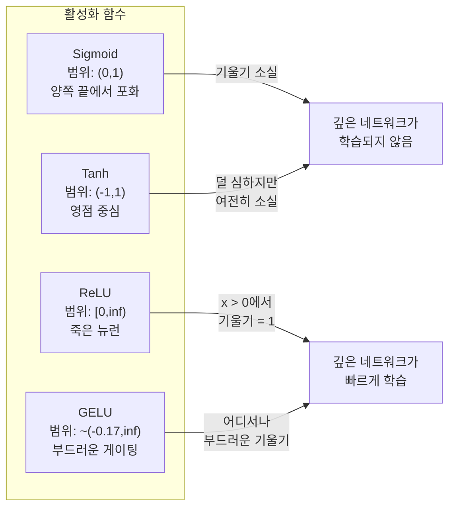
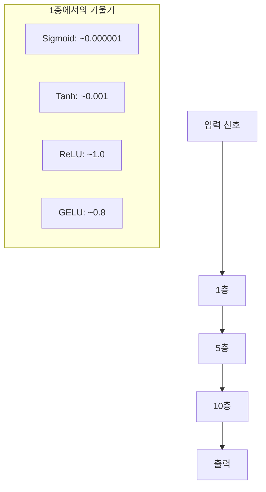
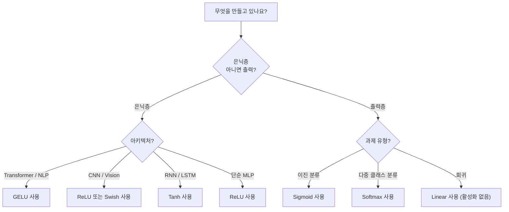

# 활성화 함수 (Activation Functions)

> 비선형성이 없으면 100층 네트워크도 화려한 행렬 곱셈일 뿐입니다. 활성화 함수는 신경망이 곡선으로 생각하게 하는 게이트입니다.

**Type:** Build
**Languages:** Python
**Prerequisites:** Lesson 03.03 (Backpropagation)
**Time:** ~75 minutes

## 학습 목표 (Learning Objectives)

- sigmoid, tanh, ReLU, Leaky ReLU, GELU, Swish, softmax와 그 도함수를 처음부터 구현합니다
- 서로 다른 활성화로 10층 이상에서 활성화 크기를 측정해 기울기 소실(vanishing gradient) 문제를 진단합니다
- ReLU 네트워크의 죽은 뉴런(dead neurons)을 감지하고, GELU가 이 실패 모드를 피하는 이유를 설명합니다
- 주어진 아키텍처(transformer, CNN, RNN, 출력층)에 맞는 활성화 함수를 선택합니다

## 문제 상황 (The Problem)

선형 변환 두 개를 쌓아 봅시다: y = W2(W1x + b1) + b2. 전개하면: y = W2W1x + W2b1 + b2. 결국 y = Ax + c — 단일 선형 변환입니다. 선형 층을 아무리 많이 쌓아도 결과는 하나의 행렬 곱으로 붕괴합니다. 100층 네트워크의 표현력이 단일 층과 같습니다.

이건 이론적 호기심이 아닙니다. 깊은 선형 네트워크는 XOR을 학습할 수 없고, 나선 데이터셋을 분류할 수 없으며, 얼굴을 인식할 수 없다는 뜻입니다. 활성화 함수 없이는 깊이가 환상입니다.

활성화 함수는 선형성을 깨뜨립니다. 각 층의 출력을 비선형 함수로 왜곡해, 네트워크가 결정 경계를 구부리고, 임의의 함수를 근사하고, 실제로 학습할 수 있게 합니다. 하지만 잘못된 활성화를 고르면 기울기가 0으로 소실되고(깊은 네트워크의 sigmoid), 무한대로 폭발하며(신중한 초기화 없는 비유계 활성화), 또는 뉴런이 영구적으로 죽습니다(큰 음수 편향의 ReLU). 활성화 함수 선택이 네트워크가 학습할지 여부를 직접 결정합니다.

## 핵심 개념 (The Concept)

### 비선형성이 필요한 이유

행렬 곱셈은 합성 가능합니다. 벡터에 행렬 A를 곱한 뒤 행렬 B를 곱하는 것은 AB를 곱하는 것과 동일합니다. 즉 선형 층 열 개를 쌓는 것은 큰 행렬 하나의 선형 층과 수학적으로 동등합니다. 그 모든 파라미터, 그 모든 깊이 — 낭비입니다. 체인을 끊을 무언가가 필요합니다. 그게 활성화 함수입니다.

증명입니다. 선형 층은 f(x) = Wx + b를 계산합니다. 두 개를 쌓으면:

```
Layer 1: h = W1 * x + b1
Layer 2: y = W2 * h + b2
```

대입:

```
y = W2 * (W1 * x + b1) + b2
y = (W2 * W1) * x + (W2 * b1 + b2)
y = A * x + c
```

한 층입니다. 층 사이에 비선형 활성화 g()를 넣으면:

```
h = g(W1 * x + b1)
y = W2 * h + b2
```

이제 대입이 깨집니다. W2 * g(W1 * x + b1) + b2는 단일 선형 변환으로 줄일 수 없습니다. 네트워크가 비선형 함수를 표현할 수 있습니다. 활성화가 있는 층이 추가될 때마다 표현 용량이 늘어납니다.

### Sigmoid

신경망의 원래 활성화 함수입니다.

```
sigmoid(x) = 1 / (1 + e^(-x))
```

출력 범위: (0, 1). 매끄럽고, 미분 가능하며, 임의의 실수를 확률 같은 값으로 매핑합니다.

도함수:

```
sigmoid'(x) = sigmoid(x) * (1 - sigmoid(x))
```

이 도함수의 최댓값은 x = 0에서 0.25입니다. 역전파에서 기울기는 층을 따라 곱해집니다. sigmoid 열 층이면 기울기가 최대 0.25를 열 번 곱합니다:

```
0.25^10 = 0.000000953674
```

원래 신호의 백만 분의 일 미만. 이것이 기울기 소실 문제입니다. 초기 층의 기울기가 너무 작아 가중치가 거의 갱신되지 않습니다. 네트워크는 학습하는 것처럼 보입니다 — 후반 층에서 손실이 줄어듭니다 — 하지만 첫 층들은 동결됩니다. 깊은 sigmoid 네트워크는 단순히 학습되지 않습니다.

추가 문제: sigmoid 출력은 항상 양수(0에서 1)이므로, 가중치에 대한 기울기 부호가 항상 같습니다. 이는 경사 하강 중 지그재그를 유발합니다.

### Tanh

sigmoid의 중심화된 버전입니다.

```
tanh(x) = (e^x - e^(-x)) / (e^x + e^(-x))
```

출력 범위: (-1, 1). 영점 중심(zero-centered)이라 지그재그 문제를 제거합니다.

도함수:

```
tanh'(x) = 1 - tanh(x)^2
```

최대 도함수는 x = 0에서 1.0 — sigmoid보다 네 배 낫습니다. 하지만 기울기 소실 문제는 여전히 있습니다. 큰 양수 또는 음수 입력에서 도함수는 0에 접근합니다. 열 층이어도 기울기를 짓누르며, 다만 덜 공격적일 뿐입니다.

### ReLU: 돌파구

Rectified Linear Unit. 2010년 Nair와 Hinton이 딥러닝에 대중화했고(함수 자체는 Fukushima의 1969년 작업으로 거슬러 올라갑니다), 모든 것을 바꿨습니다.

```
relu(x) = max(0, x)
```

출력 범위: [0, infinity). 도함수는 극도로 단순합니다:

```
relu'(x) = 1  if x > 0
            0  if x <= 0
```

양수 입력에서는 기울기 소실이 없습니다. 기울기는 정확히 1이며, 그대로 통과합니다. 깊은 네트워크가 학습 가능해진 이유입니다 — ReLU는 층에 걸쳐 기울기 크기를 보존합니다.

하지만 실패 모드가 있습니다: 죽은 뉴런 문제. 뉴런의 가중 입력이 항상 음수이면(큰 음수 편향이나 불운한 가중치 초기화로), 출력은 항상 0, 기울기도 항상 0, 갱신도 없습니다. 영구적으로 죽은 것입니다. 실무에서 ReLU 네트워크의 뉴런 10-40%가 학습 중 죽을 수 있습니다.

### Leaky ReLU

죽은 뉴런에 대한 가장 단순한 수정입니다.

```
leaky_relu(x) = x        if x > 0
                alpha * x if x <= 0
```

여기서 alpha는 작은 상수, 보통 0.01입니다. 음수 쪽에 0 대신 작은 기울기가 있어, 죽은 뉴런도 기울기 신호를 받고 회복할 수 있습니다.

### GELU: 현대의 기본값

Gaussian Error Linear Unit. 2016년 Hendrycks와 Gimpel이 도입. BERT, GPT, 대부분의 현대 transformer에서 기본 활성화입니다.

```
gelu(x) = x * Phi(x)
```

여기서 Phi(x)는 표준 정규 분포의 누적 분포 함수입니다. 실무에서 쓰는 근사:

```
gelu(x) ~= 0.5 * x * (1 + tanh(sqrt(2/pi) * (x + 0.044715 * x^3)))
```

GELU는 어디서나 매끄럽고, 작은 음수 값을 허용하며(0으로 강하게 자르는 ReLU와 달리), 확률적 해석이 있습니다: 가우시안 분포 아래에서 양수일 가능성으로 각 입력을 가중합니다. 이 부드러운 게이팅은 transformer 아키텍처에서 ReLU보다 나은데, 더 나은 기울기 흐름을 제공하고 죽은 뉴런 문제를 완전히 피하기 때문입니다.

### Swish / SiLU

2017년 Ramachandran 등이 자동 탐색으로 발견한 자기 게이트(self-gated) 활성화입니다.

```
swish(x) = x * sigmoid(x)
```

Swish는 형식적으로 x * sigmoid(x)입니다. Google이 활성화 함수 공간을 자동 탐색해 발견했습니다 — 신경망이 신경망의 일부를 설계한 것입니다.

GELU처럼 매끄럽고, 비단조적이며, 작은 음수 값을 허용합니다. 차이는 미묘합니다: Swish는 게이팅에 sigmoid를, GELU는 가우시안 CDF를 씁니다. 실무에서 성능은 거의 동일합니다. Swish는 EfficientNet과 일부 비전 모델에 쓰입니다. 언어 모델에서는 GELU가 지배적입니다.

### Softmax: 출력 활성화

은닉층에는 쓰지 않습니다. Softmax는 원시 점수(logits) 벡터를 확률 분포로 변환합니다.

```
softmax(x_i) = e^(x_i) / sum(e^(x_j) for all j)
```

모든 출력이 0과 1 사이입니다. 모든 출력의 합은 1입니다. 그래서 다중 클래스 분류의 표준 최종 활성화입니다. 가장 큰 logit이 가장 높은 확률을 받지만, argmax와 달리 softmax는 미분 가능하고 상대적 신뢰도에 대한 정보를 보존합니다.

### 형태 비교



### 기울기 흐름 비교



### 언제 어떤 활성화



```figure
softmax-temperature
```

## 직접 만들기 (Build It)

### 1단계: 모든 활성화 함수와 도함수 구현

각 함수는 float 하나를 받아 float를 반환합니다. 각 도함수도 같은 입력을 받아 기울기를 반환합니다.

```python
import math

def sigmoid(x):
    x = max(-500, min(500, x))
    return 1.0 / (1.0 + math.exp(-x))

def sigmoid_derivative(x):
    s = sigmoid(x)
    return s * (1 - s)

def tanh_act(x):
    return math.tanh(x)

def tanh_derivative(x):
    t = math.tanh(x)
    return 1 - t * t

def relu(x):
    return max(0.0, x)

def relu_derivative(x):
    return 1.0 if x > 0 else 0.0

def leaky_relu(x, alpha=0.01):
    return x if x > 0 else alpha * x

def leaky_relu_derivative(x, alpha=0.01):
    return 1.0 if x > 0 else alpha

def gelu(x):
    return 0.5 * x * (1 + math.tanh(math.sqrt(2 / math.pi) * (x + 0.044715 * x ** 3)))

def gelu_derivative(x):
    phi = 0.5 * (1 + math.erf(x / math.sqrt(2)))
    pdf = math.exp(-0.5 * x * x) / math.sqrt(2 * math.pi)
    return phi + x * pdf

def swish(x):
    return x * sigmoid(x)

def swish_derivative(x):
    s = sigmoid(x)
    return s + x * s * (1 - s)

def softmax(xs):
    max_x = max(xs)
    exps = [math.exp(x - max_x) for x in xs]
    total = sum(exps)
    return [e / total for e in exps]
```

### 2단계: 기울기가 죽는 곳 시각화

-5에서 5까지 균등 간격 100점에서 기울기를 계산합니다. 각 활성화의 기울기가 0에 가까운 곳을 텍스트 히스토그램으로 출력합니다.

```python
def gradient_scan(name, derivative_fn, start=-5, end=5, n=100):
    step = (end - start) / n
    near_zero = 0
    healthy = 0
    for i in range(n):
        x = start + i * step
        g = derivative_fn(x)
        if abs(g) < 0.01:
            near_zero += 1
        else:
            healthy += 1
    pct_dead = near_zero / n * 100
    print(f"{name:15s}: {healthy:3d} healthy, {near_zero:3d} near-zero ({pct_dead:.0f}% dead zone)")

gradient_scan("Sigmoid", sigmoid_derivative)
gradient_scan("Tanh", tanh_derivative)
gradient_scan("ReLU", relu_derivative)
gradient_scan("Leaky ReLU", leaky_relu_derivative)
gradient_scan("GELU", gelu_derivative)
gradient_scan("Swish", swish_derivative)
```

### 3단계: 기울기 소실 실험

sigmoid vs ReLU로 N층을 통해 신호를 순전파합니다. 활성화 크기가 어떻게 바뀌는지 측정합니다.

```python
import random

def vanishing_gradient_experiment(activation_fn, name, n_layers=10, n_inputs=5):
    random.seed(42)
    values = [random.gauss(0, 1) for _ in range(n_inputs)]

    print(f"\n{name} through {n_layers} layers:")
    for layer in range(n_layers):
        weights = [random.gauss(0, 1) for _ in range(n_inputs)]
        z = sum(w * v for w, v in zip(weights, values))
        activated = activation_fn(z)
        magnitude = abs(activated)
        bar = "#" * int(magnitude * 20)
        print(f"  Layer {layer+1:2d}: magnitude = {magnitude:.6f} {bar}")
        values = [activated] * n_inputs

vanishing_gradient_experiment(sigmoid, "Sigmoid")
vanishing_gradient_experiment(relu, "ReLU")
vanishing_gradient_experiment(gelu, "GELU")
```

### 4단계: 죽은 뉴런 감지기

ReLU 네트워크를 만들고, 무작위 입력을 통과시킨 뒤, 한 번도 발화하지 않는 뉴런 수를 셉니다.

```python
def dead_neuron_detector(n_inputs=5, hidden_size=20, n_samples=1000):
    random.seed(0)
    weights = [[random.gauss(0, 1) for _ in range(n_inputs)] for _ in range(hidden_size)]
    biases = [random.gauss(0, 1) for _ in range(hidden_size)]

    fire_counts = [0] * hidden_size

    for _ in range(n_samples):
        inputs = [random.gauss(0, 1) for _ in range(n_inputs)]
        for neuron_idx in range(hidden_size):
            z = sum(w * x for w, x in zip(weights[neuron_idx], inputs)) + biases[neuron_idx]
            if relu(z) > 0:
                fire_counts[neuron_idx] += 1

    dead = sum(1 for c in fire_counts if c == 0)
    rarely_fire = sum(1 for c in fire_counts if 0 < c < n_samples * 0.05)
    healthy = hidden_size - dead - rarely_fire

    print(f"\nDead Neuron Report ({hidden_size} neurons, {n_samples} samples):")
    print(f"  Dead (never fired):     {dead}")
    print(f"  Barely alive (<5%):     {rarely_fire}")
    print(f"  Healthy:                {healthy}")
    print(f"  Dead neuron rate:       {dead/hidden_size*100:.1f}%")

    for i, c in enumerate(fire_counts):
        status = "DEAD" if c == 0 else "WEAK" if c < n_samples * 0.05 else "OK"
        bar = "#" * (c * 40 // n_samples)
        print(f"  Neuron {i:2d}: {c:4d}/{n_samples} fires [{status:4s}] {bar}")

dead_neuron_detector()
```

### 5단계: 학습 비교 — Sigmoid vs ReLU vs GELU

원 데이터셋(원 안 점 = 클래스 1, 바깥 = 클래스 0)에서 같은 두 층 네트워크를 세 가지 활성화로 학습합니다. 수렴 속도를 비교합니다.

```python
def make_circle_data(n=200, seed=42):
    random.seed(seed)
    data = []
    for _ in range(n):
        x = random.uniform(-2, 2)
        y = random.uniform(-2, 2)
        label = 1.0 if x * x + y * y < 1.5 else 0.0
        data.append(([x, y], label))
    return data


class ActivationNetwork:
    def __init__(self, activation_fn, activation_deriv, hidden_size=8, lr=0.1):
        random.seed(0)
        self.act = activation_fn
        self.act_d = activation_deriv
        self.lr = lr
        self.hidden_size = hidden_size

        self.w1 = [[random.gauss(0, 0.5) for _ in range(2)] for _ in range(hidden_size)]
        self.b1 = [0.0] * hidden_size
        self.w2 = [random.gauss(0, 0.5) for _ in range(hidden_size)]
        self.b2 = 0.0

    def forward(self, x):
        self.x = x
        self.z1 = []
        self.h = []
        for i in range(self.hidden_size):
            z = self.w1[i][0] * x[0] + self.w1[i][1] * x[1] + self.b1[i]
            self.z1.append(z)
            self.h.append(self.act(z))

        self.z2 = sum(self.w2[i] * self.h[i] for i in range(self.hidden_size)) + self.b2
        self.out = sigmoid(self.z2)
        return self.out

    def backward(self, target):
        error = self.out - target
        d_out = error * self.out * (1 - self.out)

        for i in range(self.hidden_size):
            d_h = d_out * self.w2[i] * self.act_d(self.z1[i])
            self.w2[i] -= self.lr * d_out * self.h[i]
            for j in range(2):
                self.w1[i][j] -= self.lr * d_h * self.x[j]
            self.b1[i] -= self.lr * d_h
        self.b2 -= self.lr * d_out

    def train(self, data, epochs=200):
        losses = []
        for epoch in range(epochs):
            total_loss = 0
            correct = 0
            for x, y in data:
                pred = self.forward(x)
                self.backward(y)
                total_loss += (pred - y) ** 2
                if (pred >= 0.5) == (y >= 0.5):
                    correct += 1
            avg_loss = total_loss / len(data)
            accuracy = correct / len(data) * 100
            losses.append(avg_loss)
            if epoch % 50 == 0 or epoch == epochs - 1:
                print(f"    Epoch {epoch:3d}: loss={avg_loss:.4f}, accuracy={accuracy:.1f}%")
        return losses


data = make_circle_data()

configs = [
    ("Sigmoid", sigmoid, sigmoid_derivative),
    ("ReLU", relu, relu_derivative),
    ("GELU", gelu, gelu_derivative),
]

results = {}
for name, act_fn, act_d_fn in configs:
    print(f"\n=== Training with {name} ===")
    net = ActivationNetwork(act_fn, act_d_fn, hidden_size=8, lr=0.1)
    losses = net.train(data, epochs=200)
    results[name] = losses

print("\n=== Final Loss Comparison ===")
for name, losses in results.items():
    print(f"  {name:10s}: start={losses[0]:.4f} -> end={losses[-1]:.4f} (improvement: {(1 - losses[-1]/losses[0])*100:.1f}%)")
```

## 활용하기 (Use It)

PyTorch는 이들을 함수형과 모듈 형태 모두로 제공합니다:

```python
import torch
import torch.nn as nn
import torch.nn.functional as F

x = torch.randn(4, 10)

relu_out = F.relu(x)
gelu_out = F.gelu(x)
sigmoid_out = torch.sigmoid(x)
swish_out = F.silu(x)

logits = torch.randn(4, 5)
probs = F.softmax(logits, dim=1)

model = nn.Sequential(
    nn.Linear(10, 64),
    nn.GELU(),
    nn.Linear(64, 32),
    nn.GELU(),
    nn.Linear(32, 5),
)
```

transformer의 은닉층: GELU. CNN의 은닉층: ReLU. 분류 출력층: softmax. 회귀 출력층: 없음(linear). 확률 출력층: sigmoid. 그게 전부입니다. 이 기본값으로 시작하세요. 증거가 있을 때만 바꿉니다.

RNN과 LSTM은 은닉 상태에 tanh, 게이트에 sigmoid를 쓰지만, 오늘날 처음부터 만든다면 아마 RNN을 쓰지 않을 것입니다. ReLU 네트워크에서 뉴런이 죽는다면 GELU로 바꾸세요. 특별한 이유가 없으면 Leaky ReLU에 손대지 마세요 — GELU가 죽은 뉴런 문제를 풀고 더 나은 기울기 흐름을 줍니다.

## 산출물 (Ship It)

이 레슨이 만드는 것:
- `outputs/prompt-activation-selector.md` -- 어떤 아키텍처든 맞는 활성화 함수를 고르는 데 쓰는 재사용 프롬프트

## 연습 문제 (Exercises)

1. 음수 쪽 기울기 alpha가 학습 가능한 파라미터인 Parametric ReLU (PReLU)를 구현하세요. 원 데이터셋에서 학습하고 고정 Leaky ReLU와 비교하세요.

2. 기울기 소실 실험을 10층 대신 50층으로 실행하세요. sigmoid, tanh, ReLU, GELU에 대해 각 층의 크기를 플롯하세요. 각 활성화의 신호가 사실상 0에 도달하는 층은 어디인가요?

3. ELU (Exponential Linear Unit)를 구현하세요: elu(x) = x if x > 0, alpha * (e^x - 1) if x <= 0. 같은 네트워크에서 ReLU와 죽은 뉴런 비율을 비교하세요.

4. 학습 중 실행되는 "기울기 건강 모니터"를 만드세요: 각 에폭에서 층별 평균 기울기 크기를 계산합니다. 어떤 층의 기울기가 0.001 아래로 떨어지거나 100을 넘으면 경고를 출력하세요.

5. 학습 비교를 원 대신 Lesson 01의 XOR 데이터셋으로 바꾸세요. XOR에서 어떤 활성화가 가장 빨리 수렴하나요? 원 결과와 다른 이유는 무엇인가요?

## 핵심 용어 (Key Terms)

| Term | What people say | What it actually means |
|------|----------------|----------------------|
| Activation function | "비선형 부분" | 각 뉴런 출력에 적용되어 선형성을 깨뜨리고, 네트워크가 비선형 매핑을 학습하게 하는 함수 |
| Vanishing gradient | "깊은 네트워크에서 기울기가 사라짐" | 활성화 도함수가 1보다 작을 때 기울기가 층을 따라 지수적으로 줄어들어 초기 층이 학습 불가능해짐 |
| Exploding gradient | "기울기가 폭발함" | 유효 배율이 1을 넘을 때 기울기가 층을 따라 지수적으로 커져 학습이 불안정해짐 |
| Dead neuron | "학습을 멈춘 뉴런" | 입력이 영구적으로 음수인 ReLU 뉴런으로, 출력이 0이고 기울기도 0 |
| Sigmoid | "값을 0-1로 눌러 넣음" | 로지스틱 함수 1/(1+e^-x). 역사적으로 중요하지만 깊은 네트워크에서 기울기 소실을 유발 |
| ReLU | "음수를 0으로 자름" | max(0, x) — 기울기 크기를 보존해 딥러닝을 실용적으로 만든 활성화 |
| GELU | "transformer 활성화" | Gaussian Error Linear Unit. 입력이 양수일 확률로 가중하는 부드러운 활성화 |
| Swish/SiLU | "자기 게이트 ReLU" | x * sigmoid(x). 자동 탐색으로 발견, EfficientNet에 사용 |
| Softmax | "점수를 확률로 바꿈" | logit 벡터를 (0,1)이고 합이 1인 확률 분포로 정규화 |
| Leaky ReLU | "죽지 않는 ReLU" | max(alpha*x, x), alpha는 작음(0.01). 작은 음수 기울기를 허용해 죽은 뉴런 방지 |
| Saturation | "sigmoid의 평평한 부분" | 활성화 도함수가 0에 가까워져 기울기 흐름을 막는 영역 |
| Logit | "softmax 전 원시 점수" | softmax나 sigmoid를 적용하기 전 최종 층의 비정규화 출력 |

## 더 읽을거리 (Further Reading)

- Nair & Hinton, "Rectified Linear Units Improve Restricted Boltzmann Machines" (2010) -- ReLU를 도입하고 깊은 네트워크 학습을 가능하게 한 논문
- Hendrycks & Gimpel, "Gaussian Error Linear Units (GELUs)" (2016) -- transformer의 기본이 된 활성화 함수를 도입
- Ramachandran et al., "Searching for Activation Functions" (2017) -- 자동 탐색으로 Swish를 발견해, 활성화 설계가 자동화될 수 있음을 보임
- Glorot & Bengio, "Understanding the difficulty of training deep feedforward neural networks" (2010) -- 기울기 소실/폭발을 진단하고 Xavier 초기화를 제안한 논문
- Goodfellow, Bengio, Courville, "Deep Learning" Chapter 6.3 (https://www.deeplearningbook.org/) -- 은닉 유닛과 활성화 함수에 대한 엄밀한 다루기
