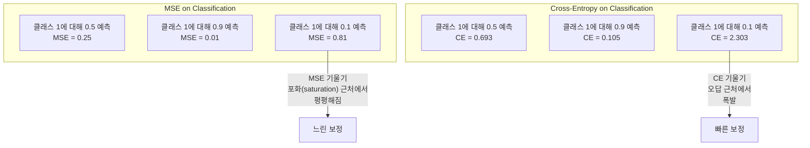
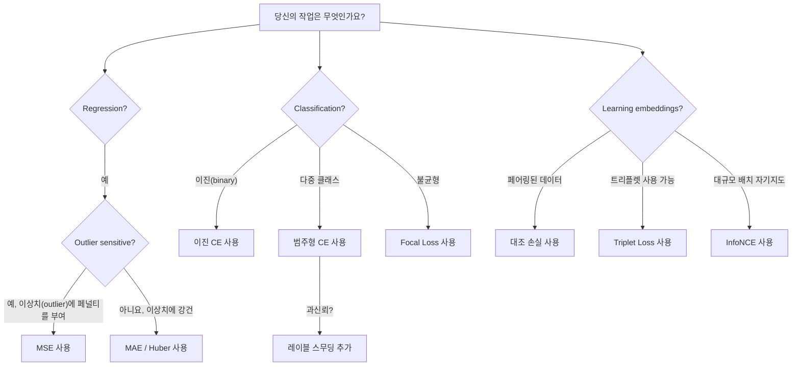
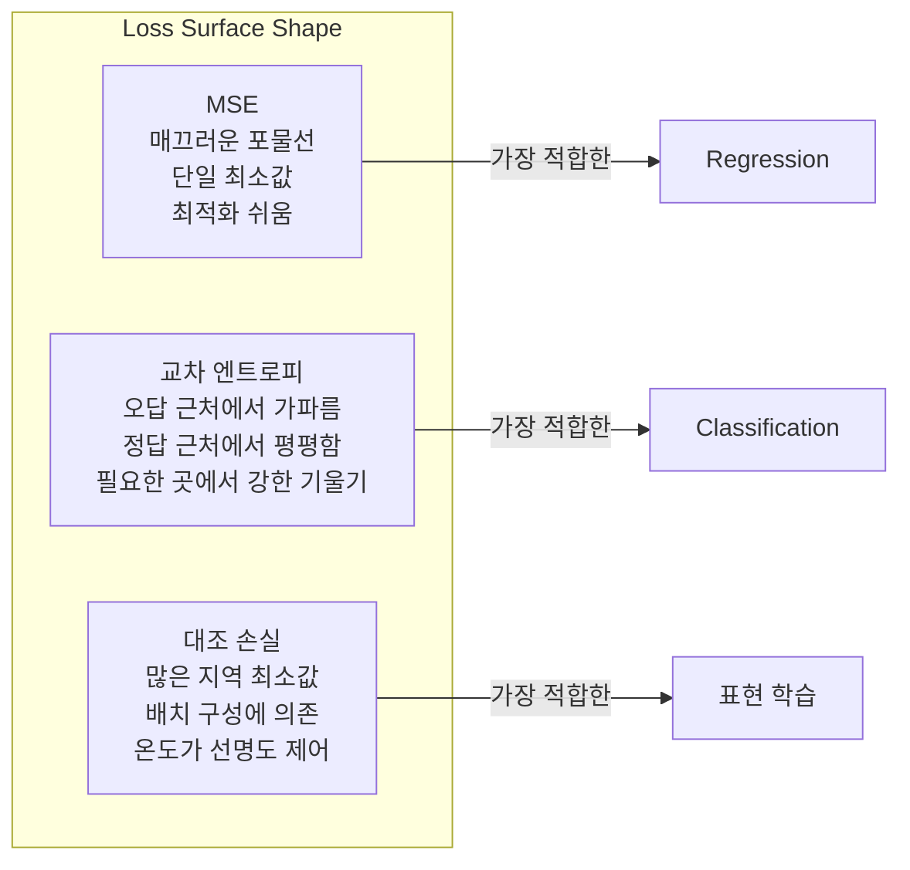

# 손실 함수(Loss Functions)

> 네트워크가 예측을 합니다. 정답(ground truth)은 다릅니다. 얼마나 틀렸을까요? 그 숫자가 손실(loss)입니다. 손실 함수를 잘못 선택하면 모델이 완전히 엉뚱한 것을 최적화하게 됩니다.

**유형:** Build
**언어:** Python
**선수 요건:** 0304강 (활성화 함수(Activation Functions))
**시간:** 약 75분

## 학습 목표

- MSE, 이진 교차 엔트로피(binary cross-entropy), 범주형 교차 엔트로피(categorical cross-entropy), 대조 학습 손실(contrastive loss)(InfoNCE)을 기울기(gradient)와 함께 처음부터 구현해 보세요
- "모든 것에 대해 0.5를 예측"하는 실패 모드(failure mode)를 시연하여 분류(classification)에 MSE가 실패하는 이유를 설명해 보세요
- 교차 엔트로피(cross-entropy)에 레이블 스무딩(label smoothing)을 적용하고, 이것이 과도하게 확신하는 예측을 방지하는 방식을 설명해 보세요
- 회귀(regression), 이진 분류(binary classification), 다중 클래스 분류(multi-class classification), 임베딩(embedding) 학습 작업에 올바른 손실 함수를 선택해 보세요

## 문제점

분류 문제에서 MSE를 최소화하는 모델은 모든 것에 대해 0.5를 자신 있게 예측합니다. 손실을 최소화하고 있습니다. 하지만 쓸모가 없습니다.

손실 함수는 모델이 실제로 최적화하는 유일한 것입니다. 정확도(accuracy)가 아닙니다. F1 점수도 아닙니다. 관리자에게 보고하는 어떤 지표도 아닙니다. 옵티마이저(optimizer)는 손실 함수의 기울기(gradient)를 취하고, 그 숫자를 작게 만들기 위해 가중치(weight)를 조정합니다. 손실 함수가 당신이 중요하게 여기는 것을 포착하지 못하면, 모델은 이를 만족하는 수학적으로 가장 저렴한 방법을 찾게 되며, 그 방법은 당신이 원했던 것과 거의 일치하지 않습니다.

구체적인 예시를 보겠습니다. 이진 분류(binary classification) 작업이 있습니다. 두 개의 클래스, 50/50 분할입니다. 손실로 MSE를 사용합니다. 모델은 모든 입력에 대해 0.5를 예측합니다. 평균 MSE는 0.25이며, 이는 실제로 아무것도 학습하지 않으면서 달성할 수 있는 최소값입니다. 모델은 판별 능력이 전혀 없지만, 기술적으로는 손실 함수를 최소화했습니다. 교차 엔트로피(cross-entropy)로 바꾸면, 같은 모델은 예측을 0 또는 1로 밀어내야 합니다. -log(0.5) = 0.693은 끔찍한 손실인 반면, -log(0.99) = 0.01은 확신에 찬 올바른 예측에 보상을 주기 때문입니다. 손실 함수의 선택은 학습하는 모델과 지표(metric)를 속이는 모델 사이의 차이입니다.

상황은 더 나빠집니다. 자기 지도 학습에서는 레이블조차 없습니다. 대조 손실(Contrastive Loss)은 학습 신호를 완전히 정의합니다: 무엇이 유사한지, 무엇이 다른지, 그리고 모델이 그것들을 얼마나 강하게 분리해야 하는지. 대조 손실을 잘못 설정하면 임베딩이 단일 점으로 붕괴됩니다 -- 모든 입력이 동일한 벡터로 매핑됩니다. 기술적으로 손실은 0입니다. 완전히 쓸모없습니다.

## 개념

### 평균 제곱 오차 (MSE)

회귀의 기본값입니다. 예측값과 목표값의 제곱 차이를 계산하고, 모든 샘플에 대해 평균을 냅니다.

```
MSE = (1/n) * sum((y_pred - y_true)^2)
```

제곱이 중요한 이유: 큰 오차를 제곱으로 페널티를 부과합니다. 오차 2는 오차 1의 4배 비용이 듭니다. 오차 10은 100배 비용이 듭니다. 이는 MSE가 이상치(outlier)에 민감하게 만듭니다 -- 단 하나의 극단적으로 잘못된 예측이 손실을 지배합니다.

실수 값: 모델이 주택 가격을 예측하고 한 저택에서 $10,000 on most houses but off by $200,000만큼 오차가 발생하면, MSE는 그 저택을 공격적으로 수정하려 하며, 나머지 99채 주택의 성능을 해칠 수 있습니다.

예측값에 대한 MSE의 기울기는 다음과 같습니다:

```
dMSE/dy_pred = (2/n) * (y_pred - y_true)
```

오차에 대해 선형입니다. 더 큰 오차는 더 큰 기울기를 가집니다. 이는 회귀에서는 기능(feature)입니다 (큰 오차는 큰 수정이 필요함)이, 분류에서는 버그(bug)입니다 (확신에 찬 잘못된 답을 선형이 아닌 지수적으로 페널티를 부과해야 함).

### 교차 엔트로피 손실(Cross-Entropy Loss)

분류의 손실 함수입니다. 정보 이론에 뿌리를 두고 있으며 -- 예측된 확률 분포와 실제 분포 간의 발산을 측정합니다.

**이진 교차 엔트로피 (BCE):**

```
BCE = -(y * log(p) + (1 - y) * log(1 - p))
```

여기서 y는 실제 레이블(0 또는 1)이고, p는 예측된 확률입니다.

-log(p)가 작동하는 이유: 실제 레이블이 1이고 p = 0.99를 예측하면 손실은 -log(0.99) = 0.01입니다. p = 0.01을 예측하면 손실은 -log(0.01) = 4.6입니다. 이 460배의 차이가 교차 엔트로피가 작동하는 이유입니다. 확신에 찬 잘못된 예측을 가혹하게 벌하고, 확신에 찬 올바른 예측은 거의 페널티를 부과하지 않습니다.

기울기는 같은 이야기를 전달합니다:

```
dBCE/dp = -(y/p) + (1-y)/(1-p)
```

y = 1이고 p가 0에 가까울 때, 기울기는 -1/p로 음의 무한대에 가까워집니다. 모델은 실수를 수정하기 위해 거대한 신호를 받습니다. p가 1에 가까울 때, 기울기는 매우 작습니다. 이미 정확하므로, 수정할 것이 없습니다.

**범주형 교차 엔트로피(Categorical Cross-Entropy):**

원 핫(one-hot) 인코딩된 타깃을 사용하는 다중 클래스 분류에 적용됩니다.

```
CCE = -sum(y_i * log(p_i))
```

다른 모든 y_i가 0이므로, 오직 참 클래스(true class)만 손실(loss)에 기여합니다. 클래스가 10개이고, 참 클래스가 확률 0.1 (무작위 추측)을 받는다면 손실은 -log(0.1) = 2.3입니다. 참 클래스가 확률 0.9를 받는다면 손실은 -log(0.9) = 0.105입니다. 모델은 정답에 확률 질량(probability mass)을 집중하도록 학습합니다.

### 분류에 MSE가 실패하는 이유



예측값이 0 또는 1에 가까울 때 (시그모이드 포화(sigmoid saturation)로 인해) MSE 기울기는 평평해집니다. 교차 엔트로피(Cross-entropy) 기울기는 이를 보상합니다. -log가 시그모이드의 평평한 영역을 상쇄하여, 가장 필요로 하는 곳에서 강한 기울기를 만들어냅니다.

### 레이블 스무딩(Label Smoothing)

표준 원 핫(one-hot) 레이블은 "이것은 100% 클래스 3이고 나머지 모든 것은 0%"라고 말합니다. 이는 매우 강한 주장입니다. 레이블 스무딩은 이를 부드럽게 만듭니다:

```
smooth_label = (1 - alpha) * one_hot + alpha / num_classes
```

alpha = 0.1이고 클래스가 10개인 경우: [0, 0, 1, 0, ...] 대신 타깃은 [0.01, 0.01, 0.91, 0.01, ...]이 됩니다. 모델은 1.0 대신 0.91을 목표로 합니다.

이 방법이 작동하는 이유: 소프트맥스(softmax)를 통해 정확히 1.0을 출력하려는 모델은 로짓(logit)을 무한대로 밀어내야 합니다. 이는 과신(overconfidence)을 유발하고, 일반화(generalization)를 해치며, 분포 이동(distribution shift)에 대해 모델을 취약하게 만듭니다. 레이블 스무딩은 타깃을 0.9 (alpha=0.1일 때)로 제한하여 로짓을 합리적인 범위로 유지합니다. GPT 및 대부분의 최신 모델은 레이블 스무딩 또는 그 동등한 기법을 사용합니다.

### 대조 손실(Contrastive Loss)

레이블이 없습니다. 클래스도 없습니다. 입력 쌍과 "이것들이 유사한가, 다른가?"라는 질문만 있습니다.

**SimCLR 스타일의 대조 손실(NT-Xent / InfoNCE):**

이미지 하나를 가져오세요. 이 이미지에서 두 개의 증강된 뷰(크롭, 회전, 색상 지터)를 만드세요. 이것들이 "양성 쌍"입니다. 양성 쌍은 유사한 임베딩을 가져야 합니다. 배치 내의 모든 다른 이미지들은 "음성 쌍"을 형성합니다. 음성 쌍은 서로 다른 임베딩을 가져야 합니다.

```
L = -log(exp(sim(z_i, z_j) / tau) / sum(exp(sim(z_i, z_k) / tau)))
```

여기서 sim()는 코사인 유사도(Cosine Similarity)이며, z_i와 z_j는 양성 쌍이고, 합은 모든 음성 쌍에 대해 수행됩니다. tau(온도)는 분포의 날카로움을 제어합니다. 온도가 낮을수록 음성 쌍이 더 어려워지며, 더 공격적인 분리가 이루어집니다.

실제 수치: 배치 크기(batch size)가 256이면 양성 쌍당 음성 쌍은 255개입니다. 온도 tau는 0.07(SimCLR 기본값)입니다. 손실 함수는 유사도에 대한 softmax처럼 보이며, 256개의 옵션 중 양성 쌍의 유사도가 가장 높기를 원합니다.

**트리플릿 손실(Triplet Loss):**

세 가지 입력을 받습니다: 앵커(anchor), 양성(같은 클래스), 음성(다른 클래스).

```
L = max(0, d(anchor, positive) - d(anchor, negative) + margin)
```

마진(margin, 일반적으로 0.2-1.0)은 양성 거리와 음성 거리 사이의 최소 간격을 강제합니다. 음성 쌍이 이미 충분히 멀리 떨어져 있다면 손실은 0이며, 기울기가 없고 업데이트도 없습니다. 이는 학습을 효율적으로 만들지만, 앵커에 가까운 어려운 음성 쌍을 선택하는 신중한 트리플릿 마이닝(triplet mining)이 필요합니다.

### 포컬 손실(Focal Loss)

불균형 데이터셋을 위해 사용됩니다. 표준 교차 엔트로피(Cross-Entropy)는 모든 올바르게 분류된 예제를 동일하게 취급합니다. 포컬 손실은 쉬운 예제의 가중치를 낮춥니다:

```
FL = -alpha * (1 - p_t)^gamma * log(p_t)
```

여기서 p_t는 참 클래스의 예측 확률이며, gamma는 집중도를 제어합니다. gamma = 0이면 표준 교차 엔트로피가 됩니다. gamma = 2 (기본값)인 경우:

- 쉬운 예제 (p_t = 0.9): 가중치 = (0.1)^2 = 0.01. 사실상 무시됩니다.
- 어려운 예제 (p_t = 0.1): 가중치 = (0.9)^2 = 0.81. 완전한 기울기 신호를 받습니다.

포컬 손실은 Lin et al.이 객체 감지(object detection)를 위해 도입했습니다. 객체 감지에서는 후보 영역의 99%가 배경(쉬운 음성 쌍)입니다. 포컬 손실이 없으면 모델은 쉬운 배경 예제에 묻혀 객체를 감지하는 법을 배우지 못합니다. 포컬 손실을 사용하면 모델은 중요한 어려운 모호한 사례에 용량을 집중합니다.

### 손실 함수 결정 트리(Loss Function Decision Tree)



### 손실 지형



```figure
cross-entropy-loss
```

## 구현하기

### 1단계: MSE와 그 기울기

```python
def mse(predictions, targets):
    n = len(predictions)
    total = 0.0
    for p, t in zip(predictions, targets):
        total += (p - t) ** 2
    return total / n

def mse_gradient(predictions, targets):
    n = len(predictions)
    grads = []
    for p, t in zip(predictions, targets):
        grads.append(2.0 * (p - t) / n)
    return grads
```

### 2단계: 이진 교차 엔트로피

log(0) 문제는 실제입니다. 모델이 양의 예시에 대해 정확히 0을 예측하면 log(0)는 음의 무한대가 됩니다. 클리핑은 이를 방지합니다.

```python
import math

def binary_cross_entropy(predictions, targets, eps=1e-15):
    n = len(predictions)
    total = 0.0
    for p, t in zip(predictions, targets):
        p_clipped = max(eps, min(1 - eps, p))
        total += -(t * math.log(p_clipped) + (1 - t) * math.log(1 - p_clipped))
    return total / n

def bce_gradient(predictions, targets, eps=1e-15):
    grads = []
    for p, t in zip(predictions, targets):
        p_clipped = max(eps, min(1 - eps, p))
        grads.append(-(t / p_clipped) + (1 - t) / (1 - p_clipped))
    return grads
```

### 3단계: Softmax를 사용한 범주형 교차 엔트로피

Softmax는 원시 로짓을 확률로 변환합니다. 그 후 원-핫 타깃에 대한 교차 엔트로피를 계산합니다.

```python
def softmax(logits):
    max_val = max(logits)
    exps = [math.exp(x - max_val) for x in logits]
    total = sum(exps)
    return [e / total for e in exps]

def categorical_cross_entropy(logits, target_index, eps=1e-15):
    probs = softmax(logits)
    p = max(eps, probs[target_index])
    return -math.log(p)

def cce_gradient(logits, target_index):
    probs = softmax(logits)
    grads = list(probs)
    grads[target_index] -= 1.0
    return grads
```

Softmax + 교차 엔트로피의 기울기는 아름답게 단순화됩니다: 참 클래스에 대해서는 (예측 확률 - 1)이고, 다른 모든 클래스에 대해서는 (예측 확률)입니다. 이 우아한 단순화는 우연이 아닙니다 -- Softmax와 교차 엔트로피가 짝을 이루는 이유입니다.

### 4단계: 레이블 스무딩

```python
def label_smoothed_cce(logits, target_index, num_classes, alpha=0.1, eps=1e-15):
    probs = softmax(logits)
    loss = 0.0
    for i in range(num_classes):
        if i == target_index:
            smooth_target = 1.0 - alpha + alpha / num_classes
        else:
            smooth_target = alpha / num_classes
        p = max(eps, probs[i])
        loss += -smooth_target * math.log(p)
    return loss
```

### 5단계: 대조 손실 (단순화된 InfoNCE)

```python
def cosine_similarity(a, b):
    dot = sum(x * y for x, y in zip(a, b))
    norm_a = math.sqrt(sum(x * x for x in a))
    norm_b = math.sqrt(sum(x * x for x in b))
    if norm_a < 1e-10 or norm_b < 1e-10:
        return 0.0
    return dot / (norm_a * norm_b)

def contrastive_loss(anchor, positive, negatives, temperature=0.07):
    sim_pos = cosine_similarity(anchor, positive) / temperature
    sim_negs = [cosine_similarity(anchor, neg) / temperature for neg in negatives]

    max_sim = max(sim_pos, max(sim_negs)) if sim_negs else sim_pos
    exp_pos = math.exp(sim_pos - max_sim)
    exp_negs = [math.exp(s - max_sim) for s in sim_negs]
    total_exp = exp_pos + sum(exp_negs)

    return -math.log(max(1e-15, exp_pos / total_exp))
```

### 6단계: 분류에서의 MSE vs 교차 엔트로피

4강의 원형 데이터셋과 같은 네트워크를 두 손실 함수로 학습합니다. 교차 엔트로피가 더 빠르게 수렴하는 것을 관찰해 보세요.

```python
import random

def sigmoid(x):
    x = max(-500, min(500, x))
    return 1.0 / (1.0 + math.exp(-x))

def make_circle_data(n=200, seed=42):
    random.seed(seed)
    data = []
    for _ in range(n):
        x = random.uniform(-2, 2)
        y = random.uniform(-2, 2)
        label = 1.0 if x * x + y * y < 1.5 else 0.0
        data.append(([x, y], label))
    return data


class LossComparisonNetwork:
    def __init__(self, loss_type="bce", hidden_size=8, lr=0.1):
        random.seed(0)
        self.loss_type = loss_type
        self.lr = lr
        self.hidden_size = hidden_size

        self.w1 = [[random.gauss(0, 0.5) for _ in range(2)] for _ in range(hidden_size)]
        self.b1 = [0.0] * hidden_size
        self.w2 = [random.gauss(0, 0.5) for _ in range(hidden_size)]
        self.b2 = 0.0

    def forward(self, x):
        self.x = x
        self.z1 = []
        self.h = []
        for i in range(self.hidden_size):
            z = self.w1[i][0] * x[0] + self.w1[i][1] * x[1] + self.b1[i]
            self.z1.append(z)
            self.h.append(max(0.0, z))

        self.z2 = sum(self.w2[i] * self.h[i] for i in range(self.hidden_size)) + self.b2
        self.out = sigmoid(self.z2)
        return self.out

    def backward(self, target):
        if self.loss_type == "mse":
            d_loss = 2.0 * (self.out - target)
        else:
            eps = 1e-15
            p = max(eps, min(1 - eps, self.out))
            d_loss = -(target / p) + (1 - target) / (1 - p)

        d_sigmoid = self.out * (1 - self.out)
        d_out = d_loss * d_sigmoid

        for i in range(self.hidden_size):
            d_relu = 1.0 if self.z1[i] > 0 else 0.0
            d_h = d_out * self.w2[i] * d_relu
            self.w2[i] -= self.lr * d_out * self.h[i]
            for j in range(2):
                self.w1[i][j] -= self.lr * d_h * self.x[j]
            self.b1[i] -= self.lr * d_h
        self.b2 -= self.lr * d_out

    def compute_loss(self, pred, target):
        if self.loss_type == "mse":
            return (pred - target) ** 2
        else:
            eps = 1e-15
            p = max(eps, min(1 - eps, pred))
            return -(target * math.log(p) + (1 - target) * math.log(1 - p))

    def train(self, data, epochs=200):
        losses = []
        for epoch in range(epochs):
            total_loss = 0.0
            correct = 0
            for x, y in data:
                pred = self.forward(x)
                self.backward(y)
                total_loss += self.compute_loss(pred, y)
                if (pred >= 0.5) == (y >= 0.5):
                    correct += 1
            avg_loss = total_loss / len(data)
            accuracy = correct / len(data) * 100
            losses.append((avg_loss, accuracy))
            if epoch % 50 == 0 or epoch == epochs - 1:
                print(f"    Epoch {epoch:3d}: loss={avg_loss:.4f}, accuracy={accuracy:.1f}%")
        return losses
```

## 사용하기

PyTorch는 수치적 안정성이 내장된 모든 표준 손실 함수를 제공합니다:

```python
import torch
import torch.nn as nn
import torch.nn.functional as F

predictions = torch.tensor([0.9, 0.1, 0.7], requires_grad=True)
targets = torch.tensor([1.0, 0.0, 1.0])

mse_loss = F.mse_loss(predictions, targets)
bce_loss = F.binary_cross_entropy(predictions, targets)

logits = torch.randn(4, 10)
labels = torch.tensor([3, 7, 1, 9])
ce_loss = F.cross_entropy(logits, labels)
ce_smooth = F.cross_entropy(logits, labels, label_smoothing=0.1)
```

`F.cross_entropy`를 사용하세요 (`F.nll_loss`에 수동 softmax를 더하는 방식이 아닙니다). 이 함수는 log-softmax와 음의 로그 우도(negative log-likelihood)를 하나의 수치적으로 안정된 연산으로 결합합니다. softmax를 별도로 적용한 후 로그를 취하는 방식은 안정성이 떨어집니다 -- 큰 지수들의 뺄셈 과정에서 정밀도가 손실됩니다.

대조 학습(Contrastive Learning)의 경우, 대부분의 팀은 `lightly`나 `pytorch-metric-learning` 같은 라이브러리나 커스텀 구현을 사용합니다. 핵심 루프는 항상 동일합니다: 쌍별 유사도를 계산하고, 양의 예제와 음의 예제에 대해 softmax를 생성한 후, 역전파(Backpropagation)합니다.

## 출시하기

이 강의는 다음을 생성합니다:
- `outputs/prompt-loss-function-selector.md` -- 올바른 손실 함수를 선택하기 위한 재사용 가능한 프롬프트
- `outputs/prompt-loss-debugger.md` -- 손실 곡선이 잘못 보일 때 사용하는 진단 프롬프트

## 연습 문제

1. Huber 손실(smooth L1 손실)을 구현하세요. 이는 작은 오차에 대해 MSE를, 큰 오차에 대해 MAE를 사용합니다. 학습 타겟의 5%에 랜덤 노이즈가 추가된(outliers) 상황에서 y = sin(x)를 예측하는 회귀 네트워크를 MSE와 Huber 손실로 각각 학습하세요. 최종 테스트 오차를 비교하세요.

2. 이진 분류 학습 루프에 focal loss를 추가하세요. 불균형 데이터셋(클래스 0이 90%, 클래스 1이 10%)을 생성하세요. 200 에포크(Epoch) 후 소수 클래스의 재현율(recall)에 대해 표준 BCE와 focal loss(gamma=2)를 비교하세요.

3. semi-hard negative mining을 적용한 triplet loss를 구현하세요. 5개 클래스에 대한 2D 임베딩(embedding) 데이터를 생성하세요. 각 앵커(anchor)에 대해, 양의 예제보다 여전히 더 먼 가장 어려운 음의 예제(semi-hard)를 찾으세요. 랜덤 triplet 선택과 수렴 속도를 비교하세요.

4. MSE와 교차 엔트로피(Cross-Entropy) 비교를 실행하되, 학습 중 각 레이어의 기울기 크기를 추적하세요. 에포크별 평균 기울기 노름(norm)을 플롯하세요. 모델이 가장 불확실한 초기 에포크에서 교차 엔트로피가 더 큰 기울기를 생성함을 확인하세요.

5. KL 발산(KL divergence) 손실을 구현하고, 참(true) 분포가 one-hot일 때 KL(true || predicted)를 최소화하는 것이 교차 엔트로피와 동일한 기울기를 생성함을 확인하세요. 그 후, "참" 분포가 교사 모델의 softmax 출력에서 오는 soft targets (지식 증류(Knowledge Distillation)와 유사)를 시도하세요.

## 핵심 용어

| 용어 | 사람들이 말하는 것 | 실제 의미 |
|------|----------------|----------------------|
| 손실 함수(Loss Function) | "모델이 얼마나 틀렸는가" | 예측값과 목표값을 스칼라로 매핑하여 옵티마이저(Optimizer)가 최소화하는 미분 가능한 함수 |
| MSE | "평균 제곱 오차" | 예측값과 목표값 간 차이의 제곱 평균; 큰 오차를 제곱으로 페널티 부여 |
| 교차 엔트로피(Cross-Entropy) | "분류 손실" | -log(p)를 사용하여 예측 확률 분포와 실제 분포 간의 발산을 측정 |
| 이진 교차 엔트로피(Binary Cross-Entropy) | "BCE" | 두 클래스에 대한 교차 엔트로피: -(y*log(p) + (1-y)*log(1-p)) |
| 레이블 스무딩(Label Smoothing) | "목표값 부드럽게 만들기" | 하드 0/1 목표값을 소프트 값(예: 0.1/0.9)으로 대체하여 과신뢰를 방지하고 일반화 성능 개선 |
| 대조 손실(Contrastive Loss) | "당겨서 모으고, 밀어서 분리" | 임베딩 공간에서 유사한 쌍은 가깝게, 비유사한 쌍은 멀리 배치하여 표현을 학습하는 손실 |
| InfoNCE | "CLIP/SimCLR 손실" | 유사도 점수에 대한 정규화된 온도 스케일링 교차 엔트로피; 대조 학습을 분류 문제로 취급 |
| 포컬 손실(Focal Loss) | "불균형 데이터 해결책" | (1-p_t)^gamma로 가중치를 부여하여 쉬운 예제를 낮추고 어려운 예제에 집중하는 교차 엔트로피 |
| 트리플릿 손실(Triplet Loss) | "앵커-양성-음성" | 임베딩 공간에서 앵커 포인트가 음성보다 양성 포인트에 최소 마진만큼 더 가깝도록 푸시 |
| 온도(Temperature) | "선명도 조절旋钮" | 로짓(Logits)/유사도에 적용되는 스칼라 나눗셈으로 결과 분포의 첨도를 제어; 낮을수록 선명 |

## 추가 읽기

- Lin et al., "Focal Loss for Dense Object Detection" (2017) -- 객체 감지(RetinaNet)에서 극단적인 클래스 불균형을 처리하기 위해 포컬 손실 도입
- Chen et al., "A Simple Framework for Contrastive Learning of Visual Representations" (SimCLR, 2020) -- NT-Xent 손실을 사용하여 현대적인 대조 학습 파이프라인 정의
- Szegedy et al., "Rethinking the Inception Architecture" (2016) -- 정규화 기법으로 레이블 스무딩 도입, 현재 대부분의 대규모 모델에서 표준으로 사용
- Hinton et al., "Distilling the Knowledge in a Neural Network" (2015) -- 소프트 목표값과 KL 발산을 이용한 지식 증류(Knowledge Distillation), 모델 압축의 기초
