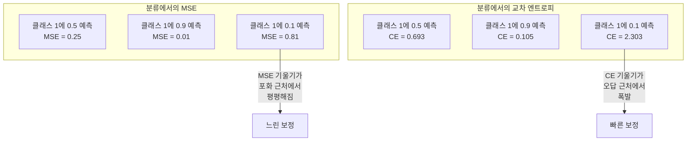
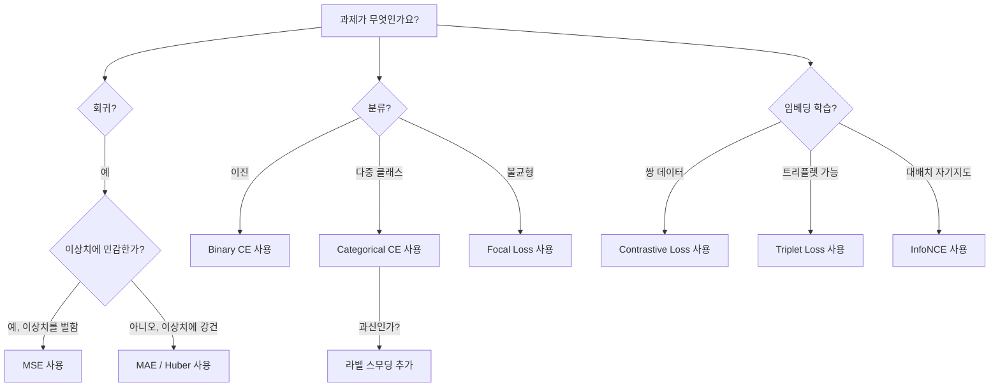
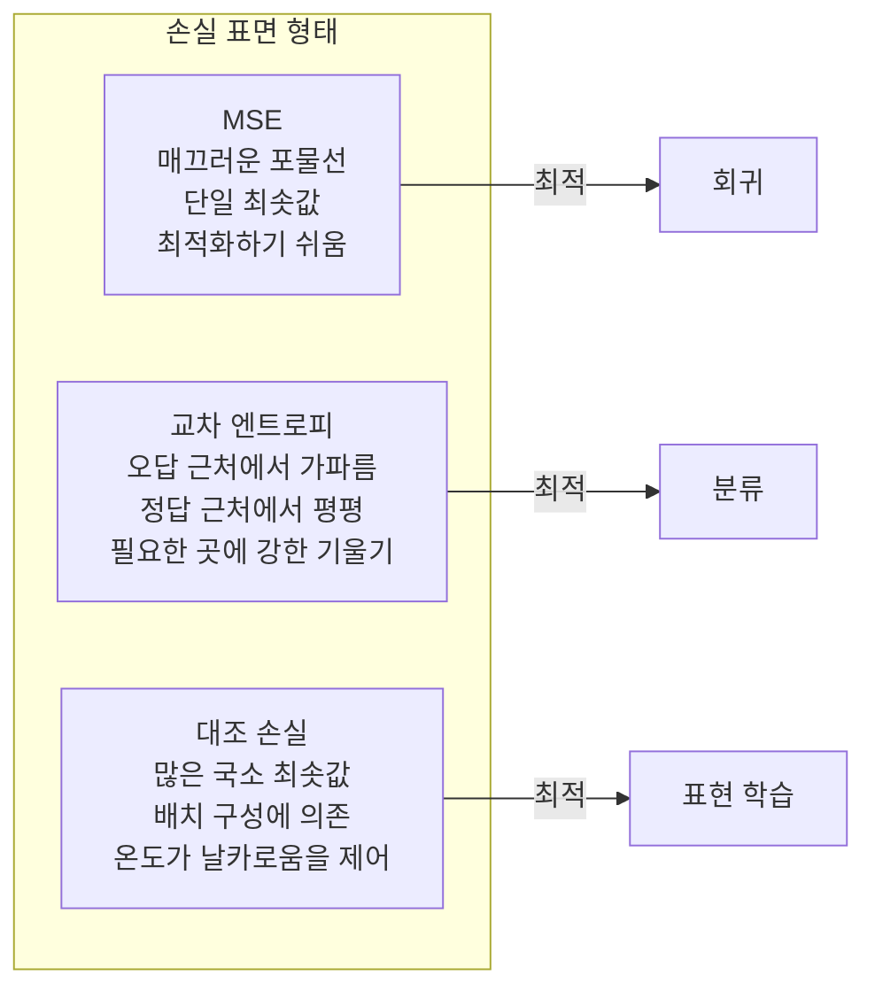

# 손실 함수 (Loss Functions)

> 네트워크가 예측을 합니다. 정답은 다릅니다. 얼마나 틀렸나? 그 숫자가 손실입니다. 잘못된 손실 함수를 고르면 모델이 완전히 다른 것을 최적화합니다.

**Type:** Build
**Languages:** Python
**Prerequisites:** Lesson 03.04 (Activation Functions)
**Time:** ~75 minutes

## 학습 목표 (Learning Objectives)

- MSE, 이진 교차 엔트로피, 범주형 교차 엔트로피, 대조 손실(InfoNCE)을 기울기와 함께 처음부터 구현합니다
- "모든 것에 0.5를 예측"하는 실패 모드를 보여 MSE가 분류에서 실패하는 이유를 설명합니다
- 교차 엔트로피에 라벨 스무딩(label smoothing)을 적용하고, 과신(overconfident) 예측을 막는 방식을 설명합니다
- 회귀, 이진 분류, 다중 클래스 분류, 임베딩 학습 과제에 맞는 손실 함수를 선택합니다

## 문제 상황 (The Problem)

분류 문제에서 MSE를 최소화하는 모델은 모든 것에 자신 있게 0.5를 예측합니다. 손실은 최소화합니다. 쓸모도 없습니다.

손실 함수는 모델이 실제로 최적화하는 유일한 것입니다. 정확도가 아닙니다. F1 점수가 아닙니다. 매니저에게 보고하는 어떤 지표도 아닙니다. 옵티마이저는 손실 함수의 기울기를 취해 그 숫자를 작게 만들도록 가중치를 조정합니다. 손실 함수가 당신이 신경 쓰는 것을 담지 못하면, 모델은 수학적으로 가장 싼 방식으로 그것을 만족시키며, 그 방식은 거의 당신이 원한 것이 아닙니다.

구체적인 예입니다. 이진 분류 과제가 있습니다. 두 클래스, 50/50 분할. 손실로 MSE를 씁니다. 모델이 모든 입력에 0.5를 예측합니다. 평균 MSE는 0.25로, 아무 것도 학습하지 않고 가능한 최솟값입니다. 모델은 판별 능력이 제로이지만 기술적으로 손실 함수를 최소화했습니다. 교차 엔트로피로 바꾸면 같은 모델이 예측을 0 또는 1 쪽으로 밀어야 합니다. -log(0.5) = 0.693은 끔찍한 손실이고, -log(0.99) = 0.01은 자신 있는 올바른 예측에 보상을 주기 때문입니다. 손실 함수 선택이 학습하는 모델과 지표를 속이는 모델의 차이입니다.

더 나빠집니다. 자기지도 학습에서는 라벨조차 없습니다. 대조 손실(contrastive loss)이 학습 신호 전체를 정의합니다: 무엇이 비슷한지, 무엇이 다른지, 모델이 얼마나 세게 밀어내야 하는지. 대조 손실을 잘못 잡으면 임베딩이 한 점으로 붕괴합니다 — 모든 입력이 같은 벡터로 매핑됩니다. 기술적으로 손실 제로. 완전히 무가치합니다.

## 핵심 개념 (The Concept)

### 평균 제곱 오차 (Mean Squared Error, MSE)

회귀의 기본값입니다. 예측과 타깃의 제곱 차를 계산하고, 모든 샘플에 대해 평균합니다.

```
MSE = (1/n) * sum((y_pred - y_true)^2)
```

제곱이 중요한 이유: 큰 오차를 이차로 벌합니다. 오차 2는 오차 1보다 4배 비쌉니다. 오차 10은 100배입니다. 그래서 MSE는 이상치에 민감합니다 — 심하게 틀린 예측 하나가 손실을 지배합니다.

실제 숫자: 주택 가격을 예측하는 모델이 대부분 집에서 $10,000 빗나가지만 한 맨션에서 $200,000 빗나가면, MSE는 그 한 맨션을 고치려 공격적으로 움직이며, 나머지 99채의 성능을 해칠 수 있습니다.

예측에 대한 MSE의 기울기:

```
dMSE/dy_pred = (2/n) * (y_pred - y_true)
```

오차에 선형입니다. 큰 오차가 큰 기울기를 받습니다. 회귀에는 장점(큰 오차는 큰 보정이 필요)이고 분류에는 버그입니다(자신 있는 오답을 선형이 아니라 지수적으로 벌해야 합니다).

### 교차 엔트로피 손실 (Cross-Entropy Loss)

분류용 손실 함수입니다. 정보 이론에 뿌리를 두며 — 예측 확률 분포와 진짜 분포 사이의 발산을 측정합니다.

**이진 교차 엔트로피 (Binary Cross-Entropy, BCE):**

```
BCE = -(y * log(p) + (1 - y) * log(1 - p))
```

여기서 y는 진짜 라벨(0 또는 1), p는 예측 확률입니다.

-log(p)가 동작하는 이유: 진짜 라벨이 1이고 p = 0.99를 예측하면 손실은 -log(0.99) = 0.01입니다. p = 0.01을 예측하면 손실은 -log(0.01) = 4.6입니다. 이 460배 차이가 교차 엔트로피가 동작하는 이유입니다. 자신 있는 오답은 가혹하게 벌하고, 자신 있는 정답은 거의 벌하지 않습니다.

기울기도 같은 이야기를 합니다:

```
dBCE/dp = -(y/p) + (1-y)/(1-p)
```

y = 1이고 p가 0에 가까우면 기울기는 -1/p로 음의 무한대에 접근합니다. 모델은 실수를 고치라는 거대한 신호를 받습니다. p가 1에 가까우면 기울기는 작습니다. 이미 맞았으니 고칠 것이 없습니다.

**범주형 교차 엔트로피 (Categorical Cross-Entropy):**

원-핫 인코딩된 타깃을 쓰는 다중 클래스 분류용입니다.

```
CCE = -sum(y_i * log(p_i))
```

진짜 클래스만 손실에 기여합니다(나머지 y_i는 0이므로). 클래스가 10개이고 정답 클래스가 확률 0.1(무작위 추측)이면 손실은 -log(0.1) = 2.3입니다. 정답 클래스가 확률 0.9이면 손실은 -log(0.9) = 0.105입니다. 모델은 올바른 답에 확률 질량을 집중하는 법을 배웁니다.

### MSE가 분류에서 실패하는 이유



MSE 기울기는 예측이 0 또는 1에 가까울 때 평평해집니다(sigmoid 포화 때문). 교차 엔트로피 기울기는 이를 보상합니다 — -log가 sigmoid의 평평한 영역을 상쇄해, 가장 필요한 곳에서 강한 기울기를 줍니다.

### 라벨 스무딩 (Label Smoothing)

표준 원-핫 라벨은 "이건 100% 클래스 3이고 나머지는 0%"라고 말합니다. 강한 주장입니다. 라벨 스무딩이 이를 부드럽게 합니다:

```
smooth_label = (1 - alpha) * one_hot + alpha / num_classes
```

alpha = 0.1이고 클래스가 10개일 때: [0, 0, 1, 0, ...] 대신 타깃이 [0.01, 0.01, 0.91, 0.01, ...]가 됩니다. 모델은 1.0 대신 0.91을 목표로 합니다.

이게 동작하는 이유: softmax를 통해 정확히 1.0을 출력하려면 logit을 무한대로 밀어야 합니다. 이는 과신을 유발하고, 일반화를 해치며, 분포 이동에 취약하게 만듭니다. 라벨 스무딩은 (alpha=0.1일 때) 타깃을 0.9로 캡해 logit을 합리적인 범위에 둡니다. GPT와 대부분의 현대 모델이 라벨 스무딩 또는 그 등가물을 씁니다.

### 대조 손실 (Contrastive Loss)

라벨 없음. 클래스 없음. 입력 쌍과 질문만 있습니다: 비슷한가, 다른가?

**SimCLR 스타일 대조 손실 (NT-Xent / InfoNCE):**

이미지 하나를 가져옵니다. 증강된 뷰 두 개(크롭, 회전, 색상 지터)를 만듭니다. 이것이 "양성 쌍" — 비슷한 임베딩을 가져야 합니다. 배치의 다른 모든 이미지는 "음성 쌍" — 다른 임베딩을 가져야 합니다.

```
L = -log(exp(sim(z_i, z_j) / tau) / sum(exp(sim(z_i, z_k) / tau)))
```

여기서 sim()은 코사인 유사도, z_i와 z_j는 양성 쌍, 합은 모든 음성에 대해, tau(온도)는 분포가 얼마나 날카로운지를 제어합니다. 낮은 온도 = 더 어려운 음성 = 더 공격적인 분리.

실제 숫자: 배치 크기 256이면 양성 쌍당 음성 255개. 온도 tau = 0.07(SimCLR 기본값). 손실은 유사도에 대한 softmax처럼 보입니다 — 256개 옵션 중 양성 쌍의 유사도가 가장 높기를 원합니다.

**트리플렛 손실 (Triplet Loss):**

세 입력을 받습니다: 앵커, 양성(같은 클래스), 음성(다른 클래스).

```
L = max(0, d(anchor, positive) - d(anchor, negative) + margin)
```

마진(보통 0.2-1.0)은 양성과 음성 거리 사이에 최소 간격을 강제합니다. 음성이 이미 충분히 멀면 손실은 0 — 기울기 없음, 갱신 없음. 학습은 효율적이지만 신중한 트리플렛 마이닝(앵커에 가까운 어려운 음성을 고르는 것)이 필요합니다.

### Focal Loss

불균형 데이터셋용입니다. 표준 교차 엔트로피는 올바르게 분류된 예제를 모두 동등하게 취급합니다. Focal loss는 쉬운 예제의 가중치를 낮춥니다:

```
FL = -alpha * (1 - p_t)^gamma * log(p_t)
```

여기서 p_t는 진짜 클래스의 예측 확률이고 gamma는 초점을 제어합니다. gamma = 0이면 표준 교차 엔트로피입니다. gamma = 2(기본값)일 때:

- 쉬운 예제 (p_t = 0.9): 가중치 = (0.1)^2 = 0.01. 사실상 무시.
- 어려운 예제 (p_t = 0.1): 가중치 = (0.9)^2 = 0.81. 전체 기울기 신호.

Focal loss는 Lin 등이 객체 탐지를 위해 도입했습니다. 후보 영역의 99%가 배경(쉬운 음성)인 경우입니다. Focal loss 없이는 모델이 쉬운 배경 예제에 빠져 객체를 탐지하는 법을 배우 못합니다. 있으면 모델이 중요한 어렵고 모호한 사례에 용량을 집중합니다.

### 손실 함수 결정 트리



### 손실 지형



```figure
cross-entropy-loss
```

## 직접 만들기 (Build It)

### 1단계: MSE와 그 기울기

```python
def mse(predictions, targets):
    n = len(predictions)
    total = 0.0
    for p, t in zip(predictions, targets):
        total += (p - t) ** 2
    return total / n

def mse_gradient(predictions, targets):
    n = len(predictions)
    grads = []
    for p, t in zip(predictions, targets):
        grads.append(2.0 * (p - t) / n)
    return grads
```

### 2단계: 이진 교차 엔트로피

log(0) 문제는 실제입니다. 모델이 양성 예제에 정확히 0을 예측하면 log(0) = 음의 무한대입니다. 클리핑이 이를 막습니다.

```python
import math

def binary_cross_entropy(predictions, targets, eps=1e-15):
    n = len(predictions)
    total = 0.0
    for p, t in zip(predictions, targets):
        p_clipped = max(eps, min(1 - eps, p))
        total += -(t * math.log(p_clipped) + (1 - t) * math.log(1 - p_clipped))
    return total / n

def bce_gradient(predictions, targets, eps=1e-15):
    grads = []
    for p, t in zip(predictions, targets):
        p_clipped = max(eps, min(1 - eps, p))
        grads.append(-(t / p_clipped) + (1 - t) / (1 - p_clipped))
    return grads
```

### 3단계: Softmax와 함께하는 범주형 교차 엔트로피

Softmax는 원시 logit을 확률로 변환합니다. 그다음 원-핫 타깃에 대한 교차 엔트로피를 계산합니다.

```python
def softmax(logits):
    max_val = max(logits)
    exps = [math.exp(x - max_val) for x in logits]
    total = sum(exps)
    return [e / total for e in exps]

def categorical_cross_entropy(logits, target_index, eps=1e-15):
    probs = softmax(logits)
    p = max(eps, probs[target_index])
    return -math.log(p)

def cce_gradient(logits, target_index):
    probs = softmax(logits)
    grads = list(probs)
    grads[target_index] -= 1.0
    return grads
```

softmax + 교차 엔트로피의 기울기는 아름답게 단순화됩니다: 진짜 클래스에 대해 (예측 확률 - 1), 나머지 클래스에 대해 (예측 확률)입니다. 이 우아한 단순화는 우연이 아닙니다 — softmax와 교차 엔트로피가 짝을 이루는 이유입니다.

### 4단계: 라벨 스무딩

```python
def label_smoothed_cce(logits, target_index, num_classes, alpha=0.1, eps=1e-15):
    probs = softmax(logits)
    loss = 0.0
    for i in range(num_classes):
        if i == target_index:
            smooth_target = 1.0 - alpha + alpha / num_classes
        else:
            smooth_target = alpha / num_classes
        p = max(eps, probs[i])
        loss += -smooth_target * math.log(p)
    return loss
```

### 5단계: 대조 손실 (단순화한 InfoNCE)

```python
def cosine_similarity(a, b):
    dot = sum(x * y for x, y in zip(a, b))
    norm_a = math.sqrt(sum(x * x for x in a))
    norm_b = math.sqrt(sum(x * x for x in b))
    if norm_a < 1e-10 or norm_b < 1e-10:
        return 0.0
    return dot / (norm_a * norm_b)

def contrastive_loss(anchor, positive, negatives, temperature=0.07):
    sim_pos = cosine_similarity(anchor, positive) / temperature
    sim_negs = [cosine_similarity(anchor, neg) / temperature for neg in negatives]

    max_sim = max(sim_pos, max(sim_negs)) if sim_negs else sim_pos
    exp_pos = math.exp(sim_pos - max_sim)
    exp_negs = [math.exp(s - max_sim) for s in sim_negs]
    total_exp = exp_pos + sum(exp_negs)

    return -math.log(max(1e-15, exp_pos / total_exp))
```

### 6단계: 분류에서 MSE vs 교차 엔트로피

레슨 04의 같은 네트워크(원 데이터셋)를 두 손실 함수로 학습합니다. 교차 엔트로피가 더 빨리 수렴하는 것을 지켜보세요.

```python
import random

def sigmoid(x):
    x = max(-500, min(500, x))
    return 1.0 / (1.0 + math.exp(-x))

def make_circle_data(n=200, seed=42):
    random.seed(seed)
    data = []
    for _ in range(n):
        x = random.uniform(-2, 2)
        y = random.uniform(-2, 2)
        label = 1.0 if x * x + y * y < 1.5 else 0.0
        data.append(([x, y], label))
    return data


class LossComparisonNetwork:
    def __init__(self, loss_type="bce", hidden_size=8, lr=0.1):
        random.seed(0)
        self.loss_type = loss_type
        self.lr = lr
        self.hidden_size = hidden_size

        self.w1 = [[random.gauss(0, 0.5) for _ in range(2)] for _ in range(hidden_size)]
        self.b1 = [0.0] * hidden_size
        self.w2 = [random.gauss(0, 0.5) for _ in range(hidden_size)]
        self.b2 = 0.0

    def forward(self, x):
        self.x = x
        self.z1 = []
        self.h = []
        for i in range(self.hidden_size):
            z = self.w1[i][0] * x[0] + self.w1[i][1] * x[1] + self.b1[i]
            self.z1.append(z)
            self.h.append(max(0.0, z))

        self.z2 = sum(self.w2[i] * self.h[i] for i in range(self.hidden_size)) + self.b2
        self.out = sigmoid(self.z2)
        return self.out

    def backward(self, target):
        if self.loss_type == "mse":
            d_loss = 2.0 * (self.out - target)
        else:
            eps = 1e-15
            p = max(eps, min(1 - eps, self.out))
            d_loss = -(target / p) + (1 - target) / (1 - p)

        d_sigmoid = self.out * (1 - self.out)
        d_out = d_loss * d_sigmoid

        for i in range(self.hidden_size):
            d_relu = 1.0 if self.z1[i] > 0 else 0.0
            d_h = d_out * self.w2[i] * d_relu
            self.w2[i] -= self.lr * d_out * self.h[i]
            for j in range(2):
                self.w1[i][j] -= self.lr * d_h * self.x[j]
            self.b1[i] -= self.lr * d_h
        self.b2 -= self.lr * d_out

    def compute_loss(self, pred, target):
        if self.loss_type == "mse":
            return (pred - target) ** 2
        else:
            eps = 1e-15
            p = max(eps, min(1 - eps, pred))
            return -(target * math.log(p) + (1 - target) * math.log(1 - p))

    def train(self, data, epochs=200):
        losses = []
        for epoch in range(epochs):
            total_loss = 0.0
            correct = 0
            for x, y in data:
                pred = self.forward(x)
                self.backward(y)
                total_loss += self.compute_loss(pred, y)
                if (pred >= 0.5) == (y >= 0.5):
                    correct += 1
            avg_loss = total_loss / len(data)
            accuracy = correct / len(data) * 100
            losses.append((avg_loss, accuracy))
            if epoch % 50 == 0 or epoch == epochs - 1:
                print(f"    Epoch {epoch:3d}: loss={avg_loss:.4f}, accuracy={accuracy:.1f}%")
        return losses
```

## 활용하기 (Use It)

PyTorch는 수치 안정성이 내장된 모든 표준 손실 함수를 제공합니다:

```python
import torch
import torch.nn as nn
import torch.nn.functional as F

predictions = torch.tensor([0.9, 0.1, 0.7], requires_grad=True)
targets = torch.tensor([1.0, 0.0, 1.0])

mse_loss = F.mse_loss(predictions, targets)
bce_loss = F.binary_cross_entropy(predictions, targets)

logits = torch.randn(4, 10)
labels = torch.tensor([3, 7, 1, 9])
ce_loss = F.cross_entropy(logits, labels)
ce_smooth = F.cross_entropy(logits, labels, label_smoothing=0.1)
```

`F.cross_entropy`를 쓰세요(`F.nll_loss`에 수동 softmax를 더하지 마세요). log-softmax와 음의 로그 가능도를 하나의 수치적으로 안정한 연산으로 합칩니다. softmax를 따로 적용한 뒤 log를 취하면 덜 안정합니다 — 큰 지수의 뺄셈에서 정밀도를 잃습니다.

대조 학습에서는 대부분의 팀이 커스텀 구현이나 `lightly`, `pytorch-metric-learning` 같은 라이브러리를 씁니다. 핵심 루프는 항상 같습니다: 쌍별 유사도 계산, 양성과 음성에 대한 softmax 생성, 역전파.

## 산출물 (Ship It)

이 레슨이 만드는 것:
- `outputs/prompt-loss-function-selector.md` -- 맞는 손실 함수를 고르는 재사용 프롬프트
- `outputs/prompt-loss-debugger.md` -- 손실 곡선이 이상할 때 쓰는 진단 프롬프트

## 연습 문제 (Exercises)

1. Huber loss(smooth L1 loss)를 구현하세요. 작은 오차에는 MSE, 큰 오차에는 MAE입니다. y = sin(x)를 예측하는 회귀 네트워크를 MSE vs Huber로 학습하되, 학습 타깃의 5%에 무작위 노이즈(이상치)를 추가하세요. 최종 테스트 오차를 비교하세요.

2. 이진 분류 학습 루프에 focal loss를 추가하세요. 불균형 데이터셋(클래스 0 90%, 클래스 1 10%)을 만드세요. 200 에폭 후 소수 클래스 recall에서 표준 BCE vs focal loss(gamma=2)를 비교하세요.

3. 준난이도(semi-hard) 음성 마이닝과 함께 트리플렛 손실을 구현하세요. 5개 클래스의 2D 임베딩 데이터를 생성하세요. 각 앵커에 대해, 양성보다 여전히 멀지만 가장 어려운 음성을 찾으세요(준난이도). 무작위 트리플렛 선택과 수렴을 비교하세요.

4. MSE vs 교차 엔트로피 비교를 실행하되, 학습 중 각 층의 기울기 크기를 추적하세요. 에폭당 평균 기울기 노름을 플롯하세요. 모델이 가장 불확실할 때인 초기 에폭에서 교차 엔트로피가 더 큰 기울기를 내는지 검증하세요.

5. KL 발산 손실을 구현하고, 진짜 분포가 원-핫일 때 KL(true || predicted)를 최소화하는 것이 교차 엔트로피와 같은 기울기를 주는지 검증하세요. 그다음 "진짜" 분포가 교사 모델의 softmax 출력에서 오는 소프트 타깃(지식 증류처럼)을 시도하세요.

## 핵심 용어 (Key Terms)

| Term | What people say | What it actually means |
|------|----------------|----------------------|
| Loss function | "모델이 얼마나 틀렸는지" | 예측과 타깃을 옵티마이저가 최소화하는 스칼라로 매핑하는 미분 가능한 함수 |
| MSE | "평균 제곱 오차" | 예측과 타깃의 제곱 차의 평균; 큰 오차를 이차로 벌함 |
| Cross-entropy | "분류 손실" | -log(p)로 예측 확률 분포와 진짜 분포 사이의 발산을 측정 |
| Binary cross-entropy | "BCE" | 두 클래스용 교차 엔트로피: -(y*log(p) + (1-y)*log(1-p)) |
| Label smoothing | "타깃을 부드럽게" | 硬い 0/1 타깃을 소프트 값(예: 0.1/0.9)으로 바꿔 과신을 막고 일반화를 개선 |
| Contrastive loss | "끌어당기고 밀어냄" | 비슷한 쌍은 가깝게, 다른 쌍은 멀게 해 표현을 학습하는 손실 |
| InfoNCE | "CLIP/SimCLR 손실" | 유사도 점수에 대한 정규화 온도 스케일 교차 엔트로피; 대조 학습을 분류처럼 취급 |
| Focal loss | "불균형 데이터 수정" | (1-p_t)^gamma로 가중된 교차 엔트로피. 쉬운 예제의 가중치를 낮추고 어려운 것에 초점 |
| Triplet loss | "앵커-양성-음성" | 임베딩 공간에서 앵커를 음성보다 마진만큼 이상 양성에 가깝게 밀어냄 |
| Temperature | "날카로움 노브" | logit/유사도를 나누는 스칼라. 결과 분포가 얼마나 뾰족한지를 제어; 낮을수록 더 날카로움 |

## 더 읽을거리 (Further Reading)

- Lin et al., "Focal Loss for Dense Object Detection" (2017) -- 객체 탐지(RetinaNet)에서 극단적 클래스 불균형을 다루하기 위한 focal loss 도입
- Chen et al., "A Simple Framework for Contrastive Learning of Visual Representations" (SimCLR, 2020) -- NT-Xent 손실과 함께 현대 대조 학습 파이프라인을 정의
- Szegedy et al., "Rethinking the Inception Architecture" (2016) -- 정규화 기법으로 라벨 스무딩을 도입. 이제 대부분의 대형 모델에서 표준
- Hinton et al., "Distilling the Knowledge in a Neural Network" (2015) -- 소프트 타깃과 KL 발산을 쓰는 지식 증류. 모델 압축의 기초
