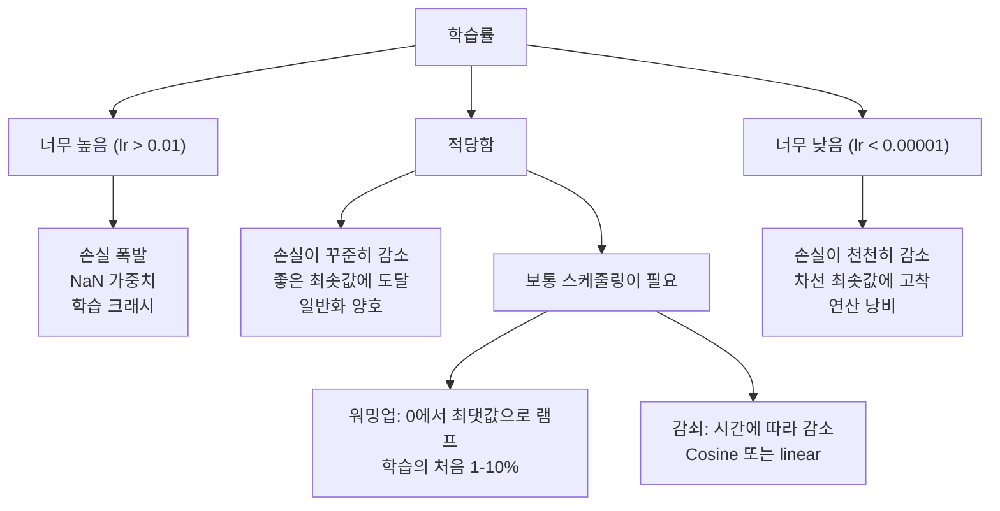
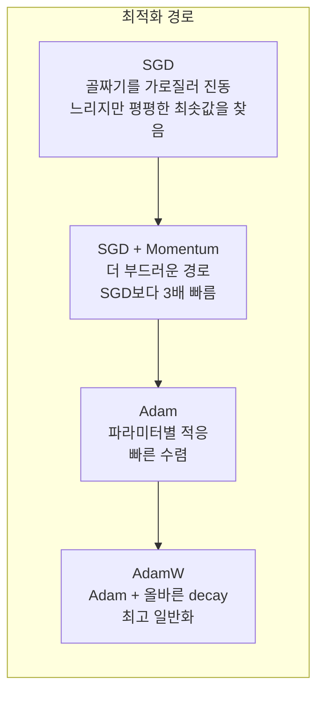
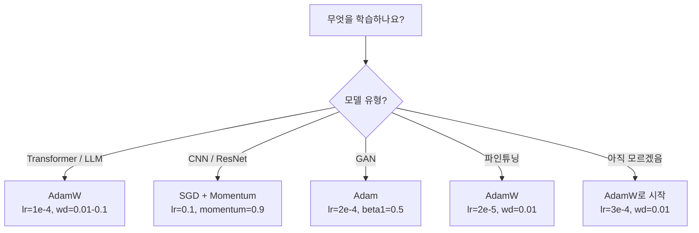

# 옵티마이저 (Optimizers)

> 경사 하강은 어느 방향으로 움직일지 알려 줍니다. 얼마나 멀리, 얼마나 빠르게는 말하지 않습니다. SGD는 나침반입니다. Adam은 교통 데이터가 있는 GPS입니다.

**Type:** Build
**Languages:** Python
**Prerequisites:** Lesson 03.05 (Loss Functions)
**Time:** ~75 minutes

## 학습 목표 (Learning Objectives)

- SGD, 모멘텀 있는 SGD, Adam, AdamW 옵티마이저를 Python으로 처음부터 구현합니다
- Adam의 편향 보정(bias correction)이 학습 초기 스텝에서 0으로 초기화된 모멘트 추정치를 어떻게 보상하는지 설명합니다
- 같은 과제에서 Adam + L2 정규화보다 AdamW가 더 나은 일반화를 내는 이유를 시연합니다
- transformer, CNN, GAN, 파인튜닝에 맞는 옵티마이저와 기본 하이퍼파라미터를 선택합니다

## 문제 상황 (The Problem)

기울기를 계산했습니다. 가중치 #4,721이 손실을 줄이려면 0.003만큼 감소해야 한다는 것을 압니다. 하지만 0.003은 어떤 단위인가요? 무엇으로 스케일하나요? 그리고 1스텝에서와 1,000스텝에서 같은 양만큼 움직여야 하나요?

바닐라 경사 하강은 매 스텝마다 모든 파라미터에 같은 학습률을 적용합니다: w = w - lr * gradient. 이는 실무에서 신경망 학습을 고통스럽게 만드는 세 가지 문제를 만듭니다.

첫째, 진동. 손실 지형은 거의 매끄러운 그릇 모양이 아닙니다. 길고 좁은 골짜기에 가깝습니다. 기울기는 골짜기를 가로지르는 방향(가파른 방향)을 가리키고, 따라가는 방향(얕은 방향)이 아닙니다. 경사 하강은 좁은 차원에서 앞뒤로 튕기며 유용한 방향으로는 아주 조금만 진행합니다. 본 적 있을 것입니다: 손실이 빠르게 떨어지다 정체합니다. 모델이 수렴해서가 아니라 진동하고 있기 때문입니다.

둘째, 모든 파라미터에 하나의 학습률은 틀립니다. 어떤 가중치는 큰 갱신이 필요합니다(초기, 과소적합 단계). 다른 것은 아주 작은 갱신이 필요합니다(최적값 근처). 전자에 맞는 학습률은 후자를 망가뜨리고, 그 반대도 마찬가지입니다.

셋째, 안장점(saddle points). 고차원에서 손실 지형에는 기울기가 거의 0인 광활한 평평한 영역이 있습니다. 바닐라 SGD는 이 영역을 기울기 속도로 기어가며, 사실상 0입니다. 모델이 멈춘 것처럼 보입니다. 멈춘 것이 아닙니다 — 반대편에 유용한 하강이 있는 평평한 영역에 있을 뿐입니다. 하지만 SGD에는 밀어 통과할 메커니즘이 없습니다.

Adam은 세 가지를 모두 풉니다. 파라미터마다 두 개의 이동 평균을 유지합니다 — 평균 기울기(모멘텀, 진동 처리)와 평균 제곱 기울기(적응형 비율, 서로 다른 스케일 처리). 처음 몇 스텝을 위한 편향 보정과 결합하면, 기본 하이퍼파라미터로 문제의 80%에서 동작하는 단일 옵티마이저를 얻습니다. 이 레슨은 나머지 20%에서 언제, 왜 실패하는지 정확히 이해하도록 처음부터 만듭니다.

## 핵심 개념 (The Concept)

### 확률적 경사 하강 (Stochastic Gradient Descent, SGD)

가장 단순한 옵티마이저입니다. 미니배치에서 기울기를 계산하고 반대 방향으로 한 걸음 내딛습니다.

```
w = w - lr * gradient
```

"확률적"은 전체 데이터셋이 아니라 데이터의 무작위 부분집합(미니배치)으로 기울기를 추정한다는 뜻입니다. 이 노이즈는 실제로 유용합니다 — 날카로운 국소 최솟값에서 빠져나오는 데 도움이 됩니다. 하지만 노이즈는 진동도 유발합니다.

학습률이 유일한 노브입니다. 너무 높으면: 손실이 발산합니다. 너무 낮으면: 학습에 영원히 걸립니다. 최적값은 아키텍처, 데이터, 배치 크기, 현재 학습 단계에 따라 달라집니다. 현대 네트워크의 바닐라 SGD에서 전형적 값은 0.01에서 0.1입니다. 하지만 단일 학습 실행 안에서도 이상적인 학습률은 바뀝니다.

### 모멘텀 (Momentum)

언덕을 굴러 내려가는 공 비유는 남용되지만 정확합니다. 기울기만으로 한 걸음 내딛는 대신, 과거 기울기를 누적하는 속도를 유지합니다.

```
m_t = beta * m_{t-1} + gradient
w = w - lr * m_t
```

Beta(보통 0.9)는 얼마나 많은 이력을 유지할지 제어합니다. beta = 0.9이면 모멘텀은 대략 최근 10개 기울기의 평균입니다 (1 / (1 - 0.9) = 10).

이것이 진동을 고치는 이유: 같은 방향을 가리키는 기울기는 누적됩니다. 방향을 뒤집는 기울기는 상쇄됩니다. 그 좁은 골짜기에서 "가로지르는" 성분은 매 스텝 부호가 바뀌어 감쇠됩니다. "따라가는" 성분은 일관되어 증폭됩니다. 결과는 유용한 방향으로의 부드러운 가속입니다.

실제 숫자: 조건이 나쁜 손실 지형에서 SGD 단독은 10,000 스텝이 걸릴 수 있습니다. 모멘텀 있는 SGD(beta=0.9)는 같은 문제에서 보통 3,000-5,000 스텝입니다. 가속은 미미하지 않습니다.

### RMSProp

실제로 동작한 첫 파라미터별 적응형 학습률 방법입니다. Hinton이 Coursera 강의에서 제안했습니다(정식으로 출판된 적 없음).

```
s_t = beta * s_{t-1} + (1 - beta) * gradient^2
w = w - lr * gradient / (sqrt(s_t) + epsilon)
```

s_t는 제곱 기울기의 이동 평균을 추적합니다. 일관되게 큰 기울기를 가진 파라미터는 큰 수로 나뉩니다(유효 학습률이 작아짐). 작은 기울기를 가진 파라미터는 작은 수로 나뉩니다(유효 학습률이 커짐).

이는 "모든 파라미터에 하나의 학습률" 문제를 풉니다. 이미 큰 갱신을 받아 온 가중치는 아마 목표 근처입니다 — 늦추세요. 아주 작은 갱신만 받아 온 가중치는 학습이 부족할 수 있습니다 — 속도를 올리세요.

Epsilon(보통 1e-8)은 파라미터가 갱신되지 않았을 때 0으로 나누는 것을 막습니다.

### Adam: 모멘텀 + RMSProp

Adam은 두 아이디어를 결합합니다. 파라미터마다 두 개의 지수 이동 평균을 유지합니다:

```
m_t = beta1 * m_{t-1} + (1 - beta1) * gradient        (first moment: mean)
v_t = beta2 * v_{t-1} + (1 - beta2) * gradient^2       (second moment: variance)
```

**편향 보정(Bias correction)** 이 대부분의 설명이 건너뛰는 핵심 세부입니다. 1스텝에서 m_1 = (1 - beta1) * gradient입니다. beta1 = 0.9이면 0.1 * gradient — 열 배 너무 작습니다. 이동 평균이 아직 워밍업되지 않았습니다. 편향 보정이 보상합니다:

```
m_hat = m_t / (1 - beta1^t)
v_hat = v_t / (1 - beta2^t)
```

beta1 = 0.9인 1스텝에서: m_hat = m_1 / (1 - 0.9) = m_1 / 0.1 = 실제 기울기. 100스텝에서: (1 - 0.9^100)은 대략 1.0이므로 보정이 사라집니다. 편향 보정은 처음 ~10 스텝에서 중요하고 ~50 이후에는 무관합니다.

갱신:

```
w = w - lr * m_hat / (sqrt(v_hat) + epsilon)
```

Adam 기본값: lr = 0.001, beta1 = 0.9, beta2 = 0.999, epsilon = 1e-8. 이 기본값은 문제의 80%에서 동작합니다. 안 되면 먼저 lr을 바꾸세요. 그다음 beta2. beta1이나 epsilon은 거의 바꾸지 마세요.

### AdamW: Weight Decay를 올바르게

L2 정규화는 손실에 lambda * w^2를 더합니다. 바닐라 SGD에서 이는 weight decay(매 스텝 가중치에서 lambda * w를 빼는 것)와 동등합니다. Adam에서는 이 동등성이 깨집니다.

Loshchilov & Hutter의 통찰: 손실에 L2를 더한 뒤 Adam이 기울기를 처리하면, 적응형 학습률이 정규화 항도 스케일합니다. 기울기 분산이 큰 파라미터는 정규화를 덜 받고, 분산이 작은 파라미터는 더 받습니다. 원하는 것이 아닙니다 — 기울기 통계와 무관하게 균일한 정규화를 원합니다.

AdamW는 Adam 갱신 뒤에 weight decay를 가중치에 직접 적용해 이를 고칩니다:

```
w = w - lr * m_hat / (sqrt(v_hat) + epsilon) - lr * lambda * w
```

weight decay 항(lr * lambda * w)은 Adam의 적응형 인자에 의해 스케일되지 않습니다. 모든 파라미터가 같은 비례 수축을 받습니다.

사소한 세부처럼 보입니다. 아닙니다. AdamW는 Adam + L2 정규화보다 거의 모든 과제에서 더 나은 해로 수렴합니다. transformer, diffusion 모델, 대부분의 현대 아키텍처 학습에서 PyTorch의 기본 옵티마이저입니다. BERT, GPT, LLaMA, Stable Diffusion — 모두 AdamW로 학습되었습니다.

### 학습률: 가장 중요한 하이퍼파라미터



하이퍼파라미터 하나를 튜닝한다면, 학습률을 튜닝하세요. 학습률의 10배 변화가 당신이 내릴 어떤 아키텍처 결정보다 더 중요합니다. 흔한 기본값:

- SGD: lr = 0.01 to 0.1
- Adam/AdamW: lr = 1e-4 to 3e-4
- 사전학습 모델 파인튜닝: lr = 1e-5 to 5e-5
- 학습률 워밍업: 처음 1-10% 스텝에 선형 램프

### 옵티마이저 비교



### 각 옵티마이저가 이기는 때



```figure
optimizer-trajectory
```

## 직접 만들기 (Build It)

### 1단계: 바닐라 SGD

```python
class SGD:
    def __init__(self, lr=0.01):
        self.lr = lr

    def step(self, params, grads):
        for i in range(len(params)):
            params[i] -= self.lr * grads[i]
```

### 2단계: 모멘텀 있는 SGD

```python
class SGDMomentum:
    def __init__(self, lr=0.01, beta=0.9):
        self.lr = lr
        self.beta = beta
        self.velocities = None

    def step(self, params, grads):
        if self.velocities is None:
            self.velocities = [0.0] * len(params)
        for i in range(len(params)):
            self.velocities[i] = self.beta * self.velocities[i] + grads[i]
            params[i] -= self.lr * self.velocities[i]
```

### 3단계: Adam

```python
import math

class Adam:
    def __init__(self, lr=0.001, beta1=0.9, beta2=0.999, epsilon=1e-8):
        self.lr = lr
        self.beta1 = beta1
        self.beta2 = beta2
        self.epsilon = epsilon
        self.m = None
        self.v = None
        self.t = 0

    def step(self, params, grads):
        if self.m is None:
            self.m = [0.0] * len(params)
            self.v = [0.0] * len(params)

        self.t += 1

        for i in range(len(params)):
            self.m[i] = self.beta1 * self.m[i] + (1 - self.beta1) * grads[i]
            self.v[i] = self.beta2 * self.v[i] + (1 - self.beta2) * grads[i] ** 2

            m_hat = self.m[i] / (1 - self.beta1 ** self.t)
            v_hat = self.v[i] / (1 - self.beta2 ** self.t)

            params[i] -= self.lr * m_hat / (math.sqrt(v_hat) + self.epsilon)
```

### 4단계: AdamW

```python
class AdamW:
    def __init__(self, lr=0.001, beta1=0.9, beta2=0.999, epsilon=1e-8, weight_decay=0.01):
        self.lr = lr
        self.beta1 = beta1
        self.beta2 = beta2
        self.epsilon = epsilon
        self.weight_decay = weight_decay
        self.m = None
        self.v = None
        self.t = 0

    def step(self, params, grads):
        if self.m is None:
            self.m = [0.0] * len(params)
            self.v = [0.0] * len(params)

        self.t += 1

        for i in range(len(params)):
            self.m[i] = self.beta1 * self.m[i] + (1 - self.beta1) * grads[i]
            self.v[i] = self.beta2 * self.v[i] + (1 - self.beta2) * grads[i] ** 2

            m_hat = self.m[i] / (1 - self.beta1 ** self.t)
            v_hat = self.v[i] / (1 - self.beta2 ** self.t)

            params[i] -= self.lr * m_hat / (math.sqrt(v_hat) + self.epsilon)
            params[i] -= self.lr * self.weight_decay * params[i]
```

### 5단계: 학습 비교

레슨 05의 원 데이터셋에서 같은 두 층 네트워크를 네 옵티마이저로 학습합니다. 수렴을 비교합니다.

```python
import random

def sigmoid(x):
    x = max(-500, min(500, x))
    return 1.0 / (1.0 + math.exp(-x))

def make_circle_data(n=200, seed=42):
    random.seed(seed)
    data = []
    for _ in range(n):
        x = random.uniform(-2, 2)
        y = random.uniform(-2, 2)
        label = 1.0 if x * x + y * y < 1.5 else 0.0
        data.append(([x, y], label))
    return data


class OptimizerTestNetwork:
    def __init__(self, optimizer, hidden_size=8):
        random.seed(0)
        self.hidden_size = hidden_size
        self.optimizer = optimizer

        self.w1 = [[random.gauss(0, 0.5) for _ in range(2)] for _ in range(hidden_size)]
        self.b1 = [0.0] * hidden_size
        self.w2 = [random.gauss(0, 0.5) for _ in range(hidden_size)]
        self.b2 = 0.0

    def get_params(self):
        params = []
        for row in self.w1:
            params.extend(row)
        params.extend(self.b1)
        params.extend(self.w2)
        params.append(self.b2)
        return params

    def set_params(self, params):
        idx = 0
        for i in range(self.hidden_size):
            for j in range(2):
                self.w1[i][j] = params[idx]
                idx += 1
        for i in range(self.hidden_size):
            self.b1[i] = params[idx]
            idx += 1
        for i in range(self.hidden_size):
            self.w2[i] = params[idx]
            idx += 1
        self.b2 = params[idx]

    def forward(self, x):
        self.x = x
        self.z1 = []
        self.h = []
        for i in range(self.hidden_size):
            z = self.w1[i][0] * x[0] + self.w1[i][1] * x[1] + self.b1[i]
            self.z1.append(z)
            self.h.append(max(0.0, z))

        self.z2 = sum(self.w2[i] * self.h[i] for i in range(self.hidden_size)) + self.b2
        self.out = sigmoid(self.z2)
        return self.out

    def compute_grads(self, target):
        eps = 1e-15
        p = max(eps, min(1 - eps, self.out))
        d_loss = -(target / p) + (1 - target) / (1 - p)
        d_sigmoid = self.out * (1 - self.out)
        d_out = d_loss * d_sigmoid

        grads = [0.0] * (self.hidden_size * 2 + self.hidden_size + self.hidden_size + 1)
        idx = 0
        for i in range(self.hidden_size):
            d_relu = 1.0 if self.z1[i] > 0 else 0.0
            d_h = d_out * self.w2[i] * d_relu
            grads[idx] = d_h * self.x[0]
            grads[idx + 1] = d_h * self.x[1]
            idx += 2

        for i in range(self.hidden_size):
            d_relu = 1.0 if self.z1[i] > 0 else 0.0
            grads[idx] = d_out * self.w2[i] * d_relu
            idx += 1

        for i in range(self.hidden_size):
            grads[idx] = d_out * self.h[i]
            idx += 1

        grads[idx] = d_out
        return grads

    def train(self, data, epochs=300):
        losses = []
        for epoch in range(epochs):
            total_loss = 0.0
            correct = 0
            for x, y in data:
                pred = self.forward(x)
                grads = self.compute_grads(y)
                params = self.get_params()
                self.optimizer.step(params, grads)
                self.set_params(params)

                eps = 1e-15
                p = max(eps, min(1 - eps, pred))
                total_loss += -(y * math.log(p) + (1 - y) * math.log(1 - p))
                if (pred >= 0.5) == (y >= 0.5):
                    correct += 1
            avg_loss = total_loss / len(data)
            accuracy = correct / len(data) * 100
            losses.append((avg_loss, accuracy))
            if epoch % 75 == 0 or epoch == epochs - 1:
                print(f"    Epoch {epoch:3d}: loss={avg_loss:.4f}, accuracy={accuracy:.1f}%")
        return losses
```

## 활용하기 (Use It)

PyTorch 옵티마이저는 파라미터 그룹, 기울기 클리핑, 학습률 스케줄링을 처리합니다:

```python
import torch
import torch.optim as optim

model = torch.nn.Sequential(
    torch.nn.Linear(784, 256),
    torch.nn.ReLU(),
    torch.nn.Linear(256, 10),
)

optimizer = optim.AdamW(model.parameters(), lr=3e-4, weight_decay=0.01)

scheduler = optim.lr_scheduler.CosineAnnealingLR(optimizer, T_max=100)

for epoch in range(100):
    optimizer.zero_grad()
    output = model(torch.randn(32, 784))
    loss = torch.nn.functional.cross_entropy(output, torch.randint(0, 10, (32,)))
    loss.backward()
    torch.nn.utils.clip_grad_norm_(model.parameters(), max_norm=1.0)
    optimizer.step()
    scheduler.step()
```

패턴은 항상: zero_grad, forward, loss, backward, (clip), step, (schedule). 이 순서를 외우세요. 틀리면(예: optimizer.step() 전에 scheduler.step() 호출) 미묘한 버그의 흔한 원인이 됩니다.

CNN에서는 많은 실무자가 여전히 SGD + momentum(lr=0.1, momentum=0.9, weight_decay=1e-4)과 step 또는 cosine 스케줄을 선호합니다. SGD는 더 평평한 최솟값을 찾아 종종 더 잘 일반화합니다. transformer와 LLM에서는 warmup + cosine decay가 있는 AdamW가 보편적 기본값입니다. 측정된 이유 없이 합의를 거스르지 마세요.

## 산출물 (Ship It)

이 레슨이 만드는 것:
- `outputs/prompt-optimizer-selector.md` -- 어떤 아키텍처든 맞는 옵티마이저와 학습률을 고르는 결정 프롬프트

## 연습 문제 (Exercises)

1. Nesterov 모멘텀을 구현하세요. 현재 위치가 아니라 "lookahead" 위치(w - lr * beta * v)에서 기울기를 계산합니다. 원 데이터셋에서 표준 모멘텀과 수렴을 비교하세요.

2. 학습률 워밍업 스케줄을 구현하세요: 처음 10% 학습 스텝에 0에서 max_lr로 선형 램프, 그다음 0으로 cosine decay. Adam + warmup vs warmup 없는 Adam으로 학습하세요. 원 데이터셋에서 정확도 90%에 도달하는 데 걸리는 에폭 수를 측정하세요.

3. Adam 학습 중 각 파라미터의 유효 학습률을 추적하세요. 유효 비율은 lr * m_hat / (sqrt(v_hat) + eps)입니다. 10, 50, 200 스텝 후 유효 비율 분포를 플롯하세요. 모든 파라미터가 같은 속도로 갱신되고 있나요?

4. 기울기 클리핑(전역 노름으로 클립)을 구현하세요. 최대 기울기 노름을 1.0으로 설정하세요. Adam에 높은 학습률(lr=0.01)로 클리핑 있음/없음으로 학습하세요. 무작위 시드 10개에 걸쳐 발산(손실이 NaN)하는 실행 수를 세세요.

5. 큰 가중치가 있는 네트워크에서 Adam vs AdamW를 비교하세요. 모든 가중치를 [-5, 5]의 무작위 값으로 초기화하세요(정상보다 훨씬 큼). weight_decay=0.1로 200 에폭 학습하세요. 두 옵티마이저에 대해 학습 중 가중치의 L2 노름을 플롯하세요. AdamW가 더 빠른 가중치 수축을 보여야 합니다.

## 핵심 용어 (Key Terms)

| Term | What people say | What it actually means |
|------|----------------|----------------------|
| Learning rate | "스텝 크기" | 기울기 갱신에 곱하는 스칼라; 학습에서 가장 영향력 있는 단일 하이퍼파라미터 |
| SGD | "기본 경사 하강" | 확률적 경사 하강: 미니배치에서 계산한 lr * gradient를 빼 가중치를 갱신 |
| Momentum | "굴러가는 공 비유" | 과거 기울기의 지수 이동 평균; 진동을 감쇠하고 일관된 방향을 가속 |
| RMSProp | "적응형 학습률" | 각 파라미터의 기울기를 최근 기울기의 이동 RMS로 나눔; 학습률을 균등화 |
| Adam | "기본 옵티마이저" | 모멘텀(1차 모멘트)과 RMSProp(2차 모멘트)을 결합하고, 초기 스텝을 위한 편향 보정 포함 |
| AdamW | "제대로 된 Adam" | 분리된 weight decay가 있는 Adam; 기울기를 통하지 않고 가중치에 직접 정규화 적용 |
| Bias correction | "이동 평균용 워밍업" | Adam 모멘트 추정치의 0 초기화를 보상하기 위해 (1 - beta^t)로 나눔 |
| Weight decay | "가중치를 수축" | 매 스텝 가중치 값의 일부를 빼는 것; 큰 가중치를 벌하는 정규화 |
| Learning rate schedule | "시간에 따라 lr 변경" | 학습 중 학습률을 조정하는 함수; warmup + cosine decay가 현대 기본값 |
| Gradient clipping | "기울기 노름 상한" | 노름이 임계값을 넘으면 기울기 벡터를 축소; 폭발하는 기울기 갱신을 방지 |

## 더 읽을거리 (Further Reading)

- Kingma & Ba, "Adam: A Method for Stochastic Optimization" (2014) -- 수렴 분석과 편향 보정 유도가 있는 원본 Adam 논문
- Loshchilov & Hutter, "Decoupled Weight Decay Regularization" (2017) -- Adam에서 L2 정규화와 weight decay가 동등하지 않음을 증명하고 AdamW를 제안
- Smith, "Cyclical Learning Rates for Training Neural Networks" (2017) -- 고정 학습률 튜닝이 필요 없는 LR range test와 주기적 스케줄 도입
- Ruder, "An Overview of Gradient Descent Optimization Algorithms" (2016) -- 모든 옵티마이저 변형에 대한 최고의 단일 서베이. 명확한 비교와 직관
