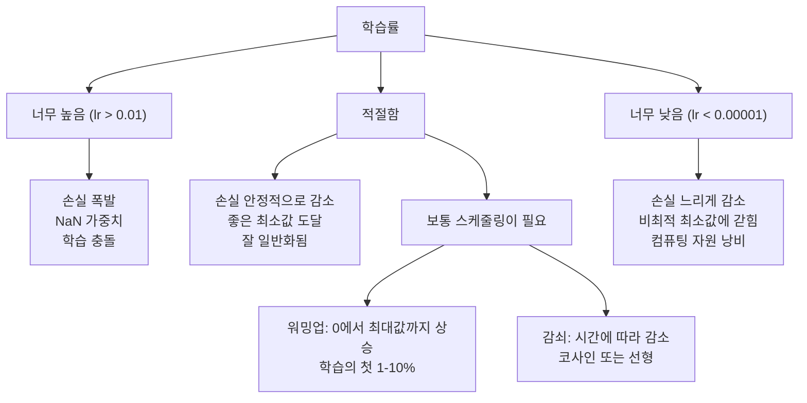
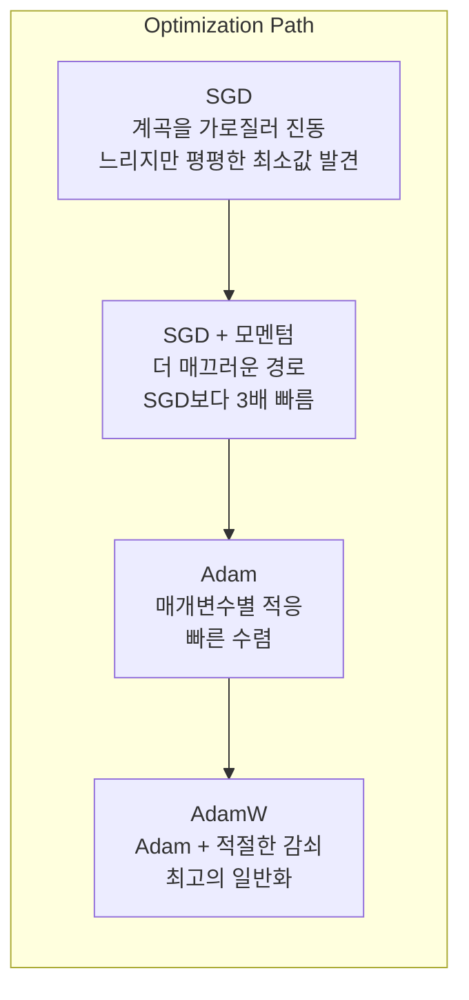
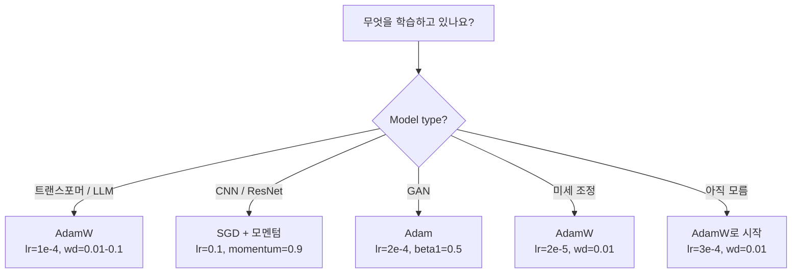

# 옵티마이저

> 경사 하강법은 어느 방향으로 이동해야 하는지 알려줍니다. 얼마나 멀리, 얼마나 빠르게 이동해야 하는지는 말하지 않습니다. SGD는 나침반입니다. Adam은 교통 데이터가 포함된 GPS입니다.

**유형:** Build
**언어:** Python
**선수 요건:** 03.05강 (손실 함수)
**시간:** 약 75분

## 학습 목표

- Python에서 SGD, 모멘텀이 포함된 SGD, Adam, AdamW 옵티마이저를 처음부터 구현해 보세요
- Adam의 편향 보정이 초기 학습 단계에서 0으로 초기화된 모멘트 추정치를 어떻게 보상하는지 설명해 보세요
- 동일한 작업에서 AdamW가 L2 정규화를 사용한 Adam보다 더 나은 일반화를 생성하는 이유를 시연해 보세요
- 트랜스포머, CNN, GAN, 미세 조정용 옵티마이저와 기본 하이퍼파라미터를 선택해 보세요

## 문제점

기울기를 계산했습니다. 가중치 #4,721은 손실을 줄이기 위해 0.003만큼 감소해야 한다는 것을 알고 있습니다. 하지만 0.003은 어떤 단위로 측정된 값일까요? 어떤 값으로 스케일링해야 할까요? 그리고 1단계와 1,000단계에서 동일한 양만큼 이동해야 할까요?

기본 경사 하강법은 모든 단계에서 모든 매개변수에 동일한 학습률을 적용합니다: w = w - lr * gradient. 이는 신경망 학습을 실제로 어렵게 만드는 세 가지 문제를 생성합니다.

첫째, 진동입니다. 손실 지형은 매끄러운 그릇 모양인 경우가 드뭅니다. 길고 좁은 계곡에 더 가깝습니다. 기울기는 계곡을 가로지르는 방향(가파른 방향)을 가리키며, 계곡을 따라가는 방향(평평한 방향)을 가리키지 않습니다. 경사 하강법은 좁은 차원에서 앞뒤로 진동하며 유용한 차원에서는微小的인 진전만 만듭니다. 이를 본 적이 있을 것입니다: 손실이 빠르게 떨어졌다가 평평해지는데, 이는 모델이 수렴했기 때문이 아니라 진동하고 있기 때문입니다.

둘째, 모든 매개변수에 하나의 학습률을 적용하는 것은 잘못되었습니다. 일부 가중치는 큰 업데이트가 필요합니다(초기 과소 적합 단계에 있습니다). 다른 가중치는 작은 업데이트가 필요합니다(최적 값에 가깝습니다). 전자에게 효과가 있는 학습률은 후자를 파괴하며, 그 반대도 마찬가지입니다.

셋째, 안장점(saddle points)입니다. 고차원에서는 손실 지형에 기울기가 거의 0인 광대한 평탄한 영역이 존재합니다. 바닐라 SGD는 기울기가 사실상 0인 속도로 이 영역을 기어다니며, 모델은 갇힌 것처럼 보입니다. 실제로는 갇힌 것이 아니라 반대편에 유용한 하강 경로가 있는 평탄한 영역에 있는 것입니다. 하지만 SGD는 이를 뚫고 나갈 메커니즘이 없습니다.

Adam은 이 세 가지 문제를 모두 해결합니다. 매개변수마다 두 개의 이동 평균을 유지합니다. 평균 기울기(모멘텀, 진동 처리)와 평균 제곱 기울기(적응형 학습률, 스케일 차이 처리)입니다. 초기 몇 단계에 대한 편향 보정과 결합하면, 기본 하이퍼파라미터로 80%의 문제에 작동하는 단일 옵티마이저를 얻을 수 있습니다. 이 강의에서는 Adam을 처음부터 구축하여 나머지 20%의 문제에서 정확히 언제, 왜 실패하는지 이해해 보세요.

## 개념

### 확률적 경사 하강법 (SGD)(Stochastic Gradient Descent (SGD))

가장 단순한 옵티마이저입니다. 미니배치에서 기울기를 계산하고 반대 방향으로 한 단계 이동합니다.

```
w = w - lr * gradient
```

"확률적(stochastic)"이라는 용어는 전체 데이터셋이 아닌 데이터의 랜덤 서브셋(미니배치)을 사용하여 기울기를 추정한다는 의미입니다. 이 잡음은 실제로 유용하며, 날카로운 국소 최소값을 벗어나는 데 도움이 됩니다. 하지만 이 잡음은 진동도 유발합니다.

학습률은 유일한 조절 변수입니다. 너무 높으면 손실이 발산합니다. 너무 낮으면 학습이 영원히 걸립니다. 최적 값은 아키텍처, 데이터, 배치 크기, 현재 학습 단계에 따라 달라집니다. 현대 네트워크에서 바닐라 SGD의 경우, 일반적인 값은 0.01에서 0.1 사이입니다. 하지만 단일 학습 실행 내에서도 이상적인 학습률은 변합니다.

### 모멘텀

공이 언덕을 굴러 내려가는 비유는 과용되지만 정확합니다. 기울기만으로 한 단계 이동하는 대신, 과거 기울기를 누적하는 속도를 유지합니다.

```
m_t = beta * m_{t-1} + gradient
w = w - lr * m_t
```

Beta (일반적으로 0.9)는 얼마나 많은 히스토리를 유지할지 제어합니다. Beta = 0.9인 경우, 모멘텀은 대략 마지막 10개 기울기의 평균입니다 (1 / (1 - 0.9) = 10).

이것이 진동을 해결하는 이유는 다음과 같습니다. 같은 방향을 가리키는 기울기는 누적되고, 방향이 뒤집히는 기울기는 상쇄됩니다. 좁은 골짜기에서는 "가로" 성분이 매 단계 부호가 뒤집혀 감쇠됩니다. "세로" 성분은 일관성을 유지하며 증폭됩니다. 그 결과, 유용한 방향으로 매끄러운 가속이 발생합니다.

실수: 나쁜 조건 손실 지형에서 SGD만 사용한다면 10,000 스텝이 걸릴 수 있습니다. 모멘텀(beta=0.9)을 사용한 SGD는 같은 문제에서 보통 3,000-5,000 스텝이 걸립니다. 속도 향상은 미미하지 않습니다.

### RMSProp

실제로 작동한 최초의 매개변수별 적응형 학습률 방법입니다. Hinton이 Coursera 강의에서 제안했습니다(공식적으로 출판되지 않았습니다).

```
s_t = beta * s_{t-1} + (1 - beta) * gradient^2
w = w - lr * gradient / (sqrt(s_t) + epsilon)
```

s_t는 기울기 제곱의 이동 평균을 추적합니다. 일관되게 큰 기울기를 가진 매개변수는 큰 수로 나누어집니다(더 작은 유효 학습률). 작은 기울기를 가진 매개변수는 작은 수로 나누어집니다(더 큰 유효 학습률).

이 방법은 "모든 매개변수에 하나의 학습률" 문제를 해결합니다. 이미 큰 업데이트를 받고 있는 가중치는 아마도 목표에 가까울 것입니다 -- 속도를 늦추세요. 작은 업데이트만 받고 있는 가중치는 과소 학습되었을 수 있습니다 -- 속도를 높이세요.

Epsilon(보통 1e-8)은 매개변수가 업데이트되지 않았을 때 0으로 나누는 것을 방지합니다.

### Adam: 모멘텀 + RMSProp

Adam은 두 아이디어를 결합합니다. 매개변수마다 두 개의 지수 이동 평균을 유지합니다:

```
m_t = beta1 * m_{t-1} + (1 - beta1) * gradient        (first moment: mean)
v_t = beta2 * v_{t-1} + (1 - beta2) * gradient^2       (second moment: variance)
```

**편향 보정**은 대부분의 설명이 건너뛰는 핵심 세부 사항입니다. 스텝 1에서, m_1 = (1 - beta1) * 기울기입니다. beta1 = 0.9이면, 이는 0.1 * 기울기 -- 10배 너무 작습니다. 이동 평균이 아직 워밍업되지 않았습니다. 편향 보정이 이를 보상합니다:

```
m_hat = m_t / (1 - beta1^t)
v_hat = v_t / (1 - beta2^t)
```

beta1 = 0.9인 스텝 1에서: m_hat = m_1 / (1 - 0.9) = m_1 / 0.1 = 실제 기울기입니다. 스텝 100에서: (1 - 0.9^100)은 대략 1.0이므로, 보정은 사라집니다. 편향 보정은 첫 ~10 스텝에서 중요하며 ~50 이후에는 관련이 없습니다.

업데이트:

```
w = w - lr * m_hat / (sqrt(v_hat) + epsilon)
```

Adam 기본값: lr = 0.001, beta1 = 0.9, beta2 = 0.999, epsilon = 1e-8. 이 기본값은 문제의 80%에 대해 작동합니다. 작동하지 않을 때, 먼저 lr을 변경하세요. 그 다음 beta2를 변경하세요. beta1이나 epsilon은 거의 변경하지 마세요.

### AdamW: 가중치 감쇠를 올바르게 수행하기

L2 정규화는 손실에 lambda * w^2를 더합니다. 바닐라 SGD에서는 이것이 가중치 감쇠(각 스텝에서 가중치에서 lambda * w를 빼는 것)와 동일합니다. Adam에서는 이 등가성이 깨집니다.

Loshchilov & Hutter의 통찰: 손실 함수에 L2를 더한 후 Adam이 기울기를 처리하면, 적응형 학습률이 정규화 항도 스케일링합니다. 기울기 분산이 큰 매개변수는 정규화가 적게 적용되고, 분산이 작은 매개변수는 정규화가 더 많이 적용됩니다. 이는 원하지 않는 동작입니다. 기울기 통계와 무관하게 균일한 정규화가 적용되기를 원합니다.

AdamW는 Adam 업데이트 이후 가중치에 가중치 감쇠를 직접 적용하여 이 문제를 해결합니다:

```
w = w - lr * m_hat / (sqrt(v_hat) + epsilon) - lr * lambda * w
```

가중치 감쇠 항(lr * lambda * w)은 Adam의 적응형 계수에 의해 스케일링되지 않습니다. 모든 매개변수가 동일한 비율로 축소됩니다.

이것은 사소한 세부 사항처럼 보이지만, 그렇지 않습니다. AdamW는 거의 모든 작업에서 Adam + L2 정규화보다 더 나은 해로 수렴합니다. PyTorch에서 트랜스포머, 확산 모델 및 대부분의 최신 아키텍처를 학습할 때의 기본 옵티마이저입니다. BERT, GPT, LLaMA, Stable Diffusion -- 모두 AdamW로 학습되었습니다.

### 학습률: 가장 중요한 하이퍼파라미터



하이퍼파라미터를 하나만 조정한다면, 학습률을 조정하세요. 학습률을 10배 변경하는 것은 어떤 아키텍처 결정보다 더 중요합니다. 일반적인 기본값:

- SGD: lr = 0.01 ~ 0.1
- Adam/AdamW: lr = 1e-4 ~ 3e-4
- 사전 학습된 모델의 미세 조정: lr = 1e-5 ~ 5e-5
- 학습률 워밍업: 첫 1-10% 단계 동안 선형 상승

### 옵티마이저 비교



### 각 옵티마이저가 이기는 경우



```figure
optimizer-trajectory
```

## 구현하기

### 1단계: 기본 SGD

```python
class SGD:
    def __init__(self, lr=0.01):
        self.lr = lr

    def step(self, params, grads):
        for i in range(len(params)):
            params[i] -= self.lr * grads[i]
```

### 2단계: 모멘텀이 포함된 SGD

```python
class SGDMomentum:
    def __init__(self, lr=0.01, beta=0.9):
        self.lr = lr
        self.beta = beta
        self.velocities = None

    def step(self, params, grads):
        if self.velocities is None:
            self.velocities = [0.0] * len(params)
        for i in range(len(params)):
            self.velocities[i] = self.beta * self.velocities[i] + grads[i]
            params[i] -= self.lr * self.velocities[i]
```

### 3단계: Adam

```python
import math

class Adam:
    def __init__(self, lr=0.001, beta1=0.9, beta2=0.999, epsilon=1e-8):
        self.lr = lr
        self.beta1 = beta1
        self.beta2 = beta2
        self.epsilon = epsilon
        self.m = None
        self.v = None
        self.t = 0

    def step(self, params, grads):
        if self.m is None:
            self.m = [0.0] * len(params)
            self.v = [0.0] * len(params)

        self.t += 1

        for i in range(len(params)):
            self.m[i] = self.beta1 * self.m[i] + (1 - self.beta1) * grads[i]
            self.v[i] = self.beta2 * self.v[i] + (1 - self.beta2) * grads[i] ** 2

            m_hat = self.m[i] / (1 - self.beta1 ** self.t)
            v_hat = self.v[i] / (1 - self.beta2 ** self.t)

            params[i] -= self.lr * m_hat / (math.sqrt(v_hat) + self.epsilon)
```

### 4단계: AdamW

```python
class AdamW:
    def __init__(self, lr=0.001, beta1=0.9, beta2=0.999, epsilon=1e-8, weight_decay=0.01):
        self.lr = lr
        self.beta1 = beta1
        self.beta2 = beta2
        self.epsilon = epsilon
        self.weight_decay = weight_decay
        self.m = None
        self.v = None
        self.t = 0

    def step(self, params, grads):
        if self.m is None:
            self.m = [0.0] * len(params)
            self.v = [0.0] * len(params)

        self.t += 1

        for i in range(len(params)):
            self.m[i] = self.beta1 * self.m[i] + (1 - self.beta1) * grads[i]
            self.v[i] = self.beta2 * self.v[i] + (1 - self.beta2) * grads[i] ** 2

            m_hat = self.m[i] / (1 - self.beta1 ** self.t)
            v_hat = self.v[i] / (1 - self.beta2 ** self.t)

            params[i] -= self.lr * m_hat / (math.sqrt(v_hat) + self.epsilon)
            params[i] -= self.lr * self.weight_decay * params[i]
```

### 5단계: 학습 비교

05강의 원형 데이터셋에 동일한 두 층 네트워크를 네 가지 옵티마이저로 학습합니다. 수렴을 비교해 보세요.

```python
import random

def sigmoid(x):
    x = max(-500, min(500, x))
    return 1.0 / (1.0 + math.exp(-x))

def make_circle_data(n=200, seed=42):
    random.seed(seed)
    data = []
    for _ in range(n):
        x = random.uniform(-2, 2)
        y = random.uniform(-2, 2)
        label = 1.0 if x * x + y * y < 1.5 else 0.0
        data.append(([x, y], label))
    return data


class OptimizerTestNetwork:
    def __init__(self, optimizer, hidden_size=8):
        random.seed(0)
        self.hidden_size = hidden_size
        self.optimizer = optimizer

        self.w1 = [[random.gauss(0, 0.5) for _ in range(2)] for _ in range(hidden_size)]
        self.b1 = [0.0] * hidden_size
        self.w2 = [random.gauss(0, 0.5) for _ in range(hidden_size)]
        self.b2 = 0.0

    def get_params(self):
        params = []
        for row in self.w1:
            params.extend(row)
        params.extend(self.b1)
        params.extend(self.w2)
        params.append(self.b2)
        return params

    def set_params(self, params):
        idx = 0
        for i in range(self.hidden_size):
            for j in range(2):
                self.w1[i][j] = params[idx]
                idx += 1
        for i in range(self.hidden_size):
            self.b1[i] = params[idx]
            idx += 1
        for i in range(self.hidden_size):
            self.w2[i] = params[idx]
            idx += 1
        self.b2 = params[idx]

    def forward(self, x):
        self.x = x
        self.z1 = []
        self.h = []
        for i in range(self.hidden_size):
            z = self.w1[i][0] * x[0] + self.w1[i][1] * x[1] + self.b1[i]
            self.z1.append(z)
            self.h.append(max(0.0, z))

        self.z2 = sum(self.w2[i] * self.h[i] for i in range(self.hidden_size)) + self.b2
        self.out = sigmoid(self.z2)
        return self.out

    def compute_grads(self, target):
        eps = 1e-15
        p = max(eps, min(1 - eps, self.out))
        d_loss = -(target / p) + (1 - target) / (1 - p)
        d_sigmoid = self.out * (1 - self.out)
        d_out = d_loss * d_sigmoid

        grads = [0.0] * (self.hidden_size * 2 + self.hidden_size + self.hidden_size + 1)
        idx = 0
        for i in range(self.hidden_size):
            d_relu = 1.0 if self.z1[i] > 0 else 0.0
            d_h = d_out * self.w2[i] * d_relu
            grads[idx] = d_h * self.x[0]
            grads[idx + 1] = d_h * self.x[1]
            idx += 2

        for i in range(self.hidden_size):
            d_relu = 1.0 if self.z1[i] > 0 else 0.0
            grads[idx] = d_out * self.w2[i] * d_relu
            idx += 1

        for i in range(self.hidden_size):
            grads[idx] = d_out * self.h[i]
            idx += 1

        grads[idx] = d_out
        return grads

    def train(self, data, epochs=300):
        losses = []
        for epoch in range(epochs):
            total_loss = 0.0
            correct = 0
            for x, y in data:
                pred = self.forward(x)
                grads = self.compute_grads(y)
                params = self.get_params()
                self.optimizer.step(params, grads)
                self.set_params(params)

                eps = 1e-15
                p = max(eps, min(1 - eps, pred))
                total_loss += -(y * math.log(p) + (1 - y) * math.log(1 - p))
                if (pred >= 0.5) == (y >= 0.5):
                    correct += 1
            avg_loss = total_loss / len(data)
            accuracy = correct / len(data) * 100
            losses.append((avg_loss, accuracy))
            if epoch % 75 == 0 or epoch == epochs - 1:
                print(f"    Epoch {epoch:3d}: loss={avg_loss:.4f}, accuracy={accuracy:.1f}%")
        return losses
```

## 사용하기

PyTorch 옵티마이저는 매개변수 그룹, 기울기 클리핑, 학습률 스케줄링을 처리합니다:

```python
import torch
import torch.optim as optim

model = torch.nn.Sequential(
    torch.nn.Linear(784, 256),
    torch.nn.ReLU(),
    torch.nn.Linear(256, 10),
)

optimizer = optim.AdamW(model.parameters(), lr=3e-4, weight_decay=0.01)

scheduler = optim.lr_scheduler.CosineAnnealingLR(optimizer, T_max=100)

for epoch in range(100):
    optimizer.zero_grad()
    output = model(torch.randn(32, 784))
    loss = torch.nn.functional.cross_entropy(output, torch.randint(0, 10, (32,)))
    loss.backward()
    torch.nn.utils.clip_grad_norm_(model.parameters(), max_norm=1.0)
    optimizer.step()
    scheduler.step()
```

패턴은 항상 zero_grad, forward, loss, backward, (clip), step, (schedule)입니다. 이 순서를 외워 두세요. 순서가 틀리면 (예: optimizer.step() 전에 scheduler.step()를 호출하는 경우) 미묘한 버그의 흔한 원인이 됩니다.

CNN의 경우 많은 실무자가 여전히 SGD + 모멘텀 (lr=0.1, momentum=0.9, weight_decay=1e-4)을 스텝 또는 코사인 스케줄과 함께 선호합니다. SGD는 더 평평한 최소값을 찾아 일반화가 더 잘 되는 경우가 많습니다. 트랜스포머와 LLM의 경우, 워밍업 + 코사인 감쇠가 있는 AdamW가 보편적인 기본값입니다. 측정된 근거 없이 합의된 방식을 따르지 마세요.

## 출시하기

이 강의는 다음을 생성합니다:
- `outputs/prompt-optimizer-selector.md` -- 모든 아키텍처에 대해 올바른 옵티마이저와 학습률을 선택하기 위한 결정 프롬프트

## 연습 문제

1. Nesterov 모멘텀을 구현하세요. 현재 위치 대신 "선제적" 위치 (w - lr * beta * v)에서 기울기를 계산합니다. 원형 데이터셋에서 표준 모멘텀과 수렴을 비교해 보세요.

2. 학습률 워밍업 스케줄을 구현하세요. 학습 단계의 첫 10% 동안 0에서 max_lr까지 선형으로 증가한 후, 0으로 코사인 감쇠합니다. Adam + 워밍업과 Adam (워밍업 없음)으로 학습합니다. 원형 데이터셋에서 90% 정확도에 도달하는 데 몇 에포크가 걸리는지 측정하세요.

3. Adam 학습 중 각 매개변수의 유효 학습률을 추적해 보세요. 유효 학습률은 lr * m_hat / (sqrt(v_hat) + eps)입니다. 10, 50, 200 스텝 이후의 유효 학습률 분포를 플롯해 보세요. 모든 매개변수가 동일한 속도로 업데이트되고 있나요?

4. 기울기 클리핑(전역 노름 기준 클리핑)을 구현해 보세요. 최대 기울기 노름을 1.0으로 설정하세요. 높은 학습률(Adam의 경우 lr=0.01)로 클리핑을 적용한 경우와 적용하지 않은 경우를 학습하세요. 10개의 랜덤 시드를 사용하여 클리핑 적용 여부에 따라 발산하는(손실이 NaN이 되는) 실행 횟수를 세어 보세요.

5. 가중치가 큰 네트워크에서 Adam과 AdamW를 비교해 보세요. 모든 가중치를 [-5, 5] 범위의 랜덤 값으로 초기화하세요(정상적인 값보다 훨씬 큽니다). weight_decay=0.1로 200 에포크 동안 학습하세요. 두 옵티마이저 모두에 대해 학습 중 가중치의 L2 노름을 플롯하세요. AdamW는 가중치 감소가 더 빠름을 보여야 합니다.

## 핵심 용어

| 용어 | 사람들이 말하는 것 | 실제 의미 |
|------|----------------|----------------------|
| 학습률 | "단계 크기" | 기울기 업데이트에 대한 스칼라 곱셈 인자; 학습에서 가장 영향력이 큰 하이퍼파라미터 |
| SGD | "기본 경사 하강법" | 확률적 경사 하강법 (SGD)(Stochastic Gradient Descent (SGD)): 미니배치에서 계산된 lr * 기울기를 빼서 가중치를 업데이트 |
| 모멘텀 | "굴러가는 공 비유" | 과거 기울기의 지수 이동 평균; 진동을 감쇠하고 일관된 방향을 가속화 |
| RMSProp | "적응형 학습률" | 각 매개변수의 기울기를 최근 기울기의 이동 RMS로 나누어 학습률을 균등화 |
| Adam | "기본 옵티마이저" | 모멘텀(1차 모멘트)과 RMSProp(2차 모멘트)를 결합하고 초기 스텝에 대한 편향 보정을 적용 |
| AdamW | "제대로 된 Adam" | 가중치 감쇠를 분리한 Adam; 가중치에 직접 정규화를 적용하며 기울기를 통해 적용하지는 않음 |
| 편향 보정 | "이동 평균을 위한 워밍업" | Adam의 모멘트 추정값의 0 초기화를 보상하기 위해 (1 - beta^t)로 나누는 것 |
| 가중치 감쇠 | "가중치를 축소" | 각 스텝에서 가중치 값의 일부를 빼는 것; 큰 가중치를 페널티하는 정규화 |
| 학습률 스케줄 | "시간에 따라 lr 변경" | 학습 중 학습률을 조정하는 함수; 워밍업 + 코사인 감쇠가 현대의 기본값 |
| 기울기 클리핑(Gradient Clipping) | "기울기 노름 상한 설정" | 노름이 임계값을 초과할 때 기울기 벡터를 축소하여 폭발하는 기울기 업데이트를 방지합니다 |

## 추가 읽기

- Kingma & Ba, "Adam: A Method for Stochastic Optimization" (2014) -- 수렴 분석과 편향 보정 유도가 포함된 Adam 원 논문
- Loshchilov & Hutter, "Decoupled Weight Decay Regularization" (2017) -- Adam에서 L2 정규화와 가중치 감쇠가 동등하지 않음을 증명하고 AdamW를 제안했습니다
- Smith, "Cyclical Learning Rates for Training Neural Networks" (2017) -- 고정된 학습률을 조정할 필요성을 없애는 LR 범위 테스트와 주기적 스케줄을 도입했습니다
- Ruder, "An Overview of Gradient Descent Optimization Algorithms" (2016) -- 모든 옵티마이저 변형에 대한 최고의 단일 조사로, 명확한 비교와 직관적 이해를 제공합니다
