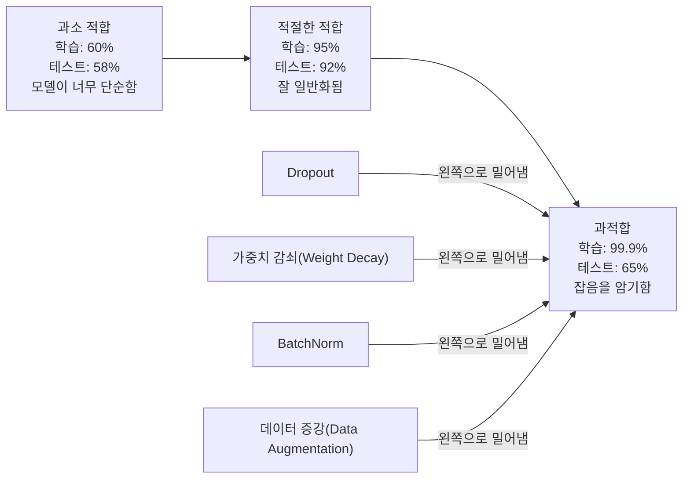
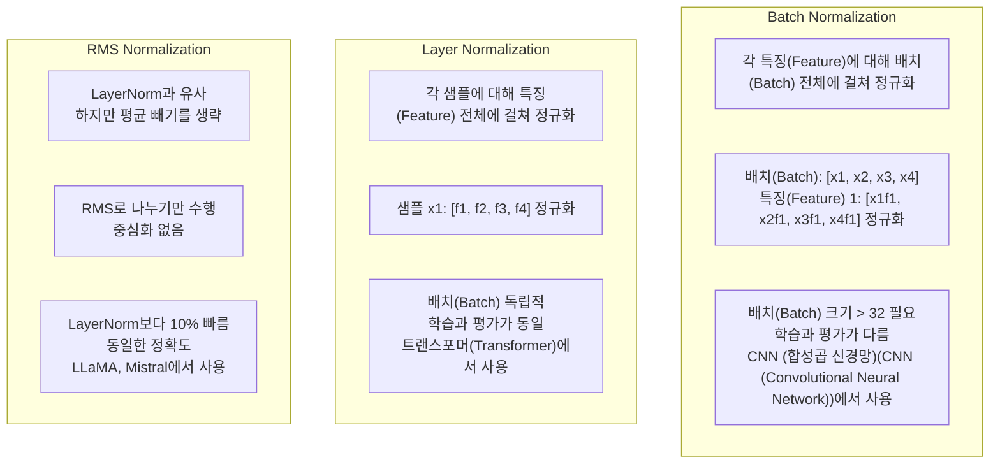
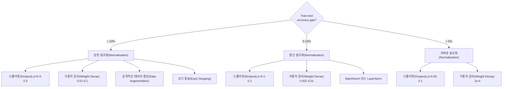

# 정규화

> 모델이 학습 데이터에서는 99%의 성능을 기록하지만 테스트 데이터에서는 60%에 그친다면, 모델은 학습한 것이 아니라 암기해 버린 것입니다. 정규화는 일반화를 강제하기 위해 복잡도에 부과하는 세금입니다.

**유형:** Build
**언어:** Python
**선수 요건:** 03.06강 (옵티마이저)
**시간:** 약 75분

## 학습 목표

- 드롭아웃(역 스케일링 포함), L2 가중치 감쇠, 배치 정규화, 레이어 정규화, RMSNorm을 처음부터 구현해 보세요
- 학습-테스트 정확도 격차를 측정하고 정규화 실험을 통해 과적합을 진단해 보세요
- 트랜스포머가 BatchNorm 대신 LayerNorm을 사용하는 이유와 최신 LLM이 RMSNorm을 선호하는 이유를 설명해 보세요
- 과적합의 심각도에 따라 정규화 기법의 올바른 조합을 적용해 보세요

## 문제점

충분한 매개변수를 가진 신경망은 어떤 데이터셋이든 암기할 수 있습니다. 이는 가설이 아닙니다. Zhang et al. (2017)는 ImageNet에서 표준 네트워크를 랜덤 레이블로 학습시켜 이를 증명했습니다. 네트워크는 완전히 랜덤한 레이블 할당에서도 학습 손실이 거의 0에 도달했습니다. 학습할 패턴이 없는 100만 개의 랜덤 입력-출력 쌍을 암기했습니다. 학습 손실은 완벽했지만 테스트 정확도는 0이었습니다.

이것이 과적합 문제이며, 모델이 커질수록 더 악화됩니다. GPT-3는 1750억 개의 매개변수를 가지고 있습니다. 학습 집합에는 약 5000억 개의 토큰이 있습니다. 이 정도의 매개변수 수라면 모델은 학습 데이터의 상당한 부분을 그대로 암기할 수 있는 용량을 가집니다. 정규화 없이는 일반화 가능한 패턴을 학습하는 대신 학습 예제를 그대로 토해낼 뿐입니다.

학습 성능과 테스트 성능 사이의 격차는 과적합 간격(Overfitting Gap)입니다. 이 강의의 모든 기법은 서로 다른 각도에서 이 격차를 공격합니다. 드롭아웃(Dropout)은 네트워크가 단일 뉴런에 의존하지 않도록 강제합니다. 가중치 감쇠(Weight Decay)는 단일 가중치가 너무 커지는 것을 방지합니다. 배치 정규화(Batch Normalization)는 손실 지형을 매끄럽게 만들어 옵티마이저가 더 평평하고 일반화 가능한 최소값을 찾도록 돕습니다. 레이어 정규화(Layer Normalization)는 동일한 역할을 수행하지만 배치 정규화가 실패하는 상황(소규모 배치, 가변 길이 시퀀스)에서도 작동합니다. RMSNorm은 평균 계산을 생략하여 10% 더 빠르게 수행합니다. 각 기법은 단순합니다. 이들을 합치면 모델을 암기하는 것과 일반화하는 것의 차이가 됩니다.

## 개념

### 과적합 스펙트럼

모든 모델은 과소 적합(Underfitting, 패턴을 포착하기에는 너무 단순함)에서 과적합(Overfitting, 잡음까지 포착할 정도로 복잡함)에 이르는 스펙트럼의 어딘가에 위치합니다. 최적의 지점은 그 사이에 있으며, 정규화(Regularization)는 과적합 쪽에서 모델을 그 지점으로 밀어냅니다.



### 드롭아웃(Dropout)

가장 우아한 해석을 가진 가장 단순한 정규화 기법입니다. 학습 중 확률 p로 각 뉴런의 출력을 무작위로 0으로 설정합니다.

```
output = activation(z) * mask    where mask[i] ~ Bernoulli(1 - p)
```

p = 0.5이면 모든 순방향 전파(forward pass)에서 뉴런의 절반이 0으로 설정됩니다. 네트워크는 어떤 뉴런이 사용 가능한지 예측할 수 없으므로 중복된 표현(redundant representations)을 학습해야 합니다. 이는 공적응(co-adaptation, 특정 뉴런의 존재에 의존하도록 뉴런이 학습하는 현상)을 방지합니다.

앙상블 해석: N개의 뉴런과 드롭아웃(Dropout)을 사용하는 네트워크는 2^N개의 가능한 하위 네트워크를 생성합니다 (각 뉴런이 켜지거나 꺼지는 모든 조합). 드롭아웃으로 학습하면 모든 2^N개의 하위 네트워크가 동시에, 서로 다른 미니배치(mini-batch)에서 대략적으로 학습됩니다. 테스트 시에는 모든 뉴런을 사용하며(드롭아웃 없음), 출력에 (1 - p)를 곱하여 학습 중의 기대값과 일치시킵니다. 이는 2^N개의 하위 네트워크의 예측을 평균내는 것과 동일합니다 -- 단일 모델로부터 거대한 앙상블을 얻는 것입니다.

실제로는 테스트가 아닌 학습 중에 스케일링을 적용합니다 (역전 드롭아웃(inverted dropout)):

```
During training:  output = activation(z) * mask / (1 - p)
During testing:   output = activation(z)   (no change needed)
```

테스트 코드가 드롭아웃에 대해 전혀 알 필요가 없으므로 더 깔끔합니다.

기본 비율: 트랜스포머(transformer)는 p = 0.1, MLP는 p = 0.5, CNN은 p = 0.2-0.3입니다. 드롭아웃이 높을수록 정규화(regularization)가 강해지며, 과소 적합(underfitting) 위험이 커집니다.

### 가중치 감쇠(Weight Decay) (L2 정규화)

모든 가중치의 제곱 크기를 손실(loss)에 더합니다:

```
total_loss = task_loss + (lambda / 2) * sum(w_i^2)
```

정규화 항의 기울기(gradient)는 lambda * w입니다. 이는 매 단계에서 각 가중치가 그 크기에 비례하는 비율로 0으로 수축된다는 의미입니다. 큰 가중치는 더 큰 페널티를 받습니다. 모델은 단일 가중치가 지배하지 않는 해로 유도됩니다.

이것이 일반화(generalization)에 도움이 되는 이유: 과적합(overfitting)된 모델은 학습 데이터의 잡음을 증폭시키는 큰 가중치를 가지는 경향이 있습니다. 가중치 감쇠는 가중치를 작게 유지하여 모델의 유효 용량을 제한하고, 기억된 특이점(quirks)이 아닌 강건하고 일반화 가능한 특징(features)에 의존하도록 강제합니다.

lambda 하이퍼파라미터(hyperparameter)는 강도를 제어합니다. 일반적인 값:

- 트랜스포머(transformer)의 AdamW는 0.01
- CNN의 SGD는 1e-4
- 심하게 과적합된 모델은 0.1

06강에서 논의된 바와 같이: SGD에서는 가중치 감쇠와 L2 정규화가 동일하지만 Adam에서는 동일하지 않습니다. Adam으로 학습할 때는 항상 AdamW (분리된 가중치 감쇠)를 사용하세요.

### 배치 정규화(Batch Normalization)

미니배치(mini-batch) 전체에 걸쳐 각 층의 출력을 정규화한 후 다음 층으로 전달합니다.

어떤 층의 미니배치 활성화(activation)에 대해:

```
mu = (1/B) * sum(x_i)           (batch mean)
sigma^2 = (1/B) * sum((x_i - mu)^2)   (batch variance)
x_hat = (x_i - mu) / sqrt(sigma^2 + eps)   (normalize)
y = gamma * x_hat + beta        (scale and shift)
```

감마(gamma)와 베타(beta)는 학습 가능한 매개변수(Parameter)로, 정규화(Normalization)가 최적의 상태가 아닐 경우 네트워크가 이를 되돌릴 수 있게 해줍니다. 이 매개변수들이 없다면 모든 레이어의 출력을 평균이 0이고 분산이 1인 상태로 강제로 고정하게 되며, 이는 네트워크가 원하는 상태가 아닐 수 있습니다.

**학습과 추론(Inference)의 분리:** 학습 중에는 mu와 sigma가 현재 미니 배치(mini-batch)에서 계산됩니다. 추론 중에는 학습 중에 누적된 이동 평균(exponential moving average, momentum = 0.1, 즉 90% 이전 값 + 10% 새로운 값)을 사용합니다.

BatchNorm이 작동하는 이유는 여전히 논쟁의 대상입니다. 원 논문은 "내부 공변량 이동(internal covariate shift)" (이전 레이어가 업데이트됨에 따라 레이어 입력의 분포가 변하는 현상)을 줄인다고 주장했습니다. Santurkar et al. (2018)은 이 설명이 틀렸음을 입증했습니다. 실제 이유는 BatchNorm이 손실 함수(Loss Function)의 지형을 더 매끄럽게 만들기 때문입니다. 기울기(Gradient)가 더 예측 가능해지고, Lipschitz 상수가 작아지며, 옵티마이저(Optimizer)가 더 큰 스텝을 안전하게 취할 수 있습니다. 이것이 BatchNorm이 더 높은 학습률(Learning Rate)을 사용하고 더 빠르게 수렴하도록 허용하는 이유입니다.

BatchNorm에는 근본적인 한계가 있습니다: 배치 통계에 의존합니다. 배치 크기(Batch Size)가 1이면 평균과 분산은 의미가 없습니다. 작은 배치(< 32)에서는 통계가 노이즈가 많아 성능을 해칩니다. 이는 메모리 제한으로 배치 크기가 작은 객체 감지(object detection)나 시퀀스 길이가 변하는 언어 모델링(language modeling) 같은 작업에서 중요합니다.

### Layer Normalization

배치 전체가 아닌 특징(Feature) 차원에서 정규화(Normalization)합니다. 단일 샘플에 대해:

```
mu = (1/D) * sum(x_j)           (feature mean)
sigma^2 = (1/D) * sum((x_j - mu)^2)   (feature variance)
x_hat = (x_j - mu) / sqrt(sigma^2 + eps)
y = gamma * x_hat + beta
```

D는 특징 차원입니다. 각 샘플은 독립적으로 정규화되며 배치 크기에 의존하지 않습니다. 이것이 트랜스포머(Transformer)가 BatchNorm 대신 LayerNorm을 사용하는 이유입니다. 시퀀스는 길이가 변하고, 배치 크기는 종종 작으며 (생성 중에는 1), 학습과 추론(Inference) 간의 계산이 동일합니다.

트랜스포머(Transformer)에서의 LayerNorm은 각 셀프 어텐션(Self-Attention) 블록과 각 피드포워드(feed-forward) 블록 뒤에 적용됩니다(Post-LN) 또는 그 앞에 적용됩니다(Pre-LN, 학습에 더 안정적입니다).

### RMSNorm

평균 차감을 제외한 LayerNorm입니다. Zhang & Sennrich (2019)가 제안했습니다.

```
rms = sqrt((1/D) * sum(x_j^2))
y = gamma * x / rms
```

이것이 전부입니다. 평균 계산이 없고, beta 매개변수(Parameter)도 없습니다. 관찰 결과: LayerNorm의 재중심화(평균 차감)는 모델 성능에 거의 기여하지 않지만 연산 비용을 발생시킵니다. 이를 제거하면 약 10% 적은 오버헤드로 동일한 정확도를 얻습니다.

LLaMA, LLaMA 2, LLaMA 3, Mistral 및 대부분의 최신 LLM (대규모 언어 모델)(LLM (Large Language Model))은 LayerNorm 대신 RMSNorm을 사용합니다. 수십억 개의 매개변수(Parameter)와 수조 개의 토큰(Token) 규모에서는 10%의 절감이 매우 중요합니다.

### 정규화(Normalization) 비교



### 정규화(Normalization)로서의 데이터 증강(Data Augmentation)

모델 수정이 아닌 데이터 수정입니다. 레이블을 보존하면서 학습 입력을 변환합니다:

- 이미지(Image): 랜덤 크롭, 뒤집기, 회전, 색상 지터, 컷아웃
- 텍스트: 동의어 교체, 역 번역, 랜덤 삭제
- 오디오(Audio): 시간 스트레치, 피치 시프트, 잡음 추가

이 효과는 정규화(Normalization)와 동일합니다. 학습 세트의 유효 크기를 증가시켜 모델이 특정 예제를 암기하기 어렵게 만듭니다. 원본 형태의 이미지를 한 번만 본 모델은 이를 암기할 수 있습니다. 각 이미지의 50개 증강 버전을 본 모델은 불변 구조를 학습하도록 강제됩니다.

### 조기 종료(Early Stopping)

가장 단순한 정규화(Normalization) 기법입니다. 검증 손실(Loss)이 증가하기 시작하면 학습을 중단합니다. 그 시점에서는 모델이 아직 과적합(Overfitting)되지 않았습니다. 실제로는 매 에포크(Epoch)마다 검증 손실(Loss)을 추적하고, 최상의 모델을 저장하며, "인내심(patience)" 기간(일반적으로 5-20 에포크(Epoch)) 동안 학습을 계속합니다. 인내심 기간 내에 검증 손실(Loss)이 개선되지 않으면 중단하고 저장된 최상의 모델을 로드합니다.

### 언제 무엇을 적용할 것인가



```figure
l2-regularization
```

## 구현하기

### 1단계: 드롭아웃(Dropout) (학습 및 평가 모드)

```python
import random
import math


class Dropout:
    def __init__(self, p=0.5):
        self.p = p
        self.training = True
        self.mask = None

    def forward(self, x):
        if not self.training:
            return list(x)
        self.mask = []
        output = []
        for val in x:
            if random.random() < self.p:
                self.mask.append(0)
                output.append(0.0)
            else:
                self.mask.append(1)
                output.append(val / (1 - self.p))
        return output

    def backward(self, grad_output):
        grads = []
        for g, m in zip(grad_output, self.mask):
            if m == 0:
                grads.append(0.0)
            else:
                grads.append(g / (1 - self.p))
        return grads
```

### 2단계: L2 가중치 감쇠(L2 Weight Decay)

```python
def l2_regularization(weights, lambda_reg):
    penalty = 0.0
    for w in weights:
        penalty += w * w
    return lambda_reg * 0.5 * penalty

def l2_gradient(weights, lambda_reg):
    return [lambda_reg * w for w in weights]
```

### 3단계: 배치 정규화(Batch Normalization)

```python
class BatchNorm:
    def __init__(self, num_features, momentum=0.1, eps=1e-5):
        self.gamma = [1.0] * num_features
        self.beta = [0.0] * num_features
        self.eps = eps
        self.momentum = momentum
        self.running_mean = [0.0] * num_features
        self.running_var = [1.0] * num_features
        self.training = True
        self.num_features = num_features

    def forward(self, batch):
        batch_size = len(batch)
        if self.training:
            mean = [0.0] * self.num_features
            for sample in batch:
                for j in range(self.num_features):
                    mean[j] += sample[j]
            mean = [m / batch_size for m in mean]

            var = [0.0] * self.num_features
            for sample in batch:
                for j in range(self.num_features):
                    var[j] += (sample[j] - mean[j]) ** 2
            var = [v / batch_size for v in var]

            for j in range(self.num_features):
                self.running_mean[j] = (1 - self.momentum) * self.running_mean[j] + self.momentum * mean[j]
                self.running_var[j] = (1 - self.momentum) * self.running_var[j] + self.momentum * var[j]
        else:
            mean = list(self.running_mean)
            var = list(self.running_var)

        self.x_hat = []
        output = []
        for sample in batch:
            normalized = []
            out_sample = []
            for j in range(self.num_features):
                x_h = (sample[j] - mean[j]) / math.sqrt(var[j] + self.eps)
                normalized.append(x_h)
                out_sample.append(self.gamma[j] * x_h + self.beta[j])
            self.x_hat.append(normalized)
            output.append(out_sample)
        return output
```

### 4단계: 레이어 정규화(Layer Normalization)

```python
class LayerNorm:
    def __init__(self, num_features, eps=1e-5):
        self.gamma = [1.0] * num_features
        self.beta = [0.0] * num_features
        self.eps = eps
        self.num_features = num_features

    def forward(self, x):
        mean = sum(x) / len(x)
        var = sum((xi - mean) ** 2 for xi in x) / len(x)

        self.x_hat = []
        output = []
        for j in range(self.num_features):
            x_h = (x[j] - mean) / math.sqrt(var + self.eps)
            self.x_hat.append(x_h)
            output.append(self.gamma[j] * x_h + self.beta[j])
        return output
```

### 5단계: RMSNorm

```python
class RMSNorm:
    def __init__(self, num_features, eps=1e-6):
        self.gamma = [1.0] * num_features
        self.eps = eps
        self.num_features = num_features

    def forward(self, x):
        rms = math.sqrt(sum(xi * xi for xi in x) / len(x) + self.eps)
        output = []
        for j in range(self.num_features):
            output.append(self.gamma[j] * x[j] / rms)
        return output
```

### 6단계: 정규화 유무에 따른 학습

```python
def sigmoid(x):
    x = max(-500, min(500, x))
    return 1.0 / (1.0 + math.exp(-x))


def make_circle_data(n=200, seed=42):
    random.seed(seed)
    data = []
    for _ in range(n):
        x = random.uniform(-2, 2)
        y = random.uniform(-2, 2)
        label = 1.0 if x * x + y * y < 1.5 else 0.0
        data.append(([x, y], label))
    return data


class RegularizedNetwork:
    def __init__(self, hidden_size=16, lr=0.05, dropout_p=0.0, weight_decay=0.0):
        random.seed(0)
        self.hidden_size = hidden_size
        self.lr = lr
        self.dropout_p = dropout_p
        self.weight_decay = weight_decay
        self.dropout = Dropout(p=dropout_p) if dropout_p > 0 else None

        self.w1 = [[random.gauss(0, 0.5) for _ in range(2)] for _ in range(hidden_size)]
        self.b1 = [0.0] * hidden_size
        self.w2 = [random.gauss(0, 0.5) for _ in range(hidden_size)]
        self.b2 = 0.0

    def forward(self, x, training=True):
        self.x = x
        self.z1 = []
        self.h = []
        for i in range(self.hidden_size):
            z = self.w1[i][0] * x[0] + self.w1[i][1] * x[1] + self.b1[i]
            self.z1.append(z)
            self.h.append(max(0.0, z))

        if self.dropout and training:
            self.dropout.training = True
            self.h = self.dropout.forward(self.h)
        elif self.dropout:
            self.dropout.training = False
            self.h = self.dropout.forward(self.h)

        self.z2 = sum(self.w2[i] * self.h[i] for i in range(self.hidden_size)) + self.b2
        self.out = sigmoid(self.z2)
        return self.out

    def backward(self, target):
        eps = 1e-15
        p = max(eps, min(1 - eps, self.out))
        d_loss = -(target / p) + (1 - target) / (1 - p)
        d_sigmoid = self.out * (1 - self.out)
        d_out = d_loss * d_sigmoid

        for i in range(self.hidden_size):
            d_relu = 1.0 if self.z1[i] > 0 else 0.0
            d_h = d_out * self.w2[i] * d_relu
            self.w2[i] -= self.lr * (d_out * self.h[i] + self.weight_decay * self.w2[i])
            for j in range(2):
                self.w1[i][j] -= self.lr * (d_h * self.x[j] + self.weight_decay * self.w1[i][j])
            self.b1[i] -= self.lr * d_h
        self.b2 -= self.lr * d_out

    def evaluate(self, data):
        correct = 0
        total_loss = 0.0
        for x, y in data:
            pred = self.forward(x, training=False)
            eps = 1e-15
            p = max(eps, min(1 - eps, pred))
            total_loss += -(y * math.log(p) + (1 - y) * math.log(1 - p))
            if (pred >= 0.5) == (y >= 0.5):
                correct += 1
        return total_loss / len(data), correct / len(data) * 100

    def train_model(self, train_data, test_data, epochs=300):
        history = []
        for epoch in range(epochs):
            total_loss = 0.0
            correct = 0
            for x, y in train_data:
                pred = self.forward(x, training=True)
                self.backward(y)
                eps = 1e-15
                p = max(eps, min(1 - eps, pred))
                total_loss += -(y * math.log(p) + (1 - y) * math.log(1 - p))
                if (pred >= 0.5) == (y >= 0.5):
                    correct += 1
            train_loss = total_loss / len(train_data)
            train_acc = correct / len(train_data) * 100
            test_loss, test_acc = self.evaluate(test_data)
            history.append((train_loss, train_acc, test_loss, test_acc))
            if epoch % 75 == 0 or epoch == epochs - 1:
                gap = train_acc - test_acc
                print(f"    Epoch {epoch:3d}: train_acc={train_acc:.1f}%, test_acc={test_acc:.1f}%, gap={gap:.1f}%")
        return history
```

## 사용하기

PyTorch는 모든 정규화 및 정규화 모듈을 제공합니다:

```python
import torch
import torch.nn as nn

model = nn.Sequential(
    nn.Linear(784, 256),
    nn.BatchNorm1d(256),
    nn.ReLU(),
    nn.Dropout(0.3),
    nn.Linear(256, 128),
    nn.BatchNorm1d(128),
    nn.ReLU(),
    nn.Dropout(0.3),
    nn.Linear(128, 10),
)

model.train()
out_train = model(torch.randn(32, 784))

model.eval()
out_test = model(torch.randn(1, 784))
```

`model.train()` / `model.eval()` 토글은 매우 중요합니다. 이 토글은 드롭아웃을 켜고 끄며, BatchNorm이 배치 통계와 런닝 통계 중 어느 것을 사용할지 결정합니다. 추론 전에 `model.eval()`를 잊는 것은 딥러닝에서 가장 흔한 버그 중 하나입니다. 드롭아웃이 여전히 활성화되어 있고 BatchNorm이 미니배치 통계를 사용하므로 테스트 정확도가 무작위로 변동됩니다.

트랜스포머의 경우 패턴이 다릅니다:

```python
class TransformerBlock(nn.Module):
    def __init__(self, d_model=512, nhead=8, dropout=0.1):
        super().__init__()
        self.attention = nn.MultiheadAttention(d_model, nhead, dropout=dropout)
        self.norm1 = nn.LayerNorm(d_model)
        self.ff = nn.Sequential(
            nn.Linear(d_model, d_model * 4),
            nn.GELU(),
            nn.Linear(d_model * 4, d_model),
            nn.Dropout(dropout),
        )
        self.norm2 = nn.LayerNorm(d_model)
        self.dropout = nn.Dropout(dropout)

    def forward(self, x):
        attended, _ = self.attention(x, x, x)
        x = self.norm1(x + self.dropout(attended))
        x = self.norm2(x + self.ff(x))
        return x
```

BatchNorm이 아닌 LayerNorm을 사용하며, p=0.5가 아닌 p=0.1의 드롭아웃을 사용합니다. 이것이 트랜스포머의 기본값입니다.

## 출시하기

이 강의는 다음을 생성합니다:
- `outputs/prompt-regularization-advisor.md` -- 과적합을 진단하고 올바른 정규화 전략을 권장하는 프롬프트

## 연습 문제

1. 2D 데이터를 위한 공간 드롭아웃(spatial dropout)을 구현해 보세요. 개별 뉴런을 드롭하는 대신 전체 특징 채널을 드롭합니다. 연속적인 특징 그룹을 채널로 간주하고 전체 그룹을 드롭하여 이를 시뮬레이션합니다. hidden_size=32인 원(circle) 데이터셋에서 표준 드롭아웃과 학습-테스트 간 격차를 비교해 보세요.

2. 05강의 레이블 스무딩(label smoothing)을 이 강의의 드롭아웃과 결합하여 구현해 보세요. 네 가지 구성(둘 다 없음, 드롭아웃만, 레이블 스무딩만, 둘 다)으로 학습합니다. 각 구성의 최종 학습-테스트 정확도 격차를 측정합니다. 어떤 조합이 가장 작은 격차를 제공하나요?

3. 원(circle) 데이터셋 네트워크의 은닉층과 활성화 함수 사이에 BatchNorm 레이어를 추가합니다. 학습률 0.01, 0.05, 0.1에서 BatchNorm 유무에 따라 학습합니다. BatchNorm은 바닐라 네트워크가 발산하는 더 높은 학습률에서도 안정적인 학습을 허용해야 합니다.

4. 조기 종료(Early Stopping)를 구현해 보세요. 각 에포크(Epoch)마다 테스트 손실(Loss)을 추적하고, 최상의 가중치(Weight)를 저장하며, 테스트 손실이 20 에포크 동안 개선되지 않으면 훈련을 중단합니다. 정규화된 네트워크를 1000 에포크 동안 실행합니다. 최상의 테스트 정확도를 기록한 에포크와 절약된 계산 에포크 수를 보고하세요.

5. 4층 네트워크(2층이 아닌)에서 LayerNorm과 RMSNorm을 비교해 보세요. 두 모델 모두 동일한 가중치로 초기화합니다. 200 에포크 동안 훈련하고 최종 정확도, 훈련 속도(에포크당 시간), 첫 번째 층의 기울기 크기를 비교합니다. RMSNorm이 동일한 정확도로 더 빠른지 검증하세요.

## 핵심 용어

| 용어 | 사람들이 말하는 것 | 실제 의미 |
|------|----------------|----------------------|
| 과적합(Overfitting) | "모델이 데이터를 암기했다" | 모델의 훈련 성능이 테스트 성능을 현저히 초과하는 경우로, 신호가 아닌 잡음을 학습했음을 나타냅니다 |
| 정규화(Regularization) | "과적합 방지" | 일반화 성능을 개선하기 위해 모델의 복잡성을 제한하는 모든 기법: 드롭아웃(Dropout), 가중치 감쇠(Weight Decay), 정규화(Normalization), 데이터 증강(Data Augmentation) |
| 드롭아웃(Dropout) | "무작위 뉴런 삭제" | 훈련 중 확률 p로 무작위 뉴런을 0으로 만들어冗余 표현을 강제하며, 앙상블 훈련과 동등합니다 |
| 가중치 감쇠(Weight Decay) | "L2 페널티" | 각 단계에서 lambda * w를 빼서 모든 가중치를 0으로 수축시킴; 가중치 크기를 통해 복잡성에 페널티를 부여합니다 |
| 배치 정규화(Batch Normalization) | "배치별로 정규화" | 훈련 중 배치 통계와 추론 중 이동 평균을 사용하여 배치 차원 전체에 걸쳐 층 출력의 정규화 |
| 층 정규화(Layer Normalization) | "샘플별로 정규화" | 각 샘플 내의 특징(Feature)에 걸쳐 정규화; 배치 독립적이며, 배치 크기가 변하는 트랜스포머(Transformer)에서 사용됩니다 |
| RMSNorm | "평균을 뺀 LayerNorm" | 평균 제곱근 정규화; LayerNorm의 평균 빼기를 제거하여 10% 속도 향상과 동일한 정확도를 달성합니다 |
| 조기 종료(Early Stopping) | "과적합 전에 멈추기" | 검증 손실(Loss)의 개선이 멈추면 훈련을 중단하는 것; 가장 단순한 정규화 기법으로, 다른 기법과 함께 자주 사용됩니다 |
| 데이터 증강(Data Augmentation) | "적은 데이터로 더 많은 데이터 생성" | 훈련 입력(뒤집기, 자르기, 잡음)을 변환하여 유효 데이터셋 크기를 늘리고 불변성 학습을 강제합니다 |
| 일반화 격차 | "학습-테스트 분할" | 학습 성능과 테스트 성능의 차이; 정규화는 이 격차를 최소화하는 것을 목표로 합니다 |

## 추가 읽기

- Srivastava et al., "Dropout: A Simple Way to Prevent Neural Networks from Overfitting" (2014) -- 앙상블 해석과 광범위한 실험을 담은 드롭아웃 원 논문
- Ioffe & Szegedy, "Batch Normalization: Accelerating Deep Network Training by Reducing Internal Covariate Shift" (2015) -- BatchNorm과 그 학습 절차를 도입했으며, 가장 많이 인용된 딥러닝 논문 중 하나
- Zhang & Sennrich, "Root Mean Square Layer Normalization" (2019) -- RMSNorm이 LayerNorm의 정확도를 계산량 감소와 함께 달성함을 입증했으며, LLaMA와 Mistral에 채택되었습니다
- Zhang et al., "Understanding Deep Learning Requires Rethinking Generalization" (2017) -- 신경망이 랜덤 레이블을 암기할 수 있음을 보여 일반화에 대한 전통적 관점을 도전한 기념비적 논문
