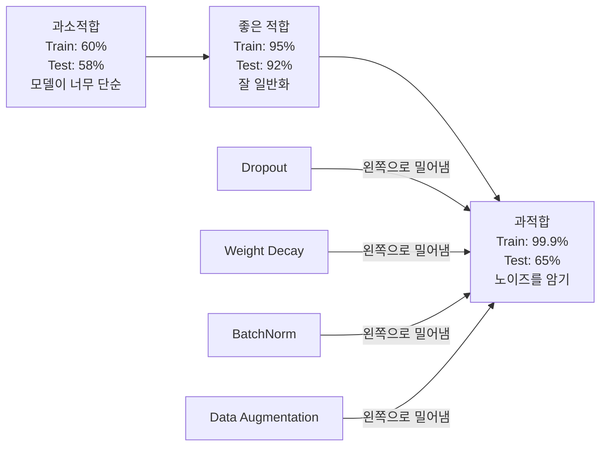
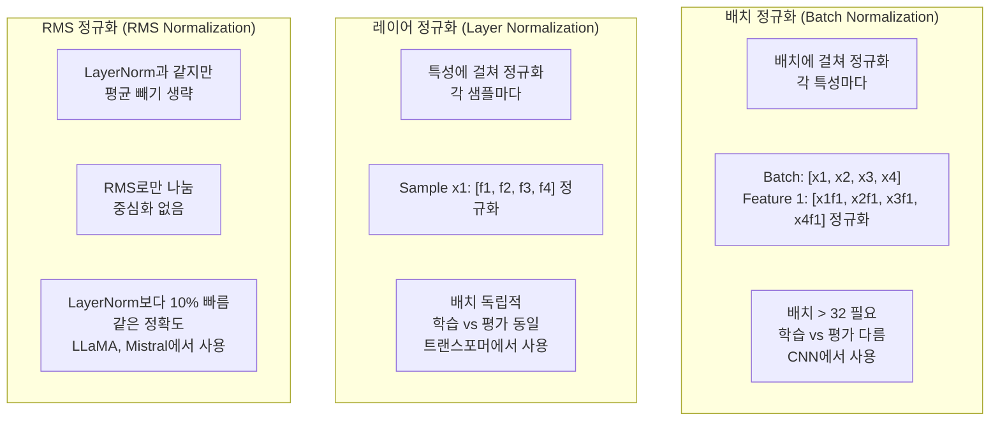
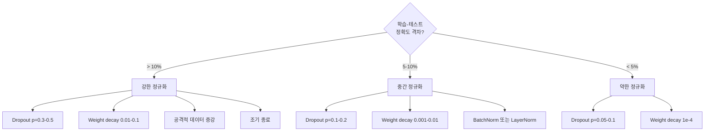

# 정규화 (Regularization)

> 모델이 학습 데이터에서 99%, 테스트 데이터에서 60%를 맞춥니다. 학습이 아니라 암기입니다. 정규화는 일반화를 강제하기 위해 복잡도에 매기는 세금입니다.

**Type:** Build
**Languages:** Python
**Prerequisites:** Lesson 03.06 (Optimizers)
**Time:** ~75 minutes

## 학습 목표 (Learning Objectives)

- 역스케일링(inverted scaling) 드롭아웃, L2 가중치 감쇠, 배치 정규화, 레이어 정규화, RMSNorm을 처음부터 구현합니다
- 학습-테스트 정확도 격차를 측정하고, 정규화 실험으로 과적합을 진단합니다
- 트랜스포머가 BatchNorm 대신 LayerNorm을 쓰는 이유와, 현대 LLM이 RMSNorm을 선호하는 이유를 설명합니다
- 과적합 심각도에 맞는 정규화 기법 조합을 적용합니다

## 문제 상황 (The Problem)

파라미터가 충분한 신경망은 어떤 데이터셋이든 암기할 수 있습니다. 가설이 아닙니다. Zhang et al. (2017)은 ImageNet에 무작위 라벨을 붙여 표준 네트워크를 학습시켜 이를 증명했습니다. 네트워크는 완전히 무작위인 라벨 할당에서도 학습 손실을 거의 0까지 끌어내렸습니다. 학습할 패턴이 없는 백만 개의 무작위 입출력 쌍을 암기한 것입니다. 학습 손실은 완벽했습니다. 테스트 정확도는 0이었습니다.

이것이 과적합(overfitting) 문제이며, 모델이 커질수록 더 심해집니다. GPT-3은 1,750억 개의 파라미터가 있습니다. 학습셋은 약 5,000억 토큰입니다. 그 정도의 파라미터면 학습 데이터의 상당 부분을 그대로 암기할 용량이 있습니다. 정규화가 없으면 일반화 가능한 패턴을 배우기보다 학습 예제를 되풀이하게 됩니다.

학습 성능과 테스트 성능 사이의 격차가 과적합 격차입니다. 이 레슨의 모든 기법은 서로 다른 각도에서 그 격차를 공격합니다. 드롭아웃은 네트워크가 단일 뉴런에 의존하지 못하게 합니다. 가중치 감쇠는 단일 가중치가 너무 커지지 않게 합니다. 배치 정규화는 손실 지형을 부드럽게 해 옵티마이저가 더 평평하고 일반화하기 좋은 최솟값을 찾게 합니다. 레이어 정규화는 같은 일을 하지만 배치 정규화가 실패하는 곳(작은 배치, 가변 길이 시퀀스)에서도 동작합니다. RMSNorm은 평균 계산을 빼서 약 10% 더 빠르게 같은 일을 합니다. 각 기법은 단순합니다. 함께 쓰면 암기하는 모델과 일반화하는 모델의 차이가 됩니다.

## 핵심 개념 (The Concept)

### 과적합 스펙트럼

모든 모델은 과소적합(패턴을 잡기엔 너무 단순)에서 과적합(노이즈까지 잡을 정도로 복잡)까지의 스펙트럼 어딘가에 있습니다. 최적점은 그 사이이며, 정규화는 과적합 쪽에서 그 지점으로 모델을 밀어 줍니다.



### 드롭아웃 (Dropout)

가장 단순하면서도 해석이 우아한 정규화 기법입니다. 학습 중 각 뉴런의 출력을 확률 p로 무작위로 0으로 둡니다.

```
output = activation(z) * mask    where mask[i] ~ Bernoulli(1 - p)
```

p = 0.5이면 매 순전파마다 뉴런의 절반이 0이 됩니다. 어떤 뉴런이 살아남을지 예측할 수 없으므로 네트워크는 중복 표현을 학습해야 합니다. 이는 공동적응(co-adaptation) — 특정 다른 뉴런이 있어야만 동작하는 학습 — 을 막습니다.

앙상블 해석: N개 뉴런과 드롭아웃이 있는 네트워크는 2^N개의 가능한 서브네트워크(어떤 뉴런이 on/off인지의 모든 조합)를 만듭니다. 드롭아웃으로 학습하면 대략 이 2^N개 서브네트워크를 서로 다른 미니배치에서 동시에 학습합니다. 테스트 시에는 모든 뉴런을 쓰고(드롭아웃 없음) 출력을 (1 - p)로 스케일해 학습 중 기대값과 맞춥니다. 이는 2^N개 서브네트워크 예측을 평균하는 것과 같습니다 — 단일 모델에서 나온 거대한 앙상블입니다.

실무에서는 스케일링을 테스트가 아니라 학습 중에 적용합니다(역드롭아웃, inverted dropout):

```
During training:  output = activation(z) * mask / (1 - p)
During testing:   output = activation(z)   (no change needed)
```

테스트 코드가 드롭아웃을 전혀 알 필요가 없어 더 깔끔합니다.

기본 비율: 트랜스포머는 p = 0.1, MLP는 p = 0.5, CNN은 p = 0.2-0.3. 드롭아웃이 높을수록 정규화가 강하고 과소적합 위험이 커집니다.

### 가중치 감쇠 (Weight Decay, L2 Regularization)

모든 가중치의 제곱 크기를 손실에 더합니다:

```
total_loss = task_loss + (lambda / 2) * sum(w_i^2)
```

정규화 항의 기울기는 lambda * w입니다. 즉 매 스텝마다 각 가중치가 크기에 비례한 비율로 0을 향해 줄어듭니다. 큰 가중치가 더 크게 페널티를 받습니다. 모델은 단일 가중치가 지배하지 않는 해를 향해 밀립니다.

이것이 일반화에 도움이 되는 이유: 과적합 모델은 학습 데이터의 노이즈를 증폭하는 큰 가중치를 갖는 경향이 있습니다. 가중치 감쇠는 가중치를 작게 유지해 모델의 유효 용량을 제한하고, 암기한 특이점보다 견고하고 일반화 가능한 특성에 의존하게 합니다.

lambda 하이퍼파라미터는 강도를 제어합니다. 전형적인 값:

- 트랜스포머에서 AdamW: 0.01
- CNN에서 SGD: 1e-4
- 심하게 과적합한 모델: 0.1

레슨 06에서 다룬 대로: 가중치 감쇠와 L2 정규화는 SGD에서는 동등하지만 Adam에서는 아닙니다. Adam으로 학습할 때는 항상 AdamW(분리된 가중치 감쇠)를 쓰세요.

### 배치 정규화 (Batch Normalization)

각 레이어의 출력을 다음 레이어에 넘기기 전에 미니배치에 걸쳐 정규화합니다.

어떤 레이어의 활성화에 대한 미니배치에서:

```
mu = (1/B) * sum(x_i)           (batch mean)
sigma^2 = (1/B) * sum((x_i - mu)^2)   (batch variance)
x_hat = (x_i - mu) / sqrt(sigma^2 + eps)   (normalize)
y = gamma * x_hat + beta        (scale and shift)
```

Gamma와 beta는 학습 가능한 파라미터로, 정규화를 되돌리는 것이 최적이면 네트워크가 그렇게 할 수 있게 합니다. 없으면 모든 레이어 출력을 평균 0, 분산 1로 강제하게 되며, 그게 네트워크가 원하는 것이 아닐 수 있습니다.

**학습 vs 추론 분리:** 학습 중 mu와 sigma는 현재 미니배치에서 옵니다. 추론에서는 학습 중 누적한 이동 평균을 씁니다(모멘텀 = 0.1인 지수 이동 평균, 즉 90% 이전 + 10% 신규).

BatchNorm이 작동하는 이유는 여전히 논쟁 중입니다. 원 논문은 "내부 공변량 이동(internal covariate shift)"(이전 레이어가 업데이트되면서 레이어 입력 분포가 바뀌는 것)을 줄인다고 주장했습니다. Santurkar et al. (2018)은 이 설명이 틀렸음을 보였습니다. 실제 이유: BatchNorm이 손실 지형을 더 매끄럽게 만듭니다. 기울기가 더 예측 가능하고, Lipschitz 상수가 작아지며, 옵티마이저가 더 큰 스텝을 안전하게 밟을 수 있습니다. 그래서 BatchNorm이 더 높은 학습률을 쓰고 더 빠르게 수렴하게 합니다.

BatchNorm에는 근본적 한계가 있습니다: 배치 통계에 의존합니다. 배치 크기 1이면 평균과 분산이 무의미합니다. 작은 배치(< 32)에서는 통계가 노이즈가 많아 성능이 나빠집니다. 이는 객체 탐지(메모리가 배치 크기를 제한)와 언어 모델링(시퀀스 길이가 가변) 같은 작업에서 중요합니다.

### 레이어 정규화 (Layer Normalization)

배치가 아니라 특성에 걸쳐 정규화합니다. 단일 샘플에 대해:

```
mu = (1/D) * sum(x_j)           (feature mean)
sigma^2 = (1/D) * sum((x_j - mu)^2)   (feature variance)
x_hat = (x_j - mu) / sqrt(sigma^2 + eps)
y = gamma * x_hat + beta
```

D는 특성 차원입니다. 각 샘플이 독립적으로 정규화됩니다 — 배치 크기에 의존하지 않습니다. 트랜스포머가 BatchNorm 대신 LayerNorm을 쓰는 이유입니다. 시퀀스 길이가 가변이고, 배치 크기가 종종 작으며(생성 중에는 1), 학습과 추론의 계산이 동일합니다.

트랜스포머에서 LayerNorm은 각 self-attention 블록과 feed-forward 블록 뒤에(Post-LN), 또는 앞에(Pre-LN, 학습이 더 안정적) 적용됩니다.

### RMSNorm

평균 빼기를 뺀 LayerNorm입니다. Zhang & Sennrich (2019)가 제안했습니다.

```
rms = sqrt((1/D) * sum(x_j^2))
y = gamma * x / rms
```

그게 전부입니다. 평균 계산도, beta 파라미터도 없습니다. 관찰: LayerNorm의 재중심화(평균 빼기)는 모델 성능에 거의 기여하지 않지만 계산 비용이 듭니다. 이를 제거하면 같은 정확도를 약 10% 적은 오버헤드로 얻습니다.

LLaMA, LLaMA 2, LLaMA 3, Mistral, 그리고 대부분의 현대 LLM은 LayerNorm 대신 RMSNorm을 씁니다. 수십억 파라미터와 수조 토큰 규모에서는 그 10% 절감이 중요합니다.

### 정규화 비교



### 정규화로서의 데이터 증강 (Data Augmentation)

모델 수정이 아니라 데이터 수정입니다. 라벨을 유지한 채 학습 입력을 변환합니다:

- 이미지: 무작위 크롭, 뒤집기, 회전, 색상 지터, cutout
- 텍스트: 동의어 교체, 역번역, 무작위 삭제
- 오디오: 시간 늘리기, 피치 이동, 노이즈 추가

효과는 정규화와 동일합니다: 학습셋의 유효 크기를 늘려 모델이 특정 예제를 암기하기 어렵게 합니다. 각 이미지를 원본으로 한 번만 본 모델은 암기할 수 있습니다. 각 이미지의 증강 버전 50개를 본 모델은 불변 구조를 학습하도록 강제됩니다.

### 조기 종료 (Early Stopping)

가장 단순한 정규화기: 검증 손실이 증가하기 시작하면 학습을 멈춥니다. 그 시점에는 아직 과적합하지 않았습니다. 실무에서는 매 에폭마다 검증 손실을 추적하고, 최고 모델을 저장한 뒤, "patience" 창(보통 5-20 에폭) 동안 계속 학습합니다. patience 창 안에서 검증 손실이 개선되지 않으면 멈추고 저장된 최고 모델을 불러옵니다.

### 무엇을 언제 적용할지



```figure
l2-regularization
```

## 직접 만들기 (Build It)

### Step 1: Dropout (Train and Eval Mode)

```python
import random
import math


class Dropout:
    def __init__(self, p=0.5):
        self.p = p
        self.training = True
        self.mask = None

    def forward(self, x):
        if not self.training:
            return list(x)
        self.mask = []
        output = []
        for val in x:
            if random.random() < self.p:
                self.mask.append(0)
                output.append(0.0)
            else:
                self.mask.append(1)
                output.append(val / (1 - self.p))
        return output

    def backward(self, grad_output):
        grads = []
        for g, m in zip(grad_output, self.mask):
            if m == 0:
                grads.append(0.0)
            else:
                grads.append(g / (1 - self.p))
        return grads
```

### Step 2: L2 Weight Decay

```python
def l2_regularization(weights, lambda_reg):
    penalty = 0.0
    for w in weights:
        penalty += w * w
    return lambda_reg * 0.5 * penalty

def l2_gradient(weights, lambda_reg):
    return [lambda_reg * w for w in weights]
```

### Step 3: Batch Normalization

```python
class BatchNorm:
    def __init__(self, num_features, momentum=0.1, eps=1e-5):
        self.gamma = [1.0] * num_features
        self.beta = [0.0] * num_features
        self.eps = eps
        self.momentum = momentum
        self.running_mean = [0.0] * num_features
        self.running_var = [1.0] * num_features
        self.training = True
        self.num_features = num_features

    def forward(self, batch):
        batch_size = len(batch)
        if self.training:
            mean = [0.0] * self.num_features
            for sample in batch:
                for j in range(self.num_features):
                    mean[j] += sample[j]
            mean = [m / batch_size for m in mean]

            var = [0.0] * self.num_features
            for sample in batch:
                for j in range(self.num_features):
                    var[j] += (sample[j] - mean[j]) ** 2
            var = [v / batch_size for v in var]

            for j in range(self.num_features):
                self.running_mean[j] = (1 - self.momentum) * self.running_mean[j] + self.momentum * mean[j]
                self.running_var[j] = (1 - self.momentum) * self.running_var[j] + self.momentum * var[j]
        else:
            mean = list(self.running_mean)
            var = list(self.running_var)

        self.x_hat = []
        output = []
        for sample in batch:
            normalized = []
            out_sample = []
            for j in range(self.num_features):
                x_h = (sample[j] - mean[j]) / math.sqrt(var[j] + self.eps)
                normalized.append(x_h)
                out_sample.append(self.gamma[j] * x_h + self.beta[j])
            self.x_hat.append(normalized)
            output.append(out_sample)
        return output
```

### Step 4: Layer Normalization

```python
class LayerNorm:
    def __init__(self, num_features, eps=1e-5):
        self.gamma = [1.0] * num_features
        self.beta = [0.0] * num_features
        self.eps = eps
        self.num_features = num_features

    def forward(self, x):
        mean = sum(x) / len(x)
        var = sum((xi - mean) ** 2 for xi in x) / len(x)

        self.x_hat = []
        output = []
        for j in range(self.num_features):
            x_h = (x[j] - mean) / math.sqrt(var + self.eps)
            self.x_hat.append(x_h)
            output.append(self.gamma[j] * x_h + self.beta[j])
        return output
```

### Step 5: RMSNorm

```python
class RMSNorm:
    def __init__(self, num_features, eps=1e-6):
        self.gamma = [1.0] * num_features
        self.eps = eps
        self.num_features = num_features

    def forward(self, x):
        rms = math.sqrt(sum(xi * xi for xi in x) / len(x) + self.eps)
        output = []
        for j in range(self.num_features):
            output.append(self.gamma[j] * x[j] / rms)
        return output
```

### Step 6: Training With and Without Regularization

```python
def sigmoid(x):
    x = max(-500, min(500, x))
    return 1.0 / (1.0 + math.exp(-x))


def make_circle_data(n=200, seed=42):
    random.seed(seed)
    data = []
    for _ in range(n):
        x = random.uniform(-2, 2)
        y = random.uniform(-2, 2)
        label = 1.0 if x * x + y * y < 1.5 else 0.0
        data.append(([x, y], label))
    return data


class RegularizedNetwork:
    def __init__(self, hidden_size=16, lr=0.05, dropout_p=0.0, weight_decay=0.0):
        random.seed(0)
        self.hidden_size = hidden_size
        self.lr = lr
        self.dropout_p = dropout_p
        self.weight_decay = weight_decay
        self.dropout = Dropout(p=dropout_p) if dropout_p > 0 else None

        self.w1 = [[random.gauss(0, 0.5) for _ in range(2)] for _ in range(hidden_size)]
        self.b1 = [0.0] * hidden_size
        self.w2 = [random.gauss(0, 0.5) for _ in range(hidden_size)]
        self.b2 = 0.0

    def forward(self, x, training=True):
        self.x = x
        self.z1 = []
        self.h = []
        for i in range(self.hidden_size):
            z = self.w1[i][0] * x[0] + self.w1[i][1] * x[1] + self.b1[i]
            self.z1.append(z)
            self.h.append(max(0.0, z))

        if self.dropout and training:
            self.dropout.training = True
            self.h = self.dropout.forward(self.h)
        elif self.dropout:
            self.dropout.training = False
            self.h = self.dropout.forward(self.h)

        self.z2 = sum(self.w2[i] * self.h[i] for i in range(self.hidden_size)) + self.b2
        self.out = sigmoid(self.z2)
        return self.out

    def backward(self, target):
        eps = 1e-15
        p = max(eps, min(1 - eps, self.out))
        d_loss = -(target / p) + (1 - target) / (1 - p)
        d_sigmoid = self.out * (1 - self.out)
        d_out = d_loss * d_sigmoid

        for i in range(self.hidden_size):
            d_relu = 1.0 if self.z1[i] > 0 else 0.0
            d_h = d_out * self.w2[i] * d_relu
            self.w2[i] -= self.lr * (d_out * self.h[i] + self.weight_decay * self.w2[i])
            for j in range(2):
                self.w1[i][j] -= self.lr * (d_h * self.x[j] + self.weight_decay * self.w1[i][j])
            self.b1[i] -= self.lr * d_h
        self.b2 -= self.lr * d_out

    def evaluate(self, data):
        correct = 0
        total_loss = 0.0
        for x, y in data:
            pred = self.forward(x, training=False)
            eps = 1e-15
            p = max(eps, min(1 - eps, pred))
            total_loss += -(y * math.log(p) + (1 - y) * math.log(1 - p))
            if (pred >= 0.5) == (y >= 0.5):
                correct += 1
        return total_loss / len(data), correct / len(data) * 100

    def train_model(self, train_data, test_data, epochs=300):
        history = []
        for epoch in range(epochs):
            total_loss = 0.0
            correct = 0
            for x, y in train_data:
                pred = self.forward(x, training=True)
                self.backward(y)
                eps = 1e-15
                p = max(eps, min(1 - eps, pred))
                total_loss += -(y * math.log(p) + (1 - y) * math.log(1 - p))
                if (pred >= 0.5) == (y >= 0.5):
                    correct += 1
            train_loss = total_loss / len(train_data)
            train_acc = correct / len(train_data) * 100
            test_loss, test_acc = self.evaluate(test_data)
            history.append((train_loss, train_acc, test_loss, test_acc))
            if epoch % 75 == 0 or epoch == epochs - 1:
                gap = train_acc - test_acc
                print(f"    Epoch {epoch:3d}: train_acc={train_acc:.1f}%, test_acc={test_acc:.1f}%, gap={gap:.1f}%")
        return history
```

## 활용하기 (Use It)

PyTorch는 모든 정규화와 정규화 기법을 모듈로 제공합니다:

```python
import torch
import torch.nn as nn

model = nn.Sequential(
    nn.Linear(784, 256),
    nn.BatchNorm1d(256),
    nn.ReLU(),
    nn.Dropout(0.3),
    nn.Linear(256, 128),
    nn.BatchNorm1d(128),
    nn.ReLU(),
    nn.Dropout(0.3),
    nn.Linear(128, 10),
)

model.train()
out_train = model(torch.randn(32, 784))

model.eval()
out_test = model(torch.randn(1, 784))
```

`model.train()` / `model.eval()` 토글이 중요합니다. 드롭아웃을 on/off하고 BatchNorm에 배치 통계 vs 이동 통계를 쓰라고 알려 줍니다. 추론 전에 `model.eval()`을 잊는 것은 딥러닝에서 가장 흔한 버그 중 하나입니다. 드롭아웃이 여전히 켜져 있고 BatchNorm이 미니배치 통계를 쓰므로 테스트 정확도가 무작위로 흔들립니다.

트랜스포머에서는 패턴이 다릅니다:

```python
class TransformerBlock(nn.Module):
    def __init__(self, d_model=512, nhead=8, dropout=0.1):
        super().__init__()
        self.attention = nn.MultiheadAttention(d_model, nhead, dropout=dropout)
        self.norm1 = nn.LayerNorm(d_model)
        self.ff = nn.Sequential(
            nn.Linear(d_model, d_model * 4),
            nn.GELU(),
            nn.Linear(d_model * 4, d_model),
            nn.Dropout(dropout),
        )
        self.norm2 = nn.LayerNorm(d_model)
        self.dropout = nn.Dropout(dropout)

    def forward(self, x):
        attended, _ = self.attention(x, x, x)
        x = self.norm1(x + self.dropout(attended))
        x = self.norm2(x + self.ff(x))
        return x
```

BatchNorm이 아니라 LayerNorm. Dropout p=0.5가 아니라 p=0.1. 이것이 트랜스포머 기본값입니다.

## 산출물 (Ship It)

이 레슨의 산출물:
- `outputs/prompt-regularization-advisor.md` -- 과적합을 진단하고 올바른 정규화 전략을 추천하는 프롬프트

## 연습 문제 (Exercises)

1. 2D 데이터용 공간 드롭아웃(spatial dropout)을 구현하세요: 개별 뉴런이 아니라 전체 특성 채널을 드롭합니다. 연속된 특성 그룹을 채널로 취급해 그룹 전체를 드롭하는 방식으로 시뮬레이션하세요. hidden_size=32인 circle 데이터셋에서 표준 드롭아웃과 학습-테스트 격차를 비교하세요.

2. 레슨 05의 라벨 스무딩과 이 레슨의 드롭아웃을 결합하세요. 네 가지 설정으로 학습하세요: 둘 다 없음, 드롭아웃만, 라벨 스무딩만, 둘 다. 각각의 최종 학습-테스트 정확도 격차를 측정하세요. 어떤 조합이 가장 작은 격차를 주나요?

3. circle 데이터셋 네트워크의 은닉층과 활성화 사이에 BatchNorm 레이어를 추가하세요. 학습률 0.01, 0.05, 0.1에서 BatchNorm 유무로 학습하세요. BatchNorm은 바닐라 네트워크가 발산하는 더 높은 학습률에서도 안정적인 학습을 가능하게 해야 합니다.

4. 조기 종료를 구현하세요: 매 에폭 테스트 손실을 추적하고, 최고 가중치를 저장하며, 테스트 손실이 20 에폭 동안 개선되지 않으면 멈춥니다. 정규화된 네트워크를 1000 에폭 돌리세요. 최고 테스트 정확도가 나온 에폭과 절약한 에폭 수를 보고하세요.

5. 2층이 아닌 4층 네트워크에서 LayerNorm vs RMSNorm을 비교하세요. 둘 다 같은 가중치로 초기화하세요. 200 에폭 학습하고 최종 정확도, 학습 속도(에폭당 시간), 첫 레이어의 기울기 크기를 비교하세요. RMSNorm이 같은 정확도로 더 빠른지 검증하세요.

## 핵심 용어 (Key Terms)

| Term | What people say | What it actually means |
|------|----------------|----------------------|
| Overfitting (과적합) | "모델이 데이터를 암기했다" | 모델의 학습 성능이 테스트 성능을 크게 웃돌아, 신호가 아니라 노이즈를 학습했음을 나타냄 |
| Regularization (정규화) | "과적합 방지" | 일반화를 위해 모델 복잡도를 제약하는 모든 기법: 드롭아웃, 가중치 감쇠, 정규화, 증강 |
| Dropout (드롭아웃) | "무작위 뉴런 삭제" | 학습 중 확률 p로 뉴런을 0으로 만들어 중복 표현을 강제; 앙상블 학습과 동등 |
| Weight decay (가중치 감쇠) | "L2 페널티" | 매 스텝 lambda * w를 빼 모든 가중치를 0으로 수축; 가중치 크기로 복잡도에 페널티 |
| Batch normalization (배치 정규화) | "배치마다 정규화" | 학습 중 배치 통계, 추론 중 이동 평균으로 배치 차원에 걸쳐 레이어 출력을 정규화 |
| Layer normalization (레이어 정규화) | "샘플마다 정규화" | 각 샘플 내 특성에 걸쳐 정규화; 배치 독립적, 배치 크기가 변하는 트랜스포머에서 사용 |
| RMSNorm | "평균 없는 LayerNorm" | 제곱평균제곱근 정규화; LayerNorm에서 평균 빼기를 제거해 같은 정확도로 10% 가속 |
| Early stopping (조기 종료) | "과적합 전에 멈춤" | 검증 손실이 더 이상 개선되지 않으면 학습을 중단; 가장 단순한 정규화기, 종종 다른 기법과 함께 사용 |
| Data augmentation (데이터 증강) | "적은 데이터에서 더 많은 데이터" | 학습 입력(뒤집기, 크롭, 노이즈)을 변환해 유효 데이터셋 크기를 늘리고 불변성 학습을 강제 |
| Generalization gap (일반화 격차) | "학습-테스트 분할" | 학습과 테스트 성능의 차이; 정규화는 이 격차를 최소화하는 것이 목표 |

## 더 읽을거리 (Further Reading)

- Srivastava et al., "Dropout: A Simple Way to Prevent Neural Networks from Overfitting" (2014) -- 앙상블 해석과 광범위한 실험이 담긴 원본 드롭아웃 논문
- Ioffe & Szegedy, "Batch Normalization: Accelerating Deep Network Training by Reducing Internal Covariate Shift" (2015) -- BatchNorm과 학습 절차를 소개한, 가장 많이 인용된 딥러닝 논문 중 하나
- Zhang & Sennrich, "Root Mean Square Layer Normalization" (2019) -- RMSNorm이 계산을 줄이면서 LayerNorm 정확도를 맞춘다는 것을 보임; LLaMA와 Mistral이 채택
- Zhang et al., "Understanding Deep Learning Requires Rethinking Generalization" (2017) -- 신경망이 무작위 라벨을 암기할 수 있음을 보여 전통적 일반화 관점에 도전한 기념비적 논문
