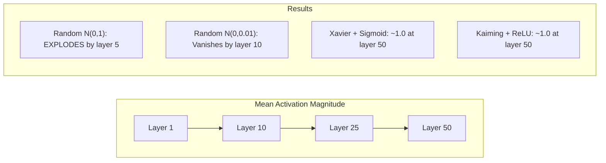
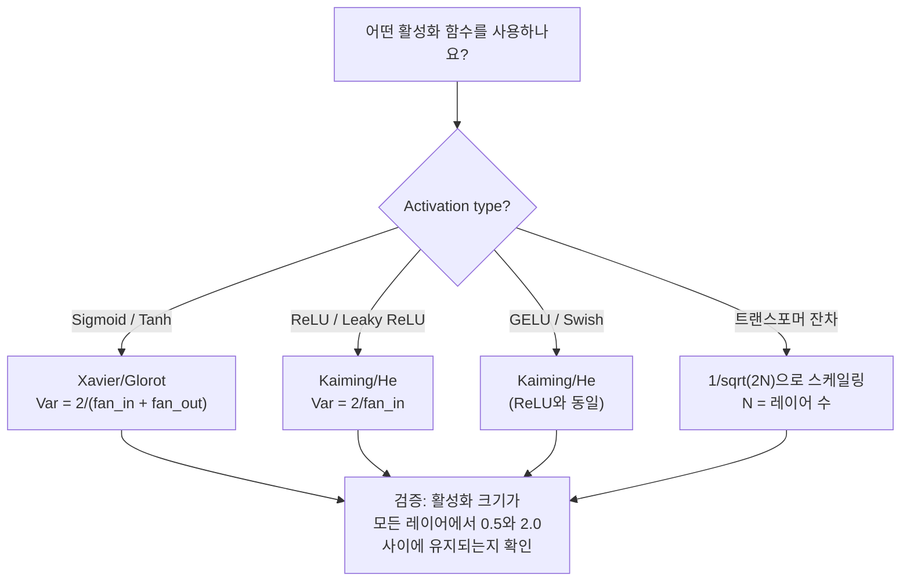

# 가중치 초기화와 학습 안정성

> 잘못 초기화하면 학습이 시작되지 않습니다. 올바르게 초기화하면 50층이 3층처럼 매끄럽게 학습됩니다.

**유형:** Build
**언어:** Python
**선수 요건:** 0304강 (활성화 함수), 0307강 (정규화)
**시간:** 약 90분

## 학습 목표

- 0, 랜덤, Xavier/Glorot, Kaiming/He 초기화 전략을 구현하고, 50층을 거치며 활성화 값의 크기에 미치는 영향을 측정해 보세요
- Xavier 초기화가 Var(w) = 2/(fan_in + fan_out)를, Kaiming 초기화가 Var(w) = 2/fan_in을 사용하는 이유를 유도해 보세요
- 0 초기화의 대칭성 문제를 시연하고, 랜덤 스케일만으로는 충분하지 않은 이유를 설명해 보세요
- 활성화 함수에 맞는 초기화 전략을 매칭해 보세요: sigmoid/tanh에는 Xavier, ReLU/GELU에는 Kaiming을 사용합니다

## 문제점

모든 가중치를 0으로 초기화하면 아무것도 학습되지 않습니다. 모든 뉴런이 동일한 함수를 계산하고, 동일한 기울기를 받으며, 동일하게 업데이트됩니다. 10,000 에포크(Epoch)가 지난 후에도 512개 뉴런의 은닉층은 여전히 동일한 뉴런의 512개 복사본입니다. 512개 매개변수(Parameter)의 비용을 지불했지만 얻은 것은 1개뿐입니다.

가중치를 너무 크게 초기화하면 활성화 값이 네트워크를 통해 폭발합니다. 10층에서는 값이 1e15에 도달하고, 20층에서는 무한대로 오버플로됩니다. 기울기도 역방향으로 동일한 경로를 따릅니다.

가중치를 표준 정규 분포에서 랜덤하게 초기화하면 3층에서는 잘 작동합니다. 50층에서는 랜덤 스케일이 약간 너무 작거나 약간 너무 큰지에 따라 신호가 0으로 붕괴하거나 무한대로 폭발합니다. "작동"과 "고장" 사이의 경계는 매우 얇습니다.

가중치 초기화는 딥러닝에서 가장 간과되는 결정입니다. 아키텍처는 논문을 얻고, 옵티마이저(Optimizer)는 블로그 글을 얻습니다. 초기화는 각주 한 줄을 얻습니다. 하지만 초기화를 잘못하면 다른 모든 것이 무의미해집니다. 학습이 시작되기 전에 네트워크가 죽어 버리기 때문입니다.

## 개념

### 대칭성 문제

레이어 내의 모든 뉴런은 동일한 구조를 가집니다: 입력에 가중치를 곱하고, 편향을 더한 후, 활성화 함수를 적용합니다. 모든 가중치가 동일한 값으로 시작하면 (0이 극단적인 경우), 모든 뉴런은 동일한 출력을 계산합니다. 역전파(backpropagation) 동안 모든 뉴런은 동일한 기울기를 받습니다. 업데이트 단계에서 모든 뉴런은 동일한 양만큼 변합니다.

막혀 있습니다. 네트워크에는 수백 개의 매개변수가 있지만, 모두 동기화되어 움직입니다. 이를 대칭성(symmetry)이라 하며, 무작위 초기화는 이를 깨는 가장 단순한 방법입니다. 각 뉴런은 가중치 공간의 서로 다른 지점에서 시작하므로, 각각 다른 특징을 학습합니다.

하지만 '무작위'만으로는 충분하지 않습니다. 무작위성의 *크기(scale)*가 네트워크의 학습 여부를 결정합니다.

### 레이어를 통한 분산 전파

fan_in개의 입력을 가진 단일 레이어를 고려해 보세요:

```
z = w1*x1 + w2*x2 + ... + w_n*x_n
```

각 가중치 wi가 분산 Var(w)를 가진 분포에서 추출되고, 각 입력 xi가 분산 Var(x)를 가진다면, 출력 분산은 다음과 같습니다:

```
Var(z) = fan_in * Var(w) * Var(x)
```

Var(w) = 1이고 fan_in = 512라면, 출력 분산은 입력 분산의 512배가 됩니다. 10레이어 후에는: 512^10 = 1.2e27. 신호가 폭발했습니다.

Var(w) = 0.001이라면, 출력 분산은 레이어당 0.001 * 512 = 0.512만큼 축소됩니다. 10레이어 후에는: 0.512^10 = 0.00013. 신호가 사라졌습니다.

목표: Var(z) = Var(x)가 되도록 Var(w)를 선택합니다. 신호의 크기가 레이어 전반에 걸쳐 일정하게 유지됩니다.

### Xavier/Glorot 초기화

Glorot와 Bengio (2010)는 sigmoid 및 tanh 활성화 함수에 대한 해를 도출했습니다. 순방향 및 역방향 패스 모두에서 분산을 일정하게 유지하려면:

```
Var(w) = 2 / (fan_in + fan_out)
```

실제로 가중치는 다음에서 추출됩니다:

```
w ~ Uniform(-limit, limit)  where limit = sqrt(6 / (fan_in + fan_out))
```

또는:

```
w ~ Normal(0, sqrt(2 / (fan_in + fan_out)))
```

이 방법은 sigmoid와 tanh가 적절히 초기화된 활성화가 존재하는 0 근처에서 대략 선형적이기 때문에 작동합니다. 분산은 수십 개의 레이어를 거치며 안정적으로 유지됩니다.

### Kaiming/He 초기화

ReLU는 출력의 절반을 죽입니다 (음수 값은 모두 0이 됩니다). 평균적으로 입력의 절반이 0으로 설정되므로, 유효한 fan_in은 절반으로 줄어듭니다. Xavier 초기화는 이를 고려하지 않습니다 -- 필요한 분산을 과소평가합니다.

He 등 (2015)은 공식을 조정했습니다:

```
Var(w) = 2 / fan_in
```

가중치는 다음에서 추출됩니다:

```
w ~ Normal(0, sqrt(2 / fan_in))
```

이 2배 계수는 ReLU가 활성값의 절반을 0으로 만드는 것을 보정합니다. 이 보정 없이는 신호가 층마다 약 0.5배씩 축소됩니다. 50층이면 0.5^50 = 8.8e-16이 됩니다. Kaiming 초기화(Kaiming init)는 이를 방지합니다.

### 트랜스포머 초기화(Transformer Initialization)

GPT-2는 다른 패턴을 도입했습니다. 잔여 연결은 각 하위 층의 출력을 입력에 더합니다:

```
x = x + sublayer(x)
```

각 덧셈은 분산을 증가시킵니다. N개의 잔여 층이 있으면 분산은 N에 비례하여 증가합니다. GPT-2는 잔여 층의 가중치를 1/sqrt(2N)으로 스케일링하며, 여기서 N은 층의 수입니다. 이는 누적된 신호의 크기를 안정적으로 유지합니다.

Llama 3 (405B 매개변수, 126층)은 유사한 방식을 사용합니다. 이 스케일링이 없으면 잔여 스트림은 126층의 어텐션 및 피드포워드 블록을 거치며 무한히 증가할 것입니다.

```mermaid
flowchart TD
    subgraph "Zero Init"
        Z1["Layer 1<br/>All weights = 0"] --> Z2["Layer 2<br/>All neurons identical"]
        Z2 --> Z3["Layer 3<br/>Still identical"]
        Z3 --> ZR["Result: 1 effective neuron<br/>regardless of width"]
    end

    subgraph "Xavier Init"
        X1["Layer 1<br/>Var = 2/(fan_in+fan_out)"] --> X2["Layer 2<br/>Signal stable"]
        X2 --> X3["Layer 50<br/>Signal stable"]
        X3 --> XR["Result: Trains with<br/>sigmoid/tanh"]
    end

    subgraph "Kaiming Init"
        K1["Layer 1<br/>Var = 2/fan_in"] --> K2["Layer 2<br/>Signal stable"]
        K2 --> K3["Layer 50<br/>Signal stable"]
        K3 --> KR["Result: Trains with<br/>ReLU/GELU"]
    end
```



### 50층을 거친 활성값 크기



### 적절한 초기화 선택



```figure
weight-init-variance
```

## 구현하기

### 1단계: 초기화 전략

가중치 행렬을 초기화하는 네 가지 방법. 각 방법은 fan_in 열과 fan_out 행을 가진 2D 행렬(리스트의 리스트)을 반환합니다.

```python
import math
import random


def zero_init(fan_in, fan_out):
    return [[0.0 for _ in range(fan_in)] for _ in range(fan_out)]


def random_init(fan_in, fan_out, scale=1.0):
    return [[random.gauss(0, scale) for _ in range(fan_in)] for _ in range(fan_out)]


def xavier_init(fan_in, fan_out):
    std = math.sqrt(2.0 / (fan_in + fan_out))
    return [[random.gauss(0, std) for _ in range(fan_in)] for _ in range(fan_out)]


def kaiming_init(fan_in, fan_out):
    std = math.sqrt(2.0 / fan_in)
    return [[random.gauss(0, std) for _ in range(fan_in)] for _ in range(fan_out)]
```

### 2단계: 활성화 함수

각 초기화 전략을 의도된 활성화 함수(sigmoid, tanh, ReLU)와 함께 테스트해야 합니다.

```python
def sigmoid(x):
    x = max(-500, min(500, x))
    return 1.0 / (1.0 + math.exp(-x))


def tanh_act(x):
    return math.tanh(x)


def relu(x):
    return max(0.0, x)
```

### 3단계: 50개 레이어를 통한 순전파

깊은 네트워크에 랜덤 데이터를 전달하고 각 레이어의 평균 활성화 크기를 측정합니다.

```python
def forward_deep(init_fn, activation_fn, n_layers=50, width=64, n_samples=100):
    random.seed(42)
    layer_magnitudes = []

    inputs = [[random.gauss(0, 1) for _ in range(width)] for _ in range(n_samples)]

    for layer_idx in range(n_layers):
        weights = init_fn(width, width)
        biases = [0.0] * width

        new_inputs = []
        for sample in inputs:
            output = []
            for neuron_idx in range(width):
                z = sum(weights[neuron_idx][j] * sample[j] for j in range(width)) + biases[neuron_idx]
                output.append(activation_fn(z))
            new_inputs.append(output)
        inputs = new_inputs

        magnitudes = []
        for sample in inputs:
            magnitudes.append(sum(abs(v) for v in sample) / width)
        mean_mag = sum(magnitudes) / len(magnitudes)
        layer_magnitudes.append(mean_mag)

    return layer_magnitudes
```

### 4단계: 실험

모든 조합을 실행합니다: 제로 초기화, 랜덤 N(0,1), 랜덤 N(0,0.01), sigmoid와 Xavier, tanh와 Xavier, ReLU와 Kaiming. 주요 레이어에서의 크기를 출력합니다.

```python
def run_experiment():
    configs = [
        ("Zero init + Sigmoid", lambda fi, fo: zero_init(fi, fo), sigmoid),
        ("Random N(0,1) + ReLU", lambda fi, fo: random_init(fi, fo, 1.0), relu),
        ("Random N(0,0.01) + ReLU", lambda fi, fo: random_init(fi, fo, 0.01), relu),
        ("Xavier + Sigmoid", xavier_init, sigmoid),
        ("Xavier + Tanh", xavier_init, tanh_act),
        ("Kaiming + ReLU", kaiming_init, relu),
    ]

    print(f"{'Strategy':<30} {'L1':>10} {'L5':>10} {'L10':>10} {'L25':>10} {'L50':>10}")
    print("-" * 80)

    for name, init_fn, act_fn in configs:
        mags = forward_deep(init_fn, act_fn)
        row = f"{name:<30}"
        for idx in [0, 4, 9, 24, 49]:
            val = mags[idx]
            if val > 1e6:
                row += f" {'EXPLODED':>10}"
            elif val < 1e-6:
                row += f" {'VANISHED':>10}"
            else:
                row += f" {val:>10.4f}"
        print(row)
```

### 5단계: 대칭성 시연

제로 초기화가 동일한 뉴런을 생성함을 보여줍니다.

```python
def symmetry_demo():
    random.seed(42)
    weights = zero_init(2, 4)
    biases = [0.0] * 4

    inputs = [0.5, -0.3]
    outputs = []
    for neuron_idx in range(4):
        z = sum(weights[neuron_idx][j] * inputs[j] for j in range(2)) + biases[neuron_idx]
        outputs.append(sigmoid(z))

    print("\nSymmetry Demo (4 neurons, zero init):")
    for i, out in enumerate(outputs):
        print(f"  Neuron {i}: output = {out:.6f}")
    all_same = all(abs(outputs[i] - outputs[0]) < 1e-10 for i in range(len(outputs)))
    print(f"  All identical: {all_same}")
    print(f"  Effective parameters: 1 (not {len(weights) * len(weights[0])})")
```

### 6단계: 레이어별 크기 보고서

50개 레이어를 거치는 활성화 크기의 시각적 바 차트를 출력합니다.

```python
def magnitude_report(name, magnitudes):
    print(f"\n{name}:")
    for i, mag in enumerate(magnitudes):
        if i % 5 == 0 or i == len(magnitudes) - 1:
            if mag > 1e6:
                bar = "X" * 50 + " EXPLODED"
            elif mag < 1e-6:
                bar = "." + " VANISHED"
            else:
                bar_len = min(50, max(1, int(mag * 10)))
                bar = "#" * bar_len
            print(f"  Layer {i+1:3d}: {bar} ({mag:.6f})")
```

## 사용하기

PyTorch는 이를 내장 함수로 제공합니다:

```python
import torch
import torch.nn as nn

layer = nn.Linear(512, 256)

nn.init.xavier_uniform_(layer.weight)
nn.init.xavier_normal_(layer.weight)

nn.init.kaiming_uniform_(layer.weight, nonlinearity='relu')
nn.init.kaiming_normal_(layer.weight, nonlinearity='relu')

nn.init.zeros_(layer.bias)
```

`nn.Linear(512, 256)`를 호출하면 PyTorch는 Kaiming uniform 초기화를 기본값으로 사용합니다. 대부분의 단순한 네트워크가 "그냥 작동하는" 이유는 PyTorch가 이미 올바른 선택을 했기 때문입니다. 하지만 커스텀 아키텍처를 구축하거나 20 레이어보다 깊게 만들 때는 무슨 일이 일어나는지 이해하고 기본값을 오버라이드해야 할 필요가 있습니다.

트랜스포머의 경우, HuggingFace 모델은 일반적으로 `_init_weights` 메서드에서 초기화를 처리합니다. GPT-2의 구현은 잔차 투영을 1/sqrt(N)으로 스케일링합니다. 트랜스포머를 처음부터 구축한다면 이 부분을 직접 추가해야 합니다.

## 출시하기

이 강의는 다음을 생성합니다:
- `outputs/prompt-init-strategy.md` -- 가중치 초기화 문제를 진단하고 올바른 전략을 권장하는 프롬프트

## 연습 문제

1. LeCun 초기화(Var = 1/fan_in, SELU 활성화를 위해 설계됨)를 추가하세요. LeCun 초기화 + tanh로 50층 실험을 실행하고 Xavier + tanh와 비교해 보세요.

2. GPT-2 잔차 스케일링을 구현하세요: 각 층의 출력에 1/sqrt(2*N)을 곱한 후 잔차 스트림에 더합니다. 스케일링 유무에 따라 50층을 실행하고, 잔차 크기가 얼마나 빠르게 증가하는지 측정해 보세요.

3. 네트워크의 층 차원과 활성화 유형을 입력받아 올바른 초기화를 권장하고, 현재 초기화가 문제를 일으킬 경우 경고하는 "초기화 상태 점검" 함수를 만드세요.

4. fan_in = 16강 fan_in = 1024로 실험을 실행하세요. Xavier와 Kaiming은 fan_in에 적응하지만, 랜덤 초기화는 적응하지 못합니다. 더 큰 층에서 "작동"과 "고장" 사이의 간격이 어떻게 넓어지는지 보여주세요.

5. 직교 초기화를 구현하세요(랜덤 행렬을 생성하고 SVD를 계산하여 직교 행렬 U를 사용). 50층 ReLU 네트워크에서 Kaiming과 비교해 보세요.

## 핵심 용어

| 용어 | 사람들이 말하는 것 | 실제 의미 |
|------|----------------|----------------------|
| 가중치 초기화 | "시작 가중치를 랜덤하게 설정" | 네트워크가 학습할 수 있는지 여부를 결정하는 초기 가중치 값 선택 전략 |
| 대칭 깨기 | "뉴런을 서로 다르게 만들기" | 뉴런이 동일한 함수를 계산하는 대신 서로 다른 특징을 학습하도록 보장하기 위해 랜덤 초기화를 사용 |
| Fan-in | "뉴런의 입력 수" | 입력 연결의 수로, 가중 합에서 입력 분산이 어떻게 누적되는지 결정 |
| Fan-out | "뉴런의 출력 수" | 출력 연결의 수로, 역전파 중 기울기 분산을 유지하는 것과 관련 |
| Xavier/Glorot 초기화 | "시그모이드 초기화" | Var(w) = 2/(fan_in + fan_out), 시그모이드 및 tanh 활성화를 통해 분산을 보존하도록 설계 |
| Kaiming/He 초기화 | "ReLU 초기화" | Var(w) = 2/fan_in, ReLU가 활성화의 절반을 0으로 만드는 것을 고려 |
| 분산 전파 | "층을 거치며 신호가 커지거나 작아지는 방식" | 가중치 스케일에 기반하여 활성화 분산이 층별로 어떻게 변하는지에 대한 수학적 분석 |
| 잔차 스케일링 | "GPT-2의 초기화 트릭" | N개의 트랜스포머 레이어를 거치며 분산이 증가하는 것을 방지하기 위해 잔차 연결 가중치를 1/sqrt(2N)으로 스케일링합니다 |
| 죽은 네트워크 | "아무것도 학습되지 않음" | 초기화 상태가 좋지 않아 모든 기울기가 0이 되거나 모든 활성화 값이 포화되는 네트워크 |
| 폭발하는 활성화 값 | "값이 무한대로 커짐" | 가중치 분산이 너무 높아 레이어를 거치며 활성화 값의 크기가 지수적으로 증가하는 현상 |

## 추가 읽기

- Glorot & Bengio, "Understanding the difficulty of training deep feedforward neural networks" (2010) -- 분산 분석을 포함한 오리지널 Xavier 초기화 논문
- He et al., "Delving Deep into Rectifiers" (2015) -- ReLU 네트워크를 위한 Kaiming 초기화를 도입한 논문
- Radford et al., "Language Models are Unsupervised Multitask Learners" (2019) -- 잔차 스케일링 초기화를 사용한 GPT-2 논문
- Mishkin & Matas, "All You Need is a Good Init" (2016) -- 레이어 순차 단위 분산 초기화, 분석적 공식의 경험적 대안
