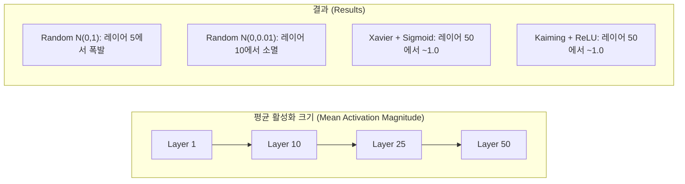
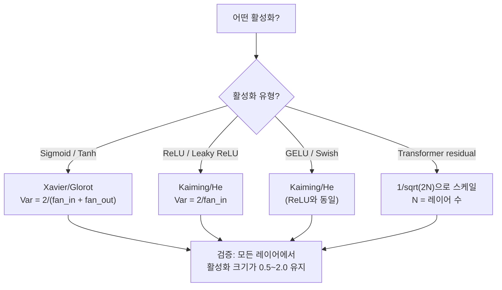

# 가중치 초기화와 학습 안정성 (Weight Initialization and Training Stability)

> 잘못 초기화하면 학습이 시작조차 되지 않습니다. 올바르게 초기화하면 50개 레이어가 3개만큼 부드럽게 학습합니다.

**Type:** Build
**Languages:** Python
**Prerequisites:** Lesson 03.04 (Activation Functions), Lesson 03.07 (Regularization)
**Time:** ~90 minutes

## 학습 목표 (Learning Objectives)

- 제로, 무작위, Xavier/Glorot, Kaiming/He 초기화 전략을 구현하고, 50개 레이어를 통과하는 활성화 크기에 미치는 영향을 측정합니다
- Xavier init이 Var(w) = 2/(fan_in + fan_out)을, Kaiming이 Var(w) = 2/fan_in을 쓰는 이유를 유도합니다
- 제로 초기화의 대칭 문제를 보이고, 무작위 스케일만으로는 부족한 이유를 설명합니다
- 활성화 함수에 맞는 초기화 전략을 짝짓습니다: sigmoid/tanh에는 Xavier, ReLU/GELU에는 Kaiming

## 문제 상황 (The Problem)

모든 가중치를 0으로 초기화합니다. 아무것도 배우지 않습니다. 모든 뉴런이 같은 함수를 계산하고, 같은 기울기를 받고, 동일하게 업데이트됩니다. 10,000 에폭 후에도 512개 뉴런 은닉층은 여전히 같은 뉴런의 512개 복사본입니다. 512개 파라미터 값을 치렀는데 1개만 얻었습니다.

너무 크게 초기화합니다. 활성화가 네트워크를 통과하며 폭발합니다. 레이어 10쯤이면 값이 1e15에 닿습니다. 레이어 20이면 무한대로 오버플로합니다. 기울기도 역방향으로 같은 궤적을 따릅니다.

표준 정규분포에서 무작위로 초기화합니다. 3개 레이어에서는 됩니다. 50개 레이어에서는 무작위 스케일이 조금만 작아도 신호가 0으로 붕괴하고, 조금만 커도 무한대로 폭주합니다. "된다"와 "깨진다"의 경계가 면도날처럼 얇습니다.

가중치 초기화는 딥러닝에서 가장 과소평가된 결정입니다. 아키텍처는 논문을 받고, 옵티마이저는 블로그를 받습니다. 초기화는 각주를 받습니다. 하지만 잘못하면 다른 것은 아무 의미가 없습니다 — 학습이 시작되기 전에 네트워크가 죽은 것입니다.

## 핵심 개념 (The Concept)

### 대칭 문제 (The Symmetry Problem)

레이어의 모든 뉴런은 같은 구조입니다: 입력에 가중치를 곱하고, 편향을 더하고, 활성화를 적용합니다. 모든 가중치가 같은 값으로 시작하면(0이 극단적인 경우) 모든 뉴런이 같은 출력을 계산합니다. 역전파에서 모든 뉴런이 같은 기울기를 받습니다. 업데이트 스텝에서 모든 뉴런이 같은 양만큼 변합니다.

막혔습니다. 네트워크에 수백 개의 파라미터가 있어도 모두 발을 맞춰 움직입니다. 이를 대칭(symmetry)이라 하며, 무작위 초기화는 이를 깨는 무식하지만 효과적인 방법입니다. 각 뉴런이 가중치 공간의 다른 지점에서 시작해 서로 다른 특성을 배웁니다.

하지만 "무작위"만으로는 부족합니다. 무작위성의 *스케일*이 네트워크가 학습할지 여부를 결정합니다.

### 레이어를 통한 분산 전파 (Variance Propagation Through Layers)

fan_in개 입력이 있는 단일 레이어를 생각해 보세요:

```
z = w1*x1 + w2*x2 + ... + w_n*x_n
```

각 가중치 wi가 분산 Var(w)인 분포에서 뽑히고 각 입력 xi의 분산이 Var(x)이면, 출력 분산은:

```
Var(z) = fan_in * Var(w) * Var(x)
```

Var(w) = 1이고 fan_in = 512이면, 출력 분산은 입력 분산의 512배입니다. 10개 레이어 후: 512^10 = 1.2e27. 신호가 폭발했습니다.

Var(w) = 0.001이면, 출력 분산은 레이어마다 0.001 * 512 = 0.512배로 줄어듭니다. 10개 레이어 후: 0.512^10 = 0.00013. 신호가 사라졌습니다.

목표: Var(z) = Var(x)가 되도록 Var(w)를 고릅니다. 레이어를 지나도 신호 크기가 일정하게 유지됩니다.

### Xavier/Glorot 초기화

Glorot와 Bengio (2010)는 sigmoid와 tanh 활성화에 대한 해를 유도했습니다. 순전파와 역전파 모두에서 분산을 일정하게 유지하려면:

```
Var(w) = 2 / (fan_in + fan_out)
```

실무에서 가중치는 다음에서 뽑습니다:

```
w ~ Uniform(-limit, limit)  where limit = sqrt(6 / (fan_in + fan_out))
```

또는:

```
w ~ Normal(0, sqrt(2 / (fan_in + fan_out)))
```

제대로 초기화된 활성화가 머무는 0 근처에서 sigmoid와 tanh가 대략 선형이기 때문에 동작합니다. 수십 개 레이어를 지나도 분산이 안정적으로 유지됩니다.

### Kaiming/He 초기화

ReLU는 출력의 절반을 죽입니다(음수는 전부 0). 평균적으로 입력의 절반이 0이 되므로 유효 fan_in이 절반입니다. Xavier init은 이를 반영하지 않아 — 필요한 분산을 과소평가합니다.

He et al. (2015)이 공식을 조정했습니다:

```
Var(w) = 2 / fan_in
```

가중치는 다음에서 뽑습니다:

```
w ~ Normal(0, sqrt(2 / fan_in))
```

2라는 인자가 ReLU가 활성화의 절반을 0으로 만드는 것을 보상합니다. 없으면 신호가 레이어마다 약 0.5배로 줄어듭니다. 50개 레이어면: 0.5^50 = 8.8e-16. Kaiming init이 이를 막습니다.

### 트랜스포머 초기화

GPT-2는 다른 패턴을 도입했습니다. Residual 연결은 각 서브레이어 출력을 입력에 더합니다:

```
x = x + sublayer(x)
```

매번 더할 때마다 분산이 커집니다. residual 레이어가 N개면 분산이 N에 비례해 커집니다. GPT-2는 residual 레이어의 가중치를 1/sqrt(2N)으로 스케일합니다. N은 레이어 수입니다. 이렇게 누적 신호 크기를 안정적으로 유지합니다.

Llama 3(4,050억 파라미터, 126개 레이어)도 비슷한 방식을 씁니다. 이 스케일링이 없으면 residual 스트림이 126개 attention·feedforward 블록을 지나며 무한히 커집니다.

```mermaid
flowchart TD
    subgraph "제로 초기화 (Zero Init)"
        Z1["Layer 1<br/>모든 가중치 = 0"] --> Z2["Layer 2<br/>모든 뉴런이 동일"]
        Z2 --> Z3["Layer 3<br/>여전히 동일"]
        Z3 --> ZR["결과: 너비와 무관하게<br/>유효 뉴런 1개"]
    end

    subgraph "Xavier Init"
        X1["Layer 1<br/>Var = 2/(fan_in+fan_out)"] --> X2["Layer 2<br/>신호 안정"]
        X2 --> X3["Layer 50<br/>신호 안정"]
        X3 --> XR["결과: sigmoid/tanh로<br/>학습 가능"]
    end

    subgraph "Kaiming Init"
        K1["Layer 1<br/>Var = 2/fan_in"] --> K2["Layer 2<br/>신호 안정"]
        K2 --> K3["Layer 50<br/>신호 안정"]
        K3 --> KR["결과: ReLU/GELU로<br/>학습 가능"]
    end
```



### 50개 레이어를 통과하는 활성화 크기



### 올바른 초기화 고르기



```figure
weight-init-variance
```

## 직접 만들기 (Build It)

### Step 1: Initialization Strategies

가중치 행렬을 초기화하는 네 가지 방법입니다. 각각 fan_in개 열과 fan_out개 행이 있는 리스트의 리스트(2D 행렬)를 반환합니다.

```python
import math
import random


def zero_init(fan_in, fan_out):
    return [[0.0 for _ in range(fan_in)] for _ in range(fan_out)]


def random_init(fan_in, fan_out, scale=1.0):
    return [[random.gauss(0, scale) for _ in range(fan_in)] for _ in range(fan_out)]


def xavier_init(fan_in, fan_out):
    std = math.sqrt(2.0 / (fan_in + fan_out))
    return [[random.gauss(0, std) for _ in range(fan_in)] for _ in range(fan_out)]


def kaiming_init(fan_in, fan_out):
    std = math.sqrt(2.0 / fan_in)
    return [[random.gauss(0, std) for _ in range(fan_in)] for _ in range(fan_out)]
```

### Step 2: Activation Functions

각 초기화 전략을 의도한 활성화와 함께 테스트하려면 sigmoid, tanh, ReLU가 필요합니다.

```python
def sigmoid(x):
    x = max(-500, min(500, x))
    return 1.0 / (1.0 + math.exp(-x))


def tanh_act(x):
    return math.tanh(x)


def relu(x):
    return max(0.0, x)
```

### Step 3: Forward Pass Through 50 Layers

깊은 네트워크에 무작위 데이터를 통과시키고 각 레이어의 평균 활성화 크기를 측정합니다.

```python
def forward_deep(init_fn, activation_fn, n_layers=50, width=64, n_samples=100):
    random.seed(42)
    layer_magnitudes = []

    inputs = [[random.gauss(0, 1) for _ in range(width)] for _ in range(n_samples)]

    for layer_idx in range(n_layers):
        weights = init_fn(width, width)
        biases = [0.0] * width

        new_inputs = []
        for sample in inputs:
            output = []
            for neuron_idx in range(width):
                z = sum(weights[neuron_idx][j] * sample[j] for j in range(width)) + biases[neuron_idx]
                output.append(activation_fn(z))
            new_inputs.append(output)
        inputs = new_inputs

        magnitudes = []
        for sample in inputs:
            magnitudes.append(sum(abs(v) for v in sample) / width)
        mean_mag = sum(magnitudes) / len(magnitudes)
        layer_magnitudes.append(mean_mag)

    return layer_magnitudes
```

### Step 4: The Experiment

모든 조합을 실행합니다: 제로 init, random N(0,1), random N(0,0.01), Xavier+sigmoid, Xavier+tanh, Kaiming+ReLU. 핵심 레이어에서의 크기를 출력합니다.

```python
def run_experiment():
    configs = [
        ("Zero init + Sigmoid", lambda fi, fo: zero_init(fi, fo), sigmoid),
        ("Random N(0,1) + ReLU", lambda fi, fo: random_init(fi, fo, 1.0), relu),
        ("Random N(0,0.01) + ReLU", lambda fi, fo: random_init(fi, fo, 0.01), relu),
        ("Xavier + Sigmoid", xavier_init, sigmoid),
        ("Xavier + Tanh", xavier_init, tanh_act),
        ("Kaiming + ReLU", kaiming_init, relu),
    ]

    print(f"{'Strategy':<30} {'L1':>10} {'L5':>10} {'L10':>10} {'L25':>10} {'L50':>10}")
    print("-" * 80)

    for name, init_fn, act_fn in configs:
        mags = forward_deep(init_fn, act_fn)
        row = f"{name:<30}"
        for idx in [0, 4, 9, 24, 49]:
            val = mags[idx]
            if val > 1e6:
                row += f" {'EXPLODED':>10}"
            elif val < 1e-6:
                row += f" {'VANISHED':>10}"
            else:
                row += f" {val:>10.4f}"
        print(row)
```

### Step 5: Symmetry Demonstration

제로 init이 동일한 뉴런을 만든다는 것을 보입니다.

```python
def symmetry_demo():
    random.seed(42)
    weights = zero_init(2, 4)
    biases = [0.0] * 4

    inputs = [0.5, -0.3]
    outputs = []
    for neuron_idx in range(4):
        z = sum(weights[neuron_idx][j] * inputs[j] for j in range(2)) + biases[neuron_idx]
        outputs.append(sigmoid(z))

    print("\nSymmetry Demo (4 neurons, zero init):")
    for i, out in enumerate(outputs):
        print(f"  Neuron {i}: output = {out:.6f}")
    all_same = all(abs(outputs[i] - outputs[0]) < 1e-10 for i in range(len(outputs)))
    print(f"  All identical: {all_same}")
    print(f"  Effective parameters: 1 (not {len(weights) * len(weights[0])})")
```

### Step 6: Layer-by-Layer Magnitude Report

50개 레이어에 걸친 활성화 크기의 텍스트 막대 차트를 출력합니다.

```python
def magnitude_report(name, magnitudes):
    print(f"\n{name}:")
    for i, mag in enumerate(magnitudes):
        if i % 5 == 0 or i == len(magnitudes) - 1:
            if mag > 1e6:
                bar = "X" * 50 + " EXPLODED"
            elif mag < 1e-6:
                bar = "." + " VANISHED"
            else:
                bar_len = min(50, max(1, int(mag * 10)))
                bar = "#" * bar_len
            print(f"  Layer {i+1:3d}: {bar} ({mag:.6f})")
```

## 활용하기 (Use It)

PyTorch는 이를 내장 함수로 제공합니다:

```python
import torch
import torch.nn as nn

layer = nn.Linear(512, 256)

nn.init.xavier_uniform_(layer.weight)
nn.init.xavier_normal_(layer.weight)

nn.init.kaiming_uniform_(layer.weight, nonlinearity='relu')
nn.init.kaiming_normal_(layer.weight, nonlinearity='relu')

nn.init.zeros_(layer.bias)
```

`nn.Linear(512, 256)`을 호출하면 PyTorch는 기본적으로 Kaiming uniform 초기화를 씁니다. 대부분의 단순 네트워크가 "그냥 되는" 이유입니다 — PyTorch가 이미 올바른 선택을 했습니다. 하지만 커스텀 아키텍처를 만들거나 20개보다 깊은 레이어로 가면, 무엇이 일어나는지 이해하고 기본값을 덮어쓸 필요가 있을 수 있습니다.

트랜스포머에서 HuggingFace 모델은 보통 `_init_weights` 메서드에서 초기화를 처리합니다. GPT-2 구현은 residual 투영을 1/sqrt(N)으로 스케일합니다. 트랜스포머를 처음부터 만들면 이를 직접 추가해야 합니다.

## 산출물 (Ship It)

이 레슨의 산출물:
- `outputs/prompt-init-strategy.md` -- 가중치 초기화 문제를 진단하고 올바른 전략을 추천하는 프롬프트

## 연습 문제 (Exercises)

1. LeCun 초기화(Var = 1/fan_in, SELU 활성화용)를 추가하세요. LeCun init + tanh로 50층 실험을 돌리고 Xavier + tanh와 비교하세요.

2. GPT-2 residual 스케일링을 구현하세요: residual 스트림에 더하기 전에 각 레이어 출력에 1/sqrt(2*N)을 곱합니다. 스케일링 유무로 50개 레이어를 돌리고 residual 크기가 얼마나 빨리 커지는지 측정하세요.

3. 네트워크의 레이어 차원과 활성화 유형을 받아 올바른 초기화를 추천하고, 현재 init이 문제를 일으킬지 경고하는 "init health check" 함수를 만드세요.

4. fan_in = 16 vs fan_in = 1024로 실험을 돌리세요. Xavier와 Kaiming은 fan_in에 적응하지만 random init은 그렇지 않습니다. 레이어가 커질수록 "된다"와 "깨진다"의 격차가 어떻게 넓어지는지 보이세요.

5. 직교 초기화(orthogonal initialization)를 구현하세요(무작위 행렬을 만들고 SVD를 계산한 뒤 직교 행렬 U를 사용). 50층 ReLU 네트워크에서 Kaiming과 비교하세요.

## 핵심 용어 (Key Terms)

| Term | What people say | What it actually means |
|------|----------------|----------------------|
| Weight initialization (가중치 초기화) | "시작 가중치를 무작위로 설정" | 네트워크가 아예 학습할 수 있는지를 결정하는 초기 가중치 값 선택 전략 |
| Symmetry breaking (대칭 깨기) | "뉴런을 다르게 만들기" | 뉴런이 동일한 함수를 계산하지 않고 서로 다른 특성을 배우도록 무작위 초기화를 사용 |
| Fan-in | "뉴런으로 들어오는 입력 수" | 들어오는 연결 수; 가중치 합에서 입력 분산이 어떻게 누적되는지 결정 |
| Fan-out | "뉴런에서 나가는 출력 수" | 나가는 연결 수; 역전파 중 기울기 분산 유지에 관련 |
| Xavier/Glorot init | "시그모이드용 초기화" | Var(w) = 2/(fan_in + fan_out); sigmoid·tanh 활성화를 통과하며 분산을 보존하도록 설계 |
| Kaiming/He init | "ReLU용 초기화" | Var(w) = 2/fan_in; ReLU가 활성화의 절반을 0으로 만드는 것을 반영 |
| Variance propagation (분산 전파) | "레이어를 지나며 신호가 커지거나 줄어드는 방식" | 가중치 스케일에 따라 레이어마다 활성화 분산이 어떻게 바뀌는지에 대한 수학적 분석 |
| Residual scaling (잔차 스케일링) | "GPT-2의 init 트릭" | N개 트랜스포머 레이어를 지나며 분산이 커지지 않도록 residual 연결 가중치를 1/sqrt(2N)으로 스케일 |
| Dead network (죽은 네트워크) | "아무것도 학습하지 않음" | 나쁜 초기화로 모든 기울기가 0이거나 모든 활성화가 포화되어 학습이 불가능한 네트워크 |
| Exploding activations (활성화 폭발) | "값이 무한대로 감" | 가중치 분산이 너무 커서 레이어를 지나며 활성화 크기가 지수적으로 커지는 현상 |

## 더 읽을거리 (Further Reading)

- Glorot & Bengio, "Understanding the difficulty of training deep feedforward neural networks" (2010) -- 분산 분석이 담긴 원본 Xavier 초기화 논문
- He et al., "Delving Deep into Rectifiers" (2015) -- ReLU 네트워크용 Kaiming 초기화 소개
- Radford et al., "Language Models are Unsupervised Multitask Learners" (2019) -- residual 스케일링 초기화가 담긴 GPT-2 논문
- Mishkin & Matas, "All You Need is a Good Init" (2016) -- 해석적 공식의 경험적 대안으로 layer-sequential unit-variance 초기화
