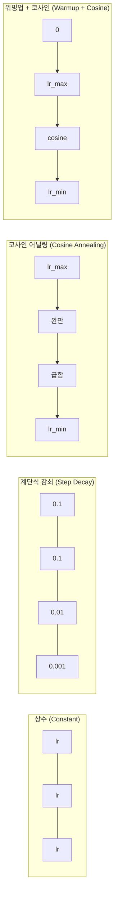
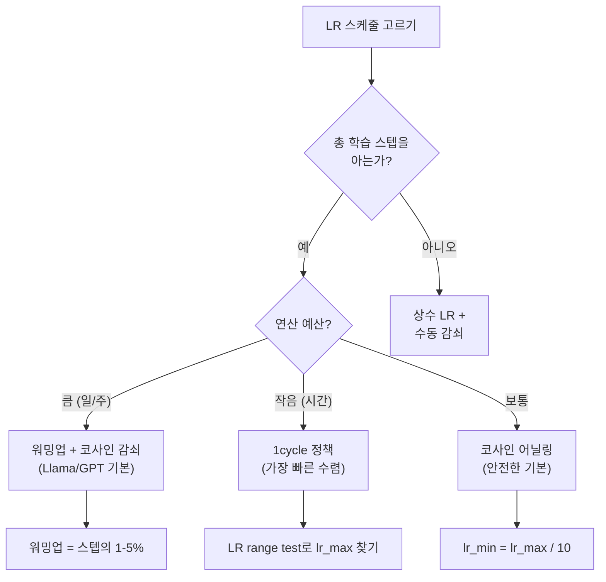
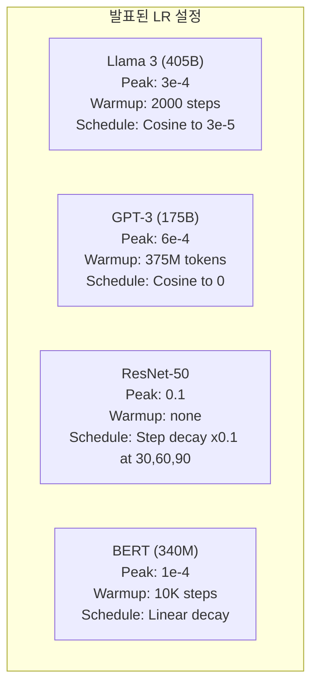

# 학습률 스케줄과 워밍업 (Learning Rate Schedules and Warmup)

> 학습률은 가장 중요한 단일 하이퍼파라미터입니다. 아키텍처가 아닙니다. 데이터셋 크기가 아닙니다. 활성화 함수가 아닙니다. 학습률입니다. 다른 것을 하나도 튜닝하지 않더라도, 이것만은 튜닝하세요.

**Type:** Build
**Languages:** Python
**Prerequisites:** Lesson 03.06 (Optimizers), Lesson 03.08 (Weight Initialization)
**Time:** ~90 minutes

## 학습 목표 (Learning Objectives)

- 상수, 계단식 감쇠, 코사인 어닐링, 워밍업 + 코사인, 1cycle 학습률 스케줄을 처음부터 구현합니다
- 학습률 선택의 세 가지 실패 모드를 보입니다: 발산(너무 높음), 정체(너무 낮음), 진동(감쇠 없음)
- Adam 계열 옵티마이저에 워밍업이 필요한 이유와, 초기 학습을 어떻게 안정화하는지 설명합니다
- 같은 과제에서 다섯 스케줄의 수렴 속도를 비교하고, 주어진 학습 예산에 맞는 것을 고릅니다

## 문제 상황 (The Problem)

학습률을 0.1로 둡니다. 학습이 발산합니다 — 손실이 3스텝 만에 무한대로 뜁니다. 0.0001로 둡니다. 학습이 기어갑니다 — 100 에폭 후에도 모델이 무작위 상태에서 거의 움직이지 않았습니다. 0.01로 둡니다. 50 에폭은 잘 되다가, 손실이 최솟값 주위에서 진동하며 절대 도달하지 못합니다. 스텝이 너무 크기 때문입니다.

최적 학습률은 상수가 아닙니다. 학습 중에 바뀝니다. 초반에는 빠르게 땅을 덮기 위해 큰 스텝이 필요합니다. 후반에는 날카로운 최솟값에 안착하기 위해 아주 작은 스텝이 필요합니다. 90% 정확도 모델과 95% 정확도 모델의 차이는 종종 스케줄뿐입니다.

지난 3년간 발표된 주요 모델은 모두 학습률 스케줄을 씁니다. Llama 3는 피크 lr=3e-4, 2000 워밍업 스텝, 코사인 감쇠로 3e-5까지 내렸습니다. GPT-3는 lr=6e-4, 3억 7,500만 토큰에 걸친 워밍업을 썼습니다. 임의 선택이 아닙니다. 수백만 달러가 든 광범위한 하이퍼파라미터 스윕의 결과입니다.

스케줄을 이해해야 하는 이유: 기본값은 당신의 문제에 맞지 않습니다. 사전학습 모델을 파인튜닝할 때 올바른 스케줄은 처음부터 학습할 때와 다릅니다. 배치 크기를 키우면 워밍업 기간을 바꿔야 합니다. 스텝 10,000에서 학습이 깨지면 스케줄 문제인지 다른 문제인지 알아야 합니다.

## 핵심 개념 (The Concept)

### 상수 학습률 (Constant Learning Rate)

가장 단순한 접근입니다. 숫자를 하나 고르고 매 스텝에 씁니다.

```
lr(t) = lr_0
```

거의 최적이 아닙니다. 학습 후반에는 너무 높거나(최솟값 주위 진동), 초반에는 너무 낮습니다(작은 스텝으로 연산 낭비). 작은 모델과 디버깅에는 괜찮습니다. 한 시간 넘게 학습하는 것에는 끔찍한 선택입니다.

### 계단식 감쇠 (Step Decay)

ResNet 시대의 구식 접근입니다. 고정 에폭에서 학습률을 배수(보통 10배)로 자릅니다.

```
lr(t) = lr_0 * gamma^(floor(epoch / step_size))
```

gamma = 0.1, step_size = 30이면: 30 에폭마다 lr이 10배 떨어집니다. ResNet-50이 이를 썼습니다 — lr=0.1, 에폭 30, 60, 90에서 10배 하락.

문제: 최적 감쇠 지점이 데이터셋과 아키텍처에 의존합니다. 다른 문제로 옮기면 언제 내릴지 다시 튜닝해야 합니다. 전환이 급격합니다 — 비율이 갑자기 바뀔 때 손실이 스파이크할 수 있습니다.

### 코사인 어닐링 (Cosine Annealing)

최대 학습률에서 최솟값까지 코사인 곡선을 따라 부드럽게 감쇠합니다:

```
lr(t) = lr_min + 0.5 * (lr_max - lr_min) * (1 + cos(pi * t / T))
```

t는 현재 스텝, T는 총 스텝 수입니다.

t=0에서 코사인 항은 1이므로 lr = lr_max. t=T에서 코사인 항은 -1이므로 lr = lr_min. 감쇠는 처음에 완만하고, 중간에 가속되며, 끝에서 다시 완만해집니다.

대부분의 현대 학습 실행의 기본값입니다. lr_max와 lr_min 외에 튜닝할 하이퍼파라미터가 없습니다. 코사인 형태는 대부분의 학습이 중간에서 일어난다는 경험적 관찰과 맞습니다 — 그 중요한 구간에서 합리적인 스텝 크기가 필요합니다.

### 워밍업: 작게 시작하는 이유 (Warmup)

Adam과 다른 적응형 옵티마이저는 기울기 평균과 분산의 이동 추정치를 유지합니다. 스텝 0에서 이 추정치는 0으로 초기화됩니다. 처음 몇 번의 기울기 업데이트는 쓰레기 통계에 기반합니다. 이 기간에 학습률이 크면 모델이 크고 방향이 잘못된 스텝을 밟습니다.

워밍업이 이를 고칩니다. 아주 작은 학습률(종종 lr_max / warmup_steps, 또는 심지어 0)에서 시작해 처음 N 스텝에 걸쳐 선형으로 lr_max까지 올립니다. 전체 학습률에 도달할 때쯤 Adam의 통계가 안정화된 상태입니다.

```
lr(t) = lr_max * (t / warmup_steps)     for t < warmup_steps
```

전형적인 워밍업: 총 학습 스텝의 1-5%. Llama 3는 약 1.8조 토큰을 학습하며 2000 스텝 워밍업했습니다. GPT-3는 3억 7,500만 토큰에 걸쳐 워밍업했습니다.

### 선형 워밍업 + 코사인 감쇠

현대의 기본값입니다. 선형으로 올린 뒤 코사인으로 감쇠합니다:

```
if t < warmup_steps:
    lr(t) = lr_max * (t / warmup_steps)
else:
    progress = (t - warmup_steps) / (total_steps - warmup_steps)
    lr(t) = lr_min + 0.5 * (lr_max - lr_min) * (1 + cos(pi * progress))
```

Llama, GPT, PaLM, 대부분의 현대 트랜스포머가 쓰는 방식입니다. 워밍업이 초기 불안정성을 막고, 코사인 감쇠가 모델을 좋은 최솟값에 안착시킵니다.

### 1cycle 정책 (1cycle Policy)

Leslie Smith의 발견(2018): 학습 전반부에서 학습률을 낮은 값에서 높은 값으로 올리고, 후반부에서 다시 내립니다. 직관에 반합니다 — 왜 중간에 학습률을 *올리나요*?

이론: 높은 학습률은 최적화 궤적에 노이즈를 더해 정규화 역할을 합니다. 모델은 상승 단계에서 손실 지형을 더 많이 탐색하며 더 나은 분지를 찾습니다. 하강 단계는 찾은 최선 분지 안에서 정제합니다.

```
Phase 1 (0 to T/2):    lr ramps from lr_max/25 to lr_max
Phase 2 (T/2 to T):    lr ramps from lr_max to lr_max/10000
```

고정된 연산 예산에서 1cycle은 종종 코사인 어닐링보다 빠르게 학습합니다. 트레이드오프: 총 스텝 수를 미리 알아야 합니다.

### 스케줄 형태



### 의사결정 흐름도



### 발표된 모델의 실제 수치



```figure
lr-schedule
```

## 직접 만들기 (Build It)

### Step 1: Schedule Functions

각 함수는 현재 스텝을 받아 그 스텝의 학습률을 반환합니다.

```python
import math


def constant_schedule(step, lr=0.01, **kwargs):
    return lr


def step_decay_schedule(step, lr=0.1, step_size=100, gamma=0.1, **kwargs):
    return lr * (gamma ** (step // step_size))


def cosine_schedule(step, lr=0.01, total_steps=1000, lr_min=1e-5, **kwargs):
    if step >= total_steps:
        return lr_min
    return lr_min + 0.5 * (lr - lr_min) * (1 + math.cos(math.pi * step / total_steps))


def warmup_cosine_schedule(step, lr=0.01, total_steps=1000, warmup_steps=100, lr_min=1e-5, **kwargs):
    if total_steps <= warmup_steps:
        return lr * (step / max(warmup_steps, 1))
    if step < warmup_steps:
        return lr * step / warmup_steps
    progress = (step - warmup_steps) / (total_steps - warmup_steps)
    return lr_min + 0.5 * (lr - lr_min) * (1 + math.cos(math.pi * progress))


def one_cycle_schedule(step, lr=0.01, total_steps=1000, **kwargs):
    mid = max(total_steps // 2, 1)
    if step < mid:
        return (lr / 25) + (lr - lr / 25) * step / mid
    else:
        progress = (step - mid) / max(total_steps - mid, 1)
        return lr * (1 - progress) + (lr / 10000) * progress
```

### Step 2: Visualize All Schedules

학습에 걸쳐 각 스케줄이 어떻게 변하는지 텍스트 기반 플롯으로 출력합니다.

```python
def visualize_schedule(name, schedule_fn, total_steps=500, **kwargs):
    steps = list(range(0, total_steps, total_steps // 20))
    if total_steps - 1 not in steps:
        steps.append(total_steps - 1)

    lrs = [schedule_fn(s, total_steps=total_steps, **kwargs) for s in steps]
    max_lr = max(lrs) if max(lrs) > 0 else 1.0

    print(f"\n{name}:")
    for s, lr_val in zip(steps, lrs):
        bar_len = int(lr_val / max_lr * 40)
        bar = "#" * bar_len
        print(f"  Step {s:4d}: lr={lr_val:.6f} {bar}")
```

### Step 3: Training Network

이전 레슨과 같은 circle 데이터셋의 단순 2층 네트워크이지만, 이제 스케줄을 바꿉니다.

```python
import random


def sigmoid(x):
    x = max(-500, min(500, x))
    return 1.0 / (1.0 + math.exp(-x))


def relu(x):
    return max(0.0, x)


def relu_deriv(x):
    return 1.0 if x > 0 else 0.0


def make_circle_data(n=200, seed=42):
    random.seed(seed)
    data = []
    for _ in range(n):
        x = random.uniform(-2, 2)
        y = random.uniform(-2, 2)
        label = 1.0 if x * x + y * y < 1.5 else 0.0
        data.append(([x, y], label))
    return data


def train_with_schedule(schedule_fn, schedule_name, data, epochs=300, base_lr=0.05, **kwargs):
    random.seed(0)
    hidden_size = 8
    total_steps = epochs * len(data)

    std = math.sqrt(2.0 / 2)
    w1 = [[random.gauss(0, std) for _ in range(2)] for _ in range(hidden_size)]
    b1 = [0.0] * hidden_size
    w2 = [random.gauss(0, std) for _ in range(hidden_size)]
    b2 = 0.0

    step = 0
    epoch_losses = []

    for epoch in range(epochs):
        total_loss = 0
        correct = 0

        for x, target in data:
            lr = schedule_fn(step, lr=base_lr, total_steps=total_steps, **kwargs)

            z1 = []
            h = []
            for i in range(hidden_size):
                z = w1[i][0] * x[0] + w1[i][1] * x[1] + b1[i]
                z1.append(z)
                h.append(relu(z))

            z2 = sum(w2[i] * h[i] for i in range(hidden_size)) + b2
            out = sigmoid(z2)

            error = out - target
            d_out = error * out * (1 - out)

            for i in range(hidden_size):
                d_h = d_out * w2[i] * relu_deriv(z1[i])
                w2[i] -= lr * d_out * h[i]
                for j in range(2):
                    w1[i][j] -= lr * d_h * x[j]
                b1[i] -= lr * d_h
            b2 -= lr * d_out

            total_loss += (out - target) ** 2
            if (out >= 0.5) == (target >= 0.5):
                correct += 1
            step += 1

        avg_loss = total_loss / len(data)
        accuracy = correct / len(data) * 100
        epoch_losses.append(avg_loss)

    return epoch_losses
```

### Step 4: Compare All Schedules

같은 네트워크를 각 스케줄로 학습하고 최종 손실과 수렴 행동을 비교합니다.

```python
def compare_schedules(data):
    configs = [
        ("Constant", constant_schedule, {}),
        ("Step Decay", step_decay_schedule, {"step_size": 15000, "gamma": 0.1}),
        ("Cosine", cosine_schedule, {"lr_min": 1e-5}),
        ("Warmup+Cosine", warmup_cosine_schedule, {"warmup_steps": 3000, "lr_min": 1e-5}),
        ("1cycle", one_cycle_schedule, {}),
    ]

    print(f"\n{'Schedule':<20} {'Start Loss':>12} {'Mid Loss':>12} {'End Loss':>12} {'Best Loss':>12}")
    print("-" * 70)

    for name, schedule_fn, extra_kwargs in configs:
        losses = train_with_schedule(schedule_fn, name, data, epochs=300, base_lr=0.05, **extra_kwargs)
        mid_idx = len(losses) // 2
        best = min(losses)
        print(f"{name:<20} {losses[0]:>12.6f} {losses[mid_idx]:>12.6f} {losses[-1]:>12.6f} {best:>12.6f}")
```

### Step 5: LR Too High vs Too Low

세 가지 실패 모드를 보입니다: 너무 높음(발산), 너무 낮음(기어감), 적절함.

```python
def lr_sensitivity(data):
    learning_rates = [1.0, 0.1, 0.01, 0.001, 0.0001]

    print("\nLR Sensitivity (constant schedule, 100 epochs):")
    print(f"  {'LR':>10} {'Start Loss':>12} {'End Loss':>12} {'Status':>15}")
    print("  " + "-" * 52)

    for lr in learning_rates:
        losses = train_with_schedule(constant_schedule, f"lr={lr}", data, epochs=100, base_lr=lr)
        start = losses[0]
        end = losses[-1]

        if end > start or math.isnan(end) or end > 1.0:
            status = "DIVERGED"
        elif end > start * 0.9:
            status = "BARELY MOVED"
        elif end < 0.15:
            status = "CONVERGED"
        else:
            status = "LEARNING"

        end_str = f"{end:.6f}" if not math.isnan(end) else "NaN"
        print(f"  {lr:>10.4f} {start:>12.6f} {end_str:>12} {status:>15}")
```

## 활용하기 (Use It)

PyTorch는 `torch.optim.lr_scheduler`에 스케줄러를 제공합니다:

```python
import torch
import torch.optim as optim
from torch.optim.lr_scheduler import CosineAnnealingLR, OneCycleLR, StepLR

model = nn.Sequential(nn.Linear(10, 64), nn.ReLU(), nn.Linear(64, 1))
optimizer = optim.Adam(model.parameters(), lr=3e-4)

scheduler = CosineAnnealingLR(optimizer, T_max=1000, eta_min=1e-5)

for step in range(1000):
    loss = train_step(model, optimizer)
    scheduler.step()
```

워밍업 + 코사인에는 lambda 스케줄러나 HuggingFace의 `get_cosine_schedule_with_warmup`을 쓰세요:

```python
from transformers import get_cosine_schedule_with_warmup

scheduler = get_cosine_schedule_with_warmup(
    optimizer,
    num_warmup_steps=2000,
    num_training_steps=100000,
)
```

HuggingFace 함수는 대부분의 Llama·GPT 파인튜닝 스크립트가 씁니다. 확신이 없으면 총 스텝의 3-5% 워밍업으로 워밍업 + 코사인을 쓰세요. 거의 모든 것에 통합니다.

## 산출물 (Ship It)

이 레슨의 산출물:
- `outputs/prompt-lr-schedule-advisor.md` -- 학습 설정에 맞는 학습률 스케줄과 하이퍼파라미터를 추천하는 프롬프트

## 연습 문제 (Exercises)

1. 지수 감쇠를 구현하세요: lr(t) = lr_0 * gamma^t, gamma = 0.999. circle 데이터셋에서 코사인 어닐링과 비교하세요.

2. 학습률 범위 테스트(Leslie Smith)를 구현하세요: 수백 스텝 동안 LR을 1e-7에서 1까지 지수적으로 올리며 학습합니다. 손실 vs LR을 플롯하세요. 최적 max LR은 손실이 증가하기 직전입니다.

3. 워밍업 + 코사인으로 학습하되 워밍업 길이를 바꾸세요: 총 스텝의 0%, 1%, 5%, 10%, 20%. 학습이 가장 안정적인 최적점을 찾으세요.

4. 워 리스타트가 있는 코사인 어닐링(SGDR)을 구현하세요: T 스텝마다 학습률을 lr_max로 리셋하고 다시 감쇠합니다. 더 긴 학습에서 표준 코사인과 비교하세요.

5. 학습 손실을 모니터링해 손실이 안정되면 워밍업에서 코사인으로 자동 전환하고, 손실이 너무 오래 정체되면 lr을 줄이는 "schedule surgeon"을 만드세요.

## 핵심 용어 (Key Terms)

| Term | What people say | What it actually means |
|------|----------------|----------------------|
| Learning rate (학습률) | "모델이 얼마나 빨리 배우는지" | 기울기에 곱해 파라미터 업데이트 크기를 정하는 스칼라 |
| Schedule (스케줄) | "시간에 따라 LR을 바꿈" | 학습 스텝을 학습률에 매핑하는 함수; 수렴을 최적화하도록 설계 |
| Warmup (워밍업) | "작은 LR로 시작" | 옵티마이저 통계를 안정화하기 위해 처음 N 스텝에 걸쳐 LR을 거의 0에서 목표값까지 선형으로 올림 |
| Cosine annealing (코사인 어닐링) | "부드러운 LR 감쇠" | 학습에 걸쳐 코사인 곡선을 따라 LR을 lr_max에서 lr_min으로 감소 |
| Step decay (계단식 감쇠) | "이정표에서 LR을 떨어뜨림" | 고정 에폭 간격에서 LR에 배수(보통 0.1)를 곱함 |
| 1cycle policy (1cycle 정책) | "올렸다가 내림" | Leslie Smith의 방법; 한 사이클에서 LR을 올렸다가 내려 더 빠른 수렴 |
| LR range test (학습률 범위 테스트) | "최적 학습률 찾기" | LR을 올리며 짧게 학습해 손실이 발산하기 시작하는 값을 찾음 |
| Cosine with warm restarts | "리셋하고 반복" | LR을 주기적으로 lr_max로 리셋하고 다시 감쇠 (SGDR) |
| Eta min | "LR의 바닥" | 스케줄이 감쇠해 도달하는 최소 학습률 |
| Peak learning rate (피크 학습률) | "최대 LR" | 학습 중 도달하는 최고 LR; 보통 워밍업 직후 |

## 더 읽을거리 (Further Reading)

- Loshchilov & Hutter, "SGDR: Stochastic Gradient Descent with Warm Restarts" (2017) -- 코사인 어닐링과 워 리스타트 소개
- Smith, "Super-Convergence: Very Fast Training of Neural Networks Using Large Learning Rates" (2018) -- 1cycle 정책 논문
- Touvron et al., "Llama 2: Open Foundation and Fine-Tuned Chat Models" (2023) -- 대규모에서 쓰인 워밍업 + 코사인 스케줄 문서화
- Goyal et al., "Accurate, Large Minibatch SGD: Training ImageNet in 1 Hour" (2017) -- 대규모 배치 학습을 위한 선형 스케일링 규칙과 워밍업
