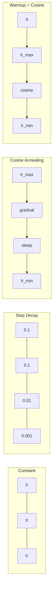
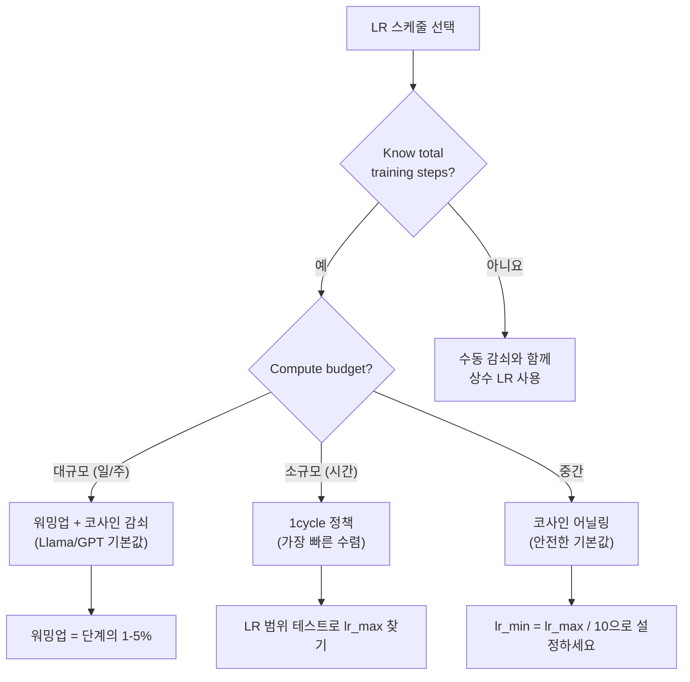
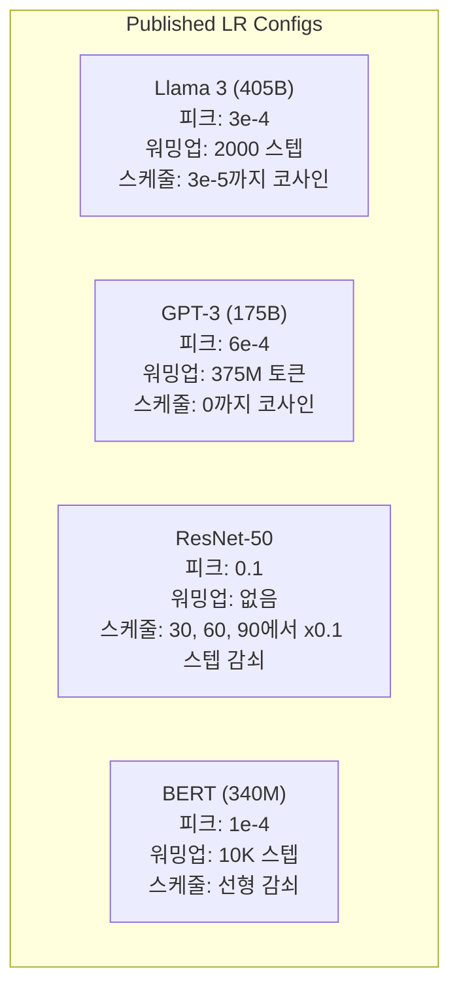

# 학습률 스케줄과 워밍업

> 학습률은 가장 중요한 하이퍼파라미터입니다. 아키텍처가 아닙니다. 데이터셋 크기가 아닙니다. 활성화 함수가 아닙니다. 학습률입니다. 다른 것을 조정하지 않는다면, 이것만은 조정해 보세요.

**유형:** Build
**언어:** Python
**선수 요건:** 0306강 (옵티마이저), 0308강 (가중치 초기화)
**시간:** 약 90분

## 학습 목표

- 상수, 단계적 감쇠, 코사인 어닐링, 워밍업 + 코사인, 1cycle 학습률 스케줄을 처음부터 구현해 보세요
- 학습률 선택의 세 가지 실패 모드인 발산(너무 높음), 정체(너무 낮음), 진동(감쇠 없음)을 시연해 보세요
- Adam 기반 옵티마이저에 워밍업이 필요한 이유와 초기 훈련을 안정화하는 방식을 설명해 보세요
- 동일한 작업에서 다섯 가지 스케줄의 수렴 속도를 비교하고, 주어진 훈련 예산에 적합한 스케줄을 선택해 보세요

## 문제점

학습률을 0.1로 설정하면 훈련이 발산합니다. 3단계 만에 손실이 무한대로 급증합니다. 0.0001로 설정하면 훈련이 정체됩니다. 100 에포크(Epoch) 후에도 모델은 랜덤 초기값에서 거의 움직이지 않습니다. 0.01로 설정하면 50 에포크(Epoch) 동안 훈련이 잘 진행되다가, 손실이 도달할 수 없는 최소값 주변에서 진동합니다. 스텝 크기가 너무 크기 때문입니다.

최적의 학습률은 상수가 아닙니다. 훈련 중에 변합니다. 초기에는 빠르게 영역을 커버하기 위해 큰 스텝이 필요합니다. 훈련 후반에는 날카로운 최소값에 수렴하기 위해 작은 스텝이 필요합니다. 정확도 90% 모델과 95% 모델의 차이는 대부분 스케줄에 있습니다.

지난 3년간 발표된 주요 모델은 모두 학습률 스케줄을 사용합니다. Llama 3는 2000단계의 워밍업과 3e-5까지의 코사인 감쇠를 포함하여 피크 lr=3e-4를 사용했습니다. GPT-3는 3억 7500만 토큰에 대한 워밍업과 함께 lr=6e-4를 사용했습니다. 이는 임의의 선택이 아닙니다. 수백만 달러가 소요된 광범위한 하이퍼파라미터 스윕의 결과입니다.

기본값이 문제 상황에 맞지 않을 수 있으므로 스케줄을 이해해야 합니다. 사전 학습된 모델을 미세 조정할 때의 올바른 스케줄은 처음부터 학습할 때와 다릅니다. 배치 크기를 늘리면 워밍업 기간도 변경해야 합니다. 학습이 10,000단계에서 중단될 경우, 스케줄 문제인지 다른 문제인지 파악해야 합니다.

## 개념

### 일정 학습률

가장 단순한 접근법입니다. 하나의 값을 선택하여 모든 단계에서 사용합니다.

```
lr(t) = lr_0
```

거의 최적의 선택이 아닙니다. 학습 후반부에는 너무 높아서(최소값 주변에서 진동) 학습 초반부에는 너무 낮아서(작은 단계로 연산력을 낭비) 문제가 될 수 있습니다. 작은 모델이나 디버깅에는 잘 작동합니다. 한 시간 이상 학습하는 모든 작업에는 최악의 선택입니다.

### 단계적 감쇠

ResNet 시대의 전통적인 접근법입니다. 고정된 에포크에서 학습률을 특정 비율(보통 10배)로 줄입니다.

```
lr(t) = lr_0 * gamma^(floor(epoch / step_size))
```

여기서 gamma = 0.1, step_size = 30은 30 에포크마다 학습률이 10배 감소한다는 의미입니다. ResNet-50은 이 방식을 사용했습니다. lr=0.1로 시작하여 에포크 30, 60, 90에서 학습률을 10배 감소시켰습니다.

문제는 최적의 감쇠 시점이 데이터셋과 아키텍처에 따라 달라진다는 점입니다. 다른 문제로 전환하면 언제 학습률을 낮출지 다시 튜닝해야 합니다. 전환이 급격하여 학습률이 갑자기 변할 때 손실이 급증할 수 있습니다.

### 코사인 어닐링

최대 학습률에서 최소 학습률까지 코사인 곡선을 따라 부드럽게 감소합니다:

```
lr(t) = lr_min + 0.5 * (lr_max - lr_min) * (1 + cos(pi * t / T))
```

여기서 t는 현재 단계이고 T는 총 단계 수입니다.

t=0일 때 코사인 항은 1이므로 lr = lr_max입니다. t=T일 때 코사인 항은 -1이므로 lr = lr_min입니다. 감소는 처음에는 완만하고, 중간에는 가속화되며, 끝부분에 다시 완만해집니다.

이 방식은 대부분의 최신 학습 실행에서 기본값으로 사용됩니다. lr_max와 lr_min 외에는 튜닝할 하이퍼파라미터가 없습니다. 코사인 형태는 대부분의 학습이 학습 중반에 일어난다는 경험적 관찰과 일치합니다. 이 중요한 기간 동안 적절한 단계 크기를 원하기 때문입니다.

### 워밍업: 왜 작게 시작하는가

Adam 및 기타 적응형 옵티마이저는 기울기 평균과 분산의 실시간 추정치를 유지합니다. 0단계에서 이 추정치는 0으로 초기화됩니다. 첫 몇 번의 기울기 업데이트는 무의미한 통계에 기반합니다. 이 기간 동안 학습률이 크다면 모델은 크고 방향이 잘못된 큰 발걸음을 내딛게 됩니다.

워밍업(Warmup)은 이 문제를 해결합니다. 아주 작은 학습률(종종 lr_max / warmup_steps 또는 0)으로 시작하여 첫 N단계 동안 lr_max까지 선형적으로 증가시킵니다. 전체 학습률에 도달할 시점에는 Adam의 통계가 안정화됩니다.

```
lr(t) = lr_max * (t / warmup_steps)     for t < warmup_steps
```

일반적인 워밍업: 전체 학습 단계의 1-5%. Llama 3는 약 1.8조 토큰으로 학습되었으며 2000단계 동안 워밍업했습니다. GPT-3는 3.75억 토큰 동안 워밍업했습니다.

### 선형 워밍업 + 코사인 감쇠

현대적 기본 설정입니다. 선형적으로 증가한 후 코사인 함수로 감쇠합니다:

```
if t < warmup_steps:
    lr(t) = lr_max * (t / warmup_steps)
else:
    progress = (t - warmup_steps) / (total_steps - warmup_steps)
    lr(t) = lr_min + 0.5 * (lr_max - lr_min) * (1 + cos(pi * progress))
```

Llama, GPT, PaLM 및 대부분의 현대적 트랜스포머가 사용하는 방식입니다. 워밍업은 초기 불안정성을 방지합니다. 코사인 감쇠는 모델을 좋은 최소값으로 수렴시킵니다.

### 1cycle 정책

Leslie Smith의 발견(2018): 학습의 첫 절반 동안 학습률을 낮은 값에서 높은 값으로 증가시키고, 두 번째 절반에서는 다시 낮추는 방식입니다. 직관적이지 않습니다 -- 왜 학습의 중간에 학습률을 *증가*시켜야 할까요?

이론: 높은 학습률은 최적화 궤적에 잡음을 추가하여 정규화 역할을 합니다. 모델은 증가 단계 동안 손실 지형을 더 넓게 탐색하여 더 좋은 분지를 찾습니다. 감소 단계는 그 후 가장 좋은 분지 내에서 세련된 최적화를 수행합니다.

```
1단계 (0 to T/2):    lr ramps from lr_max/25 to lr_max
2단계 (T/2 to T):    lr ramps from lr_max to lr_max/10000
```

1cycle은 고정된 컴퓨팅 예산에서 코사인 어닐링보다 종종 더 빠르게 학습합니다. 트레이드오프: 총 단계 수를 사전에 알아야 합니다.

### 스케줄 형태



### 의사결정 플로우차트



### 공개된 모델의 실제 수치



```figure
lr-schedule
```

## 구현하기

### 1단계: 스케줄 함수

각 함수는 현재 스텝을 받아 해당 스텝에서의 학습률을 반환합니다.

```python
import math


def constant_schedule(step, lr=0.01, **kwargs):
    return lr


def step_decay_schedule(step, lr=0.1, step_size=100, gamma=0.1, **kwargs):
    return lr * (gamma ** (step // step_size))


def cosine_schedule(step, lr=0.01, total_steps=1000, lr_min=1e-5, **kwargs):
    if step >= total_steps:
        return lr_min
    return lr_min + 0.5 * (lr - lr_min) * (1 + math.cos(math.pi * step / total_steps))


def warmup_cosine_schedule(step, lr=0.01, total_steps=1000, warmup_steps=100, lr_min=1e-5, **kwargs):
    if total_steps <= warmup_steps:
        return lr * (step / max(warmup_steps, 1))
    if step < warmup_steps:
        return lr * step / warmup_steps
    progress = (step - warmup_steps) / (total_steps - warmup_steps)
    return lr_min + 0.5 * (lr - lr_min) * (1 + math.cos(math.pi * progress))


def one_cycle_schedule(step, lr=0.01, total_steps=1000, **kwargs):
    mid = max(total_steps // 2, 1)
    if step < mid:
        return (lr / 25) + (lr - lr / 25) * step / mid
    else:
        progress = (step - mid) / max(total_steps - mid, 1)
        return lr * (1 - progress) + (lr / 10000) * progress
```

### 2단계: 모든 스케줄 시각화

각 스케줄이 학습 과정에서 어떻게 변하는지 텍스트 기반 플롯으로 출력하세요.

```python
def visualize_schedule(name, schedule_fn, total_steps=500, **kwargs):
    steps = list(range(0, total_steps, total_steps // 20))
    if total_steps - 1 not in steps:
        steps.append(total_steps - 1)

    lrs = [schedule_fn(s, total_steps=total_steps, **kwargs) for s in steps]
    max_lr = max(lrs) if max(lrs) > 0 else 1.0

    print(f"\n{name}:")
    for s, lr_val in zip(steps, lrs):
        bar_len = int(lr_val / max_lr * 40)
        bar = "#" * bar_len
        print(f"  Step {s:4d}: lr={lr_val:.6f} {bar}")
```

### 3단계: 학습 네트워크

이전 강의와 동일한 원(circle) 데이터셋에 간단한 2층 네트워크를 사용하되, 이번에는 스케줄을 변경합니다.

```python
import random


def sigmoid(x):
    x = max(-500, min(500, x))
    return 1.0 / (1.0 + math.exp(-x))


def relu(x):
    return max(0.0, x)


def relu_deriv(x):
    return 1.0 if x > 0 else 0.0


def make_circle_data(n=200, seed=42):
    random.seed(seed)
    data = []
    for _ in range(n):
        x = random.uniform(-2, 2)
        y = random.uniform(-2, 2)
        label = 1.0 if x * x + y * y < 1.5 else 0.0
        data.append(([x, y], label))
    return data


def train_with_schedule(schedule_fn, schedule_name, data, epochs=300, base_lr=0.05, **kwargs):
    random.seed(0)
    hidden_size = 8
    total_steps = epochs * len(data)

    std = math.sqrt(2.0 / 2)
    w1 = [[random.gauss(0, std) for _ in range(2)] for _ in range(hidden_size)]
    b1 = [0.0] * hidden_size
    w2 = [random.gauss(0, std) for _ in range(hidden_size)]
    b2 = 0.0

    step = 0
    epoch_losses = []

    for epoch in range(epochs):
        total_loss = 0
        correct = 0

        for x, target in data:
            lr = schedule_fn(step, lr=base_lr, total_steps=total_steps, **kwargs)

            z1 = []
            h = []
            for i in range(hidden_size):
                z = w1[i][0] * x[0] + w1[i][1] * x[1] + b1[i]
                z1.append(z)
                h.append(relu(z))

            z2 = sum(w2[i] * h[i] for i in range(hidden_size)) + b2
            out = sigmoid(z2)

            error = out - target
            d_out = error * out * (1 - out)

            for i in range(hidden_size):
                d_h = d_out * w2[i] * relu_deriv(z1[i])
                w2[i] -= lr * d_out * h[i]
                for j in range(2):
                    w1[i][j] -= lr * d_h * x[j]
                b1[i] -= lr * d_h
            b2 -= lr * d_out

            total_loss += (out - target) ** 2
            if (out >= 0.5) == (target >= 0.5):
                correct += 1
            step += 1

        avg_loss = total_loss / len(data)
        accuracy = correct / len(data) * 100
        epoch_losses.append(avg_loss)

    return epoch_losses
```

### 4단계: 모든 스케줄 비교

각 스케줄로 동일한 네트워크를 학습하고 최종 손실 및 수렴 동작을 비교하세요.

```python
def compare_schedules(data):
    configs = [
        ("Constant", constant_schedule, {}),
        ("Step Decay", step_decay_schedule, {"step_size": 15000, "gamma": 0.1}),
        ("Cosine", cosine_schedule, {"lr_min": 1e-5}),
        ("Warmup+Cosine", warmup_cosine_schedule, {"warmup_steps": 3000, "lr_min": 1e-5}),
        ("1cycle", one_cycle_schedule, {}),
    ]

    print(f"\n{'Schedule':<20} {'Start Loss':>12} {'Mid Loss':>12} {'End Loss':>12} {'Best Loss':>12}")
    print("-" * 70)

    for name, schedule_fn, extra_kwargs in configs:
        losses = train_with_schedule(schedule_fn, name, data, epochs=300, base_lr=0.05, **extra_kwargs)
        mid_idx = len(losses) // 2
        best = min(losses)
        print(f"{name:<20} {losses[0]:>12.6f} {losses[mid_idx]:>12.6f} {losses[-1]:>12.6f} {best:>12.6f}")
```

### 5단계: 학습률이 너무 높을 때 vs 너무 낮을 때

세 가지 실패 모드(너무 높을 때 발산, 너무 낮을 때 느린 진행, 적절할 때)를 시연하세요.

```python
def lr_sensitivity(data):
    learning_rates = [1.0, 0.1, 0.01, 0.001, 0.0001]

    print("\nLR Sensitivity (constant schedule, 100 epochs):")
    print(f"  {'LR':>10} {'Start Loss':>12} {'End Loss':>12} {'Status':>15}")
    print("  " + "-" * 52)

    for lr in learning_rates:
        losses = train_with_schedule(constant_schedule, f"lr={lr}", data, epochs=100, base_lr=lr)
        start = losses[0]
        end = losses[-1]

        if end > start or math.isnan(end) or end > 1.0:
            status = "DIVERGED"
        elif end > start * 0.9:
            status = "BARELY MOVED"
        elif end < 0.15:
            status = "CONVERGED"
        else:
            status = "LEARNING"

        end_str = f"{end:.6f}" if not math.isnan(end) else "NaN"
        print(f"  {lr:>10.4f} {start:>12.6f} {end_str:>12} {status:>15}")
```

## 사용하기

PyTorch는 `torch.optim.lr_scheduler`에서 스케줄러를 제공합니다:

```python
import torch
import torch.optim as optim
from torch.optim.lr_scheduler import CosineAnnealingLR, OneCycleLR, StepLR

model = nn.Sequential(nn.Linear(10, 64), nn.ReLU(), nn.Linear(64, 1))
optimizer = optim.Adam(model.parameters(), lr=3e-4)

scheduler = CosineAnnealingLR(optimizer, T_max=1000, eta_min=1e-5)

for step in range(1000):
    loss = train_step(model, optimizer)
    scheduler.step()
```

워밍업 + 코사인을 사용하려면 lambda 스케줄러나 HuggingFace의 `get_cosine_schedule_with_warmup`를 사용하세요:

```python
from transformers import get_cosine_schedule_with_warmup

scheduler = get_cosine_schedule_with_warmup(
    optimizer,
    num_warmup_steps=2000,
    num_training_steps=100000,
)
```

HuggingFace 함수는 대부분의 Llama 및 GPT 미세 조정 스크립트에서 사용됩니다. 확실하지 않은 경우, 워밍업 + 코사인을 사용하되 워밍업은 전체 스텝의 3-5%로 설정하세요. 거의 모든 경우에 잘 작동합니다.

## 출시하기

이 강의는 다음을 생성합니다:
- `outputs/prompt-lr-schedule-advisor.md` -- 학습 설정에 적합한 학습률 스케줄 및 하이퍼파라미터를 추천하는 프롬프트

## 연습 문제

1. 지수 감쇠를 구현하세요: lr(t) = lr_0 * gamma^t, 여기서 gamma = 0.999입니다. 원(circle) 데이터셋에서 코사인 어닐링과 비교하세요.

2. 학습률 범위 테스트(Leslie Smith)를 구현하세요: LR을 1e-7에서 1까지 지수적으로 증가시키며 몇 백 스텝 동안 학습하세요. LR에 대한 손실 플롯을 그리세요. 최적의 최대 LR은 손실이 증가하기 시작하기 직전입니다.

3. 워밍업 + 코사인을 사용하되, 워밍업 길이를 전체 스텝의 0%, 1%, 5%, 10%, 20%로 변화시켜 학습해 보세요. 학습이 가장 안정적인 최적점을 찾아보세요.

4. 워밍업 재시작이 포함된 코사인 어닐링(SGDR)을 구현해 보세요. T 스텝마다 학습률을 lr_max로 리셋하고 다시 감소시킵니다. 더 긴 학습 실행에서 표준 코사인 스케줄과 비교해 보세요.

5. 학습 손실을 모니터링하고, 손실이 안정화되면 워밍업에서 코사인으로 자동으로 전환하며, 손실이 너무 오래 평탄화되면 학습률을 감소시키는 '스케줄 외과의사'를 구축해 보세요.

## 핵심 용어

| 용어 | 사람들이 말하는 것 | 실제 의미 |
|------|----------------|----------------------|
| 학습률 | "모델이 얼마나 빠르게 학습하는가" | 기울기에 곱해져 매개변수 업데이트 크기를 결정하는 스칼라 값 |
| 스케줄 | "시간에 따라 LR을 변경" | 학습 스텝을 학습률에 매핑하는 함수로, 수렴을 최적화하도록 설계됨 |
| 워밍업 | "작은 LR로 시작" | 옵티마이저 통계를 안정화하기 위해 첫 N 스텝 동안 LR을 거의 0에서 목표 값까지 선형적으로 증가시키는 것 |
| 코사인 어닐링 | "부드러운 LR 감소" | 학습 동안 lr_max에서 lr_min까지 코사인 곡선을 따라 LR을 감소시키는 것 |
| 스텝 감소 | "마일스톤에서 LR을 낮추기" | 고정된 에포크 간격에서 LR에 계수(보통 0.1)를 곱하는 것 |
| 1사이클 정책 | "올라갔다 내려오기" | Leslie Smith의 방법으로, 더 빠른 수렴을 위해 단일 사이클에서 LR을 올린 후 내리는 것 |
| LR 범위 테스트 | "최적의 학습률 찾기" | 손실이 발산하기 시작하는 값을 찾기 위해 LR을 증가시키며 짧게 학습하는 것 |
| 워밍업 재시작이 포함된 코사인 | "리셋하고 반복하기" | LR을 주기적으로 lr_max로 리셋하고 다시 감소시키는 것(SGDR) |
| Eta min | "LR의 하한선" | 스케줄이 감소하여 도달하는 최소 학습률 |
| 피크 학습률 | "최대 LR" | 학습 동안 도달하는 가장 높은 LR로, 일반적으로 워밍업 이후에 발생 |

## 추가 읽기

- Loshchilov & Hutter, "SGDR: Stochastic Gradient Descent with Warm Restarts" (2017) -- 코사인 어닐링과 워밍업 재시작을 도입한 논문
- Smith, "Super-Convergence: Very Fast Training of Neural Networks Using Large Learning Rates" (2018) -- 1사이클 정책 논문
- Touvron et al., "Llama 2: Open Foundation and Fine-Tuned Chat Models" (2023) -- 대규모 규모에서 사용된 워밍업 + 코사인 스케줄을 문서화
- Goyal et al., "Accurate, Large Minibatch SGD: Training ImageNet in 1 Hour" (2017) -- 대규모 배치 학습을 위한 선형 스케일링 규칙과 워밍업
