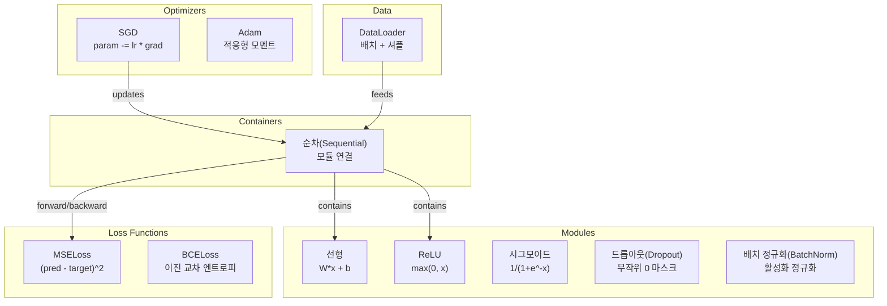
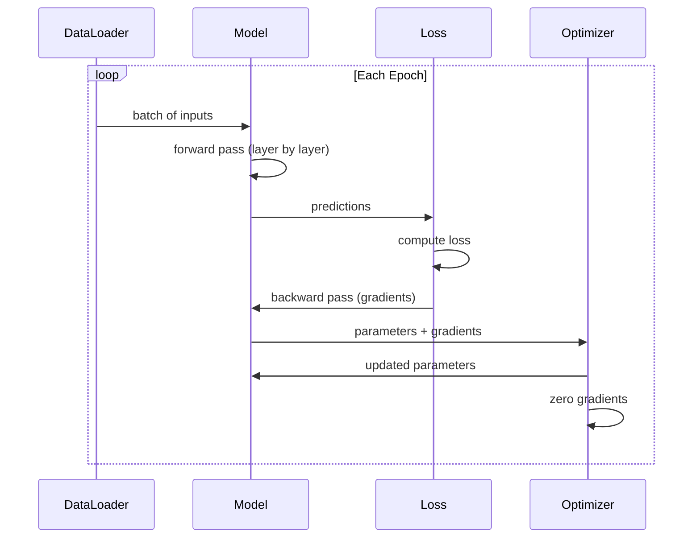
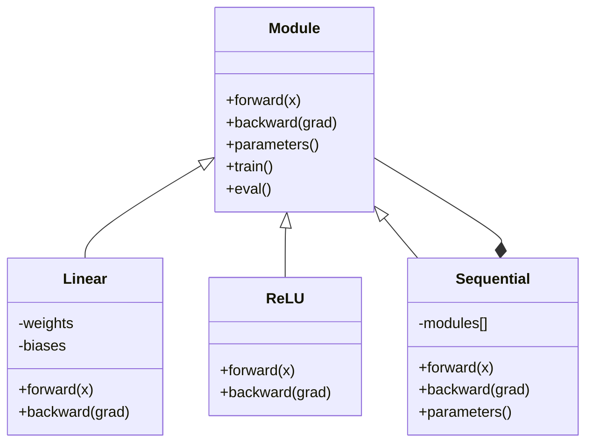

# 나만의 미니 프레임워크 구축하기

> 뉴런, 레이어, 네트워크, 역전파, 활성화 함수, 손실 함수, 옵티마이저, 정규화, 초기화, 학습률 스케줄을 각각 개별 요소로 구축했습니다. 이제 이 요소들을 하나의 프레임워크로 연결해 보세요. PyTorch가 아닙니다. TensorFlow도 아닙니다. 여러분만의 프레임워크입니다.

**유형:** Build
**언어:** Python
**선수 요건:** 03단계의 모든 강(01-09강)
**시간:** 약 120분

## 학습 목표

- Module, Linear, ReLU, Sigmoid, Dropout, BatchNorm, Sequential, 손실 함수, 옵티마이저, DataLoader를 포함하는 완전한 딥러닝 프레임워크(~500줄)를 구축합니다
- Module 추상화(forward, backward, parameters)와 train/eval 모드 전환이 필요한 이유를 설명합니다
- 모든 구성 요소를 연결하여 원(circle) 분류를 위한 4층 네트워크를 학습하는 동작하는 학습 루프를 만듭니다
- 프레임워크의 각 구성 요소를 PyTorch의 대응 요소(nn.Module, nn.Sequential, optim.Adam, DataLoader)와 매핑합니다

## 문제점

10개 강의의 구성 요소가 여러 파일에 흩어져 있습니다. 여기에는 `Value` 클래스가, 저기에는 학습 루프가, 다른 파일에는 가중치 초기화가, 또 다른 파일에는 학습률 스케줄이 있습니다. 네트워크를 학습하려면 5개 강의에서 복사-붙여넣기하고 수동으로 연결해야 합니다.

이것이 프레임워크가 해결하는 문제입니다. PyTorch는 `nn.Module`, `nn.Sequential`, `optim.Adam`, `DataLoader`와 이들을 연결하는 학습 루프 패턴을 제공합니다. TensorFlow는 `keras.Layer`, `keras.Sequential`, `keras.optimizers.Adam`를 제공합니다. 이것들은 마법이 아닙니다. 네트워크를 정의, 학습, 평가할 때마다 배관(plumbing)을 다시 만들지 않아도 되도록 만드는 조직화 패턴입니다.

Python 약 500줄로 동일한 것을 구축할 것입니다. numpy는 없습니다. 외부 의존성도 없습니다. 임의의 피드포워드 네트워크를 정의하고, SGD 또는 Adam으로 학습하며, 데이터를 배치 처리하고, dropout과 배치 정규화를 적용하고, 임의의 활성화 함수를 사용하며, 학습률을 스케줄링할 수 있는 프레임워크입니다.

이 과정을 완료하면 PyTorch에서 `model = nn.Sequential(...)`을 작성할 때 정확히 어떤 일이 일어나는지 이해하게 됩니다. `model.train()`과 `model.eval()`이 존재하는 이유를 이해하게 됩니다. `optimizer.zero_grad()`이 별도의 호출인 이유를 이해하게 됩니다. 모든 것을 직접 구축했기 때문에 모든 것을 이해하게 될 것입니다.

## 개념

### 모듈 추상화

PyTorch의 모든 레이어는 `nn.Module`을 상속합니다. 모듈은 세 가지 책임을 가집니다:

1. **forward()** -- 입력이 주어졌을 때 출력 계산
2. **parameters()** -- 모든 학습 가능한 가중치 반환
3. **backward()** -- 기울기 계산 (PyTorch에서는 autograd가 처리하며, 우리 구현에서는 명시적으로 처리)

선형 레이어는 모듈입니다. ReLU 활성화는 모듈입니다. 드롭아웃 레이어는 모듈입니다. 배치 정규화 레이어는 모듈입니다. 이들은 모두 동일한 인터페이스를 가집니다.

### 순차 컨테이너

`nn.Sequential`은 모듈을 연결합니다. 순방향 패스: 데이터를 모듈 1, 모듈 2, 모듈 3을 통해 전달합니다. 역방향 패스: 연결을 역순으로 진행합니다. 컨테이너 자체는 모듈입니다 -- forward(), parameters(), backward()를 가집니다. 이는 복합 패턴입니다: 모듈의 시퀀스 자체가 모듈입니다.

### 학습 모드 vs 평가 모드

드롭아웃은 학습 중에는 뉴런을 무작위로 0으로 만들지만, 평가 중에는 모든 것을 그대로 통과시킵니다. 배치 정규화는 학습 중에는 배치 통계를 사용하지만, 평가 중에는 이동 평균을 사용합니다. `train()` 및 `eval()` 메서드가 이 동작을 전환합니다. 모든 모듈은 `training` 플래그를 가집니다.

### 옵티마이저

옵티마이저는 기울기를 사용하여 매개변수를 업데이트합니다. SGD: `param -= lr * grad`. Adam: 모멘텀과 분산 추정치를 유지한 후 업데이트합니다. 옵티마이저는 네트워크 아키텍처를 알지 못합니다 -- 매개변수와 그 기울기의 평평한 목록만 봅니다.

### 데이터 로더

배치 처리는 두 가지 이유로 중요합니다. 첫째, 큰 문제에서는 전체 데이터셋을 메모리에 담을 수 없습니다. 둘째, 미니배치 경사 하강법은 지역 최소값을 벗어나는 데 도움이 되는 잡음을 제공합니다. 데이터 로더는 데이터를 배치로 나누고 에포크 간에 선택적으로 셔플합니다.

### 프레임워크 아키텍처



### 학습 루프



### 모듈 계층 구조



```figure
gradient-clipping
```

## 구현하기

### 1단계: 모듈 기본 클래스

모든 레이어가 구현하는 추상 인터페이스입니다.

```python
class Module:
    def __init__(self):
        self.training = True

    def forward(self, x):
        raise NotImplementedError

    def backward(self, grad):
        raise NotImplementedError

    def parameters(self):
        return []

    def train(self):
        self.training = True

    def eval(self):
        self.training = False
```

### 2단계: 선형 레이어

기본 구성 요소입니다. 가중치와 편향을 저장하고, 순방향으로 Wx + b를 계산하며, 역방향으로 가중치/입력 기울기를 계산합니다.

```python
import math
import random


class Linear(Module):
    def __init__(self, fan_in, fan_out):
        super().__init__()
        std = math.sqrt(2.0 / fan_in)
        self.weights = [[random.gauss(0, std) for _ in range(fan_in)] for _ in range(fan_out)]
        self.biases = [0.0] * fan_out
        self.weight_grads = [[0.0] * fan_in for _ in range(fan_out)]
        self.bias_grads = [0.0] * fan_out
        self.fan_in = fan_in
        self.fan_out = fan_out
        self.input = None

    def forward(self, x):
        self.input = x
        output = []
        for i in range(self.fan_out):
            val = self.biases[i]
            for j in range(self.fan_in):
                val += self.weights[i][j] * x[j]
            output.append(val)
        return output

    def backward(self, grad):
        input_grad = [0.0] * self.fan_in
        for i in range(self.fan_out):
            self.bias_grads[i] += grad[i]
            for j in range(self.fan_in):
                self.weight_grads[i][j] += grad[i] * self.input[j]
                input_grad[j] += grad[i] * self.weights[i][j]
        return input_grad

    def parameters(self):
        params = []
        for i in range(self.fan_out):
            for j in range(self.fan_in):
                params.append((self.weights, i, j, self.weight_grads))
            params.append((self.biases, i, None, self.bias_grads))
        return params
```

### 3단계: 활성화 모듈

ReLU, Sigmoid, Tanh를 모듈로 구현합니다. 각 모듈은 역전파에 필요한 값을 캐시합니다.

```python
class ReLU(Module):
    def __init__(self):
        super().__init__()
        self.mask = None

    def forward(self, x):
        self.mask = [1.0 if v > 0 else 0.0 for v in x]
        return [max(0.0, v) for v in x]

    def backward(self, grad):
        return [g * m for g, m in zip(grad, self.mask)]


class Sigmoid(Module):
    def __init__(self):
        super().__init__()
        self.output = None

    def forward(self, x):
        self.output = []
        for v in x:
            v = max(-500, min(500, v))
            self.output.append(1.0 / (1.0 + math.exp(-v)))
        return self.output

    def backward(self, grad):
        return [g * o * (1 - o) for g, o in zip(grad, self.output)]


class Tanh(Module):
    def __init__(self):
        super().__init__()
        self.output = None

    def forward(self, x):
        self.output = [math.tanh(v) for v in x]
        return self.output

    def backward(self, grad):
        return [g * (1 - o * o) for g, o in zip(grad, self.output)]
```

### 4단계: 드롭아웃(Dropout) 모듈

학습 중에는 무작위로 요소를 0으로 만듭니다. 나머지 요소는 1/(1-p)로 스케일링하여 기대값을 유지합니다. 평가 모드에서는 아무 동작도 하지 않습니다.

```python
class Dropout(Module):
    def __init__(self, p=0.5):
        super().__init__()
        self.p = p
        self.mask = None

    def forward(self, x):
        if not self.training:
            return x
        self.mask = [0.0 if random.random() < self.p else 1.0 / (1 - self.p) for _ in x]
        return [v * m for v, m in zip(x, self.mask)]

    def backward(self, grad):
        if self.mask is None:
            return grad
        return [g * m for g, m in zip(grad, self.mask)]
```

### 5단계: 배치 정규화(BatchNorm) 모듈

배치 내 각 특징(feature)에 대해 활성화를 평균 0, 분산 1로 정규화합니다. 평가 모드용 런닝 통계를 유지합니다.

```python
class BatchNorm(Module):
    def __init__(self, size, momentum=0.1, eps=1e-5):
        super().__init__()
        self.size = size
        self.gamma = [1.0] * size
        self.beta = [0.0] * size
        self.gamma_grads = [0.0] * size
        self.beta_grads = [0.0] * size
        self.running_mean = [0.0] * size
        self.running_var = [1.0] * size
        self.momentum = momentum
        self.eps = eps
        self.x_norm = None
        self.std_inv = None
        self.batch_input = None

    def forward_batch(self, batch):
        batch_size = len(batch)
        output_batch = []

        if self.training:
            mean = [0.0] * self.size
            for sample in batch:
                for j in range(self.size):
                    mean[j] += sample[j]
            mean = [m / batch_size for m in mean]

            var = [0.0] * self.size
            for sample in batch:
                for j in range(self.size):
                    var[j] += (sample[j] - mean[j]) ** 2
            var = [v / batch_size for v in var]

            self.std_inv = [1.0 / math.sqrt(v + self.eps) for v in var]

            self.x_norm = []
            self.batch_input = batch
            for sample in batch:
                normed = [(sample[j] - mean[j]) * self.std_inv[j] for j in range(self.size)]
                self.x_norm.append(normed)
                output = [self.gamma[j] * normed[j] + self.beta[j] for j in range(self.size)]
                output_batch.append(output)

            for j in range(self.size):
                self.running_mean[j] = (1 - self.momentum) * self.running_mean[j] + self.momentum * mean[j]
                self.running_var[j] = (1 - self.momentum) * self.running_var[j] + self.momentum * var[j]
        else:
            std_inv = [1.0 / math.sqrt(v + self.eps) for v in self.running_var]
            for sample in batch:
                normed = [(sample[j] - self.running_mean[j]) * std_inv[j] for j in range(self.size)]
                output = [self.gamma[j] * normed[j] + self.beta[j] for j in range(self.size)]
                output_batch.append(output)

        return output_batch

    def forward(self, x):
        result = self.forward_batch([x])
        return result[0]

    def backward(self, grad):
        if self.x_norm is None:
            return grad
        for j in range(self.size):
            self.gamma_grads[j] += self.x_norm[0][j] * grad[j]
            self.beta_grads[j] += grad[j]
        return [grad[j] * self.gamma[j] * self.std_inv[j] for j in range(self.size)]

    def parameters(self):
        params = []
        for j in range(self.size):
            params.append((self.gamma, j, None, self.gamma_grads))
            params.append((self.beta, j, None, self.beta_grads))
        return params
```

### 6단계: 순차(Sequential) 컨테이너

모듈을 연결합니다. 순방향은 왼쪽에서 오른쪽으로, 역방향은 오른쪽에서 왼쪽으로 진행합니다.

```python
class Sequential(Module):
    def __init__(self, *modules):
        super().__init__()
        self.modules = list(modules)

    def forward(self, x):
        for module in self.modules:
            x = module.forward(x)
        return x

    def backward(self, grad):
        for module in reversed(self.modules):
            grad = module.backward(grad)
        return grad

    def parameters(self):
        params = []
        for module in self.modules:
            params.extend(module.parameters())
        return params

    def train(self):
        self.training = True
        for module in self.modules:
            module.train()

    def eval(self):
        self.training = False
        for module in self.modules:
            module.eval()
```

### 7단계: 손실 함수

MSE와 이진 교차 엔트로피(Binary Cross-Entropy)입니다. 각각 손실 값을 반환하며, 기울기를 반환하는 backward()를 제공합니다.

```python
class MSELoss:
    def __call__(self, predicted, target):
        self.predicted = predicted
        self.target = target
        n = len(predicted)
        self.loss = sum((p - t) ** 2 for p, t in zip(predicted, target)) / n
        return self.loss

    def backward(self):
        n = len(self.predicted)
        return [2 * (p - t) / n for p, t in zip(self.predicted, self.target)]


class BCELoss:
    def __call__(self, predicted, target):
        self.predicted = predicted
        self.target = target
        eps = 1e-7
        n = len(predicted)
        self.loss = 0
        for p, t in zip(predicted, target):
            p = max(eps, min(1 - eps, p))
            self.loss += -(t * math.log(p) + (1 - t) * math.log(1 - p))
        self.loss /= n
        return self.loss

    def backward(self):
        eps = 1e-7
        n = len(self.predicted)
        grads = []
        for p, t in zip(self.predicted, self.target):
            p = max(eps, min(1 - eps, p))
            grads.append((-t / p + (1 - t) / (1 - p)) / n)
        return grads
```

### 8단계: SGD 및 Adam 옵티마이저

둘 다 매개변수 목록을 받아 기울기를 사용하여 가중치를 업데이트합니다.

```python
class SGD:
    def __init__(self, parameters, lr=0.01):
        self.params = parameters
        self.lr = lr

    def step(self):
        for container, i, j, grad_container in self.params:
            if j is not None:
                container[i][j] -= self.lr * grad_container[i][j]
            else:
                container[i] -= self.lr * grad_container[i]

    def zero_grad(self):
        for container, i, j, grad_container in self.params:
            if j is not None:
                grad_container[i][j] = 0.0
            else:
                grad_container[i] = 0.0


class Adam:
    def __init__(self, parameters, lr=0.001, beta1=0.9, beta2=0.999, eps=1e-8):
        self.params = parameters
        self.lr = lr
        self.beta1 = beta1
        self.beta2 = beta2
        self.eps = eps
        self.t = 0
        self.m = [0.0] * len(parameters)
        self.v = [0.0] * len(parameters)

    def step(self):
        self.t += 1
        for idx, (container, i, j, grad_container) in enumerate(self.params):
            if j is not None:
                g = grad_container[i][j]
            else:
                g = grad_container[i]

            self.m[idx] = self.beta1 * self.m[idx] + (1 - self.beta1) * g
            self.v[idx] = self.beta2 * self.v[idx] + (1 - self.beta2) * g * g

            m_hat = self.m[idx] / (1 - self.beta1 ** self.t)
            v_hat = self.v[idx] / (1 - self.beta2 ** self.t)

            update = self.lr * m_hat / (math.sqrt(v_hat) + self.eps)

            if j is not None:
                container[i][j] -= update
            else:
                container[i] -= update

    def zero_grad(self):
        for container, i, j, grad_container in self.params:
            if j is not None:
                grad_container[i][j] = 0.0
            else:
                grad_container[i] = 0.0
```

### 9단계: DataLoader

데이터를 배치로 분할하며, 선택적으로 각 에포크(epoch)마다 셔플합니다.

```python
class DataLoader:
    def __init__(self, data, batch_size=32, shuffle=True):
        self.data = data
        self.batch_size = batch_size
        self.shuffle = shuffle

    def __iter__(self):
        indices = list(range(len(self.data)))
        if self.shuffle:
            random.shuffle(indices)
        for start in range(0, len(indices), self.batch_size):
            batch_indices = indices[start:start + self.batch_size]
            batch = [self.data[i] for i in batch_indices]
            inputs = [item[0] for item in batch]
            targets = [item[1] for item in batch]
            yield inputs, targets

    def __len__(self):
        return (len(self.data) + self.batch_size - 1) // self.batch_size
```

### 10단계: 원(circle) 분류를 위한 4층 네트워크 학습

모든 요소를 연결합니다. 모델을 정의하고, 손실 함수와 옵티마이저를 선택한 후 학습 루프를 실행합니다.

```python
def make_circle_data(n=500, seed=42):
    random.seed(seed)
    data = []
    for _ in range(n):
        x = random.uniform(-2, 2)
        y = random.uniform(-2, 2)
        label = 1.0 if x * x + y * y < 1.5 else 0.0
        data.append(([x, y], [label]))
    return data


def train():
    random.seed(42)

    model = Sequential(
        Linear(2, 16),
        ReLU(),
        Linear(16, 16),
        ReLU(),
        Linear(16, 8),
        ReLU(),
        Linear(8, 1),
        Sigmoid(),
    )

    criterion = BCELoss()
    optimizer = Adam(model.parameters(), lr=0.01)

    data = make_circle_data(500)
    split = int(len(data) * 0.8)
    train_data = data[:split]
    test_data = data[split:]

    loader = DataLoader(train_data, batch_size=16, shuffle=True)

    model.train()

    for epoch in range(100):
        total_loss = 0
        total_correct = 0
        total_samples = 0

        for batch_inputs, batch_targets in loader:
            batch_loss = 0
            for x, t in zip(batch_inputs, batch_targets):
                pred = model.forward(x)
                loss = criterion(pred, t)
                batch_loss += loss

                optimizer.zero_grad()
                grad = criterion.backward()
                model.backward(grad)
                optimizer.step()

                predicted_class = 1.0 if pred[0] >= 0.5 else 0.0
                if predicted_class == t[0]:
                    total_correct += 1
                total_samples += 1

            total_loss += batch_loss

        avg_loss = total_loss / total_samples
        accuracy = total_correct / total_samples * 100

        if epoch % 10 == 0 or epoch == 99:
            print(f"Epoch {epoch:3d} | Loss: {avg_loss:.6f} | Train Accuracy: {accuracy:.1f}%")

    model.eval()
    correct = 0
    for x, t in test_data:
        pred = model.forward(x)
        predicted_class = 1.0 if pred[0] >= 0.5 else 0.0
        if predicted_class == t[0]:
            correct += 1
    test_accuracy = correct / len(test_data) * 100
    print(f"\nTest Accuracy: {test_accuracy:.1f}% ({correct}/{len(test_data)})")

    return model, test_accuracy
```

## 사용하기

지금 만든 것과 동일한 PyTorch 버전입니다:

```python
import torch
import torch.nn as nn
from torch.utils.data import DataLoader, TensorDataset

model = nn.Sequential(
    nn.Linear(2, 16),
    nn.ReLU(),
    nn.Linear(16, 16),
    nn.ReLU(),
    nn.Linear(16, 8),
    nn.ReLU(),
    nn.Linear(8, 1),
    nn.Sigmoid(),
)

criterion = nn.BCELoss()
optimizer = torch.optim.Adam(model.parameters(), lr=0.01)

for epoch in range(100):
    model.train()
    for inputs, targets in dataloader:
        optimizer.zero_grad()
        predictions = model(inputs)
        loss = criterion(predictions, targets)
        loss.backward()
        optimizer.step()

    model.eval()
    with torch.no_grad():
        test_predictions = model(test_inputs)
```

구조는 동일합니다. `Sequential`, `Linear`, `ReLU`, `Sigmoid`, `BCELoss`, `Adam`, `zero_grad`, `backward`, `step`, `train`, `eval`. 모든 개념이 일대일로 대응됩니다. 차이점은 PyTorch가 오토그라드(Autograd)를 자동으로 처리하므로 각 모듈에서 backward()를 구현할 필요가 없고, GPU에서 실행되며, 수년간 최적화되어 왔다는 점입니다. 하지만 뼈대는 동일합니다.

이제 PyTorch 코드를 볼 때 모든 줄에서 정확히 무슨 일이 일어나는지 알 수 있습니다. 그 이해가 이 과정의 핵심입니다.

## 출시하기

이 강의에서 생성되는 것:
- `outputs/prompt-framework-architect.md` -- 프레임워크 추상화를 사용하여 신경망 아키텍처를 설계하기 위한 프롬프트

## 연습 문제

1. 다중 클래스 분류를 위한 `SoftmaxCrossEntropyLoss` 클래스를 추가해 보세요. 예측값에 소프트맥스(Softmax)를 적용하고, 교차 엔트로피(Cross-Entropy) 손실을 계산하며, 결합된 역전파(Backpropagation)를 처리해 보세요. 3클래스 나선형 데이터셋에서 테스트해 보세요.

2. 옵티마이저(Optimizer)에 학습률(Learning Rate) 스케줄을 구현해 보세요. `set_lr()` 메서드를 추가하고 09강의 코사인 스케줄을 연결해 보세요. 원형 분류기를 워밍업(Warmup) + 코사인 스케줄로 학습하고, 일정한 학습률(LR)과 비교해 보세요.

3. Sequential에 `save()` 및 `load()` 메서드를 추가하여 모든 가중치(Weight)를 JSON 파일로 직렬화하고 다시 로드하도록 해 보세요. 로드된 모델이 원본 모델과 동일한 예측을 생성하는지 확인해 보세요.

4. Adam 옵티마이저(Optimizer)에 가중치 감쇠(Weight Decay) (L2 정규화(Normalization))를 구현해 보세요. 매 단계마다 가중치를 0으로 수축시키는 `weight_decay` 매개변수(Parameter)를 추가해 보세요. decay=00강 decay=0.01로 학습한 결과를 비교해 보세요.

5. 샘플별 학습 루프를 적절한 미니배치(mini-batch) 기울기 누적(Gradient Accumulation)으로 교체해 보세요. 배치 내 모든 샘플의 기울기를 누적한 후 배치 크기로 나누고 옵티마이저(Optimizer) 스텝을 한 번 수행해 보세요. 이것이 수렴 속도를 변화시키는지 측정해 보세요.

## 핵심 용어

| 용어 | 사람들이 말하는 것 | 실제 의미 |
|------|----------------|----------------------|
| Module | "레이어" | 프레임워크의 기본 추상화 -- forward(), backward(), parameters()를 가진 모든 것 |
| Sequential | "레이어를 순서대로 쌓기" | 모듈을 체이닝하는 컨테이너로, forward는 순서대로, backward는 역순으로 적용 |
| 순방향 전파 | "네트워크 실행" | 입력을 각 모듈을 순서대로 통과시켜 출력값을 계산하는 과정 |
| 역방향 전파 | "기울기 계산" | 손실 기울기를 각 모듈을 역순으로 전파하여 매개변수 기울기를 계산하는 과정 |
| 매개변수 | "학습 가능한 가중치" | 옵티마이저가 업데이트할 수 있는 네트워크 내의 모든 값 -- 가중치와 편향 |
| 옵티마이저 | "가중치를 업데이트하는 요소" | 기울기를 사용하여 매개변수를 업데이트하는 알고리즘으로, SGD, Adam 또는 기타 규칙을 구현 |
| DataLoader | "데이터를 공급하는 요소" | 데이터셋을 배치로 분할하는 반복자로, 에포크 간에 선택적으로 셔플링을 수행 |
| 학습 모드 | `model.train()` | 드롭아웃 및 배치 정규화(배치 통계 사용)와 같은 확률적 동작을 활성화하는 플래그 |
| 평가 모드 | `model.eval()` | 드롭아웃을 비활성화하고 배치 정규화에 런닝 통계를 사용하는 플래그 |
| Zero grad | "기울기 초기화" | 다음 배치의 기울기를 계산하기 전에 모든 매개변수 기울기를 0으로 재설정 |

## 추가 읽기

- Paszke et al., "PyTorch: An Imperative Style, High-Performance Deep Learning Library" (2019) -- PyTorch의 설계 결정을 설명한 논문
- Chollet, "Deep Learning with Python, Second Edition" (2021) -- 3장에서는 동일한 모듈/레이어 추상화로 Keras 내부 구조를 다룸
- Johnson, "Tiny-DNN" (https://github.com/tiny-dnn/tiny-dnn) -- 프레임워크 내부 구조를 이해하기 위한 헤더 전용 C++ 딥러닝 프레임워크
