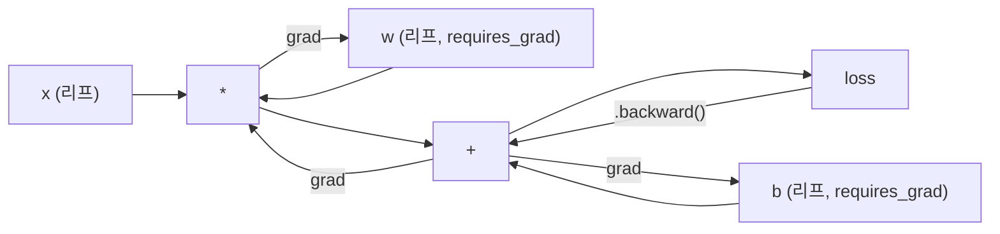
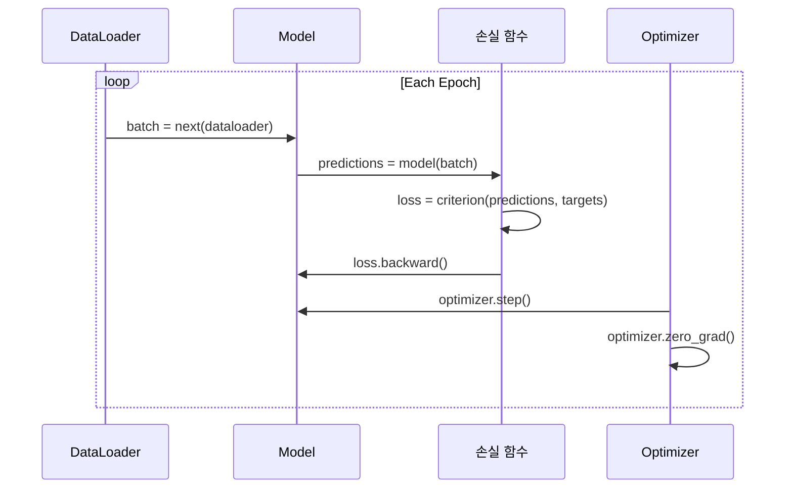

# PyTorch 소개

> 피스톤과 크랭크샤프트부터 엔진을 직접 만들었습니다. 이제 모두가 실제로 사용하는 엔진을 배워 보세요.

**유형:** Build
**언어:** Python
**선수 요건:** 03.10강 (직접 만든 미니 프레임워크)
**시간:** 약 75분

## 학습 목표

- PyTorch의 nn.Module, nn.Sequential, autograd를 사용하여 신경망을 구축하고 학습하기
- PyTorch 텐서, GPU 가속, 표준 학습 루프(zero_grad, forward, loss, backward, step)를 활용하기
- 직접 만든 미니 프레임워크의 구성 요소를 PyTorch의 대응 요소로 변환하기
- 동일한 작업에서 순수 Python 프레임워크와 PyTorch의 학습 속도를 비교하고 프로파일링하기

## 문제점

작동하는 미니 프레임워크가 있습니다. 선형 레이어, ReLU, 드롭아웃(Dropout), 배치 정규화(Batch Norm), Adam, DataLoader, 학습 루프가 모두 포함되어 있습니다. 순수 Python으로 원(circle) 분류 문제를 학습하는 4층 신경망을 훈련할 수 있습니다.

그러나 동일한 문제에서 PyTorch보다 500배 느립니다.

미니 프레임워크는 중첩된 Python 루프를 사용하여 샘플을 하나씩 처리합니다. PyTorch는 동일한 연산을 GPU에서 실행되는 최적화된 C++/CUDA 커널로 디스패치합니다. 단일 NVIDIA A100에서 PyTorch는 ImageNet(128만 이미지)에서 ResNet-50(2,560만 매개변수)를 약 6시간에 학습합니다. 미니 프레임워크는 동일한 작업에 약 3,000시간이 걸리며, 그 전에 메모리가 고갈될 가능성이 높습니다.

속도만이 유일한 격차는 아닙니다. 미니 프레임워크에는 GPU 지원이 없습니다. 자동 미분(Automatic Differentiation)도 없습니다. 모든 모듈에 대해 backward()를 직접 작성했습니다. 직렬화(Serialization), 분산 학습(Distributed Training), 혼합 정밀도(Mixed Precision)도 없습니다. print 문 없이는 기울기 흐름을 디버깅할 방법도 없습니다.

PyTorch는 이러한 격차를 모두 채워 줍니다. 그리고 이미 구축한 것과 동일한 개념 모델(Module, forward(), parameters(), backward(), optimizer.step())을 유지하면서 그렇게 합니다. 개념은 일대일로 전이됩니다. 구문은 거의 동일합니다. 차이점은 PyTorch가 처음부터 설계한 것과 동일한 인터페이스 뒤에 10년간의 시스템 엔지니어링을 감싸고 있다는 점입니다.

## 개념

### PyTorch가 승리한 이유

2015년, TensorFlow는 실행 전에 정적 계산 그래프를 정의해야 했습니다. 그래프를 구축하고, 컴파일한 후 데이터를 입력했습니다. 디버깅은 그래프 시각화를 들여다보는 것을 의미했습니다. 아키텍처를 변경하려면 그래프를 처음부터 다시 구축해야 했습니다.

PyTorch는 2017년, 다른 철학인 eager execution(즉시 실행)으로 출시되었습니다. Python을 작성하면 즉시 실행됩니다. `y = model(x)`는 "나중에 y를 계산하는 그래프에 노드를 추가하는 것"이 아니라, 지금 바로 y를 계산합니다. 이는 표준 Python 디버깅 도구가 작동한다는 것을 의미했습니다. print()가 작동했습니다. pdb가 작동했습니다. forward pass에서의 if/else가 작동했습니다.

2020년, 시장이 답을 제시했습니다. ML 연구 논문에서 PyTorch의 점유율은 7%(2017년)에서 75% 이상(2022년)으로 증가했습니다. Meta, Google DeepMind, OpenAI, Anthropic, Hugging Face는 모두 PyTorch를 주요 프레임워크로 사용합니다. TensorFlow 2.x는 이에 대한 대응으로 eager execution을 채택했습니다 -- 이는 PyTorch의 설계가 옳았다는 묵시적인 인정입니다.

교훈: 개발자 경험은 누적됩니다. 10% 더 느리지만 디버깅이 50% 더 빠른 프레임워크는 매번 승리합니다.

### 텐서(Tensor)

텐서는 shape, dtype, device라는 세 가지 중요한 속성을 가진 다차원 배열입니다.

```python
import torch

x = torch.zeros(3, 4)           # shape: (3, 4), dtype: float32, device: cpu
x = torch.randn(2, 3, 224, 224) # 224x224 크기의 RGB 이미지 2장 배치
x = torch.tensor([1, 2, 3])     # Python 리스트에서
```

**Shape**은 차원 수입니다. 스칼라(scalar)는 shape가 (), 벡터(vector)는 (n,), 행렬(matrix)은 (m, n), 이미지 배치는 (batch, channels, height, width)입니다.

**Dtype**은 정밀도와 메모리를 제어합니다.

| dtype | 비트 | 범위 | 사용 사례 |
|-------|------|-------|----------|
| float32 | 32 | ~7자리 십진수 | 기본 훈련 |
| float16 | 16 | ~3.3자리 십진수 | 혼합 정밀도(Mixed Precision) |
| bfloat16 | 16 | float32와 동일한 범위, 더 낮은 정밀도 | LLM 훈련 |
| int8 | 8 | -128 ~ 127 | 양자화(Quantization) 추론 |

**Device**는 연산이 수행되는 위치를 결정합니다.

```python
device = torch.device("cuda" if torch.cuda.is_available() else "cpu")
x = torch.randn(3, 4, device=device)
x = x.to("cuda")
x = x.cpu()
```

모든 연산은 모든 텐서가 동일한 device에 있어야 합니다. 이는 초보자가 겪는 PyTorch의 #1 오류입니다: `RuntimeError: Expected all tensors to be on the same device`. 연산 전에 모든 것을 동일한 device로 이동하여 해결하세요.

**Reshaping**은 상수 시간(constant-time) 연산입니다 -- 메타데이터를 변경할 뿐, 데이터를 변경하지 않습니다.

```python
x = torch.randn(2, 3, 4)
x.view(2, 12)      # (2, 12)로 reshape -- 연속(contiguous)이어야 합니다
x.reshape(6, 4)    # (6, 4)로 reshape -- 항상 작동합니다
x.permute(2, 0, 1) # 차원 순서 재배열
x.unsqueeze(0)     # 차원 추가: (1, 2, 3, 4)
x.squeeze()        # 크기가 1인 차원 제거
```

### 오토그라드(Autograd)

미니 프레임워크에서는 모든 모듈에 대해 backward()를 구현해야 했습니다. PyTorch는 그렇지 않습니다. PyTorch는 텐서에 대한 모든 연산을 방향성 비순환 그래프(컴퓨팅 그래프)에 기록한 후, 해당 그래프를 역순으로 탐색하여 기울기를 자동으로 계산합니다.



미니 프레임워크와의 주요 차이점: PyTorch는 테이프 기반 오토디프를 사용합니다. 모든 연산은 순전파(foward pass) 중에 "테이프"에 추가됩니다. `.backward()`를 호출하면 테이프를 역순으로 재생합니다.

```python
x = torch.randn(3, requires_grad=True)
y = x ** 2 + 3 * x
z = y.sum()
z.backward()
print(x.grad)  # dz/dx = 2x + 3
```

오토그라드의 세 가지 규칙:

1. `requires_grad=True`가 있는 리프 텐서만 기울기를 누적합니다
2. 기울기는 기본적으로 누적됩니다 -- 각 역전파(backward pass) 전에 `optimizer.zero_grad()`를 호출하세요
3. `torch.no_grad()`는 기울기 추적을 비활성화합니다 (평가 중에 사용하세요)

### nn.Module

`nn.Module`는 PyTorch의 모든 신경망 구성 요소의 기본 클래스입니다. 10강에서 이미 이 추상화를 구축했습니다. PyTorch의 버전은 자동 매개변수 등록, 재귀적 모듈 발견, 장치 관리, 상태 사전(state dict) 직렬화를 추가합니다.

```python
import torch.nn as nn

class MLP(nn.Module):
    def __init__(self, input_dim, hidden_dim, output_dim):
        super().__init__()
        self.layer1 = nn.Linear(input_dim, hidden_dim)
        self.relu = nn.ReLU()
        self.layer2 = nn.Linear(hidden_dim, output_dim)

    def forward(self, x):
        x = self.layer1(x)
        x = self.relu(x)
        x = self.layer2(x)
        return x
```

`__init__`에서 `nn.Module` 또는 `nn.Parameter`를 속성으로 할당하면 PyTorch가 자동으로 등록합니다. `model.parameters()`는 등록된 모든 매개변수를 재귀적으로 수집합니다. 그래서 미니 프레임워크에서처럼 가중치를 수동으로 모을 필요가 없습니다.

핵심 구성 요소:

| 모듈 | 기능 | 매개변수 |
|--------|-------------|------------|
| nn.Linear(in, out) | Wx + b | in*out + out |
| nn.Conv2d(in_ch, out_ch, k) | 2D 합성곱 | in_ch*out_ch*k*k + out_ch |
| nn.BatchNorm1d(features) | 활성화 정규화 | 2 * features |
| nn.Dropout(p) | 랜덤 제로화 | 0 |
| nn.ReLU() | max(0, x) | 0 |
| nn.GELU() | 가우시안 오차 선형 | 0 |
| nn.Embedding(vocab, dim) | 조회 테이블 | vocab * dim |
| nn.LayerNorm(dim) | 샘플별 정규화 | 2 * dim |

### 손실 함수와 옵티마이저

PyTorch는 여러분이 직접 구축했던 모든 기능의 프로덕션 준비 버전을 제공합니다.

**손실 함수** (`torch.nn`에서):

| 손실 | 작업 | 입력 |
|------|------|-------|
| nn.MSELoss() | 회귀 | 모든 형태 |
| nn.CrossEntropyLoss() | 다중 클래스 분류 | 로짓 (softmax 아님) |
| nn.BCEWithLogitsLoss() | 이진 분류 | 로짓 (sigmoid 아님) |
| nn.L1Loss() | 회귀 (강건) | 모든 형태 |
| nn.CTCLoss() | 시퀀스 정렬 | 로그 확률 |

참고: `CrossEntropyLoss`는 내부적으로 `LogSoftmax` + `NLLLoss`를 결합합니다. softmax 출력 대신 원시 로짓을 전달하세요. 이는 조용히 잘못된 기울기를 생성하는 흔한 실수입니다.

**옵티마이저** (`torch.optim`에서):

| 옵티마이저 | 사용 시점 | 일반적인 학습률 |
|-----------|-------------|-----------|
| SGD(params, lr, momentum) | CNN, 잘 튜닝된 파이프라인 | 0.01--0.1 |
| Adam(params, lr) | 기본 시작점 | 1e-3 |
| AdamW(params, lr, weight_decay) | 트랜스포머, 미세 조정 | 1e-4--1e-3 |
| LBFGS(params) | 소규모, 2차 | 1.0 |

### 학습 루프

모든 PyTorch 학습 루프는 동일한 5단계 패턴을 따릅니다. 10강에서 이미 이 내용을 알고 있습니다.



표준 패턴:

```python
for epoch in range(num_epochs):
    model.train()
    for inputs, targets in train_loader:
        inputs, targets = inputs.to(device), targets.to(device)
        optimizer.zero_grad()
        outputs = model(inputs)
        loss = criterion(outputs, targets)
        loss.backward()
        optimizer.step()
```

배치 루프 안의 5줄. GPT-4, Stable Diffusion, LLaMA를 학습시킨 5줄입니다. 아키텍처는 변합니다. 데이터는 변합니다. 이 5줄은 변하지 않습니다.

### 데이터셋과 DataLoader

PyTorch의 `Dataset`는 `__len__`과 `__getitem__`라는 두 메서드를 가진 추상 클래스입니다. `DataLoader`는 이를 배치, 셔플링, 다중 프로세스 데이터 로딩으로 감쌉니다.

```python
from torch.utils.data import Dataset, DataLoader

class MNISTDataset(Dataset):
    def __init__(self, images, labels):
        self.images = images
        self.labels = labels

    def __len__(self):
        return len(self.labels)

    def __getitem__(self, idx):
        return self.images[idx], self.labels[idx]

loader = DataLoader(dataset, batch_size=64, shuffle=True, num_workers=4)
```

`num_workers=4`는 GPU가 현재 배치를 학습하는 동안 데이터를 병렬로 로드하기 위해 4개의 프로세스를 생성합니다. 디스크 바운드 워크로드(대형 이미지, 오디오)에서는 이것만으로 학습 속도가 두 배가 될 수 있습니다.

### GPU 학습

모델을 GPU로 이동하기:

```python
device = torch.device("cuda" if torch.cuda.is_available() else "cpu")
model = model.to(device)
```

이 코드는 모든 매개변수와 버퍼를 GPU로 재귀적으로 이동합니다. 이후 학습 중 각 배치를 이동합니다:

```python
inputs, targets = inputs.to(device), targets.to(device)
```

**혼합 정밀도(Mixed Precision)**는 최신 GPU(A100, H100, RTX 4090)에서 메모리 사용량을 절반으로 줄이고 처리량을 두 배로 늘립니다. 이는 순전파/역전파를 float16으로 실행하면서 마스터 가중치는 float32으로 유지하기 때문입니다:

```python
from torch.amp import autocast, GradScaler

scaler = GradScaler()
for inputs, targets in loader:
    with autocast(device_type="cuda"):
        outputs = model(inputs)
        loss = criterion(outputs, targets)
    scaler.scale(loss).backward()
    scaler.step(optimizer)
    scaler.update()
    optimizer.zero_grad()
```

### 비교: Mini Framework vs PyTorch vs JAX

| 기능 | Mini Framework (L10) | PyTorch | JAX |
|---------|---------------------|---------|-----|
| 자동 미분 | 수동 backward() | 테이프 기반 autograd | 함수적 변환 |
| 실행 | Eager (Python 루프) | Eager (C++ 커널) | Traced + JIT 컴파일 |
| GPU 지원 | 없음 | 있음 (CUDA, ROCm, MPS) | 있음 (CUDA, TPU) |
| 속도 (MNIST MLP) | ~300s/에포크 | ~0.5s/에포크 | ~0.3s/에포크 |
| 모듈 시스템 | Custom Module 클래스 | nn.Module | 상태 비저장 함수 (Flax/Equinox) |
| 디버깅 | print() | print(), pdb, breakpoint() | 어려움 (JIT 트레이싱이 print를 방해) |
| 생태계 | 없음 | Hugging Face, Lightning, timm | Flax, Optax, Orbax |
| 학습 곡선 | 직접 구축 | 중간 | 가파름 (함수적 패러다임) |
| 프로덕션 사용 | 장난감 문제 | Meta, OpenAI, Anthropic, HF | Google DeepMind, Midjourney |

```figure
dropout-mask
```

## 구현하기

PyTorch 기본 요소만 사용하여 MNIST로 학습한 3층 MLP입니다. 고수준 래퍼는 없습니다. `torchvision.datasets`도 없습니다. 원시 데이터를 직접 다운로드하고 파싱합니다.

### 1단계: 원시 파일에서 MNIST 로드하기

MNIST는 4개의 gzipped 파일로 제공됩니다: 학습 이미지 (60,000 x 28 x 28), 학습 레이블, 테스트 이미지 (10,000 x 28 x 28), 테스트 레이블. 이를 다운로드하여 바이너리 형식을 파싱합니다.

```python
import torch
import torch.nn as nn
import struct
import gzip
import urllib.request
import os

def download_mnist(path="./mnist_data"):
    base_url = "https://storage.googleapis.com/cvdf-datasets/mnist/"
    files = [
        "train-images-idx3-ubyte.gz",
        "train-labels-idx1-ubyte.gz",
        "t10k-images-idx3-ubyte.gz",
        "t10k-labels-idx1-ubyte.gz",
    ]
    os.makedirs(path, exist_ok=True)
    for f in files:
        filepath = os.path.join(path, f)
        if not os.path.exists(filepath):
            urllib.request.urlretrieve(base_url + f, filepath)

def load_images(filepath):
    with gzip.open(filepath, "rb") as f:
        magic, num, rows, cols = struct.unpack(">IIII", f.read(16))
        data = f.read()
        images = torch.frombuffer(bytearray(data), dtype=torch.uint8)
        images = images.reshape(num, rows * cols).float() / 255.0
    return images

def load_labels(filepath):
    with gzip.open(filepath, "rb") as f:
        magic, num = struct.unpack(">II", f.read(8))
        data = f.read()
        labels = torch.frombuffer(bytearray(data), dtype=torch.uint8).long()
    return labels
```

### 2단계: 모델 정의하기

3층 MLP: 784 -> 256 -> 128 -> 10. ReLU 활성화 함수를 사용합니다. 정규화를 위해 드롭아웃을 적용합니다. 단순함을 위해 배치 정규화는 사용하지 않습니다.

```python
class MNISTModel(nn.Module):
    def __init__(self):
        super().__init__()
        self.net = nn.Sequential(
            nn.Linear(784, 256),
            nn.ReLU(),
            nn.Dropout(0.2),
            nn.Linear(256, 128),
            nn.ReLU(),
            nn.Dropout(0.2),
            nn.Linear(128, 10),
        )

    def forward(self, x):
        return self.net(x)
```

출력 레이어는 10개의 원시 로짓(Logits)을 생성합니다 (각 숫자당 하나). Softmax는 없습니다 -- `CrossEntropyLoss`가 내부적으로 처리합니다.

매개변수 수: 784*256 + 256 + 256*128 + 128 + 128*10 + 10 = 235,146. 현대 기준으로는 매우 작습니다. GPT-2 small은 124M입니다. 이 모델은 몇 초 만에 학습됩니다.

### 3단계: 학습 루프

정석적인 순전파-손실-역전파-업데이트 패턴입니다.

```python
def train_one_epoch(model, loader, criterion, optimizer, device):
    model.train()
    total_loss = 0
    correct = 0
    total = 0
    for images, labels in loader:
        images, labels = images.to(device), labels.to(device)
        optimizer.zero_grad()
        outputs = model(images)
        loss = criterion(outputs, labels)
        loss.backward()
        optimizer.step()
        total_loss += loss.item() * images.size(0)
        _, predicted = outputs.max(1)
        correct += predicted.eq(labels).sum().item()
        total += labels.size(0)
    return total_loss / total, correct / total


def evaluate(model, loader, criterion, device):
    model.eval()
    total_loss = 0
    correct = 0
    total = 0
    with torch.no_grad():
        for images, labels in loader:
            images, labels = images.to(device), labels.to(device)
            outputs = model(images)
            loss = criterion(outputs, labels)
            total_loss += loss.item() * images.size(0)
            _, predicted = outputs.max(1)
            correct += predicted.eq(labels).sum().item()
            total += labels.size(0)
    return total_loss / total, correct / total
```

평가 중 `torch.no_grad()`을 사용하세요. 이는 오토그라드(Autograd)를 비활성화하여 메모리 사용을 줄이고 추론(Inference) 속도를 높입니다. 이 설정이 없으면 PyTorch는 사용하지 않는 계산 그래프를 구축합니다.

### 4단계: 모든 요소 연결하기

```python
def main():
    device = torch.device("cuda" if torch.cuda.is_available() else "cpu")

    download_mnist()
    train_images = load_images("./mnist_data/train-images-idx3-ubyte.gz")
    train_labels = load_labels("./mnist_data/train-labels-idx1-ubyte.gz")
    test_images = load_images("./mnist_data/t10k-images-idx3-ubyte.gz")
    test_labels = load_labels("./mnist_data/t10k-labels-idx1-ubyte.gz")

    train_dataset = torch.utils.data.TensorDataset(train_images, train_labels)
    test_dataset = torch.utils.data.TensorDataset(test_images, test_labels)
    train_loader = torch.utils.data.DataLoader(
        train_dataset, batch_size=64, shuffle=True
    )
    test_loader = torch.utils.data.DataLoader(
        test_dataset, batch_size=256, shuffle=False
    )

    model = MNISTModel().to(device)
    criterion = nn.CrossEntropyLoss()
    optimizer = torch.optim.Adam(model.parameters(), lr=1e-3)

    num_params = sum(p.numel() for p in model.parameters())
    print(f"Device: {device}")
    print(f"Parameters: {num_params:,}")
    print(f"Train samples: {len(train_dataset):,}")
    print(f"Test samples: {len(test_dataset):,}")
    print()

    for epoch in range(10):
        train_loss, train_acc = train_one_epoch(
            model, train_loader, criterion, optimizer, device
        )
        test_loss, test_acc = evaluate(
            model, test_loader, criterion, device
        )
        print(
            f"Epoch {epoch+1:2d} | "
            f"Train Loss: {train_loss:.4f} | Train Acc: {train_acc:.4f} | "
            f"Test Loss: {test_loss:.4f} | Test Acc: {test_acc:.4f}"
        )

    torch.save(model.state_dict(), "mnist_mlp.pt")
    print(f"\nModel saved to mnist_mlp.pt")
    print(f"Final test accuracy: {test_acc:.4f}")
```

10에포크(Epoch) 후 예상 출력: 테스트 정확도 약 97.8%. CPU에서의 학습 시간: 약 30초. GPU에서의 학습 시간: 약 5초. 동일한 아키텍처의 미니 프레임워크에서의 학습 시간: 약 45분.

## 사용하기

### 간단한 비교: 미니 프레임워크 vs PyTorch

| 미니 프레임워크 (10강) | PyTorch |
|---------------------------|---------|
| `model = Sequential(Linear(784, 256), ReLU(), ...)` | `model = nn.Sequential(nn.Linear(784, 256), nn.ReLU(), ...)` |
| `pred = model.forward(x)` | `pred = model(x)` |
| `optimizer.zero_grad()` | `optimizer.zero_grad()` |
| `grad = criterion.backward()` 후 `model.backward(grad)` | `loss.backward()` |
| `optimizer.step()` | `optimizer.step()` |
| GPU 없음 | `model.to("cuda")` |
| 모든 모듈에 대해 수동 역전파(Backpropagation) | 오토그라드(Autograd)가 모든 처리를 담당 |

인터페이스는 거의 동일합니다. 차이는 내부 구현에 있습니다.

### 모델 저장 및 로드

```python
torch.save(model.state_dict(), "model.pt")

model = MNISTModel()
model.load_state_dict(torch.load("model.pt", weights_only=True))
model.eval()
```

모델 객체가 아닌 `state_dict()` (매개변수 사전)을 항상 저장하세요. 모델 객체를 저장하면 pickle을 사용하며, 이는 코드를 리팩터링할 때 문제가 발생합니다. 상태 사전(state dict)은 이식성이 좋습니다.

### 학습률 스케줄(Learning Rate Schedule)

```python
scheduler = torch.optim.lr_scheduler.CosineAnnealingLR(
    optimizer, T_max=10
)
for epoch in range(10):
    train_one_epoch(model, train_loader, criterion, optimizer, device)
    scheduler.step()
```

PyTorch는 StepLR, ExponentialLR, CosineAnnealingLR, OneCycleLR, ReduceLROnPlateau 등 15개 이상의 스케줄러를 제공합니다. 모두 동일한 옵티마이저(Optimizer) 인터페이스에 연결할 수 있습니다.

## 출시하기

이 강의는 두 가지 산출물을 생성합니다:

- `outputs/prompt-pytorch-debugger.md` -- 일반적인 PyTorch 학습 실패를 진단하기 위한 프롬프트
- `outputs/skill-pytorch-patterns.md` -- PyTorch 학습 패턴에 대한 스킬 참조

## 연습 문제

1. **배치 정규화(Batch Normalization) 추가.** 각 선형 레이어의 활성화 함수(Activation Function) 전에 `nn.BatchNorm1d`을 삽입하세요. 드롭아웃(Dropout) 전용 버전과 테스트 정확도 및 학습 속도를 비교하세요. 배치 정규화는 더 적은 에포크(Epoch)로 98% 이상의 정확도에 도달해야 합니다.

2. **학습률 파인더(Learning Rate Finder) 구현.** 학습률을 지수적으로 증가시키며 (1e-7에서 1.0까지) 한 에포크(Epoch) 동안 학습하세요. 손실(Loss) 대 학습률(LR)을 플롯하세요. 최적의 학습률은 손실이 상승하기 시작하기 직전입니다. 이를 사용하여 MNIST 모델에 더 나은 학습률을 선택하세요.

3. **혼합 정밀도(Mixed Precision)로 GPU에 이식하기.** 학습 루프에 `torch.amp.autocast`와 `GradScaler`를 추가하세요. GPU에서 혼합 정밀도 사용 여부에 따른 처리량(초당 샘플 수)을 측정해 보세요. A100에서는 약 2배의 속도 향상을 기대할 수 있습니다.

4. **사용자 정의 Dataset 만들기.** Fashion-MNIST를 다운로드하세요 (MNIST와 동일한 형식이지만 의류 항목을 포함합니다). `FashionMNISTDataset(Dataset)` 클래스를 `__getitem__`와 `__len__`를 사용하여 구현하세요. 동일한 MLP를 학습하고 정확도를 비교하세요. Fashion-MNIST는 더 어렵습니다 -- 약 88% vs 약 98%를 기대해 보세요.

5. **Adam을 SGD + 모멘텀으로 교체하기.** `SGD(params, lr=0.01, momentum=0.9)`로 학습하세요. 수렴 곡선을 비교하세요. 그런 다음 `CosineAnnealingLR` 스케줄러를 추가하고 SGD가 에포크(Epoch) 10까지 Adam을 따라잡는지 확인해 보세요.

## 핵심 용어

| 용어 | 사람들이 말하는 것 | 실제 의미 |
|------|----------------|----------------------|
| Tensor | "다차원 배열" | 모든 연산에 자동 미분 지원이 내장된 타입 지정 및 디바이스 인식 배열 |
| Autograd | "자동 역전파(Backprop)" | 순방향 패스 동안 연산을 기록(tape)한 후, 이를 역순으로 재생하여 정확한 기울기(Gradient)를 계산하는 시스템 |
| nn.Module | "레이어" | 모든 미분 가능한 계산 블록의 기본 클래스 -- 매개변수(Parameter) 등록, 중첩 지원, 학습/평가 모드 처리 |
| state_dict | "모델 가중치(Weight)" | 매개변수 이름과 텐서(Tensor)를 매핑하는 OrderedDict -- 학습된 모델의 휴대 가능하고 직렬화 가능한 표현 |
| .backward() | "기울기 계산" | 계산 그래프를 역순으로 순회하며 requires_grad=True인 모든 리프 텐서에 대해 기울기를 계산하고 누적 |
| .to(device) | "GPU로 이동" | 모든 매개변수와 버퍼를 지정된 디바이스(CPU, CUDA, MPS)로 재귀적으로 전송 |
| DataLoader | "데이터 파이프라인" | Dataset에서 데이터를 배치(batch), 셔플(shuffle)하고 선택적으로 병렬화하여 로드하는 반복자 |
| Mixed Precision | "float16 사용" | 속도 향상을 위해 float16으로 순방향/역방향 학습을 수행하면서, 수치적 안정성을 위해 float32 마스터 가중치를 유지 |
| Eager execution | "지금 실행" | 연산이 호출 즉시 실행되며, 나중에 컴파일 단계로 지연되지 않음 -- PyTorch를 TF 1.x와 구분하는 핵심 설계 선택 |
| zero_grad | "그라디언트 초기화" | PyTorch는 기본적으로 기울기를 누적하므로, 다음 역전파 전에 모든 매개변수 기울기를 0으로 설정합니다 |

## 추가 읽기

- Paszke et al., "PyTorch: An Imperative Style, High-Performance Deep Learning Library" (2019) -- PyTorch의 설계 트레이드오프를 설명하는 원 논문
- PyTorch 튜토리얼: "Learning PyTorch with Examples" (https://pytorch.org/tutorials/beginner/pytorch_with_examples.html) -- 텐서에서 nn.Module까지 공식 학습 경로
- PyTorch 성능 튜닝 가이드 (https://pytorch.org/tutorials/recipes/recipes/tuning_guide.html) -- 혼합 정밀도, DataLoader 워커, 고정 메모리 및 기타 프로덕션 최적화
- Horace He, "Making Deep Learning Go Brrrr" (https://horace.io/brrr_intro.html) -- GPU 학습이 빠른 이유와 PyTorch 특화 최적화 전략
