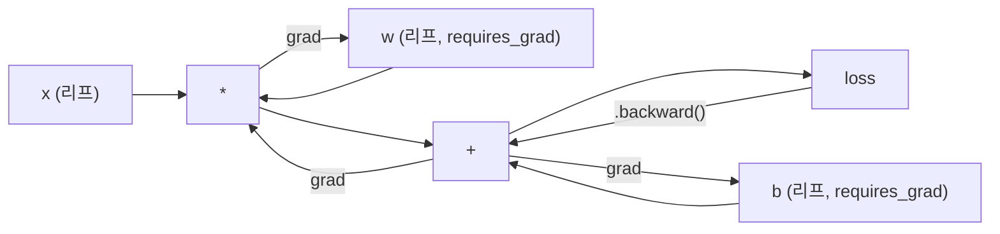
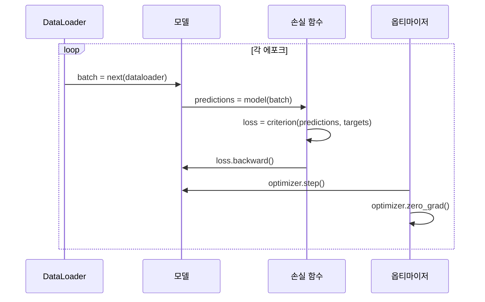

# PyTorch 입문 (Introduction to PyTorch)

> 피스톤과 크랭크축으로 엔진을 만들었습니다. 이제 모두가 실제로 타는 차를 배웁니다.

**Type:** Build
**Languages:** Python
**Prerequisites:** Lesson 03.10 (Build Your Own Mini Framework)
**Time:** ~75 minutes

## 학습 목표 (Learning Objectives)

- PyTorch의 nn.Module, nn.Sequential, autograd로 신경망을 만들고 학습합니다
- PyTorch 텐서, GPU 가속, 표준 학습 루프(zero_grad, forward, loss, backward, step)를 사용합니다
- 직접 만든 미니 프레임워크 구성 요소를 PyTorch 대응물로 변환합니다
- 같은 작업에서 순수 Python 프레임워크와 PyTorch의 학습 속도를 프로파일하고 비교합니다

## 문제 상황 (The Problem)

동작하는 미니 프레임워크가 있습니다. Linear, ReLU, dropout, batch norm, Adam, DataLoader, 학습 루프. 순수 Python으로 원 분류 문제에 4층 네트워크를 학습합니다.

같은 문제에서 PyTorch보다 500배 느립니다.

미니 프레임워크는 중첩 Python 루프로 샘플을 하나씩 처리합니다. PyTorch는 같은 연산을 GPU에서 도는 최적화된 C++/CUDA 커널로 보냅니다. NVIDIA A100 하나에서 PyTorch는 ResNet-50(2,560만 파라미터)을 ImageNet(128만 이미지)에서 약 6시간에 학습합니다. 당신 프레임워크는 같은 작업에 대략 3,000시간이 걸립니다 — 메모리부터 안 터진다면요.

속도만의 격차가 아닙니다. GPU 지원 없음. 자동 미분 없음 — 모든 모듈에 backward()를 손으로 썼습니다. 직렬화 없음. 분산 학습 없음. 혼합 정밀도 없음. print 없이 기울기 흐름을 디버깅할 방법도 없습니다.

PyTorch가 이 빈틈을 모두 채웁니다. 그리고 이미 만든 바로 그 멘탈 모델 — Module, forward(), parameters(), backward(), optimizer.step() — 을 유지합니다. 개념은 일대일로 이전됩니다. 문법은 거의 동일합니다. 차이는 PyTorch가 당신이 처음부터 설계한 같은 인터페이스 뒤에 십 년의 시스템 엔지니어링을 감쌌다는 점입니다.

## 핵심 개념 (The Concept)

### PyTorch가 이긴 이유 (Why PyTorch Won)

2015년 TensorFlow는 무엇을 실행하기 전에 정적 계산 그래프를 정의해야 했습니다. 그래프를 만들고, 컴파일하고, 데이터를 흘렸습니다. 디버깅은 그래프 시각화를 보는 일이었습니다. 아키텍처를 바꾸면 그래프를 처음부터 다시 만들어야 했습니다.

PyTorch는 2017년에 다른 철학으로 출시했습니다. 즉시 실행(eager execution). Python을 쓰면 바로 실행됩니다. `y = model(x)`는 지금 y를 계산합니다. "나중에 y를 계산할 노드를 그래프에 추가"가 아닙니다. 표준 Python 디버깅 도구가 동작했습니다. print()가 됐습니다. pdb가 됐습니다. forward 안의 if/else가 됐습니다.

2020년이면 시장이 답을 냈습니다. ML 연구 논문에서 PyTorch 점유율은 7%(2017)에서 75% 이상(2022)으로 올랐습니다. Meta, Google DeepMind, OpenAI, Anthropic, Hugging Face가 모두 PyTorch를 주 프레임워크로 씁니다. TensorFlow 2.x가 즉시 실행을 채택한 것은 — PyTorch의 설계가 맞았다는 묵시적 인정입니다.

교훈: 개발자 경험은 복리로 쌓입니다. 10% 느리지만 디버깅이 50% 빠른 프레임워크가 매번 이깁니다.

### 텐서 (Tensors)

텐서는 세 가지 핵심 속성을 가진 다차원 배열입니다. shape, dtype, device.

```python
import torch

x = torch.zeros(3, 4)           # shape: (3, 4), dtype: float32, device: cpu
x = torch.randn(2, 3, 224, 224) # batch of 2 RGB images, 224x224
x = torch.tensor([1, 2, 3])     # from a Python list
```

**Shape**는 차원입니다. 스칼라는 (), 벡터는 (n,), 행렬은 (m, n), 이미지 배치는 (batch, channels, height, width).

**Dtype**은 정밀도와 메모리를 제어합니다.

| dtype | Bits | Range | Use case |
|-------|------|-------|----------|
| float32 | 32 | ~7 decimal digits | Default training |
| float16 | 16 | ~3.3 decimal digits | Mixed precision |
| bfloat16 | 16 | Same range as float32, less precision | LLM training |
| int8 | 8 | -128 to 127 | Quantized inference |

**Device**는 계산이 어디서 일어나는지 정합니다.

```python
device = torch.device("cuda" if torch.cuda.is_available() else "cpu")
x = torch.randn(3, 4, device=device)
x = x.to("cuda")
x = x.cpu()
```

모든 연산은 텐서가 같은 디바이스에 있어야 합니다. 초보자가 가장 많이 만나는 PyTorch 오류입니다. `RuntimeError: Expected all tensors to be on the same device`. 계산 전에 모두 같은 디바이스로 옮기면 해결됩니다.

**Reshaping**은 상수 시간입니다 — 데이터가 아니라 메타데이터를 바꿉니다.

```python
x = torch.randn(2, 3, 4)
x.view(2, 12)      # reshape to (2, 12) -- must be contiguous
x.reshape(6, 4)    # reshape to (6, 4) -- works always
x.permute(2, 0, 1) # reorder dimensions
x.unsqueeze(0)     # add dimension: (1, 2, 3, 4)
x.squeeze()        # remove size-1 dimensions
```

### Autograd

미니 프레임워크에서는 모든 모듈에 backward()를 구현해야 했습니다. PyTorch는 그렇지 않습니다. 텐서 위의 모든 연산을 방향성 비순환 그래프(계산 그래프)에 기록한 뒤, 그 그래프를 역으로 순회해 기울기를 자동으로 계산합니다.



당신 프레임워크와의 핵심 차이: PyTorch는 테이프 기반 autodiff를 씁니다. 순전파 중 모든 연산이 "테이프"에 추가됩니다. `.backward()`를 호출하면 테이프를 역으로 재생합니다.

```python
x = torch.randn(3, requires_grad=True)
y = x ** 2 + 3 * x
z = y.sum()
z.backward()
print(x.grad)  # dz/dx = 2x + 3
```

Autograd 세 가지 규칙:

1. `requires_grad=True`인 리프 텐서만 기울기를 누적합니다
2. 기울기는 기본적으로 누적됩니다 — 매 역전파 전에 `optimizer.zero_grad()`를 호출하세요
3. `torch.no_grad()`는 기울기 추적을 끕니다 (평가 시 사용)

### nn.Module

`nn.Module`은 PyTorch의 모든 신경망 구성 요소의 베이스 클래스입니다. Lesson 10에서 이미 이 추상화를 만들었습니다. PyTorch 버전은 자동 파라미터 등록, 재귀 모듈 탐색, 디바이스 관리, state dict 직렬화를 더합니다.

```python
import torch.nn as nn

class MLP(nn.Module):
    def __init__(self, input_dim, hidden_dim, output_dim):
        super().__init__()
        self.layer1 = nn.Linear(input_dim, hidden_dim)
        self.relu = nn.ReLU()
        self.layer2 = nn.Linear(hidden_dim, output_dim)

    def forward(self, x):
        x = self.layer1(x)
        x = self.relu(x)
        x = self.layer2(x)
        return x
```

`__init__`에서 `nn.Module` 또는 `nn.Parameter`를 속성으로 할당하면 PyTorch가 자동으로 등록합니다. `model.parameters()`는 등록된 모든 파라미터를 재귀적으로 모읍니다. 미니 프레임워크에서처럼 가중치를 수동으로 모을 필요가 없는 이유입니다.

핵심 빌딩 블록:

| Module | What it does | Parameters |
|--------|-------------|------------|
| nn.Linear(in, out) | Wx + b | in*out + out |
| nn.Conv2d(in_ch, out_ch, k) | 2D convolution | in_ch*out_ch*k*k + out_ch |
| nn.BatchNorm1d(features) | Normalize activations | 2 * features |
| nn.Dropout(p) | Random zeroing | 0 |
| nn.ReLU() | max(0, x) | 0 |
| nn.GELU() | Gaussian error linear | 0 |
| nn.Embedding(vocab, dim) | Lookup table | vocab * dim |
| nn.LayerNorm(dim) | Per-sample normalization | 2 * dim |

### 손실 함수와 옵티마이저 (Loss Functions and Optimizers)

PyTorch는 당신이 만든 모든 것의 프로덕션 버전을 제공합니다.

**손실 함수** (`torch.nn`에서):

| Loss | Task | Input |
|------|------|-------|
| nn.MSELoss() | Regression | Any shape |
| nn.CrossEntropyLoss() | Multi-class classification | Logits (not softmax) |
| nn.BCEWithLogitsLoss() | Binary classification | Logits (not sigmoid) |
| nn.L1Loss() | Regression (robust) | Any shape |
| nn.CTCLoss() | Sequence alignment | Log probabilities |

참고: `CrossEntropyLoss`는 내부적으로 `LogSoftmax` + `NLLLoss`를 합칩니다. Softmax 출력이 아니라 raw logits를 넘기세요. 흔히 하는 실수이며, 잘못된 기울기가 조용히 나옵니다.

**옵티마이저** (`torch.optim`에서):

| Optimizer | When to use | Typical LR |
|-----------|-------------|-----------|
| SGD(params, lr, momentum) | CNNs, well-tuned pipelines | 0.01--0.1 |
| Adam(params, lr) | Default starting point | 1e-3 |
| AdamW(params, lr, weight_decay) | Transformers, fine-tuning | 1e-4--1e-3 |
| LBFGS(params) | Small-scale, second-order | 1.0 |

### 학습 루프 (The Training Loop)

모든 PyTorch 학습 루프는 같은 5단계 패턴을 따릅니다. Lesson 10에서 이미 압니다.



정석 패턴:

```python
for epoch in range(num_epochs):
    model.train()
    for inputs, targets in train_loader:
        inputs, targets = inputs.to(device), targets.to(device)
        optimizer.zero_grad()
        outputs = model(inputs)
        loss = criterion(outputs, targets)
        loss.backward()
        optimizer.step()
```

배치 루프 안의 다섯 줄. GPT-4, Stable Diffusion, LLaMA를 학습시킨 다섯 줄입니다. 아키텍처는 바뀝니다. 데이터는 바뀝니다. 이 다섯 줄은 바뀌지 않습니다.

### Dataset과 DataLoader

PyTorch의 `Dataset`은 `__len__`과 `__getitem__` 두 메서드를 가진 추상 클래스입니다. `DataLoader`가 배칭, 셔플링, 멀티프로세스 데이터 로딩으로 감쌉니다.

```python
from torch.utils.data import Dataset, DataLoader

class MNISTDataset(Dataset):
    def __init__(self, images, labels):
        self.images = images
        self.labels = labels

    def __len__(self):
        return len(self.labels)

    def __getitem__(self, idx):
        return self.images[idx], self.labels[idx]

loader = DataLoader(dataset, batch_size=64, shuffle=True, num_workers=4)
```

`num_workers=4`는 GPU가 현재 배치를 학습하는 동안 데이터를 병렬로 로드하는 프로세스 4개를 띄웁니다. 디스크 바운드 워크로드(큰 이미지, 오디오)에서는 이것만으로 학습 속도가 두 배가 될 수 있습니다.

### GPU 학습 (GPU Training)

모델을 GPU로 옮기기:

```python
device = torch.device("cuda" if torch.cuda.is_available() else "cpu")
model = model.to(device)
```

모든 파라미터와 버퍼를 재귀적으로 GPU로 옮깁니다. 학습 중에는 각 배치를 옮기세요:

```python
inputs, targets = inputs.to(device), targets.to(device)
```

**혼합 정밀도(Mixed precision)**는 순전파/역전파를 float16으로 돌리고 마스터 가중치는 float32로 유지해, 현대 GPU(A100, H100, RTX 4090)에서 메모리를 절반으로 줄이고 처리량을 두 배로 올립니다:

```python
from torch.amp import autocast, GradScaler

scaler = GradScaler()
for inputs, targets in loader:
    with autocast(device_type="cuda"):
        outputs = model(inputs)
        loss = criterion(outputs, targets)
    scaler.scale(loss).backward()
    scaler.step(optimizer)
    scaler.update()
    optimizer.zero_grad()
```

### 비교: 미니 프레임워크 vs PyTorch vs JAX (Comparison)

| Feature | Mini Framework (L10) | PyTorch | JAX |
|---------|---------------------|---------|-----|
| Autodiff | Manual backward() | Tape-based autograd | Functional transforms |
| Execution | Eager (Python loops) | Eager (C++ kernels) | Traced + JIT compiled |
| GPU support | No | Yes (CUDA, ROCm, MPS) | Yes (CUDA, TPU) |
| Speed (MNIST MLP) | ~300s/epoch | ~0.5s/epoch | ~0.3s/epoch |
| Module system | Custom Module class | nn.Module | Stateless functions (Flax/Equinox) |
| Debugging | print() | print(), pdb, breakpoint() | Harder (JIT tracing breaks print) |
| Ecosystem | None | Hugging Face, Lightning, timm | Flax, Optax, Orbax |
| Learning curve | You built it | Moderate | Steep (functional paradigm) |
| Production use | Toy problems | Meta, OpenAI, Anthropic, HF | Google DeepMind, Midjourney |

```figure
dropout-mask
```

## 직접 만들기 (Build It)

PyTorch 원시 요소만으로 MNIST에서 학습하는 3층 MLP. 고수준 래퍼 없음. `torchvision.datasets` 없음. 원본 데이터를 직접 다운로드하고 파싱합니다.

### Step 1: 원본 파일에서 MNIST 로드

MNIST는 gzip 파일 4개로 제공됩니다. 학습 이미지(60,000 x 28 x 28), 학습 라벨, 테스트 이미지(10,000 x 28 x 28), 테스트 라벨. 다운로드하고 바이너리 형식을 파싱합니다.

```python
import torch
import torch.nn as nn
import struct
import gzip
import urllib.request
import os

def download_mnist(path="./mnist_data"):
    base_url = "https://storage.googleapis.com/cvdf-datasets/mnist/"
    files = [
        "train-images-idx3-ubyte.gz",
        "train-labels-idx1-ubyte.gz",
        "t10k-images-idx3-ubyte.gz",
        "t10k-labels-idx1-ubyte.gz",
    ]
    os.makedirs(path, exist_ok=True)
    for f in files:
        filepath = os.path.join(path, f)
        if not os.path.exists(filepath):
            urllib.request.urlretrieve(base_url + f, filepath)

def load_images(filepath):
    with gzip.open(filepath, "rb") as f:
        magic, num, rows, cols = struct.unpack(">IIII", f.read(16))
        data = f.read()
        images = torch.frombuffer(bytearray(data), dtype=torch.uint8)
        images = images.reshape(num, rows * cols).float() / 255.0
    return images

def load_labels(filepath):
    with gzip.open(filepath, "rb") as f:
        magic, num = struct.unpack(">II", f.read(8))
        data = f.read()
        labels = torch.frombuffer(bytearray(data), dtype=torch.uint8).long()
    return labels
```

### Step 2: 모델 정의

3층 MLP: 784 -> 256 -> 128 -> 10. ReLU 활성화. 정규화용 Dropout. 단순화를 위해 batch norm은 없습니다.

```python
class MNISTModel(nn.Module):
    def __init__(self):
        super().__init__()
        self.net = nn.Sequential(
            nn.Linear(784, 256),
            nn.ReLU(),
            nn.Dropout(0.2),
            nn.Linear(256, 128),
            nn.ReLU(),
            nn.Dropout(0.2),
            nn.Linear(128, 10),
        )

    def forward(self, x):
        return self.net(x)
```

출력층은 숫자당 하나, raw logits 10개를 냅니다. Softmax 없음 — `CrossEntropyLoss`가 내부에서 처리합니다.

파라미터 수: 784*256 + 256 + 256*128 + 128 + 128*10 + 10 = 235,146. 현대 기준으로는 작습니다. GPT-2 small은 1.24억. 이건 몇 초면 학습됩니다.

### Step 3: 학습 루프

정석 forward-loss-backward-step 패턴.

```python
def train_one_epoch(model, loader, criterion, optimizer, device):
    model.train()
    total_loss = 0
    correct = 0
    total = 0
    for images, labels in loader:
        images, labels = images.to(device), labels.to(device)
        optimizer.zero_grad()
        outputs = model(images)
        loss = criterion(outputs, labels)
        loss.backward()
        optimizer.step()
        total_loss += loss.item() * images.size(0)
        _, predicted = outputs.max(1)
        correct += predicted.eq(labels).sum().item()
        total += labels.size(0)
    return total_loss / total, correct / total


def evaluate(model, loader, criterion, device):
    model.eval()
    total_loss = 0
    correct = 0
    total = 0
    with torch.no_grad():
        for images, labels in loader:
            images, labels = images.to(device), labels.to(device)
            outputs = model(images)
            loss = criterion(outputs, labels)
            total_loss += loss.item() * images.size(0)
            _, predicted = outputs.max(1)
            correct += predicted.eq(labels).sum().item()
            total += labels.size(0)
    return total_loss / total, correct / total
```

평가 시 `torch.no_grad()`에 주목하세요. Autograd를 끄면 메모리 사용이 줄고 추론이 빨라집니다. 없으면 쓰지 않는 계산 그래프를 PyTorch가 만듭니다.

### Step 4: 모두 연결하기

```python
def main():
    device = torch.device("cuda" if torch.cuda.is_available() else "cpu")

    download_mnist()
    train_images = load_images("./mnist_data/train-images-idx3-ubyte.gz")
    train_labels = load_labels("./mnist_data/train-labels-idx1-ubyte.gz")
    test_images = load_images("./mnist_data/t10k-images-idx3-ubyte.gz")
    test_labels = load_labels("./mnist_data/t10k-labels-idx1-ubyte.gz")

    train_dataset = torch.utils.data.TensorDataset(train_images, train_labels)
    test_dataset = torch.utils.data.TensorDataset(test_images, test_labels)
    train_loader = torch.utils.data.DataLoader(
        train_dataset, batch_size=64, shuffle=True
    )
    test_loader = torch.utils.data.DataLoader(
        test_dataset, batch_size=256, shuffle=False
    )

    model = MNISTModel().to(device)
    criterion = nn.CrossEntropyLoss()
    optimizer = torch.optim.Adam(model.parameters(), lr=1e-3)

    num_params = sum(p.numel() for p in model.parameters())
    print(f"Device: {device}")
    print(f"Parameters: {num_params:,}")
    print(f"Train samples: {len(train_dataset):,}")
    print(f"Test samples: {len(test_dataset):,}")
    print()

    for epoch in range(10):
        train_loss, train_acc = train_one_epoch(
            model, train_loader, criterion, optimizer, device
        )
        test_loss, test_acc = evaluate(
            model, test_loader, criterion, device
        )
        print(
            f"Epoch {epoch+1:2d} | "
            f"Train Loss: {train_loss:.4f} | Train Acc: {train_acc:.4f} | "
            f"Test Loss: {test_loss:.4f} | Test Acc: {test_acc:.4f}"
        )

    torch.save(model.state_dict(), "mnist_mlp.pt")
    print(f"\nModel saved to mnist_mlp.pt")
    print(f"Final test accuracy: {test_acc:.4f}")
```

10 에포크 후 기대 출력: 테스트 정확도 ~97.8%. CPU 학습 시간: ~30초. GPU: ~5초. 같은 아키텍처의 미니 프레임워크: ~45분.

## 활용하기 (Use It)

### 빠른 비교: 미니 프레임워크 vs PyTorch

| Mini Framework (Lesson 10) | PyTorch |
|---------------------------|---------|
| `model = Sequential(Linear(784, 256), ReLU(), ...)` | `model = nn.Sequential(nn.Linear(784, 256), nn.ReLU(), ...)` |
| `pred = model.forward(x)` | `pred = model(x)` |
| `optimizer.zero_grad()` | `optimizer.zero_grad()` |
| `grad = criterion.backward()` then `model.backward(grad)` | `loss.backward()` |
| `optimizer.step()` | `optimizer.step()` |
| No GPU | `model.to("cuda")` |
| Manual backward for every module | Autograd handles everything |

인터페이스는 거의 동일합니다. 차이는 후드 아래의 전부입니다.

### 모델 저장과 로드

```python
torch.save(model.state_dict(), "model.pt")

model = MNISTModel()
model.load_state_dict(torch.load("model.pt", weights_only=True))
model.eval()
```

항상 `state_dict()`(파라미터 딕셔너리)를 저장하고, 모델 객체 자체는 저장하지 마세요. 모델 객체 저장은 pickle을 쓰며, 코드를 리팩터하면 깨집니다. State dict는 이식 가능합니다.

### 학습률 스케줄링

```python
scheduler = torch.optim.lr_scheduler.CosineAnnealingLR(
    optimizer, T_max=10
)
for epoch in range(10):
    train_one_epoch(model, train_loader, criterion, optimizer, device)
    scheduler.step()
```

PyTorch는 15개 이상의 스케줄러를 제공합니다. StepLR, ExponentialLR, CosineAnnealingLR, OneCycleLR, ReduceLROnPlateau. 모두 같은 옵티마이저 인터페이스에 꽂힙니다.

## 산출물 (Ship It)

이 레슨이 만드는 산출물 두 개:

- `outputs/prompt-pytorch-debugger.md` -- 흔한 PyTorch 학습 실패를 진단하는 프롬프트
- `outputs/skill-pytorch-patterns.md` -- PyTorch 학습 패턴 스킬 레퍼런스

## 연습 문제 (Exercises)

1. **배치 정규화 추가.** 각 Linear 레이어 뒤(활성화 전)에 `nn.BatchNorm1d`를 넣으세요. Dropout만 쓴 버전과 테스트 정확도·학습 속도를 비교하세요. BatchNorm은 더 적은 에포크에 98%+에 도달해야 합니다.

2. **학습률 파인더 구현.** 학습률을 지수적으로 올리며(1e-7에서 1.0) 한 에포크를 학습하세요. loss vs LR을 그리세요. 최적 LR은 loss가 오르기 직전입니다. 이걸로 MNIST 모델에 더 나은 LR을 고르세요.

3. **혼합 정밀도로 GPU 이식.** 학습 루프에 `torch.amp.autocast`와 `GradScaler`를 추가하세요. GPU에서 혼합 정밀도 유무에 따른 처리량(samples/second)을 측정하세요. A100에서는 ~2배 속도 향상을 기대하세요.

4. **커스텀 Dataset 만들기.** Fashion-MNIST를 다운로드하세요(MNIST와 같은 형식, 의류 아이템). `__getitem__`과 `__len__`이 있는 `FashionMNISTDataset(Dataset)` 클래스를 구현하세요. 같은 MLP로 학습하고 정확도를 비교하세요. Fashion-MNIST가 더 어렵습니다 — ~88% vs ~98%를 기대하세요.

5. **Adam을 SGD + momentum으로 교체.** `SGD(params, lr=0.01, momentum=0.9)`로 학습하세요. 수렴 곡선을 비교하세요. 그다음 `CosineAnnealingLR` 스케줄러를 추가하고, 에포크 10까지 SGD가 Adam을 따라잡는지 보세요.

## 핵심 용어 (Key Terms)

| 용어 | 사람들이 말하는 것 | 실제로 의미하는 것 |
|------|----------------|----------------------|
| Tensor | "다차원 배열" | 타입·디바이스를 알고, 모든 연산에 자동 미분이 내장된 배열 |
| Autograd | "자동 역전파" | 순전파 중 연산을 기록한 뒤 역으로 재생해 정확한 기울기를 계산하는 테이프 기반 시스템 |
| nn.Module | "레이어" | 미분 가능한 계산 블록의 베이스 클래스 — 파라미터 등록, 중첩, train/eval 모드 |
| state_dict | "모델 가중치" | 파라미터 이름을 텐서에 매핑하는 OrderedDict — 학습된 모델의 이식 가능·직렬화 가능 표현 |
| .backward() | "기울기 계산" | 계산 그래프를 역으로 순회하며 requires_grad=True인 모든 리프 텐서의 기울기를 계산·누적 |
| .to(device) | "GPU로 옮기기" | 모든 파라미터와 버퍼를 지정 디바이스(CPU, CUDA, MPS)로 재귀 전송 |
| DataLoader | "데이터 파이프라인" | Dataset에서 배칭·셔플·선택적 병렬 로딩을 하는 이터레이터 |
| Mixed precision | "float16 쓰기" | 속도용 float16 순전파/역전파와 수치 안정성용 float32 마스터 가중치로 학습 |
| Eager execution | "지금 실행" | 연산을 호출 즉시 실행하고, 나중 컴파일 단계로 미루지 않음 — TF 1.x와 구별하는 핵심 설계 |
| zero_grad | "기울기 리셋" | 다음 역전파 전에 모든 파라미터 기울기를 0으로 — PyTorch는 기본적으로 기울기를 누적 |

## 더 읽을거리 (Further Reading)

- Paszke et al., "PyTorch: An Imperative Style, High-Performance Deep Learning Library" (2019) -- PyTorch 설계 트레이드오프를 설명하는 원 논문
- PyTorch Tutorials: "Learning PyTorch with Examples" (https://pytorch.org/tutorials/beginner/pytorch_with_examples.html) -- 텐서에서 nn.Module까지의 공식 경로
- PyTorch Performance Tuning Guide (https://pytorch.org/tutorials/recipes/recipes/tuning_guide.html) -- 혼합 정밀도, DataLoader workers, pinned memory 등 프로덕션 최적화
- Horace He, "Making Deep Learning Go Brrrr" (https://horace.io/brrr_intro.html) -- GPU 학습이 빠른 이유와 PyTorch 특화 최적화 전략
